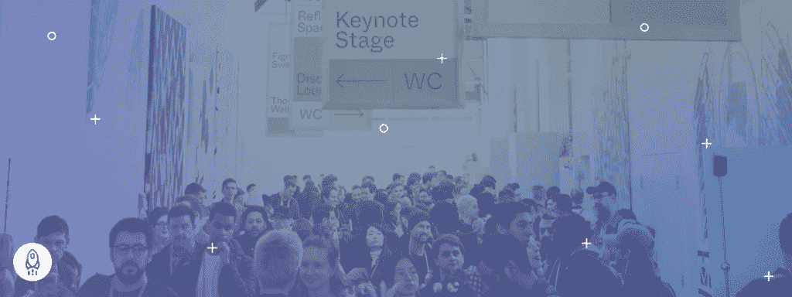

# 面向数据专业人员的顶级会议

> 原文：<https://www.dataquest.io/blog/top-conferences-for-data-professionals/>

November 23, 2021

说到数据科学，我们都知道发展知识和技能的一个很好的方法就是一头扎进去做工作。然而，在数据科学领域，还有另一种方法可以让学习曲线变平，那就是向更有经验、更成功的数据专业人士学习，他们可以分享他们的专业知识，教你做生意的诀窍。获得这种机会的最佳方式之一是参加数据科学会议。

世界各地都有很多这样的会议，有面对面的，也有虚拟的。这些会议将行业领袖和杰出的数据专业人士聚集在一起，共同学习、分享想法和发展职业技能。如果您是任何类型的数据专业人员，参加数据科学会议可能是发展技术技能、扩展专业网络和保持数据科学最新发展前沿的最佳方式。

以下是您应该了解的七大即将召开的数据科学会议:

## [ODSC 西重新连接 2021T3】](https://odsc.com/california/)

**时间:**2021 年 11 月 16 日至 18 日

**地点:**旧金山，虚拟的和真实的

**定价:**:399 美元至 1699 美元

开放数据科学大会是[机器学习](https://www.dataquest.io/course/machine-learning-fundamentals/)和数据科学的领先会议之一。今年，OSDC 举办了有史以来第一次混合会议，将现场会议和实践培训与创新和有见地的虚拟会议相结合。1，700 家公司和 6，000 多名其他与会者参加了为期三天的会议，您将参加 80 场培训课程和研讨会，学习 300 个小时的内容。

## [TDWI 会议奥兰多T3】](https://tdwi.org/Events/Conferences/Orlando/Home.aspx)

**时间:**2021 年 11 月 15 日至 18 日

**地点:**奥兰多，部分虚拟且真实

**定价:**1，535-3，535 美元

在四天的时间里,“用智能转变数据”将为您提供 40 门现场课程，其中 24 门也将通过虚拟方式提供。这些课程将增强您在 BI 和分析、数据科学和机器学习、数据素养和[数据可视化](https://www.dataquest.io/path/data-visualization-with-r/)、数据建模和数据治理、数据仓库和数据湖、架构等方面的技能。通过“选择您自己的培训议程”选项，无论您是新手还是经验丰富的专业人士，您都将从此次会议中受益。

## [Ai4](https://ai4.io/enterprise-ai/)

**时间:**2021 年 11 月 3 日至 4 日

**其中:**虚拟

**定价:**符合条件的申请人免费，普通注册 395 美元

Ai4 2021 企业人工智能峰会汇集了商业领袖和数据专业人士，以促进人工智能和机器学习技术的采用。在为期两天的会议中，您将听到来自积极参与企业人工智能和机器学习项目的领先组织的近 20 位发言者。这是一个“仅应用”的会议，它将允许您与企业人工智能计划的其他领导者联系，以获得专注于人工智能的企业级见解。

## [数据科学大会](https://www.thedatascienceconference.com/)

**时间:**2022 年 5 月 12 日至 13 日

**地点:**芝加哥

**定价:**起价 900 美元

数据科学大会是一个没有赞助商和供应商的活动，它提供了一个空间，分析专业人员可以在这里交流和分享想法，而不会感觉自己被提议。它的“禁止拍照/录像/录音/广播”政策为它赢得了一个声誉，在这个活动中，数据专业人士可以分享他们否则可能不会广播的信息。这个会议集中于技能发展、知识分享和网络。是给专业人士的，由专业人士做的。

## [【icml 2022】](https://icml.cc/Conferences/FutureMeetings)

**时间:**2022 年 7 月 17 日至 23 日

**地点:**马里兰州巴尔的摩市

在机器学习国际会议上，你会发现关于机器学习的所有方面及其在人工智能、[统计学](https://www.dataquest.io/course/statistics-fundamentals/)、数据科学和其他相关领域中的作用的最新前沿研究。ICML 的参与者超越了广泛的背景来建立网络，分享想法，并了解机器学习及其现实世界应用中最令人兴奋的发展。

## [返工深度学习混合峰会T3】](https://www.re-work.co/events/deep-learning-summit-2022)

**时间:**2022 年 2 月 17 日至 18 日

**地点:**旧金山，虚拟的和真实的

**定价:**起价 595 美元

这次为期两天的峰会将有 90 名主要发言人出席。在这里，你将发现深度学习、企业人工智能和人工智能伦理的最新技术进步和现实应用。加入数百名其他参与者，了解人工智能的最新突破如何塑造未来，并对商业和社会产生深远影响。

## [ICLR 2022T3】](https://iclr.cc/)

**时间:**2022 年 4 月 25 日至 29 日

**其中:**虚拟

学习表征国际会议是世界上发展最快的人工智能会议之一。在这次会议上，你将涵盖广泛的人工智能主题，从度量学习和组合建模到结构化预测和强化学习，再到关于大规模学习和非凸优化的问题。在这个过程中，你将有机会扩大你的职业关系网。你会遇到研究人员、企业家、工程师、学生、博士后，以及介于两者之间的所有人！如果你对人工智能和深度学习的爆炸式增长感兴趣，这可能是适合你的会议。

## 结论

这些只是众多即将举行的数据科学会议中的一小部分，你可以从中选择[来发展你的职业道路](https://www.dataquest.io/data-science-courses/)。如今有如此多的选择，尤其是随着虚拟活动的广泛使用，你有了前所未有的机会接触到业内的领军人物。利用这些会议获得有价值的见解并开启新的机会。如果你是一名有抱负的数据专家，我们强烈建议你考虑参与我们的七大选择之一。