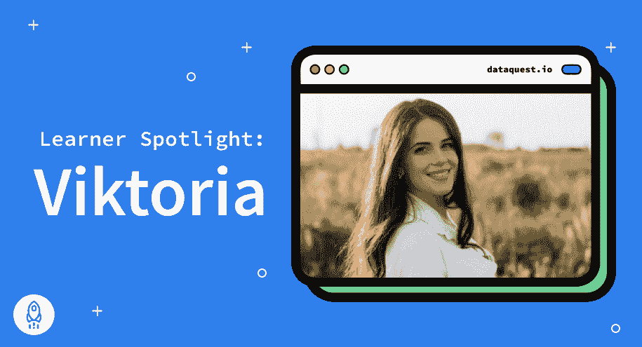

# 学员聚焦–维多利亚·乔拉耶娃

> 原文：<https://www.dataquest.io/blog/learner-spotlight-viktoria-jorayeva/>

November 8, 2021

认识一下 Viktoria Jorayeva，她是一名乌克兰学生，使用 Dataquest 仅用了几个月时间就完成了从语文学到数据科学的转变。作为一个来自非技术、非数学背景的人，进入数据科学领域是可能的，这要感谢 [Dataquest 的数据科学职业道路](https://www.dataquest.io/path/data-scientist/)。

她的故事对全世界梦想获得“21 世纪最性感工作”的人来说是一个真正的鼓舞通过分享 Viktoria 的经验，我们希望努力实现转变的非传统途径的学习者能够找到开始数据科学之旅所需的动力。

以下是她的故事:

**问:首先，你首选的代词是什么？**

她/她

问:你现在的职位是什么？在哪家公司？

我是分形分析的初级数据科学家。

问:你能告诉我们一些你目前工作的情况吗？

已经工作快两个月了。我为业务需求、项目文档和解决方案架构图编写伪代码。

现在你能告诉我们一些你的背景吗？

我来自乌克兰(基辅)。事实上，通过教育，我是一个语言学家(波斯语)，我根本没有数学背景。但是 Dataquest 帮助我实现了我的梦想，即使我没有接受过技术教育。我发现了这个超级棒的资源。这是我试过最好的(我试了五道菜)。在 Dataquest，我选择了“数据科学家”的道路，并开始[学习 Python](https://www.dataquest.io/python-for-data-science-courses/) 和 [SQL](https://www.dataquest.io/sql-for-data-science-courses/) ，数据分析和可视化，在我开始机器学习之前，我得到了一份工作。

**问:是什么让你进入了数据行业？**

我想做一些进步的，科学的事情。当我在学习成为一名翻译时，我意识到在线翻译也在和我一起“学习”，将机器翻译推向了完美。所以，我需要选择一个更现代的职业。

**问:Dataquest 的教学方法(无视频、浏览器内编码)对你有什么作用？**

对我来说太完美了。视频内容的缺失节省了时间。这篇课文是用最通俗易懂的方式写的。但我最喜欢的是每张幻灯片上的练习！你阅读，然后立刻用一个小的实际任务巩固你的知识。

**问:你在 Dataquest 做了哪一项工作，为什么？**

数据科学家。这是目前最进步、收入最高的职业之一。

问:你最喜欢的指导项目是什么，它们对你找工作有什么帮助？

我喜欢所有的项目，因为它们提供了新的知识，巩固了我所学到的东西。在 Jupyter 工作对我来说也是一种乐趣🙂

现在你能告诉我们你是如何开始求职过程的吗？

我的朋友在 https://dou.ua/的上发现了一个空缺，并与我分享了它。它是乌克兰主要的 It 工作资源。

问:你在 Dataquest 学到的哪些技能对你的工作有帮助？

Python、SQL、数据分析、数据可视化、统计

问:你最喜欢 Dataquest 的哪一点，为什么？

如此复杂的材料是如何简单明了地呈现出来的。统计、编程之类的东西不好学。但是 Dataquest 对它们的解释比所有其他资源都要清楚。也就是说，即使对于一个没有受过专门教育的人来说，这也是可以理解的。

问:你对刚刚开始学习 Dataquest 的人有什么建议？

世界上没有你学不到的东西！简而言之，一切都很简单——你每天花大约三个小时学习，瞧，你得到了你梦想的工作。我在 Dataquest 上只学了四个月，然后公司就带我去实习了。你只需要勤奋；Dataquest 已经为您做了所有其他事情。

**问:最后，人们在网上哪里可以找到你**

[领英:https://www.linkedin.com/in/viktoria-jorayeva-0b6951205](https://www.linkedin.com/in/viktoria-jorayeva-0b6951205)