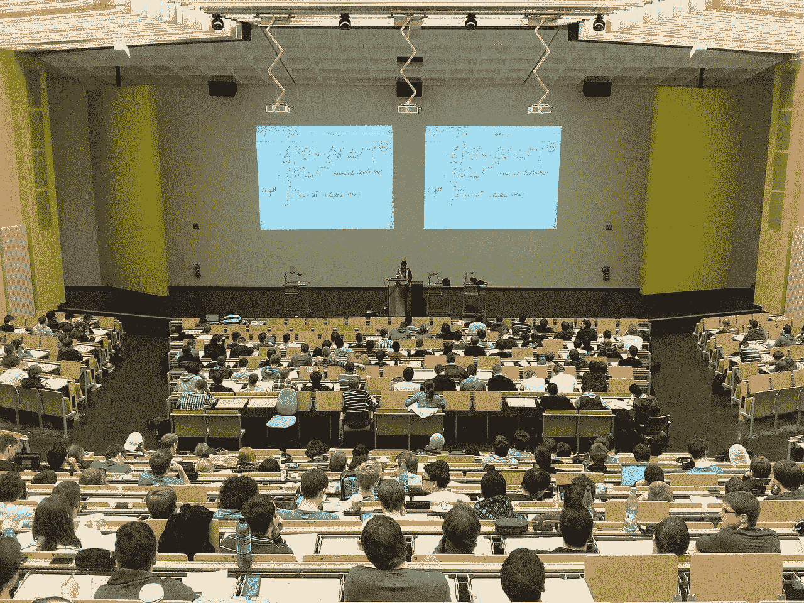
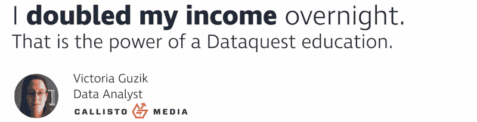

# 如何找到并选择最好的数据科学课程

> 原文：<https://www.dataquest.io/blog/data-science-courses/>

December 3, 2019

选择数据科学课程有数百个选项，在迷宫般的选择中穿行可能会很困难。为方便起见，我们将数据科学课程指南分为五个主要类别:

*   大学/学院
*   数据科学训练营
*   数据科学书籍
*   在线视频课程(MOOCs)
*   在线互动课程(如我们在 Dataquest 提供的课程)

我们会查看每种方法的优缺点，以帮助您决定哪种方法最适合您。

## 在大学/学院学习数据科学

数据科学课程最传统的选择是高等教育机构，如大学或学院。课程包括三年或四年的本科学位，或者硕士或博士等研究生学位

在大学学习数据科学课程的一个有力论据是，你获得的学位证书得到了雇主的广泛认可，这将有助于你在该行业获得第一份工作。

此外，学习者选项的社交方面可以让你感觉你不是一个人在学习，并且可以让你的学习体验更加顺畅。

选择大学的一大不利因素是费用。研究生学位的费用在 10，000 美元到 50，000 美元之间，本科学位的费用要高出几倍。如果你足够幸运，生活在一个大学免费或有补贴的地方，那么这个因素就会减少，但对大多数人来说，上大学是一个不小的因素。

T2】

为了继续学习大学数据科学课程，你需要确保这是一个很好的选择。一旦你做了这个决定，你就要为你付出的代价负责。这可以被看作是积极的，因为你做出的坚定承诺将有助于你完成学业。

其他不利因素包括大量的时间投入、不灵活的学习计划和入学要求——尤其是在顶尖大学，入学竞争激烈。

如果你有时间和金钱花在大学学历上，这可能是进入这个行业的一个非常有效的方式，然而，还有几个更实惠的选择。

## 数据科学训练营

训练营提供浓缩的面对面数据科学课程，通常持续大约三个月的全日制学习。训练营有预定义的课程，因此您可以专注于学习。你会遇到其他人，并能够建立关系网和协作学习。

训练营可能很贵——短期训练营的费用从 3000 美元到整整三个月的 20000 美元不等。就像大学一样，这种成本是一把双刃剑。这是一个昂贵的选择，但另一方面，你可能会坚持到底，不会违背自己的承诺，因为有那么多钱在等着你。

为了充分利用你的训练营，你需要有一些经验。大多数训练营都有入学要求，否则几个月内要学的东西太多了。如果你没有这方面的经验，训练营可能不是一个好的选择，你可能需要考虑不同的数据科学课程(或者先考虑不同的选择)。

一些训练营会帮助你找到工作，或者至少在你找工作的时候给你支持，这是一个非常值得的好处。

T2】

有大量的数据科学训练营，而且质量很重要。出于这个原因，最好坚持那些已经建立并有很好声誉的学校，以确保你得到高质量的指导。虽然训练营是新的和/或小的并不意味着它不能提供，坚持与“大男孩”之一是一个低风险的策略。

如果你正在寻找一个更灵活的选择，并且不想要亲身体验，有许多在线训练营可供选择。

如果你能负担得起数据科学训练营，它们可能是快速获得找工作所需技能的有效方式。也就是说，在学习时间表方面，有一些选择更实惠，也更灵活。

## 数据科学书籍

虽然从技术上讲，这不是一门数据科学课程，但从书本中学习是一种屡试不爽的方法。即使您决定选择另一种方法来学习数据科学，书籍也是学习和参考的一个很好的补充来源。

当你不在电脑前的时候，它们也很棒——你可以在通勤或度假的时候学习！

书籍的一大优势是它们很便宜——大多数不到 40 美元，一些顶级数据科学书籍是免费的。

一般来说，如果您想要全面的数据科学教育，您至少需要使用一些书籍。有一些很棒的初学者教材，但是当你想更深入地挖掘时，你需要专门化你的阅读。

T2】

另一件要记住的事情是，为了从你的经历中获得最大的收获，你需要建立一个编码环境来将你学到的东西付诸实践。一些替代方案(如交互式在线课程)允许你推迟这个棘手的步骤，这样你就可以立即投入学习。

从书本中学习可能是学习数据科学的一种极其经济高效的方式。也就是说，您需要付出额外的努力将所学付诸实践，否则您将无法将您的知识转化为数据科学的实际应用。

## 在线视频课程(MOOCs)

2000 年代末出现的大规模开放在线课程(MOOCs)大多是在 Coursera 和 EdX 等平台上提供的大学课程的视频版本。

MOOCs 允许低摩擦地进入大学水平的数据科学课程——许多课程是免费提供的，如果你想要完成证书，只需收取少量费用。一些 MOOC 项目收取月订阅费。

一般来说，由于各种 mooc 的可用性，mooc 提供的[数据科学证书](https://www.dataquest.io/blog/data-science-certificate/)不被认为是作为实际大学学位的一部分完成课程的权威。

也就是说，MOOCs 是数据科学课程最受欢迎的选择之一，尤其是在线课程。

像书籍一样，你需要建立自己的编码环境，将你学到的东西付诸实践，因为 MOOC 课程不是交互式的。

MOOCs 可能是学习数据科学的一个很好的选择——你可以以可承受的成本从世界上最好的大学学习。如果你决定追求这个选择，确保你付出额外的努力把你学到的东西付诸实践。

## 在线互动课程(Dataquest)

在线互动数据科学课程，如我们在 [Dataquest](https://www.dataquest.io) 提供的课程，为大多数想要学习数据科学的人提供了我们认为的最佳选择。

Dataquest 每月收费 49 美元，尽管我们最受欢迎的模块是完全免费的。您可以按照自己的时间表学习，大多数学生在 6 个月内完成我们的数据科学学习路径，因此您的总成本约为 300 美元。这使得它比书籍或 MOOCs 更贵，但比大学或训练营便宜得多。

Dataquest 不使用任何视频。相反，我们的文本课程与交互式编码环境相结合。您可以直接在您的浏览器中完成我们的代码练习，因此您不必担心如何设置您的本地环境。当你运行你的代码时，你会得到关于你所写内容的即时反馈。

T2】

简而言之，Dataquest 平台。

MOOCs 和书籍等被动学习方法已被证明不如动手互动课程有效— [研究表明](https://www.dataquest.io/blog/video-text-learn-data-science-online/)动手学习者的表现比通过被动方法学习的学生平均高出 20%。

与大学和训练营类似，Dataquest 的学习路径提供了一个整体课程，教你获得入门级数据科学或数据分析师工作所需的一切知识。我们的方法是经过验证的——在 2019 年对学生成果的调查中，96%的学生表示他们会向其他人推荐 Dataquest 以促进职业发展。

62.5%的学生表示，他们在目前的工作中使用了在 Dataquest 中学到的技能，并将 Dataquest 之前的工资与目前的工资进行比较时，工资中位数增加了 12，450 美元。

我们的学生对我们的教学方法赞不绝口。以下是他们的部分评价:

T2】

独立评级网站 [Switchup](https://www.switchup.org/bootcamps/dataquest) 连续两年授予 Dataquest it 最佳在线训练营奖(尽管我们不是训练营),并连续三年授予其最佳数据科学训练营奖。学生对 Switchup 的平均评分为 4.9 分(满分 5 分)。

## 选择数据科学课程

下表便于比较不同类型的数据科学课程的属性:

| 页眉 | 

**大学/** **学院**

 | **训练营** | 

**书籍**

 | 

**MOOCs**

 | 

**数据请求**

 |
| --- | --- | --- | --- | --- | --- |
| **成本** | \$10,000-\$200,000 | \$3,000-\$20,000 | \$0-\$40 | \$0-\$50 | \$0-\$300 |
| **时间投入** | 1-4 岁 | 12 周 | 变化 | 变化 | 变化 |
| **灵活的学习时间表** |  |  |  |  |  |
| **互动学习** |  |  |  |  |  |
| **完成课程** |  |  |  |  |  |
| **认可的凭证** |  |  |  |  |  |

我们有一点偏见，但我们相信 Dataquest 的交互式学习路径提供了收益与成本的最佳平衡，可以根据您自己的时间表灵活地学习。