# 28 Jupyter 笔记本提示、技巧和快捷方式

> 原文：<https://www.dataquest.io/blog/jupyter-notebook-tips-tricks-shortcuts/>

October 12, 2016

## Jupyter 笔记型电脑

Jupyter notebook，以前称为 IPython notebook，是一个灵活的工具，可以帮助您创建可读的分析，因为您可以将代码、图像、注释、公式和图表放在一起。在本帖中，我们收集了一些最好的 Jupyter 笔记本技巧，帮助你快速成为 Jupyter 超级用户！

*(这篇文章基于最初出现在[阿历克斯·罗戈日尼科夫的博客“绝妙的错误”](https://arogozhnikov.github.io/2016/09/10/jupyter-features.html)上的一篇文章。我们已经扩展了帖子，并将继续这样做——如果您有建议，请[让我们知道](https://twitter.com/dataquestio)。感谢亚历克斯让我们在这里重新发布他的作品。)*

Jupyter 是相当可扩展的，支持许多编程语言，并且很容易在您的计算机或几乎任何服务器上托管——您只需要 ssh 或 http 访问。最棒的是，它是完全免费的。现在让我们来看看我们的 28 人名单(还在继续！)Jupyter 笔记本小技巧！

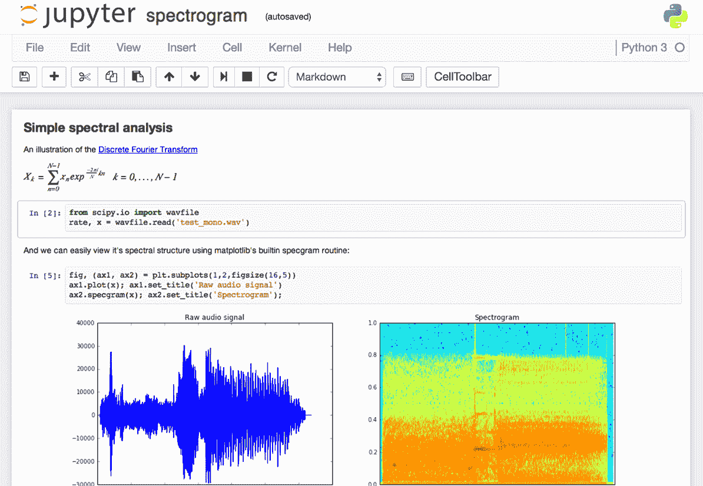

Jupyter 接口。

Project Jupyter 诞生于 IPython 项目，该项目发展成为一个可以支持多种语言的笔记本，因此其历史名称为 IPython 笔记本。Jupyter 这个名字是它设计的三种核心语言的间接组合: **JU** lia、 **PYT** hon 和 **R** ，灵感来自木星。

在 Jupyter 中使用 Python 时，使用了 IPython 内核，这使我们可以从我们的 Jupyter 笔记本中方便地访问 IPython 特性(稍后将详细介绍！)

我们将向您展示 28 个提示和技巧，让您更轻松地使用 Jupyter。

## 1.快捷键

任何高级用户都知道，键盘快捷键会节省你很多时间。Jupyter 在顶部的菜单下存储了一个快捷键列表:`Help > Keyboard Shortcuts`，或者在命令模式下按下`H`(后面会有更多介绍)。每次更新 Jupyter 时都值得检查一下，因为更多的快捷方式一直在添加。

访问键盘快捷键的另一种方法，也是学习它们的一种简便方法是使用命令面板:`Cmd + Shift + P`(或者 Linux 和 Windows 上的`Ctrl + Shift + P`)。此对话框帮助您按名称运行任何命令-如果您不知道某个操作的键盘快捷键，或者如果您想要执行的操作没有键盘快捷键，则此对话框非常有用。该功能类似于 Mac 上的 Spotlight search，一旦你开始使用它，你会想知道没有它你是怎么生活的！

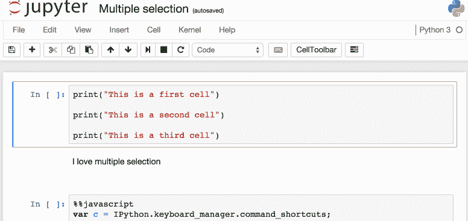

*命令调色板。*

我最喜欢的一些:

*   `Esc`将带您进入命令模式，您可以使用箭头键在笔记本中导航。
*   在命令模式下:
    *   `A`在当前单元格上方插入新单元格，`B`在下方插入新单元格。
    *   `M`将当前单元格改为降价，`Y`改回编码
    *   `D + D`(按两次键)删除当前单元格
*   `Enter`会将您从命令模式带回到给定单元格的编辑模式。
*   `Shift + Tab`将向您显示您刚刚在代码单元格中键入的对象的文档字符串(文档)——您可以持续按此快捷键在文档的几种模式之间循环。
*   `Ctrl + Shift + -`将从光标所在的位置将当前单元格一分为二。
*   在您的代码中查找并替换，而不是在输出中。
*   `Esc + O`切换单元格输出。
*   选择多个单元格:
    *   `Shift + J`或`Shift + Down`选择向下方向的下一次卖出。您也可以使用`Shift + K`或`Shift + Up`选择向上销售。
    *   选择单元格后，您可以批量删除/复制/剪切/粘贴/运行它们。当您需要移动笔记本的部件时，这很有帮助。
    *   你也可以使用`Shift + M`来合并多个单元格。

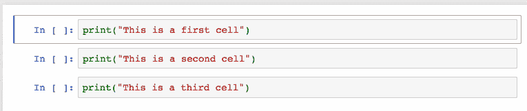

*合并多个单元格。*

## 2.变量的漂亮展示

第一部分是众所周知的。通过用变量名或语句的未赋值输出来结束 Jupyter 单元格，Jupyter 将显示该变量，而不需要打印语句。这在处理 Pandas 数据帧时特别有用，因为输出被整齐地格式化成表格。

不太为人所知的是，您可以修改一个 modify`ast_note_interactivity`内核选项，让 Jupyter 在它自己的行上为任何变量或语句做这件事，因此您可以一次看到多个语句的值。

```
from IPython.core.interactiveshell import InteractiveShell
InteractiveShell.ast_node_interactivity = "all"
```

```
from pydataset import data
quakes = data('quakes')
quakes.head()
quakes.tail() 
```

| 【T0 年】 | 龙
 | 深度
 | 弹匣
 | 车站
 |
| --- | --- | --- | --- | --- |
| 1
 | -20.42
 | 181.62
 | 562
 | 4.8
 | 41
 |
| 2
 | -20.62
 | 181.03
 | 650
 | 4.2
 | 15
 |
| 3
 | -26.00
 | 184.10
 | 42
 | 5.4
 | 43
 |
| 4
 | -17.97
 | 181.66
 | 626
 | 4.1
 | 19
 |
| 5
 | -20.42
 | 181.96
 | 649
 | 4.0
 | 11
 |

| 【T0 年】 | 龙
 | 深度
 | 弹匣
 | 车站
 |
| --- | --- | --- | --- | --- |
| 996
 | -25.93
 | 179.54
 | 470
 | 4.4
 | 22
 |
| 997
 | -12.28
 | 167.06
 | 248
 | 4.7
 | 35
 |
| 998
 | -20.13
 | 184.20
 | 244
 | 4.5
 | 34
 |
| 999
 | -17.40
 | 187.80
 | 40
 | 4.5
 | 14
 |
| 1000
 | -21.59
 | 170.56
 | 165
 | 6.0
 | 119
 |

如果您想为 Jupyter(笔记本和控制台)的所有实例设置这种行为，只需用下面几行创建一个文件`~/.ipython/profile_default/ipython_config.py`。

```
c = get_config()

# Run all nodes interactively
c.InteractiveShell.ast_node_interactivity = "all"
```

## 3.文档的简单链接

在`Help`菜单中，你会找到常用库的在线文档链接，包括 NumPy、Pandas、SciPy 和 Matplotlib。

也不要忘记，通过在库、方法或变量前面加上`?`，你可以访问 Docstring 来快速参考语法。

```
?str.replace()
```

```
Docstring:
S.replace(old, new[, count]) -> str

Return a copy of S with all occurrences of substring
old replaced by new.  If the optional argument count is
given, only the first count occurrences are replaced.
Type:      method_descriptor 
```

## 4.在笔记本中绘图

在您的笔记本中有许多生成图的选项。

*   [matplotlib](https://matplotlib.org/) (事实上的标准)，用`%matplotlib inline`激活——这里有一个 Dataquest [Matplotlib 教程](https://www.dataquest.io/blog/matplotlib-tutorial/)。
*   提供交互性，但可能会有点慢，因为渲染是在服务器端完成的。
*   Seaborn 建立在 Matplotlib 之上，使建立更有吸引力的地块变得更加容易。仅仅通过导入 Seaborn，你的 matplotlib 图就变得“更漂亮”,而不需要修改任何代码。
*   [mpld3](https://github.com/mpld3/mpld3) 为 matplotlib 代码提供替代渲染器(使用 d3)。相当不错，虽然不完整。
*   散景是构建互动情节的更好选择。
*   [plot.ly](https://plot.ly/) 可以生成漂亮的图——这曾经只是一项付费服务，但最近被开源了。
*   Altair 是一个相对较新的用于 Python 的声明式可视化库。它很容易使用，并且可以做出很好看的图，但是定制这些图的能力远不如 Matplotlib 强大。

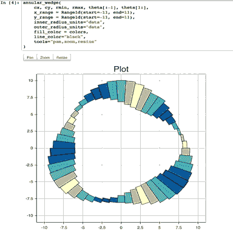

Jupyter 接口。


*[https://www.youtube.com/embed/6a5jbnUNE2E?rel=0](https://www.youtube.com/embed/6a5jbnUNE2E?rel=0)*

 *提升您的数据技能。

[查看计划](/subscribe)* 

## *5.IPython 魔法命令*

 *你在上面看到的`%matplotlib inline`是一个 *IPython Magic* 命令的例子。基于 IPython 内核，Jupyter 可以访问来自 IPython 内核的所有魔法，它们可以让您的生活变得更加轻松！

```
# This will list all magic commands
%lsmagic
```

```
Available line magics:
%alias %alias_magic %autocall %automagic %autosave %bookmark %cat %cd %clear %colors %config %connect_info %cp %debug %dhist %dirs %doctest_mode %ed %edit %env %gui %hist %history %killbgscripts %ldir %less %lf %lk %ll %load %load_ext %loadpy %logoff %logon %logstart %logstate %logstop %ls %lsmagic %lx %macro %magic %man %matplotlib %mkdir %more %mv %notebook %page %pastebin %pdb %pdef %pdoc %pfile %pinfo %pinfo2 %popd %pprint %precision %profile %prun %psearch %psource %pushd %pwd %pycat %pylab %qtconsole %quickref %recall %rehashx %reload_ext %rep %rerun %reset %reset_selective %rm %rmdir %run %save %sc %set_env %store %sx %system %tb %time %timeit %unalias %unload_ext %who %who_ls %whos %xdel %xmode 
Available cell magics:%%! %%HTML %%SVG %%bash %%capture %%debug %%file %%html %%javascript %%js %%latex %%perl %%prun %%pypy %%python %%python2 %%python3 %%ruby %%script %%sh %%svg %%sx %%system %%time %%timeit %%writefile 
Automagic is ON, % prefix IS NOT needed for line magics.
```

我推荐浏览所有 IPython 神奇命令的文档，因为你肯定会找到一些对你有用的。下面是我最喜欢的几个:

## 6.IPython Magic –% env:设置环境变量

您可以管理笔记本的环境变量，而无需重新启动 jupyter 服务器进程。一些库(比如 theano)使用环境变量来控制行为，%env 是最方便的方法。

```
# Running %env without any arguments
# lists all environment variables# The line below sets the environment
# variable
%env OMP_NUM_THREADS%env OMP_NUM_THREADS=4
```

```
env: OMP_NUM_THREADS=4
```

## 7.IPython Magic –% run:执行 Python 代码

`%run`可以从执行 python 代码。py 文件——这是有据可查的行为。鲜为人知的是，它还可以执行其他 jupyter 笔记本，这可能非常有用。

注意，使用`%run`并不等同于导入 python 模块。

```
# this will execute and show the output from
# all code cells of the specified notebook
%run ./two-histograms.ipynb
```

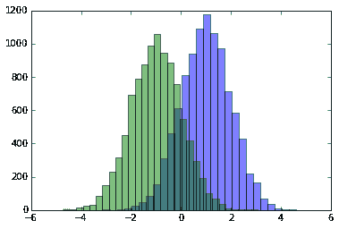

## 8.IPython Magic –% load:插入来自外部脚本的代码

这将用外部脚本替换单元格的内容。您可以使用计算机上的文件作为源，也可以使用 URL 作为源。

```
# Before Running
%load ./hello_world.py
```

```
# After Running
# %load ./hello_world.py
if __name__ == "__main__":
 print("Hello World!")
```

```
Hello World!
```

## 9.IPython Magic –% store:在笔记本之间传递变量。

`%store`命令允许你在两个不同的笔记本之间传递变量。

```
data = 'this is the string I want to pass to different notebook'
%store data
del data # This has deleted the variable
```

```
Stored 'data' (str)
```

现在，在一个新的笔记本中…

```
%store -r data
print(data)
```

```
this is the string I want to pass to different notebook
```

## 10.IPython Magic-% who:列出全局范围的所有变量。

不带任何参数的`%who`命令将列出全局范围内存在的所有变量。传递类似于`str`的参数将只列出该类型的变量。

```
one = "for the money"
two = "for the show"
three = "to get ready now go cat go"
%who str
```

```
one three two
```

## 11.IPython Magic–计时

有两个 IPython 神奇的命令对计时很有用—`%%time`和`%timeit`。当您有一些运行缓慢的代码，并且您试图确定问题出在哪里时，这些工具尤其方便。

`%%time`将为您提供单元格中代码的单次运行信息。

```
%%time
import time
for _ in range(1000):
 time.sleep(0.01) # sleep for 0.01 seconds
```

```
CPU times: user 21.5 ms, sys: 14.8 ms, total: 36.3 ms Wall time: 11.6 s
```

`%%timeit`使用 Python [timeit 模块](https://docs.python.org/3.5/library/timeit.html)，该模块运行一条语句 100，000 次(默认情况下)，然后提供最快三次的平均值。

```
import numpy
%timeit numpy.random.normal(size=100)
```

```
The slowest run took 7.29 times longer than the fastest. This could mean that an intermediate result is being cached.
100000 loops, best of 3: 5.5 µs per loop
```

## 12.IPython Magic –% % writefile 和%pycat:导出单元格的内容/显示外部脚本的内容

使用`%%writefile`魔法将该单元格的内容保存到外部文件中。`%pycat`做相反的事情，向您显示(在弹出窗口中)外部文件的语法高亮内容。

```
%%writefile pythoncode.py 
import numpy
def append_if_not_exists(arr, x):
 if x not in arr:
 arr.append(x)def some_useless_slow_function():
 arr = list()
    for i in range(10000):
        x = numpy.random.randint(0, 10000)
    append_if_not_exists(arr, x)
```

```
Writing pythoncode.py
```

```
%pycat pythoncode.py
```

```
import numpy
def append_if_not_exists(arr, x):
 if x not in arr:
 arr.append(x)def some_useless_slow_function():
 arr = list()
 for i in range(10000):
 x = numpy.random.randint(0, 10000)
 append_if_not_exists(arr, x)
```

## 13.IPython Magic –% prun:显示你的程序在每个函数上花费了多少时间。

使用“%prun statement_name”将为您提供一个有序的表格，显示每个内部函数在语句中被调用的次数、每次调用所用的时间以及该函数所有运行的累计时间。

```
%prun some_useless_slow_function()
```

```
26324 function calls in 0.556 seconds 
Ordered by: internal time 
ncalls tottime percall cumtime percall filename:lineno(function)
10000 0.527 0.000 0.528 0.000 :2(append_if_not_exists)
10000 0.022 0.000 0.022 0.000 {method 'randint' of 'mtrand.RandomState' objects}
1 0.006 0.006 0.556 0.556 :6(some_useless_slow_function)
6320 0.001 0.000 0.001 0.000 {method 'append' of 'list' objects}
1 0.000 0.000 0.556 0.556 :1()
1 0.000 0.000 0.556 0.556 {built-in method exec}
1 0.000 0.000 0.000 0.000 {method 'disable' of '_lsprof.Profiler' objects}
```

## 14.IPython Magic–使用%pdb 进行调试

Jupyter 有自己的接口用于[Python 调试器(`pdb` )](https://docs.python.org/3.5/library/pdb.html) 。这使得进入函数内部并研究那里发生的事情成为可能。

你可以在这里查看`pdb`接受的命令列表[。](https://docs.python.org/3.5/library/pdb.html#debugger-commands)

```
%pdb 
def pick_and_take():
 picked = numpy.random.randint(0, 1000)
 raise NotImplementedError()
pick_and_take()
```

```
Automatic pdb calling has been turned ON
```

```
--------------------------------------------------------------------
NotImplementedError Traceback (most recent call last)
in ()
5 raise NotImplementedError()
6
----> 7 pick_and_take()
in pick_and_take()
3 def pick_and_take():
4 picked = numpy.random.randint(0, 1000)
----> 5 raise NotImplementedError()
6
7 pick_and_take()
NotImplementedError:
```

```
> (5)pick_and_take()
3 def pick_and_take():
4 picked = numpy.random.randint(0, 1000)
----> 5 raise NotImplementedError()
6
7 pick_and_take()
```

```
ipdb>
```

## 15.IPython Magic–Retina 笔记本电脑的高分辨率绘图输出

IPython magic 的一条线将为 Retina 屏幕提供双倍分辨率的绘图输出，例如最近的 Macbooks。*注意:下面的例子不会在非视网膜屏幕上渲染*

```
x = range(1000)
y = [i ** 2 for i in x]
plt.plot(x,y)
plt.show();
```

```
%config InlineBackend.figure_format ='retina'
plt.plot(x,y)
plt.show();
```

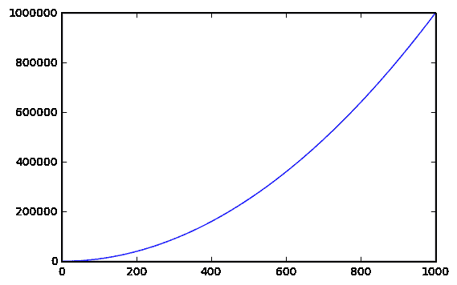

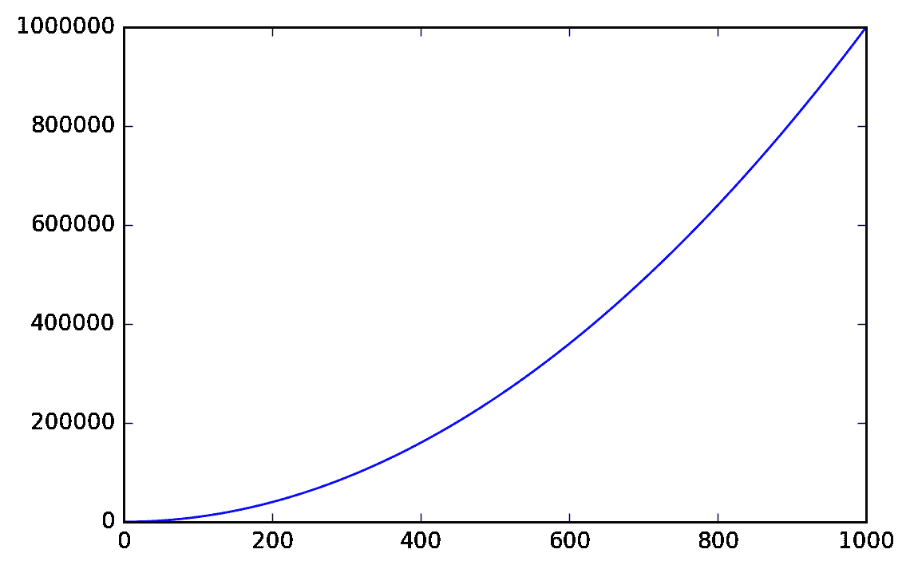

## 16.抑制最终函数的输出。

有时在最后一行隐藏函数的输出是很方便的，例如在绘图时。为此，您只需在末尾添加一个分号。

```
%matplotlib inline
from matplotlib import pyplot as plt
import numpyx = numpy.linspace(0, 1, 1000)**1.5
```

```
# Here you get the output of the function
plt.hist(x)
```

```
(array([ 216., 126., 106., 95., 87., 81., 77., 73., 71., 68.]), array([ 0\. , 0.1, 0.2, 0.3, 0.4, 0.5, 0.6, 0.7, 0.8, 0.9, 1\. ]),
<a list of 10 Patch objects>)
```

```
# By adding a semicolon at the end, the output is suppressed.plt.hist(x);
```

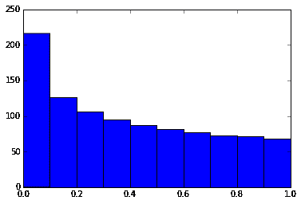


## 17.执行 Shell 命令

从笔记本内部执行 shell 命令很容易。您可以使用它来检查工作文件夹中有哪些数据集可用:

```
!ls *.csv
```

```
nba_2016.csv titanic.csv pixar_movies.csv whitehouse_employees.csv
```

或者检查和管理包。

```
!pip install numpy !pip list | grep pandas
```

```
Requirement already satisfied (use --upgrade to upgrade): numpy in /Library/Frameworks/Python.framework/Versions/3.4/lib/python3.4/site-packages pandas (0.18.1)
```

## 18.将胶乳用于论坛

当您在 Markdown 单元格中写入 [LaTeX](https://www.latex-project.org/) 时，它将使用 MathJax 呈现为一个公式。

这个:

```
$P(A \mid B) = \frac{P(B \mid A)P(A)}{P(B)}$
```

变成了这样:


Markdown 是笔记本的重要组成部分，别忘了利用它的表现力！

## 19.在笔记本中运行不同内核的代码

如果你愿意，你可以将多个内核的代码合并到一个笔记本中。

只需在每个要使用内核的单元格的开头使用 IPython Magics 和内核的名称:

*   `%%bash`
*   `%%HTML`
*   `%%python2`
*   `%%python3`
*   `%%ruby`
*   `%%perl`

```
%%bash
for i in {1..5}
do echo "i is $i"
done
```

```
i is 1
i is 2
i is 3
i is 4
i is 5
```

## 20.为 Jupyter 安装其他内核

Jupyter 的一个很好的特性是能够运行不同语言的内核。作为一个例子，下面是如何让和 R 内核运行。

### 简单的选择:使用 Anaconda 安装 R 内核

如果您使用 Anaconda 来设置您的环境，让 R 工作是非常容易的。只需在您的终端中运行以下命令:

```
conda install -c r r-essentials
```

### 不太容易的选择:手动安装 R 内核

如果您没有使用 Anaconda，这个过程会稍微复杂一些。首先，如果你还没有安装 R，你需要从[曲柄](https://cloud.r-project.org/)安装 R。

完成后，启动一个 R 控制台并运行以下命令:

```
install.packages(c('repr', 'IRdisplay', 'crayon', 'pbdZMQ', 'devtools'))
devtools::install_github('IRkernel/IRkernel')
IRkernel::installspec() # to register the kernel in the current R installation
```

## 21.在同一个笔记本上运行 R 和 Python。

最好的解决方案是安装 [rpy2](https://rpy2.bitbucket.org/) (也需要一个 R 的工作版本)，这可以用`pip`轻松完成:

```
pip install rpy2
```

然后，您可以一起使用这两种语言，甚至在它们之间传递变量:

```
%load_ext rpy2.ipython
```

```
%R require(ggplot2)
```

```
array([1], dtype=int32)
```

```
import pandas as pd df = pd.DataFrame({
'Letter': ['a', 'a', 'a', 'b', 'b', 'b', 'c', 'c', 'c'],
'X': [4, 3, 5, 2, 1, 7, 7, 5, 9],
'Y': [0, 4, 3, 6, 7, 10, 11, 9, 13],
'Z': [1, 2, 3, 1, 2, 3, 1, 2, 3]
})
```

```
%%R -i df ggplot(data = df) + geom_point(aes(x = X, y= Y, color = Letter, size = Z))
```

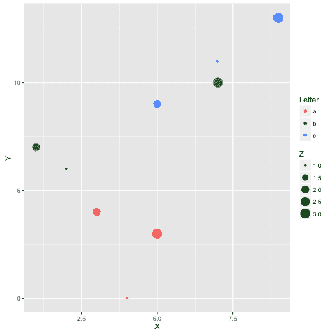

*示例礼貌[革命博客](https://blog.revolutionanalytics.com/2016/01/pipelining-r-python.html)*

## 22.其他语言的书写功能

有时候 numpy 的速度不够，我需要写一些快速代码。原则上，你可以在动态库中编译函数，并编写 python 包装器…

但是当这个无聊的部分为你做的时候会好很多，对吗？

您可以用 cython 或 fortran 编写函数，并直接从 python 代码中使用它们。

首先，您需要安装:

```
!pip install cython fortran-magic
```

```
%load_ext Cython
```

```
%%cython
def myltiply_by_2(float x):
return 2.0 * x
```

```
myltiply_by_2(23.)
```

就我个人而言，我更喜欢使用 fortran，我发现它对于编写数字运算函数非常方便。更多使用细节可以在这里找到[。](https://arogozhnikov.github.io/2015/11/29/using-fortran-from-python.html)

```
%load_ext fortranmagic
```

```
%%fortran subroutine compute_fortran(x, y, z)
real, intent(in) :: x(:), y(:)
real, intent(out) :: z(size(x, 1))
z = sin(x + y)
end subroutine compute_fortran
```

```
compute_fortran([1, 2, 3], [4, 5, 6])
```

还有不同的抖动系统可以加快 python 代码的速度。更多的例子[可以在这里找到](https://arogozhnikov.github.io/2015/09/08/SpeedBenchmarks.html)。

## 23.多光标支持

Jupyter 支持多光标，类似于 Sublime 文本。按住`Alt`，点击并拖动鼠标即可。

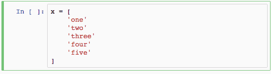

*多光标支持。*

## 24\. Jupyter-contrib extensions

[Jupyter-contrib 扩展](https://github.com/ipython-contrib/jupyter_contrib_nbextensions)是一个扩展家族，为 Jupyter 提供了更多的功能，包括`jupyter spell-checker`和`code-formatter`。

以下命令将安装扩展，以及基于菜单的配置器，该配置器将帮助您从 Jupyter 笔记本主屏幕浏览和启用扩展。

```
!pip install https://github.com/ipython-contrib/jupyter_contrib_nbextensions/tarball/master !pip install jupyter_nbextensions_configurator !jupyter contrib nbextension install --user !jupyter nbextensions_configurator enable --user
```

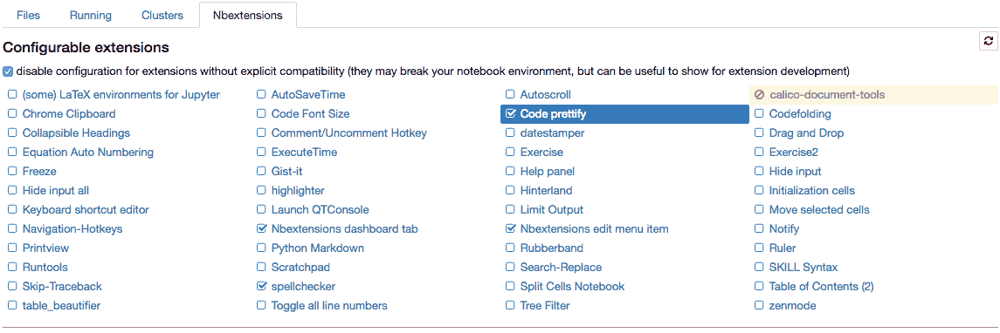

nbextension 配置器。

## 25.从 Jupyter 笔记本创建演示文稿。

Damian Avila 的 [RISE](https://github.com/damianavila/RISE) 允许你从现有的笔记本上创建一个 powerpoint 风格的演示文稿。

您可以使用 conda 安装 RISE:

```
conda install -c damianavila82 rise
```

或者 pip:

```
pip install RISE
```

然后运行以下代码来安装并启用该扩展:

```
jupyter-nbextension install rise --py --sys-prefix jupyter-nbextension enable rise --py --sys-prefix
```

## 26.木星输出系统

笔记本显示为 HTML，单元格输出可以是 HTML，因此您可以返回几乎任何内容:视频/音频/图像。

在本例中，我扫描了存储库中包含图像的文件夹，并显示了前 5:

```
import os
from IPython.display import display, Image names = [f for f in os.listdir('img/ml_demonstrations/') if f.endswith('.png')]
for name in names[:5]:
 display(Image('img/ml_demonstrations/' + name, width=100))
```

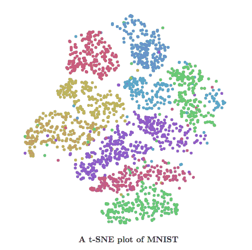


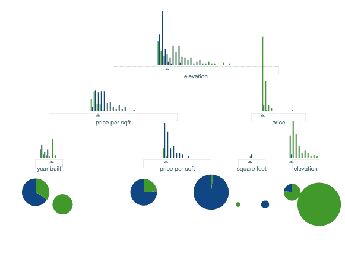


我们可以用 bash 命令创建相同的列表，因为 magics 和 bash 调用返回 python 变量:

```
names = !ls img/ml_demonstrations/*.png names[:5]
```

```
['img/ml_demonstrations/colah_embeddings.png',
'img/ml_demonstrations/convnetjs.png',
'img/ml_demonstrations/decision_tree.png',
'img/ml_demonstrations/decision_tree_in_course.png',
'img/ml_demonstrations/dream_mnist.png']
```

## 27.大数据分析

许多解决方案可用于查询/处理大型数据样本:

*   [ipyparallel(以前的 ipython cluster)](https://github.com/ipython/ipyparallel) 对于 python 中的简单 map-reduce 操作来说是一个很好的选择。我们在 [rep](https://github.com/yandex/rep) 中使用它来并行训练许多机器学习模型
*   [pyspark](https://www.cloudera.com/documentation/enterprise/5-5-x/topics/spark_ipython.html)
*   spark-sql magic [%%sql](https://github.com/jupyter-incubator/sparkmagic)

## 28.共享笔记本

共享笔记本最简单的方法就是使用笔记本文件(。ipynb)，但是对于那些不使用 Jupyter 的人，您有几个选择:

*   使用`File > Download as > HTML`菜单选项将笔记本转换为 html 文件。
*   上传您的。ipynb 文件到 [Google Colab](https://colab.research.google.com/notebooks/intro.ipynb) 。
*   与 [gists](https://gist.github.com/) 或在 github 上共享您的笔记本文件，这两者都会渲染笔记本。参见[这个例子](https://github.com/dataquestio/solutions/blob/master/Lesson202Solution.ipynb)。
    *   如果你上传你的笔记本到 github 库，你可以使用方便的 [mybinder](https://mybinder.org/) 服务，允许某人用半个小时的交互式 Jupyter 访问你的库。
*   用 [jupyterhub](https://github.com/jupyterhub/jupyterhub) 设置你自己的系统，这在你组织小型课程或研讨会而没有时间关心学生机器时非常方便。
*   将您的笔记本存放在 dropbox 中，并将链接放入 [nbviewer](https://nbviewer.jupyter.org/) 中。nbviewer 将从您托管笔记本的任何源呈现笔记本。
*   使用`File > Download as > PDF`菜单将笔记本保存为 PDF 格式。如果你正在走这条路，我强烈推荐阅读朱利叶斯·舒尔茨的优秀文章[制作出版就绪的 Python 笔记本](https://blog.juliusschulz.de/blog/ultimate-ipython-notebook)。
*   从你的 Jupyter 笔记本上用 Pelican 创建一个博客。

## 你最喜欢的是什么？

[让我知道](https://twitter.com/dataquestio)你最喜欢的 Jupyter 笔记本小贴士是什么。

在 [Dataquest](https://www.dataquest.io/) ，我们的互动指导项目使用 Jupyter 笔记本来构建数据科学项目，并获得一份数据方面的工作。如果你感兴趣，你可以[注册并免费学习我们的第一个模块](https://www.dataquest.io/)。

我还推荐以下链接供进一步阅读:

*   IPython [内置魔法](https://ipython.org/ipython-doc/3/interactive/magics.html)
*   Ben Zaitlen 关于 jupyter 的精彩互动演示
*   高级笔记本[第一部分:魔法](https://blog.dominodatalab.com/lesser-known-ways-of-using-notebooks/)
    和[第二部分:小工具](https://blog.dominodatalab.com/interactive-dashboards-in-jupyter/)
*   [使用 jupyter 在 python 中进行剖析](https://pynash.org/2013/03/06/timing-and-profiling/)
*   [扩展笔记本的 4 种方式](https://mindtrove.info/4-ways-to-extend-jupyter-notebook/)
*   [IPython 笔记本招数](https://www.quora.com/What-are-your-favorite-tricks-for-IPython-Notebook)
*   [Jupyter vs Zeppelin 争夺大数据](https://www.linkedin.com/pulse/comprehensive-comparison-jupyter-vs-zeppelin-hoc-q-phan-mba-)
*   [制作发布就绪的 Python 笔记本](https://blog.juliusschulz.de/blog/ultimate-ipython-notebook)。*