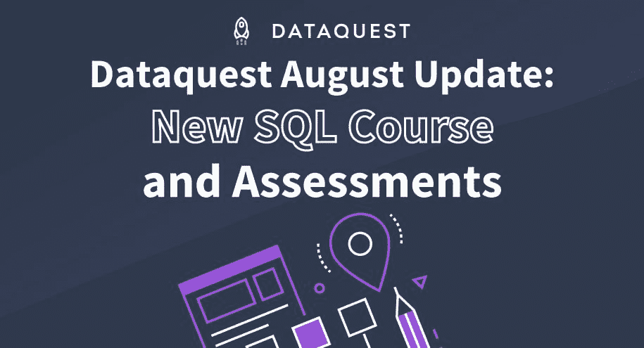
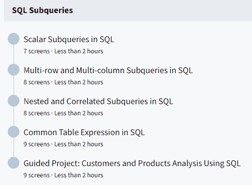
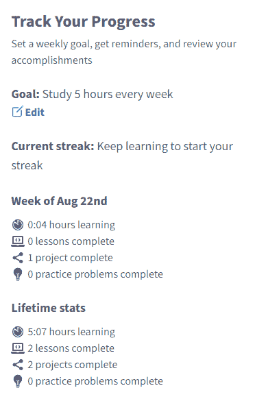

# Dataquest 八月份产品更新

> 原文：<https://www.dataquest.io/blog/dataquest-product-update/>

September 15, 2021

Hi Dataquesters!

我们正在联系你们来更新我们在 8 月份取得的进展，并让你们知道一些即将发生的令人兴奋的事情。本月更新的菜单上:一门新课程，新的评估，几篇新的博客文章，等等！

首先，新内容！

*   我们最近发布了 SQL 技能之路的第五期也是最后一期课程(目前为止)!SQL 子查询课程将帮助您编写更复杂的查询，并使您的 SQL 技能更上一层楼。
*   我们还试发布了 Python 评估版《Python for Data Science:Fundamentals I 》(尚未对所有人开放)。预计在接下来的几个月内会发布更多评估版。

T2】

接下来，来自 Dataquest 社区的内容贡献:

*   我们有幸与几位杰出的学习者进行了交流，他们是[大卫·拉什顿](https://www.dataquest.io/blog/learner-spotlight-david-rushton/)和[维娜·桑吉芙](https://www.dataquest.io/blog/learner-spotlight-veena-sanjeeve/)。看一看！
*   我们还发布了一些由 Dataquest 社区撰写的文章，包括 Max Bohomolov 在 [web scraping 上发表的精彩文章，以及](https://www.dataquest.io/blog/how-i-scraped-over-25000-forum-posts-in-3-steps/) [Vera Tsien 进入数据科学的 6 个月旅程](https://www.dataquest.io/blog/how-i-learned-data-science-6-months/)。

最后，仪表板更新！我们在仪表盘上添加了一些新功能。

*   学习统计——您的仪表板现在还包括一些统计数据，显示您在学习过程中的时间和进度。我们都非常喜欢数据，我们必须包含它🙂。
*   时间估计–您现在可以直接在仪表板上看到完成一节课所需的估计时间。
*   社区亮点–我们知道社区在学习新技能时有多重要，所以我们现在直接在您的仪表板上展示一些亮点，让参与社区变得前所未有的简单！

T2】

荣誉奖:

*   工程团队在 Github 中合并了 60 多个 pull 请求，包括 22 个 bug 修复和 9 个小的改进，以解决用户反馈，清理技术债务，并改善用户体验。
*   内容团队合并了 28 个“拉”请求，以解决 47 个内容建议和错误。

接下来:敬请关注 9 月份的更多更新，包括新的评估、更多练习等等！

有什么建议吗？[欢迎向我们的反馈板](https://form.asana.com?k=io7TaAhaiQwlePWNNwNoUA&d=955665481269387)发帖。我亲自审阅每一份提交的材料，非常重视您的意见。提前感谢。

快乐学习！