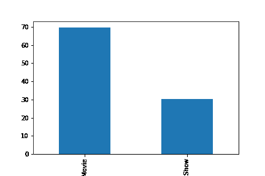
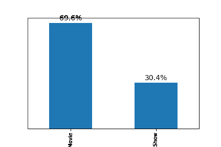
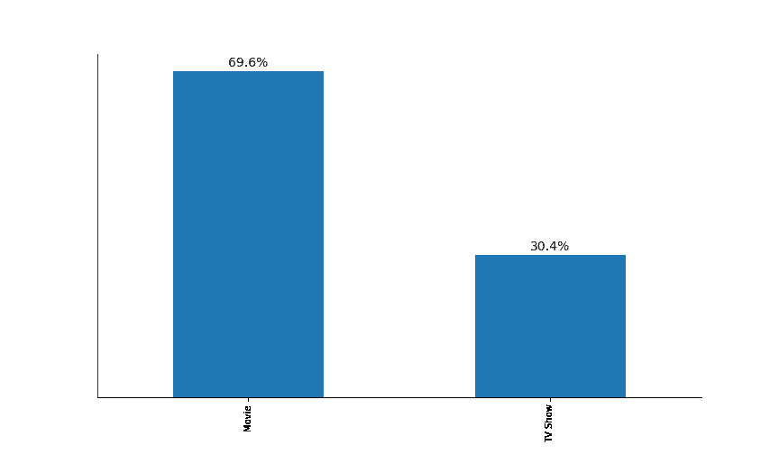
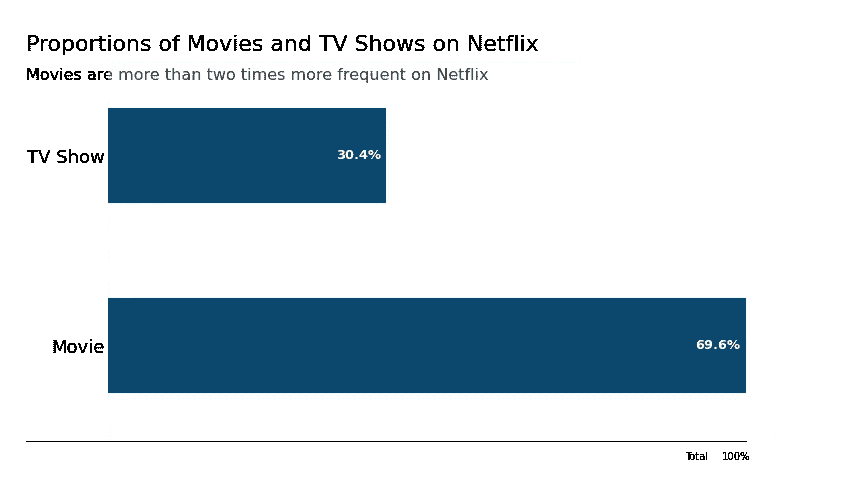

# 如何在 Python 中让你的情节吸引人

> 原文：<https://www.dataquest.io/blog/how-to-make-your-plots-appealing-in-python/>

January 19, 2022

数据可视化可以说是数据科学项目中最重要的一步，因为这是你向观众传达你的发现的方式。你这样做可能有多种原因:说服投资者为你的项目提供资金，强调公司变革的重要性，或者只是在年度报告中展示结果，强调最有价值的成就。

无论你的最终目标是什么，清晰地呈现数据是至关重要的。在这篇文章中，我将谈论在 Python 中改进 T2 数据可视化的技术方面。然而，取决于你的听众，这些方面中的一些可能比另一些更相关，所以在决定展示什么时要明智地选择。

我们将使用包含网飞电影和电视节目([https://www.kaggle.com/shivamb/netflix-shows](https://www.kaggle.com/shivamb/netflix-shows))数据的数据集。

我们开始吧！

## 基本情节

首先，我们来看数据集。

```
# Imports
import pandas as pd
import matplotlib.pyplot as plt
import seaborn as sns

netflix_movies = pd.read_csv("./data/netflix_titles.csv") # From
netflix_movies.head()
```

我们有大量的列，我们可以很容易地可视化。我们的一个问题可能是*网飞有多少部电影和电视剧？*

```
netflix_movies["type"].value_counts()
```

我们的电影大约是电视剧的 2.5 倍。然而，简单地用数字来表示你的结果并不是一个好主意(除非是“我们今年增长了 30%！”，那么这个号可以很有效)。普通的数字比可视化更抽象。

好了，开始出图吧。表示分类数据的一个好方法是使用简单的条形图。

```
netflix_movies["type"].value_counts().plot.bar()
```

[T2】](https://www.dataquest.io/wp-content/uploads/2022/01/python-bar-plot1.webp)

这是我们用熊猫可以做出的最基本的剧情。我们现在可以很容易地看到电影和电视节目数量的差异。

## 首次改进

我已经看到了第一个问题:我们仍然有纯数字。我认为显示这些数据中有趣的东西的最好方法是显示相对百分比。

```
netflix_movies["type"].value_counts(normalize=True).mul(100).plot.bar()
```



这样好多了。但是如果我们想确定电影和节目的确切比例呢？我们可以从每个条形到 y 轴来回猜测，但这不是一件容易的事情。我们应该把数字直接标在条形的上方！

```
# Label bars with percentages
ax = netflix_movies["type"].value_counts(normalize=True).mul(100).plot.bar()
for p in ax.patches:
	y = p.get_height()
	x = p.get_x() + p.get_width() / 2

	# Label of bar height
	label = "{:.1f}%".format(y)

	# Annotate plot
	ax.annotate(
    	label,
    	xy=(x, y),
    	xytext=(0, 5),
    	textcoords="offset points",
    	ha="center",
    	fontsize=14,
	)

# Remove y axis
ax.get_yaxis().set_visible(False)
```

上面的代码相当高级，所以花些时间在文档中理解它是如何工作的。可以从[这一页开始。](https://matplotlib.org/stable/api/_as_gen/matplotlib.patches.Rectangle.html)



现在看起来干净多了:我们通过去除无用的杂波提高了信噪比。

下一步是使用 figsize 参数增加绘图的大小。让我们也把脊骨去掉。

```
# Increase the size of the plot
ax = netflix_movies["type"].value_counts(normalize=True).mul(100).plot.bar(figsize=(12, 7))

# Remove spines
sns.despine()

# Label bars with percentages
for p in ax.patches:
	y = p.get_height()
	x = p.get_x() + p.get_width() / 2

	# Label of bar height
	label = "{:.1f}%".format(y)

	# Annotate plot
	ax.annotate(
    	label,
    	xy=(x, y),
    	xytext=(0, 5),
    	textcoords="offset points",
    	ha="center",
    	fontsize=14,
	)

# Remove y axis
ax.get_yaxis().set_visible(False)
```



剧情开始好看了。然而，我们几乎看不到 x 记号标签(“电影”和“电视节目”)。此外，我们还需要将它们旋转 90 度以提高可读性。

我还认为我们需要增加 x 记号标签的透明度，因为这些标签不应该成为关注的焦点。也就是说，观众首先要看到两个杠的高度差异，然后才关注周围的信息。

但是，我将百分比的透明度保持在 100%，因为这是我们想要传达的信息(两个条形之间有很大的差异)。

将以下代码行添加到前面的代码中:

```
# Increase x ticks label size, rotate them by 90 degrees, and remove tick lines
plt.tick_params(axis="x", labelsize=18, rotation=0, length=0)

# Increase x ticks transparency
plt.xticks(alpha=0.75)
```

停一下，回头看看原来的剧情。注意不同之处。现在想想你做过的所有决定。在计划的每一步，**你都应该考虑你在做什么**，否则最终的计划会变得不可理解和不准确。

## 添加标题和副标题

现在我们继续。我们遗漏了两条关键信息:标题和副标题。标题应该告诉我们正在看什么，而副标题应该把观众的注意力引向我们认为重要的东西。

天生的本能就是只用`plt.title()`。然而，居中对齐的文本使我们的情节看起来笨拙，因为我们的眼睛喜欢直线。因此，我们将把标题和副标题靠左对齐，使其与第一栏完全成直线。

我还决定移除底部和左侧的脊骨(通过使用`sns.despine()`中的参数`left=True`和`bottom=True`)，因为它们不会与其他元素对齐。你可以看到我正在迭代地做决定，所以如果你第一次接近数据集时不能创建一个完美的图，不要气馁。实验！

像前面一样，将以下代码行添加到前面的代码中:

```
# Font for title
title_font = {
	"size": 22,
	"alpha": 0.75
}

# Font for subtitle
subtitle_font = {
	"size": 16,
	"alpha": 0.80
}

# Title
plt.text(
	x=-0.25,
	y=80,
	s="Proportions of Movies and TV Shows on Netflix",
	ha="left",
	fontdict=title_font,
)

# Subtitle
plt.text(
	x=-0.25,
	y=75,
	s="Movies are more than two times more frequent on Netflix",
	ha="left",
	fontdict=subtitle_font,
)
```

## 颜色

颜色呢？首先，默认的蓝色看起来很好看！然而，我们可以选择其他颜色来补充我们的品牌或传达一种情感。不要使用非常强烈的默认颜色(“红色”、“绿色”等)。).这些不是我们在自然界中常见的颜色。而是在谷歌上看一些大自然的照片，挑一个你最喜欢的颜色。我正在使用 ColorZilla 扩展来挑选颜色的十六进制代码。在这种情况下，我会选择另一种蓝色

```
## Complete code to generate the plot below. Note that the only difference is the color parameter in the first line

# Increase the size of the plot
ax = netflix_movies["type"].value_counts(normalize=True).mul(100).plot.bar(figsize=(12, 7), color="#3B97B6")

# Remove spines
sns.despine(left=True, bottom=True)

# Label bars with percentages
for p in ax.patches:
	y = p.get_height()
	x = p.get_x() + p.get_width() / 2

	# Label of bar height
	label = "{:.1f}%".format(y)

	# Annotate plot
	ax.annotate(
    	label,
    	xy=(x, y),
    	xytext=(0, 5),
    	textcoords="offset points",
    	ha="center",
    	fontsize=14,
	)

# Remove y axis
ax.get_yaxis().set_visible(False)

# Increase x ticks label size, rotate them by 90 degrees, and remove tick lines
plt.tick_params(axis="x", labelsize=18, rotation=0, length=0)

# Increase x ticks transparency
plt.xticks(alpha=0.75)

# Font for title
title_font = {
	"size": 22,
	"alpha": 0.75
}

# Font for subtitle
subtitle_font = {
	"size": 16,
	"alpha": 0.80
}

# Title
plt.text(
	x=-0.25,
	y=80,
	s="Proportions of Movies and TV Shows on Netflix",
	ha="left",
	fontdict=title_font,
)

# Subtitle
plt.text(
	x=-0.25,
	y=75,
	s="Movies are more than two times more frequent on Netflix",
	ha="left",
	fontdict=subtitle_font,
)
```


现在剧情看起来真好看！但是我们能改善它吗？当然可以。

## 横条图！

我们可以创建一个水平条形图，并对齐所有文本数据！让我们看一看。

```
# Increase the size of the plot
ax = netflix_movies["type"].value_counts(normalize=True).mul(100).plot.barh(figsize=(12, 7), color="#0C476E")

# Remove spines
sns.despine(left=True)

# Label bars with percentages
ax.bar_label(
	ax.containers[0],
	labels=["69.6%", "30.4%"],
	label_type="edge",
	size=13,
	padding=-50,
	color="white",
	weight="bold"
)

# Increase y ticks label size, rotate them by 90 degrees, and remove tick lines
plt.tick_params(axis="y", labelsize=18, rotation=0, length=0)

# Increase x ticks transparency
plt.yticks(alpha=0.75)

# Remove x axis
ax.get_xaxis().set_visible(False)

# Font for titles
title_font = {
	"size": 22,
	"alpha": 0.75
}

# Font for subtitles
subtitle_font = {
	"size": 16,
	"alpha": 0.80
}

# Title
plt.text(
	x=-9,
	y=1.55,
	s="Proportions of Movies and TV Shows on Netflix",
	ha="left",
	fontdict=title_font,
)

# Subtitle
plt.text(
	x=-9,
	y=1.4,
	s="Movies are more than two times more frequent on Netflix",
	ha="left",
	fontdict=subtitle_font,
)

# Extend bottom spine to align it with titles and labels
ax.spines.bottom.set_bounds((-9, 69.6))

# Add total
plt.text(
	x=63,
	y=-0.6,
	s="Total",
	fontdict={"alpha": 0.75},
)

# Add 100%
plt.text(
	x=67,
	y=-0.6,
	s="100%",
	fontdict={"alpha": 0.75},
)
```

[](https://www.dataquest.io/wp-content/uploads/2022/01/python-bar-plot-proportions3.webp) 与之前的图相比，除了将标题和副标题与标签对齐之外，我还在条形内直接添加了刻度标签以减少混乱，更改了颜色以提高对比度，并恢复了与图的其余部分对齐的底部脊线。您还可以看到，我添加了“总计 100%”来表示百分比的总和为 100。

看这个图，我们立刻注意到条形图的不同，我们的目光自然地从左到右、从上到下移动；因此，我们将所有需要的信息放在战略位置，以便与受众进行清晰的交流。

## 结论

完成绘图后，我注意到我可以增加百分比的字体大小，使它们更加明显，我还可以反转 y 轴，将“电影”栏移动到“电视节目”栏上方，因为较高的值自然应该在顶部。

但我觉得就是不值得努力。在某些时候，你应该停止改进一个情节，而只是说它“足够好了”当你在学习的时候，[尽你所能制作最好的情节](https://www.dataquest.io/blog/how-to-plot-a-bar-graph-matplotlib/)，浏览文档，学习新技术！然而，当您必须交付数据可视化时，只需在某个点停止—当绘图质量可以接受时。

概括来说，我们介绍了以下内容:

*   增加地块的大小
*   取消情节
*   放大轴的标签
*   包括标题和副标题
*   让二手信息更加透明
*   对齐绘图的所有元素
*   使用自然的颜色

通过应用这七条规则，你会让你的情节对你的观众更有吸引力和信息量。

欢迎在 LinkedIn 或 T2 GitHub 上问我任何问题。快乐编码，快乐绘图！