# 在您的机器上安装 R

> 原文：<https://www.dataquest.io/blog/installing-r-on-your-computer/>

February 7, 2022

2020 年初，全球数据量估计为 [44 zettabytes](https://seedscientific.com/how-much-data-is-created-every-day/) 。到 2025 年，每天生成的数据量预计将达到 463。这些数据的主要来源如下:

*   **社交数据**来自脸书的帖子、推文、谷歌趋势
*   **来自医疗设备、卫星、网络日志的机器数据**
*   **来自发票、付款单、付款方式、折扣的交易数据**

企业和组织可以通过分析大量数据(**“大数据”**)来揭示模式并获得洞察力，从而获得竞争优势。**数据分析**研究我们如何收集、处理和解释数据。**数据科学**应用数学分析、统计技术和机器学习算法从数据中提取洞察力。

*商业智能* (BI)应用程序，如 Power BI 和 Tableau，有助于分析和可视化数据。然而，大多数时候，数据以非结构化格式出现，需要预处理和转换。商业智能应用程序无法执行这样的转换。数学或统计分析也不能使用它们。执行这些任务需要强大的编程语言。 **R** 、 **Python** 和 **Julia** 是数据分析和数据科学领域流行的编程语言。

## R 是什么？

**R** 是 Ross Ihaka 和 Robert Gentleman 在 1993 年开发的免费开源脚本语言。它是 S 编程语言的替代实现，后者在 20 世纪 80 年代被广泛用于统计计算。R 环境设计用于执行复杂的统计分析，并使用许多可视化图形显示结果。 [R 编程语言](https://www.dataquest.io/r-for-data-science-courses/)是用 C、Fortran 和 R 本身编写的。大多数 R 包是用 R 编程语言编写的，但是繁重的计算任务是用 C、C++和 Fortran 编写的。r 允许与 Python、C、C++、.Net 和 Fortran。

r 既是一种编程语言，也是一种软件开发环境。换句话说，R 这个名字描述了 R 编程语言和用于运行 R 代码的 R 软件开发环境。r 是*的词汇范围*。词法范围是静态范围的另一个名称。这意味着程序的词法结构决定了变量的范围，而不是最近赋值的变量。下面是 R 中词法范围的一个例子:

```
x <- 5
y <- 2

multiple <- function(y) y * x

func <- function() {
    x <- 3
    multiple(y)
}

func()
```

```
Output:
10
```

变量`x <- 5`和`y <- 2`是全局变量，我们可以在 R 函数内部和外部使用它们。然而，当一个变量在函数`(func())`中声明为`(x <- 3)`，而另一个函数`(multiple())`在函数`(func())`中被调用时，声明的变量`(x <- 3)`只有当且仅当声明的变量是被调用函数`(multiple())`的输入时才会被引用。据说声明变量`(x <- 3)`的范围没有扩展到被调用函数`(multiple())`中。

在上面的代码片段中，`func()`函数返回`multiple()`函数。`multiple()`函数只接受*一个输入参数`y`；然而，它使用两个变量`x`和`y`来执行乘法。它会全局搜索`x`变量*，因为*它不是函数的输入参数。变量`y`是`multiple()`函数的输入参数，所以它先在本地搜索`y`(称为**本地推理**)。如果它找不到本地声明的`y`变量，它会进行全局搜索。在上面的代码片段中，`multiple()`函数是用全局值`x`、`(x <-2)`和全局值`y`、`(y <-2)`来计算的。它返回值 10。*

在下一个例子中，`multiple()`函数查找本地声明的`y`，`(y <- 10)`。它使用这个本地值`y`，而不是全局值`(y <-2)`。因为变量`x`不是`multiple()`函数的输入，所以它会全局搜索它的值`(x <- 5)`。该函数返回值 50

```
x <- 5
y <- 2

multiple <- function(y) y * x

func <- function() {
    x <- 3
    y <- 10
    multiple(y)
}

func()
```

```
Output:
50
```

可以在 **Windows** 、 **macOS X** 和 **Linux** 操作系统上编译运行 R。它还带有一个*命令行接口*。`>`字符代表命令行提示符。下面是一个与 R 命令行的简单交互:

```
> a <- 5
> b <- 6
> a * b
[1] 30
```

R 编程语言的特性被组织成包。R 编程语言的标准安装附带了 25 个这样的包。可以从*综合 R 档案网* ( [CRAN](https://cran.r-project.org/) )下载附加包。R 项目目前正在由 R 开发核心团队开发和支持。

## 为什么用 R

r 是用于统计计算、数据分析和机器学习的最先进的编程语言。它已经存在了近三十年，CRAN 上有超过 12，000 个软件包可供下载。这意味着有一个 R 包支持您想要执行的任何类型的分析。以下是一些你应该[学习和使用 R](https://www.dataquest.io/path/r-basics-for-data-analysis/) 的理由:

*   **免费开源:**
    R 编程语言是开源的，是在通用公共许可证(GNU)下发布的。这意味着您可以免费使用 R 的所有功能，没有任何限制或许可要求。因为 R 是开源的，所以欢迎每个人对这个项目做出贡献，而且因为它是免费的，所以开源社区很容易发现并修复错误。

*   **受欢迎程度:**
    R 编程语言在 2021 年顶级编程语言[IEEE spectrum 排名](https://spectrum.ieee.org/top-programming-languages/)中排名第 7，在 2022 年 1 月的 [TIOBE 指数](https://www.tiobe.com/tiobe-index/)排名中排名第 12。根据 [edX](https://blog.edx.org/9-top-programming-languages-for-data-science) 的说法，它是仅次于 Python 的第二大最流行的数据科学编程语言，也是最流行的统计分析编程语言。r 的流行也意味着在 Stackoverflow 这样的平台上有广泛的社区支持。R 也有一个详细的在线文档，R 用户可以参考以寻求帮助。

*   **高质量可视化:**
    [R 编程语言以高质量可视化而闻名](https://www.dataquest.io/path/data-visualization-with-r/)。r 的`ggplot2`是图形语法的详细实现——一个简明描述图形组成部分的系统。借助 R 的高质量图形，您可以轻松实现直观的交互式图形。

*   **一种用于数据分析和数据科学的语言:**
    R 编程语言不是一种通用编程语言。这是一种专门用于统计计算的编程语言。因此，R 的大多数函数都执行向量化操作，这意味着您不需要遍历每个元素。这使得运行 R 代码非常快。分布式计算可以在 R 中执行，因此任务可以在多个处理计算机中进行分配，以减少执行时间。r 集成了 Hadoop 和 Apache Spark，可以用来处理大数据量。r 可以连接各种数据库，它有进行机器学习和深度学习操作的包。

*   **在学术界和工业界从事令人兴奋的职业的机会:**
    R 编程语言在学术界被广泛信任和用于研究。r 越来越多地被政府机构、社交媒体、电信、金融、电子商务、制造和制药公司所使用。使用 R 的顶级公司包括亚马逊、谷歌、ANZ 银行、Twitter、LinkedIn、托马斯·库克、脸书、埃森哲、Wipro、纽约时报等等。对 R 编程语言的良好掌握在学术界和工业界打开了各种各样的机会。

## 在 Windows 操作系统上安装 R

要在 Windows 操作系统上安装 R:

1.  进入 [CRAN](https://cran.r-project.org/) 网站。

2.  点击**“下载 R for Windows”**。

3.  点击**“首次安装 R”**链接下载 R 可执行文件(。exe)文件。

4.  运行 R 可执行文件开始安装，并允许应用程序对您的设备进行更改。

5.  选择安装语言。

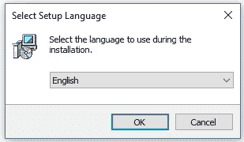

6.  遵循安装说明。

[T2】](https://www.dataquest.io/wp-content/uploads/2022/02/setup-r-for-windows.webp)

7.  点击**“完成”**退出安装设置。

[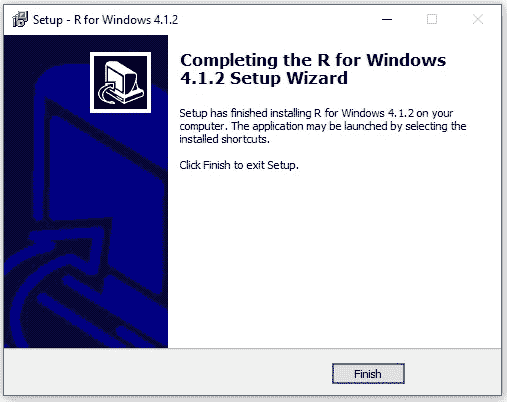T2】](https://www.dataquest.io/wp-content/uploads/2022/02/setup-r-for-windows-2.webp)

r 现已成功安装在您的 Windows 操作系统上。打开 R GUI，开始编写 R 代码。

[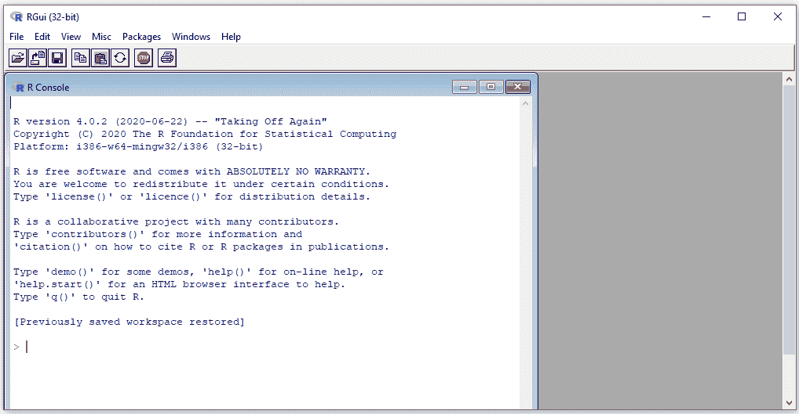T2】](https://www.dataquest.io/wp-content/uploads/2022/02/rgui-32-bits.webp)

## 在 MacOS X 上安装 R

在 MacOS X 上安装 R 与在 Window OS 上安装 R 非常相似。区别在于你必须下载的文件格式。该过程如下:

1.  进入 [CRAN](https://cran.r-project.org/) 网站。
2.  点击**“下载 R for MAC OS”**。
3.  下载最新版本的 R GUI。pkg 文件)下**【最新发布】**。你可以通过“旧目录”或“克兰档案”链接下载更老的版本。
4.  运行。pkg 文件，并按照安装说明进行操作。

## 附加 R 接口

除了 R GUI，其他与 R 接口的方式还包括 RStudio 集成开发环境( **RStudio IDE** )和 **Jupyter Notebook** 。要在 RStudio 上运行 R，首先需要在电脑上安装 R，而要在 Jupyter Notebook 上运行 R，则需要安装一个 R 内核。RStudio 和 Jupyter Notebook 为 R 提供了一个交互式友好图形界面，极大地改善了用户体验。

## 安装 RStudio 桌面

要在您的计算机上安装 RStudio Desktop，请执行以下操作:

1.  访问 [RStudio](https://www.rstudio.com/) 网站。
2.  点击右上角的**“下载”**。
3.  点击**【r studio 开源许可证】**下的**【下载】**。
4.  下载适合您电脑的 RStudio Desktop。
5.  运行 RStudio 可执行文件(。exe)或 Apple Image Disk 文件(。dmg)用于 macOS X。

[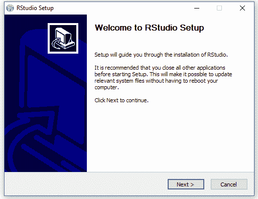T2】](https://www.dataquest.io/wp-content/uploads/2022/02/rstudio-setup-1.webp)

6.  按照安装说明完成 RStudio 桌面安装。

[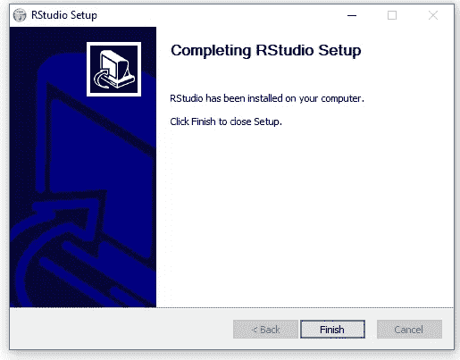T2】](https://www.dataquest.io/wp-content/uploads/2022/02/rstudio-setup-2.webp)

RStudio 现已成功安装在您的计算机上。RStudio 桌面 IDE 界面如下图所示:

[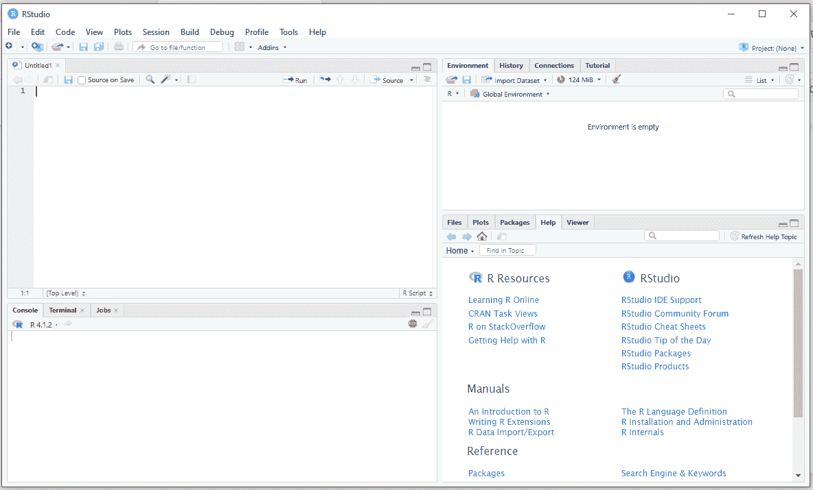T2】](https://www.dataquest.io/wp-content/uploads/2022/02/rstudio-home-interface.webp)

使用 RStudio 与 R 交互的另一种方式是使用 *RStudio 服务器*。RStudio 服务器提供了基于浏览器的 R 接口。

## 在 Jupyter 笔记本电脑上安装 R 内核

要在您的电脑上安装 Jupyter Notebook 上的 R kernel，请执行以下操作:

1.  下载[蟒蛇](https://www.anaconda.com/products/individual)。
2.  运行下载的文件。

[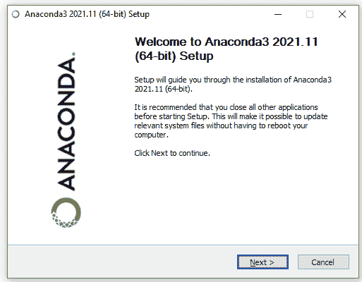T2】](https://www.dataquest.io/wp-content/uploads/2022/02/anaconda-64bit-setup.webp)

3.  按照安装说明完成 Anaconda 发行版的安装。

[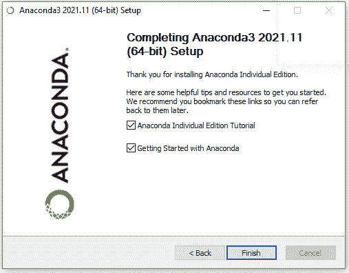T2】](https://www.dataquest.io/wp-content/uploads/2022/02/anaconda-64bit-setup-2.webp)

4.  以管理员身份打开 Anaconda 提示符。

[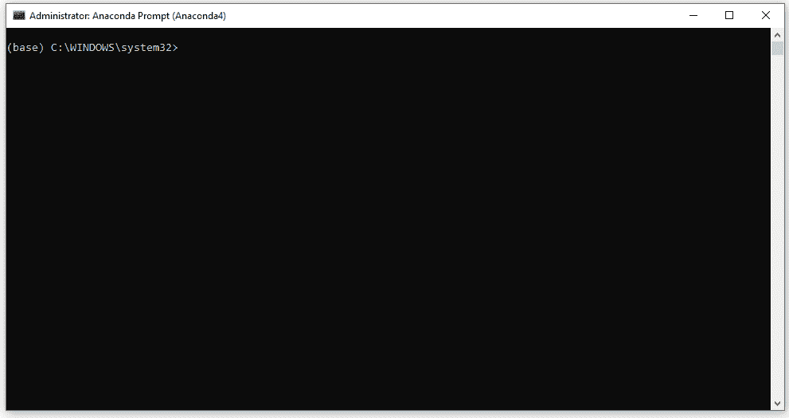T2】](https://www.dataquest.io/wp-content/uploads/2022/02/administrator-anaconda-prompt.webp)

5.  将目录更改为 where 文件在计算机上的位置。(我电脑上的目录是`C:\Program Files\R\R-4.1.2\bin`。)然后在 Anaconda 提示符下运行 R

    ```
    >cd C:\Program Files\R\R-4.1.2\bin
    >R.exe
    ```

[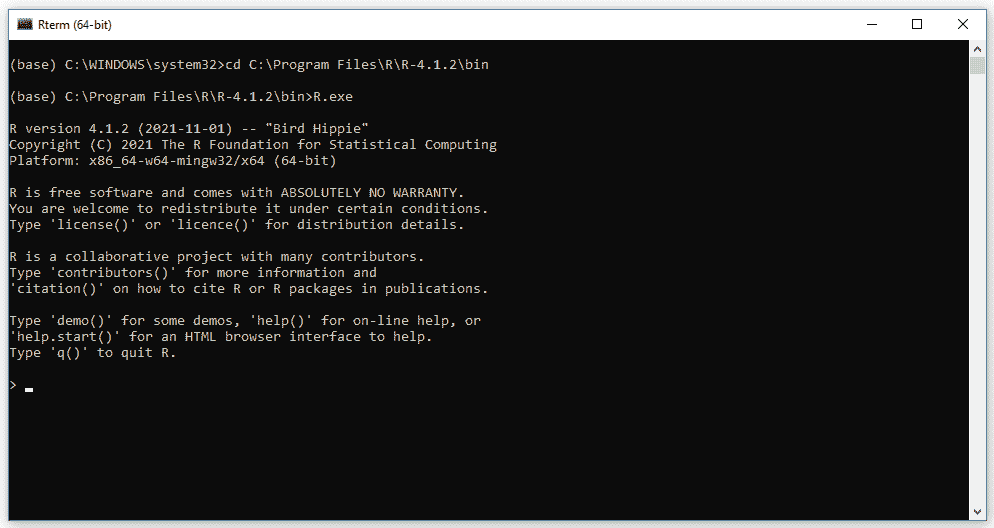T2】](https://www.dataquest.io/wp-content/uploads/2022/02/administrator-anaconda-prompt-2.webp)

6.  使用以下代码安装`devtool`包，以启用`install_github()`功能

    ```
    > install.packages("devtools")
    ```

7.  使用以下代码从 GitHub 安装 R 的`IRkernel`:

    ```
    devtools::install_github("IRkernel/IRkernel")
    ```

8.  使用以下代码指示 Jupyter Notebook 查找 IRkernel:

    ```
    IRkernel::installspec()
    ```

9.  打开 Jupyter 笔记本，打开一个 R 内核的新笔记本

[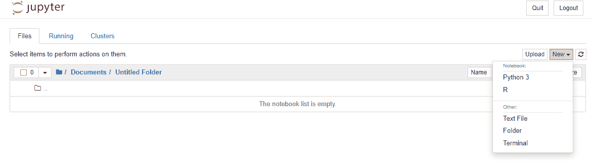](https://www.dataquest.io/wp-content/uploads/2022/02/jupyter-new-notebook.webp)
MAC OS 的步骤类似，除了:

*   如果尚未安装，安装以下软件包和`devtools`

    ```
     install.packages(c('repr', 'IRdisplay', 'evaluate', 'crayon', 'pbdZMQ', 'devtools', 'uuid', 'digest'))
    ```

## 结论

R 是数据分析和数据科学的重要脚本语言。它为统计分析和输出漂亮的图形而优化。它也是一种非常快速的编程语言，因为它的大多数函数都执行向量化操作。r 可以用于分布式计算处理大数据，可以连接不同的数据库。可以在 R GUI，Jupyter Notebook，或者 RStudio 上写 R 代码。R 知识对于在学术界和工业界的成功职业生涯是很重要的。