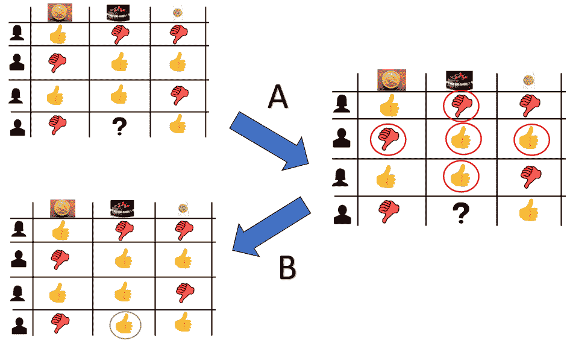
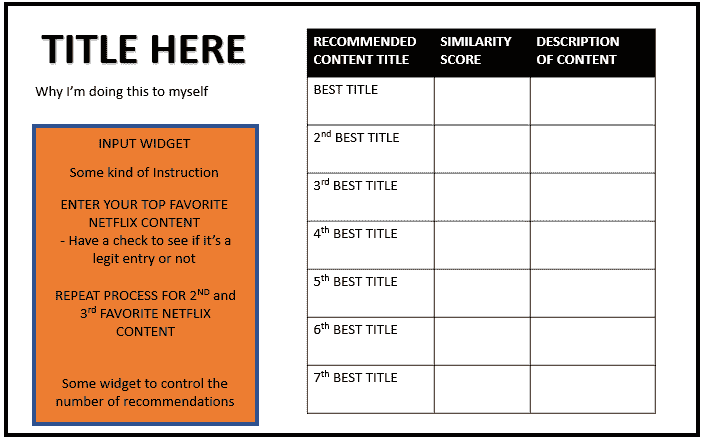
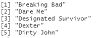
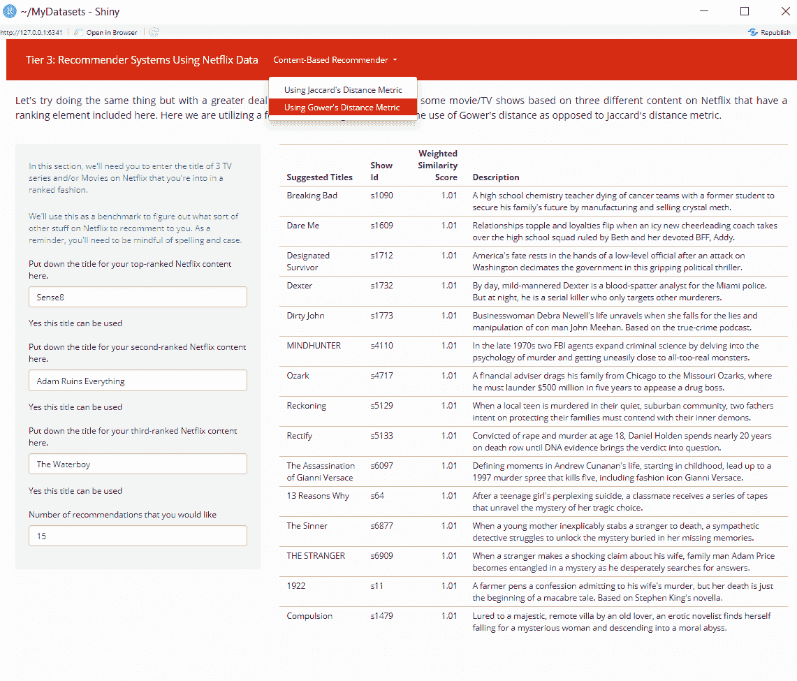
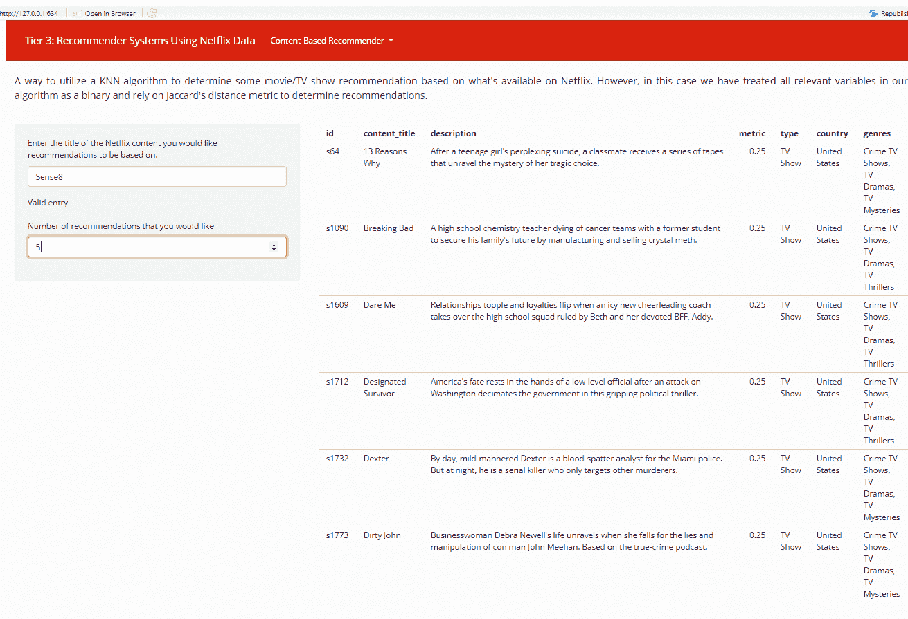

# 利用 R 中的网飞数据构建推荐系统

> 原文：<https://www.dataquest.io/blog/building-a-recommender-system-with-netflix-data-in-r/>

January 6, 2022

好了，我终于有机会完成这个三部曲系列了。这是一个漫长的过程，但迟到总比不到好。因为已经有一段时间了，所以我想快速回顾一下。

为了展示如何着手一个无指导的数据项目，我决定使用一些网飞数据来展示三个项目的过程。第一个是对数据集相当基本的探索性分析，使用了一些数据争论和可视化的基本技能。接下来是实现[闪亮包，通过引入一些动态元素来升级一些可视化。](https://community.dataquest.io/t/moving-on-up-upscaling-your-analysis-of-netflix-data-with-a-dashboard/556298)总而言之，这里展示的案例研究并不太难；只不过是一大堆繁忙的工作(又名。现实生活中的数据工作)。

既然我已经查看了这些数据，那么下一个合乎逻辑的步骤就是将这些数据用于一些现实生活的目的。那么，有什么比创建经典的推荐系统更好的方法呢？推荐系统是机器学习中的一个主要应用。

## 什么是基于内容的推荐系统，为什么它们有用？

你可能对推荐系统很熟悉，主要是因为 YouTube、亚马逊和其他基于流媒体消费者的网络服务的兴起。然而，如果你需要一个快速的定义(比如在一个数据科学职位的[面试中)，你可以把它解释为一个算法的基于过滤器的应用，该算法试图根据一些已知的因素来预测偏好(例如，电影、歌曲、视频剪辑、产品)。](https://www.dataquest.io/blog/career-guide-data-science-job-interview/)

一般来说，有几种主要类型的推荐系统在使用。一种是[基于协作的模式](https://en.wikipedia.org/wiki/Collaborative_filtering)。顾名思义，它使用多个过去用户的输入来为未来用户产生推荐。通常，这将是一个历史性的评级概况。



*图一。在这种情况下，过去成员对蛋糕/馅饼/饼干作为甜点的评级历史将有助于预测是否推荐蛋糕作为与所述人对馅饼和饼干的意见相关的甜点。*

虽然这种方法的优点是不需要领域知识来确定推荐，但是它也有一些缺点:

1.  **冷启动:**由于在使用模型之前没有建立连接，系统或系统的一部分不能正常工作的问题。换句话说，如果一开始没有任何东西，那么这种推荐是否会比随机挑选更好，这是一种胡乱的猜测。
2.  **稀疏性:**考虑到可能潜在地存在大量的内容/库存，有可能大多数评级仅针对项目的一个小子集，并且这为潜在有价值的选择留下了很少的继续。
3.  **可扩展性:**由于数据库中可能有数百万用户和/或内容，因此大量的计算能力是必要的。

虽然这是一个非常有效的选择，但是这个网飞数据没有任何与用户行为相关的数据，它只包含与内容相关的信息。因此，我们将不得不使用一种被称为[基于内容的推荐系统](https://en.wikipedia.org/wiki/Recommender_system#Content-based_filtering)的替代模型。顾名思义，这是一种依赖于项目描述文件来生成推荐的方法。

当你去商店，让售货员根据你的一些重要购买品质推荐一种产品(比如说，一辆汽车)时，就会发生这种情况。然而，您实际上只是通过填写某种用户配置文件来自动化这个过程。

[T2】](https://www.dataquest.io/wp-content/uploads/2022/01/car-recommender-based-on-user-profile-min.webp)

*图二。这有点像去汽车经销店购买一些选择，但没有无用的内涂层追加销售。*

虽然这种方法在可伸缩性方面确实有其缺陷，并且在推荐您的原始首选设置之外的任何内容方面有其局限性，但它确实解决了“冷启动”或“稀疏性”问题，因为它不依赖于现有的连接来进行预测。它只是基于每个特征的权重，这表示对用户的重要性。

这就是关于推荐系统的理论。让我们转到如何使用我们的网飞数据集来实现这一点。

## 这个计划

像所有的事情一样，我们将从我希望这个项目看起来如何的快速视觉开始。在我看来，它应该是这样的:

[T2】](https://www.dataquest.io/wp-content/uploads/2022/01/profile-table-for-recommender-system.jpg-min.webp)

*图 3。很明显，我们需要用这个闪亮的包裹。*

在事物的后端方面，你可以选择很多算法来方便推荐。这是决定你的推荐系统质量的众多因素中的第一个。考虑到系统的简单性及其使用更复杂的算法产生相当有竞争力的结果的能力，我们将使用两种方法:(1)聚类和(2)[K-最近邻](https://app.dataquest.io/m/140/) (KNN)建模来产生我们的推荐。

既然我们已经确定了推荐系统的类型和方法，下一个重要的因素就是如何评估数据来生成这些推荐。通常，像欧几里得距离或曼哈顿距离这样的选项在大多数情况下都有效(如在 KNN 建模中)。然而，这里有一些考虑是重要的，因为某些距离度量对于特定的数据类型更好。考虑到该数据集主要包含大量维度的定性数据，我们将使用典型距离度量的替代方法，其形式为(1) [Jaccard 距离](https://en.wikipedia.org/wiki/Jaccard_index)用于 KNN 方法，以及(2) [Gower 距离](https://medium.com/analytics-vidhya/gowers-distance-899f9c4bd553)，用于测量聚类的个体之间的差异。(这个指标的细节超出了这篇文章的范围，但是你可以在这里阅读[，在这里](http://citeseerx.ist.psu.edu/viewdoc/download?doi=10.1.1.412.4155&rep=rep1&type=pdf)[阅读](https://rstudio-pubs-static.s3.amazonaws.com/423873_adfdb38bce8d47579f6dc916dd67ae75.html)，在这里[阅读](https://cran.r-project.org/web/packages/gower/vignettes/intro.pdf)。)然而，TLDR 选择这个的理由是，它允许我们测量非数字数据之间的距离。

现在，与 KNN 方法不同，聚类方法将使用三种不同的内容输入，而不是一种，因为我们希望具体了解一个人对流式内容的兴趣概况，以生成推荐。然而，这些输入将根据个人对三种类型内容的排名而有所不同，这意味着我们将在算法中引入一个加权因子。这个加权因子既要足够大，以显示选择之间的差异，又要足够小，以至于不会严重影响所提供的建议。

现在我们知道了一般过程，我们需要确定的最后一件事是在我们的聚类方法中应该使用哪些可用变量。通常，您会对目标人群的子样本进行一些深入的市场研究，以确定内容和可观看性之间的趋势或模式(可能根据评级系统或观看频率来衡量)。很明显，我们手头没有这方面的知识，也没有资源去尝试找到答案，那么下一个最好的办法就是运用你的最佳判断来选择影响可观看性的变量。经过一些初步探索和合理假设后，我们将使用数据集中的以下变量:

*   显示 ID——我们需要它来让推荐系统工作
*   内容类型——有些人更喜欢看电视剧而不是电影，反之亦然
*   标题——我们需要这个来让推荐系统工作
*   演员——这假设内容中的演员可以影响受欢迎程度/可观看性
*   列出于—包含一个流派列表(最多三个。)
*   国家/地区—用于区分英语和非英语内容
*   分级—内容分级(例如，PG-13 或 TV-MA)
*   描述—我们需要这个作为最终产品
*   发布年份—确定内容的年龄

因为演员阵容可能很大，我们会将主演(即男主角或女主角)视为对收视率最重要的影响因素。所以，我们将只包括那些男演员或女演员。

现在，让我们一步一步地完成这个计划。

## 该过程

与任何数据项目一样，我们从网飞数据集的一些预处理开始。对于这两种生成建议的方法，初始过程是相同的。我们需要完成以下工作:

1.  从列出的演职人员中提取出主要导演和主演后，创建一个数据框架。

    ```
    ```
    # Subset the data to only get the lead cast member 
    netflix_lead = as.data.frame(str_split(netflix$cast, ",", simplify = TRUE)[, 1]) 
    colnames(netflix_lead) = "cast_lead"
    ```

# 对于任何未列出的造型实例，将其视为具有“未知造型”

网飞 _ 铅=网飞 _ 铅% > % mutate(cast_lead = if else(Cast _ lead = = " "，"未知演员"，Cast _ lead))

```
 2\. Differentiate Netflix content based on whether it is presumably English-speaking content or not based on listed genre, country of origin, and title.
<pre><code class="language-r">```
# Create a means to differentiate content as either English-speaking or not based on genre 
library(tidyverse)
netflix_english_content = netflix %>% select(title, listed_in) %>% 
                            mutate(
                              non_english_content = 
                                     ifelse(str_detect(listed_in, "(.+/s)?British TV Shows(.+/s)?") == TRUE, FALSE,
                                     ifelse(str_detect(listed_in, "(.+/s)?International TV Shows(.+/s)?|(.+/s)?International Movies(.+/s)?|(.+/s)?Anime Series(.+/s)?|(.+/s)?Anime Features(.+/s)?|(.+/s)?Korean TV Shows(.+/s)?|(.+/s)?Spanish-Language TV Shows(.+/s)?") == TRUE, TRUE, FALSE))
                              )

# Create a means for differentiating content as English-speaking based on country of origin
netflix_english_nation = netflix %>% select(title, country) %>% 
                            mutate(
                              in_english_nation = ifelse(str_detect(country, "(.+/s)?United States(.+/s)?|(.+/s)?United Kingdom(.+/s)?|(.+/s)?Canada(.+/s)?|(.+/s)?Australia(.+/s)?|(.+/s)?New Zealand(.+/s)?|(.+/s)?Ireland(.+/s)?|(.+/s)?Jamaica(.+/s)?|(.+/s)?Barbados(.+/s)?") == TRUE, TRUE, FALSE)
                              )

# Create a function that looks at characters in the title to see if it meets a cut-off criterion 
is_not_english = function(string){
  some_count = 0 # Give a running count for any instance of non-ASCII character 

  for(char in str_split(string, boundary("character"))[[1]]){
    if(str_detect(char, "[A-Za-z0-9 \\*\\!\\(\\):,&\\@\\'\\%\\.\\?\\%\\-]") == F){
      some_count = some_count + 1
    }
  }
  # Characters with at least 2 non-ASCII character = likely not English
  outcome = ifelse(some_count >= 2, "Likely Not English", "Likely English") 

  return(outcome)
}

# Apply function to propose whether the content is English-speaking or not based on title 
netflix_cleaning = cbind(as.data.frame(unlist(map(netflix$title, is_not_english))) %>% 
                                    rename(is_english = "unlist(map(netflix$title, is_not_english))"), netflix)

# Determine content as either English-speaking or not based on a consensus of these three variables and then combine with the original Netflix data set into one
english_check = cbind(netflix_english_nation %>% select(in_english_nation), netflix_english_content %>% select(non_english_content), netflix_cleaning)

final_english_check = english_check %>% 
  select(title ,non_english_content, is_english, in_english_nation, cast, director, description) %>% 
  mutate( assume_english = 
        ifelse(c(non_english_content == T & in_english_nation == T & is_english == "Likely English"), "no",
        ifelse(c(non_english_content == T & in_english_nation == F & is_english == "Likely English"), "no",              
        ifelse(c(non_english_content == T & in_english_nation == T & is_english == "Likely Not English"), "no",
        ifelse(c(non_english_content == T & in_english_nation == F & is_english == "Likely Not English"), "no", 
        ifelse(c(non_english_content == F & in_english_nation == T & is_english == "Likely English"), "yes",
        ifelse(c(non_english_content == F & in_english_nation == F & is_english == "Likely English"), "no",
        ifelse(c(non_english_content == F & in_english_nation == T & is_english == "Likely Not English"), "no", "no")))))))
  )

english_check = as.data.frame(final_english_check$assume_english)

netflix_english = cbind(netflix, english_check) 

netflix_english = netflix_english %>% rename(is_english = "final_english_check$assume_english")

```
```

3.通过定义现代电影/电视的截止日期(即 2000 年或以后)，根据发行年份进行区分。
<pre><code class = " language-r ">``
网飞 _modern_english =网飞 _ English %>% mutate(is _ modern = if else(release _ year>1999，1，0))

#将三个不同的数据集与首席导演、主演和网飞数据结合起来，用语言+现代内容进行识别
网飞 _ 组合= cbind(as.data.frame(网飞 _lead$cast_lead)，网飞 _ 现代 _ 英语)

网飞 _ 联合=网飞 _ 联合%>% select(-cast，添加日期，-发布年份，-持续时间)%>% rename(cast_lead = "网飞 _lead$cast_lead ")

` ``
4。将列出的类型和内容分级分布在每个栏中。
<pre><code class = " language-r ">` `
网飞 _ 联合=网飞 _ 联合%>%
mutate(
international = if else(str _ detect(listed _ in)，(。+/s)？国际电视节目。+/s)？|(.+/s)？国际电影(。+/s)？|(.+/s)？英国电视节目(。+/s)？|(.+/s)？西班牙语电视节目。+/s)？|(.+/s)？韩国电视剧(。+/s)？”)== T，1，0)，
drama = if else(str _ detect(listed _ in)，(。+/s)？话剧(。+/s)？|(.+/s)？电视剧(。+/s)？”)== T，1，0)，
恐怖= ifelse(str_detect(listed_in)，(。+/s)？恐怖电影(。+/s)？|(.+/s)？电视恐怖片(。+/s)？”)== T，1，0)，
action _ adventure = if else(str _ detect(listed _ in)，(。+/s)？动作\\ &冒险(。+/s)？|(.+/s)？电视动作片\\ &冒险(。+/s)？”)== T，1，0)，
crime = if else(str _ detect(listed _ in)，(。+/s)？犯罪电视节目。+/s)？”)== T，1，0)，
docu = if else(str _ detect(listed _ in)，(。+/s)？纪录片(。+/s)？|(.+/s)？Docuseries(。+/s)？|(.+/s)？自然电视。+/s)？”)== T，1，0)，
comedy = if else(str _ detect(listed _ in)，(。+/s)？喜剧(。+/s)？|(.+/s)？电视喜剧。+/s)？|(.+/s)？单口喜剧。+/s)？|(.+/s)？脱口秀节目。+/s)？”)== T，1，0)，
anime = if else(str _ detect(listed _ in)，(。+/s)？动漫特色(。+/s)？|(.+/s)？动漫系列(。+/s)？”)== T，1，0)，
independent = if else(str _ detect(listed _ in)，(。+/s)？独立电影(。+/s)？”)== T，1，0)，
sports = if else(str _ detect(listed _ in)，(。+/s)？体育电影。+/s)？”)== T，1，0)，
reality = if else(str _ detect(listed _ in)，(。+/s)？真人秀(。+/s)？”)== T，1，0)，
sci _ fi = if else(str _ detect(listed _ in)，(。+/s)？电视科幻\\ &幻想(。+/s)？|(.+/s)？科幻\\ &幻想(。+/s)？”)== T，1，0)，
family = if else(str _ detect(listed _ in)，(。+/s)？儿童电视。+/s)？|(.+/s)？儿童家庭电影。+/s)？|(.+/s)？青少年电视节目。+/s)？|(.+/s)？信仰\\ &灵性(。+/s)？")== T，1，0)，
classic = if else(str _ detect(listed _ in)，(。+/s)？经典电影(。+/s)？|(.+/s)？邪教电影(。+/s)？|(.+/s)？经典\\ &邪教电视(。+/s)？")== T，1，0)，
thriller _ mystery = if else(str _ detect(listed _ in)，(。+/s)？惊悚片(。+/s)？|(.+/s)？电视惊悚片。+/s)？|(.+/s)？电视迷(。+/s)？")== T，1，0)，
musical = if else(str _ detect(listed _ in)，(。+/s)？音乐\\ &音乐剧(。+/s)？")== T，1，0)，
浪漫= ifelse(str_detect(listed_in)，(。+/s)？浪漫的电视节目。+/s)？|(.+/s)？浪漫电影(。+/s)？|(.+/s)？LGBTQ 电影(。+/s)？")== T，1，0)
%>%
选择(
-上市 _ 在，-国家
)

Netflix _ combination = Netflix _ combination % > %
TV _ ma = ife LSE(额定值== "TV-MA "，1.0)，
r _ rate = ife LSE(额定值== "R "，1.0)，
pg_13 = ifelse(额定值== "PG-13 "，1.0)，
tv_14 = ifelse(额定值

#将新形成的变量转换成合适的数据类型
网飞 _ 联合=网飞 _ 联合%>%
mutate(
is _ English = if else(is _ English = = " No "，0，1)，
cast _ Lead = if else(is . na(cast _ Lead)，" Unknown/No Lead "，cast _ Lead)
%>%
mutate(
cast _ Lead = as . factor(cast _ Lead)
)
` ``【关键词

*注意:一个给定的变量有 7，787 个条目和多个维度，由于选项的数量，这将需要一段时间来运行或失败。这解释了扩展基于内容的推荐系统的困难。*
<pre><code class = " language-r ">``
# " Dummify "分类变量
网飞 _combine _ for _ KNN = fast dummies::dummy _ cols(网飞 _ combine，select_columns = c("cast_lead ")，remove _ selected _ columns = TRUE)
` ``
下一步将创建一个矩阵，其中包含我们的算法中使用的所有相关条目(即，除了标题之外的所有条目这就是两种机器学习算法的过程开始不同的地方。使用 KNN 模型时，我们需要计算 Jaccard 的距离，这可以通过 dist()函数实现，输入为 method = "binary "。
<pre><code class = " language-r ">``
网飞 _for_matrix =网飞 _ 联合 _ FOR _ KNN %>% select(-description，-title，-lead_director，-is_movie)
rownames(网飞 _for_matrix) =网飞 _for_matrix[，1] #使用矩阵中列名和行名的显示 id
网飞 _for_matrix =网飞 _for_matrix % > % select(-show

``
<code class = " language-r ">``
相异度 _ 高尔 _1 = as.matrix(daisy(网飞 _ 高尔 _combine_1，metric = "高尔))
row.names(相异度 _ 高尔 _1) =网飞 _ 高尔 _ combine＄show _ id
colnames(相异度)

``
<a href = " https://www . data quest . io/WP-content/uploads/2022/01/building-recommender-system-table 3 . jpg-min-_ 1 _。webp "><code class = " language-r ">``
new _ recommendation = function(title，data，matrix，k，reference_data){

#将标题翻译成 show_id

show _ id = reference _ data $ show _ id[reference _ data $ title = = title]

#创建一个 holder vector 来存储结果
id = rep(0，nrow(data))
metric = rep(0，nrow(data))
content _ title = reference _ data $ title
description = reference _ data $ description
country = reference _ data $ country
genesis = reference _ data $ listed _ in
type = reference _ data $ type

for(I in 1:nrow(data)){
if(row names(data)[I]= = show _ id){
next #用于跳过输入中使用的任何精确标题
}
id[I]= colnames(matrix)[I]
metric[I]= matrix[show _ id，i]
}

choices = cbind(as.data.frame(id)，as.data.frame(content_title)，as.data.frame(description)，as.data.frame(metric)，as.data.frame(type)，as.data.frame(country)，as.data.frame(流派))
choices = choices %>% arrange(metric)%>% filter(content _ title！= title)
choices = as . data . frame(choices)
return(choices[0:(k+1)，])
}

查看(new _ recommendation(" The Other Guys "，网飞 _for_matrix，网飞 _matrix，15，网飞))
``
 < /p >
使用高尔距离时，方法会略有不同，因为我们将把相异矩阵转换成数据帧。在这种情况下，它将涉及(1)过滤矩阵以仅包括与我们希望使用 which()函数找到推荐的内容输入相对应的列，(2)重新组织数据帧以通过 pivot_longer()函数在单个列上列出所有相异分数，(3)从推荐池中移除与输入内容的精确匹配，(4)创建测量标题相似性的度量，这将是 1-相异分数(即高尔距离)，以及(5)根据相似性分数对数据进行分组和排列。

与前面的方法不同，将为其生成推荐的三个网飞内容输入应该有效果。在这种情况下，最“喜欢”的一个会比最不喜欢的一个有更大的影响，这意味着应该有一个加权的因素。关键是要选择正确的加权值，不要大到让你的推荐偏向你的首选，但也要大到让我们可以观察到推荐中的这些差异。这个过程与其说是一门科学，不如说是一门艺术，尤其是在缺乏实际研究的情况下。然而，通过反复试验，将 1.1 的加权因子应用于最受欢迎的选项，1.05 的加权因子应用于第二受欢迎的选项，1 的加权因子应用于第三选项将是最佳方法。

因此，在确定了这一点之后，让我们来看看这个算法是如何工作的。使用 Sense8、Adam destrusts Everything 和 The Waterboy 作为建议的最喜欢、第二和第三选择，使用重新转换的相异度矩阵的推荐标题的生成将如下所示:
<pre><code class = " language-r ">` `
test _ selection =网飞 _ 高尔 _ combine %>% filter(title = = " sense 8 " | title = = " Adam destrusts Everything " | title = = " The water boy ")
test _ selection = test _ selection %>% mutate

select _ data _ indexes = which(colnames(相异 _ gower _ 1)% in % test _ selection＄show _ id)

test _ selection _ result _ data = data . frame(
相异 _gower_1[，select _ data _ indexes]，
推荐 _ 网飞 _content = row.names(相异 _gower_1)
)

something _ here _ 1 = test _ selection _ result _ data % > %
pivot _ longer(
cols = c(--“推荐 _ 网飞 _ 内容”)，
names_to = "watched_content "，
values_to = "相异 _ gower _ 1 "
)%>%
left _ join(test _ selection，by = c(" watched _content " = " show _ id))%>%
filter(推荐 _ 网飞 _ content！= watched _ content)%>%
mutate(
similarity = 1-相异 _gower_1，
加权 _ 相似=相似*排名
) % > %
group_by(推荐 _ 网飞 _ content)%>%
arrange(desc(加权 _ 相似))%>%
slice(1)%>%
arrange(desc(加权 _ 相似))

top _ recommendations _ 1 = something _ here _ 1% > % head(5)

top _ re commendations _ 1 = top _ re commendations _ 1% > %
left _ join(网飞 _ 高尔 _combine，by = c("推荐 _ 网飞 _ 内容" = " show _ id ")%>%
select(推荐 _ 网飞 _ 内容，title.y，description.y，加权 _ 相似度，type.y，cast_lead.y)

热门推荐 1

推荐= top _ recommendations _ 1 $ title . y
` `


*图 5。这里的推荐可以更好。*

嘣！我们已经有了一个基于内容的网飞推荐系统，它使用了两种不同的算法。很可爱吧？显然，我们可以通过将上述每一个步骤包含到一个单独的函数中来实现自动化。(你可以在这里查看代码。)下一个明显的步骤是使整个过程具有交互性，我们可以通过使用如下详述的闪亮包来做到这一点。 [](https://www.dataquest.io/wp-content/uploads/2022/01/gowers-distance-netflix-recommendations.jpg-min.webp) *图六。使用高尔的距离来确定网飞的建议。*

[T2】](https://www.dataquest.io/wp-content/uploads/2022/01/jaccards-distance-netflix-recommendations.jpg-min.webp)

*图 7。使用 Jaccard 的距离来确定网飞的建议*

我们找到了。我们有一个功能齐全的闪亮的网络应用程序，可以根据您最喜欢的一些电视连续剧/电影提供一些推荐。很酷吧。如果你想看这个是怎么编码的，你可以[在这里](https://github.com/Vibe1990/Netflix-Project/blob/main/Tier%203A%20-%20Recommender%20System%20in%20Shiny)看。

这是完美的吗？绝对不行。有许多限制:

*   所使用的特征的数量，由此数据帧如何减少我们可以在推荐系统中包括的特征的容量
*   毫无根据地使用权重尺度，因为它与最喜爱的标题有关，起到了乘数的作用
*   项目特征的无根据选择被认为在决定推荐项目时起最重要的作用
*   我们可以应用不同形式的机器学习算法，根据模型之间的 A/B 测试来推荐产生更好结果的标题
*   我们遗漏了收视率/收视率历史记录中的一个重要组成部分，它本可以包含在这个数据集中。假设我们有了这些信息，我们可以创建一个混合推荐系统，将基于协作和基于内容的推荐系统结合起来，这是大多数公司使用的方法

然而，我们将概念验证付诸实践。希望您能看到与此项目相关的技能集和数据科学知识的飞跃，这将使它成为一个合适的第 3 层项目。

显然，如果你有时间和耐心这样做，你可以用这个应用程序做一个包罗万象的项目，包括对这个数据集的深入分析。如果你对如何编码感兴趣，你可以查看[我的代码这里](https://github.com/Vibe1990/Shiny-Project-Ideas/blob/main/Netflix%20Project/Tier%203B:%20Putting%20it%20All%20Together%20(Server%20Side))和[这里](https://github.com/Vibe1990/Shiny-Project-Ideas/blob/main/Netflix%20Project/Tier%203B:%20Putting%20it%20All%20Together%20(UI%20side))。最终，它会看起来像这样的[。我不想撒谎:这确实花了我一个月的时间，从开始到结束，每天花 8 个小时。所以，如果你打算做这样的事情，就做好准备吧。](https://drive.google.com/file/d/1o8ui8Gm48cZRW66PXMIxNnMHHFVZNZd7/view?usp=sharing)

我们找到了。我们最终到达了这个系列的结尾，将我前面提到的一些建议付诸实施。感谢您的关注，我希望您能找到一些知识和/或灵感来帮助您完成自己的无指导项目。

如果你有兴趣看看我的其他项目，你可以去我的 GitHub。或者，如果你对一个合作项目有什么想法，或者只是想联系一下，可以通过我的 [LinkedIn](https://www.linkedin.com/in/michael-hoang-3222a220/) 联系我。

快乐投影所有！