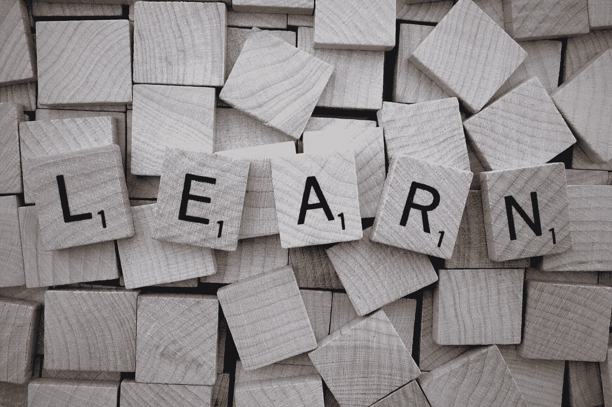

# 当学习变得困难时:3 种让学习变得容易的方法(客座博文)

> 原文：<https://www.dataquest.io/blog/3-ways-to-make-learning-easier/>

August 4, 2020

以下是 Darya Jandossova Troncoso 的客座博文，不代表 Dataquest 的观点或意见。

学习是一个终生的过程。它从我们还是婴儿时就开始了，并伴随我们到老年。教育对我们的发展和我们如何看待世界至关重要。对知识的渴望始于年轻时对周围环境的探索，随后是正规教育及其他。

在我们的一生中，我们学会以某种方式保留信息，无论你喜欢哪种方式，理解它为什么适合你都是至关重要的。如果你理解了基础知识，你可以在基础知识的基础上进行改进和提高。您可能希望改进的一些方面包括:

*   学习更快
*   更好地理解和保留信息
*   使学习过程更容易、更有效

在试图找出如何改善这些令人担忧的领域之前，让我们调查一下最流行的学习概念和模式，以及它们如何应用于不同的现实生活中，无论你是在家学习还是在学校学习。

## 概念

### 经验学习

我们清单上的第一个概念是大卫·库伯提出的体验学习模式。这位美国教育理论家强调持续学习的理念。Kolb 的学习理论在四阶段学习周期的基础上提出了四种不同的学习风格(或偏好)。

*图片来源:[商务球](https://www.businessballs.com)*

根据 Kolb 的说法，有四种学习风格:适应型、收敛型、发散型和同化型。正如 Kolb 所理解的，适应性学习风格(做和感觉-CE/AE)代表“动手”类型，适用于适应性学习者。他们更喜欢采取实际的、经验的方法，从真实的经历中学习。

汇聚式学习风格(做与想——AC/AE)——指汇聚者，能够解决问题，通过检验理论找到解决实际问题的方法。发散型(感觉和观察——CE/RO)——描述发散型——敏感的人，能够从不同的角度看待事物，收集信息，并在处理问题时运用想象力。

最后一种风格是同化(观想——AC/RO)。Kolb 建议同化者更喜欢简洁的，逻辑的方法。对他们来说，思想观念比人更重要；他们喜欢用抽象的想法工作，发展他们的理论。

大卫·库伯的学习风格模型早在 1984 年首次发表时就得到学者、教师和培训者的认可。他的工作建立了旨在更好地理解和解释人类学习行为的基本概念，为理解我们如何学习做出了巨大贡献。

### 思维风格模型

今天被广泛接受的下一个模型是安东尼·格雷果克开发的[思维方式模型](https://thepeakperformancecenter.com/educational-learning/learning/preferences/learning-styles/gregorc-mind-styles-model/)。这个模型提供了一种有组织的思维方式。Anthony Gregorc 利用二元性发展了他的想法，这是西方哲学中一个有着几个世纪历史的方法。在他 1977 年发表的研究中，Gregorc 定义了两种学习模式，他称之为偏好模式。后来，他提出了思维风格模型。这个模型与 Kolb 的学习风格方案相似。

*图片来源:[巅峰演出中心](https://thepeakperformancecenter.com/educational-learning/learning/preferences/learning-styles/gregorc-mind-styles-model/)*

根据 Anthony Gregorc 的说法，学习偏好模式的四个不同象限是抽象随机、抽象顺序、具体随机、具体顺序。

*   具体顺序(CS)代表逻辑的、客观的、实用的、深思熟虑的和有方法的模式。CS 学习者关注有形的结果。他们没有创造力，他们需要一个稳定的没有混乱的环境。
*   具体随机(CR)代表冒险、冲动、直觉和本能模式。CR 学习者可以同时关注过程和结果。他们很有创造力。他们喜欢变化和竞争，他们需要一个具有挑战性、刺激的环境；否则，他们很容易感到无聊和没有动力。
*   抽象顺序(AS)代表分析、反思、常规和方法模式。因为学习者更喜欢处理抽象的术语、符号、理论概念和想法。这些人喜欢安静的环境；他们关注的是过程而不是结果，当遇到智力挑战时，他们表现得很好。
*   抽象随机(AR)代表移情、精神、谨慎、感知和敏感模式。AR 学习者更喜欢充满活力、生动活泼的环境，在这里他们可以表达自己的感受和情绪。他们有音乐、文学或艺术天赋，用他们的感觉来理解他们的经历。

### VAK——视觉、听觉和动觉学习者

视觉、听觉和动觉学习者(通常用首字母缩写词 VAK 来标识)模型是由心理学家沃尔特·伯克·巴尔贝和他的同事提出的，他们认识到三种学习风格或学习的“模式”:

*   视觉(图片、形状、雕塑、绘画)
*   听觉(听力、节奏、音调、圣歌)
*   动觉(手势、身体运动、物体操纵、定位)

Barbe 说，最有效的学习可能是通过结合使用所有三种模式。后来，尼尔·弗莱明斯扩展了这一模式，增加了“读/写学习”作为第四种形式。他很清楚，视觉学习者在学习时需要视觉辅助，如图形、图表、图解)。听觉可以通过听(讲座、讨论、磁带等)获得成功。).读/写学习者通过书面文字(读物、词典、参考书等)达到最佳效果。)触觉/动觉型学习者更喜欢获取知识经验(科学项目、实验、世界探索等。).

VARK 瓦尔克模型获得了极大的欢迎，并在很长一段时间内被广泛采用。还是可以找到一些基于这个概念的推荐。然而，就像一些早期的模型一样，它现在被一些人认为是一种过时的理论，有着固定的观点。

### 多元智能理论

另一个挑战传统智力观的理论是多元智力理论。简而言之，这个理论声称每个人都有不同的学习方式和他们在日常生活中使用的各种类型的信息。多元智能的概念起源于哈佛大学的哈沃德·加德纳。在进行了认知研究之后，他确定了七种独立的智能，之后又增加了两种。

*   言语语言智能
*   数学逻辑智能
*   音乐智能
*   视觉空间智能
*   身体动觉智能
*   人际智能
*   内省智能。
*   自然主义智能
*   存在智能

根据加德纳的理论，每个人都拥有每种智力的一部分，但有些人支配和决定每个人如何学习和应用它。正如加德纳在他的书《未受教育的头脑:儿童如何思考以及学校应该如何教育》中所写的:“我认为一套相反的假设更有可能在教育上有效。学生们以明显不同的方式学习。如果学科可以以多种方式呈现，学习可以通过多种方式进行评估，那么广大学生——也许还有整个社会——将会得到更好的服务。”

多元智能理论是由加德纳提出来挑战学院心理学家的，但它并没有提出许多教育建议。尽管如此，许多准备充分、经验丰富的教育家已经证实，在特定模式的多媒体和教学技术的帮助下，这一理论的教育含义能够解决最常见的学习问题，并显著增强每个儿童或青少年的学习过程。但是它到底是如何工作的呢？该理论提供了八种学习方法，当传统教学方法变得低效时，这些方法非常有用:

*   单词(语言智能)
*   数字或逻辑(逻辑-数学智能)。
*   图片(空间智能)。
*   音乐(音乐智能)。
*   自我反思(内省智能)。
*   真实的体验(身体动觉智能)。
*   社交经验(人际智能)。
*   自然世界的经验(自然主义者的智慧)。

*图片来源:[adioma.com](https://blog.adioma.com/9-types-of-intelligence-infographic/#note-2)*

但是这些对你的学习之旅有什么用呢？有很多方法可以让学习更适应年龄。不管你多大，让我们来谈谈帮助你轻松学习的三个技巧。

## 了解你的学习风格

一旦你明白了如何学习最好，你就可以开始在此基础上再接再厉。最有可能的是，它是几种技术的结合。有些风格比其他风格更好，一旦你意识到哪种技巧可以帮助你保留最多的信息或者让你在这个过程中获得乐趣，你就可以剔除那些对你没用的部分。

如果你在努力记住你所学的东西，很可能你没有使用正确的工具。它可以简单到在你的手机或平板电脑上使用一个[笔记应用](https://www.kdanmobile.com/en/noteledge)，它为你提供写下事情或创建视觉学习线索的方法，以帮助你更好地记忆。通过[写下笔记并同时画画](https://www.edutopia.org/article/science-drawing-and-memory)，你可以同时使用多种形式，视觉、动觉和语义，基本上以三种不同的方式处理信息，这比只有一种方式要好。

了解你的学习风格还能让你明白为什么你在挣扎，知道如何学习不仅对你的学习有好处，对你生活的很多方面也有好处。总而言之，与其因为无法学习和记住你所学的东西而打击自己，不如从一个不同的角度来处理这件事，并希望意识到什么对你最有效。

## 不要只关注一种学习方式

每个学生都是不同的，没有理由让每个人都遵循相同的学习技巧或风格。个性化需要成为现代教育的主导方法，无论是学校、大学还是自学。多样化的学习对于培养好奇心和提高整体记忆力至关重要。

由于技术的快速发展，很多事情都成为可能。学生们可以通过各种各样的数字工具获得知识，并有很多方法展示他们的技能。获得高水平知识和技能的另一个成功方法是[实践学习方式](https://www.universities-colleges-schools.com/article/top-5-benefits-of-a-hands-on-learning-approach)，让学生以多种方式体验和学习。这也导致了更高的保留率。

顾名思义，这种方法是为学生提供在实际动手环境中学习的能力。当他们被带离讲堂，并有机会在现实环境中使用他们所学的知识时，他们所保留的信息百分比会增加很多。

这种方法可以适用于任何年龄的学习者，它几乎适用于任何学习。

例如，在学习数据科学和编程的背景下，许多学习者观看视频讲座并努力掌握材料。切换到更具实践性的方法，让他们接受挑战，以渐进的方式为自己编写代码，可以增进理解，提高记忆力。

同样的技术可以应用于各种各样的事情。你想学什么并不重要，走出去并尝试去做通常是最好的方法..

## 训练你的大脑

保持头脑敏锐也很重要。这里有一些关于如何改善你的认知功能的重要建议，包括记忆回忆、注意力集中和注意细节。

*   首先，不要跳过规律的体育锻炼。做瑜伽，给自己买辆自行车，或者去游泳。除了所有其他的好处之外，锻炼还包括思考、处理和学习，它可以促进你整体的大脑活动。
*   提高认知功能的不同方法是通过学习新的爱好。它可以是任何事情，从绘画到编织，写小说或学习一种新的乐器和作曲。基本上，做一些有创造性的事情是一个很好的刺激，可以让你克服精神停滞期，同时学习一项新技能。
*   加入哈佛医学院专家提供的在线课程，比如这个课程。它提供了一种方便的方法，通过学习有用的策略和使用不同的技术来帮助你保持头脑和意识的状态，从而提高你集中注意力和增强记忆力的能力。
*   保持健康——拥有一个[良好的睡眠](https://www.cbc.ca/news/technology/too-little-sleep-lowers-iq-report-1.168864)，[健康饮食](https://www.health.harvard.edu/blog/nutritional-psychiatry-your-brain-on-food-201511168626)，在你的饮食中加入[黑巧克力](https://www.lifehack.org/289595/15-surprising-and-science-backed-health-effects-dark-chocolate)，玩[逻辑游戏](https://en.islcollective.com/mypage/my-creations?type=printables&option=published&id=20488)或[电脑游戏](https://interestingengineering.com/9-everyday-skills-video-games-can-improve)，[记日记](https://www.huffpost.com/entry/benefits-of-journaling-_b_6648884)或写博客[阅读](https://everydayadventure11.blogspot.com/2011/11/10-reasons-why-reading-is-important-for.html)——所有这些都是保持思维敏捷和忙碌的好方法。

应用上面的一些建议会帮助你成为一个更好的学习者。请耐心等待，因为这样的改善不会在一夜之间发生。在现阶段评估你对学习的[准备程度，并在三个月或六个月后再做一次评估，这可能不是一个坏主意。](https://uwaterloo.ca/centre-for-teaching-excellence/teaching-resources/teaching-tips/tips-students/self-directed-learning/independent-studies-readiness-learn)

## 结论

不管你是什么年龄，学习都可能是困难的，但是有办法让它变得更容易。这是一个漫长但值得的旅程。只要确保你不会对自己太苛刻，找出你如何学习最好，并在保持健康的同时使用多种方法获得这些知识。

## 关于客座作者:

*Darya Jandossova Troncoso 是一名摄影师、艺术家和作家，正在撰写她的第一部小说，并管理着一个数字营销博客—[market splash](https://marketsplash.com/)。在业余时间，她喜欢和家人在一起，烹饪，创作艺术，学习一切关于数字营销的知识。*