# 教程:在 Windows 上安装 Python

> 原文：<https://www.dataquest.io/blog/installing-python-on-windows/>

January 13, 2022

Python 是一种流行的开源高级编程语言。它很直观，并且提供了许多有用的工具和库——[Python 是您工具包中的强大数据科学资产](https://www.dataquest.io/python-for-data-science-courses/)。要开始使用 Python，我们首先需要下载它并将其安装在我们的操作系统上(在本例中是 Windows)。

## 如何在 Windows 上安装 Python

在 Windows 上安装 Python 主要有两种方式:从官方 [Python 网站](https://www.python.org/)安装或者从 [Anaconda](https://www.anaconda.com/) 安装，这是 Python 和 [R 编程语言](https://www.dataquest.io/r-for-data-science-courses/)的一个方便分发版本。如果您是一名出于各种目的使用 Python 的程序员，请选择第一个选项:创建网站、网络编程、开发软件应用程序。相反，如果你的工作专注于数据科学和机器学习，那么 Anaconda 是你的最佳选择。本质上，Anaconda 是一个强大的数据科学平台，提供了 1500 多个内置的 Python 和 R 数据科学包，以及最流行的 Python IDEs。使用 Anaconda，您可以选择使用图形用户界面(GUI)而不是命令行。此外，它还适用于处理大量数据，轻松处理不同的环境和应用程序，以及管理软件包版本。

### 检查 Python 是否已经安装

在开始安装过程之前，我们希望检查 Python 是否已经安装在您的计算机上(例如，由以前的用户安装)，如果是，Python 的版本是什么。为此，打开命令行应用程序命令提示符(在 Windows 搜索中，键入`cmd`并按下`Enter`)或 Windows PowerShell(右键单击`Start`按钮并选择`Windows PowerShell`)并在那里键入`python -V`。如果您发现 Python 已经安装在您的计算机上，并且想要检查安装路径，请在命令行应用程序中运行`where.exe python`。

### 从 Python 官方网站在 Windows 上安装 Python

如果看到 Python 没有安装，可以使用 Python 官方网站安装。

第一步。打开 [Python Releases for Windows](https://www.python.org/downloads/windows/) 页面，选择 Python 版本，下载 Python 可执行安装程序

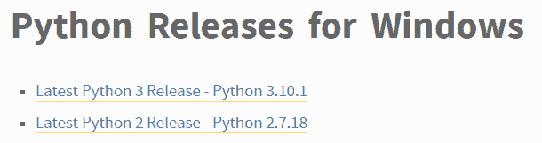

在这里，您可以选择是下载 Python 2 还是 Python 3(或者两者都下载)。稍后，我们将更详细地讨论下载和安装 Python 2 和 Python 3 的技术步骤，但首先，让我们确定您真正需要哪一个(或两个)。

Python 3 是 2008 年发布的 Python 的更新版本，旨在修复 Python 2 中的问题。与 Python 2 相比，Python 3 具有更简单和更直观的语法，它提供了大量有用的库(尤其是对于数据科学)，并且有一个庞大的 Python 开发人员社区来维护它。相比之下，Python 2 是[不再支持](https://www.python.org/doc/sunset-python-2/)。因此，如果您不确定使用哪个版本，下载最新的 Python 3 版本通常是最佳选择。如果您要处理新项目，您很可能只需要 Python 3。

但是，在某些情况下，您可能还需要 Python 2。例如，如果您公司的一些项目是用 Python 2 编写的，而 Python 2 与 Python 3 不兼容，那么您可能必须运行旧的脚本。此外，有时，您可能希望使用 Python 3 中尚未更新的 Python 包。在这种情况下，您将需要 Python 2。

如果您选择下载最新的 Python 2 版本，请选择`Windows x86-64 MSI installer`，它将自动识别您的 Windows 版本(32 位或 64 位):

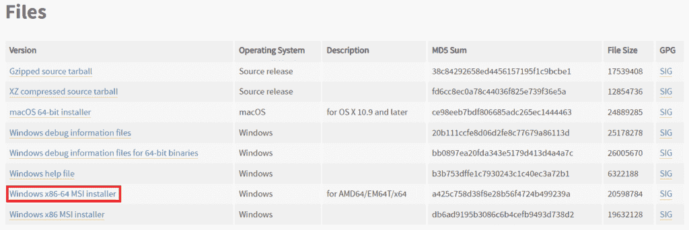

要下载最新的 Python 3 版本，您必须手动选择适合您的 Windows 版本的安装程序:

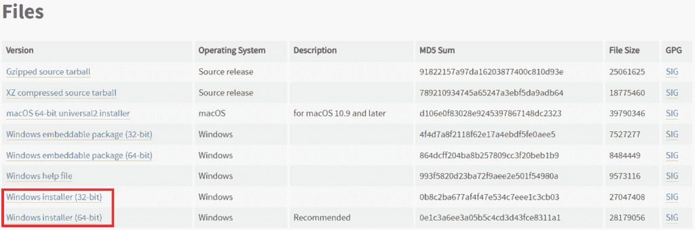

**第二步。运行安装程序**

让我们分别为 Python 2 和 Python 3 一步步地遵循这个过程。请记住，根据您的需要，您可以安装其中一个或两个。这不会导致任何问题，并且您可以随时选择使用哪个 Python 版本。

**Python 2。**

运行下载的 Python 2 可执行文件，该文件将在您的`Downloads`文件夹中找到。在每个步骤中选择以下选项:

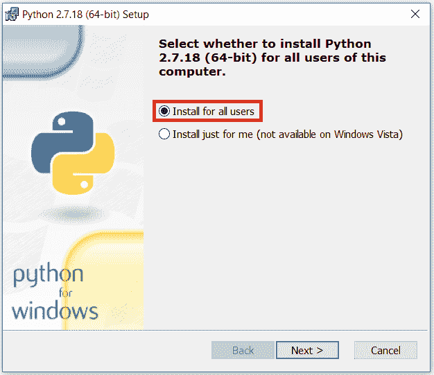
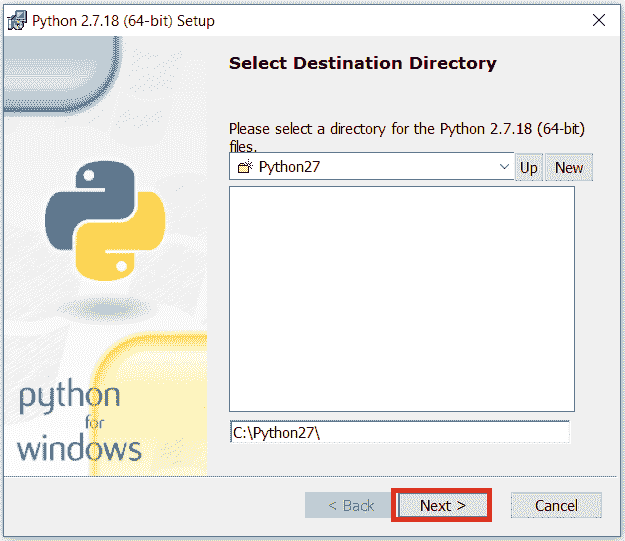

之后，只需在每个弹出窗口确认一切，就完成了安装。

现在您已经成功安装了最新的 Python 2 版本。

**Python 3。**

下载 Python 3 的安装程序，并在`Downloads`文件夹中找到它。在第一个弹出窗口中，选中底部的两个复选框，以便在 Windows 中自动将 Python 添加到路径中。然后选择`Install Now:`

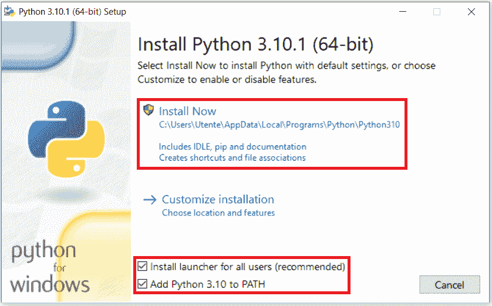

安装过程可能需要几分钟时间。然后，在下一个窗口中，选择`Disable path length limit`以避免将来长路径名的潜在问题:

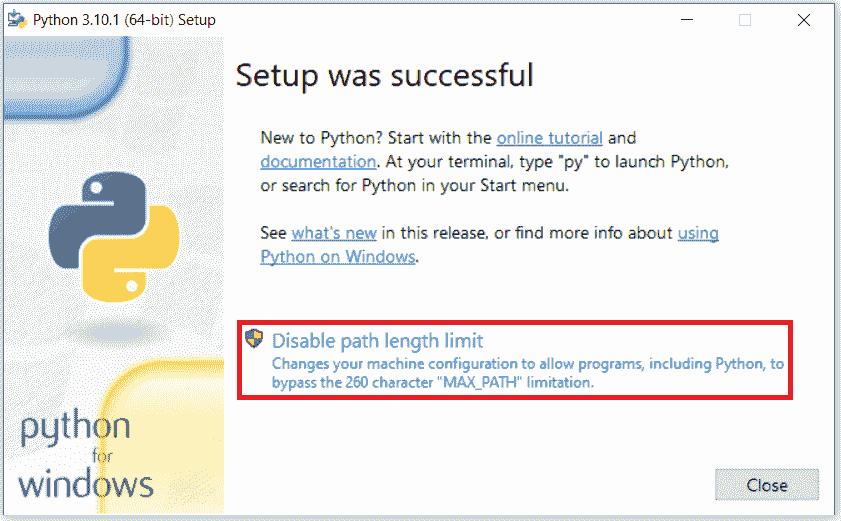

您的计算机上已经安装了最新的 Python 3 版本。

**第三步。验证 Python 是否成功安装在 Windows 上**

如果您只安装了 Python 的一个版本，打开命令行并运行`python -V`。如果您同时安装了 Python 2 和 Python 3，您必须做一个小的调整，我们将在下面的(可选)步骤中讨论。

**步骤 4(仅当您同时安装了 Python 2 和 Python 3 时)。重新分配系统变量**

为了能够从命令行轻松访问这两个 Python 版本，这一步是必要的。

如果您现在在命令行中运行`python`，您将只看到 Python 2 的版本(在我们的例子中，是 Python 2.7.18)。发生这种情况是因为，即使您为两个 Python 版本启用了系统路径，安装程序还是被保存为不同路径级别的变量集:系统级别(Python 2)和用户级别(Python 3)。在这种情况下，优先考虑系统路径，因此优先考虑 Python 2。你可以通过探索 Windows 的环境变量来验证:在 Windows 搜索中，键入`advanced system settings`，选择`View advanced system settings`，打开`Advanced`标签，点击`Environment Variables`按钮。在弹出窗口中，您将看到 Python 3 与用户变量相关，而 Python 2 与系统变量相关:

[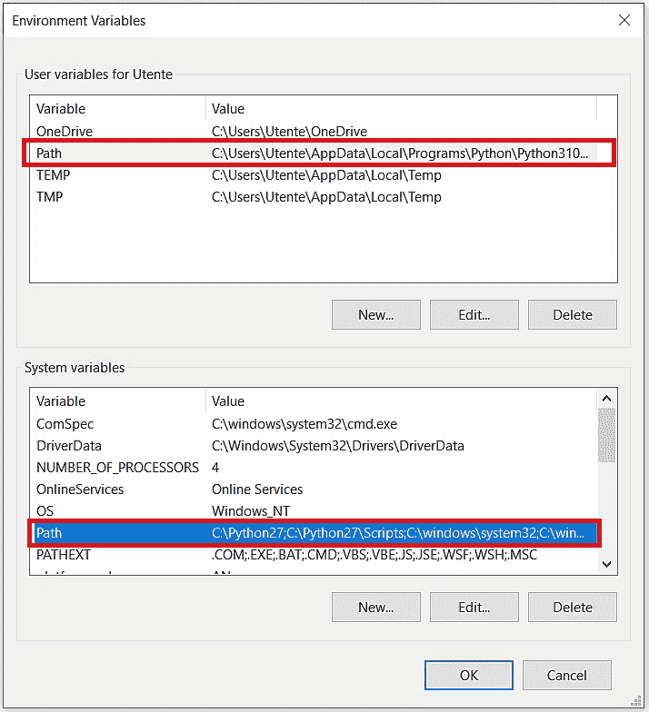](https://www.dataquest.io/wp-content/uploads/2022/01/environment-variables1.webp)

要解决这个问题，您可以为 Python 3: `python3`分配不同的访问权限，而不仅仅是`python`:

1.  在 Windows 搜索中打开`File Explorer` app，找到安装 Python 3 的文件夹。默认情况下，路径应该如下:C:\ Users \`username`\ AppData \ Local \ Programs \ Python \ Python 310
2.  制作`python.exe`文件的副本，并将该副本重命名为`python3.exe:`

[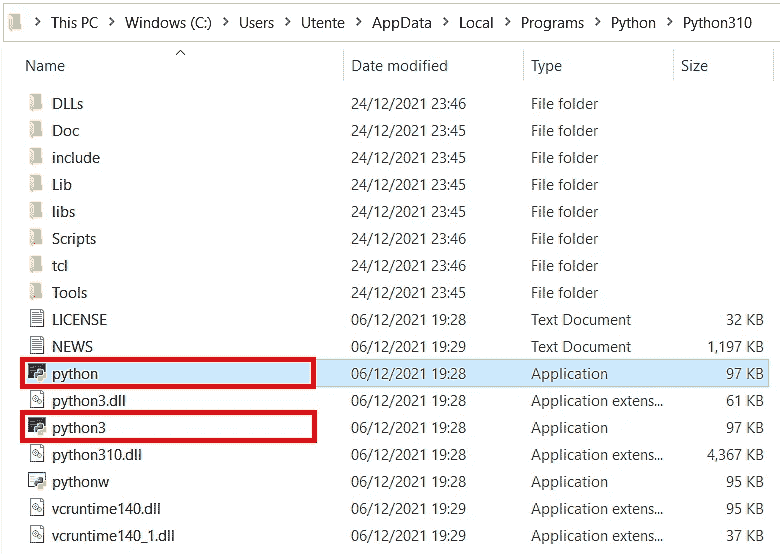](https://www.dataquest.io/wp-content/uploads/2022/01/file-explorer-python3.webp)

1.  重新打开命令行。
2.  现在，您可以返回到步骤 3，验证 Python 2 和 Python 3 的 Python 版本:

[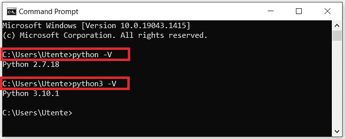](https://www.dataquest.io/wp-content/uploads/2022/01/command-prompt.webp)

### 从 Anaconda Navigator 在 Windows 上安装 Python

您可以使用开源的 Anaconda Navigator，这是一个流行的 Python 和 R 发行版，用于数据科学和机器学习任务，而不是来自官方 Python 网站的完整安装程序。

**第一步。打开[蟒蛇](https://www.anaconda.com/)官方网站，在**产品菜单中选择个人版

[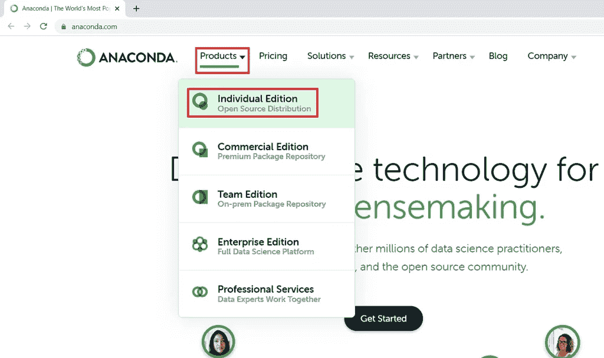](https://www.dataquest.io/wp-content/uploads/2022/01/install-python-from-anaconda.webp)

**第二步。下载安装程序**

系统会自动建议最适合您的操作系统(Windows)的软件包:

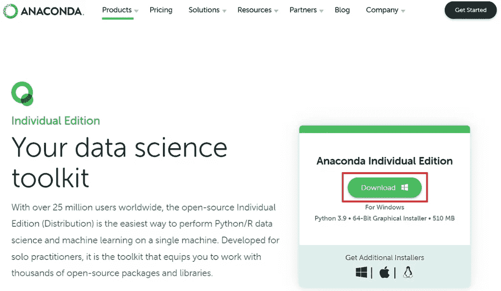

**第三步。运行安装程序**

在您的`Downloads`文件夹中找到下载的 Anaconda 安装程序，并运行它:

[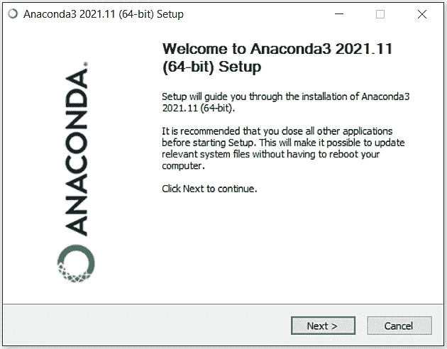](https://www.dataquest.io/wp-content/uploads/2022/01/anaconda-run-the-installer.webp)

在安装过程中，保留所有屏幕上的所有默认选项。不过，在其中一个窗口中，您可以决定更改安装位置，但通常最好保持原样:

[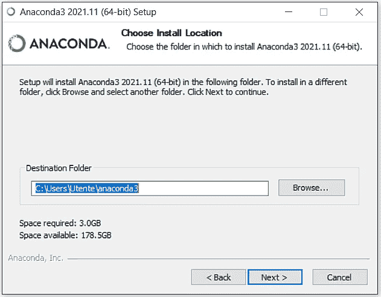](https://www.dataquest.io/wp-content/uploads/2022/01/anaconda-run-the-installer2.webp)

安装过程可能需要几分钟时间。

现在 Anaconda 已经成功安装在您的计算机上。

## 如何在 Windows 上运行您的第一个 Python 代码

现在您已经安装了 Python，无论是从官方 Python 网站还是使用 Anaconda Navigator，您都已经准备好运行您的第一个 Python 代码了。

### 如果你从 Python 官方网站安装了 Python

在 Windows 搜索中输入`idle`，选择需要的 IDLE 版本(如果你安装了不同的 Python 版本，会有相应的 IDLE 版本):

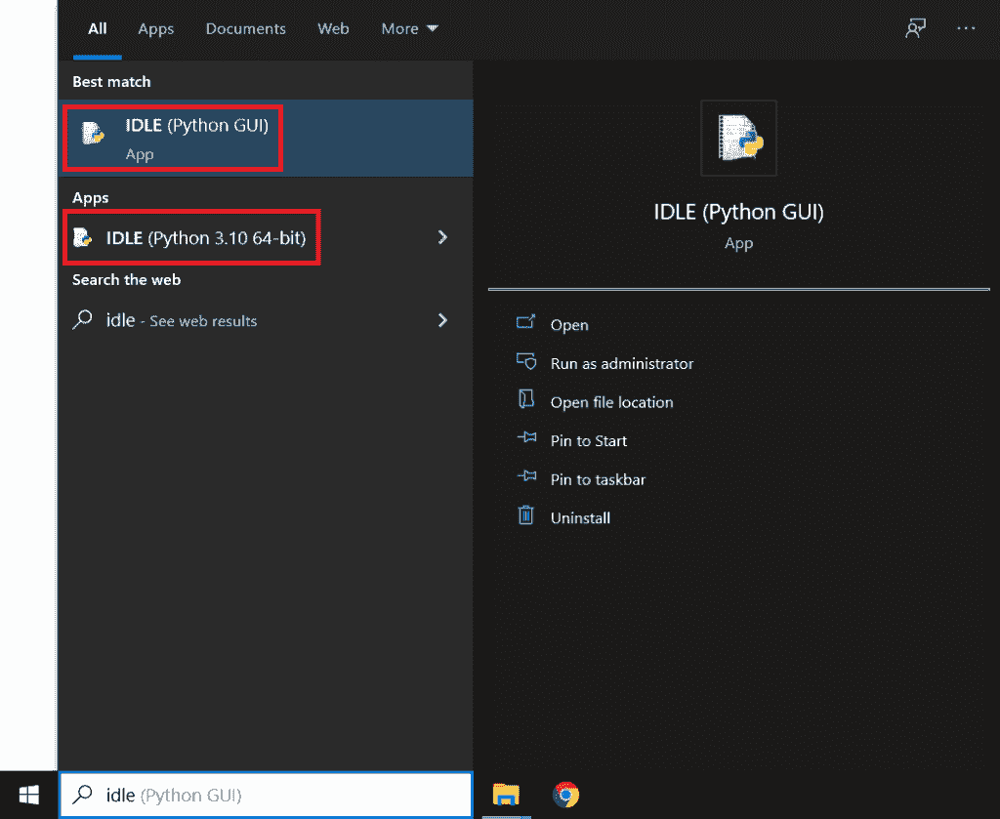

现在您可以开始编码了，甚至可以在不同的 Python 版本中并行编码:

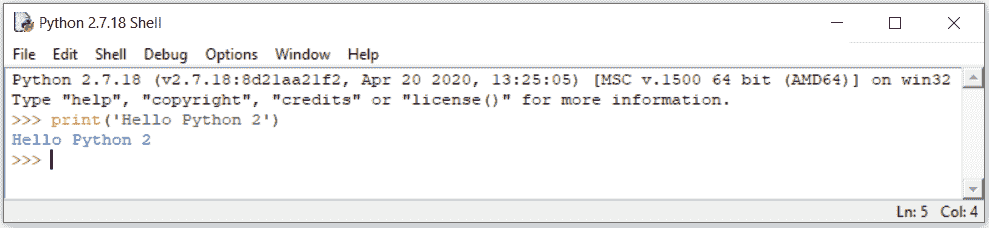

### 如果您从 Anaconda 个人版安装了 Python

1.  在 Windows 搜索中输入`anaconda`，打开`Anaconda Navigator`:

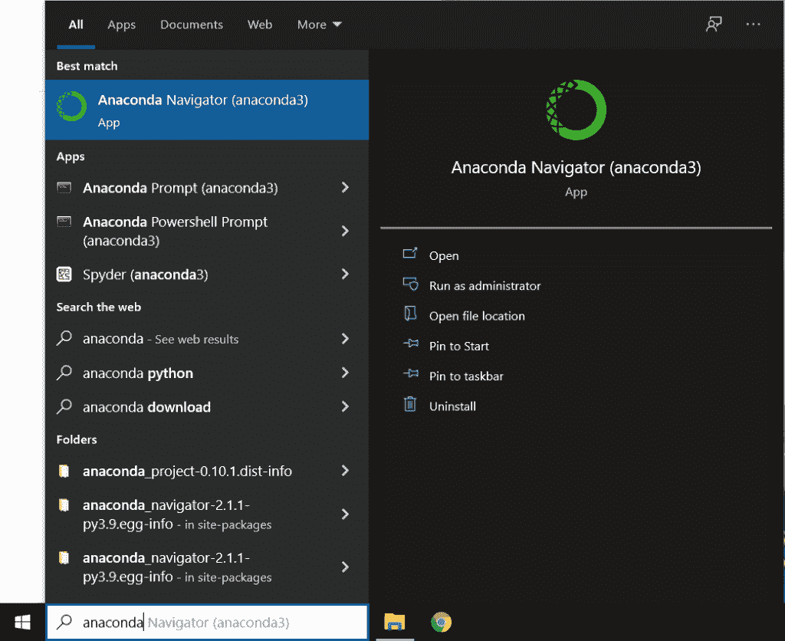

1.  从众多应用程序中选择最适合您的应用程序。例如，您可以选择 Jupyter Notebook，这是一个流行的数据科学应用程序，用于创建和共享结合了代码、图表和故事的文档:

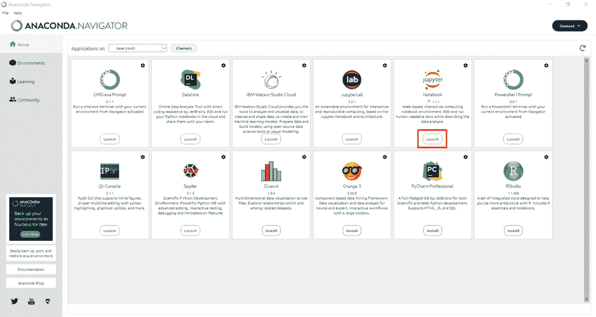

1.  导航到要保存代码的文件夹，并创建一个新的 Python 笔记本:

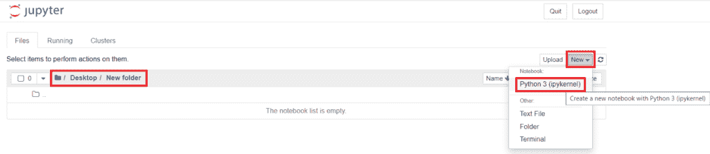

1.  开始编码:

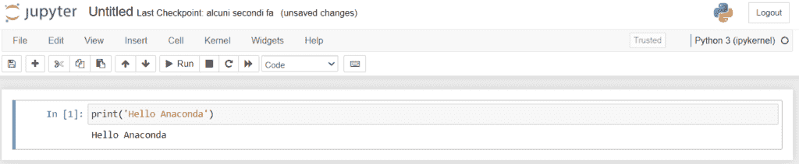

## 如何在 Windows 上将 Python 更新到最新版本

### 如果你从 Python 官方网站安装了 Python

就像最初安装 Python 时一样，打开 [Python Releases for Windows](https://www.python.org/downloads/windows/) 页面，选择最新的 Python 版本，下载并运行合适的安装程序。

如果最新版本只是与当前版本(例如，3.9.8 和 3.9.9)具有相同主要版本的新 Python 补丁，您将在弹出窗口中看到以下选项:

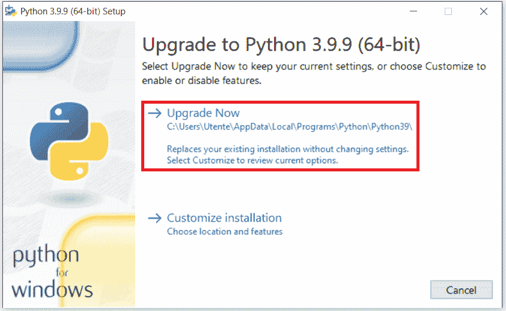

在这种情况下，最新的 Python 版本将安装在您的计算机上，而之前的版本将被移除。之后你需要重启你的机器。

如果最新版本是 Python 相对于当前版本的新主要版本(例如 3.9 和 3.10)，您将看到与初始安装相同的选项:

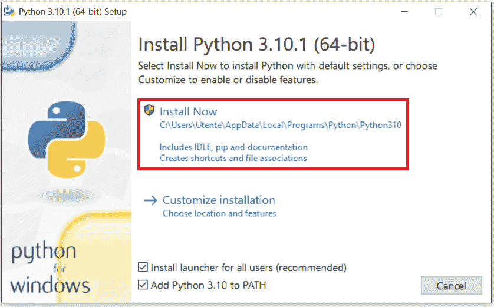

在这种情况下，最新的 Python 版本将安装在您的计算机上，但之前的版本也将保留。如有必要，您可以使用控制面板手动卸载它。

### 如果您从 Anaconda 个人版安装了 Python

在 Windows 搜索中键入`anaconda`，打开`Anaconda Prompt.`将基础(根)环境的 Python 版本更新到最新的 Python 版本 `available for the current Anaconda release`，运行`conda update python`。

(附注:您可能需要首先通过运行 `conda update conda`将 Anaconda 本身更新到最新版本。)

在下面的快照中，您可以看到在将 Anaconda 上的 Python 版本更新到最新版本之后，实际上什么都没有改变:版本仍然是 3.9.7，而不是更新到最新的(当前的)Python 版本 3.10.1:

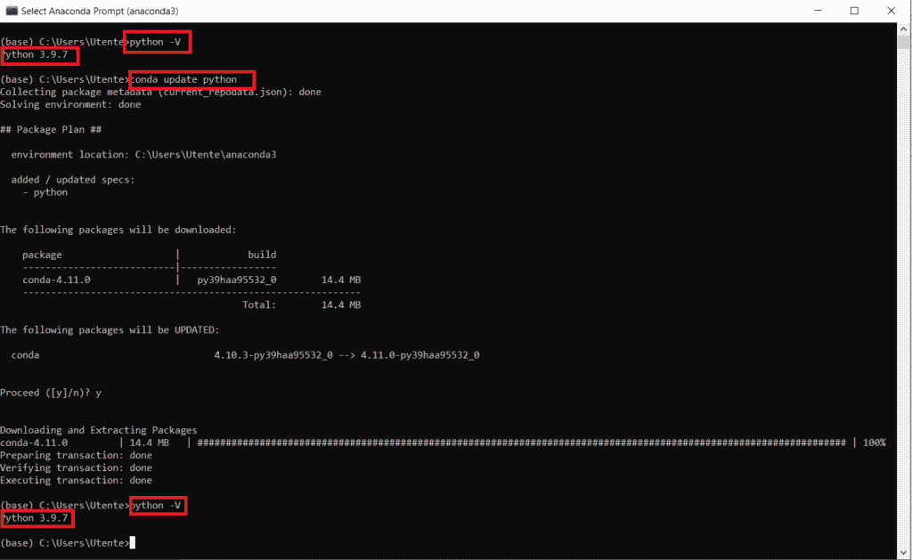

这是因为 Python 3.9.7 是当前 Anaconda 版本中最新的 Python 版本。

您可以等待下一个 Anaconda 版本，或者考虑在 Anaconda 上创建一个新的虚拟环境:

conda create-n python 10 python = 3.10

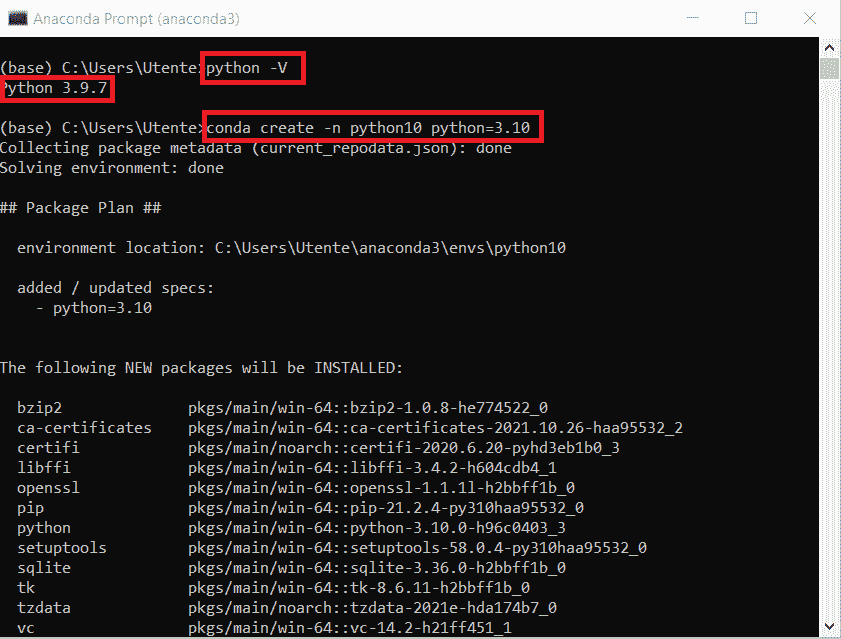

上面，您创建了一个名为`python10`的虚拟 Anaconda 环境(可以随意给它取其他名字)，使用的是官方最新版本 Python 3.10。

现在，为了能够在这个环境中工作，您必须激活它，运行`conda activate python10`:

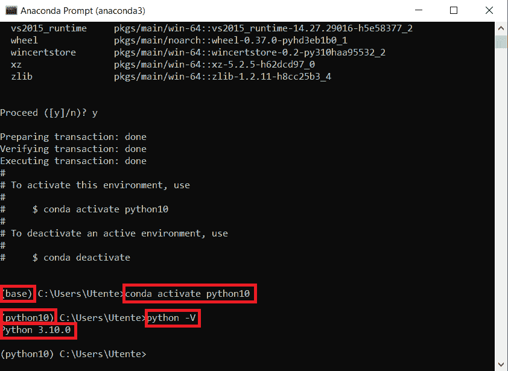

注意活动环境的名称是如何从`base`变成`python10`的。另外，请注意，如果您检查 Python 版本，您会看到它已经更新到 Python 3.10.0。

不幸的是，在创建新的虚拟环境时，不可能指定最新版本的确切补丁(这意味着您只能写`python=3.10`而不能写`python=3.10.1`)。

您可以从命令行在创建的虚拟环境中继续使用 Python 3.10.0 编码。或者，因为 Anaconda 首先是一个方便的 GUI 界面，所以您可以再次进入 Anaconda Navigator，选择新的环境，安装您需要的任何应用程序(如果它们适用于该环境)，并在那里开始工作。

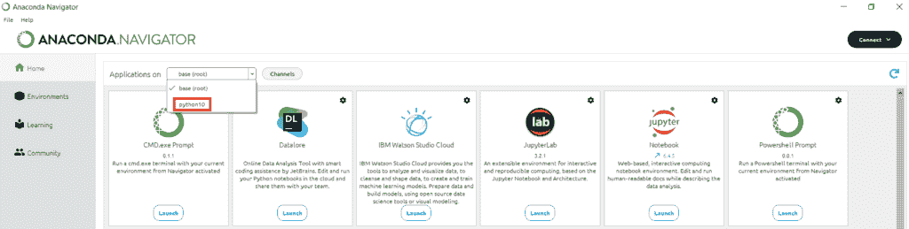

您还可以直接从 Anaconda Navigator 使用必要的 Python 版本轻松创建新的虚拟环境:

1.  打开 Anaconda Navigator 的`Environments`标签。
2.  按下屏幕底部的`Create`按钮。
3.  为新环境命名，并选择 Python 的版本。

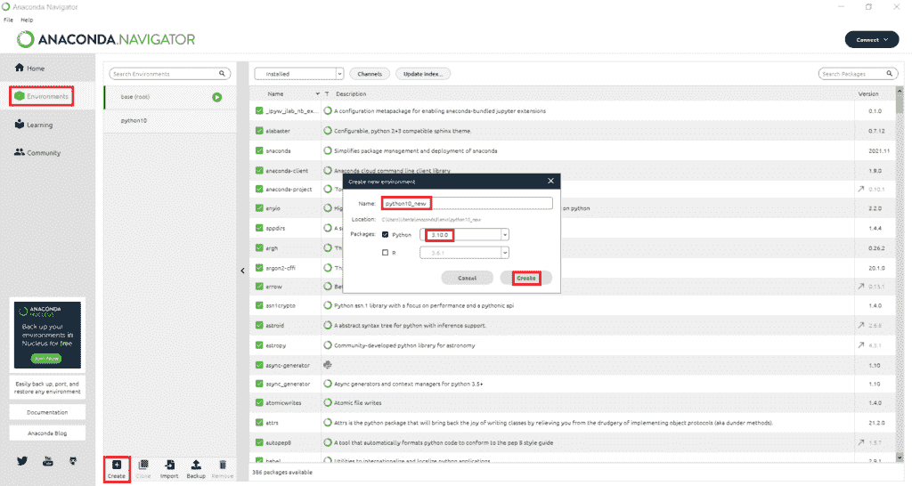

一个名为`python10_new`的新环境已经创建:

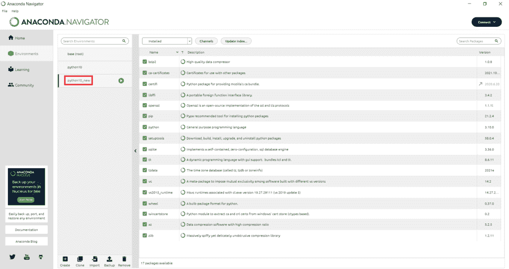

1.  转到 Home 选项卡，在这里已经自动选择了新环境。
2.  安装您需要的任何可用应用程序，并开始编码。

## 结论

在本教程中，您已经学习了如何从官方网站和 Anaconda 正确下载和安装 Python，必要时将其更新到最新版本，以及在 Windows 上运行 Python 脚本。现在，您已经拥有了开始使用 Python 的所有必要工具和设置。