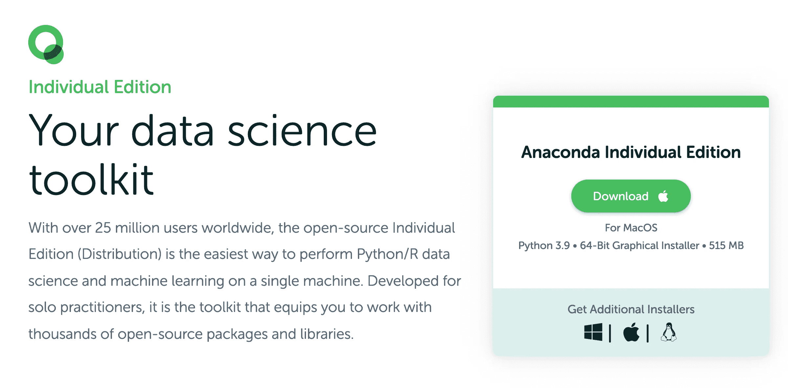
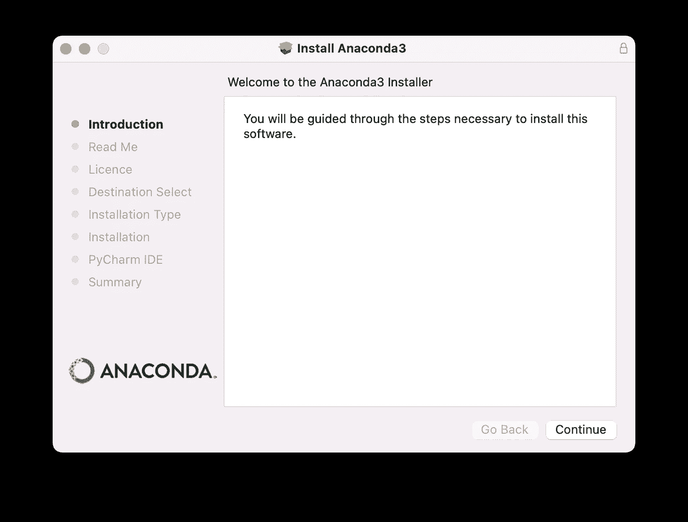
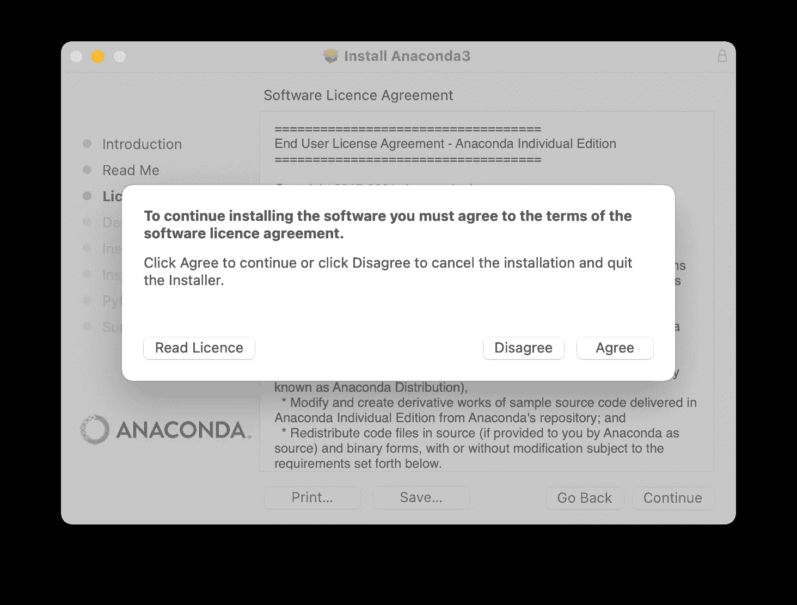
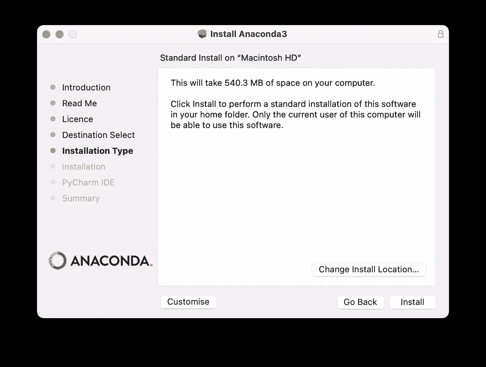
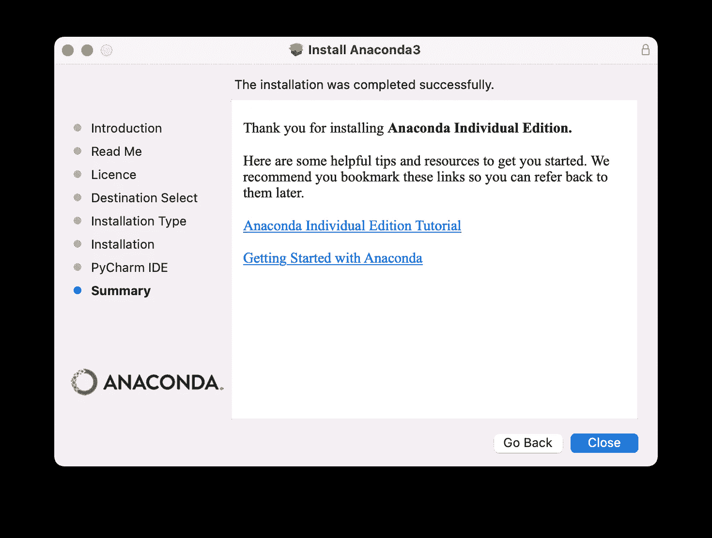
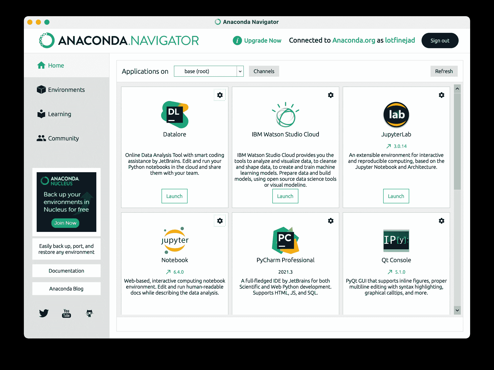

# 如何在您的计算机上安装 Anaconda 发行版

> 原文：<https://www.dataquest.io/blog/how-to-install-the-anaconda-distribution-on-your-computer/>

February 4, 2022

在进入数据科学之前，您需要设置所需的软件和工具，并学习如何使用它们。本教程将教您如何安装和使用 Anaconda 平台来构建数据科学生态系统。您还将学习如何使用命令行界面管理包和环境。让我们开始吧。

### 什么是 Anaconda 发行版？

Anaconda 是一个受信任的套件，它捆绑了 Python 和 R 发行版。Anaconda 是一个包管理器和虚拟环境管理器，它包括一组预安装的软件包。Anaconda 开源生态系统主要用于数据科学、机器学习和大规模数据分析。Anaconda 之所以受欢迎，是因为它安装简单，并且它提供了对数据专业人员所需的几乎所有工具和包的访问，包括:

*   Python 解释器
*   大量的包裹
*   Conda，一个软件包和虚拟环境管理系统
*   Jupyter Notebook，一个基于 web 的交互式集成开发环境(IDE ),它在同一个文档中结合了代码、文本和可视化
*   Anaconda Navigator 是一个桌面应用程序，它使启动 Anaconda 发行版附带的软件包变得容易，并且无需使用命令行命令就可以管理软件包和虚拟环境

### 如何安装 Anaconda

Anaconda 是一个跨平台的 Python 发行版，可以安装在 Windows、macOS 或不同的 Linux 发行版上。

**注意**如果已经安装了 Python，就不需要卸载了。您仍然可以继续安装 Anaconda，并使用 Anaconda 发行版附带的 Python 版本。

1.  从[https://www.anaconda.com/downloads](https://www.anaconda.com/downloads)下载适用于您的操作系统的 Anaconda 安装程序。

[T2】](https://www.dataquest.io/wp-content/uploads/2022/01/anaconda-download-page.webp)

2.  下载完成后，双击这个包开始安装 Anaconda。安装程序将引导您完成向导以完成安装；默认设置在大多数情况下都能正常工作。



3.  点击简介、自述和许可屏幕上的`Continue`。出现以下提示后，点击`Agree`继续安装。



4.  在目的地选择屏幕上，选择“仅为我安装”建议在默认路径下安装 Anaconda 为此，点击`Install`。如果你想在不同的位置安装 Anaconda，点击`Change Install Location…`并改变安装路径。



5.  在 PyCharm IDE 屏幕上，点击`Continue`安装 Anaconda，不安装 PyCharm IDE。
6.  安装完成后，点击摘要屏幕上的`Close`关闭安装向导。



7.  有两种方法可以验证您的 Anaconda 安装:在您计算机上已安装的应用程序中找到 Anaconda Navigator，然后双击它的图标。


如果 Anaconda 安装正确，Anaconda 导航器将会运行。



通过命令行界面运行`conda info`命令。如果 Anaconda 安装正确，它将显示所有当前 conda 安装信息。

### 康达怎么用

在本节中，我们将学习如何使用 Conda 来创建、激活和停用虚拟环境。此外，我们将讨论在环境中安装软件包和管理通道。

* * *

如果你想了解更多关于 Python 虚拟环境的知识，你可以阅读 Dataquest 博客上的[Python 虚拟环境的完整指南](https://www.dataquest.io/blog/a-complete-guide-to-python-virtual-environments/)。

* * *

首先，让我们检查一下我们电脑上安装的`conda`版本。为此，在 macOS/Linux 上打开一个终端窗口，或者在 Windows 上打开一个 Anaconda 提示符，然后运行以下命令:

```
(base) ~ % conda --version
conda 4.11.0
```

Anaconda 中的默认环境是在安装 Anaconda 时创建的基础环境。因此，每次打开终端窗口时，环境的名称都会出现在终端提示符开头的括号中。基础环境包含`conda`以及 400 多个预安装的包。现在，让我们讨论如何使用 *conda* 命令管理环境。

### 创造康达环境

要创建 Conda 环境，使用`conda create`命令:

```
(base) ~ % conda create -n my_env
```

上面的命令创建了一个新的 Conda 环境，其中`my_env`是环境的名称。你需要输入`y`然后按`Enter`，或者出现以下提示时只需按`Enter`。

```
Proceed ([y]/n)?
```

默认情况下，所有环境都将被创建到`anaconda3`文件夹的`envs`文件夹中，没有任何包。下面的命令创建了一个新的 Conda 环境，其中包含最新版本的 Python:

```
(base) ~ % conda create -n my_env python
```

或者，如果您希望创建一个具有特定 Python 版本的环境，请运行以下命令:

```
(base) ~ % conda create -n my_env python=3.6
```

它显示了将在环境中安装的所有软件包。看到提示后，按`Enter`:

```
Proceed ([y]/n)?
```

所有软件包都将安装在环境中。

#### 激活 Conda 环境

要激活环境，运行`conda activate`命令:

```
(base) ~ % conda activate my_env
```

运行上面的命令会激活 `my_env`环境，它会在命令提示符开始处的括号中显示活动环境的名称。以下命令显示活动环境的详细信息:

```
(my_env) ~ % conda info
```

#### 在环境中安装软件包

要将软件包安装到当前环境中，使用`conda install <package-name>`命令。例如，下面的命令在环境中安装最新版本的*熊猫*包。

```
(my_env) ~ % conda install pandas
```

要安装软件包的特定版本，如 *pandas* ，您可以使用以下命令:

```
conda install pandas=1.2.4
```

您也可以使用单个`conda install`命令安装一组软件包，如下所示:

```
(my_env) ~ % conda install seaborn scikit-learn jupyter
```

如果您想查看当前环境中已安装的软件包，请运行以下命令:

```
(my_env) ~ % conda list
```

要签出环境列表，请使用以下命令列出您计算机上的环境，并用星号突出显示活动环境:

```
(my_env) ~ % conda env list
```

* * *

**注**

如果您想要更新环境中的所有软件包，请运行`conda update`命令。

* * *

#### 再现康达环境

在您的计算机或其他计算机上复制环境是一项常见的任务。Conda 允许我们创建一个 YAML 文件，包含环境中所有已安装的包以及版本。让我们看看如何通过将活动环境导出到 YAML 文件来创建文件:

```
(my_env) ~ % conda env export > environment.yml
```

运行上面的命令会创建`environment.yml`文件，该文件可用于创建另一个包含相同包的环境。如果您想确保您的环境文件在各种平台上工作，请使用`conda env export`命令末尾的`--from history`选项，如下所示:

```
(my_env) ~ % conda env export --from history > environment.yml
```

新的`environment.yml`文件更加跨平台兼容，因为它只包含我们显式安装的包，而不像以前的文件包含环境中所有已安装的包。现在，您可以使用环境文件在任何机器上重现 Anaconda 环境。

```
(my_env) ~ % conda env create -n new_env --file environment.yml
```

上面的命令创建了一个新环境`new_env`，并安装了`environment.yml`文件中列出的所有包。

#### 管理 Conda 渠道

通道是存放在远程服务器上的 Conda 包存储库。每当您想要安装一个软件包时，Conda 都会搜索这些包含 Conda 软件包的存储库。然后软件包将自动从频道下载并安装。该命令返回当前 Conda 通道:

```
(base) ~ % conda config --show channels
channels:
  - defaults
```

要显示默认频道文件夹的 URL，请运行以下命令:

```
(base) ~ % conda config —show default_channels

default_channels:
  - https://repo.anaconda.com/pkgs/main
  - https://repo.anaconda.com/pkgs/r
```

有时，当我们想安装一个软件包时，Conda 会发出 <text>PackagesNotFoundError</text> 消息，这意味着该软件包在当前渠道中不可用。让我们来看看:

```
(my_env) ~ % conda install click-default-group
```

运行上面的命令表明`click-default-group`包在当前频道中不可用。有两种方法可以解决这个问题:

*   第一种解决方案是使用以下命令指定软件包在其存储库中存在的通道:

```
(my_env) ~ % conda install -c conda-forge click-default-group
```

*   第二种解决方案是将包含该软件包的新频道添加到频道列表的顶部，然后安装该软件包:

```
(my_env) ~ % conda config --add channels conda-forge
(my_env) ~ % conda install click-default-group
```

#### 停用 Conda 环境

要停用 Conda 环境，运行 `conda deactivate`命令。停用环境将使您返回到基本环境。

#### 移除 Conda 环境

要删除环境，首先停用它，然后在终端窗口中运行命令:

```
(base) ~ %conda remove -n my_env
```

* * *

**注**

如果您不喜欢通过在命令行 shell 中键入 Conda 命令来管理环境和包，您可以使用 Anaconda Navigator。Navigator 提供了一个图形用户界面(GUI)来管理环境和软件包，而无需使用 Conda 命令。

* * *

## 结论

在本教程中，您学习了如何安装 Anaconda 并使用 conda 来管理环境和安装包。Anaconda 发行版的核心是 Jupyter 笔记本；数据科学家喜欢 Jupyter Notebook，因为它简化了交互式开发和演示他们的项目。如果你有兴趣了解更多关于 Jupyter Notebook 的信息，Dataquest 博客上有一个很好的教程，在[如何在 2020 年使用 Jupyter Notebook:初学者教程](https://www.dataquest.io/blog/jupyter-notebook-tutorial/)。