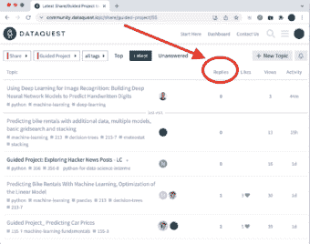
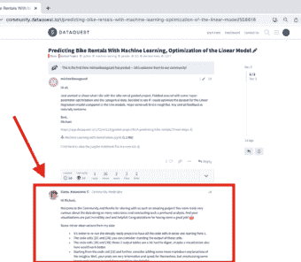
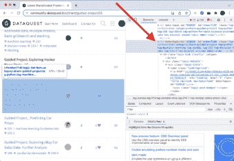

# NLP 项目第 1 部分:搜集网络数据

> 原文：<https://www.dataquest.io/blog/nlp-project-scraping-the-web-to-gather-data/>

December 20, 2021

这是描述我的自然语言处理(NLP)项目的系列文章中的第一篇。要真正从这篇 NLP 文章中受益，您应该了解 pandas 库并了解用于清理数据的 regex。我们还将关注网络抓取，因此 HTML(用于创建网站的语言)的基础知识非常有帮助，但不是必不可少的。

这个 NLP 项目是关于收集和分析来自 [Dataquest 社区](https://community.dataquest.io/)的帖子！如果您不熟悉 Dataquest 社区，这是一个获得项目反馈的好地方。我在社区中分享我的项目，人们分享他们对我工作的见解让我受益匪浅。随着我的进步，我开始回馈并向其他人展示在他们的笔记本上我本可以做得不同的地方。

我甚至开始写一篇关于如何建设好项目的来自社区的建议的普通帖子。为了在我的帖子中包含更多有趣的内容，我开始查看其他用户对指导项目的反馈。然后，我有了主意！*等一下。。。如果我们将每个指导项目的所有反馈数据合并到一个数据集中会怎么样？*

基于此，我决定从 Dataquest 社区收集所有的项目反馈，并对其进行分析，以找到最常见的项目反馈。

### 结构

我把这个项目分为三个阶段。这些阶段本身并不复杂，但是将它们结合在一起可能会让人感觉有些力不从心。我将在单独的文章中介绍每个阶段:

*   第一部分:收集数据。我们将使用 BeautifulSoup 库从网站上抓取所有必要的字符串值，并将它们存储在 pandas 数据帧中。我们将在下面的文章中讨论这一部分。
*   第二部分:清理和分析数据。网页抓取经常产生“脏”文本值。在这个过程中，scraper 获得一些额外的符号或 HTML 行是正常的。我们将使用正则表达式技术将数据转换成更有用的格式，然后进行分析。
*   第三部分:对数据使用机器学习模型。当您可以让机器为您分析时，为什么要自己进行分析呢？在第 2 部分工作的基础上，我们将测试不同的机器学习方法来分析文本数据。

你可以访问我的 [GitHub](https://github.com/grumpyclimber/portfolio/tree/main/ml/nlp_feedback) 上的所有项目文件。在我发表下一篇文章时，我会添加更多的文件并对现有的文件进行微调。

准备好了吗？我们开始工作吧。。。

### 第 1 部分—自然语言处理项目的网络搜集

如果你还没有用过 BeautifulSoup，那么我鼓励你去看看我的[介绍笔记本](https://github.com/grumpyclimber/portfolio/tree/main/other/wiki_scrape)。它遵循一条类似于我们将要走的路:抓取不是一个而是许多网站。另外，Dataquest [上有一篇更深入的文章向我们介绍网络抓取](https://www.dataquest.io/blog/web-scraping-python-using-beautiful-soup/)。

让我们看看实际的指导项目帖子类别是什么样子的，以便更好地了解我们想要实现的目标:



这是引导项目的主线。它包含了我们决定发布的所有指导项目。他们中的大多数人都收到了带有一些评论的回复——我们对回复的内容很感兴趣。下面是一个示例帖子:



在这篇文章中，Michael 发表了他的项目，Elena 对他的工作做了一些评论。我们感兴趣的只是搜集埃琳娜的言论内容。这不会像清理一个网站那么简单。我们想刮很多网站的特定部分，我们没有链接。。。还没有。攻击计划如下:

1.  我们没有所有引导式项目帖子的链接——我们需要提取它们，这意味着我们必须抓住引导式项目的主线。
2.  抓取主线程后，我们将创建一个包含帖子、标题、链接、浏览量和回复数量的数据框架(我们将过滤掉没有回复的帖子)。
3.  剩下的数据集应该只包含收到反馈的帖子和这些帖子的链接——我们可以开始抓取实际的单个帖子

### 非常基本的 HTML 介绍

在我们开始之前，你见过 HTML 代码吗？它不同于 Python。如果你从未体验过 HTML 代码，这里有一个非常基本的 HTML 表格示例:

```
<html>
<body>
<table border=1>
  <tr>
    <td>Emil</td>
    <td>Tobias</td>
   <td><a href="https://www.dataquest.io/">dataquest</a></td>
  </tr>
</table>
 </body>
 </html>
```

| 电子邮件 | 托拜厄斯(男子名) | [数据请求](https://www.dataquest.io/) |

在 HTML 中，我们使用标签来定义元素。许多元素都有一个开始标签和一个结束标签，例如。。。

```
<table>
```

。。。打开表的构建，在表编码的最后，我们写。。。

```
</table>
```

。。。关闭它。此表格有一行，该行有 3 个单元格。在第三个单元格中，我们使用了一个链接

```
<a href=...>
```

HTML 标签可以有属性(我们在“table”标签中使用了“border”属性，在“a”标签中使用了“href”属性)。

The concept behind web scraping is to extract (scrape) specific elements of a website.

### 第一步:网页抓取引导项目的主线

#### **检查网站**

我们将从检查整个网站的内容开始:[https://community.dataquest.io/c/share/guided-project/55](https://community.dataquest.io/c/share/guided-project/55)
我们可以用我们的浏览器来做这件事；我用 Chrome。将鼠标悬停在文章标题上方，点击右键，选择 **Inspect 即可。**(注意，我选择了一个比顶部低几个帖子的帖子——以防第一个帖子有不同的类别。)

现在我们可以看看网站的代码。当您将鼠标悬停在右窗口中的某些代码元素上时，浏览器会在左窗口中突出显示该元素。在下面的示例中，我的光标悬停在以下内容上:

```
<tr data-topic-id=...>
```

在左侧，我们可以看到网站的一大块突出部分:



#### **首次尝试抓取网页**

对于我们的第一次尝试，我们将尝试只获得每个帖子的链接。请注意，实际的链接在下面代码的第二行中有一个类——“title raw-link raw-topic-link”:

```
<a href="https://www.dataquest.io/t/predicting-bike-rentals-with-machine-learning-optimization-of-the-linear-model/558618/3" role="heading" level="2" class="title raw-link raw-topic-link" data-topic-id="558618"><span dir="ltr">Predicting Bike Rentals
With Machine Learning, Optimization of the Linear Model</span></a>
```

我们将使用以下代码将该类的所有链接收集到一个列表中，并查看我们成功提取了多少链接:

```
# imports:
from bs4 import BeautifulSoup
from urllib.request import urlopen, Request</code>

# step 1 lets scrape the guided project website with all the posts:
url = "https://community.dataquest.io/c/share/guided-project/55"
html = urlopen(url)
soup = BeautifulSoup(html, 'html.parser')

# look for every 'a' tag with 'class' title raw-link raw-topic-link:
list_all = soup.find_all("a", class_="title raw-link raw-topic-link")

# check how many elements we've extracted:
len(list_all) [Output]: 30
```

我们的列表只有 30 个元素！我们期待一个更大的数字，所以发生了什么？不幸的是，我们正试图[构建一个动态网站](https://www.zesty.io/mindshare/marketing-technology/dynamic-vs-static-websites/)。当我们的浏览器打开论坛页面时，Dataquest 只加载前 30 个帖子；如果我们想看到更多，我们必须向下滚动。但是我们如何编程我们的刮刀向下滚动？ [Selenium](https://selenium-python.readthedocs.io/) 是该问题的首选解决方案，但我们将使用一种更简单的方法:

*   向下滚动到网站的底部。
*   当我们到达终点时，将网站保存为一个文件。
*   我们将处理那个文件，而不是用 BeautifulSoup 处理一个链接。

让我们开始向下滚动:


是的，这是一个真正的叉子，推动键盘上的向下箭头，用一个空咖啡杯压着(这篇文章的作者不鼓励在你的电子设备周围使用任何不寻常的餐具或餐具)。向下滚动到最底部后，我们可以使用**文件>将页面另存为……**来保存网站。现在我们可以将该文件加载到我们的笔记本中并开始抓取；这次我们将瞄准每一个新行:
`<tr>`。因为最终，我们不感兴趣的只是抓取链接——我们想要提取尽可能多的数据。不仅是标题，带链接，还有回复数，浏览量等。

```
import codecs
# this is the file of the website, after scrolling all the way down:
file = codecs.open("../input/dq-projects/projects.html", "r", "utf-8")
# parse the file:
parser = BeautifulSoup(file, 'html.parser')

# look for every 'tr' tag, scrape its contents and create a pandas series from the list:
list_all = parser.find_all('tr')
series_4_df = pd.Series(list_all)

# create a dataframe from pandas series:
df = pd.DataFrame(series_4_df, columns=['content'])
df['content'] = df['content'].astype(str)
df.head()
```

|  | **内容** |
| Zero | `<tr><th class="default" data-sort-order="defau...` |  |
| one | `<tr class="topic-list-item category-share-guid...` |
| Two | `<tr class="topic-list-item category-share-guid...` |
| three | `<tr class="topic-list-item category-share-guid...` |
| four | `<tr class="topic-list-item category-share-guid...` |

### 步骤 2:从 HTML 中提取数据

我们已经创建了一个充满 HTML 代码的数据框架。让我们检查一个单元格的内容:
`df.loc[2,'content']`

```
<tr class="topic-list-item category-share-guided-project tag-257 tag-sql-fundamentals tag-257-8 has-excerpt 
unseen-topic ember-view" data-topic-id="558357" id="ember71">\n<td class="main-link clearfix" colspan="">\n
<div class="topic-details">\n<div class="topic-title">\n<span class="link-top-line">\n<a class="title raw-link
raw-topic-link" data-topic-id="558357" href="https://community.dataquest.io/t/analyzing-cia-factbook-with-sql-full-project/558357"
level="2" role="heading"><span dir="ltr">Analyzing CIA Factbook with SQL - Full Project</span></a>\n<span 
class="topic-post-badges">\xa0<a class="badge badge-notification new-topic" 
href="https://community.dataquest.io/t/analyzing-cia-factbook-with-sql-full-project/558357" 
title="new topic"></a></span>\n</span>\n</div>\n<div class="discourse-tags"><a class="discourse-tag bullet"
data-tag-name="257" href="https://community.dataquest.io/tag/257">257</a> <a class="discourse-tag bullet" 
data-tag-name="sql-fundamentals" href="https://community.dataquest.io/tag/sql-fundamentals">sql-fundamentals</a>
 <a class="discourse-tag bullet" data-tag-name="257-8" href="https://community.dataquest.io/tag/257-8">257-8</a>
 </div>\n<div class="actions-and-meta-data">\n</div>\n</div></td>\n<td class="posters">\n<a class="latest single"
data-user-card="noah.gampe" href="https://community.dataquest.io/u/noah.gampe"></a>\n</td>\n<td class="num posts-map posts" 
title="This topic has 0 replies">\n<button class="btn-link posts-map badge-posts">\n<span 
aria-label="This topic has 0 replies" class="number">0</span>\n</button>\n</td>\n<td class="num 
likes">\n</td>\n<td class="num views"><span class="number" title="this topic has been viewed 9 times">9</span>
 </td>\n<td class="num age activity" title="First post: Nov 20, 2021 9:25 am\nPosted: Nov 20, 2021 9:27 am">\n
 <a class="post-activity" href="https://community.dataquest.io/t/analyzing-cia-factbook-with-sql-full-project/558357/1">
  <span class="relative-date" data-format="tiny" data-time="1637360860367">1d</span></a>\n</td>\n</tr>
```

**从 HTML 中提取数据:**
如何在这一片混乱中找到秩序？我们只需要上面代码中的两个元素(但是我们会尝试提取更多)。上面代码块的标题是“用 SQL 分析 CIA 事实手册——整个项目”我们可以在 span 元素中找到标题:

```
<span dir="ltr">Analyzing CIA Factbook with SQL - Full Project</span>
```

前一个元素是我们想要的链接:

```
<a class="title raw-link raw-topic-link" data-topic-id="558357" href="https://community.dataquest.io/t/analyzing-cia-factbook-with-sql-full-project/558357" level="2" role="heading">
```

视图的数量应该是有用的:

```
<span class="number" title="this topic has been viewed 9 times">9</span>
```

我们想要的最后一点信息是每个帖子的回复数量:

```
<span aria-label="This topic has 0 replies" class="number">0</span>
```

我们可以使用 BeautifulSoup 来定位这些特定的元素并提取它们的内容，但是这个数据集并不大，直接从同一行的单元格中提取我们需要的信息似乎是一个更安全的选择。我们将遵循这个计划:

*   删除第一行(不是 post 元素)。
*   使用正则表达式技术提取标题、链接、回复数和浏览量。这里有一张正则表达式的备忘单。)
*   删除回复为 0 的行。

```
# remove 1st row:
df = df.iloc[1:,:]
# extract title, link and number of replies:
df['title'] = df['content'].str.extract('<span dir="ltr">(.*?)</span>')
df['link'] = df['content'].str.extract('href=(.*?)level="2"')
df['replies'] = df['content'].str.extract("This topic has (.*?) re").astype(int)
df['views'] = df['content'].str.extract("this topic has been viewed (.*?) times")
df['views'] = df['views'].str.replace(',','').astype(int)

# remove 1 generic post and posts with 0 replies:
df = df[df['replies']>0]
df = df[df['replies']<100]
df.head()
```

|  | 内容 | 标题 | 环 | 答复 | 视图 |
| --- | --- | --- | --- | --- | --- |
| four | < tr class= "主题-列表-项目类别-共享-guid… | 预测房价 | https://community.dataquest.io/t/predicting-ho… | one | Twenty-six |
| five | < tr class= "主题-列表-项目类别-共享-guid… | [重新上传]项目反馈-流行数据科学… | https://community.dataquest.io/t/re-upload-pro… | three | Forty-seven |
| seven | < tr class= "主题-列表-项目类别-共享-guid… | GP:清理和分析员工离职调查++ | https://community.dataquest.io/t/gp-clean-and-… | Two | Fifty-three |
| Ten | < tr class= "主题-列表-项目类别-共享-guid… | 项目反馈—流行的数据科学问题 | https://community.dataquest.io/t/project-feedb… | five | Seventy-one |
| Twelve | < tr class= "主题-列表-项目类别-共享-guid… | 指导项目:专辑与单曲 w 的答案… | https://community.dataquest.io/t/guided-projec… | five | Three hundred and seventy |

### 第三步:删除单个帖子

这最后一步和第一步没什么不同。我们必须检查单个帖子，并推断哪个页面元素负责帖子的第一个回复的内容。我们假设最有价值的内容将存储在对已发布项目的第一个回复中。我们会忽略所有其他回复。

为了处理如此大量的文本数据，我们将创建一个函数。所有繁重的数据处理都在函数中，我们不用担心一些变量在处理完之后会占用内存。

```
# create a function for scraping the actual posts website:
def get_reply(one_link):
response = requests.get(one_link)
content = response.content
parser = BeautifulSoup(content, 'html.parser')
tag_numbers = parser.find_all("div", class_="post")
# we're only going to scrape the content of the first reply (that's usually the feedback)
feedback = tag_numbers[1].text
return feedback
```

### 测试刮刀

这里有一个非常重要的规则，每当我进行网络搜集时，我都会遵循这个规则:*从小处着手！*

You don’t want to scrape a few thousand websites just to learn that your last line of code didn’t work and you have to redo everything and wait again. That is why we’ll start with a very small dataset, check if everything is clicking, then move on.

```
# create a test dataframe to test scraping on 5 rows:
df_test = df[:5].copy()

# we'll use a loop on all the elements of pd.Series (faster than using 'apply')
feedback_list = []
for el in df_test['link2']:
feedback_list.append(get_reply(el))
df_test['feedback'] = feedback_list
df_test
```

看起来很有希望——让我们检查整个细胞:

```
df_test['feedback'][4]
```

在函数中处理数据可以节省内存(当您使用完函数时，您创建的变量会保留在函数中，而不会存储在内存中)。当你在处理更大的数据集时，这一点很重要——如果你有兴趣进行实验，尝试在 Kaggle 笔记本上清理 1 个月的数据集(并查看你的 RAM 使用情况)，包括函数外部和函数内部。比较两个示例中的 RAM 使用情况。

全回复，准备清洗。

## 收集所有的反馈

现在让我们继续(这需要一段时间):

```
# this lets scrape all the posts, not just 5 of them:
def scrape_replies(df):
feedback_list = []
for el in df['link']:
feedback_list.append(get_reply(el))
df['feedback'] = feedback_list
return df

df = scrape_replies(df)
```

就这样，我们已经从 Dataquest 的网站上提取了我们想要的所有原始数据。在下一篇文章中，我们将重点关注使用自然语言处理技术清理和分析这些数据。我们将尝试在项目反馈的内容中找到最常见的模式。但在你离开之前，有几件事需要考虑:

#### **刮削工具**

BeautifulSoup is a great library to start with, but you’ve probably noticed that we came across its limitations, to perform web scraping on complex dynamic websites we should use a more advanced tool (We’ll try to cover Selenium library in the future)

#### **考虑服务器**

如果你不断地从一个网站上请求大量内容，大多数服务器会接收到它，并经常切断你的联系。记得从小处着手。在我们的具体示例中，我们请求了一大块数据，并毫无问题地收到了它。但是遇到一些问题是很常见的，比如这个问题:

```
ConnectionError: HTTPSConnectionPool(host='en.wikipedia.orghttps', port=443): Max retries exceeded with url:[...]
```

重要的部分是**最大重试次数超过**。这意味着我们已经请求数据太多次了。偶尔停止抓取网页来模仿人类的自然行为是一个好习惯。我们如何做到这一点？我们需要偷偷输入这行代码:

```
time.sleep(np.random.randint(1,20))
```

这将使我们的算法暂停一个随机数(1-20)秒，自然，这延长了提取数据所需的时间，但也使它成为可能。请记住，我们需要将这个一行程序放在代码中的适当位置:

```
# this lets scrape all the posts, not just 5 of them:
def scrape_replies(df):
feedback_list = []
for el in df['link']:
# go to sleep first, then do your work:
time.sleep(np.random.randint(1,20))
feedback_list.append(get_reply(el))
df['feedback'] = feedback_list
return df

df = scrape_replies(df)
```

如果你对其他网页抓取技巧感兴趣，请阅读这篇文章。

#### 互联网连接

Assuming that the server will let us extract all of that data, can your service provider handle it? Our DataFrame is fairly small, but imagine performing this task on much bigger datasets. Hotspotting wifi from an iphone may not be an ideal solution. Maybe that data has already been extracted and the dataset is available online? I encourage you to post the dataset after you’ve scraped it. Some people may not have as good a connection as you do. Alternatively, you could use an environment with a better connection. While working on this project, I’ve used Kaggle. I didn’t have to worry about my slow connection; it was fast enough to connect to and work on Kaggle. All the web scraping went through their servers.

#### 内存使用

Ok, so your connection can handle it, but can your laptop? Our DataFrame is small, but always be prepared! If the size of the DataFrame is close to your RAM size, then you have to start considering doing it in stages. Check your disk space, and make sure that you need all that data.

#### 合法吗？

There are several articles relating to this topic, and the answer doesn’t seem to be very clear. You should thoroughly research and be aware of what you’re doing. It’s very important, especially when web scraping for business activities.

## 有什么问题吗？

Feel free to reach out and ask me anything:
[Adam at Dataquest](https://community.dataquest.io/u/adam.kubalica/summary), [LinkedIn](https://www.linkedin.com/in/kubalica/), [GitHub](https://github.com/grumpyclimber/portfolio)