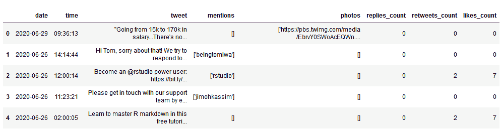
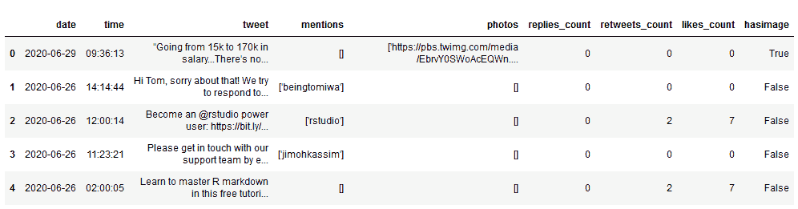
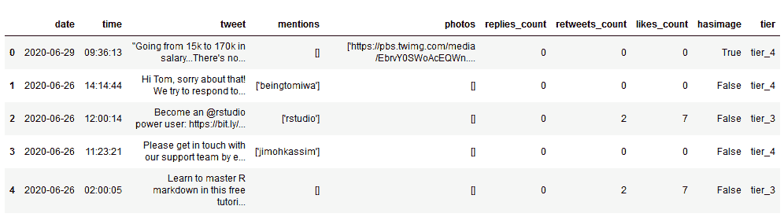

# 教程:根据 If-Else 条件向 Pandas 数据框架添加一列

> 原文：<https://www.dataquest.io/blog/tutorial-add-column-pandas-dataframe-based-on-if-else-condition/>

July 1, 2020

当我们使用 Python 进行数据分析时，我们有时可能希望根据数据帧中其他列的值向 pandas 数据帧添加一列。

虽然这听起来很简单，但如果我们尝试使用一个 if-else 条件来做这件事，就会变得有点复杂。谢天谢地，使用 numpy 有一个简单的好方法来做到这一点！

要了解如何使用，我们来看一个具体的数据分析题。我们有超过 4000 条 Dataquest 推文的数据集。附有图片的推文会获得更多的赞和转发吗？下面我们来做一些分析来了解一下！

我们将从导入 pandas 和 numpy 开始，并加载我们的数据集来看看它是什么样子的。(如果你还不熟悉使用 pandas 和 numpy 进行数据分析，请查看[我们的交互式 numpy 和 pandas 课程](https://www.dataquest.io/course/pandas-fundamentals/))。

```
import pandas as pd
import numpy as np

df = pd.read_csv('dataquest_tweets_csv.csv')
df.head()
```

T2】

我们可以看到，我们的数据集包含了每条推文的一些信息，包括:

*   `date` —推文发布的日期
*   `time` —发布推文的时间
*   `tweet` —推文的实际文本
*   `mentions` —推文中提到的任何其他 twitter 用户
*   `photos` —推文中包含的任何图片的 url
*   `replies_count` —推文上的回复数量
*   `retweets_count` —推文的转发次数
*   `likes_count` —推文上的赞数

我们还可以看到`photos`数据的格式有点奇怪。

## 使用 np.where()添加具有真/假条件的熊猫列

对于我们的分析，我们只是想看看带有图片的 tweets 是否获得了更多的交互，所以我们实际上并不需要图片 URL。让我们尝试创建一个名为`hasimage`的新列，它将包含布尔值——如果推文包含图像，则为`True`，如果不包含图像，则为`False`。

为此，我们将使用 [numpy 的内置`where()`函数](https://numpy.org/doc/stable/reference/generated/numpy.where.html)。该函数按顺序接受三个参数:我们要测试的条件，如果条件为真，则分配给新列的值，如果条件为假，则分配的值。看起来是这样的:

```
np.where(condition, value if condition is true, value if condition is false)
```

在我们的数据中，我们可以看到没有图片的推文*在`photos`列中总是有值`[]`。我们可以使用信息和`np.where()`来创建我们的新列`hasimage`，如下所示:*

```
df['hasimage'] = np.where(df['photos']!= '[]', True, False)
df.head()
```

T2】

上面，我们可以看到我们的新列已经被追加到我们的数据集，并且它已经正确地将包含图像的推文标记为`True`，将其他推文标记为`False`。

现在我们已经有了我们的`hasimage`列，让我们快速制作几个新的数据帧，一个用于所有图片推文，一个用于所有非图片推文。我们将使用布尔过滤器:

```
image_tweets = df[df['hasimage'] == True]
no_image_tweets = df[df['hasimage'] == False]
```

现在我们已经创建了这些，我们可以使用内置的熊猫数学函数，如`.mean()`来快速比较每个数据帧中的推文。

我们将使用`print()`语句使结果更容易阅读。我们还需要记住使用`str()`将我们的`.mean()`计算结果转换成一个字符串，这样我们就可以在我们的打印语句中使用它:

```
## LIKES
print('Average likes, all tweets: ' + str(df['likes_count'].mean()))
print('Average likes, image tweets: ' + str(image_tweets['likes_count'].mean()))
print('Average likes, no image tweets: ' + str(no_image_tweets['likes_count'].mean()))
print('\n')

## RETWEETS
print('Average RTs, all tweets: ' + str(df['retweets_count'].mean()))
print('Average RTs, image tweets: ' + str(image_tweets['retweets_count'].mean()))
print('Average RTs, no image tweets: ' + str(no_image_tweets['retweets_count'].mean()))
```

```
Average likes, all tweets: 6.209759328770148
Average likes, image tweets: 14.21042471042471
Average likes, no image tweets: 5.176514584891549

Average RTs, all tweets: 1.5553102230072864
Average RTs, image tweets: 3.5386100386100385
Average RTs, no image tweets: 1.2991772625280478
```

基于这些结果，在 Dataquest 中加入图片似乎可以促进更多的 Twitter 互动。有图片的推文平均点赞和转发量是没有图片的推文的近三倍。

## 添加具有更复杂条件的熊猫列

这种方法工作得很好，但是如果我们想要添加一个具有更复杂条件的新列—一个超越真与假的列，该怎么办呢？

例如，为了更深入地研究这个问题，我们可能想要创建一些交互性“层”,并评估到达每个层的推文中包含图像的百分比。为了简单起见，让我们用喜欢来衡量交互性，并将推文分成四层:

*   `tier_4` — 2 个或更少的喜欢
*   `tier_3` — 3-9 个赞
*   `tier_2` — 10-15 个赞
*   `tier_1` — 16+个赞

为了实现这一点，我们可以使用[一个叫做`np.select()`](https://numpy.org/doc/stable/reference/generated/numpy.select.html) 的函数。我们会给它两个参数:一个是我们的条件列表，另一个是我们希望分配给新列中每一行的相应值列表。

这意味着顺序很重要:如果满足我们的`conditions`列表中的第一个条件，我们的`values`列表中的第一个值将被分配给该行的新列。如果满足第二个条件，则将分配第二个值，依此类推。

让我们看看这在 Python 代码中是怎样的:

```
# create a list of our conditions
conditions = [
    (df['likes_count'] <= 2),
    (df['likes_count'] > 2) & (df['likes_count'] <= 9),
    (df['likes_count'] > 9) & (df['likes_count'] <= 15),
    (df['likes_count'] > 15)
    ]

# create a list of the values we want to assign for each condition
values = ['tier_4', 'tier_3', 'tier_2', 'tier_1']

# create a new column and use np.select to assign values to it using our lists as arguments
df['tier'] = np.select(conditions, values)

# display updated DataFrame
df.head()
```

T2】

厉害！我们创建了另一个新的专栏，根据我们的等级排名系统(诚然有些武断)对每条推文进行分类。

现在，我们可以用它来回答更多关于我们数据集的问题。例如:1 级和 4 级推文中有图片的比例是多少？

```
#tier 4 tweets
df[(df['tier'] == 'tier_4')]['hasimage'].value_counts(normalize=True)
```

```
False    0.948784
True     0.051216
Name: hasimage, dtype: float64
```

```
#tier 1 tweets
df[(df['tier'] == 'tier_1')]['hasimage'].value_counts(normalize=True)
```

```
False    0.836842
True     0.163158
Name: hasimage, dtype: float64
```

在这里，我们可以看到，虽然图像似乎有所帮助，但它们似乎不是成功的必要条件。超过 83%的 Dataquest“第一层”推文(赞数超过 15 的推文)没有附带图片。

虽然这是一个非常肤浅的分析，但是我们已经完成了我们真正的目标:根据关于现有列中的值的条件语句，向 pandas 数据帧添加列。

当然，这是一项可以通过多种方式完成的任务。np.where()和 np.select()只是许多潜在方法中的两种。如果你想了解更多这方面的知识，请查看 [Dataquest 的交互式 Numpy 和 Pandas 课程](https://www.dataquest.io/course/pandas-fundamentals/)，以及[数据科学家在 Python 职业道路上的其他课程](https://www.dataquest.io/path/data-scientist/)。