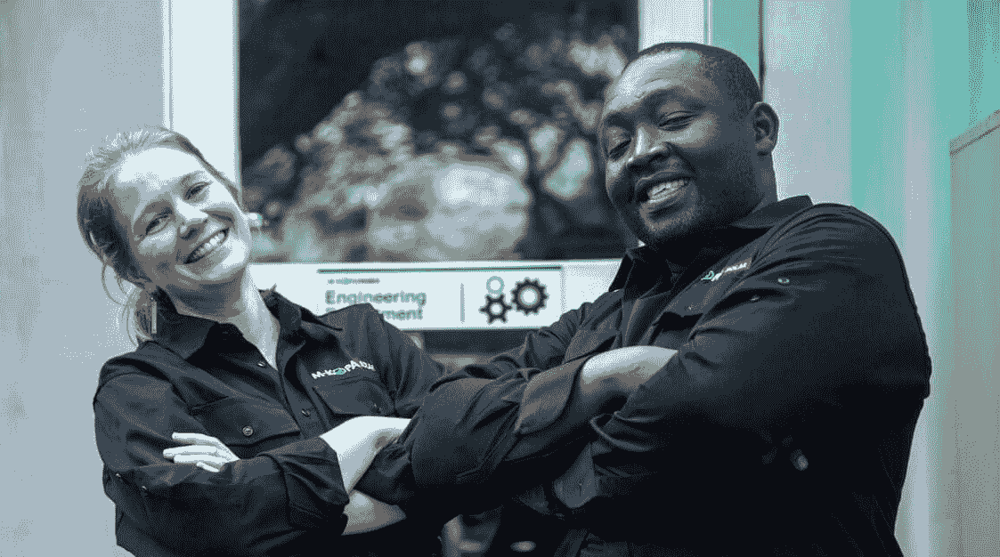

# Dataquest 值得吗？这是我们的学习者在 2020 年说的话

> 原文：<https://www.dataquest.io/blog/is-dataquest-worth-it-2020/>

May 4, 2020

许多报名参加在线学习项目的人都在寻找一些方法来让他们的生活变得更好。

也许你正在寻找一份更有成就感的职业。也许你想去**赚更多的钱**。也许你想**建立一些信心**或者**做一个你目前不具备技能的项目**。

当你评估一个像 Dataquest 这样的平台时，可能会遇到的问题是:**这真的有帮助吗？**data quest 值得吗？我在教育上的投资能帮助我实现目标吗？

在 Dataquest，我们希望我们所有的学员都能达到他们的目标。因此，在我们的 2020 年结果调查 *(n=656)* 中，我们决定直接提问:【Dataquest 对你的生活产生了什么影响？

结果是压倒性的。为了确保学习者认为他们可以安全地提供诚实的反馈，我们的调查是匿名的，但我们确实询问了我们是否可以引用他们提供的一些答案。以下是其中几个答案的集合。

如果愿意，您可以滚动浏览整个列表，或者使用下面的按钮跳转到与特定目标相关的反馈:

注意:我们编辑了其中一些引文的拼写、语法和长度，并在某些情况下用 Dataquest 替换了单词“it ”,以使学习者评论的上下文更加清晰。

## 我想在数据科学领域开创一个新的职业生涯！

> 在完成 Dataquest 后，我能够**转行，这改变了我的生活，也给了我力量。**
> 
> *–德国的 Dataquest 学员*

> 我从来没有想到一个人可以在这么短的时间内改变自己的职业生涯。但是我真的做到了！我非常感谢 DQ 的教学方法。感觉就像是为我设计的。
> 
> *–巴西的 Dataquest 学员*

> Dataquest 帮助我**找到了一份我真正喜欢的工作**，并发现有价值和挑战性。
> 
> *–英国的 Dataquest 学员*

> 我的收入在一年内翻了一番。
> 
> *–加拿大 Dataquest 学员*

> 有趣的是，上面提到的学习者并不是最近唯一一个使用“收入翻倍”这句话的 Dataquest 学习者。查看维多利亚如何利用她在 Dataquest 学到的数据技能在一夜之间使工资翻了一番的故事。
> 
> Dataquest 通过教我新技能和帮助我转向更好的职业，让我的生活变得更好。
> 
> *–美国的 Dataquest 学员*

> 我找到了一份数据科学家的工作。现在我很开心，工作也很开心。
> 
> *–土耳其的 Dataquest 学员*

> 能够转行，而且不减薪——我实际上获得了加薪——真是太棒了。
> 
> *–美国的 Dataquest 学员*

> 从 15000 到 170000 的薪水…没有可比性！
> 
> *–荷兰的 Dataquest 学员*

[https://youtu.be/ddM21fz1Tt0](https://youtu.be/ddM21fz1Tt0)

> Dataquest 真的帮助我顺利地从教书转向了数据科学。
> 
> *–美国的 Dataquest 学员*

> 我能够过渡到一个令人满意的职业，做一些我几年前就应该学会的事情
> 
> *–美国的 Dataquest 学员*

> 我换了一份新工作，我对我的工作感到兴奋。从那以后，我得到了几次晋升，现在我觉得更轻松了，因为我的工作很有成就感。
> 
> *–捷克共和国的 Dataquest 学员*

> 我现在赚更多的钱，也有更多的自由。
> 
> *–荷兰的 Dataquest 学员*

> Dataquest skills **让我得到了一份我想要的分析工作**。
> 
> *–美国的 Dataquest 学员*

> 我现在作为一名数据分析师做着**100%的远程工作。偏远以难以形容和无价的方式改变了我的生活。"**
> 
> *–美国的 Dataquest 学员*

> 在 Dataquest 获得 Python 技能是在一个非常好的研究所获得学生研究助理职位的关键因素。
> 
> *–德国的 Dataquest 学员*

> Dataquest 让我能够**找到一份工作，做更多我喜欢的工作**并获得更多报酬，这对我生活的其他部分也有好处。
> 
> *–美国的 Dataquest 学员*

> 我现在有了更高的薪水和更好的工作前景。
> 
> *–荷兰的 Dataquest 学员*

**立即订阅 Dataquest 】,按照您自己的进度开始交互式学习数据技能。**

[View Plans](/subscribe)

*(或者报名免费试用！)*

## 我想改善我现在的工作！

> 我被视为组织中的重要成员，肩负着更多的责任。我得到了我一直希望雇主给予我的关注和信任。
> 
> *–卡塔尔的 Dataquest 学员*

> 作为一名女性， **Dataquest 给了一些男同事更多的自信来挑战性别刻板印象**。现在，我是一个妈妈，我觉得我学得和在大学时一样快。
> 
> *–巴西的 Dataquest 学员*

> Dataquest 之后，**我能够更快地完成工作**并更好地指导我的团队。
> 
> *–美国的 Dataquest 学员*

> Dataquest 让我能够**改进增加销售额的流程**，例如过滤大型数据集，并让我对自己的新技能更有信心。后者更容易与同事交流并获得他们的反馈。
> 
> *–美国的 Dataquest 学员*

> Dataquest 给了我一个在职业生涯中成长的机会。
> 
> *–委内瑞拉的 Dataquest 学员*

> 我几乎能够在学习后立即在工作中应用新技能。
> 
> *–捷克共和国的 Dataquest 学员*

> 我觉得使用数据更舒服，这让我能够在工作中做出更好的决定。
> 
> *–美国的 Dataquest 学员*

> 我自动化了一些任务，花更少的时间做更多的事。此外，由于我的新技能，我获得了加薪。
> 
> *–美国的 Dataquest 学员*

> 开始接触编程帮助我改进了处理数据的方法，如何组织数据，如何清理数据。我在工作中获得了更多的乐趣。
> 
> *–卢森堡的 Dataquest 学员*

> 每天在工作中使用我从 Dataquest 中学到的知识，这让我受益匪浅。我已经编写了新的分析程序，更新和简化了旧的程序，并接触了 Jupyter(这是一个游戏改变者)之类的东西。
> 
> *–美国的 Dataquest 学员*

> 人们经常依靠我来解决编程问题。我认为 Dataquest 给了我很多关于熊猫和熊猫的知识。
> 
> *–丹麦的 Dataquest 学员*

> 我现在是工作中的关键人物！
> 
> *–美国的 Dataquest 学员*

**立即订阅 Dataquest 】,按照您自己的进度开始交互式学习数据技能。**

[View Plans](/subscribe)

*(或者报名免费试用！)*

## 我想学编码！

> 我没有计算机科学背景，但是现在我可以用 Python 来简化我的 Excel 工作，这很有趣！
> 
> *–印度尼西亚的 Dataquest 学员*

> Dataquest **让我认为遥不可及的事情**——编码并将 Python 应用于数据分析——**成为现实。**
> 
> *–印度尼西亚的 Dataquest 学员*

> 数据科学以前从未感到如此容易，我 **再也不害怕编程了！**
> 
> *–印度的 Dataquest 学员*

> 现在感觉**可以写代码了**。这在 Dataquest 之前对我来说是不可想象的。
> 
> *–西班牙的 Dataquest 学员*

> Dataquest 让我明白了**学习编程永远不晚！**
> 
> *–卢旺达的 Dataquest 学员*

我害怕编码、统计和数学。但是 Dataquest 通过它的学习方法，让我意识到我擅长以前害怕的东西。我现在可以超越阅读和了解更多，这是我前进了一步

> 职业
> 
> *–尼日利亚的 Dataquest 学员*

> 有了 Dataquest，**我可以在我的教育机构参加高级编程课程**的考试。
> 
> *–美国的 Dataquest 学员*

> 在加入 Dataquest 之前，我曾经做过一些研究工作。但是我在写代码的时候绊倒了。现在**我能够流利地用 Python 编写与数据科学相关的**代码。
> 
> *–孟加拉国的 Dataquest 学员*

> 我无法想象在我的一生中，我会学会如何编程，而我现在就在这里。
> 
> *–瑞士的 Dataquest 学员*

**立即订阅 Dataquest 】,按照您自己的进度开始交互式学习数据技能。**

[View Plans](/subscribe)

*(或者报名免费试用！)*

## 我要改善我的生活！

> 我对自己的未来更有安全感。
> 
> *–新加坡的 Dataquest 学员*

> 使用 Dataquest 进行学习改变了我的学习模式，**培养了一种安静的自信感**，这也在生活的其他领域帮助了我。
> 
> *–印度的 Dataquest 学员*

信心是一个在很多回答中出现的主题，包括很多我们在这里没有引用的类似问题。Dataquest 在帮助建立自信方面如此有效的原因之一是[我们专注于通过做](https://www.dataquest.io/blog/dataquest-active-curriculum-how-we-teach-data-science/)来学习。当你以前已经做过某件事的时候，你很容易对自己能够做这件事充满信心！

> 我能够在 T2【Kaggle】参加更多的**比赛，并感到更加自信。**
> 
> *–美国的 Dataquest 学员*

> 我真的从 Dataquest 中学到了比大数据硕士学位更多的东西。
> 
> *–西班牙的 Dataquest 学员*

> 我暂停工作来帮助抚养一个孩子。 **Dataquest 让我感觉我仍在学习和发展我的技能，**而不是仅仅坐在一旁。
> 
> *–美国的 Dataquest 学员*

> **Dataquest 真的让我的生活变得更美好**。我是在课程打折时购买的，但现在我很乐意再付一年的全价。
> 
> *–日本的 Dataquest 学员*

> 我仍在学习 Dataquest 课程，这是我一生中最好的投资！
> 
> *–俄罗斯的 Dataquest 学员*

这些只是我们收到的许多类似回复的简短摘录。当然，我们只分享那些表示我们可以发表他们的语录的学习者的语录。尽管如此，我们认为这很好地回答了这个问题:Dataquest 值得吗？

但你不必相信我们的话！从我们的调查中查看[一些定量数据，或者在第三方网站上阅读我们的学习者评论，如](https://www.dataquest.io/blog/dataquest-reviews-survey-2019/) [SwitchUp](https://www.switchup.org/bootcamps/dataquest) 和[课程报告](https://www.coursereport.com/schools/dataquest)，你会发现很多相同的主题。

## Dataquest 会对你的生活产生什么影响？

*[https://www.youtube.com/embed/6a5jbnUNE2E?rel=0](https://www.youtube.com/embed/6a5jbnUNE2E?rel=0)*

 *提升您的数据技能。

[查看计划](/subscribe)*