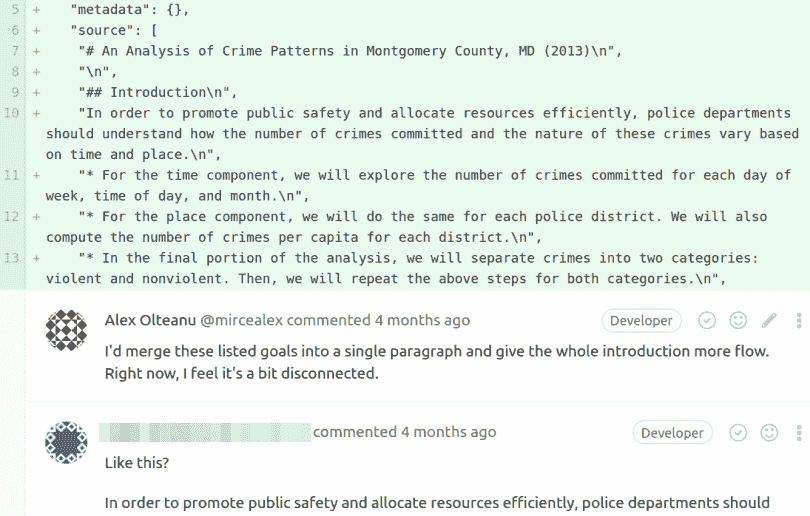
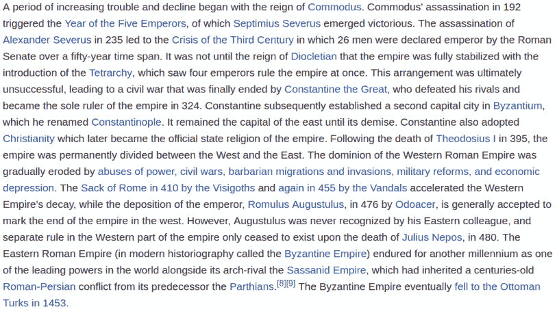

# 数据科学项目的深度风格指南

> 原文：<https://www.dataquest.io/blog/data-science-project-style-guide/>

July 9, 2018

当你申请与数据科学相关的职位时，你可能需要提交一个作品集或项目。虽然你的能力主要是潜在雇主在评估你的工作时所关注的，但风格方面也会发挥作用。

在招聘初级数据科学职位时，雇主通常会非常重视候选人的投资组合。虽然你可能有能力做一些技术上令人印象深刻的项目，但是如果你没有足够重视风格方面的话，你的求职就会受到影响。一个忙碌的雇主是不会审查糟糕的建设项目的。

在 Dataquest，我们帮助了许多数据科学学生进行项目组合评审。我们了解了学生们最常犯的错误，我们也思考了如何让雇主对一个项目感兴趣。


 Reviewing the project of a Dataquest student.


基于我们的经验，我们创建了以下风格指南。我们还创建了一个示例项目,这样你就可以看到这些指导方针在起作用。

请注意，我们的指南主要针对笔记本风格的项目。这是学生发送给雇主的最常见的项目类型，它由在 Jupyter Notebook、Jupyter Lab、RStudio、nteract 等开发环境中编写的代码和叙述组成。

## 了解你的受众

在你开始建立你的作品集之前，要清楚地知道谁会去审阅它。

在本帖中，我们将把雇主作为我们项目的受众，因为这是我们最常见的用例。一般来说，雇主都是厌恶风险的——他们会寻找暗示你可能是一项风险投资的线索。让你的工作适应他们的标准有两大挑战:

*   受众是异质的，既有技术人员也有非技术人员。不同类型的雇主可能会阅读你的项目——例如，高级数据科学家可能会评估你的工作，但没有技术知识的人也可能会看一看。
*   有些雇主只会略读你的工作，而其他雇主会看得更详细。这通常取决于招聘阶段。最初，一个雇主要处理几十或几百份申请，也许他们会花五分钟在每个候选人身上。在一些较晚的阶段，他们通常会深入细节以选出合适的候选人。

为了解决这两个挑战，编写这样的项目:

*   让技术型和非技术型雇主都清楚你能为他们的公司带来价值。
*   做好一次**快速扫描**。
*   做好一篇**通读**。

接下来，我们将更详细地讨论上述三个行动项目中的每一个。

## 面向技术和非技术读者的写作

你能向技术和非技术雇主展示你能为他们公司带来价值的最快方式是拥有*相关的项目主题*。然而，什么是相关主题取决于你想从事的行业。

假设您有一个投资组合，其中有几个关于棒球和篮球数据的优秀项目。如果你申请的是金融行业的数据科学职位，雇主几乎肯定会发现你的项目无关紧要。你的工作可能很出色，但他们希望看到表明你很适合金融行业的东西:投资建议、股市预测、销售建议等。

另一方面，如果你在为一家每天写体育报道的出版物申请数据记者的职位，你的工作肯定是相关的。

因此，在投入大量工作来构建一些可能不相关的特殊项目之前，请尝试弄清楚您希望从事的数据科学行业和细分市场。

一旦你做出了决定，就开始构建相关的项目，并将它们包含在你的投资组合中。

理想情况下，你会找到一个既与你喜欢的行业相关，又能激发激情的项目。这应该是可行，因为你想在这个行业工作是有原因的。否则，至少要努力找到一个好的取舍。


## 在快速扫描中表现良好

这些是人们通常在快速浏览时考虑的数据科学组合项目的主要部分:

*   标题
*   介绍
*   副标题
*   结论
*   图形
*   密码

现在让我们来讨论如何改进这些部分，使其在快速浏览时表现良好。

#### Title

有可能雇主只会看到你的头衔。你选择的标题告诉他们:

*   你的项目是否与他们想要招聘的职位相关。
*   你的项目是否值得深入阅读。

你的教训是想出一个标题，立即告诉雇主你的工作既相关又有趣。我们已经讨论了相关的部分，所以这里有一些让你的头衔引起雇主注意的小技巧:

*   **避免模糊的标题**。例如，如果你正在分析纽约的房地产数据，不要把你的工作命名为“分析房地产数据”这是模糊的，你可以在这样的标题下写一整本书。不要去想那些能准确反映你的分析特点的东西。尽量选“寻找投资机会——分析纽约房价演变”之类的。
*   避免情感中立的头衔。在“分析纽约房价”和“寻找投资机会——分析纽约房价的演变”之间，你可能会选择后者，因为“投资”和“机会”这样的词会在读者的脑海中引发一些与收益相关的情绪。一般来说，人们更有可能点击情绪活跃的标题(无论标题引发积极还是消极的情绪)。
*   **避免过长的标题**。我们希望快速传达一个强烈的信息——长标题通常更难理解，所以你的目标是确保读者不需要再次阅读标题就能理解你想说的内容。作为一条规则，尽量把标题控制在 15 个字以内。例如，这似乎太多了:"在纽约寻找两个最好的社区进行投资，在房地产行业进行长期有利可图的投资。"

#### 简介

你想出了一个好标题，并说服雇主看一看你的数据科学项目。介绍很可能是他们接下来要读的东西。同样，你想传达同样的信息:

*   你的项目与你被考虑的角色相关。
*   你的项目值得深入阅读。

以下是写一篇好的简介的一些主要注意事项:

*   **有介绍**。这里有必要说明一些显而易见的东西，因为我们已经看到了没有介绍的项目。
*   **简洁地描述你的项目**。用不超过三段的篇幅(每段最多 3-4 句话)，简明扼要地讨论:
    *   你分析的目标。
    *   你实现目标的方法。
    *   您发现的最重要的结果——我们在此提到这些结果是为了证明我们能够快速传达我们的发现。
*   **不要使用目录(TOC)** 。除非你正在写一个大项目，否则不要使用 TOC。目录很容易浏览，但是它通常占用大量的垂直空间，使得简介看起来很大。保持简介的简单和整洁会给人一种快速阅读的印象，这将鼓励雇主真正阅读它。
*   就事论事。不要夸夸其谈，也不要以引用(尤其是引用爱因斯坦的话)开始——只要坚持简明扼要地陈述你的分析目标、你将采取的实现目标的方法以及你发现的最重要的结果。

#### 副标题

如果雇主想浏览你的整个项目，他们会发现副标题非常有用。再次强调，确保你发出的信息是你的工作是相关和有趣的。以下是一些关于写好副标题的建议:

*   **有副标题**。确保将项目分成几个逻辑部分，并为每个部分添加一个副标题。
*   使用标题的一些技巧。副标题只是项目不同逻辑部分的*标题*，这意味着我们可以使用我们学到的一些标题技巧:
    *   避免模糊的字幕。
    *   避免过长的字幕。
    *   理想情况下，尽量避免情感中立的字幕。

#### 结论

对于我们这里的目的，一个好的结论是:

*   提醒读者最初的目标是什么，以及达到这个目标的主要途径是什么。
*   总结了最重要的结果。

实际上，结论类似于根据正文中所做的事情重新措辞的导言。要写一个好的结论，试着:

*   简明扼要，不要使用超过两段(每段最多 3-4 句话)。
*   不要夸大你的最终主张。此外，最好不要试图以引用来结束，因为大多数读者不会阅读你的所有作品，因此，他们无法分享你的热情。

#### 图表

如果您为您的项目生成图表(我们强烈建议您这样做)，您可以相当确定每个图表都将被快速查看。我们的大脑似乎发现处理来自图像的信息比来自文本的信息更快更容易，所以我们更倾向于观看而不是阅读。因此，希望你的读者在看到图表时放慢滚动速度。

考虑到这一点，您需要确保您的图表快速清晰地传达信息，并且看起来专业。以下是实现这一点的一些建议:

*   给每张图起一个标题，清楚地解释图的内容。用加粗的字体写标题也是一个好主意。
*   标记每个轴。增加标签的字体大小，直到易于阅读。当你选择字体大小时，值得记住的是有些人可能会在小屏幕上阅读你的作品(小的笔记本电脑，平板电脑，手机等)。).
*   理想情况下，广泛定制您的图表。如果你在用 Python 编程，你可能想看看这个制作五个三十八度图的教程。

#### 代码

在这个阶段，没有人会深入阅读您的代码，但是有经验的程序员可能会浏览您的代码，以评估如下元素:

*   代码可读性。
*   你用的算法。
*   您使用的库；等等。

在这篇文章的后面，我们将提供可读性方面的技巧。这些提示对快速浏览和全面阅读都有帮助，所以我们在下一节将它们归类在一起。

## 在全面阅读中表现出色

在招聘过程的后期，雇主通常会考虑更多细节来挑选合适的候选人。

在这一点上，你应该期待某个具有技术知识的人对你的项目进行深入的解读。在通读中做得好主要取决于项目的技术部分:

*   你用的算法。
*   你试图解决的问题。
*   你解决问题的方法。
*   你方法的深度；等等。

然而，风格元素也很重要，它们真的可以有所作为。你编写什么样的代码很重要，但是你如何编写代码也很重要。因此，我们接下来将重点学习一些技巧，它们可以帮助我们在风格方面更好地编码和编写。

#### 代码

你如何写代码很重要，因为它向雇主展示了你是否能写出干净的代码，能被你未来的潜在同事阅读和理解。编写其他人能够容易理解的代码是相当具有挑战性的。

下面我们将讨论一些关于编写易于理解的代码的最佳实践。你可以从阅读编程语言的官方风格指南开始，在那里你可以找到很多提高代码可读性的技巧。

如果没有官方指南，可以搜索大多数人用该语言编写代码时使用的指南。对于 Python，你可以在这里找到官方风格指南[，对于 R，你可以在这里](https://www.python.org/dev/peps/pep-0008/)找到指南[。](https://style.tidyverse.org)

下面我们探讨一些关于代码可读性的主要注意事项(我们将使用 Python 代码，但是这些准则也适用于其他语言):

*   使用**块注释**为每个具有不同功能的代码块添加简短描述。当你写代码的时候，大多数时候添加块注释是多余的。尽管如此，还是要添加它们，因为它们有助于读者，而且如果你几个月后阅读你的代码，它们也能帮助你容易地回忆起你试图做的事情。

**否:**

```
 opened_file = open('Super_Bowl.csv')
read_file = opened_file.read()
super_bowl_split = read_file.split('\\n')
super_bowl = []
for row in super_bowl_split:
    super_bowl.append(row.split(',')) 
```

**是**:

```
 # Read in the data
opened_file = open('Super_Bowl.csv')
read_file = opened_file.read()
# Transform read_file into a list of lists
super_bowl_split = read_file.split('\n')
super_bowl =  []
for row in super_bowl_split:
    super_bowl.append(row.split(','))
```

*   **垂直分隔**具有不同功能的代码块。

**否:**

```
 # Read in the data
opened_file = open('Super_Bowl.csv')
read_file = opened_file.read()
# Transform read_file into a list of lists
super_bowl_split = read_file.split('\n')
super_bowl =  []
for row in super_bowl_split:
    super_bowl.append(row.split(','))
```

**是:**

```
 # Read in the data
opened_file = open('Super_Bowl.csv')
read_file = opened_file.read()

# Transform read_file into a list of listssuper_bowl_split = read_file.split('\n')
super_bowl =  []
for row in super_bowl_split:
    super_bowl.append(row.split(','))
```

*   添加**行内注释**，但是要确保它们是有用的，不要陈述显而易见的内容。

**否:**

```
 for row in super_bowl[1:]:    # Iterate through super_bowl[1:]
    row[2] = int(row[2])      # Convert to integer
    row[2] -= 5000            # Subtract 5000 from each row element in position 2
```

**是:**

```
 for row in super_bowl[1:]:   # Omit the first row - it contains the headers
    row[2] = int(row[2])
    row[2] -= 5000            # Values in the "Attendance" column are wrong - correct by subtracting 5000
```

*   **清楚地命名变量** —不要为了节省几个按键而牺牲宝贵的代码可读性。

**否:**

```
 o_f = open('Super_Bowl.csv')
r_f = opened_file.read()
```

**是:**

```
 opened_file = open('Super_Bowl.csv')
read_file = opened_file.read()
```

#### 正文

正如我们在介绍中提到的，学生可以发送给雇主的最常见类型的数据科学项目由代码和叙述的组合组成。

叙述部分很重要，因为它可以向雇主展示你是否有合适的沟通技巧。沟通是大多数数据科学角色的关键，因为数据科学家经常发现自己在跨职能团队中工作，与来自营销、产品、工程等部门的同事一起工作。团队成员一起工作在一个复杂的项目上，他们需要有效地相互沟通。

写一篇在通读中表现良好的记叙文取决于几个因素，比如:

*   可读性。
*   你的解释的深度和清晰度。
*   你所写的想法的流程。
*   叙事和代码之间的联系；等等。

下面，我们将探讨一些主要的注意事项，这些事项只与叙述的风格有关，旨在提高可读性:

*   不要使用长段落。文本墙会吓跑读者，而且会大大降低可读性。理想情况下，一个段落有三到四个句子，但如果你认为有意义，你甚至可以使用一句话的段落。这里有一个不要做的例子:


 Source: [Wikipedia](https://en.wikipedia.org/wiki/Roman_Empire)


*   **Use the right sentence length**. Long sentences (anything close to 40 words) are hard to understand on a first read and can make your writing feel heavy. Very short sentences (anything less than 5 words) are easy to understand and give a good flow to your writing, but they can also annoy some readers by fragmenting the narrative too much.

    理想情况下，完全避免长句，稀疏地使用非常短的句子，大多数时候使用中等大小的句子。

*   **其他小而重要的细节:**
    *   确保你的写作没有错别字。
    *   遵守语法和拼写规则。
    *   避免使用被动语态。
    *   避免使用不必要的副词。

要在风格方面写一篇好的记叙文，你可以通过使用[海明威应用](https://www.hemingwayapp.com/)来帮助自己。该应用程序可以帮助您:

*   浓缩你的句子和段落。
*   避免错别字。
*   避免被动语态和不必要的副词。

## 示例项目

我们在 Jupyter 实验室构建了一个示例项目,展示了如何实现我们在这里讨论的大部分指导方针。阅读项目时，请注意:

*   标题是具体的，情绪活跃的(它引发了与收益相关的情绪)，不超过 15 个单词。
*   引言是就事论事的，它描述了分析的目标、我们将采取的实现目标的方法以及我们发现的最重要的结果。
*   这个项目有小标题。
*   结论重申了最初的目标，我们为实现这一目标所采取的主要方法，并总结了最重要的成果。
*   该项目有图表，每个图表有一个标题和轴标签。一个图形是使用 [FiveThirtyEight](https://www.dataquest.io/blog/making-538-plots/) 样式定制的。
*   代码和文本符合我们讨论过的指导原则。

还观察到:

*   我们将一个降价单元与一个代码单元交替。每个 markdown 单元格都介绍并解释了它下面的代码单元格中发生的事情(结论除外，它下面没有代码单元格)。通常，交替使用不同类型的单元格(换句话说，避免同一行中有两个相同类型的单元格)。
*   模块被优雅地导入到需要它们的代码单元中(而不是把所有东西都塞进第一个单元)。这样我们就避免了第一个代码单元不必要的拥挤。我们还防止了以后的混淆——想象一下，在最后一个代码单元中使用一个低级函数，这个函数是从一个不太知名的包中导入到第一个代码单元中的。读者不会记得你做的所有导入，他们会感到困惑。
*   我们告诉读者他们可以从哪里下载数据。

## 接下来的步骤

简而言之，数据科学组合项目应该:

*   做好快速扫描。
    *   项目主题应该与雇主相关。
    *   该项目在风格方面应该是精心打磨的。这些是快速浏览时通常会考虑的元素:标题、介绍、副标题、结论、图表和代码。
*   做好全面的阅读。
    *   技术部分要强，要准。
    *   就风格而言，代码和叙述应该是完美的。

以下是您可以采取的一些后续步骤:

*   从头开始构建一个遵循本指南中讨论的指导方针的项目。查看我们的[引导项目页面](https://www.dataquest.io/data-science-projects/)获取灵感。
*   根据本指南中讨论的准则调整您的一个项目。
*   阅读[这篇博文](https://www.dataquest.io/blog/how-to-get-your-first-data-science-job/)可以更具体地讨论你应该把什么样的项目添加到你的投资组合中。

如果您仍在努力构建一个完美而专业的数据科学项目，我们在 [Dataquest](https://www.dataquest.io) 的团队可以提供帮助。您可以利用我们有用的[数据科学课程](https://www.dataquest.io/path/data-scientist/)或完成我们众多指导项目中的一个。