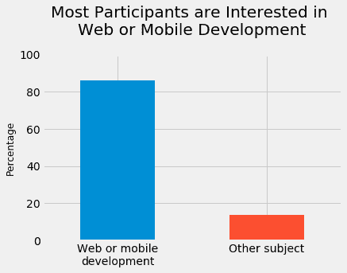
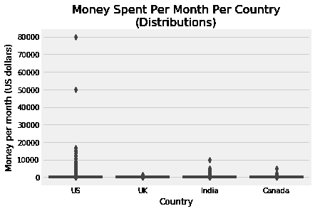
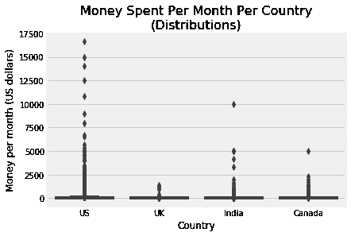
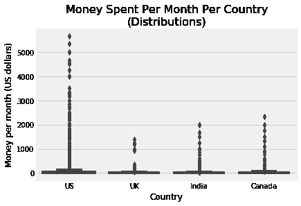

# 数据科学组合项目:在哪里宣传电子学习产品

> 原文：<https://www.dataquest.io/blog/data-science-portfolio-project-finding-the-two-best-markets-to-advertise-in-an-e-learning-product/>

September 5, 2018

在 Dataquest，我们强烈主张将组合项目作为获得第一份数据科学工作的一种方式。在这篇博文中，我们将带你浏览一个投资组合项目的例子。

该项目是我们的*统计中级:平均值和可变性*课程的一部分，它假设熟悉:

*   抽样(总体、样本、样本代表性)
*   频率分布
*   箱线图和条形图
*   汇总指标(尤其是平均值)
*   `pandas`、`matplotlib`和`seaborn`

如果你认为你需要在前进之前填补任何空白，我们会在我们的[统计基础](https://www.dataquest.io/course/statistics-fundamentals/)和[统计中级:平均值和可变性](https://www.dataquest.io/course/statistics-intermediate/)课程中深入讨论上述主题。本课程还将向您提供更深入的指导，说明如何构建这个项目，并在您的浏览器中对其进行编码。

我们还在我们的[数据科学家路径](https://www.dataquest.io/path/data-scientist)中教授`pandas`、`matplotlib`和`seaborn`。

该项目遵循我们的数据科学项目的[风格指南中提出的指导方针。](https://www.dataquest.io/blog/data-science-project-style-guide/)

## 介绍

在这个项目中，我们的目标是找到两个最好的市场来宣传我们的产品——我们正在为一家提供编程课程的电子学习公司工作。我们的大部分课程都是关于网络和移动开发的，但是我们也涉及其他领域，比如数据科学、游戏开发等等。

我们将分析关于新编码者的现有数据，以找到投资广告的最佳市场。为了提出我们的建议，我们将尝试找出:

*   这些新的编码员在哪里？
*   哪些地方有最多的新编码员？
*   新程序员愿意花多少钱在学习上。

## 结果摘要

分析数据后，我们得出的唯一可靠结论是，美国将是一个很好的广告市场。对于第二好的市场，在印度和加拿大之间选择什么并不明确。我们决定将结果发送给营销团队，这样他们就可以利用他们的领域知识做出最佳决策。

有关更多详情，请参考下面的完整分析。

## 探索现有数据

为了避免花钱组织调查，我们将首先尝试利用现有的数据来确定我们是否能得出可靠的结果。

对于我们的目的来说，一个很好的候选人是 [freeCodeCamp 的 2017 年新程序员调查](https://medium.freecodecamp.org/we-asked-20-000-people-who-they-are-and-how-theyre-learning-to-code-fff5d668969)。 [freeCodeCamp](https://www.freecodecamp.org/) 是一个提供网络开发课程的免费电子学习平台。因为他们经营着[一个受欢迎的媒体出版物](https://medium.freecodecamp.org/)(超过 400，000 名追随者)，他们的调查吸引了具有不同兴趣的新程序员(不仅仅是 web 开发)，这对我们的分析是理想的。

调查数据在[GitHub 知识库](https://github.com/freeCodeCamp/2017-new-coder-survey)中公开。下面，我们将快速浏览一下存储在我们刚刚提到的存储库的`clean-data`文件夹中的`2017-fCC-New-Coders-Survey-Data.csv`文件。我们将使用直接链接[在这里](https://raw.githubusercontent.com/freeCodeCamp/2017-new-coder-survey/master/clean-data/2017-fCC-New-Coders-Survey-Data.csv)读取文件。

```
# Read in the dataimport pandas as pd
direct_link = 'https://raw.githubusercontent.com/freeCodeCamp/2017-new-coder-survey/master/clean-data/2017-fCC-New-Coders-Survey-Data.csv'
fcc = pd.read_csv(direct_link, low_memory = 0) 
# low_memory = False to silence dtypes warning
# Quick exploration of the data
print(fcc.shape)
pd.options.display.max_columns = 150 # to avoid truncated output fcc.head()
```

```
(18175, 136)
```

|  | 年龄 | 参加训练营 | BootcampFinish | BootcampLoanYesNo | BootcampName | BootcampRecommend | 儿童数量 | 城市推广 | CodeEventConferences | CodeEventDjangoGirls | CodeEventFCC | CodeEventGameJam | CodeEventGirlDev | CodeEventHackathons | CodeEventMeetup | codeeventnodeeschool | CodeEventNone | CodeEventOther | CodeEventRailsBridge | CodeEventRailsGirls 女孩 | CodeEventStartUpWknd | CodeEventWkdBootcamps | CodeEventWomenCode | CodeEventWorkshops | 通勤时间 | 乡村公民 | 乡村生活 | 就业领域 | 就业领域其他 | 就业率 | 就业状况 | 预期学习 | 财政支持 | FirstDevJob | 性别 | 性别其他 | 哈斯儿童 | 有力的 | HasFinancialDependents | HasHighSpdInternet | 家庭抵押贷款 | HasServedInMilitary | HasStudentDebt | 家庭记忆 | 小时学习 | 身份证 | 身份证号码 | 收入 | IsEthnicMinority | isreceivedisabilityesbenefits 利益 | IsSoftwareDev | 我失业了 | JobApplyWhen | JobInterestBackEnd 后端 | JobInterestDataEngr | JobInterestDataSci | JobInterestDevOps | JobInterestFrontEnd | JobInterestFullStack | JobInterestGameDev | JobInterestInfoSec | JobInterestMobile | 工作兴趣其他 | JobInterestProjMngr | JobInterestQAEngr | JobInterestUX | JobPref | job relocation eyes no | 工作兴趣 | JobWherePref | 语言之家 | 婚姻状况 | 金钱促进学习 | 月份规划 | 网络 ID | Part1EndTime | 第 1 部分启动时间 | Part2EndTime | 第 2 部分启动时间 | 播客变更日志 | PodcastCodeNewbie | 播客代码笔 | 播客发展茶 | 播客网站 | 播客巨人机器人 | PodcastJSAir | PodcastJSJabber | 播客通 | 播客其他 | 播客节目下载 | 播客 RubyRogues | 播客每日 | 播客电台 | 播客商店谈话 | PodcastTalkPython | 播客 the bahead | 资源代码学院 | 资源代码战争 | 资源课程 a | 资源 | ResourceEdX | 资源 Egghead | 资源 FCC | ResourceHackerRank | 资源卡 | 资源琳达 | 资源 MDN | ResourceOdinProj | 资源其他 | ResourcePluralSight | ResourceSkillcrush | 资源 | 资源树屋 | 资源城市 | 资源数据库 | 资源 W3S | 学校学位 | 校长 | 学生俱乐部 | YouTube 视频教程 | YouTubeCodingTrain | YouTube 视频编码 360 | YouTube 电脑爱好者 | YouTubeDerekBanas | YouTube 视频提示 | YouTubeEngineeredTruth | YouTube efcc | YouTubeFunFunFunction | YouTubeGoogleDev | YouTubeLearnCode | youtubelieveluptuts | YouTube emit | YouTubeMozillaHacks | YouTubeOther | YouTubeSimplilearn | YouTube bethenewboston |
| --- | --- | --- | --- | --- | --- | --- | --- | --- | --- | --- | --- | --- | --- | --- | --- | --- | --- | --- | --- | --- | --- | --- | --- | --- | --- | --- | --- | --- | --- | --- | --- | --- | --- | --- | --- | --- | --- | --- | --- | --- | --- | --- | --- | --- | --- | --- | --- | --- | --- | --- | --- | --- | --- | --- | --- | --- | --- | --- | --- | --- | --- | --- | --- | --- | --- | --- | --- | --- | --- | --- | --- | --- | --- | --- | --- | --- | --- | --- | --- | --- | --- | --- | --- | --- | --- | --- | --- | --- | --- | --- | --- | --- | --- | --- | --- | --- | --- | --- | --- | --- | --- | --- | --- | --- | --- | --- | --- | --- | --- | --- | --- | --- | --- | --- | --- | --- | --- | --- | --- | --- | --- | --- | --- | --- | --- | --- | --- | --- | --- | --- | --- | --- | --- | --- | --- | --- |
| Zero | Twenty-seven | Zero | 圆盘烤饼 | 圆盘烤饼 | 圆盘烤饼 | 圆盘烤饼 | 圆盘烤饼 | 超过 100 万 | 圆盘烤饼 | 圆盘烤饼 | 圆盘烤饼 | 圆盘烤饼 | 圆盘烤饼 | 圆盘烤饼 | 圆盘烤饼 | 圆盘烤饼 | 圆盘烤饼 | 圆盘烤饼 | 圆盘烤饼 | 圆盘烤饼 | 圆盘烤饼 | 圆盘烤饼 | 圆盘烤饼 | 圆盘烤饼 | 15 到 29 分钟 | 加拿大 | 加拿大 | 软件开发和信息技术 | 圆盘烤饼 | 为工资而受雇 | 圆盘烤饼 | 圆盘烤饼 | 圆盘烤饼 | 圆盘烤饼 | 女性的 | 圆盘烤饼 | 圆盘烤饼 | One | Zero | One | Zero | Zero | Zero | 圆盘烤饼 | Fifteen | 02d 9465 b 21e 8 BD 09374 b 0066 fb2d 5614 | EB 78 C1 C3 AC 6 CD 9052 AEC 557065070 fbf | 圆盘烤饼 | 圆盘烤饼 | Zero | Zero | Zero | 圆盘烤饼 | 圆盘烤饼 | 圆盘烤饼 | 圆盘烤饼 | 圆盘烤饼 | 圆盘烤饼 | 圆盘烤饼 | 圆盘烤饼 | 圆盘烤饼 | 圆盘烤饼 | 圆盘烤饼 | 圆盘烤饼 | 圆盘烤饼 | 圆盘烤饼 | 开创自己的事业 | 圆盘烤饼 | 圆盘烤饼 | 圆盘烤饼 | 英语 | 已婚或同居伴侣关系 | One hundred and fifty | Six | 6f1fbc6b2b | 2017-03-09 00:36:22 | 2017-03-09 00:32:59 | 2017-03-09 00:59:46 | 2017-03-09 00:36:26 | 圆盘烤饼 | 圆盘烤饼 | 圆盘烤饼 | One | 圆盘烤饼 | 圆盘烤饼 | 圆盘烤饼 | 圆盘烤饼 | 圆盘烤饼 | 圆盘烤饼 | 圆盘烤饼 | 圆盘烤饼 | 圆盘烤饼 | 圆盘烤饼 | 圆盘烤饼 | 圆盘烤饼 | 圆盘烤饼 | One | 圆盘烤饼 | 圆盘烤饼 | 圆盘烤饼 | 圆盘烤饼 | 圆盘烤饼 | One | 圆盘烤饼 | 圆盘烤饼 | 圆盘烤饼 | One | 圆盘烤饼 | 圆盘烤饼 | 圆盘烤饼 | 圆盘烤饼 | 圆盘烤饼 | 圆盘烤饼 | 圆盘烤饼 | One | One | 一些大学学分，没有学位 | 圆盘烤饼 | 圆盘烤饼 | 圆盘烤饼 | 圆盘烤饼 | 圆盘烤饼 | 圆盘烤饼 | 圆盘烤饼 | 圆盘烤饼 | 圆盘烤饼 | 圆盘烤饼 | 圆盘烤饼 | 圆盘烤饼 | 圆盘烤饼 | 圆盘烤饼 | 圆盘烤饼 | 圆盘烤饼 | 圆盘烤饼 | 圆盘烤饼 | 圆盘烤饼 |
| one | Thirty-four | Zero | 圆盘烤饼 | 圆盘烤饼 | 圆盘烤饼 | 圆盘烤饼 | 圆盘烤饼 | 不到 10 万 | 圆盘烤饼 | 圆盘烤饼 | 圆盘烤饼 | 圆盘烤饼 | 圆盘烤饼 | 圆盘烤饼 | 圆盘烤饼 | 圆盘烤饼 | 圆盘烤饼 | 圆盘烤饼 | 圆盘烤饼 | 圆盘烤饼 | 圆盘烤饼 | 圆盘烤饼 | 圆盘烤饼 | 圆盘烤饼 | 圆盘烤饼 | 美利坚合众国 | 美利坚合众国 | 圆盘烤饼 | 圆盘烤饼 | 不工作但在找工作 | 圆盘烤饼 | Thirty-five thousand | 圆盘烤饼 | 圆盘烤饼 | 男性的 | 圆盘烤饼 | 圆盘烤饼 | One | Zero | One | Zero | Zero | One | 圆盘烤饼 | Ten | 5 bfef 9 ECB 211 EC 4 f 518 cf C1 D2 a6 F3 E0 c | 21 db 37 ADB 60 cdcafadfa 7 DCA 1 b 13 b 6 b 1 | 圆盘烤饼 | Zero | Zero | Zero | 圆盘烤饼 | 7 至 12 个月内 | 圆盘烤饼 | 圆盘烤饼 | 圆盘烤饼 | 圆盘烤饼 | 圆盘烤饼 | One | 圆盘烤饼 | 圆盘烤饼 | 圆盘烤饼 | 圆盘烤饼 | 圆盘烤饼 | 圆盘烤饼 | 圆盘烤饼 | 为非营利组织工作 | One | 全栈 Web 开发人员 | 和其他开发人员在一个办公室里 | 英语 | 单身，从未结过婚 | Eighty | Six | f8f8be6910 | 2017-03-09 00:37:07 | 2017-03-09 00:33:26 | 2017-03-09 00:38:59 | 2017-03-09 00:37:10 | 圆盘烤饼 | One | 圆盘烤饼 | 圆盘烤饼 | 圆盘烤饼 | 圆盘烤饼 | 圆盘烤饼 | 圆盘烤饼 | 圆盘烤饼 | 圆盘烤饼 | 圆盘烤饼 | 圆盘烤饼 | 圆盘烤饼 | 圆盘烤饼 | 圆盘烤饼 | 圆盘烤饼 | 圆盘烤饼 | One | 圆盘烤饼 | 圆盘烤饼 | One | 圆盘烤饼 | 圆盘烤饼 | One | 圆盘烤饼 | 圆盘烤饼 | 圆盘烤饼 | 圆盘烤饼 | 圆盘烤饼 | 圆盘烤饼 | 圆盘烤饼 | 圆盘烤饼 | One | 圆盘烤饼 | 圆盘烤饼 | One | One | 一些大学学分，没有学位 | 圆盘烤饼 | 圆盘烤饼 | 圆盘烤饼 | 圆盘烤饼 | 圆盘烤饼 | 圆盘烤饼 | 圆盘烤饼 | 圆盘烤饼 | 圆盘烤饼 | One | 圆盘烤饼 | 圆盘烤饼 | 圆盘烤饼 | 圆盘烤饼 | 圆盘烤饼 | 圆盘烤饼 | 圆盘烤饼 | 圆盘烤饼 | 圆盘烤饼 |
| Two | Twenty-one | Zero | 圆盘烤饼 | 圆盘烤饼 | 圆盘烤饼 | 圆盘烤饼 | 圆盘烤饼 | 超过 100 万 | 圆盘烤饼 | 圆盘烤饼 | 圆盘烤饼 | 圆盘烤饼 | 圆盘烤饼 | One | 圆盘烤饼 | One | 圆盘烤饼 | 圆盘烤饼 | 圆盘烤饼 | 圆盘烤饼 | 圆盘烤饼 | 圆盘烤饼 | 圆盘烤饼 | 圆盘烤饼 | 15 到 29 分钟 | 美利坚合众国 | 美利坚合众国 | 软件开发和信息技术 | 圆盘烤饼 | 为工资而受雇 | 圆盘烤饼 | Seventy thousand | 圆盘烤饼 | 圆盘烤饼 | 男性的 | 圆盘烤饼 | 圆盘烤饼 | Zero | Zero | One | 圆盘烤饼 | Zero | 圆盘烤饼 | 圆盘烤饼 | Twenty-five | 14f 1863 AFA 9 C7 de 488050 b 82 EB 3 edd 96 | 21ba 173828 FBE 9 e 27 ccebaf 4d 5166 a 55 | Thirteen thousand | One | Zero | Zero | Zero | 7 至 12 个月内 | One | 圆盘烤饼 | 圆盘烤饼 | One | One | One | 圆盘烤饼 | 圆盘烤饼 | One | 圆盘烤饼 | 圆盘烤饼 | 圆盘烤饼 | 圆盘烤饼 | 为一家中型公司工作 | One | 前端 Web 开发人员，后端 Web 开发人员… | 没有偏好 | 西班牙语 | 单身，从未结过婚 | One thousand | Five | 公元 189768 年 | 2017-03-09 00:37:58 | 2017-03-09 00:33:53 | 2017-03-09 00:40:14 | 2017-03-09 00:38:02 | One | 圆盘烤饼 | One | 圆盘烤饼 | 圆盘烤饼 | 圆盘烤饼 | 圆盘烤饼 | 圆盘烤饼 | 圆盘烤饼 | Codenewbie | 圆盘烤饼 | 圆盘烤饼 | 圆盘烤饼 | 圆盘烤饼 | One | 圆盘烤饼 | 圆盘烤饼 | One | 圆盘烤饼 | 圆盘烤饼 | One | 圆盘烤饼 | 圆盘烤饼 | One | 圆盘烤饼 | 圆盘烤饼 | 圆盘烤饼 | One | 圆盘烤饼 | 圆盘烤饼 | 圆盘烤饼 | 圆盘烤饼 | 圆盘烤饼 | 圆盘烤饼 | One | One | 圆盘烤饼 | 高中文凭或同等学历(GED) | 圆盘烤饼 | 圆盘烤饼 | 圆盘烤饼 | 圆盘烤饼 | One | 圆盘烤饼 | One | One | 圆盘烤饼 | 圆盘烤饼 | 圆盘烤饼 | 圆盘烤饼 | One | One | 圆盘烤饼 | 圆盘烤饼 | 圆盘烤饼 | 圆盘烤饼 | 圆盘烤饼 |
| three | Twenty-six | Zero | 圆盘烤饼 | 圆盘烤饼 | 圆盘烤饼 | 圆盘烤饼 | 圆盘烤饼 | 10 万到 100 万之间 | 圆盘烤饼 | 圆盘烤饼 | 圆盘烤饼 | 圆盘烤饼 | 圆盘烤饼 | 圆盘烤饼 | 圆盘烤饼 | 圆盘烤饼 | 圆盘烤饼 | 圆盘烤饼 | 圆盘烤饼 | 圆盘烤饼 | 圆盘烤饼 | 圆盘烤饼 | 圆盘烤饼 | 圆盘烤饼 | 我在家工作 | 巴西 | 巴西 | 软件开发和信息技术 | 圆盘烤饼 | 为工资而受雇 | 圆盘烤饼 | Forty thousand | Zero | 圆盘烤饼 | 男性的 | 圆盘烤饼 | Zero | One | One | One | One | Zero | Zero | Forty thousand | Fourteen | 91756 EB 4d c 280062 a 541 c 25 a3 d 44 CFB 0 | 3be 37 b 558 f 02 daae 93 a6 da 10 f 83 f0c 77 | Twenty-four thousand | Zero | Zero | Zero | One | 在接下来的 6 个月内 | One | 圆盘烤饼 | 圆盘烤饼 | 圆盘烤饼 | One | One | 圆盘烤饼 | 圆盘烤饼 | 圆盘烤饼 | 圆盘烤饼 | 圆盘烤饼 | 圆盘烤饼 | 圆盘烤饼 | 为一家中型公司工作 | 圆盘烤饼 | 前端 Web 开发人员，全栈 Web 开发… | 从家里 | 葡萄牙语 | 已婚或同居伴侣关系 | Zero | Five | db lic 0664 D1 | 2017-03-09 00:40:13 | 2017-03-09 00:37:45 | 2017-03-09 00:42:26 | 2017-03-09 00:40:18 | 圆盘烤饼 | 圆盘烤饼 | 圆盘烤饼 | 圆盘烤饼 | 圆盘烤饼 | 圆盘烤饼 | 圆盘烤饼 | 圆盘烤饼 | 圆盘烤饼 | 圆盘烤饼 | 圆盘烤饼 | 圆盘烤饼 | 圆盘烤饼 | 圆盘烤饼 | 圆盘烤饼 | 圆盘烤饼 | 圆盘烤饼 | 圆盘烤饼 | 圆盘烤饼 | 圆盘烤饼 | 圆盘烤饼 | 圆盘烤饼 | One | One | 圆盘烤饼 | 圆盘烤饼 | 圆盘烤饼 | One | 圆盘烤饼 | 圆盘烤饼 | 圆盘烤饼 | 圆盘烤饼 | One | 圆盘烤饼 | 圆盘烤饼 | 圆盘烤饼 | 圆盘烤饼 | 一些大学学分，没有学位 | 圆盘烤饼 | 圆盘烤饼 | 圆盘烤饼 | 圆盘烤饼 | 圆盘烤饼 | 圆盘烤饼 | 圆盘烤饼 | One | 圆盘烤饼 | One | One | 圆盘烤饼 | 圆盘烤饼 | One | 圆盘烤饼 | 圆盘烤饼 | 圆盘烤饼 | 圆盘烤饼 | 圆盘烤饼 |
| four | Twenty | Zero | 圆盘烤饼 | 圆盘烤饼 | 圆盘烤饼 | 圆盘烤饼 | 圆盘烤饼 | 10 万到 100 万之间 | 圆盘烤饼 | 圆盘烤饼 | 圆盘烤饼 | 圆盘烤饼 | 圆盘烤饼 | 圆盘烤饼 | 圆盘烤饼 | 圆盘烤饼 | 圆盘烤饼 | 圆盘烤饼 | 圆盘烤饼 | 圆盘烤饼 | 圆盘烤饼 | 圆盘烤饼 | 圆盘烤饼 | 圆盘烤饼 | 圆盘烤饼 | 葡萄牙 | 葡萄牙 | 圆盘烤饼 | 圆盘烤饼 | 不工作但在找工作 | 圆盘烤饼 | One hundred and forty thousand | 圆盘烤饼 | 圆盘烤饼 | 女性的 | 圆盘烤饼 | 圆盘烤饼 | Zero | Zero | One | 圆盘烤饼 | Zero | 圆盘烤饼 | 圆盘烤饼 | Ten | aa3f 061 a 1949 a 90 b 27 bef 7411 ECD 193 f | d7c 56 bbf 2c 7 b 62096 be 9 db 010 e 86d 96d | 圆盘烤饼 | Zero | Zero | Zero | 圆盘烤饼 | 7 至 12 个月内 | One | 圆盘烤饼 | 圆盘烤饼 | 圆盘烤饼 | One | One | 圆盘烤饼 | One | One | 圆盘烤饼 | 圆盘烤饼 | 圆盘烤饼 | 圆盘烤饼 | 为一家跨国公司工作 | One | 全栈 Web 开发人员，信息安全… | 和其他开发人员在一个办公室里 | 葡萄牙语 | 单身，从未结过婚 | Zero | Twenty-four | 11b0f2d8a9 | 2017-03-09 00:42:45 | 2017-03-09 00:39:44 | 2017-03-09 00:45:42 | 2017-03-09 00:42:50 | 圆盘烤饼 | 圆盘烤饼 | 圆盘烤饼 | 圆盘烤饼 | 圆盘烤饼 | 圆盘烤饼 | 圆盘烤饼 | 圆盘烤饼 | 圆盘烤饼 | 圆盘烤饼 | 圆盘烤饼 | 圆盘烤饼 | 圆盘烤饼 | 圆盘烤饼 | 圆盘烤饼 | 圆盘烤饼 | 圆盘烤饼 | 圆盘烤饼 | 圆盘烤饼 | 圆盘烤饼 | 圆盘烤饼 | 圆盘烤饼 | 圆盘烤饼 | 圆盘烤饼 | 圆盘烤饼 | 圆盘烤饼 | 圆盘烤饼 | 圆盘烤饼 | 圆盘烤饼 | 圆盘烤饼 | 圆盘烤饼 | 圆盘烤饼 | One | 圆盘烤饼 | 圆盘烤饼 | 圆盘烤饼 | 圆盘烤饼 | 学士学位 | 信息技术 | 圆盘烤饼 | 圆盘烤饼 | 圆盘烤饼 | 圆盘烤饼 | 圆盘烤饼 | 圆盘烤饼 | 圆盘烤饼 | 圆盘烤饼 | 圆盘烤饼 | 圆盘烤饼 | 圆盘烤饼 | 圆盘烤饼 | 圆盘烤饼 | 圆盘烤饼 | 圆盘烤饼 | 圆盘烤饼 | 圆盘烤饼 | 圆盘烤饼 |

## 检查样本代表性

正如我们在介绍中提到的，我们的大多数课程都是关于 web 和移动开发的，但是我们也涵盖了许多其他领域，比如数据科学和游戏开发。出于我们分析的目的，我们想回答一些关于对我们教授的科目感兴趣的新程序员群体的问题。提醒一下，我们想知道:

*   这些新的编码员在哪里？
*   哪些地方有最多的新编码员？
*   他们愿意在学习上花多少钱。

我们首先需要澄清数据集是否有我们需要的类别。`JobRoleInterest`列描述了每个参与者感兴趣的角色。如果一个参与者对某个领域的工作感兴趣，我们可以假设他们也对学习那个领域感兴趣。所以让我们看看这个专栏的频率分布表，确定我们掌握的数据是否相关。

```

# Frequency distribution table for 'JobRoleInterest
'fcc['JobRoleInterest'].value_counts(normalize = True) * 100
```

```
 Full-Stack Web Developer                                                                                                                                                                                                                                     11.770595
  Front-End Web Developer                                                                                                                                                                                                                                     6.435927
  Data Scientist                                                                                                                                                                                                                                              2.173913
Back-End Web Developer                                                                                                                                                                                                                                        2.030892
  Mobile Developer                                                                                                                                                                                                                                            1.673341
Game Developer                                                                                                                                                                                                                                                1.630435
Information Security                                                                                                                                                                                                                                          1.315789
Full-Stack Web Developer,   Front-End Web Developer                                                                                                                                                                                                           0.915332
  Front-End Web Developer, Full-Stack Web Developer                                                                                                                                                                                                           0.800915
  Product Manager                                                                                                                                                                                                                                             0.786613
Data Engineer                                                                                                                                                                                                                                                 0.758009
  User Experience Designer                                                                                                                                                                                                                                    0.743707
  User Experience Designer,   Front-End Web Developer                                                                                                                                                                                                         0.614989
  Front-End Web Developer, Back-End Web Developer, Full-Stack Web Developer                                                                                                                                                                                   0.557780
Back-End Web Developer, Full-Stack Web Developer,   Front-End Web Developer                                                                                                                                                                                   0.514874
Back-End Web Developer,   Front-End Web Developer, Full-Stack Web Developer                                                                                                                                                                                   0.514874
  DevOps / SysAdmin                                                                                                                                                                                                                                           0.514874
Full-Stack Web Developer,   Front-End Web Developer, Back-End Web Developer                                                                                                                                                                                   0.443364
  Front-End Web Developer, Full-Stack Web Developer, Back-End Web Developer                                                                                                                                                                                   0.429062
  Front-End Web Developer,   User Experience Designer                                                                                                                                                                                                         0.414760
Full-Stack Web Developer,   Mobile Developer                                                                                                                                                                                                                  0.414760
Back-End Web Developer, Full-Stack Web Developer                                                                                                                                                                                                              0.386156
Full-Stack Web Developer, Back-End Web Developer                                                                                                                                                                                                              0.371854
Back-End Web Developer,   Front-End Web Developer                                                                                                                                                                                                             0.286041
Full-Stack Web Developer, Back-End Web Developer,   Front-End Web Developer                                                                                                                                                                                   0.271739
Data Engineer,   Data Scientist                                                                                                                                                                                                                               0.271739
  Front-End Web Developer,   Mobile Developer                                                                                                                                                                                                                 0.257437
Full-Stack Web Developer,   Data Scientist                                                                                                                                                                                                                    0.243135
  Mobile Developer, Game Developer                                                                                                                                                                                                                            0.228833
  Data Scientist, Data Engineer                                                                                                                                                                                                                               0.228833
                                                                                                                                                                                                                                                               ...    
  Mobile Developer,   User Experience Designer, Full-Stack Web Developer,   DevOps / SysAdmin, Technical Writer                                                                                                                                               0.014302
Data Engineer,   Data Scientist, Information Security                                                                                                                                                                                                         0.014302
  Mobile Developer, Full-Stack Web Developer,   Product Manager, Game Developer, Information Security,   Front-End Web Developer,   User Experience Designer,   Data Scientist                                                                                0.014302
Back-End Web Developer, Game Developer, Data Engineer                                                                                                                                                                                                         0.014302
Full-Stack Web Developer, Information Security, Back-End Web Developer, Data Engineer,   Mobile Developer,   Data Scientist,   DevOps / SysAdmin                                                                                                              0.014302
Software Specialist                                                                                                                                                                                                                                           0.014302
Game Developer, Information Security,   Mobile Developer,   DevOps / SysAdmin, Full-Stack Web Developer,   Front-End Web Developer                                                                                                                            0.014302
Back-End Web Developer, Game Developer, Full-Stack Web Developer,   Front-End Web Developer,   DevOps / SysAdmin                                                                                                                                              0.014302
  Front-End Web Developer, Back-End Web Developer, Full-Stack Web Developer, Game Developer,   Mobile Developer                                                                                                                                               0.014302
Game Developer, Information Security, Full-Stack Web Developer, Back-End Web Developer                                                                                                                                                                        0.014302
  Front-End Web Developer,   Data Scientist, Game Developer,   Product Manager, Information Security                                                                                                                                                          0.014302
  Front-End Web Developer,   Mobile Developer, Information Security, Full-Stack Web Developer,   DevOps / SysAdmin, Back-End Web Developer, Game Developer                                                                                                    0.014302
  Mobile Developer, Game Developer, Full-Stack Web Developer, Back-End Web Developer,   Front-End Web Developer                                                                                                                                               0.014302
Data Engineer,   Front-End Web Developer,   Data Scientist, Full-Stack Web Developer                                                                                                                                                                          0.014302
  Product Manager, Back-End Web Developer,   Data Scientist, Full-Stack Web Developer, Game Developer,   User Experience Designer, Information Security                                                                                                       0.014302
  Mobile Developer, Back-End Web Developer,   Front-End Web Developer, Full-Stack Web Developer                                                                                                                                                               0.014302
  User Experience Designer, Full-Stack Web Developer,   Front-End Web Developer,   Mobile Developer, User Interface Design                                                                                                                                    0.014302
Full-Stack Web Developer,   Quality Assurance Engineer, Game Developer,   Front-End Web Developer,   User Experience Designer                                                                                                                                 0.014302
  Quality Assurance Engineer,   Front-End Web Developer,   User Experience Designer, Game Developer                                                                                                                                                           0.014302
  DevOps / SysAdmin,   Data Scientist, Full-Stack Web Developer, Information Security, Data Engineer, Back-End Web Developer                                                                                                                                  0.014302
Full-Stack Web Developer,   Data Scientist,   User Experience Designer,   Mobile Developer,   Front-End Web Developer                                                                                                                                         0.014302
Data Engineer,   Product Manager,   Data Scientist                                                                                                                                                                                                            0.014302
Full-Stack Web Developer,   User Experience Designer, Back-End Web Developer,   Data Scientist, Information Security, Criminal Defense Attorney-- focusing on cyber crimes                                                                                    0.014302
Data Engineer,   User Experience Designer,   Front-End Web Developer, Game Developer,   Data Scientist,   Product Manager                                                                                                                                     0.014302
  Front-End Web Developer,   User Experience Designer,   DevOps / SysAdmin, Back-End Web Developer,   Data Scientist, Game Developer,   Product Manager,   Quality Assurance Engineer, Full-Stack Web Developer, Information Security,   Mobile Developer     0.014302
Education                                                                                                                                                                                                                                                     0.014302
  DevOps / SysAdmin,   Mobile Developer, Full-Stack Web Developer,   Front-End Web Developer                                                                                                                                                                  0.014302
Back-End Web Developer,   Data Scientist, Information Security,   Front-End Web Developer,   Quality Assurance Engineer,   DevOps / SysAdmin, Data Engineer, Game Developer, Full-Stack Web Developer                                                         0.014302
  Data Scientist, Back-End Web Developer, Full-Stack Web Developer,   Front-End Web Developer,   User Experience Designer,   Mobile Developer                                                                                                                 0.014302
Game Developer,   Mobile Developer, Back-End Web Developer,   Front-End Web Developer, Information Security                                                                                                                                                   0.014302
```

上表中的信息非常详细，但是快速浏览一下，看起来像是:

*   很多人对 web 开发感兴趣(全栈 *web 开发*，前端 *web 开发*，后端 *web 开发*)。
*   少数人(1.7%)对移动开发感兴趣。
*   除了 web 和移动开发，没有太多人对其他领域感兴趣。

有趣的是，许多受访者对不止一个主题感兴趣。更好地了解有多少人对一门学科感兴趣，有多少人对多门学科感兴趣，会很有帮助。因此，在下一个代码块中，我们将:

*   拆分`JobRoleInterest`列中的每个字符串，找出每个参与者的选项数量。
    *   我们将首先删除空值，因为我们不能拆分`Nan`值。
*   为描述选项数量的变量生成频率表。

```
# Split each string in the 'JobRoleInterest' column
interests_no_nulls = fcc['JobRoleInterest'].dropna()
splitted_interests = interests_no_nulls.str.split(',')
# Frequency table for the var describing the number of options
n_of_options = splitted_interests.apply(lambda x: len(x)) # x is a list of job options
n_of_options.value_counts(normalize = True).sort_index() * 100
```

```

1     31.650458
2     10.883867
3     15.889588
4     15.217391
5     12.042334
6      6.721968
7      3.861556
8      1.759153
9      0.986842
10     0.471968
11     0.185927
12     0.300343
13     0.028604
Name: JobRoleInterest, dtype: float64
```

只有 31.7%的参与者清楚地知道他们想从事什么样的编程工作，而绝大多数学生的兴趣不一。考虑到我们提供各种主题的课程，新程序员混合兴趣的事实实际上可能对我们有好处。

我们课程的重点是 web 和移动开发，所以让我们看看有多少受访者至少选择了这两个选项中的一个。

```

# Frequency table
web_or_mobile = interests_no_nulls.str.contains(
    'Web Developer|Mobile Developer') # returns an array of booleans
freq_table = web_or_mobile.value_counts(normalize = True) * 100
print(freq_table)

# Graph for the frequency table above

import matplotlib.pyplot as plt
plt.style.use('fivethirtyeight')

freq_table.plot.bar()
plt.title('Most Participants are Interested in \nWeb or Mobile
           Development", y = 1.08) # y pads the title upward
plt.ylabel('Percentage', fontsize = 12)
plt.xticks([0,1],['Web or mobile\ndevelopment', 'Other subject'],
           rotation = 0) # the initial xtick labels were True and False
plt.ylim([0,100])
plt.show()
```

```

True     86.241419
False    13.758581
Name: JobRoleInterest, dtype: float64
```



本次调查中的大多数人(大约 86%)对 web 或移动开发感兴趣。这些数字为我们提供了一个强有力的理由来考虑这个样本代表我们感兴趣的人群。我们希望向对各种编程领域感兴趣的人宣传我们的课程，但主要是 web 和移动开发。

## 新编码员—位置和密度

让我们从找出这些新编码员的位置开始，以及每个位置的密度(有多少新编码员)。这应该是一个很好的开始，我们可以在这两个市场找到最好的广告投放市场。

该数据集提供了每个参与者在国家一级的位置信息。我们可以把每个国家想象成一个单独的市场，所以我们可以把目标定为找到两个最好的国家做广告。

我们可以从检查`CountryLive`变量的频率分布表开始，它描述了每个参与者居住在哪个国家(不是他们的原籍国)。我们将只考虑那些回答了他们对什么角色感兴趣的参与者，以确保我们的工作具有代表性。

```

# Isolate the participants that answered what role they'd be interested in
fcc_good = fcc[fcc['JobRoleInterest'].notnull()].copy()

# Frequency tables with absolute and relative frequencies
absolute_frequencies = fcc_good['CountryLive'].value_counts()
relative_frequencies = fcc_good['CountryLive'].value_counts(normalize = True) * 100

# Display the frequency tables in a more readable format
pd.DataFrame(data = {'Absolute frequency': absolute_frequencies,
                      'Percentage': relative_frequencies}
            )

```

|  | 绝对频率 | 百分率 |
| --- | --- | --- |
| 美利坚合众国 | Three thousand one hundred and twenty-five | 45.700497 |
| 印度 | Five hundred and twenty-eight | 7.721556 |
| 联合王国 | Three hundred and fifteen | 4.606610 |
| 加拿大 | Two hundred and sixty | 3.802281 |
| 波兰 | One hundred and thirty-one | 1.915765 |
| 巴西 | One hundred and twenty-nine | 1.886517 |
| 德国 | One hundred and twenty-five | 1.828020 |
| 澳大利亚 | One hundred and twelve | 1.637906 |
| 俄罗斯 | One hundred and two | 1.491664 |
| 乌克兰 | eighty-nine | 1.301550 |
| 尼日利亚 | Eighty-four | 1.228429 |
| 西班牙 | Seventy-seven | 1.126060 |
| 法国 | Seventy-five | 1.096812 |
| 罗马尼亚 | Seventy-one | 1.038315 |
| 荷兰(荷兰，欧洲) | Sixty-five | 0.950570 |
| 意大利 | Sixty-two | 0.906698 |
| 塞尔维亚 | fifty-two | 0.760456 |
| 菲律宾 | fifty-two | 0.760456 |
| 希腊 | Forty-six | 0.672711 |
| 爱尔兰 | Forty-three | 0.628839 |
| 南非 | Thirty-nine | 0.570342 |
| 墨西哥 | Thirty-seven | 0.541094 |
| 火鸡 | Thirty-six | 0.526470 |
| 匈牙利 | Thirty-four | 0.497221 |
| 新加坡 | Thirty-four | 0.497221 |
| 新西兰 | Thirty-three | 0.482597 |
| 阿根廷 | Thirty-two | 0.467973 |
| 克罗地亚 | Thirty-two | 0.467973 |
| 瑞典 | Thirty-one | 0.453349 |
| 印度尼西亚 | Thirty-one | 0.453349 |
| … | … | … |
| 莫桑比克 | one | 0.014624 |
| 也门 | one | 0.014624 |
| 古巴 | one | 0.014624 |
| 苏丹 | one | 0.014624 |
| 危地马拉 | one | 0.014624 |
| 玻利维亚 | one | 0.014624 |
| 约旦 | one | 0.014624 |
| 缅甸(东南亚国家) | one | 0.014624 |
| 萨摩亚群岛 | one | 0.014624 |
| 冈比亚 | one | 0.014624 |
| 海峡群岛 | one | 0.014624 |
| 瓦努阿图 | one | 0.014624 |
| 特立尼达和多巴哥 | one | 0.014624 |
| 巴布亚新几内亚 | one | 0.014624 |
| 利比里亚 | one | 0.014624 |
| 巴拿马 | one | 0.014624 |
| 卢旺达 | one | 0.014624 |
| 喀麦隆 | one | 0.014624 |
| 阿鲁巴岛 | one | 0.014624 |
| 直布罗陀 | one | 0.014624 |
| 安圭拉 | one | 0.014624 |
| 博茨瓦纳 | one | 0.014624 |
| 土库曼斯坦 | one | 0.014624 |
| 吉尔吉斯斯坦 | one | 0.014624 |
| 卡塔尔 | one | 0.014624 |
| 安哥拉 | one | 0.014624 |
| Nambia | one | 0.014624 |
| 瓜德罗普岛 | one | 0.014624 |
| 尼加拉瓜 | one | 0.014624 |
| 开曼群岛 | one | 0.014624 |

137 行× 2 列

我们 45.7%的潜在客户位于美国，这无疑是最有趣的市场。印度拥有第二大客户密度，但它的客户密度仅为 7.7%，与英国(4.6%)或加拿大(3.8%)相差不远。

这是有用的信息，但我们需要比这更深入，并找出人们实际上愿意在学习上花多少钱。在大多数人只愿意免费学习的高密度市场做广告对我们来说是极不可能盈利的。

## 花钱学习

`MoneyForLearning`栏以美元描述了参与者从开始编码到完成调查的花费。我们公司以每月 59 美元的价格出售订阅，因此我们有兴趣了解每个学生每月花费多少钱。

我们将把分析范围缩小到四个国家:美国、印度、英国和加拿大。我们这样做有两个原因:

*   这些是上面频率表中出现频率最高的国家，这意味着我们对每个国家都有相当数量的数据。
*   我们的课程是用英语编写的，英语在这四个国家都是官方语言。懂英语的人越多，我们的广告就越有可能瞄准正确的人群。

让我们从创建一个新列开始，该列描述学生到目前为止每月花费的金额。为此，我们需要将`MoneyForLearning`列分成`MonthsProgramming`列。问题是有同学回答说学习编码 0 个月了(可能是刚开始)。为了避免被 0 除，我们将在`MonthsProgramming`列中用 1 替换 0。

```

# Replace 0s with 1s to avoid division by 0fcc_good['MonthsProgramming'].replace(0,1, inplace = True)

# New column for the amount of money each student spends each month
fcc_good['money_per_month'] = fcc_good['MoneyForLearning'] / fcc_good['MonthsProgramming']
fcc_good['money_per_month'].isnull().sum()

```

```
675
```

让我们只保留那些对于`money_per_month`列没有空值的行。

```

# Keep only the rows with non-nulls in the money_per_month column 
fcc_good = fcc_good[fcc_good['money_per_month'].notnull()]
```

我们希望按国家对数据进行分组，然后测量每个国家学生每月花费的平均金额。首先，让我们删除对于`CountryLive`列为空值的行，并检查我们是否仍然有足够的关于我们感兴趣的四个国家的数据。

```

# Remove the rows with null values in 'CountryLive'
fcc_good = fcc_good[fcc_good['CountryLive'].notnull()]

# Frequency table to check if we still have enough data
fcc_good['CountryLive'].value_counts().head()
```

```

United States of America    2933
India                        463
United Kingdom               279
Canada                       240
Poland                       122
Name: CountryLive, dtype: int64
```

这应该足够了，所以让我们来计算一个学生在每个国家每月花费的平均值。我们将使用平均值计算平均值。

```

# Mean sum of money spent by students each month
countries_mean = fcc_good.groupby('CountryLive').mean()
countries_mean['money_per_month'][['United States of America',
                            'India', 'United Kingdom',
                            'Canada']]
```

```
 CountryLive
United States of America    227.997996
India                       135.100982
United Kingdom               45.534443
Canada                      113.510961
Name: money_per_month, dtype: float64
```

相对于我们在印度看到的数值，英国和加拿大的结果有点令人惊讶。如果我们考虑一些社会经济指标(如人均国内生产总值)，我们会直觉地认为英国和加拿大人比印度人在学习上花费更多。

这可能是因为我们没有足够的英国和加拿大的代表性数据，或者我们有一些异常值(可能来自错误的调查答案)，使得平均值对印度来说太大，或者对英国和加拿大来说太低。也有可能结果是正确的。

## 处理极端异常值

让我们用箱线图来形象化每个国家的`money_per_month`变量的分布。

```

# Isolate only the countries of interest
only_4 = fcc_good[fcc_good['CountryLive'].str.contains(
    'United States of America|India|United Kingdom|Canada')]

# Box plots to visualize distributions
import seaborn as sns
sns.boxplot(y = 'money_per_month', x = 'CountryLive',
            data = only_4)
plt.title('Money Spent Per Month Per Country\n(Distributions)',         fontsize = 16)
plt.ylabel('Money per month (US dollars)')
plt.xlabel('Country')
plt.xticks(range(4), ['US', 'UK', 'India', 'Canada']) # avoids tick labels overlap
plt.show()
```



从上面的图表中很难看出英国、印度或加拿大的数据是否有问题，但我们可以立即看出美国确实有问题:图表显示，两个人每月花费 5 万美元或更多用于学习。这并非不可能，但似乎极不可能，因此我们将删除每月超过 20，000 美元的所有值。

```

# Isolate only those participants who spend less than 10000 per month
fcc_good = fcc_good[fcc_good['money_per_month'] < 20000]
```

现在让我们重新计算平均值，并再次绘制箱线图。

```

# Recompute mean sum of money spent by students each month
countries_mean = fcc_good.groupby('CountryLive').mean()
countries_mean['money_per_month'][['United States of America',
                            'India', 'United Kingdom',
                            'Canada']]
```

```
CountryLive
United States of America    183.800110
India                       135.100982
United Kingdom               45.534443
Canada                      113.510961
Name: money_per_month, dtype: float64
```

```

# Isolate again the countries of interest
only_4 = fcc_good[fcc_good['CountryLive'].str.contains(
    'United States of America|India|United Kingdom|Canada')]
# Box plots to visualize distributions
sns.boxplot(y = 'money_per_month', x = 'CountryLive',
            data = only_4)
plt.title('Money Spent Per Month Per Country\n(Distributions)',
         fontsize = 16)
plt.ylabel('Money per month (US dollars)')
plt.xlabel('Country')
plt.xticks(range(4), ['US', 'UK', 'India', 'Canada']) 
# avoids tick labels overlapplt.show()
```



我们可以看到印度的一些极端异常值(价值超过每月 2500 美元)，但不清楚这是否是好数据。也许这些人参加了几个训练营，这往往非常昂贵。让我们检查这两个数据点，看看是否能找到相关的东西。

```

# Inspect the extreme outliers for India
india_outliers = only_4[
     (only_4['CountryLive'] == 'India') &
     (only_4['money_per_month'] >= 2500)]
india_outliers
```

|  | 年龄 | 参加训练营 | BootcampFinish | BootcampLoanYesNo | BootcampName | BootcampRecommend | 儿童数量 | 城市推广 | CodeEventConferences | CodeEventDjangoGirls | CodeEventFCC | CodeEventGameJam | CodeEventGirlDev | CodeEventHackathons | CodeEventMeetup | codeeventnodeeschool | CodeEventNone | CodeEventOther | CodeEventRailsBridge | CodeEventRailsGirls 女孩 | CodeEventStartUpWknd | CodeEventWkdBootcamps | CodeEventWomenCode | CodeEventWorkshops | 通勤时间 | 乡村公民 | 乡村生活 | 就业领域 | 就业领域其他 | 就业状况 | 就业状况 | 预期学习 | 财政支持 | FirstDevJob | 性别 | 性别其他 | 哈斯儿童 | 有力的 | HasFinancialDependents | HasHighSpdInternet | 哈希莫莱格 | HasServedInMilitary | HasStudentDebt | 家庭记忆 | 小时学习 | 身份证 | 身份证号码 | 收入 | IsEthnicMinority | isreceivedisabilityesbenefits 利益 | IsSoftwareDev | 我失业了 | JobApplyWhen | JobInterestBackEnd 后端 | JobInterestDataEngr | JobInterestDataSci | JobInterestDevOps | JobInterestFrontEnd | JobInterestFullStack | JobInterestGameDev | JobInterestInfoSec | JobInterestMobile | 工作兴趣其他 | JobInterestProjMngr | JobInterestQAEngr | JobInterestUX | JobPref | job relocation eyes no | 工作兴趣 | JobWherePref | 语言之家 | 婚姻状况 | 金钱促进学习 | 月份规划 | 网络 ID | Part1EndTime | 第 1 部分启动时间 | Part2EndTime | 第 2 部分启动时间 | 播客变更日志 | PodcastCodeNewbie | 播客代码笔 | 播客发展茶 | 播客网站 | 播客巨人机器人 | PodcastJSAir | PodcastJSJabber | 播客通 | 播客其他 | 播客节目下载 | 播客 RubyRogues | 播客每日 | 播客电台 | 播客商店谈话 | PodcastTalkPython | 播客 the bahead | 资源代码学院 | 资源代码战争 | 资源课程 a | 资源 | ResourceEdX | 资源 Egghead | 资源 FCC | ResourceHackerRank | 资源卡 | 资源琳达 | 资源 MDN | ResourceOdinProj | 资源其他 | ResourcePluralSight | ResourceSkillcrush | 资源 | 资源树屋 | 资源城市 | 资源数据库 | 资源 W3S | 学校学位 | 校长 | 学生俱乐部 | YouTube 视频教程 | YouTubeCodingTrain | YouTube 视频编码 360 | YouTube 电脑爱好者 | YouTubeDerekBanas | YouTube 视频提示 | YouTubeEngineeredTruth | YouTube efcc | YouTubeFunFunFunction | YouTubeGoogleDev | YouTubeLearnCode | youtubelieveluptuts | YouTube emit | YouTubeMozillaHacks | YouTubeOther | YouTubeSimplilearn | youtuberhenewboston | 每月收入 |
| --- | --- | --- | --- | --- | --- | --- | --- | --- | --- | --- | --- | --- | --- | --- | --- | --- | --- | --- | --- | --- | --- | --- | --- | --- | --- | --- | --- | --- | --- | --- | --- | --- | --- | --- | --- | --- | --- | --- | --- | --- | --- | --- | --- | --- | --- | --- | --- | --- | --- | --- | --- | --- | --- | --- | --- | --- | --- | --- | --- | --- | --- | --- | --- | --- | --- | --- | --- | --- | --- | --- | --- | --- | --- | --- | --- | --- | --- | --- | --- | --- | --- | --- | --- | --- | --- | --- | --- | --- | --- | --- | --- | --- | --- | --- | --- | --- | --- | --- | --- | --- | --- | --- | --- | --- | --- | --- | --- | --- | --- | --- | --- | --- | --- | --- | --- | --- | --- | --- | --- | --- | --- | --- | --- | --- | --- | --- | --- | --- | --- | --- | --- | --- | --- | --- | --- | --- | --- |
| One thousand seven hundred and twenty-eight | Twenty-four | Zero | 圆盘烤饼 | 圆盘烤饼 | 圆盘烤饼 | 圆盘烤饼 | 圆盘烤饼 | 10 万到 100 万之间 | 圆盘烤饼 | 圆盘烤饼 | 圆盘烤饼 | One | 圆盘烤饼 | 圆盘烤饼 | 圆盘烤饼 | 圆盘烤饼 | 圆盘烤饼 | 圆盘烤饼 | 圆盘烤饼 | 圆盘烤饼 | 圆盘烤饼 | 圆盘烤饼 | 圆盘烤饼 | 圆盘烤饼 | 圆盘烤饼 | 印度 | 印度 | 圆盘烤饼 | 圆盘烤饼 | 全职父母或家庭主妇 | 圆盘烤饼 | Seventy thousand | 圆盘烤饼 | 圆盘烤饼 | 男性的 | 圆盘烤饼 | 圆盘烤饼 | Zero | Zero | One | 圆盘烤饼 | Zero | 圆盘烤饼 | 圆盘烤饼 | Thirty | d 964 EC 629 FD 6d 85 a5 BF 27 f 7339 F4 fa 6d | 950 A8 cf 9 ce f1 AE 6 a 15 da 470 e 572 B1 b7a | 圆盘烤饼 | Zero | Zero | Zero | 圆盘烤饼 | 在接下来的 6 个月内 | One | 圆盘烤饼 | 圆盘烤饼 | 圆盘烤饼 | One | 圆盘烤饼 | 圆盘烤饼 | 圆盘烤饼 | One | 圆盘烤饼 | One | 圆盘烤饼 | One | 为创业公司工作 | One | 用户体验设计师、移动开发者… | 和其他开发人员在一个办公室里 | 孟加拉语 | 单身，从未结过婚 | Twenty thousand | Four | 38d312a990 | 2017-03-10 10:22:34 | 2017-03-10 10:17:42 | 2017-03-10 10:24:38 | 2017-03-10 10:22:40 | 圆盘烤饼 | 圆盘烤饼 | 圆盘烤饼 | 圆盘烤饼 | 圆盘烤饼 | 圆盘烤饼 | One | 圆盘烤饼 | 圆盘烤饼 | 圆盘烤饼 | 圆盘烤饼 | 圆盘烤饼 | 圆盘烤饼 | 圆盘烤饼 | 圆盘烤饼 | 圆盘烤饼 | 圆盘烤饼 | One | 圆盘烤饼 | 圆盘烤饼 | 圆盘烤饼 | 圆盘烤饼 | 圆盘烤饼 | 圆盘烤饼 | 圆盘烤饼 | 圆盘烤饼 | 圆盘烤饼 | 圆盘烤饼 | 圆盘烤饼 | 圆盘烤饼 | 圆盘烤饼 | 圆盘烤饼 | 圆盘烤饼 | 圆盘烤饼 | 圆盘烤饼 | One | One | 学士学位 | 计算机编程 | 圆盘烤饼 | 圆盘烤饼 | 圆盘烤饼 | 圆盘烤饼 | 圆盘烤饼 | 圆盘烤饼 | 圆盘烤饼 | 圆盘烤饼 | One | 圆盘烤饼 | 圆盘烤饼 | 圆盘烤饼 | 圆盘烤饼 | 圆盘烤饼 | 圆盘烤饼 | 圆盘烤饼 | 圆盘烤饼 | 圆盘烤饼 | 5000.000000 |
| One thousand seven hundred and fifty-five | Twenty | Zero | 圆盘烤饼 | 圆盘烤饼 | 圆盘烤饼 | 圆盘烤饼 | 圆盘烤饼 | 超过 100 万 | 圆盘烤饼 | 圆盘烤饼 | One | 圆盘烤饼 | 圆盘烤饼 | One | One | 圆盘烤饼 | 圆盘烤饼 | 圆盘烤饼 | 圆盘烤饼 | 圆盘烤饼 | 圆盘烤饼 | 圆盘烤饼 | 圆盘烤饼 | 圆盘烤饼 | 圆盘烤饼 | 印度 | 印度 | 圆盘烤饼 | 圆盘烤饼 | 不工作也不找工作 | 圆盘烤饼 | One hundred thousand | 圆盘烤饼 | 圆盘烤饼 | 男性的 | 圆盘烤饼 | 圆盘烤饼 | Zero | Zero | One | 圆盘烤饼 | Zero | 圆盘烤饼 | 圆盘烤饼 | Ten | 811 BF 953 ef 546460 f 5436 fcf 2 baa 532d | 81e 2 a4 cab 0543 e 14746 C4 a20 ffda e17 c | 圆盘烤饼 | Zero | Zero | Zero | 圆盘烤饼 | 我还没决定 | 圆盘烤饼 | One | 圆盘烤饼 | One | One | One | 圆盘烤饼 | One | 圆盘烤饼 | 圆盘烤饼 | 圆盘烤饼 | 圆盘烤饼 | 圆盘烤饼 | 为一家跨国公司工作 | One | 信息安全，全栈 Web 开发人员… | 没有偏好 | 印地语 | 单身，从未结过婚 | Fifty thousand | Fifteen | 4611a76b60 | 2017-03-10 10:48:31 | 2017-03-10 10:42:29 | 2017-03-10 10:51:37 | 2017-03-10 10:48:38 | 圆盘烤饼 | 圆盘烤饼 | 圆盘烤饼 | 圆盘烤饼 | 圆盘烤饼 | 圆盘烤饼 | 圆盘烤饼 | 圆盘烤饼 | 圆盘烤饼 | 圆盘烤饼 | 圆盘烤饼 | 圆盘烤饼 | One | 圆盘烤饼 | 圆盘烤饼 | 圆盘烤饼 | 圆盘烤饼 | One | One | One | 圆盘烤饼 | One | 圆盘烤饼 | One | 圆盘烤饼 | One | One | 圆盘烤饼 | 圆盘烤饼 | 圆盘烤饼 | One | 圆盘烤饼 | 圆盘烤饼 | 圆盘烤饼 | One | One | One | 学士学位 | 计算机科学 | 圆盘烤饼 | 圆盘烤饼 | 圆盘烤饼 | One | 圆盘烤饼 | 圆盘烤饼 | 圆盘烤饼 | 圆盘烤饼 | One | 圆盘烤饼 | 圆盘烤饼 | One | 圆盘烤饼 | One | 圆盘烤饼 | 圆盘烤饼 | 圆盘烤饼 | 圆盘烤饼 | 3333.333333 |
| Seven thousand nine hundred and eighty-nine | Twenty-eight | Zero | 圆盘烤饼 | 圆盘烤饼 | 圆盘烤饼 | 圆盘烤饼 | 圆盘烤饼 | 10 万到 100 万之间 | One | 圆盘烤饼 | 圆盘烤饼 | 圆盘烤饼 | 圆盘烤饼 | 圆盘烤饼 | 圆盘烤饼 | 圆盘烤饼 | 圆盘烤饼 | 圆盘烤饼 | 圆盘烤饼 | 圆盘烤饼 | 圆盘烤饼 | 圆盘烤饼 | 圆盘烤饼 | One | 15 到 29 分钟 | 印度 | 印度 | 软件开发和信息技术 | 圆盘烤饼 | 为工资而受雇 | 圆盘烤饼 | Five hundred thousand | One | 圆盘烤饼 | 男性的 | 圆盘烤饼 | Zero | One | One | One | Zero | Zero | One | 圆盘烤饼 | Twenty | a6a 5597 bbbc 2c 282386d 6675641 b 744 a | da 7 BBB 54 A8 b 26 a 379707 be 56 b 6 c 51 e 65 | Three hundred thousand | Zero | Zero | Zero | Zero | 从现在起超过 12 个月 | One | 圆盘烤饼 | 圆盘烤饼 | 圆盘烤饼 | One | One | One | 圆盘烤饼 | 圆盘烤饼 | 圆盘烤饼 | 圆盘烤饼 | 圆盘烤饼 | One | 为一家跨国公司工作 | One | 用户体验设计师，后端网络开发… | 和其他开发人员在一个办公室里 | 马拉地语 | 已婚或同居伴侣关系 | Five thousand | One | c47a447b5d | 2017-03-26 14:06:48 | 2017-03-26 14:02:41 | 2017-03-26 14:13:13 | 2017-03-26 14:07:17 | 圆盘烤饼 | 圆盘烤饼 | 圆盘烤饼 | 圆盘烤饼 | 圆盘烤饼 | 圆盘烤饼 | 圆盘烤饼 | 圆盘烤饼 | 圆盘烤饼 | 还没听过任何东西。 | 圆盘烤饼 | 圆盘烤饼 | 圆盘烤饼 | 圆盘烤饼 | 圆盘烤饼 | 圆盘烤饼 | 圆盘烤饼 | 圆盘烤饼 | 圆盘烤饼 | 圆盘烤饼 | 圆盘烤饼 | 圆盘烤饼 | 圆盘烤饼 | One | 圆盘烤饼 | 圆盘烤饼 | One | 圆盘烤饼 | 圆盘烤饼 | 圆盘烤饼 | 圆盘烤饼 | 圆盘烤饼 | 圆盘烤饼 | 圆盘烤饼 | 圆盘烤饼 | 圆盘烤饼 | 圆盘烤饼 | 学士学位 | 航空航天和航空工程 | Two thousand five hundred | 圆盘烤饼 | 圆盘烤饼 | 圆盘烤饼 | 圆盘烤饼 | 圆盘烤饼 | 圆盘烤饼 | 圆盘烤饼 | One | 圆盘烤饼 | 圆盘烤饼 | 圆盘烤饼 | 圆盘烤饼 | 圆盘烤饼 | 圆盘烤饼 | 圆盘烤饼 | 圆盘烤饼 | 圆盘烤饼 | 5000.000000 |
| Eight thousand one hundred and twenty-six | Twenty-two | Zero | 圆盘烤饼 | 圆盘烤饼 | 圆盘烤饼 | 圆盘烤饼 | 圆盘烤饼 | 超过 100 万 | 圆盘烤饼 | 圆盘烤饼 | 圆盘烤饼 | One | 圆盘烤饼 | One | 圆盘烤饼 | 圆盘烤饼 | 圆盘烤饼 | 圆盘烤饼 | 圆盘烤饼 | 圆盘烤饼 | 圆盘烤饼 | 圆盘烤饼 | 圆盘烤饼 | 圆盘烤饼 | 圆盘烤饼 | 印度 | 印度 | 圆盘烤饼 | 圆盘烤饼 | 不工作但在找工作 | 圆盘烤饼 | Eighty thousand | 圆盘烤饼 | 圆盘烤饼 | 男性的 | 圆盘烤饼 | 圆盘烤饼 | One | Zero | One | Zero | Zero | One | 圆盘烤饼 | Eighty | 69e 8 ab 9126 BAE 49 f 66 e 3577 AEA 7 FD 3c | 9f 08092 e82f 709 e 63847 ba 88841247 c 0 | 圆盘烤饼 | Zero | Zero | Zero | 圆盘烤饼 | 我已经在申请了 | One | 圆盘烤饼 | 圆盘烤饼 | 圆盘烤饼 | One | One | 圆盘烤饼 | 圆盘烤饼 | 圆盘烤饼 | 圆盘烤饼 | 圆盘烤饼 | 圆盘烤饼 | 圆盘烤饼 | 为创业公司工作 | One | 后端 Web 开发人员，全栈 Web 开发… | 和其他开发人员在一个办公室里 | 马拉雅拉姆语 | 单身，从未结过婚 | Five thousand | One | 0d3d1762a4 | 2017-03-27 07:10:17 | 2017-03-27 07:05:23 | 2017-03-27 07:12:21 | 2017-03-27 07:10:22 | 圆盘烤饼 | 圆盘烤饼 | 圆盘烤饼 | 圆盘烤饼 | 圆盘烤饼 | 圆盘烤饼 | 圆盘烤饼 | 圆盘烤饼 | 圆盘烤饼 | 圆盘烤饼 | 圆盘烤饼 | 圆盘烤饼 | 圆盘烤饼 | 圆盘烤饼 | 圆盘烤饼 | 圆盘烤饼 | 圆盘烤饼 | 圆盘烤饼 | 圆盘烤饼 | 圆盘烤饼 | One | 圆盘烤饼 | One | 圆盘烤饼 | 圆盘烤饼 | 圆盘烤饼 | 圆盘烤饼 | 圆盘烤饼 | 圆盘烤饼 | 圆盘烤饼 | 圆盘烤饼 | 圆盘烤饼 | One | 圆盘烤饼 | 圆盘烤饼 | 圆盘烤饼 | 圆盘烤饼 | 学士学位 | 电气和电子工程 | Ten thousand | 圆盘烤饼 | 圆盘烤饼 | 圆盘烤饼 | 圆盘烤饼 | 圆盘烤饼 | 圆盘烤饼 | 圆盘烤饼 | 圆盘烤饼 | 圆盘烤饼 | One | 圆盘烤饼 | 圆盘烤饼 | One | 圆盘烤饼 | 圆盘烤饼 | 圆盘烤饼 | One | 5000.000000 |
| Thirteen thousand three hundred and ninety-eight | Nineteen | Zero | 圆盘烤饼 | 圆盘烤饼 | 圆盘烤饼 | 圆盘烤饼 | 圆盘烤饼 | 超过 100 万 | 圆盘烤饼 | 圆盘烤饼 | 圆盘烤饼 | 圆盘烤饼 | 圆盘烤饼 | 圆盘烤饼 | 圆盘烤饼 | 圆盘烤饼 | One | 圆盘烤饼 | 圆盘烤饼 | 圆盘烤饼 | 圆盘烤饼 | 圆盘烤饼 | 圆盘烤饼 | 圆盘烤饼 | 圆盘烤饼 | 印度 | 印度 | 圆盘烤饼 | 圆盘烤饼 | 无法工作 | 圆盘烤饼 | One hundred thousand | 圆盘烤饼 | 圆盘烤饼 | 男性的 | 圆盘烤饼 | 圆盘烤饼 | Zero | Zero | Zero | 圆盘烤饼 | Zero | 圆盘烤饼 | 圆盘烤饼 | Thirty | b 7 Fe 7 BC 4 ede fc 3a 60 EB 48 f 977 e 4426 e 3 | 80ff 09859 AC 475 b 70 AC 19 b 7b 7369 e 953 | 圆盘烤饼 | Zero | Zero | Zero | 圆盘烤饼 | 我还没决定 | 圆盘烤饼 | 圆盘烤饼 | 圆盘烤饼 | 圆盘烤饼 | 圆盘烤饼 | 圆盘烤饼 | 圆盘烤饼 | 圆盘烤饼 | One | 圆盘烤饼 | 圆盘烤饼 | 圆盘烤饼 | 圆盘烤饼 | 为一家跨国公司工作 | One | 移动开发者 | 没有偏好 | 印地语 | 单身，从未结过婚 | Twenty thousand | Two | 51a6f9a1a7 | 2017-04-01 00:31:25 | 2017-04-01 00:28:17 | 2017-04-01 00:33:44 | 2017-04-01 00:31:32 | 圆盘烤饼 | 圆盘烤饼 | 圆盘烤饼 | 圆盘烤饼 | 圆盘烤饼 | 圆盘烤饼 | 圆盘烤饼 | 圆盘烤饼 | 圆盘烤饼 | 圆盘烤饼 | 圆盘烤饼 | 圆盘烤饼 | 圆盘烤饼 | 圆盘烤饼 | 圆盘烤饼 | 圆盘烤饼 | 圆盘烤饼 | 圆盘烤饼 | 圆盘烤饼 | 圆盘烤饼 | 圆盘烤饼 | 圆盘烤饼 | 圆盘烤饼 | 圆盘烤饼 | 圆盘烤饼 | 圆盘烤饼 | 圆盘烤饼 | 圆盘烤饼 | 圆盘烤饼 | 圆盘烤饼 | 圆盘烤饼 | 圆盘烤饼 | One | 圆盘烤饼 | 圆盘烤饼 | 圆盘烤饼 | One | 学士学位 | 计算机科学 | 圆盘烤饼 | 圆盘烤饼 | 圆盘烤饼 | 圆盘烤饼 | 圆盘烤饼 | 圆盘烤饼 | 圆盘烤饼 | 圆盘烤饼 | 圆盘烤饼 | 圆盘烤饼 | 圆盘烤饼 | 圆盘烤饼 | 圆盘烤饼 | 圆盘烤饼 | 圆盘烤饼 | 圆盘烤饼 | 圆盘烤饼 | 圆盘烤饼 | 10000.000000 |
| Fifteen thousand five hundred and eighty-seven | Twenty-seven | Zero | 圆盘烤饼 | 圆盘烤饼 | 圆盘烤饼 | 圆盘烤饼 | 圆盘烤饼 | 超过 100 万 | 圆盘烤饼 | 圆盘烤饼 | 圆盘烤饼 | 圆盘烤饼 | 圆盘烤饼 | One | 圆盘烤饼 | 圆盘烤饼 | 圆盘烤饼 | 圆盘烤饼 | 圆盘烤饼 | 圆盘烤饼 | 圆盘烤饼 | 圆盘烤饼 | 圆盘烤饼 | 圆盘烤饼 | 15 到 29 分钟 | 印度 | 印度 | 软件开发和信息技术 | 圆盘烤饼 | 为工资而受雇 | 圆盘烤饼 | Sixty-five thousand | Zero | 圆盘烤饼 | 男性的 | 圆盘烤饼 | Zero | One | One | One | Zero | Zero | One | 圆盘烤饼 | Thirty-six | 5a 7394 f 24292 CB 82 b 72 ADB 702886543 a | 8bc 7997217 D4 a57 b 22242471 cc8 d 89 ef | Sixty thousand | Zero | Zero | Zero | One | 我还没决定 | 圆盘烤饼 | 圆盘烤饼 | One | 圆盘烤饼 | 圆盘烤饼 | One | 圆盘烤饼 | 圆盘烤饼 | 圆盘烤饼 | 圆盘烤饼 | 圆盘烤饼 | 圆盘烤饼 | 圆盘烤饼 | 为创业公司工作 | 圆盘烤饼 | 全栈 Web 开发人员、数据科学家 | 从家里 | 印地语 | 单身，从未结过婚 | One hundred thousand | Twenty-four | 8af0c2b6da，请回答 | 2017-04-03 09:43:53 | 2017-04-03 09:39:38 | 2017-04-03 09:54:39 | 2017-04-03 09:43:57 | 圆盘烤饼 | 圆盘烤饼 | 圆盘烤饼 | 圆盘烤饼 | 圆盘烤饼 | 圆盘烤饼 | 圆盘烤饼 | 圆盘烤饼 | 圆盘烤饼 | 圆盘烤饼 | One | 圆盘烤饼 | 圆盘烤饼 | 圆盘烤饼 | 圆盘烤饼 | 圆盘烤饼 | 圆盘烤饼 | 圆盘烤饼 | 圆盘烤饼 | 圆盘烤饼 | 圆盘烤饼 | One | 圆盘烤饼 | One | 圆盘烤饼 | 圆盘烤饼 | One | 圆盘烤饼 | 圆盘烤饼 | 圆盘烤饼 | 圆盘烤饼 | 圆盘烤饼 | One | 圆盘烤饼 | 圆盘烤饼 | 圆盘烤饼 | One | 学士学位 | 通信 | Twenty-five thousand | 圆盘烤饼 | 圆盘烤饼 | 圆盘烤饼 | 圆盘烤饼 | 圆盘烤饼 | 圆盘烤饼 | 圆盘烤饼 | 圆盘烤饼 | 圆盘烤饼 | One | One | 圆盘烤饼 | One | 圆盘烤饼 | 圆盘烤饼 | 圆盘烤饼 | 圆盘烤饼 | 4166.666667 |

似乎两个参与者都没有参加训练营。总的来说，很难从数据中看出这些人是否真的在学习上花了那么多钱。调查的实际问题是*“除了大学学费，到目前为止你在学习编程上花了多少钱(以美元计)？”*，所以他们可能误会了，以为大学学费包含在内。去掉这两排似乎更安全。

```

# Remove the outliers for India
only_4 = only_4.drop(india_outliers.index) # using the row labels
```

回头看上面的方框图，我们还可以看到美国更多的极端异常值(每月超过 6000 美元的值)。让我们更详细地检查一下这些参与者。

```

# Examine the extreme outliers for the US
us_outliers = only_4[
    (only_4['CountryLive'] == 'United States of America') &
    (only_4['money_per_month'] >= 6000)]

us_outliers
```

|  | 年龄 | 参加训练营 | BootcampFinish | BootcampLoanYesNo | BootcampName | BootcampRecommend | 儿童数量 | 城市推广 | CodeEventConferences | CodeEventDjangoGirls | CodeEventFCC | CodeEventGameJam | CodeEventGirlDev | CodeEventHackathons | CodeEventMeetup | codeeventnodeeschool | CodeEventNone | CodeEventOther | CodeEventRailsBridge | CodeEventRailsGirls 女孩 | CodeEventStartUpWknd | CodeEventWkdBootcamps | CodeEventWomenCode | CodeEventWorkshops | 通勤时间 | 乡村公民 | 乡村生活 | 就业领域 | 就业领域其他 | 就业状况 | 就业状况 | 预期学习 | 财政支持 | FirstDevJob | 性别 | 性别其他 | 哈斯儿童 | 有力的 | HasFinancialDependents | HasHighSpdInternet | 哈希莫莱格 | HasServedInMilitary | HasStudentDebt | 家庭记忆 | 小时学习 | 身份证 | 身份证号码 | 收入 | IsEthnicMinority | isreceivedisabilityesbenefits 利益 | IsSoftwareDev | 我失业了 | JobApplyWhen | JobInterestBackEnd 后端 | JobInterestDataEngr | JobInterestDataSci | JobInterestDevOps | job 趣前端 | JobInterestFullStack | JobInterestGameDev | JobInterestInfoSec | JobInterestMobile | 工作兴趣其他 | JobInterestProjMngr | JobInterestQAEngr | JobInterestUX | JobPref | job relocation eyes no | 工作兴趣 | JobWherePref | 语言之家 | 海洋状态 | 金钱促进学习 | 月份规划 | 网络 ID | Part1EndTime | 第 1 部分启动时间 | Part2EndTime | 第 2 部分启动时间 | 播客变更日志 | PodcastCodeNewbie | 播客代码笔 | 播客发展茶 | 播客网站 | 播客巨人机器人 | PodcastJSAir | PodcastJSJabber | 播客通 | 播客其他 | 播客节目下载 | 播客 RubyRogues | 播客每日 | 播客电台 | 播客商店谈话 | PodcastTalkPython | 播客 the bahead | 资源代码学院 | 资源代码战争 | 资源课程 a | 资源 | ResourceEdX | 资源 Egghead | 资源 FCC | ResourceHackerRank | 资源卡 | 资源琳达 | 资源 MDN | ResourceOdinProj | 资源其他 | ResourcePluralSight | ResourceSkillcrush | 资源 o | 资源树屋 | 资源城市 | 资源数据库 | 资源 W3S | 学校学位 | 校长 | 学生俱乐部 | YouTube 视频教程 | YouTubeCodingTrain | YouTube 视频编码 360 | YouTube 电脑爱好者 | YouTubeDerekBanas | YouTube 视频提示 | YouTubeEngineeredTruth | YouTube efcc | YouTubeFunFunFunction | YouTubeGoogleDev | YouTubeLearnCode | youtubelieveluptuts | YouTube emit | YouTubeMozillaHacks | YouTubeOther | YouTubeSimplilearn | youtuberhenewboston | 每月收入 |
| --- | --- | --- | --- | --- | --- | --- | --- | --- | --- | --- | --- | --- | --- | --- | --- | --- | --- | --- | --- | --- | --- | --- | --- | --- | --- | --- | --- | --- | --- | --- | --- | --- | --- | --- | --- | --- | --- | --- | --- | --- | --- | --- | --- | --- | --- | --- | --- | --- | --- | --- | --- | --- | --- | --- | --- | --- | --- | --- | --- | --- | --- | --- | --- | --- | --- | --- | --- | --- | --- | --- | --- | --- | --- | --- | --- | --- | --- | --- | --- | --- | --- | --- | --- | --- | --- | --- | --- | --- | --- | --- | --- | --- | --- | --- | --- | --- | --- | --- | --- | --- | --- | --- | --- | --- | --- | --- | --- | --- | --- | --- | --- | --- | --- | --- | --- | --- | --- | --- | --- | --- | --- | --- | --- | --- | --- | --- | --- | --- | --- | --- | --- | --- | --- | --- | --- | --- | --- |
| Seven hundred and eighteen | Twenty-six | One | Zero | Zero | 加州大学洛杉矶分校的编码训练营 | One | 圆盘烤饼 | 超过 100 万 | One | 圆盘烤饼 | 圆盘烤饼 | 圆盘烤饼 | 圆盘烤饼 | 圆盘烤饼 | 圆盘烤饼 | 圆盘烤饼 | 圆盘烤饼 | 圆盘烤饼 | 圆盘烤饼 | 圆盘烤饼 | 圆盘烤饼 | 圆盘烤饼 | 圆盘烤饼 | 圆盘烤饼 | 15 到 29 分钟 | 美利坚合众国 | 美利坚合众国 | 建筑或物理工程 | 圆盘烤饼 | 为工资而受雇 | 圆盘烤饼 | Fifty thousand | 圆盘烤饼 | 圆盘烤饼 | 男性的 | 圆盘烤饼 | 圆盘烤饼 | Zero | Zero | Zero | 圆盘烤饼 | Zero | 圆盘烤饼 | 圆盘烤饼 | Thirty-five | 796 AE 14 C2 acdee 36 eebc 250 a 252 abdaf | d 9 e 44d 73057 fa 5d 322 a 071 ADC 744 BF 07 | Forty-four thousand five hundred | Zero | Zero | Zero | One | 在接下来的 6 个月内 | One | 圆盘烤饼 | 圆盘烤饼 | 圆盘烤饼 | One | One | 圆盘烤饼 | 圆盘烤饼 | One | 圆盘烤饼 | 圆盘烤饼 | 圆盘烤饼 | One | 为创业公司工作 | One | 用户体验设计师，全栈网络开发… | 和其他开发人员在一个办公室里 | 英语 | 单身，从未结过婚 | Eight thousand | One | 50dab3f716 | 2017-03-09 21:26:35 | 2017-03-09 21:21:58 | 2017-03-09 21:29:10 | 2017-03-09 21:26:39 | 圆盘烤饼 | One | One | 圆盘烤饼 | 圆盘烤饼 | 圆盘烤饼 | 圆盘烤饼 | 圆盘烤饼 | 圆盘烤饼 | 圆盘烤饼 | 圆盘烤饼 | 圆盘烤饼 | One | 圆盘烤饼 | 圆盘烤饼 | 圆盘烤饼 | 圆盘烤饼 | 圆盘烤饼 | One | 圆盘烤饼 | 圆盘烤饼 | 圆盘烤饼 | 圆盘烤饼 | One | 圆盘烤饼 | 圆盘烤饼 | 圆盘烤饼 | 圆盘烤饼 | 圆盘烤饼 | 圆盘烤饼 | 圆盘烤饼 | 圆盘烤饼 | 圆盘烤饼 | 圆盘烤饼 | 圆盘烤饼 | 圆盘烤饼 | 圆盘烤饼 | 学士学位 | 体系结构 | 圆盘烤饼 | 圆盘烤饼 | 圆盘烤饼 | 圆盘烤饼 | 圆盘烤饼 | 圆盘烤饼 | 圆盘烤饼 | 圆盘烤饼 | One | 圆盘烤饼 | 圆盘烤饼 | 圆盘烤饼 | 圆盘烤饼 | 圆盘烤饼 | 圆盘烤饼 | 圆盘烤饼 | 圆盘烤饼 | 圆盘烤饼 | 8000.000000 |
| One thousand two hundred and twenty-two | Thirty-two | One | Zero | Zero | 铁场 | One | 圆盘烤饼 | 10 万到 100 万之间 | 圆盘烤饼 | 圆盘烤饼 | 圆盘烤饼 | 圆盘烤饼 | 圆盘烤饼 | 圆盘烤饼 | One | 圆盘烤饼 | 圆盘烤饼 | 圆盘烤饼 | 圆盘烤饼 | 圆盘烤饼 | 圆盘烤饼 | 圆盘烤饼 | 圆盘烤饼 | 圆盘烤饼 | 圆盘烤饼 | 美利坚合众国 | 美利坚合众国 | 圆盘烤饼 | 圆盘烤饼 | 不工作也不找工作 | 圆盘烤饼 | Fifty thousand | 圆盘烤饼 | 圆盘烤饼 | 女性的 | 圆盘烤饼 | 圆盘烤饼 | One | Zero | One | Zero | Zero | Zero | 圆盘烤饼 | Fifty | BFA bebb 4293 AC 002d 26a 1397d 00 c 7443 | 590 f 0 be 70 e 80 f1 daf 5a 23 EB 7 F4 a 72 a 3d | 圆盘烤饼 | Zero | Zero | Zero | 圆盘烤饼 | 在接下来的 6 个月内 | 圆盘烤饼 | 圆盘烤饼 | 圆盘烤饼 | 圆盘烤饼 | One | 圆盘烤饼 | 圆盘烤饼 | 圆盘烤饼 | One | 圆盘烤饼 | 圆盘烤饼 | 圆盘烤饼 | One | 为非营利组织工作 | One | 前端 Web 开发人员、移动开发人员…… | 和其他开发人员在一个办公室里 | 英语 | 单身，从未结过婚 | Thirteen thousand | Two | e512c4bdd0 | 2017-03-10 02:14:11 | 2017-03-10 02:10:07 | 2017-03-10 02:15:32 | 2017-03-10 02:14:16 | 圆盘烤饼 | 圆盘烤饼 | 圆盘烤饼 | 圆盘烤饼 | 圆盘烤饼 | 圆盘烤饼 | 圆盘烤饼 | One | 圆盘烤饼 | 圆盘烤饼 | 圆盘烤饼 | 圆盘烤饼 | 圆盘烤饼 | 圆盘烤饼 | 圆盘烤饼 | 圆盘烤饼 | 圆盘烤饼 | One | 圆盘烤饼 | 圆盘烤饼 | One | 圆盘烤饼 | One | One | 圆盘烤饼 | 圆盘烤饼 | 圆盘烤饼 | One | 圆盘烤饼 | 圆盘烤饼 | One | One | One | One | One | One | 圆盘烤饼 | 学士学位 | 人类学 | 圆盘烤饼 | 圆盘烤饼 | One | 圆盘烤饼 | 圆盘烤饼 | 圆盘烤饼 | One | 圆盘烤饼 | One | 圆盘烤饼 | 圆盘烤饼 | One | 圆盘烤饼 | 圆盘烤饼 | 圆盘烤饼 | 圆盘烤饼 | 圆盘烤饼 | 圆盘烤饼 | 6500.000000 |
| Three thousand one hundred and eighty-four | Thirty-four | One | One | Zero | 我们可以编码它 | One | 圆盘烤饼 | 超过 100 万 | 圆盘烤饼 | 圆盘烤饼 | 圆盘烤饼 | 圆盘烤饼 | 圆盘烤饼 | 圆盘烤饼 | One | 圆盘烤饼 | 圆盘烤饼 | 圆盘烤饼 | 圆盘烤饼 | 圆盘烤饼 | 圆盘烤饼 | 圆盘烤饼 | 圆盘烤饼 | 圆盘烤饼 | 不到 15 分钟 | 圆盘烤饼 | 美利坚合众国 | 软件开发和信息技术 | 圆盘烤饼 | 为工资而受雇 | 圆盘烤饼 | Sixty thousand | 圆盘烤饼 | 圆盘烤饼 | 男性的 | 圆盘烤饼 | 圆盘烤饼 | Zero | Zero | One | 圆盘烤饼 | Zero | 圆盘烤饼 | 圆盘烤饼 | Ten | 5d 4889491 d9d 25 a 255 e 57 fd1c 0022458 | 585 E8 F8 B9 a 838 E1 abb E8 c6f 1891 c 048 | Forty thousand | Zero | Zero | Zero | Zero | 我还没决定 | 圆盘烤饼 | One | One | One | 圆盘烤饼 | 圆盘烤饼 | 圆盘烤饼 | One | 圆盘烤饼 | 圆盘烤饼 | 圆盘烤饼 | One | One | 为一家中型公司工作 | Zero | 质量保证工程师，DevOps / SysAd… | 和其他开发人员在一个办公室里 | 英语 | 单身，从未结过婚 | Nine thousand | One | 和 7 bebaabd 4 | 2017-03-11 23:34:16 | 2017-03-11 23:31:17 | 2017-03-11 23:36:02 | 2017-03-11 23:34:21 | 圆盘烤饼 | One | 圆盘烤饼 | 圆盘烤饼 | 圆盘烤饼 | 圆盘烤饼 | 圆盘烤饼 | 圆盘烤饼 | 圆盘烤饼 | 圆盘烤饼 | 圆盘烤饼 | 圆盘烤饼 | One | 圆盘烤饼 | 圆盘烤饼 | 圆盘烤饼 | 圆盘烤饼 | 圆盘烤饼 | One | 圆盘烤饼 | One | 圆盘烤饼 | 圆盘烤饼 | 圆盘烤饼 | 圆盘烤饼 | 圆盘烤饼 | 圆盘烤饼 | 圆盘烤饼 | 圆盘烤饼 | 圆盘烤饼 | 圆盘烤饼 | 圆盘烤饼 | One | 圆盘烤饼 | One | One | One | 一些大学学分，没有学位 | 圆盘烤饼 | 圆盘烤饼 | 圆盘烤饼 | 圆盘烤饼 | 圆盘烤饼 | 圆盘烤饼 | 圆盘烤饼 | 圆盘烤饼 | 圆盘烤饼 | 圆盘烤饼 | 圆盘烤饼 | 圆盘烤饼 | 圆盘烤饼 | 圆盘烤饼 | 圆盘烤饼 | 圆盘烤饼 | 圆盘烤饼 | 圆盘烤饼 | 圆盘烤饼 | 9000.000000 |
| Three thousand nine hundred and thirty | Thirty-one | Zero | 圆盘烤饼 | 圆盘烤饼 | 圆盘烤饼 | 圆盘烤饼 | 圆盘烤饼 | 10 万到 100 万之间 | 圆盘烤饼 | 圆盘烤饼 | 圆盘烤饼 | 圆盘烤饼 | 圆盘烤饼 | 圆盘烤饼 | 圆盘烤饼 | 圆盘烤饼 | 圆盘烤饼 | 圆盘烤饼 | 圆盘烤饼 | 圆盘烤饼 | 圆盘烤饼 | 圆盘烤饼 | 圆盘烤饼 | 圆盘烤饼 | 圆盘烤饼 | 美利坚合众国 | 美利坚合众国 | 圆盘烤饼 | 圆盘烤饼 | 不工作也不找工作 | 圆盘烤饼 | One hundred thousand | 圆盘烤饼 | 圆盘烤饼 | 男性的 | 圆盘烤饼 | 圆盘烤饼 | One | Zero | One | Zero | Zero | One | 圆盘烤饼 | Fifty | e1d 790033545934 FBE 5b b5 b 60 e 368 CD 9 | 7 cf1e 41682462 c 42 ce 48029 abf 77d 43 c | 圆盘烤饼 | One | Zero | Zero | 圆盘烤饼 | 在接下来的 6 个月内 | One | 圆盘烤饼 | 圆盘烤饼 | One | One | One | 圆盘烤饼 | 圆盘烤饼 | 圆盘烤饼 | 圆盘烤饼 | 圆盘烤饼 | 圆盘烤饼 | 圆盘烤饼 | 为创业公司工作 | One | DevOps / SysAdmin，前端 Web 开发人员… | 没有偏好 | 英语 | 已婚或同居伴侣关系 | Sixty-five thousand | Six | 75759e5a1c | 2017-03-13 10:06:46 | 2017-03-13 09:56:13 | 2017-03-13 10:10:00 | 2017-03-13 10:06:50 | 圆盘烤饼 | 圆盘烤饼 | 圆盘烤饼 | 圆盘烤饼 | 圆盘烤饼 | 圆盘烤饼 | One | One | 圆盘烤饼 | 圆盘烤饼 | 圆盘烤饼 | 圆盘烤饼 | 圆盘烤饼 | 圆盘烤饼 | 圆盘烤饼 | 圆盘烤饼 | 圆盘烤饼 | 圆盘烤饼 | 圆盘烤饼 | 圆盘烤饼 | 圆盘烤饼 | 圆盘烤饼 | One | One | 圆盘烤饼 | 圆盘烤饼 | 圆盘烤饼 | One | 圆盘烤饼 | reactivex.io/learnrx/-贾法尔·侯赛因公司 | 圆盘烤饼 | 圆盘烤饼 | One | 圆盘烤饼 | 圆盘烤饼 | 圆盘烤饼 | 圆盘烤饼 | 学士学位 | 生物 | Forty thousand | 圆盘烤饼 | 圆盘烤饼 | 圆盘烤饼 | 圆盘烤饼 | 圆盘烤饼 | 圆盘烤饼 | One | One | One | One | One | One | One | 圆盘烤饼 | 各种会议演示 | 圆盘烤饼 | 圆盘烤饼 | 10833.333333 |
| Six thousand eight hundred and five | Forty-six | One | One | One | Sabio.la | Zero | 圆盘烤饼 | 10 万到 100 万之间 | 圆盘烤饼 | 圆盘烤饼 | 圆盘烤饼 | 圆盘烤饼 | 圆盘烤饼 | 圆盘烤饼 | 圆盘烤饼 | 圆盘烤饼 | 圆盘烤饼 | 圆盘烤饼 | 圆盘烤饼 | 圆盘烤饼 | 圆盘烤饼 | 圆盘烤饼 | 圆盘烤饼 | 圆盘烤饼 | 圆盘烤饼 | 美利坚合众国 | 美利坚合众国 | 圆盘烤饼 | 圆盘烤饼 | 不工作但在找工作 | 圆盘烤饼 | Seventy thousand | 圆盘烤饼 | 圆盘烤饼 | 男性的 | 圆盘烤饼 | 圆盘烤饼 | One | Zero | One | Zero | Zero | One | 圆盘烤饼 | Forty-five | 69096 aacf 4245694303 cf 8f7 ce 68 至 63f | 4c 56 f82a 348836 e 76 DD 90d 18 a3 D5 ed 88 | 圆盘烤饼 | One | Zero | Zero | 圆盘烤饼 | 在接下来的 6 个月内 | 圆盘烤饼 | One | One | 圆盘烤饼 | 圆盘烤饼 | One | One | 圆盘烤饼 | 圆盘烤饼 | 圆盘烤饼 | One | 圆盘烤饼 | 圆盘烤饼 | 为一家跨国公司工作 | One | 全栈网络开发商，游戏开发商，公关… | 没有偏好 | 英语 | 已婚或同居伴侣关系 | Fifteen thousand | One | 53d13b58e9 | 2017-03-21 20:13:08 | 2017-03-21 20:10:25 | 2017-03-21 20:14:36 | 2017-03-21 20:13:11 | 圆盘烤饼 | 圆盘烤饼 | 圆盘烤饼 | 圆盘烤饼 | 圆盘烤饼 | 圆盘烤饼 | 圆盘烤饼 | 圆盘烤饼 | 圆盘烤饼 | 圆盘烤饼 | 圆盘烤饼 | 圆盘烤饼 | 圆盘烤饼 | 圆盘烤饼 | 圆盘烤饼 | 圆盘烤饼 | 圆盘烤饼 | One | 圆盘烤饼 | 圆盘烤饼 | 圆盘烤饼 | 圆盘烤饼 | 圆盘烤饼 | One | 圆盘烤饼 | 圆盘烤饼 | 圆盘烤饼 | 圆盘烤饼 | 圆盘烤饼 | 圆盘烤饼 | 圆盘烤饼 | 圆盘烤饼 | One | One | One | One | One | 学士学位 | 商业行政与管理 | Forty-five thousand | 圆盘烤饼 | 圆盘烤饼 | 圆盘烤饼 | 圆盘烤饼 | 圆盘烤饼 | 圆盘烤饼 | 圆盘烤饼 | One | 圆盘烤饼 | 圆盘烤饼 | 圆盘烤饼 | 圆盘烤饼 | 圆盘烤饼 | 圆盘烤饼 | 圆盘烤饼 | 圆盘烤饼 | 圆盘烤饼 | 15000.000000 |
| Seven thousand one hundred and ninety-eight | Thirty-two | Zero | 圆盘烤饼 | 圆盘烤饼 | 圆盘烤饼 | 圆盘烤饼 | 圆盘烤饼 | 超过 100 万 | One | 圆盘烤饼 | 圆盘烤饼 | 圆盘烤饼 | 圆盘烤饼 | 圆盘烤饼 | One | 圆盘烤饼 | 圆盘烤饼 | 圆盘烤饼 | 圆盘烤饼 | 圆盘烤饼 | 圆盘烤饼 | 圆盘烤饼 | 圆盘烤饼 | 圆盘烤饼 | 15 到 29 分钟 | 美利坚合众国 | 美利坚合众国 | 教育 | 圆盘烤饼 | 为工资而受雇 | 圆盘烤饼 | Fifty-five thousand | 圆盘烤饼 | 圆盘烤饼 | 男性的 | 圆盘烤饼 | 圆盘烤饼 | One | Zero | One | Zero | Zero | One | 圆盘烤饼 | Four | CB 2754165344 e6be 79 da 8 a 4c 76 BF 3917 | 272219 FBD 28 a3 a 7562 CB 1d 778 e 482 E1 e | 圆盘烤饼 | One | Zero | Zero | Zero | 我已经在申请了 | One | 圆盘烤饼 | 圆盘烤饼 | 圆盘烤饼 | 圆盘烤饼 | One | 圆盘烤饼 | 圆盘烤饼 | 圆盘烤饼 | 圆盘烤饼 | 圆盘烤饼 | 圆盘烤饼 | 圆盘烤饼 | 为一家跨国公司工作 | Zero | 全栈 Web 开发人员，后端 Web 开发人员 | 没有偏好 | 西班牙语 | 单身，从未结过婚 | Seventy thousand | Five | 439a4adaf6 | 2017-03-23 01:37:46 | 2017-03-23 01:35:01 | 2017-03-23 01:39:37 | 2017-03-23 01:37:49 | 圆盘烤饼 | 圆盘烤饼 | 圆盘烤饼 | 圆盘烤饼 | 圆盘烤饼 | 圆盘烤饼 | 圆盘烤饼 | 圆盘烤饼 | 圆盘烤饼 | 圆盘烤饼 | 圆盘烤饼 | 圆盘烤饼 | 圆盘烤饼 | 圆盘烤饼 | 圆盘烤饼 | 圆盘烤饼 | 圆盘烤饼 | One | 圆盘烤饼 | One | One | 圆盘烤饼 | 圆盘烤饼 | One | 圆盘烤饼 | One | 圆盘烤饼 | One | 圆盘烤饼 | 圆盘烤饼 | 圆盘烤饼 | 圆盘烤饼 | One | 圆盘烤饼 | One | 圆盘烤饼 | One | 专业学位(MBA、MD、JD 等。) | 计算机科学 | 圆盘烤饼 | 圆盘烤饼 | 圆盘烤饼 | 圆盘烤饼 | 圆盘烤饼 | 圆盘烤饼 | 圆盘烤饼 | 圆盘烤饼 | One | 圆盘烤饼 | One | One | One | 圆盘烤饼 | 圆盘烤饼 | 圆盘烤饼 | 圆盘烤饼 | 圆盘烤饼 | 14000.000000 |
| Seven thousand five hundred and five | Twenty-six | One | Zero | One | 代码升级 | Zero | 圆盘烤饼 | 超过 100 万 | 圆盘烤饼 | 圆盘烤饼 | 圆盘烤饼 | 圆盘烤饼 | 圆盘烤饼 | 圆盘烤饼 | 圆盘烤饼 | 圆盘烤饼 | 圆盘烤饼 | 圆盘烤饼 | 圆盘烤饼 | 圆盘烤饼 | One | 圆盘烤饼 | 圆盘烤饼 | 圆盘烤饼 | 圆盘烤饼 | 美利坚合众国 | 美利坚合众国 | 圆盘烤饼 | 圆盘烤饼 | 不工作但在找工作 | 圆盘烤饼 | Sixty-five thousand | 圆盘烤饼 | 圆盘烤饼 | 男性的 | 圆盘烤饼 | 圆盘烤饼 | One | Zero | One | Zero | Zero | One | 圆盘烤饼 | Forty | 657 FB 50800 bcc 99 a 07 caf 52387 f 67 fbb | ad1df 4669883 d8f 628 f0b 5598 a4 C5 c 45 | 圆盘烤饼 | Zero | Zero | Zero | 圆盘烤饼 | 在接下来的 6 个月内 | One | 圆盘烤饼 | 圆盘烤饼 | 圆盘烤饼 | One | One | 圆盘烤饼 | One | One | 圆盘烤饼 | 圆盘烤饼 | 圆盘烤饼 | 圆盘烤饼 | 为政府工作 | One | 移动开发人员、全栈 Web 开发人员…… | 和其他开发人员在一个办公室里 | 英语 | 单身，从未结过婚 | Twenty thousand | Three | 96e254de36 | 2017-03-24 03:26:09 | 2017-03-24 03:23:02 | 2017-03-24 03:27:47 | 2017-03-24 03:26:14 | 圆盘烤饼 | 圆盘烤饼 | 圆盘烤饼 | One | 圆盘烤饼 | 圆盘烤饼 | 圆盘烤饼 | 圆盘烤饼 | 圆盘烤饼 | 圆盘烤饼 | 圆盘烤饼 | 圆盘烤饼 | 圆盘烤饼 | 圆盘烤饼 | 圆盘烤饼 | 圆盘烤饼 | 圆盘烤饼 | One | 圆盘烤饼 | 圆盘烤饼 | 圆盘烤饼 | 圆盘烤饼 | 圆盘烤饼 | One | 圆盘烤饼 | 圆盘烤饼 | One | 圆盘烤饼 | 圆盘烤饼 | 圆盘烤饼 | One | 圆盘烤饼 | One | 圆盘烤饼 | 圆盘烤饼 | One | One | 学士学位 | 经济学 | Twenty thousand | 圆盘烤饼 | 圆盘烤饼 | 圆盘烤饼 | 圆盘烤饼 | 圆盘烤饼 | 圆盘烤饼 | 圆盘烤饼 | 圆盘烤饼 | 圆盘烤饼 | 圆盘烤饼 | 圆盘烤饼 | 圆盘烤饼 | One | 圆盘烤饼 | 圆盘烤饼 | 圆盘烤饼 | 圆盘烤饼 | 6666.666667 |
| Nine thousand seven hundred and seventy-eight | Thirty-three | One | Zero | One | 大马戏团 | One | 圆盘烤饼 | 10 万到 100 万之间 | 圆盘烤饼 | 圆盘烤饼 | 圆盘烤饼 | 圆盘烤饼 | 圆盘烤饼 | 圆盘烤饼 | One | 圆盘烤饼 | 圆盘烤饼 | 圆盘烤饼 | 圆盘烤饼 | 圆盘烤饼 | 圆盘烤饼 | 圆盘烤饼 | 圆盘烤饼 | 圆盘烤饼 | 15 到 29 分钟 | 美利坚合众国 | 美利坚合众国 | 教育 | 圆盘烤饼 | 为工资而受雇 | 圆盘烤饼 | Fifty-five thousand | 圆盘烤饼 | 圆盘烤饼 | 男性的 | 圆盘烤饼 | 圆盘烤饼 | One | Zero | One | Zero | Zero | One | 圆盘烤饼 | Forty | 7a 62790 f 6 ded 15 e 26 D5 f 429 b 8 a 4d 1095 | 98 eee E1 aa 81 ba 70 B2 ab 288 bf4b 63d 703 | Twenty thousand | Zero | Zero | Zero | One | 在接下来的 6 个月内 | One | One | One | 圆盘烤饼 | 圆盘烤饼 | One | 圆盘烤饼 | 圆盘烤饼 | One | 圆盘烤饼 | 圆盘烤饼 | One | 圆盘烤饼 | 为一家中型公司工作 | 圆盘烤饼 | 全栈网络开发人员，数据工程师，质量… | 从家里 | 英语 | 单身，从未结过婚 | Eight thousand | One | ea80a3b15e | 2017-04-05 19:48:12 | 2017-04-05 19:40:19 | 2017-04-05 19:49:44 | 2017-04-05 19:49:03 | 圆盘烤饼 | 圆盘烤饼 | 圆盘烤饼 | 圆盘烤饼 | 圆盘烤饼 | 圆盘烤饼 | 圆盘烤饼 | 圆盘烤饼 | 圆盘烤饼 | 圆盘烤饼 | 圆盘烤饼 | 圆盘烤饼 | 圆盘烤饼 | 圆盘烤饼 | 圆盘烤饼 | 圆盘烤饼 | 圆盘烤饼 | 圆盘烤饼 | 圆盘烤饼 | 圆盘烤饼 | 圆盘烤饼 | 圆盘烤饼 | 圆盘烤饼 | One | 圆盘烤饼 | 圆盘烤饼 | 圆盘烤饼 | 圆盘烤饼 | 圆盘烤饼 | 圆盘烤饼 | 圆盘烤饼 | 圆盘烤饼 | One | One | One | 圆盘烤饼 | 圆盘烤饼 | 硕士学位(非专业) | 化学工程 | Forty-five thousand | 圆盘烤饼 | 圆盘烤饼 | 圆盘烤饼 | 圆盘烤饼 | 圆盘烤饼 | 圆盘烤饼 | 圆盘烤饼 | 圆盘烤饼 | 圆盘烤饼 | 圆盘烤饼 | 圆盘烤饼 | 圆盘烤饼 | 圆盘烤饼 | 圆盘烤饼 | 圆盘烤饼 | 圆盘烤饼 | 圆盘烤饼 | 8000.000000 |
| Sixteen thousand six hundred and fifty | Twenty-nine | Zero | 圆盘烤饼 | 圆盘烤饼 | 圆盘烤饼 | 圆盘烤饼 | Two | 超过 100 万 | 圆盘烤饼 | 圆盘烤饼 | 圆盘烤饼 | 圆盘烤饼 | 圆盘烤饼 | 圆盘烤饼 | One | 圆盘烤饼 | 圆盘烤饼 | 圆盘烤饼 | 圆盘烤饼 | 圆盘烤饼 | 圆盘烤饼 | 圆盘烤饼 | 圆盘烤饼 | 圆盘烤饼 | 圆盘烤饼 | 美利坚合众国 | 美利坚合众国 | 圆盘烤饼 | 圆盘烤饼 | 不工作但在找工作 | 圆盘烤饼 | 圆盘烤饼 | One | 圆盘烤饼 | 男性的 | 圆盘烤饼 | One | One | One | One | One | Zero | One | Four hundred thousand | Forty | e 1925d 408 c 973 b 91 cf 3 e 9 a 9285238796 | 7 e 9 e 3c 31 a 3d C2 cafe 3a 09269398 c4de 8 | 圆盘烤饼 | One | One | Zero | 圆盘烤饼 | 我已经在申请了 | One | One | 圆盘烤饼 | 圆盘烤饼 | One | One | One | 圆盘烤饼 | 圆盘烤饼 | 圆盘烤饼 | One | 圆盘烤饼 | 圆盘烤饼 | 为一家跨国公司工作 | One | 产品经理、数据工程师、全栈 W… | 和其他开发人员在一个办公室里 | 英语 | 已婚或同居伴侣关系 | Two hundred thousand | Twelve | 1a45f4a3ef | 2017-03-14 02:42:57 | 2017-03-14 02:40:10 | 2017-03-14 02:45:55 | 2017-03-14 02:43:05 | 圆盘烤饼 | 圆盘烤饼 | 圆盘烤饼 | 圆盘烤饼 | 圆盘烤饼 | 圆盘烤饼 | 圆盘烤饼 | 圆盘烤饼 | 圆盘烤饼 | 圆盘烤饼 | 圆盘烤饼 | 圆盘烤饼 | 圆盘烤饼 | 圆盘烤饼 | 圆盘烤饼 | 圆盘烤饼 | 圆盘烤饼 | 圆盘烤饼 | 圆盘烤饼 | One | 圆盘烤饼 | 圆盘烤饼 | 圆盘烤饼 | One | 圆盘烤饼 | 圆盘烤饼 | 圆盘烤饼 | 圆盘烤饼 | 圆盘烤饼 | 圆盘烤饼 | 圆盘烤饼 | 圆盘烤饼 | 圆盘烤饼 | 圆盘烤饼 | One | 圆盘烤饼 | One | 副学士学位 | 计算机编程 | Thirty thousand | 圆盘烤饼 | 圆盘烤饼 | 圆盘烤饼 | 圆盘烤饼 | 圆盘烤饼 | 圆盘烤饼 | 圆盘烤饼 | 圆盘烤饼 | 圆盘烤饼 | 圆盘烤饼 | 圆盘烤饼 | 圆盘烤饼 | 圆盘烤饼 | 圆盘烤饼 | 圆盘烤饼 | 圆盘烤饼 | One | 16666.666667 |
| Sixteen thousand nine hundred and ninety-seven | Twenty-seven | Zero | 圆盘烤饼 | 圆盘烤饼 | 圆盘烤饼 | 圆盘烤饼 | One | 超过 100 万 | 圆盘烤饼 | 圆盘烤饼 | 圆盘烤饼 | 圆盘烤饼 | 圆盘烤饼 | 圆盘烤饼 | 圆盘烤饼 | 圆盘烤饼 | 圆盘烤饼 | 圆盘烤饼 | 圆盘烤饼 | 圆盘烤饼 | 圆盘烤饼 | 圆盘烤饼 | 圆盘烤饼 | 圆盘烤饼 | 15 到 29 分钟 | 美利坚合众国 | 美利坚合众国 | 卫生保健 | 圆盘烤饼 | 为工资而受雇 | 圆盘烤饼 | Sixty thousand | Zero | 圆盘烤饼 | 女性的 | 圆盘烤饼 | One | One | One | One | Zero | Zero | One | 圆盘烤饼 | Twelve | 624914 ce 07 c 296 c 866 c 9 e 16 a 14 DC 01 c 7 | 6384 a1 e 576 caf 4 b 6b 9339 Fe 496 a 51 f1f | Forty thousand | One | Zero | Zero | Zero | 7 至 12 个月内 | 圆盘烤饼 | 圆盘烤饼 | 圆盘烤饼 | 圆盘烤饼 | One | One | One | 圆盘烤饼 | One | 圆盘烤饼 | One | 圆盘烤饼 | One | 为一家中型公司工作 | One | 移动开发者、游戏开发者、用户体验者… | 和其他开发人员在一个办公室里 | 英语 | 单身，从未结过婚 | Twelve thousand five hundred | One | ad1a21217c | 2017-03-20 05:43:28 | 2017-03-20 05:40:08 | 2017-03-20 05:45:28 | 2017-03-20 05:43:32 | 圆盘烤饼 | 圆盘烤饼 | 圆盘烤饼 | 圆盘烤饼 | 圆盘烤饼 | 圆盘烤饼 | 圆盘烤饼 | 圆盘烤饼 | 圆盘烤饼 | 圆盘烤饼 | 圆盘烤饼 | 圆盘烤饼 | 圆盘烤饼 | 圆盘烤饼 | 圆盘烤饼 | 圆盘烤饼 | 圆盘烤饼 | One | 圆盘烤饼 | 圆盘烤饼 | 圆盘烤饼 | 圆盘烤饼 | 圆盘烤饼 | One | 圆盘烤饼 | 圆盘烤饼 | 圆盘烤饼 | 圆盘烤饼 | 圆盘烤饼 | 圆盘烤饼 | 圆盘烤饼 | 圆盘烤饼 | One | 圆盘烤饼 | 圆盘烤饼 | One | One | 一些大学学分，没有学位 | 圆盘烤饼 | Twelve thousand five hundred | 圆盘烤饼 | 圆盘烤饼 | 圆盘烤饼 | 圆盘烤饼 | 圆盘烤饼 | 圆盘烤饼 | 圆盘烤饼 | 圆盘烤饼 | 圆盘烤饼 | 圆盘烤饼 | 圆盘烤饼 | 圆盘烤饼 | 圆盘烤饼 | 圆盘烤饼 | 圆盘烤饼 | 圆盘烤饼 | 圆盘烤饼 | 12500.000000 |
| Seventeen thousand two hundred and thirty-one | Fifty | Zero | 圆盘烤饼 | 圆盘烤饼 | 圆盘烤饼 | 圆盘烤饼 | Two | 不到 10 万 | 圆盘烤饼 | 圆盘烤饼 | 圆盘烤饼 | 圆盘烤饼 | 圆盘烤饼 | 圆盘烤饼 | 圆盘烤饼 | 圆盘烤饼 | 圆盘烤饼 | 圆盘烤饼 | 圆盘烤饼 | 圆盘烤饼 | 圆盘烤饼 | 圆盘烤饼 | One | 圆盘烤饼 | 圆盘烤饼 | 肯尼亚 | 美利坚合众国 | 圆盘烤饼 | 圆盘烤饼 | 不工作但在找工作 | 圆盘烤饼 | Forty thousand | Zero | 圆盘烤饼 | 女性的 | 圆盘烤饼 | One | Zero | One | One | 圆盘烤饼 | Zero | 圆盘烤饼 | 圆盘烤饼 | One | d4bc 6 AE 775 b 20816 fcd 41048 ef 75417 c | 606749 CD 07 b 124234 ab 6 dff 81 b 324 c 02 | 圆盘烤饼 | One | Zero | Zero | 圆盘烤饼 | 在接下来的 6 个月内 | 圆盘烤饼 | 圆盘烤饼 | 圆盘烤饼 | 圆盘烤饼 | One | 圆盘烤饼 | 圆盘烤饼 | 圆盘烤饼 | 圆盘烤饼 | 圆盘烤饼 | 圆盘烤饼 | 圆盘烤饼 | 圆盘烤饼 | 为非营利组织工作 | Zero | 前端 Web 开发人员 | 和其他开发人员在一个办公室里 | 英语 | 已婚或同居伴侣关系 | Thirty thousand | Two | 38c1b478d0 | 2017-03-24 18:48:23 | 2017-03-24 18:46:01 | 2017-03-24 18:51:20 | 2017-03-24 18:48:27 | 圆盘烤饼 | 圆盘烤饼 | 圆盘烤饼 | 圆盘烤饼 | 圆盘烤饼 | 圆盘烤饼 | 圆盘烤饼 | 圆盘烤饼 | 圆盘烤饼 | 圆盘烤饼 | 圆盘烤饼 | 圆盘烤饼 | One | 圆盘烤饼 | 圆盘烤饼 | 圆盘烤饼 | 圆盘烤饼 | 圆盘烤饼 | 圆盘烤饼 | 圆盘烤饼 | 圆盘烤饼 | 圆盘烤饼 | 圆盘烤饼 | 圆盘烤饼 | 圆盘烤饼 | 圆盘烤饼 | 圆盘烤饼 | 圆盘烤饼 | 圆盘烤饼 | 圆盘烤饼 | 圆盘烤饼 | 圆盘烤饼 | 圆盘烤饼 | 圆盘烤饼 | 圆盘烤饼 | One | 圆盘烤饼 | 学士学位 | 计算机编程 | 圆盘烤饼 | 圆盘烤饼 | 圆盘烤饼 | 圆盘烤饼 | 圆盘烤饼 | One | 圆盘烤饼 | 圆盘烤饼 | 圆盘烤饼 | 圆盘烤饼 | 圆盘烤饼 | 圆盘烤饼 | 圆盘烤饼 | 圆盘烤饼 | 圆盘烤饼 | 圆盘烤饼 | 圆盘烤饼 | 圆盘烤饼 | 15000.000000 |

在这 11 个极端异常值中，有 6 个人参加了训练营，这证明了花在学习上的大笔钱是合理的。对于另外五个人来说，很难从数据中找出他们在学习上花了那么多钱的地方。因此，我们将删除那些参与者报告他们每月花费 6000 美元，但他们从未参加过训练营的行。

此外，数据显示，八名受访者在完成调查时，编程时间不超过三个月。他们很可能为一个持续几个月的训练营支付了一大笔钱，因此每月花费的金额是不现实的，应该明显更低(因为他们可能在调查后的几个月内没有花费任何东西)。因此，我们将移除这八个异常值。

在下一个代码块中，我们将删除以下回答:

*   没有参加训练营。
*   当他们完成调查时，已经编程三个月或更少。

```

# Remove the respondents who didn't attendent a bootcamp
no_bootcamp = only_4[
     (only_4['CountryLive'] == 'United States of America') &
     (only_4['money_per_month'] >= 6000) &
     (only_4['AttendedBootcamp'] == 0)
]
only_4 = only_4.drop(no_bootcamp.index)

# Remove the respondents that had been programming for less than 3 months
less_than_3_months = only_4[
    (only_4['CountryLive'] == 'United States of America') &
    (only_4['money_per_month'] >= 6000) &
    (only_4['MonthsProgramming'] <= 3)

]

only_4 = only_4.drop(less_than_3_months.index)
```

再次看上面的最后一个方框图，我们还可以看到加拿大的一个极端异常值——一个每月花费大约 5000 美元的人。让我们更深入地研究一下这个人。

```

# Examine the extreme outliers for Canada
canada_outliers = only_4[
    (only_4['CountryLive'] == 'Canada') &
    (only_4['money_per_month'] > 4500)]

canada_outliers
```

|  | 年龄 | 参加训练营 | BootcampFinish | BootcampLoanYesNo | BootcampName | BootcampRecommend | 儿童数量 | 城市推广 | CodeEventConferences | CodeEventDjangoGirls | CodeEventFCC | CodeEventGameJam | CodeEventGirlDev | CodeEventHackathons | CodeEventMeetup | codeeventnodeeschool | CodeEventNone | CodeEventOther | CodeEventRailsBridge | CodeEventRailsGirls 女孩 | CodeEventStartUpWknd | CodeEventWkdBootcamps | CodeEventWomenCode | CodeEventWorkshops | 通勤时间 | 乡村公民 | 乡村生活 | 就业领域 | 就业领域其他 | 就业率 | 就业状况 | 预期学习 | 财政支持 | FirstDevJob | 性别 | 性别其他 | 哈斯儿童 | 有力的 | HasFinancialDependents | HasHighSpdInternet | 哈希莫莱格 | HasServedInMilitary | HasStudentDebt | 家庭记忆 | 小时学习 | 身份证 | 身份证号码 | 收入 | IsEthnicMinority | isreceivedisabilityesbenefits 利益 | IsSoftwareDev | 我失业了 | JobApplyWhen | JobInterestBackEnd 后端 | JobInterestDataEngr | JobInterestDataSci | JobInterestDevOps | JobInterestFrontEnd | JobInterestFullStack | JobInterestGameDev | JobInterestInfoSec | JobInterestMobile | 工作兴趣其他 | JobInterestProjMngr | JobInterestQAEngr | JobInterestUX | JobPref | job relocation eyes no | 工作兴趣 | JobWherePref | 语言之家 | 婚姻状况 | 金钱促进学习 | 月份规划 | 网络 ID | Part1EndTime | 第 1 部分启动时间 | Part2EndTime | 第 2 部分启动时间 | 播客变更日志 | PodcastCodeNewbie | 播客代码笔 | 播客发展茶 | 播客网站 | 播客巨人机器人 | PodcastJSAir | PodcastJSJabber | 播客通 | 播客其他 | 播客节目下载 | 播客 RubyRogues | 播客每日 | 播客电台 | 播客商店谈话 | PodcastTalkPython | 播客 the bahead | 资源代码学院 | 资源代码战争 | 资源课程 a | 资源 | ResourceEdX | 资源 Egghead | 资源 FCC | ResourceHackerRank | 资源卡 | 资源琳达 | 资源 MDN | ResourceOdinProj | 资源其他 | ResourcePluralSight | ResourceSkillcrush | 资源 | 资源树屋 | 资源城市 | 资源数据库 | 资源 W3S | 学校学位 | 校长 | 学生俱乐部 | YouTube 视频教程 | YouTubeCodingTrain | YouTube 视频编码 360 | YouTube 电脑爱好者 | YouTubeDerekBanas | YouTube 视频提示 | YouTubeEngineeredTruth | YouTube efcc | YouTubeFunFunFunction | YouTubeGoogleDev | YouTubeLearnCode | youtubelieveluptuts | YouTube emit | YouTubeMozillaHacks | YouTubeOther | YouTubeSimplilearn | youtuberhenewboston | 每月收入 |
| --- | --- | --- | --- | --- | --- | --- | --- | --- | --- | --- | --- | --- | --- | --- | --- | --- | --- | --- | --- | --- | --- | --- | --- | --- | --- | --- | --- | --- | --- | --- | --- | --- | --- | --- | --- | --- | --- | --- | --- | --- | --- | --- | --- | --- | --- | --- | --- | --- | --- | --- | --- | --- | --- | --- | --- | --- | --- | --- | --- | --- | --- | --- | --- | --- | --- | --- | --- | --- | --- | --- | --- | --- | --- | --- | --- | --- | --- | --- | --- | --- | --- | --- | --- | --- | --- | --- | --- | --- | --- | --- | --- | --- | --- | --- | --- | --- | --- | --- | --- | --- | --- | --- | --- | --- | --- | --- | --- | --- | --- | --- | --- | --- | --- | --- | --- | --- | --- | --- | --- | --- | --- | --- | --- | --- | --- | --- | --- | --- | --- | --- | --- | --- | --- | --- | --- | --- | --- |
| Thirteen thousand six hundred and fifty-nine | Twenty-four | One | Zero | Zero | Bloc.io | One | 圆盘烤饼 | 超过 100 万 | One | 圆盘烤饼 | One | 圆盘烤饼 | 圆盘烤饼 | 圆盘烤饼 | One | 圆盘烤饼 | 圆盘烤饼 | 圆盘烤饼 | 圆盘烤饼 | 圆盘烤饼 | 圆盘烤饼 | 圆盘烤饼 | 圆盘烤饼 | One | 30 到 44 分钟 | 加拿大 | 加拿大 | 金融 | 圆盘烤饼 | 为工资而受雇 | 圆盘烤饼 | Sixty thousand | 圆盘烤饼 | 圆盘烤饼 | 男性的 | 圆盘烤饼 | 圆盘烤饼 | One | Zero | One | One | Zero | Zero | Two hundred and fifty thousand | Ten | 739 b 584 AEF 0541450 c1f 713 b 82025181 | 28381 至 455ab25cc2a118d78af44d8749 | One hundred and forty thousand | One | One | Zero | Zero | 我还没决定 | One | 圆盘烤饼 | One | 圆盘烤饼 | One | One | One | 圆盘烤饼 | One | 圆盘烤饼 | One | 圆盘烤饼 | One | 为一家跨国公司工作 | 圆盘烤饼 | 移动开发人员、全栈 Web 开发人员…… | 从家里 | 粤(粤语)中文 | 单身，从未结过婚 | Ten thousand | Two | 41c26f2932 | 2017-03-25 23:23:03 | 2017-03-25 23:20:33 | 2017-03-25 23:24:34 | 2017-03-25 23:23:06 | 圆盘烤饼 | 圆盘烤饼 | 圆盘烤饼 | 圆盘烤饼 | 圆盘烤饼 | 圆盘烤饼 | 圆盘烤饼 | 圆盘烤饼 | One | 圆盘烤饼 | 圆盘烤饼 | 圆盘烤饼 | 圆盘烤饼 | 圆盘烤饼 | 圆盘烤饼 | 圆盘烤饼 | 圆盘烤饼 | One | One | One | 圆盘烤饼 | 圆盘烤饼 | 圆盘烤饼 | One | 圆盘烤饼 | 圆盘烤饼 | 圆盘烤饼 | 圆盘烤饼 | 圆盘烤饼 | 圆盘烤饼 | 圆盘烤饼 | 圆盘烤饼 | One | 圆盘烤饼 | 圆盘烤饼 | 圆盘烤饼 | One | 学士学位 | 金融 | 圆盘烤饼 | 圆盘烤饼 | 圆盘烤饼 | 圆盘烤饼 | 圆盘烤饼 | 圆盘烤饼 | 圆盘烤饼 | 圆盘烤饼 | One | 圆盘烤饼 | 圆盘烤饼 | 圆盘烤饼 | 圆盘烤饼 | One | 圆盘烤饼 | 圆盘烤饼 | 圆盘烤饼 | 圆盘烤饼 | Five thousand |

这里，情况类似于一些美国受访者——这位参与者在完成调查时，编程时间不超过两个月。他似乎在开始时花了一大笔钱参加训练营，然后在调查后的几个月里，他可能没有花任何钱。我们将采取与美国相同的方法，去除这个异常值。

```

# Remove the extreme outliers for Canada
only_4 = only_4.drop(canada_outliers.index)
```

让我们重新计算平均值并生成最终的箱线图。

```

# Recompute mean sum of money spent by students each month
only_4.groupby('CountryLive').mean()['money_per_month']
```

```
 CountryLive
Canada                       93.065400
India                        65.758763
United Kingdom               45.534443
United States of America    142.654608
Name: money_per_month, dtype: float64
```

```

# Visualize the distributions again
sns.boxplot(y = 'money_per_month', x = 'CountryLive',
            data = only_4)
plt.title('Money Spent Per Month Per Country\n(Distributions)',
          fontsize = 16)
plt.ylabel('Money per month (US dollars)')
plt.xlabel('Country')
plt.xticks(range(4), ['US', 'UK', 'India', 'Canada']) # avoids tick labels overlap
plt.show()
```



## 选择两个最好的广告市场

显然，我们应该在美国做广告。许多新程序员住在那里，他们愿意每月支付一大笔钱(大约 143 美元)。

我们以每月 59 美元的价格出售订阅，加拿大似乎是最好的第二选择，因为那里的人愿意每月支付大约 93 美元，而印度为 66 美元，英国为 45 美元。

数据强烈表明，我们不应该在英国做广告，但在决定选择加拿大作为我们的第二个最佳选择之前，让我们再看看印度:

*   \ ' 59 美元对印度人来说并不算贵，因为他们每月平均花费 66 美元。
*   我们在印度的潜在客户几乎是加拿大的两倍:

```

# Frequency table for the 'CountryLive' column
only_4['CountryLive'].value_counts(normalize = True) * 100
```

```
 United States of America    74.967908
India                       11.732991
United Kingdom               7.163030
Canada                       6.136072
Name: CountryLive, dtype: float64
```

在加拿大和印度之间选择什么并不十分清楚。虽然选择加拿大似乎更有诱惑力，但印度也有可能是更好的选择，因为它有大量的潜在客户。

此时，我们似乎有几种选择:

1.  在美国、印度和加拿大做广告，将广告预算分成不同的组合:
    *   美国 60%，印度 25%，加拿大 15%。
    *   美国 50%，印度 30%，加拿大 20%；等等。
2.  仅在美国和印度或美国和加拿大做广告。同样，不平等地分割广告预算是有意义的。例如:
    *   美国占 70%，印度占 30%。
    *   美国为 65%，加拿大为 35%；等等。
3.  仅在美国做广告。

最好把我们的分析发给营销团队，让他们用他们的领域知识来决定。他们可能想在印度和加拿大做一些额外的调查，然后回来分析新的调查数据。

## 结论

在这个项目中，我们分析了来自新编码者的调查数据，以找到最好的两个广告市场。我们得出的唯一可靠结论是，美国将是一个很好的广告市场。

对于第二好的市场，在印度和加拿大之间选择什么并不明确。我们决定将结果发送给营销团队，这样他们就可以利用他们的领域知识做出最佳决策。