# 教程:Python 中机器学习的学习曲线

> 原文：<https://www.dataquest.io/blog/learning-curves-machine-learning/>

January 3, 2018

当建立机器学习模型时，我们希望尽可能降低误差。对于任何打算学习 Python 进行数据科学研究的人来说，这是一项关键技能。误差的两个主要来源是偏差和方差。如果我们设法减少这两个，那么我们可以建立更准确的模型。但是我们如何首先诊断偏差和方差呢？一旦我们发现了什么，我们应该采取什么行动？

在本帖中，我们将学习如何使用学习曲线来回答这两个问题。我们将使用真实世界的数据集，并尝试预测发电厂的电能输出。

假设您对 scikit-learn 和机器学习理论有所了解。如果我说*交叉验证*或*监督学习*时你不皱眉，那么你就可以开始了。如果你是机器学习的新手，并且从未尝试过 scikit，那么[这篇博客文章](https://www.dataquest.io/blog/machine-learning-tutorial/)是一个很好的起点。

我们先简要介绍一下偏差和方差。

## 偏差-方差权衡

在监督学习中，我们*假设*特征和目标之间存在真实的关系，并用模型估计这种未知的关系。假设假设为真，那么就真的存在一个模型，我们称之为\(f\ ),它完美地描述了特征和目标之间的关系。

在实践中，\(f\)几乎总是完全未知的，我们尝试用模型\(\hat{f}\)(注意\(f\)和\(\hat{f}\)之间的符号略有不同)。我们用一个*确定的*训练集，得到一个*确定的* \(\hat{f}\)。如果我们使用不同的训练集，我们很可能会得到不同的\(\hat{f}\)。随着我们不断改变训练集，我们得到了\(\hat{f}\)的不同输出。当我们改变训练集时，变化的量称为**方差**。

为了估计真值，我们使用不同的方法，如线性回归或随机森林。例如，线性回归假设特征和目标之间是线性的。然而，对于大多数真实场景，特征和目标之间的真实关系是复杂的，远非线性的。简化假设会给模型带来**偏差**。关于真实关系的假设越错误，偏差就越大，反之亦然。

通常，模型\(\hat{f}\)在用一些测试数据进行测试时会有一些误差。数学上可以证明[偏差和方差只会增加模型的误差。我们需要低误差，因此我们需要将偏差和方差保持在最小。然而，那不太可能。偏差和方差之间有一个权衡。](https://en.wikipedia.org/wiki/Bias%E2%80%93variance_tradeoff#Bias.E2.80.93variance_decomposition_of_squared_error)

低偏差方法非常适合训练数据。如果我们改变训练集，我们将得到明显不同的模型\(\hat{f}\)。

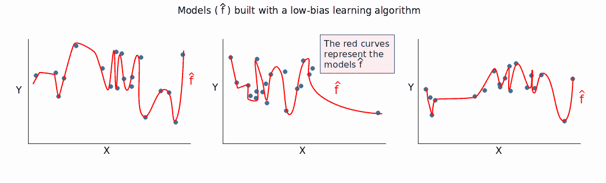

您可以看到，低偏差方法捕捉到了不同训练集之间的大多数差异(甚至是微小的差异)。\(\hat{f}\) *随着我们改变训练集，变化*很大，这表明方差很大。

一种方法的偏差越小，它对数据的拟合能力就越强。这种能力越大，方差就越高。因此，偏差越低，方差越大。

反之亦然:偏差越大，方差越小。高偏差方法建立的模型过于简单，通常不适合训练数据。当我们改变训练集时，我们从高偏差算法得到的模型\(\hat{f}\)通常彼此没有很大的不同。

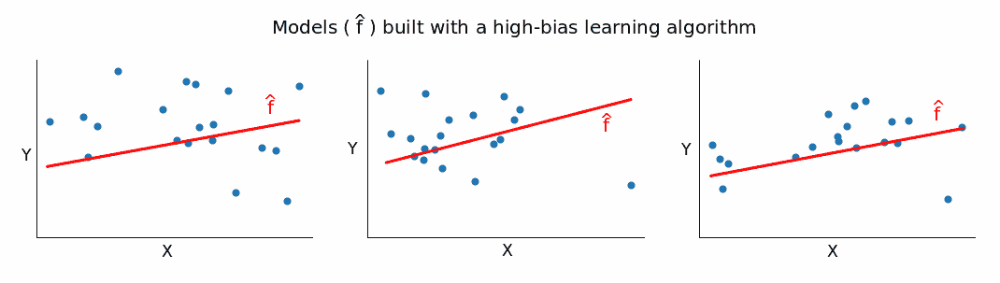

如果\(\hat{f}\)没有随着我们改变训练集而改变太多，那么方差就低，这就证明了我们的观点:偏差越大，方差越低。

从数学上来说，我们为什么想要低偏差和低方差是很清楚的。如上所述，偏差和方差只会增加模型的误差。然而，从更直观的角度来看，我们希望低偏差，以避免构建过于简单的模型。在大多数情况下，一个简单的模型在训练数据上表现很差，并且极有可能在测试数据上重复这种差的表现。

同样，我们希望低方差，以避免构建过于复杂的模型。这种模型几乎完全符合训练集中的所有数据点。然而，训练数据通常包含噪声，并且只是来自大得多的人群的样本。一个过于复杂的模型捕捉到了这种噪音。并且在*的样本外*数据上测试时，性能通常很差。那是因为模型学习*样本*训练数据太好了。它对某件事知道很多，但对其他事却知之甚少。

然而，在实践中，我们需要接受一个权衡。我们不能既有低偏差又有低方差，所以我们想把目标定在中间。

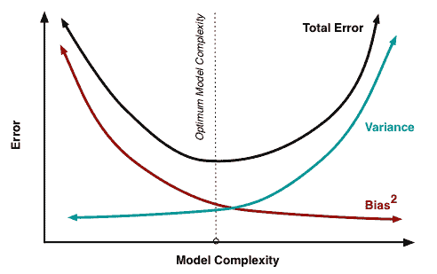

在我们生成和解释下面的学习曲线时，我们将尝试为这种权衡建立一些实用的直觉。

## 学习曲线——基本理念

假设我们有一些数据，并将其分成训练集和验证集。我们举一个例子(没错，一个！)并使用它来估计模型。然后，我们在验证集和单个训练实例上测量模型的误差。训练实例上的误差将为 0，因为完全适合单个数据点是非常容易的。然而，验证集上的误差将非常大。

这是因为该模型是围绕单个实例构建的，它几乎肯定无法对以前没有见过的数据进行准确概括。现在让我们假设不是一个训练实例，而是十个并重复误差测量。然后，我们采取五十，一百，五百，直到我们使用我们的整个训练集。当我们改变训练集时，错误分数会或多或少地变化。因此，我们需要监控两个错误分数:一个用于验证集，一个用于训练集。如果我们绘制两个错误分数随着训练集变化的演变，我们最终得到两条曲线。这些被称为*学习曲线*。简而言之，学习曲线显示了随着训练集大小的增加，误差是如何变化的。

下面的图表应该有助于你想象到目前为止所描述的过程。在“训练集”列中，您可以看到我们不断增加训练集的大小。这导致我们的模型发生了微小的变化\(\hat{f}\)。在第一行中，其中 n = 1 ( *n* 是训练实例的数量)，该模型完全符合该单个训练数据点。然而，完全相同的模型非常不适合 20 个不同数据点的验证集。因此，模型在训练集上的误差为 0，但在验证集上的误差要高得多。随着训练集大小的增加，模型不再完全适合训练集。所以训练误差变大。但是，该模型是在更多数据上训练的，因此它能够更好地适应验证集。因此，验证误差减少。提醒您，验证集在所有三种情况下保持不变。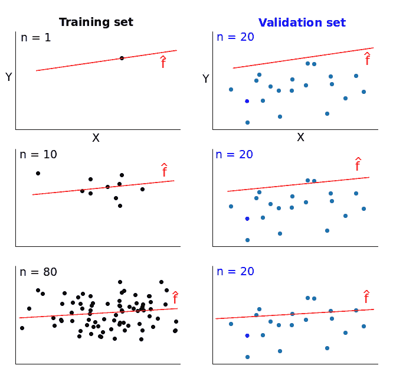如果我们为每个训练规模绘制误差分数，我们会得到两条类似的学习曲线: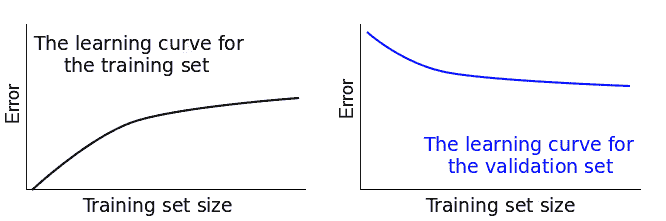学习曲线给我们一个机会来诊断监督学习模型中的偏差和方差。我们将在接下来的内容中看到这是如何实现的。

## 介绍数据

上面绘制的学习曲线是出于教学目的而理想化的。然而，在实践中，它们通常看起来非常不同。因此，让我们通过使用一些真实世界的数据将讨论转移到实际环境中。我们将尝试建立回归模型来预测发电厂每小时的电能输出。我们使用的数据来自土耳其研究人员 pnar tüfek ci 和 Heysem Kaya，可以从[这里](https://archive.ics.uci.edu/ml/datasets/Combined+Cycle+Power+Plant)下载。由于数据存储在一个`.xlsx`文件中，我们使用 pandas 的`read_excel()` [函数](https://pandas.pydata.org/pandas-docs/stable/generated/pandas.read_excel.html?highlight=read_excel#pandas.read_excel)将其读入:

```
import pandas as pd
electricity = pd.read_excel('Folds5x2_pp.xlsx')
print(electricity.info())
electricity.head(3)
```

```
<class 'pandas.core.frame.DataFrame'>
RangeIndex: 9568 entries, 0 to 9567
Data columns (total 5 columns):
AT 9568 non-null float64
V 9568 non-null float64
AP 9568 non-null float64
RH 9568 non-null float64
PE 9568 non-null float64
dtypes: float64(5)
memory usage: 373.8 KB
None
```

|  | 在(某时间或时刻);在(学习或工作地点);在(某处) | V | 美国联合通讯社(Associated Press) | 右手 | 体育课 |
| --- | --- | --- | --- | --- | --- |
| Zero | Fourteen point nine six | Forty-one point seven six | One thousand and twenty-four point zero seven | Seventy-three point one seven | Four hundred and sixty-three point two six |
| one | Twenty-five point one eight | Sixty-two point nine six | One thousand and twenty point zero four | Fifty-nine point zero eight | Four hundred and forty-four point three seven |
| Two | Five point one one | Thirty-nine point four | One thousand and twelve point one six | Ninety-two point one four | Four hundred and eighty-eight point five six |

让我们快速破译每个列名:

| 缩写 | 全名 |
| --- | --- |
| 在(某时间或时刻);在(学习或工作地点);在(某处) | 环境温度 |
| V | 排气真空 |
| 美国联合通讯社(Associated Press) | 环境压力 |
| 右手 | 相对湿度 |
| 体育课 | 电能输出 |

`PE`列是目标变量，它描述了每小时净电能输出。所有其他变量都是潜在的特性，每个变量的值实际上都是每小时的平均值(不是净值，就像`PE`)。电力由燃气轮机、蒸汽轮机和热回收蒸汽发生器产生。根据数据集的文件，真空水平对汽轮机有影响，而其他三个变量影响燃气轮机。因此，我们将在回归模型中使用所有的特征列。在这一步，我们通常会将测试集放在一边，彻底探索训练数据，移除任何异常值，测量相关性等。然而，出于教学目的，我们将假设这已经完成，并直接生成一些学习曲线。在我们开始之前，值得注意的是没有丢失值。此外，这些数字是未缩放的，但是我们将避免使用有未缩放数据问题的模型。

## 决定训练集的大小

让我们首先决定我们想要使用什么样的训练集大小来生成学习曲线。最小值为 1。最大值由训练集中的实例数给出。我们的训练集有 9568 个实例，所以最大值是 9568。然而，我们还没有抛开验证集。我们将使用 80:20 的比例，最终得到 7654 个实例(80%)的训练集和 1914 个实例(20%)的验证集。假设我们的训练集将有 7654 个实例，我们可以用来生成学习曲线的最大值是 7654。在我们的例子中，我们使用这六种尺寸:

```
train_sizes = [1, 100, 500, 2000, 5000, 7654]
```

需要注意的一件重要事情是，对于每个指定的大小，都会训练一个新的模型。如果你正在使用交叉验证，我们将在这篇文章中进行，将为每个训练规模训练 *k* 个模型(其中 *k* 由用于交叉验证的折叠数给出)。为了节省代码运行时间，最好将自己的训练规模限制在 5-10 个。

## scikit-learn 中的 learning_curve()函数

我们将使用 scikit-learn 库中的`learning_curve()` [函数](https://scikit-learn.org/stable/modules/generated/sklearn.model_selection.learning_curve.html)来生成回归模型的学习曲线。我们没有必要搁置验证集，因为`learning_curve()`会处理好的。在下面的代码单元格中，我们:

*   从`sklearn`进行所需的导入。
*   声明特性和目标。
*   使用`learning_curve()`生成绘制学习曲线所需的数据。该函数返回一个包含三个元素的元组:训练集大小，以及验证集和训练集的错误分数。在函数内部，我们使用以下参数:
    *   `estimator` —表示我们用来估计真实模型的学习算法；
    *   `X` —包含特征的数据；
    *   `y` —包含目标的数据；
    *   `train_sizes` —指定要使用的训练集大小；
    *   `cv` —确定交叉验证分割策略(我们将立即讨论这一点)；
    *   `scoring` —表示要使用的误差度量；目的是使用均方差(MSE)度量，但这不是`scoring`的可能参数；我们将使用最近的代理，负的 MSE，我们稍后将不得不翻转符号。

```
 from sklearn.linear_model import LinearRegression
from sklearn.model_selection import learning_curve
features = ['AT', 'V', 'AP', 'RH']
target = 'PE'
train_sizes, train_scores, validation_scores = learning_curve(
estimator = LinearRegression(),
X = electricity[features],
y = electricity[target], train_sizes = train_sizes, cv = 5,
scoring = 'neg_mean_squared_error')
```

我们已经知道`train_sizes`里有什么了。让我们检查另外两个变量，看看`learning_curve()`返回了什么:

```
 print('Training scores:\n\n', train_scores)
print('\n', '-' * 70) # separator to make the output easy to read
print('\nValidation scores:\n\n', validation_scores)
```

```
 Training scores:
[[ -0\. -0\. -0\. -0\. -0\. ] [-19.71230701 -18.31492642 -18.31492642 -18.31492642 -18.31492642] [-18.14420459 -19.63885072 -19.63885072 -19.63885072 -19.63885072] [-21.53603444 -20.18568787 -19.98317419 -19.98317419 -19.98317419] [-20.47708899 -19.93364211 -20.56091569 -20.4150839 -20.4150839 ] [-20.98565335 -20.63006094 -21.04384703 -20.63526811 -20.52955609]] --------------------------------------------------------------------Validation scores:
[[-619.30514723 -379.81090366 -374.4107861 370.03037109 -373.30597982]
[ -21.80224219 -23.01103419 20.81350389 -22.88459236 -23.44955492]
[ -19.96005238 -21.2771561 19.75136596 -21.4325615 -21.89067652]
[ -19.92863783 21.35440062 19.62974239 -21.38631648 -21.811031 ]
[ -19.88806264 -21.3183303 19.68228562 -21.35019525 -21.75949097]
[ -19.9046791 21.33448781 19.67831137 -21.31935146 -21.73778949]]
```

因为我们指定了六个训练集大小，所以您可能期望每种分数有六个值。取而代之的是，每一行有六行，每行有五个错误分数。这是因为`learning_curve()`运行了一个`k`折叠交叉验证，其中`k`的值由我们为`cv`参数指定的值给出。在我们这里，`cv = 5`，所以会有五个分裂。对于每个分裂，为每个指定的训练集大小训练一个估计器。上面两个数组中的每一列表示一个分割，每一行对应一个测试大小。下表列出了培训错误分数，有助于您更好地理解流程:

| 训练集大小(索引) | 拆分 1 | 拆分 2 | 拆分 3 | 拆分 4 | 拆分 5 |
| --- | --- | --- | --- | --- | --- |
| one | Zero | Zero | Zero | Zero | Zero |
| One hundred | -19.71230701 | -18.31492642 | -18.31492642 | -18.31492642 | -18.31492642 |
| Five hundred | -18.14420459 | -19.63885072 | -19.63885072 | -19.63885072 | -19.63885072 |
| Two thousand | -21.53603444 | -20.18568787 | -19.98317419 | -19.98317419 | -19.98317419 |
| Five thousand | -20.47708899 | -19.93364211 | -20.56091569 | -20.4150839 | -20.4150839 |
| Seven thousand six hundred and fifty-four | -20.98565335 | -20.63006094 | -21.04384703 | -20.63526811 | -20.52955609 |

为了绘制学习曲线，我们只需要每个训练集大小的一个错误分数，而不是 5。为此，在下一个代码单元中，我们取每行的平均值，并翻转错误分数的符号(如上所述)。

```
 train_scores_mean = -train_scores.mean(axis = 1)
validation_scores_mean = -validation_scores.mean(axis = )
print('Mean training scores\n\n', pd.Series(train_scores_mean, index = train_sizes))
print('\n', '-' * 20) # separator
print('\nMean validation scores\n\n',pd.Series(validation_scores_mean, index = train_sizes))
```

```
 Mean training scores
1 -0.000000
100 18.594403
500 19.339921
2000 20.334249
5000 20.360363
7654 20.764877
dtype: float64
--------------------
Mean validation scores
1 423.372638
100 22.392186
500 20.862362
2000 20.822026
5000 20.799673
7654 20.794924
dtype: float64 
```

现在我们有了绘制学习曲线所需的所有数据。然而，在绘制之前，我们需要停下来做一个重要的观察。你可能已经注意到在*训练*集合上的一些错误分数是相同的。对于对应于训练集大小为 1 的行，这是意料之中的，但是其他行呢？除了最后一行，我们有很多相同的值。例如，以第二行为例，从第二次分割开始，我们有相同的值。为什么会这样呢？这是因为没有对每次分割的*训练*数据进行随机化。让我们借助下图来看一个例子。当训练大小为 500 时，将选择训练集中的前 500 个实例。

对于第一次分割，这 500 个实例将从第二个块中取出。从第二次分割开始，这 500 个实例将取自第一个块。因为我们不随机化训练集，所以用于训练的 500 个实例对于第二次分割是相同的。这解释了从 500 个训练实例案例的第二次分割开始的相同值。相同的推理适用于 100 个实例的情况，类似的推理适用于其他情况。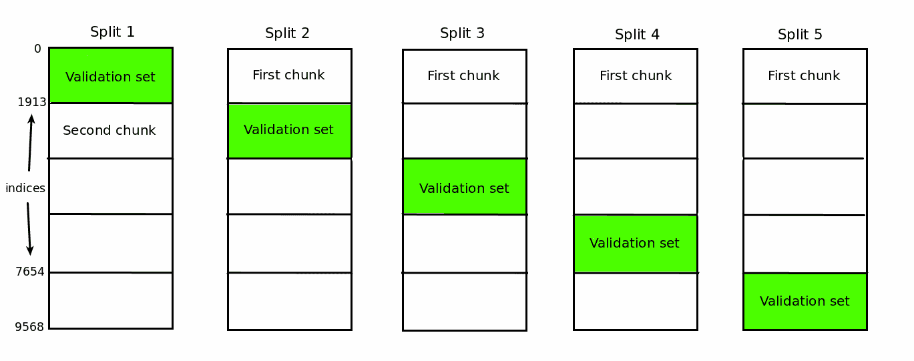为了停止这种行为，我们需要在`learning_curve()`函数中将`shuffle`参数设置为`True`。这将使每次分割的*训练*数据的指数随机化。我们没有随机化有两个原因:

*   数据被预混洗了五次(正如在[文档](https://archive.ics.uci.edu/ml/datasets/Combined+Cycle+Power+Plant)中提到的)，所以没有必要再随机化了。
*   我想让你意识到这个怪癖，以防你在实践中偶然发现它。

最后，让我们进行绘图。

## 学习曲线——高偏差和低方差

我们使用常规的 matplotlib 工作流程绘制学习曲线:

```
 import matplotlib.pyplot as plt

plt.style.use('seaborn')
plt.plot(train_sizes, train_scores_mean, label = 'Training error')
plt.plot(train_sizes, validation_scores_mean, label = 'Validation error')
plt.ylabel('MSE', fontsize = 14)
plt.xlabel('Training set size', fontsize = 14)
plt.title('Learning curves for a linear regression model', fontsize = 18, y = 1.03)
plt.legend()
plt.ylim(0,40)
```

```
(0, 40)
```

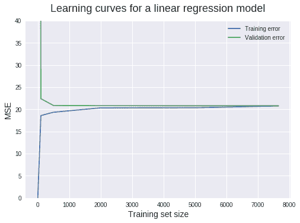

我们可以从这个图中提取很多信息。让我们继续细化。当训练集大小为 1 时，我们可以看到训练集的 MSE 为 0。这是正常的行为，因为模型可以完美地拟合单个数据点。因此，当在相同的数据点上测试时，预测是完美的。但是当在验证集(有 1914 个实例)上测试时，MSE 上升到大约 423.4。这个相对较高的值是我们将 y 轴范围限制在 0 到 40 之间的原因。这使我们能够精确读取大多数 MSE 值。如此高的值是意料之中的，因为基于单个数据点训练的模型极不可能准确地推广到它在训练中没有见过的 1914 个新实例。当训练集大小增加到 100 时，训练 MSE 急剧增加，而验证 MSE 同样减少。

线性回归模型不能完美地预测所有 100 个训练点，因此训练 MSE 大于 0。然而，该模型现在在验证集上表现得更好，因为它是用更多的数据估计的。从 500 个训练数据点开始，验证 MSE 大致保持不变。这告诉我们一些极其重要的事情:添加更多的训练数据点不会导致明显更好的模型。因此，与其浪费时间(可能还有金钱)来收集更多数据，我们需要尝试其他东西，比如转换到可以建立更复杂模型的算法。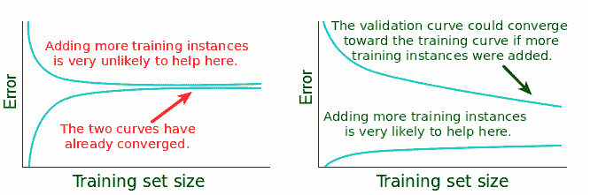

为了避免这里的误解，需要注意的是，向训练数据中添加更多的*实例*(行)并没有什么帮助。然而，添加更多的功能是另一回事，并且很可能有所帮助，因为这将增加我们当前模型的复杂性。现在让我们来诊断偏差和方差。偏倚问题的主要指标是高验证误差。在我们的例子中，验证 MSE 停滞在大约 20 的值。但是这有多好呢？我们将受益于一些领域知识(在这种情况下可能是物理学或工程学)来回答这个问题，但是让我们试一试。

从技术上来说，值 20 以 MW\(^2\(兆瓦平方)为单位(当我们计算 MSE 时，单位也得到平方[)。但是我们的目标栏中的值是以 MW 为单位的(根据](https://en.wikipedia.org/wiki/Mean_squared_error#Predictor)[文档](https://archive.ics.uci.edu/ml/datasets/Combined+Cycle+Power+Plant))。取 20 MW\(^2\的平方根)得到大约 4.5 MW。每个目标值代表每小时净*电能输出。因此，每小时我们的模型平均下降 4.5 MW。根据[这个 Quora 回答](https://www.quora.com/How-can-I-get-an-intuitive-understanding-of-what-a-Kw-Mw-Gw-of-electricity-equates-to-in-real-life-terms)，4.5 MW 相当于 4500 个手持吹风机产生的热功率。如果我们试图预测一天或更长时间的总能量输出，这将会增加。我们可以得出结论，20 MW\(^2\的均方差是相当大的。所以我们的模型有一个偏差问题。*

但是是*低*偏置问题还是*高*偏置问题呢？要找到答案，我们需要看看训练误差。如果训练误差非常低，这意味着估计模型非常好地拟合了训练数据。如果模型非常适合训练数据，这意味着它相对于那组数据具有*低*偏差。如果训练误差很高，这意味着估计模型对训练数据的拟合不够好。如果模型未能很好地拟合训练数据，这意味着它相对于该组数据具有*高*偏差。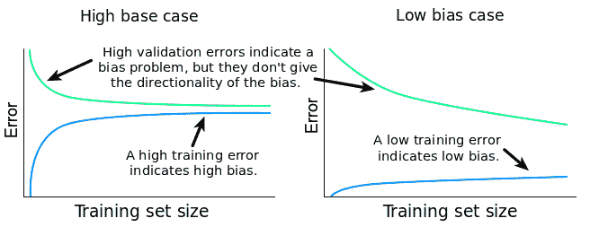

在我们的特殊情况下，训练 MSE 稳定在大约 20 MW\(^2\).的值正如我们已经确定的，这是一个很高的错误分数。因为验证 MSE 很高，训练 MSE 也很高，所以我们的模型存在高偏差问题。现在让我们继续诊断最终的方差问题。估计方差至少有两种方法:

*   通过检查验证学习曲线和训练学习曲线之间的差距。
*   通过检查训练误差:随着训练集大小的增加，其值及其演变。

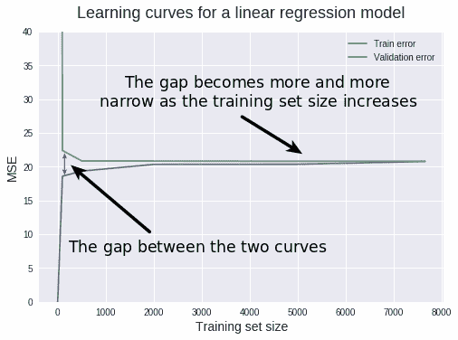

较窄的差距表明方差较低。一般来说，差距越小，方差越低。反之亦然:差距越大，方差越大。现在我们来解释一下为什么会这样。正如我们之前所讨论的，如果方差很高，那么模型就太适合训练数据了。当训练数据拟合得太好时，模型将很难对训练中未见过的数据进行归纳。当这样的模型在其训练集上被测试，然后在验证集上被测试时，训练误差将是低的，而验证误差通常将是高的。当我们改变训练集的大小时，这种模式继续，训练和验证错误之间的差异将决定两条学习曲线之间的差距。

训练与验证错误之间的关系，以及差距可以这样概括:\( gap =验证\错误-训练\错误\)所以两个错误之间的差异越大，差距就越大。差距越大，方差越大。就我们的情况而言，差距非常小，因此我们可以有把握地得出结论，方差很低。高*训练*均方误差分数也是检测低方差的一种快速方法。如果学习算法的方差较低，那么当我们改变训练集时，该算法会产生简单和相似的模型。由于模型过于简化，它们甚至不能很好地拟合训练数据(它们将*置于*数据之下)。所以我们应该期待高水平的培训 MSE。因此，高训练均方误差可用作低方差的指标。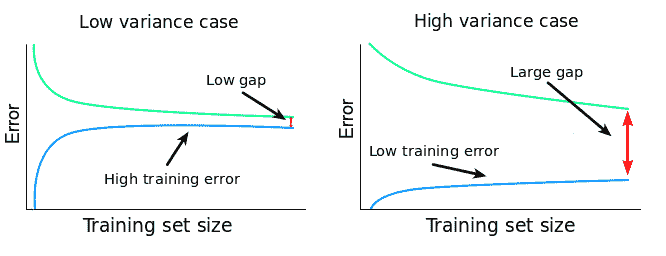

在我们的例子中，训练 MSE 稳定在 20 左右，我们已经得出结论，这是一个很高的值。因此，除了差距缩小之外，我们现在有了另一个确认，即我们有一个低方差问题。到目前为止，我们可以断定:

*   我们的学习算法受到高偏差和低方差的影响，对训练数据拟合不足。
*   在当前的学习算法下，向训练数据添加更多的实例(行)极不可能产生更好的模型。

在这一点上，一个解决方案是改为更复杂的学习算法。这将减少偏差，增加方差。一个错误是试图增加训练实例的数量。一般来说，当处理高偏差和低方差问题时，这另外两个修正也是有效的:

*   在更多的特征上训练当前的学习算法(为了避免*收集*新数据，你可以很容易地生成[多项式特征](https://scikit-learn.org/stable/modules/preprocessing.html))。这将通过增加模型的复杂性来降低偏差。
*   减少当前学习算法的[正则化](https://www.quora.com/What-is-regularization-in-machine-learning)，如果是这样的话。简而言之，正则化会阻止算法太好地拟合训练数据。如果我们减少正则化，模型将更好地拟合训练数据，因此，方差将增加，偏差将减少。

## 学习曲线——低偏差和高方差

让我们看看一个非正则化的随机森林回归子在这里的表现。我们将使用与上面相同的工作流程来生成学习曲线。这一次，我们将把所有东西都打包到一个函数中，以便以后使用。为了比较，我们还将显示上面的线性回归模型的学习曲线。

```
 ### Bundling our previous work into a function ###
def learning_curves(estimator, data, features, target, train_sizes, cv):
   train_sizes, train_scores, validation_scores = learning_curve(
    estimator, data[features], data[target], train_sizes = 
    train_sizes,
    cv = cv, scoring = 'neg_mean_squared_error')
    train_scores_mean = -train_scores.mean(axis = 1)
    validation_scores_mean = -validation_scores.mean(axis = 1)

    plt.plot(train_sizes, train_scores_mean, label = 'Training error')
    plt.plot(train_sizes, validation_scores_mean, label = 'Validation error')

    plt.ylabel('MSE', fontsize = 14)
    plt.xlabel('Training set size', fontsize = 14)
    title = 'Learning curves for a ' + str(estimator).split('(')[0] + ' model'
    plt.title(title, fontsize = 18, y = 1.03)
    plt.legend()
    plt.ylim(0,40)

### Plotting the two learning curves ###

from sklearn.ensemble import RandomForestRegressor

plt.figure(figsize = (16,5))

for model, i in [(RandomForestRegressor(), 1), (LinearRegression(),2)]:
    plt.subplot(1,2,i)
    learning_curves(model, electricity, features, target, train_sizes, 5) 
```

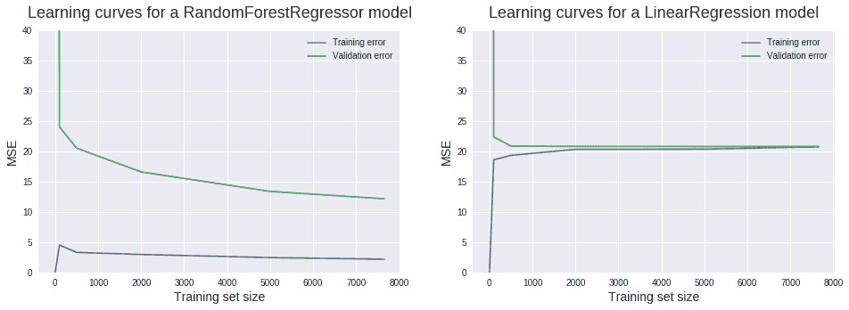

现在让我们试着应用我们刚刚学到的东西。在这一点上暂停阅读并尝试自己解释新的学习曲线是一个好主意。查看验证曲线，我们可以看到我们已经设法减少了偏差。仍然有一些明显的偏见，但没有以前那么多了。查看训练曲线，我们可以推断这次有一个*低*偏差问题。

两条学习曲线之间的新差距表明方差大幅增加。低训练 MSEs 证实了这种高方差的诊断。较大的间隙和较低的训练误差也表明存在过拟合问题。当模型在训练集上表现良好，但在测试(或验证)集上表现较差时，就会发生过度拟合。这里我们可以做的一个更重要的观察是*添加新的训练实例*很可能会产生更好的模型。验证曲线不会在使用的最大训练集大小时保持平稳。它仍然有可能减少并向训练曲线收敛，类似于我们在线性回归案例中看到的收敛。到目前为止，我们可以断定:

*   我们的学习算法(随机森林)遭受高方差和相当低的偏差，过度拟合训练数据。
*   在当前的学习算法下，添加更多的训练实例极有可能导致更好的模型。

此时，我们可以做一些事情来改进我们的模型:

*   添加更多培训实例。
*   为我们当前的学习算法增加正则化。这应该会减少方差并增加偏差。
*   减少我们目前使用的训练数据中的特征数量。该算法仍将非常适合训练数据，但由于特征数量的减少，它将构建不太复杂的模型。这应该会增加偏差并减少方差。

在我们的情况下，我们没有任何其他现成的数据。我们可以进入电厂进行一些测量，但我们将把这个留到另一篇文章中(开玩笑)。让我们试着规范我们的随机森林算法。一种方法是调整每个决策树中叶子节点的最大数量。这可以通过使用`RandomForestRegressor()`的`max_leaf_nodes`参数来完成。你不一定要理解这个正则化技术。对于我们这里的目的，你需要关注的是这种正则化对学习曲线的影响。

```
learning_curves(RandomForestRegressor(max_leaf_nodes = 350), electricity, features, target, train_sizes, 5)
```

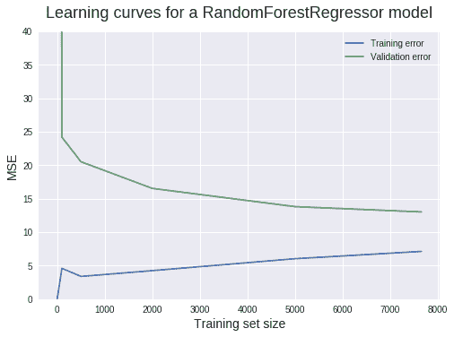
还不错！差距现在更小了，所以差异更小了。偏差似乎增加了一点，这正是我们想要的。但是我们的工作还远远没有结束！验证 MSE 仍然显示出很大的下降潜力。为实现这一目标，您可以采取以下步骤:

*   添加更多培训实例。
*   添加更多功能。
*   特征选择。
*   超参数优化。

## 理想学习曲线和不可约误差

学习曲线是一个很好的工具，可以在机器学习工作流程的每一点快速检查我们的模型。但是我们怎么知道什么时候停止呢？我们如何识别完美的学习曲线？对于我们之前的回归案例，您可能认为完美的场景是两条曲线都收敛到 MSE 为 0。这的确是一个完美的场景，但不幸的是，这是不可能的。实践中没有，理论上也没有。这是因为一种叫做*的不可约误差*。当我们建立一个模型来映射特征(X)和目标(Y)之间的关系时，我们首先假设存在这样的关系。

假设假设为真，则有一个真实的模型\(f\)完美地描述了\(X\)和\(Y\)之间的关系，如下所示:

$$
Y = f(X) +不可约\ error \tag{1}
$$

但是为什么会有误差呢？！我们刚才不是说过\(f\)完美地描述了 X 和 Y 的关系吗？！这里有一个错误，因为\(Y\)不仅仅是我们有限数量的特征\(X\)的函数。可能有许多其他特征影响\(Y\)的值。我们没有的功能。也可能是\(X\)包含测量误差的情况。所以，除了\(X\)，\(Y\)也是\(不可约\误差\)的函数。现在我们来解释为什么这个误差*是不可约的*。当我们用模型\(\hat{f}(X)\)估计\(f(X)\)时，我们引入了另一种误差，称为*可约*误差:

$ $
f(X)= \ hat { f }(X)+reducable \ error \ tag { 2 }
$ $

将\((1)\)中的\(f(X)\)替换，我们得到:

$$
Y = \hat{f}(X) +可约\ error +不可约\ error \tag{3}
$$

可减少的误差可以通过建立更好的模型来减少。看方程\((2)\)我们可以看到，如果\(可约\误差\)为 0，我们的估计模型\(\hat{f}(X)\)等于真实模型\(f(X)\)。

然而，从\((3)\)我们可以看到，即使\(可约\误差\)为 0，但\(不可约\误差\)仍然存在于方程中。从这里我们可以推断，无论我们的模型估计有多好，通常还是会有一些我们无法减少的误差。这就是为什么这个误差被认为是不可约的。这告诉我们，在实践中，我们所能看到的最好的学习曲线是那些收敛到某个不可约误差值的曲线，而不是朝着某个理想误差值的曲线(对于 MSE，理想误差分数是 0；我们将立即看到其他误差度量具有不同的理想误差值)。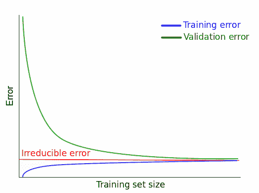

实际上，不可约误差的精确值几乎总是未知的。我们还假设不可约误差与(X)无关。这意味着我们不能用\(X\)来寻找真正的不可约误差。用更精确的数学语言表达同样的事情，没有函数\(g\)将\(X\)映射到不可约误差的真实值:

$$
不可约\错误\neq g(X)
$$

因此，根据我们现有的数据，无法知道不可约误差的真实值。在实践中，一个好的解决方法是尽可能降低错误分数，同时记住，限制是由一些不可约的错误给出的。

## 分类呢？

到目前为止，我们已经了解了回归设置中的学习曲线。对于分类任务，工作流几乎是相同的。主要的区别是我们必须选择另一个误差度量——一个适合评估分类器性能的度量。我们来看一个例子: [](https://scikit-learn.org/stable/auto_examples/model_selection/plot_learning_curve.html)

与我们目前所看到的不同，请注意，训练错误的学习曲线高于验证错误的学习曲线。这是因为所使用的分数*准确性*描述了模型有多好。精确度越高越好。另一方面，MSE 描述了一个模型有多差。MSE 越低越好。这对不可约误差也有影响。对于描述模型有多差的误差度量，不可约误差给出了一个下限:你不能比它更低。对于描述一个模型有多好的误差度量，不可约误差给出了一个上限:你不能得到比这个更高的。作为一个旁注，在更多的技术著作中，术语 [*贝叶斯错误率*](https://en.wikipedia.org/wiki/Bayes_error_rate) 通常用来指分类器的最佳可能错误分数。这个概念类似于不可约误差。

## 后续步骤

在任何监督学习算法中，学习曲线都是诊断偏差和方差的重要工具。我们已经学习了如何使用 scikit-learn 和 matplotlib 生成它们，以及如何使用它们来诊断模型中的偏差和方差。为了巩固您所学到的知识，以下是一些需要考虑的后续步骤:

*   使用不同的数据集为回归任务生成学习曲线。
*   为分类任务生成学习曲线。
*   通过从头开始对所有内容进行编码，为监督学习任务生成学习曲线(不要使用 scikit-learn 中的`learning_curve()`)。使用交叉验证是可选的。
*   将没有交叉验证获得的学习曲线与使用交叉验证获得的曲线进行比较。这两种曲线应该用于相同的学习算法。

### 准备好继续学习了吗？

永远不要想接下来我该学什么？又来了！

在我们的 [Python for Data Science 路径](/path/data-scientist/)中，您将了解到:

*   使用 **matplotlib** 和 **pandas** 进行数据清理、分析和可视化
*   假设检验、概率和**统计**
*   机器学习、**深度学习**和决策树
*   ...还有更多！

立即开始学习我们的 **60+免费任务**:

[Try Dataquest (it's free!)](https://app.dataquest.io/signup)