# 如何使用 Pandas 绘制数据帧(21 个代码示例)

> 原文：<https://www.dataquest.io/blog/plot-dataframe-pandas/>

June 8, 2022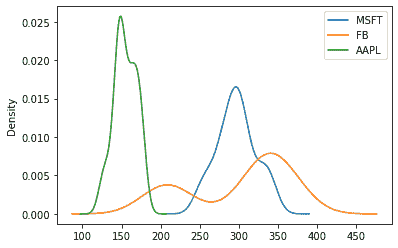

### Pandas 是一个数据分析工具，也为数据可视化提供了很好的选择。以下是如何开始在熊猫中绘图。

数据可视化是数据科学项目成功的重要一步——一个有效的图胜过千言万语。

数据可视化是捕捉趋势和分享从数据中获得的洞察力的强大方法。货架上有大量的数据可视化工具，具有许多突出的功能，但在本教程中，我们将学习用 Pandas 包绘图。

您可能已经知道，Pandas 是一个数据分析工具，但是它为数据可视化提供了一些很好的选项。在本教程的结尾，你会看到用熊猫绘图是多么简单和直接。

我们假设你知道熊猫数据框架的基本原理。如果你不熟悉熊猫图书馆，你可能想试试我们的[熊猫和熊猫基础知识](https://www.dataquest.io/course/pandas-fundamentals/)课程。

让我们开始吧。

## 熊猫`plot()`法

Pandas 附带了一些绘图功能，适用于使用 Matplotlib 库的 DataFrame 或 series 对象，这意味着 Pandas 库创建的任何绘图都是 Matplotlib 对象。

从技术上讲，Pandas `plot()`方法通过`kind`关键字参数提供了一组情节样式，以创建看起来不错的情节。`kind`参数的默认值是`line`字符串值。然而，有 11 个不同的字符串值可以分配给`kind`参数，它决定了我们将创建什么样的绘图。

`.plot`也是 Pandas DataFrame 和 series 对象的属性，提供了 Matplotlib 可用的一小部分绘图。事实上，Pandas 通过为我们自动化大部分数据可视化过程，使绘图变得简单，只需编写一行代码。

## 导入库和数据集

在本教程中，我们将研究过去几个月脸书、微软和苹果股票的周收盘价。以下代码导入可视化所需的必要库和数据集，然后在输出中显示 DataFrame 的内容。代码中还添加了`%matplotlib inline` magic 命令，以确保绘制的图形正确出现在笔记本单元格中:

```
import pandas as pd
import numpy as np
import matplotlib.pyplot as plt

dataset_url = ('https://raw.githubusercontent.com/m-mehdi/pandas_tutorials/main/weekly_stocks.csv')
df = pd.read_csv(dataset_url, parse_dates=['Date'], index_col='Date')
pd.set_option('display.max.columns', None)
print(df.head())
```

```
 MSFT          FB        AAPL
Date                                          
2021-05-24  249.679993  328.730011  124.610001
2021-05-31  250.789993  330.350006  125.889999
2021-06-07  257.890015  331.260010  127.349998
2021-06-14  259.429993  329.660004  130.460007
2021-06-21  265.019989  341.369995  133.110001
```

我们现在准备用熊猫来探索和可视化这些数据。

### 线形图

默认绘图是线形图，它在 x 轴上绘制索引，在 y 轴上绘制数据框中的其他数字列。

让我们绘制一个线图，看看微软在过去 12 个月的表现如何:

```
df.plot(y='MSFT', figsize=(9,6))
```

```
<xlabel></xlabel>
```

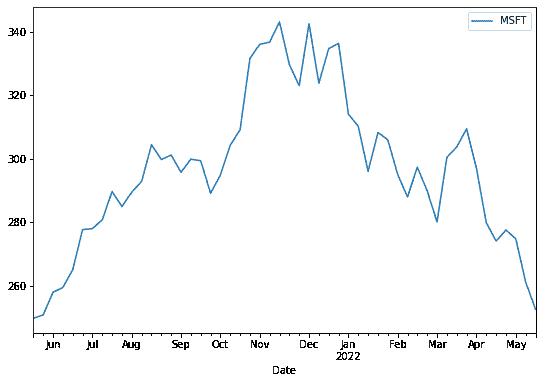

* * *

**注**

`figsize`参数接受两个参数，以英寸为单位的宽度和高度，并允许我们改变输出图形的大小。宽度和高度的默认值分别为 6.4 和 4.8。

* * *

我们可以通过提供列名列表并将其分配给 y 轴，从数据中绘制多条线。例如，让我们看看这三家公司在过去一年的表现:

```
df.plot.line(y=['FB', 'AAPL', 'MSFT'], figsize=(10,6))
```

```
<xlabel></xlabel>
```

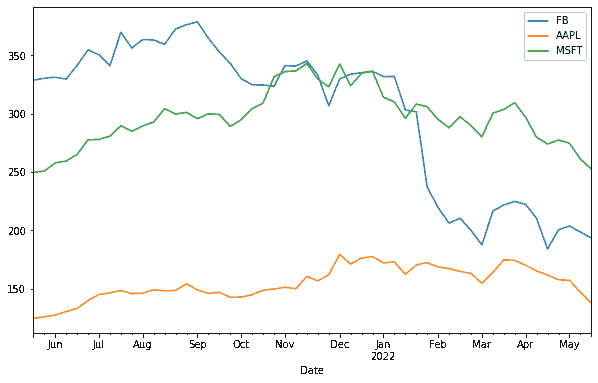

我们可以使用由`plot()`方法提供的其他参数来为一个图添加更多的细节，就像这样:

```
df.plot(y='FB', figsize=(10,6), title='Facebook Stock', ylabel='USD')
```

```
<title stock="" xlabel="Date" ylabel="USD">
```
<p>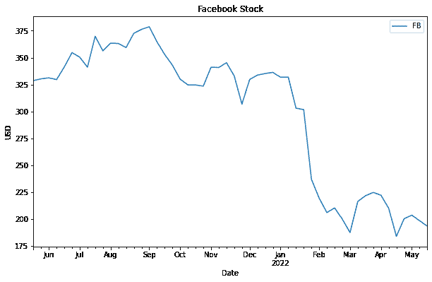</p>
<p>正如我们在图中看到的，<code>title参数为绘图添加了一个标题，<code>ylabel为绘图的 y 轴设置了一个标签。默认情况下会显示该图的图例，但是，我们可以将<code>legend参数设置为<code>false来隐藏图例。</p>
<h3>Bar Plot</h3>
<p>条形图是比较数据组之间的值和用矩形条表示分类数据的基本可视化工具。该图可能包括特定类别的计数或任何定义的值，条形的长度对应于它们所代表的值。</p>
<p>在下面的示例中，我们将基于月平均股价创建一个条形图，以比较特定月份中每家公司与其他公司的平均股价。为此，首先，我们需要按月末对数据进行重新采样，然后使用<code>mean()方法计算每个月的平均股价。我们还选择了最近三个月的数据，如下所示:</p>
<pre><code class="language-python">df_3Months = df.resample(rule='M').mean()[-3:]
print(df_3Months)</pre>
<pre><code>                  MSFT          FB        AAPL
Date                                          
2022-03-31  298.400002  212.692505  166.934998
2022-04-30  282.087494  204.272499  163.704994
2022-05-31  262.803335  198.643331  147.326665</pre>
<p>现在，我们准备好通过将<code>bar字符串值赋给<code>kind参数来创建一个基于聚合数据的条形图:</p>
<pre><code class="language-python">df_3Months.plot(kind='bar', figsize=(10,6), ylabel='Price')</pre>
<pre><code><xlabel ylabel="Price"/></pre>
<p>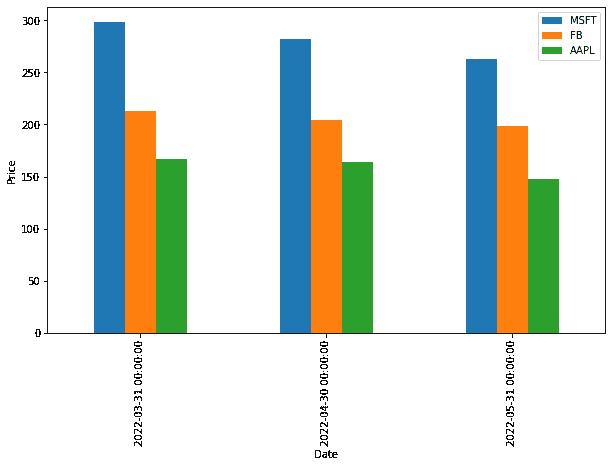</p>
<p>我们可以通过将<code>barh字符串值赋给<code>kind参数来创建水平条形图。让我们开始吧:</p>
<pre><code class="language-python">df_3Months.plot(kind='barh', figsize=(9,6))</pre>
<pre><code><ylabel/></pre>
<p>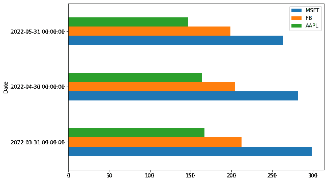</p>
<p>我们还可以在堆叠的垂直或水平条形图上绘制数据，这些条形图代表不同的组。结果栏的高度显示了各组的综合结果。要创建堆叠条形图，我们需要将<code>True赋给<code>stacked参数，如下所示:</p>
<pre><code class="language-python">df_3Months.plot(kind='bar', stacked=True, figsize=(9,6))</pre>
<pre><code><xlabel/></pre>
<p>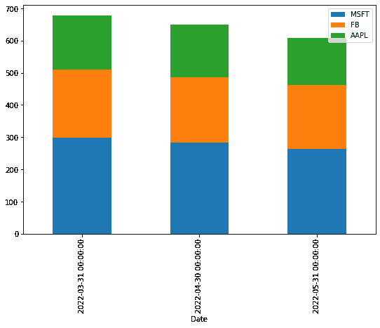</p>
<h3>柱状图</h3>
<p>直方图是一种条形图，表示数字数据的分布，其中 x 轴表示条柱范围，而 y 轴表示特定间隔内的数据频率。</p>
<pre><code class="language-python">df[['MSFT', 'FB']].plot(kind='hist', bins=25, alpha=0.6, figsize=(9,6))</pre>
<pre><code><ylabel/></pre>
<p>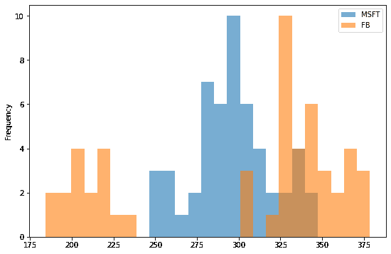</p>
<p>在上面的例子中，<code>bins参数指定 bin 间隔的数量，而<code>alpha参数指定透明度。</p>
<p>直方图也可以堆叠。让我们试一试:</p>
<pre><code class="language-python">df[['MSFT', 'FB']].plot(kind='hist', bins=25, alpha=0.6, stacked=True, figsize=(9,6))</pre>
<pre><code><ylabel/></pre>
<p>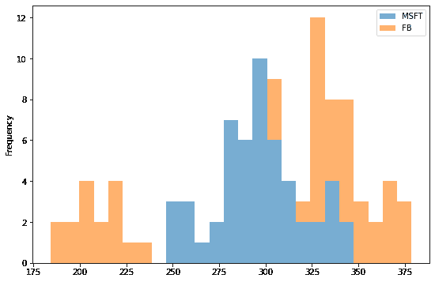</p>
<h3>箱形图</h3>
<p>箱线图由三个四分位数和两个须条组成，它们以一组指标概括数据:最小值、第一个四分位数、中值、第三个四分位数和最大值。箱线图传达了有用的信息，如每个数据组的四分位距(IQR)、中位数和异常值。让我们看看它是如何工作的:</p>
<pre><code class="language-python">df.plot(kind='box', figsize=(9,6))</pre>
<pre><code></pre>
<p>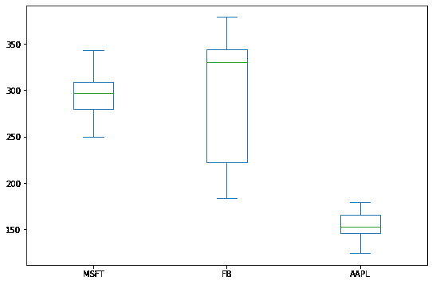</p>
<p>我们可以通过将<code>False赋给<code>vert参数来创建水平盒图，就像水平条形图一样。像这样:</p>
<pre><code class="language-python">df.plot(kind='box', vert=False, figsize=(9,6))</pre>
<pre><code></pre>
<p>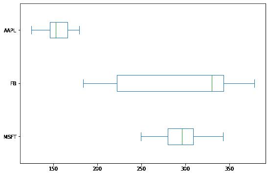</p>
<h3>面积图</h3>
<p>面积图是折线图的扩展，它用颜色填充折线图和 x 轴之间的区域。如果在同一个绘图中显示多个面积图，不同的颜色会区分不同的面积图。让我们试一试:</p>
<pre><code class="language-python">df.plot(kind='area', figsize=(9,6))</pre>
<pre><code><xlabel/></pre>
<p>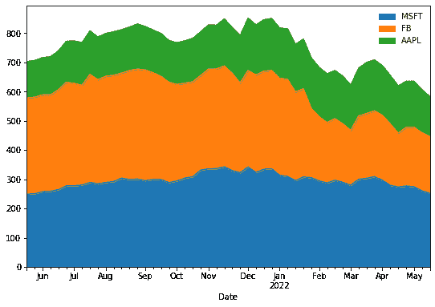</p>
<p>默认情况下，Pandas <code>plot()方法创建堆叠面积图。通过将<code>False分配给<code>stacked参数来拆分面积图是一个常见的任务:</p>
<pre><code class="language-python">df.plot(kind='area', stacked=False, figsize=(9,6))</pre>
<pre><code><xlabel/></pre>
<p>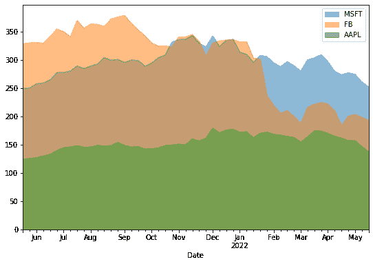</p>
<h3>饼图</h3>
<p>如果我们对比率感兴趣，饼图是一列中数字数据的很好的比例表示。以下示例显示了苹果公司过去三个月的平均股价分布:</p>
<pre><code class="language-python">df_3Months.index=['March', 'April', 'May']
df_3Months.plot(kind='pie', y='AAPL', legend=False, autopct='%.f')</pre>
<pre><code><ylabel/></pre>
<p>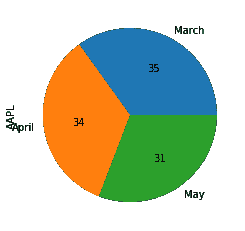</p>
<p>默认情况下，图例将显示在饼图上，因此我们将关键字<code>legend指定为<code>False来隐藏图例。</p>
<p>上面代码中的新关键字参数是<code>autopct，它显示了饼图切片上的百分比值。</p>
<p>如果我们想将多个饼图中所有列的数据表示为子图，我们可以将<code>True赋给<code>subplots参数，如下所示:</p>
<pre><code class="language-python">df_3Months.plot(kind='pie', legend=False, autopct='%.f', subplots=True, figsize=(14,8))</pre>
<pre><code>array([<ylabel>, <ylabel>,
       <ylabel>], dtype=object)</ylabel></ylabel></ylabel></pre>
<p></p>
<h3>散点图</h3>
<p>散点图在 x 轴和 y 轴上绘制数据点，以显示两个变量之间的相关性。像这样:</p>
<pre><code class="language-python">df.plot(kind='scatter', x='MSFT', y='AAPL', figsize=(9,6), color='Green')</pre>
<pre><code><xlabel ylabel="AAPL"/></pre>
<p>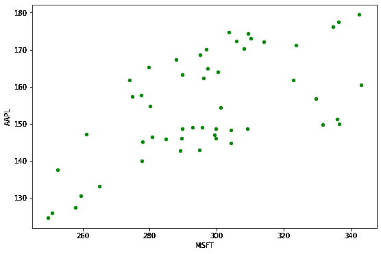</p>
<p>正如我们在上面的图中看到的，散点图显示了微软和苹果股价之间的关系。</p>
<h3>赫克宾图</h3>
<p>当数据非常密集时，六边形柱图(也称为六边形柱图)可以替代散点图。换句话说，当数据点的数量非常巨大，并且每个数据点无法单独绘制时，最好使用这种以蜂巢形式表示数据的绘图。此外，每个六边形的颜色定义了该范围内数据点的密度。</p>
<pre><code class="language-python">df.plot(kind='hexbin', x='MSFT', y='AAPL', gridsize=10, figsize=(10,6))</pre>
<pre><code><xlabel ylabel="AAPL"/></pre>
<p>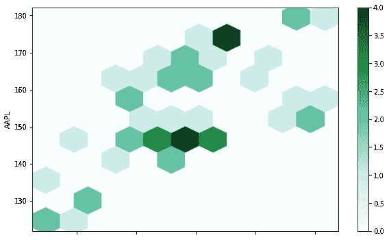</p>
<p><code>gridsize参数指定 x 方向上六边形的数量。更大的网格尺寸意味着更多和更小的箱。<code>gridsize参数的默认值是 100。</p>
<h3>KDE Plot</h3>
<p>本教程中我们要讨论的最后一个图是核密度估计，也称为 KDE，它可视化了连续的非参数数据变量的概率密度。该图使用高斯核在内部估计概率密度函数(PDF)。让我们试一试:</p>
<pre><code class="language-python">df.plot(kind='kde')</pre>
<pre><code><ylabel/></pre>
<p>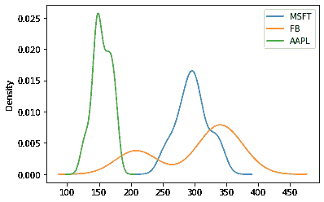</p>
<p>我们还可以在 KDE 图中指定影响图平滑度的带宽，如下所示:</p>
<pre><code class="language-python">df.plot(kind='kde', bw_method=0.1)</pre>
<pre><code><ylabel/></pre>
<p>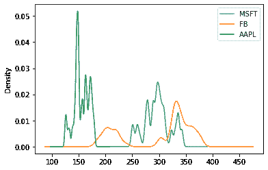</p>
<pre><code class="language-python">df.plot(kind='kde', bw_method=1)</pre>
<pre><code><ylabel/></pre>
<p>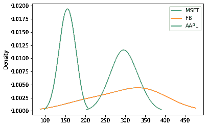</p>
<p>正如我们所见，选择小带宽会导致平滑不足，这意味着密度图显示为单个峰值的组合。相反，巨大的带宽会导致过度平滑，这意味着密度图显示为单峰分布。</p>
<h2>摘要</h2>
<p>在本教程中，我们讨论了 Pandas 库作为一个简单易学的数据可视化工具的功能。然后，我们用很少几行代码实现了一些例子，涵盖了《熊猫》中提供的所有情节。</p>
<p>请随时在 LinkedIn 和 Twitter 上与我联系。</p>

</body>
</html></title>
```