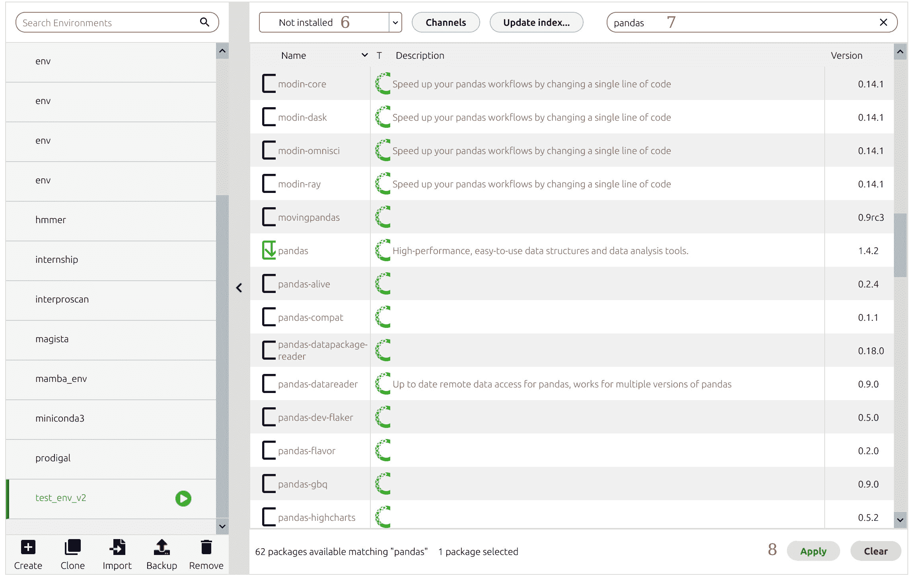
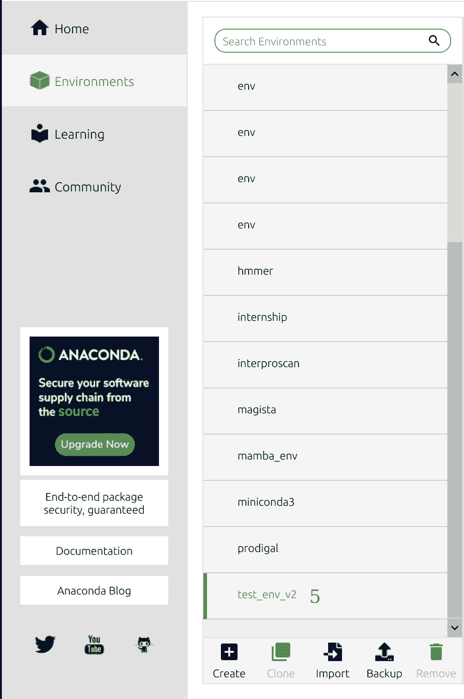
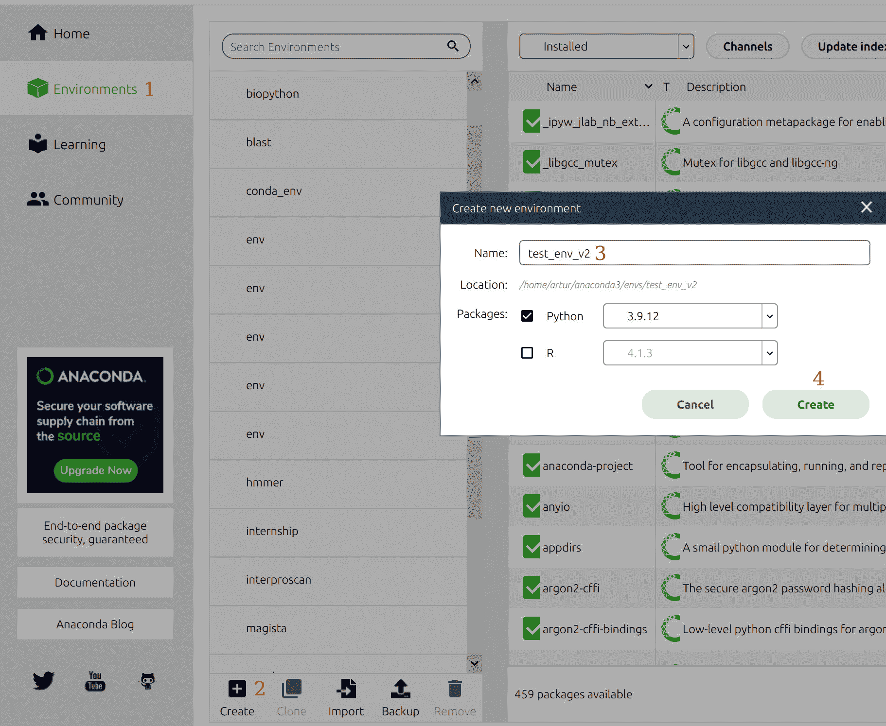
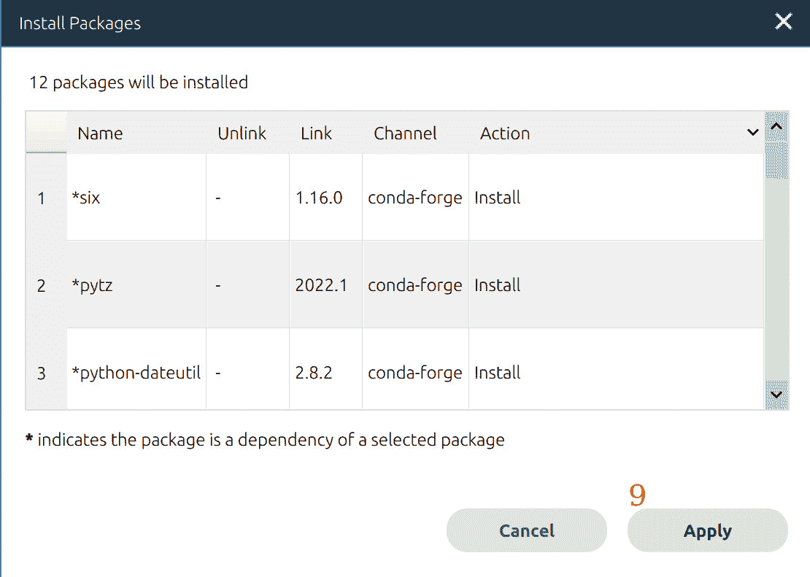

# Python 与 Anaconda——有什么区别？

> 原文：<https://www.dataquest.io/blog/python-vs-anaconda/>

July 7, 2022

## Python 和 Anaconda 的主要区别是什么？以下是你需要知道的。

Python 是一种多用途编程语言，从机器学习到网页设计，无所不包。它使用[`pip`](https://pip.pypa.io/en/stable/)(“Pip Installs Packages”或“Pip Installs Python”的递归首字母缩写)作为其包管理器来自动安装、更新和删除包。

Anaconda 是 Python、R 和其他语言的发行版(捆绑包)，以及为数据科学量身定制的工具(即 Jupyter Notebook 和 RStudio)。它还提供了另一个名为`conda`的包管理器。

因此，当您安装 Python 时，您会得到一种编程语言和`pip`(在 Python 3.4+和 Python 2.7.9+中可用)，这使用户能够安装在 [Python 包索引](https://pypi.org/)(或 PyPi)上可用的附加包。

相比之下，使用 [Anaconda](https://www.anaconda.com/) 可以获得 Python、R、250+预装包、数据科学工具和图形用户界面 Anaconda Navigator。

因此，Python 和 Anaconda 的主要区别在于，前者是一种编程语言，后者是安装和管理 Python 和其他编程语言(如 R)的软件。

在本文中，我们将讨论如何使用 Anaconda 来管理和安装软件包，以及何时使用`pip`或`conda`。此外，我们将讨论`conda`品种(即`miniconda`和`mamba`)之间的差异。

### 包和环境经理

*请注意，我使用 Linux 作为我的主要系统，因为它非常方便编程项目(和 macOS 一起)，所以在 Windows 上，以下命令可能会有所不同。我建议安装 Anaconda 并使用 Anaconda 命令提示符在 Windows 上运行命令。*

在数据科学中，通常在编程中，我们使用[虚拟环境](https://www.dataquest.io/blog/a-complete-guide-to-python-virtual-environments/)来隔离不同项目中使用的包依赖关系，以便它们不会相互冲突。例如，您可能有两个项目:一个使用 pandas 0.25，另一个使用 pandas 1.5。您不能在系统范围内安装这两个版本，但是您可以为每个项目创建独立的环境，激活它们，并开始编码。

*但是，请注意**可以在系统范围内安装多个版本的 Python**和 [`pyenv`](https://github.com/pyenv/pyenv) ，并使用其插件 [pyenv-virtualenv](https://github.com/pyenv/pyenv-virtualenv) 来管理 Unix 上的虚拟环境。*

Python 和 Anaconda 都为虚拟环境创建和包管理提供了解决方案。

#### 计算机编程语言

Python 整合了一个内置模块`venv`(来自“虚拟环境”)，可以创建 Python 版本和附属包的孤立集合。

1.  运行`python3 -m venv /path/to/dir`创建一个环境。例如，命令`python3 -m venv ./venv_dir`将在当前工作目录下的目录`venv_dir`中创建一个虚拟环境。
2.  通过运行`source venv_dir/bin/activate`将其激活。
3.  您将看到括号中的环境名称出现在您的用户名之前。
4.  通过运行`pip list`列出该环境中安装的软件包。目前没有那么多，因为这是一个新鲜的环境。
5.  使用`deactivate`命令将其禁用。

```
python3 -m venv ./venv_dir
source venv_dir/bin/activate
pip list

Package       Version
------------- -------
pip           20.0.2 
pkg-resources 0.0.0  
setuptools    44.0.0 
```

现在，让我们在这个环境中安装几个包。我们可以用`pip`来做到这一点，但首先，我们必须再次激活环境。接下来，运行命令`pip install pandas==1.2.5 seaborn`。这将安装自[2021 年 6 月](https://pandas.pydata.org/docs/whatsnew/v1.2.5.html)起的`pandas`版本和`seaborn`的[最新可用版本](https://seaborn.pydata.org/whatsnew.html)(自 2021 年 8 月起为 0.11.2)。

*注意`pip`收集并安装这些包的依赖项，比如`numpy`(`pandas`需要的)和`matplotlib`(`seaborn`需要的)。*

```
pip install pandas==1.2.5 seaborn
```

#### 蟒蛇

Anaconda 提供了自己的开源包管理器`conda`。它与`pip`非常相似，尽管它并不总是拥有最新的软件包，并且比`pip`慢一些。然而，`conda`允许我们在 Python 生态系统之外安装软件包**。`conda`提供了不同的安装包的渠道。`pip`有一个中央公共存储库 [PyPi](https://pypi.org/) ，但是也可以创建和托管[您自己的存储库](https://packaging.python.org/en/latest/guides/hosting-your-own-index/)。**

要使用 Anaconda 创建虚拟环境，我们可以使用 GUI Anaconda Navigator 或命令行。让我们从 Anaconda Navigator 开始。

1.  首先，打开 Anaconda Navigator 并单击左侧窗格中的“Environments ”( 1)。然后，点击底部的`Create`(2)，写下你的环境名称(3)，选择 Python(或 R)版本，点击绿色按钮“创建”(4):



2.  现在，单击环境将其激活(5):



3.  我们已经在环境中安装了一些软件包，但要安装更多，请在顶部的下拉菜单中选择“未安装”(6)，并使用搜索栏搜索软件包(7)。我们现在必须找到所需的软件包，选择它，单击底部的“应用”(8)，并在它要求我们确认时再次单击“应用”(9):



最后，返回到“Home”页面，选择环境，并运行所需的应用程序(例如，JupyterLab)。

虽然与命令行相比，使用 GUI 对初学者来说是友好的，但它确实很慢而且更复杂。我强烈建议学习命令行基础知识，以显著提高您的工作速度。

现在让我们用命令行创建一个虚拟环境。

1.  类型`conda create -n test_env_v2`。这将创建一个名为`test_env_v2`的环境。它会问你是否要在一个目录下创建一个环境，键入`y`，按回车键确认。注意，我正在`miniconda3`目录中创建环境。牢记在心；稍后我会解释什么是`miniconda`。
2.  要激活环境，运行`conda activate test_env_v2`。注意，环境名出现在您的用户名和计算机名之前(在我的例子中是`[[email protected]](/cdn-cgi/l/email-protection)`)。
3.  现在通过运行`conda install pandas=1.2.5 seaborn jupyterlab`安装`pandas`、`seaborn`和`jupyterlab`。
4.  您现在可以通过运行`jupyterlab`命令来运行 JupyterLab。

```
conda create -n test_env_v2

Collecting package metadata (current_repodata.json): done
Solving environment: done

## Package Plan ##

  environment location: /home/artur/miniconda3/envs/test_env_v2

Proceed ([y]/n)? y

Preparing transaction: done
Verifying transaction: done
Executing transaction: done
#
# To activate this environment, use
#
#     $ conda activate test_env_v2
#
# To deactivate an active environment, use
#
#     $ conda deactivate

conda activate test_env_v2

(test_env_v2) [[email protected]](/cdn-cgi/l/email-protection):~$

(test_env_v2) [[email protected]](/cdn-cgi/l/email-protection):~$ conda install pandas=1.2.5 seaborn jupyterlab

(test_env_v2) [[email protected]](/cdn-cgi/l/email-protection):~$ jupyterlab
```

注意，用`conda`安装比用`pip`安装花费的时间长，但是语法有点类似，而且更简单。

`conda`的一个显著优点是它提供了多个通道来安装不同用途的包。默认使用的主包通道由 Anaconda Inc .管理，可能包含过时的包。另一方面，频道`conda-forge` ( [他们的网站](https://conda-forge.org/))是由社区维护的，通常提供大量最新的软件包。

运行`conda config --add channel conda-forge`添加该频道。现在，无论何时你想从`conda-forge`安装包，只需在`conda install`上添加`-c conda-forge`选项——例如，`conda install -c conda-forge pandas seaborn`从`conda-forge`通道安装`pandas`和`seaborn`。

```
(test_env_v2) [[email protected]](/cdn-cgi/l/email-protection):~$ conda config --add channel conda-forge

(test_env_v2) [[email protected]](/cdn-cgi/l/email-protection):~$ conda install -c conda-forge pandas seaborn
```

当然，还有许多其他渠道是为了不同的目的而创建的。例如，我是一名生物信息学家，为我的工作安装了许多只在 [`bioconda`](https://bioconda.github.io/) 频道上可用的工具。另一个例子是机器学习框架 [PyTorch](https://pytorch.org/) 提供的`pytorch`通道。

## 何时使用 Python 或 Anaconda？

但是我们什么时候用`pip`或者`conda`？看情况。

PyPi 包含 350，000 多个专门为 Python 设计的包，而 Anaconda 在主通道和`conda-forge`中只提供了大约 20，000 个包。然而，Anaconda 包并不是特定于 Python 的！也就是说，也可能有同时使用 Python、R 和 Perl 的 R 包甚至整个软件发行版。

此外，Anaconda 主要包含用于数据科学的包，而 PyPi 可以安装用于任何用例(即联网或网站建设)的包。此外，Anaconda 有一个初学者友好的 GUI。

因此，此时您可能已经决定了何时使用其中一个。如果您是数据科学的初学者，请使用 Anaconda 如果您对命令行更有经验，并且找不到您项目的包(这可能在数据科学领域之外)，那么使用 Python 的`pip`和 PyPi。

现在我们来讨论 Anaconda 和 Miniconda 的区别。

## 腰果 vs .迷你穹顶

Miniconda 是另一个 Python 发行版，但是与 Anaconda 不同，它只包含几个预安装的包(而不是 Anaconda 中的 250 多个)。当然也融入了包管理器`conda`。

换句话说，Miniconda 是 Anaconda 的轻量级版本。如果您想使用命令行自己安装所有必需的软件包，并且不想为您不使用的软件包浪费磁盘空间，那么您应该使用它。您可以按照您的平台的说明[在这里](https://conda.io/projects/conda/en/latest/user-guide/install/index.html)安装它。

但是，如果您对命令行不太熟悉，但想马上开始编码，那么可以选择 Anaconda 及其图形用户界面 Anaconda Navigator。

### 曼巴

还记得我跟你说过`conda`包管理器比`pip`慢一点吗？好吧，我们有更好的选择来加快速度。

Mamba 是用 C++重写的 Miniconda，所以速度更快，使用的计算资源更少。它使用完全相同的语法:您只需在命令中将`conda`改为`mamba`。

要安装 Mamba，请运行`conda install -c conda-forge mamba`。

我确定在我的机器上，有了已经建立的环境和大量缓存的包(以及添加的频道)，`conda`实际上稍微快了一点！然而，我总是在我的 Amazon EC2 实例(一个由 Amazon Web Services[提供的微型服务器](https://aws.amazon.com/ec2/))上使用`mamba`，只有 1gb 的 RAM，因为`conda`进程因为内存耗尽而被终止。此外，`mamba`在新机器上的运行速度比`conda`快得多。最后，由您来为您的项目选择包管理器。

## 结论

在本文中，我讨论了 Python、Anaconda、Miniconda 和 Mamba 之间的区别。我们总结一下:

1.  如果您只想将 Python 包用于数据科学和其他领域，请使用 Python 的`pip`包管理器。
2.  如果您是数据科学的初学者，并且希望立即开始创建优秀的项目，那么可以使用 Anaconda 和 GUI Anaconda Navigator。
3.  如果你对命令行有更多的了解，又不想浪费存储空间，就用`miniconda`。
4.  如果你想加快速度或者在慢机器上运行`miniconda`，使用`mamba`。

现在您知道了如何选择 Python 项目所需的工具。编码快乐！

如果您有任何问题或疑问，请通过 [LinkedIn](https://www.linkedin.com/in/artur-sannikov-1b245a111/) 和 [GitHub](https://github.com/artur-sannikov/) 联系我。