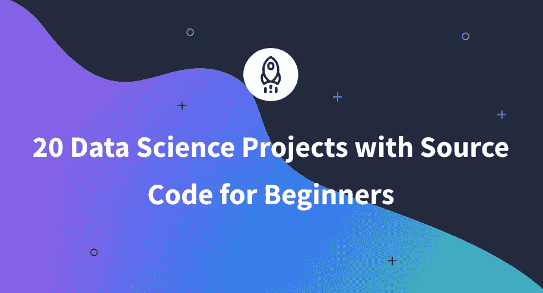

# 面向初学者的 20 个数据科学项目及其源代码

> 原文：<https://www.dataquest.io/blog/20-data-science-projects-with-source-code-for-beginners/>

August 29, 2022

对数据科学家的需求非常高。雇主非常需要数据科学家，招聘人员很难填补空缺。尽管担心经济衰退迫在眉睫，但似乎“[数据科学家仍然可以说出他们的价格](https://www.wsj.com/articles/tech-workers-long-got-what-they-wanted-thats-over-11657877406)

你有没有想过从事数据科学家的职业？现在是做出改变的最佳时机。为了获得一份有回报的数据科学工作，你需要一个数据科学项目组合，向招聘人员展示你的技能。

在本文中，我们将分享 20 个初学者必备的项目，以及它们的源代码。这些涵盖了数据科学家在[数据科学工作流程](https://www.datascience-pm.com/data-science-workflow/#:~:text=A%20data%20science%20workflow%20defines,do%20a%20data%20science%20project.))的每个阶段所需的技能范围。完成这些项目将有助于你在求职中脱颖而出。

下面是我们将要讨论的数据科学工作流程的各个阶段:

*   数据收集
*   特征提取和探索性数据分析
*   模型选择和验证
*   模型部署、持续监控和改进

### 数据收集

数据收集是整个数据分析过程中最重要的阶段之一；如果处理不当，可能会导致您的数据科学项目失败。正如您所猜测的，收集数据的过程并不总是像您希望的那样简单。以下是一些建议的数据科学项目，可帮助您发展数据收集技能:

### 1.数据收集和注释

数据科学家有多种方法来获取数据，但有时，您可能需要收集自己的数据。

想象一下，你要在雅典市中心开始做葡萄酒生意，你需要知道你需要库存哪些葡萄酒。你可能要看看人口统计学如何影响你所在地区的葡萄酒选择。例如，你可以设计并发送一份在线调查，用 Google Forms 和 Qualtrics 等工具收集你的数据。你可以阅读[如何通过开展一项伟大的调查来收集自己的数据](https://www.dataquest.io/blog/how-to-conduct-a-survey-and-collect-data-for-a-data-science-project/)来学习如何有效地进行调查并避免常见错误。

在有监督的机器学习中，需要对数据集进行标注，以便机器能够理解。有时候，这些注释在数据收集阶段是不可用的。以一位野生动物摄影师的鸟类拼贴画为例。如果你对一个鸟类物种鉴定项目感兴趣，你必须首先得到鸟类图片的注释。自己标注数据可能又慢又费力。像亚马逊 Mechanical Turk 和 Lionbridge AI 这样的众包平台有助于填补空白。

让您的想象力与您的数据科学项目想法一起驰骋。以下是一些帮助您开始数据收集和注释的链接:

*   [您可以在 21 个地方为您的数据科学项目找到免费数据集](https://www.dataquest.io/blog/free-datasets-for-projects/)
*   [机器学习项目排名前五的数据收集公司](https://becominghuman.ai/top-5-data-collection-companies-for-machine-learning-projects-dae5790581ca)
*   [使用谷歌表单收集数据](https://www.youtube.com/watch?v=RLd9-naDI3A)
*   [作为亚马逊土耳其机械公司的请求者开始](https://monkeylearn.com/blog/mechanical-turk-101-use-mturk-tagging-training-data/)

### 2.抓取单个网页

你对预测你所在城市的天气感兴趣。你知道你所在城市的天气数据可以在[国家气象局](https://www.weather.gov/)网站上获得，但是它没有可下载的格式。

在这个关于数据科学的迷你项目中，您将学习如何使用 requests 和 BeautifulSoup 库抓取单个网页。您将学习如何进行 GET 请求调用并解析对 BeautifulSoup 的响应。您将掌握如何使用 Google Chrome 开发工具探索 HTML 页面的结构和查找标签。

这还不是全部。你将在国家气象局网站上抓取一个网页，提取带有这些标签的文本，并将数据放入熊猫数据帧中。这个数据科学迷你项目通过引入使用正则表达式从文本中提取相关信息的数据预处理来结束。

Web 抓取是一项无价的数据科学技能，我们推荐我们的 [API 和 Python 中的 Web 抓取](https://www.dataquest.io/course/apis-and-scraping/)课程来帮助您入门。

以下是关于这个迷你项目的博文链接:

*   [用 Python 实现国家气象局网站的网页抓取使用美汤](https://www.dataquest.io/blog/web-scraping-python-using-beautiful-soup/)

### 3.抓取多个网页

在之前的项目中，您学习了如何从单个网页中抓取数据。但是，您需要的数据可能会出现在多个网页上。网站是链接在一起的网页的集合。要抓取多个网页，你需要知道如何找到链接到你感兴趣的网页的标签。

在这个数据科学项目中，您将在之前的 web 抓取项目的基础上进行扩展。你将从 FBref.com 的[搜集英超联赛数据。您将从抓取排名网页开始，以获取将团队连接到包含其数据的网页的标签。您将继续使用 Python 请求和 BeautifulSoup 库。

你将掌握如何使用“for-loop”语句发出多个 GET 请求并解析它们对 BeautifulSoup 的响应。与前一个项目一样，您将把收集到的数据放在 pandas 数据帧中。最后，您将学习如何将 pandas DataFrame 对象写入逗号分隔值(CSV)文件，以便以后重用。下面是这个项目的视频教程的链接——以及包含其源代码的 Github 链接:](https://fbref.com/en/comps/9/Premier-League-Stats)

*   [用 Python 从 EPL 网页抓取足球比赛](https://www.youtube.com/watch?v=Nt7WJa2iu0s&t=1263s)
*   [源代码](https://github.com/dataquestio/project-walkthroughs/blob/master/football_matches/scraping.ipynb)

## 特征提取和探索性数据分析

真实世界的数据通常不是机器学习算法可以理解的格式。因此，需要对数据进行预处理和转换。要素提取通过创建新要素来减少数据中的要素数量。主成分分析(PCA)是最流行的特征提取算法。

探索性数据分析(EDA)旨在使用统计和可视化技术来理解特征之间的关系。用于 EDA 的一些最流行的图形技术包括箱线图、直方图、对线图、散点图、热图以及垂直和水平条形图。

这里有一些很酷的数据科学项目，可以提高你的特征提取和 EDA 技能:

### 4.主成分分析降维

处理高维数据集是数据科学家的常见做法。单个人的病历或图像就是这种高维数据的一个例子。如果行“r”小于或等于特征或列的数量“c ”: $ r \ le c $，则认为数据是高维的。想象你有一个 100 乘 100 的彩色图像。彩色图像有三个通道:红色、绿色和蓝色。该图像展平后的特征数量为 100 乘 100 乘 3。使用 PCA，可以在不损失太多信息的情况下降低该数据的维度。存储中的图像的维度和大小都减小了。当您有许多高分辨率图像并希望节省存储空间，或者希望提高训练机器学习算法的速度时，可以使用 PCA 压缩图像。

这正是我们在这个数据科学项目中要做的。您将了解 OpenCV 库如何处理图像，以及 Scikit-Learn 实现 PCA 算法以获取其主要成分。您还将看到如何从原始图像的主要成分中重建原始图像。

这里是这个项目的教程、源代码和数据的链接:

*   [使用 python 中的 PCA 进行彩色图像压缩的快速指南](https://towardsdatascience.com/dimensionality-reduction-of-a-color-photo-splitting-into-rgb-channels-using-pca-algorithm-in-python-ba01580a1118)
*   [源代码](https://github.com/iqbal-01/Machine-Learning/blob/main/Unsupervised%20Learning/PCA/PCA-image-reduction.ipynb)
*   [数据](https://github.com/iqbal-01/Machine-Learning/blob/main/Unsupervised%20Learning/PCA/rose.jpg)

### 5.EDA 和 Seaborn

上大学非常昂贵，而且你也不能保证经济上的成功。为了获得良好的投资回报，你必须谨慎选择你的专业。许多即将进入大学的学生面临着选择一个能增加他们经济成功几率的专业的挑战。

在这个数据科学项目中，您将使用 Seaborn library 对包含 2010 年至 2012 年大学毕业生工作成果的数据进行广泛的探索性数据分析(EDA)。您将通过操作熊猫数据框架和可视化结果来学习如何设计和回答问题。你将能够回答这样的问题:

*   什么大学学历平均工资最高？
*   哪些是就业率最高和最低的？
*   一个人的性别对同学科薪资有影响吗？
*   什么专业男生比例最高？女性
*   男性还是女性主导的专业最赚钱？

以下是该项目的源代码和数据的链接:

*   [根据大学专业可视化收入](https://nbviewer.org/urls/community.dataquest.io/uploads/short-url/272df2k9kQCtXLw1chWMSvzeB7e.ipynb)
*   [数据](https://github.com/fivethirtyeight/data/tree/master/college-majors)

你可以找到其他很酷的项目，比如在我们的[数据可视化基础](https://www.dataquest.io/course/exploratory-data-visualization/)课程中找到 I-94 上的交通拥挤指示器。

### 6.EDA 与 Plotly

虽然 Seaborn 允许您制作漂亮的图形情节，但当您需要高度可定制和交互式的情节时，这是不够的。Plotly-Dash 允许您构建可部署的交互式和可定制的仪表板和应用程序。应用程序创建了一个抽象层，向用户隐藏了代码的复杂性。应用程序用户与仪表板交互。这使得共享您的数据科学项目变得更加容易。

本教程是对 Plotly 库的一个温和的介绍。您将对网飞数据集执行探索性数据分析。在项目结束时，你将能够回答如下问题:

*   最喜欢的流派有哪些？
*   哪些网飞节目收视率最高？
*   一年中发布关于网飞的节目的最佳时间是什么时候？
*   看的最多的电影有哪些？

这个项目在每个国家的层面上回答了其中的一些问题。以下是包含该项目的源代码和数据的教程的链接:

*   [plot ly 数据 Viz 库介绍:网飞数据集](https://community.dataquest.io/t/introduction-to-plotly-data-viz-library-netflix-dataset/558642)
*   [数据](https://www.kaggle.com/datasets/shivamb/netflix-shows)

### 7.EDA 与 Matplotlib 的有趣方式

我们已经在前面的项目中探索了如何使用 Plotly 和 Seaborn 库。来自这些库的情节是非常商业化的。有时候，我们只是想做好玩的数据科学项目。

在这个数据科学项目中，您将学习如何使用 Matplotlib 库中的**xkcd**函数以有趣的方式执行 EDA。您将继续使用滑稽图处理网飞数据集，以调查类似以下问题:

*   电影占网飞内容的百分比是多少？电视节目？
*   各个国家的网飞含量？
*   谁是网飞最受欢迎的演员和导演？
*   网飞关注什么样的内容？
*   每个国家的顶级流派有哪些？

该项目以向您介绍 Word Cloud 结束。你将调查网飞内容的描述和标题中最常用的词。

以下是包含该项目的源代码和数据的教程的链接:

*   [使用 Matplotlib 在 Python 中实现有趣的数据可视化](https://www.dataquest.io/blog/comical-data-visualization-in-python-using-matplotlib/)
*   [数据](https://www.kaggle.com/datasets/shivamb/netflix-shows)

## 模型选择和验证

在数据科学工作流中，模型选择和验证阶段是选择评估指标以及培训和验证模型的阶段。超参数调整优化了模型的性能，评估指标量化了它们。所选择的机器学习模型是相对于评估度量表现最好的模型。

我们的[机器学习基础](https://www.dataquest.io/course/machine-learning-fundamentals/)课程将向您介绍机器学习的基础知识。您将学习如何优化机器学习模型的超参数，评估它们的性能，并选择最佳模型。

与其从一个要求你立即实现机器学习算法的项目开始，数据科学爱好者应该首先理解这些算法背后的数学。现代深度学习的先驱之一、深度学习首批书籍之一的合著者伊恩·古德费勒(Ian Goodfellow)曾在一次采访中表示，要掌握机器学习领域，理解引擎盖下发生的数学很重要。

因此，本节将从涉及从头创建机器学习算法的数据科学项目开始。在此之后，讨论转移到您必须从 Scikit-Learn、Keras 和 Tensorflow 等标准库中实现机器学习和深度学习算法的项目。

### 8.线性回归:标准方程

你已经使用线性回归算法很多年了，却没有意识到这一点。您还记得当您得到一个线性方程，比如$y = 2x + 3$和一个值$x=2$时，要求您找出$y$的值吗？当你训练一个线性回归算法时，你会得到一个类似的线性方程。当你需要找到$y$的值时，给定一些$x$的值，这就是线性回归算法进行预测。

从头开始实现线性回归算法有几种方法。在这个数据科学项目中，您将使用该算法的法线方程来实现它。在使用 NumPy 库在 Python 中实现算法之前，视频教程首先带您了解数学。使用“QR 分解”和“梯度下降”是实现该算法的更稳定的方式；然而，使用正规方程是理解其背后的数学的最简单的方法。

这里是这个项目的视频教程、源代码和数据的链接:

*   [Python 中的线性回归算法从无到有](https://www.youtube.com/watch?v=z2hpinQggNM)
*   [源代码](https://github.com/dataquestio/project-walkthroughs/blob/master/linear_regression/regression.ipynb)
*   [数据](https://github.com/dataquestio/project-walkthroughs/blob/master/linear_regression/teams.csv)

### 9.从零开始梯度下降的线性回归

梯度下降算法是一种迭代优化算法，用于寻找可微函数的局部最小值。它是用于训练线性回归和逻辑回归算法以及神经网络的重要算法。可微函数也称为“成本函数”对于线性回归算法，该成本函数是**均方误差* *。

在这个数据科学项目中，您将学习如何使用 NumPy 库和程序中生成的数据实现批量梯度下降。您将看到模型的性能如何随着每次迭代而提高，因为它是用梯度下降进行训练的。

这里是包含该项目的源代码的教程的链接:

*   [从零开始的线性回归:数学直觉和实现](https://towardsdatascience.com/implementing-linear-regression-with-gradient-descent-from-scratch-f6d088ec1219)
*   [从零开始的线性回归:可视化最佳拟合线](https://github.com/HarikrishnanNB/Linear-Regression-from-scratch/blob/master/Linear%20Regression.ipynb)

### 10.从零开始梯度下降的逻辑回归

线性回归算法在分类问题上表现不佳。因此，我们需要另一种机器学习算法来处理这样的问题——例如，逻辑回归。

在这个数据科学项目中，您将学习如何使用批量梯度下降和**对数损失* *函数实现逻辑回归算法。这个项目向你介绍凸性的概念:成本函数在每次迭代中接近全局最小值。您将使用程序中生成的合成数据来训练和测试您的算法。最后，您将比较您的算法与 Scikit-Learn 的逻辑函数实现的性能。

理解梯度下降和逻辑回归如何工作是理解标准神经网络如何工作的先决条件。标准的神经网络是使用梯度下降训练的逻辑回归模型的堆栈。

以下是包含源代码和梯度下降背后的数学原理的教程链接:

*   [从零开始的逻辑回归](https://github.com/PierreExeter/logistic-regression-from-scratch/blob/master/logistic_regression_from_scratch.ipynb)
*   [梯度下降背后的数学原理](https://community.dataquest.io/t/the-math-behind-gradient-descent/556437)

### 11.带 Scikit-Learn 的线性回归算法

您已经了解了线性回归和逻辑回归算法背后的数学原理。你已经从零开始实现了这些算法。当您从零开始实现这些算法时，您构建了一个坚实的数学和理论基础，但您不必每次在数据科学项目中工作时都从头开始。有些库或框架已经实现了这些算法并经过了严格的测试，比如 Scikit-Learn、Tensorflow 和 PyTorch。在这个项目中，您将学习如何使用 Scikit-Learn 实现线性回归算法。您将根据 2006 年至 2010 年间在爱荷华州埃姆斯市收集的埃姆斯数据集的几个分类和数值特征来预测房价。此数据集不干净。因此，您将使用数据辩论技术来清理数据并估算缺失值。您将了解如何在现有要素的基础上设计新要素，以及可应用于数值和分类要素的不同数据转换技术。最后，您将使用**均方根误差**度量，针对测试集训练、预测和测量您的预测的准确性。

学习线性回归算法是掌握机器学习的重要第一步。在我们的[机器学习线性回归](https://www.dataquest.io/course/linear-regression-for-machine-learning/)课程中，您将学习如何预处理和转换数据，选择适当的特征，以及实现线性回归算法。以下是该项目的源代码和数据的链接:

*   [预测房屋销售价格](https://github.com/dataquestio/solutions/blob/master/Mission240Solutions.ipynb)
*   [数据](https://www.openintro.org/data/index.php?data=ames)

### 12.扩展逻辑回归算法

默认情况下，逻辑回归算法是一个二元分类器。因此，它无法处理多类分类问题，除非我们以某种方式扩展它。有几种方法可以做到这一点。您将了解到扩展逻辑回归算法的一种最简单的方法，即更改它的一些默认参数。您将了解如何在逻辑回归算法的 Scikit-Learn 实现中设置“class_weight”和“multi_class”参数，使其能够处理不平衡数据和多类分类问题。

还没完。您将对数据集进行预处理以处理缺失值。您将使用两种分类特征-名词性和序数-并学习它们不同的转换技术。你将执行广泛的单变量和双变量 EDA 和特征工程。除了逻辑回归算法，您还将学习使用以下算法实现多分类的 Scikit-Learn:KNeighborsClassifier、多项式朴素贝叶斯、随机森林和 GradientBoosting。您将了解如何使用 GridSearch 交叉验证来优化这些算法超参数。

这个项目涵盖了我们到目前为止讨论过的整个数据科学工作流程阶段。它强调了一个事实，即找到数据科学问题的解决方案是一个迭代过程，涉及扩展、训练和优化几个机器学习算法。你可以改进这个项目的一个方法是创建一个基于所有其他使用多数规则训练的算法的分类器。这是机器学习中的一种集成技术——我们可以使用 [Scikit-Learn 投票分类器](https://scikit-learn.org/stable/modules/generated/sklearn.ensemble.VotingClassifier.html)函数来实现这一点。这里是该项目的源代码和数据的链接

*   [多类收入分类和处理不平衡数据](https://github.com/sundeeppothula1993/Multi-class-classification/blob/master/Multi-class%2BClassification.ipynb)
*   [数据](https://www.kaggle.com/competitions/income-test/data)

你可以在我们的[Python 中的中级机器学习](https://www.dataquest.io/course/machine-learning-intermediate/)课程中找到其他很酷的项目，比如预测股市。

### 13.集成学习分类

你在上一个项目中使用了 Randomforest 和 GradientBoosting 系综模型。但是什么是集成学习呢？这是一种机器学习技术，通过结合许多机器学习模型的预测来提高预测性能。在这个项目中，我们将使用 RandomForestClassfier 的 Scikit-Learn 实现来预测股票价格。

使用其默认设置，RandomForestClassifier 是 100 个决策树分类器模型的集合。因此，它使用多数规则基于这些决策树分类器的预测进行预测。在回归问题的情况下，它取所有预测的平均值。在这个项目中，你将学习如何预测一种金融证券的价格运动方向。尽管您将在这个项目中使用 Microsoft 股票价格，但是您可以扩展到您感兴趣的任何其他金融证券。你所需要做的就是在调用 YahooFinance API 的时候，把 MSFT 微软公司的股票代码改成你自己选择的股票代码——我们就是从这个 API 下载数据的。您将学习如何使用 Pandas 库处理时间序列数据。股票价格是连续变量，使用线性回归建模。您将学习如何通过转换目标变量将回归任务重新构建为分类任务。

有很多指标可以验证你的分类算法。本项目讨论了为数据科学项目选择指标时应该考虑的因素。此外，还将详细介绍如何创建回溯测试来验证模型性能。这个项目可以通过训练一个 GradientBoostingClassifier 并比较它与 RandomForest 分类器的性能来扩展。高级学习者可以训练长短期记忆(LSTM)模型，并将其性能与 RandomForest 和 GradientBoosting 分类器进行比较。

这里是这个项目的教程和源代码的链接:

*   [使用熊猫和 Scikit 预测股票价格-学习](https://www.dataquest.io/blog/portfolio-project-predicting-stock-prices-using-pandas-and-scikit-learn/)
*   [源代码](https://github.com/dataquestio/project-walkthroughs/blob/master/stock/StockProject.ipynb)

### 14.用 R 分类

Python 是完成数据科学项目的优秀编程语言，但它不是唯一的语言。R 编程语言在统计和科学计算中有很长的使用历史。我们在 R path 的[数据分析师可以帮助你开始使用 R 编程语言。这个项目将向你介绍如何使用 R 进行数据科学项目。你将学习如何使用 Kaggle 上的 UFC 数据训练几个机器学习算法来预测 UFC 战斗的结果。这个数据是从](https://www.dataquest.io/path/data-analyst-r/) [UFC 统计网站](http://www.ufcstats.com/statistics/events/completed)上刮来的。我们建议在数据科学工作流程的数据收集阶段开展几个 web 抓取项目。这是因为网页抓取是一项重要的数据科学技能。如果你觉得数据集有点过时，请随意访问 UFC 统计网站。

在这个项目中，你将在 R 中训练以下机器学习算法:K-最近邻、逻辑回归、决策树、随机森林和极端梯度提升。您将验证模型，并将它们的性能与专家的预测进行比较。最后，你会有几个预测模型，可以用来预测即将到来的 UFC 比赛的结果。这里是这个项目的教程、源代码和数据的链接:

*   [一个 MMA 爱好者如何通过预测建模比专家做得更好(并赚了几个钱)](https://community.dataquest.io/t/how-an-mma-fan-did-a-better-job-than-the-experts-and-made-a-few-bucks-with-predictive-modeling/552159)
*   [源代码](https://github.com/Vibe1990/UFC_Model.Prediction/blob/main/UFC%20Comparison%20Master%20File.Rmd)
*   [数据](https://www.kaggle.com/datasets/mdabbert/ultimate-ufc-dataset)

### 15.用分类算法预测客户流失

公司希望在客户真正停止与他们做生意之前，发现他们什么时候会停止与他们做生意。这将有助于公司设计促销方案来留住客户。在这个关于数据科学的项目中，您将了解公司如何使用机器学习来预测客户流失。您将使用 Kaggle 上的电信客户流失数据。

您将从预处理数据和执行 EDA 来识别模式开始。接下来，您将学习如何将数值和分类特征转换为可用于训练机器学习算法的格式。有不同的度量来评估分类算法的性能；评估分类算法的性能没有一个通用的标准。

您将了解作者为选择召回指标而提出的论点。您将使用平衡和不平衡数据集训练和比较几种机器学习算法(逻辑回归、决策树、支持向量机和 XGBoost)的性能。您将了解如何通过 GridSearch 交叉验证来调整这些模型，以优化它们的性能。这里是这个项目的教程、源代码和数据的链接:

*   [机器学习预测流失:公司如何在客户离开之前发现他们的客户离开](https://community.dataquest.io/t/machine-learning-for-churn-prediction-how-companies-find-out-their-customers-are-leaving-before-they-do/546695)
*   [源代码](https://github.com/otavio-s-s/data_science/blob/master/Machine%20Learning%20for%20Churn%20Prediction.ipynb)
*   [数据](https://www.kaggle.com/datasets/blastchar/telco-customer-churn)

### 16.集成学习的高级回归技术

我们已经看到相当多的分类问题使用了先进的集成技术。在这个项目中，我们将看到如何使用集成来提高回归模型的性能。您将使用 Kaggle 的房价数据。数据不干净，所以您将从预处理数据开始这个数据科学项目。

您将了解如何可视化和移除数据中的异常值。您将看到可视化每个要素的缺失值数量如何帮助您决定要素中缺失值百分比的适当临界值。缺失值高于截止值的特征被丢弃，并使用适当的插补技术来填充其他特征的缺失值。

您将使用条形图和直方图，执行具有离散和连续特征的广泛 EDA。然后，您将基于领域知识设计要素，并使用适当的技术转换数值和分类要素。您将为以下模型训练和优化超参数:XGBRegressor、Ridge、Lasso、支持向量回归机、LightGBM 回归机和 GradientBoostingRegressor。

最后，您将学习如何将这些回归模型堆叠成一个可用于进行预测的整体模型。在本项目结束时，您将使用最先进的回归模型，并学会使您成为一名有竞争力的数据科学家的技术。

这里是这个项目的源代码和数据的教程链接:

*   [房价预测](https://github.com/gvndkrishna/Kaggle-House-Price-Prediction/blob/main/House-Price-Prediction-Solution.ipynb)
*   [数据](https://github.com/gvndkrishna/Kaggle-House-Price-Prediction/tree/main/Data)

### 17.贝叶斯机器学习

垃圾短信是一种威胁。它们会塞满你的收件箱，分散你对重要邮件的注意力，并占用存储空间。这个数据科学项目向你介绍自然语言处理(NLP)领域。这是人工智能处理计算机如何处理和分析大量自然语言数据的方面。垃圾邮件分类器是自然语言处理最基本的应用之一。更高级的应用是在 Alexa 和 Google Assistant 的自动语音识别系统中。在这个数据科学项目中，您将学习如何处理文本数据并构建概率朴素贝叶斯垃圾邮件过滤器，该过滤器可以使用 Kaggle 上的垃圾短信收集数据集来帮助您区分垃圾邮件和非垃圾邮件。首先，您将对数据集进行预处理，并将其转换成一种格式，从这种格式中您可以创建一个单词袋模型。接下来，您将学习如何通过计算和比较概率来将邮件分类为垃圾邮件或非垃圾邮件。最后，您将在测试集上测试您的垃圾邮件过滤器，并计算其准确性。

在这个数据科学项目中，垃圾邮件过滤器是从零开始构建的，没有使用机器学习库中的包。您可以通过使用 NLKT、Spacy、TFIDFVectorizer 和 MultinomialNB 来扩展这个项目，以减少从头构建所涉及的繁重工作。

参加我们的[条件概率](https://www.dataquest.io/course/conditional-probability/)课程和概率统计模块中的其他课程，以获得完成该项目所需的基础知识。以下是该项目的源代码和数据的链接:

*   [用朴素贝叶斯构建垃圾邮件过滤器](https://github.com/dataquestio/solutions/blob/master/Mission433Solutions.ipynb)
*   [数据](https://www.kaggle.com/datasets/uciml/sms-spam-collection-dataset)

### 18.Keras 深度学习简介

到目前为止，我们主要使用表格数据集。经典的机器学习算法在表格数据上表现良好。图像和文本等非结构化数据并非如此。这就是深度学习算法闪耀的地方。在本项目中，您将学习如何使用流行的 mnist 数据集创建数字分类器。

使用 Keras API 导入数据，对图像及其标签进行预处理。您将学习如何使用密集连接的层、激活函数、损失函数、优化器和度量来构建您自己的标准神经网络体系结构。然后，您将使用经过训练的神经网络进行训练、评估和预测。

到这个项目结束时，你将有一个标准的神经网络模型，可以准确地预测数字。您可以通过优化神经网络的超参数来改进这个数据科学项目:批量大小、节点、隐藏单元、使用优化器以及使用正则化和剔除。

这里是这个项目的源代码和数据的教程链接:

*   [数字分类](https://www.kaggle.com/code/schmoyote/guide-to-mnist-digit-classification-with-keras)
*   [数据](https://keras.io/api/datasets/mnist/)

### 19.基于 Keras 和张量流的卷积神经网络

我们承认吧。我们没有无限的计算机资源来训练非常大的模型。此外，大型模型可能需要几天甚至几周的训练时间。用很少的数据训练深度学习模型，是一个数据科学家非常重要的技能。在这个项目中，您将训练一个卷积神经网络(convnet ),它可以使用少量数据以合理的准确度区分猫和狗。为了将我们所说的小数据放入上下文中，Kaggle 上的狗与猫数据集包含 25，000 张猫和狗的图像。但是只有 2000 张图片，你就可以训练一个准确率约为 80%的神经网络。

您将了解如何使用 Keras 进行数据扩充，Keras 是一种从原始数据集生成合成数据并对其进行扩充的技术。接下来，您将学习如何构建包含卷积、激活和池层的卷积神经网络架构。您将了解如何连接 convnet 架构，以完全连接以输出层结束的层。最后，您将学习如何训练这个神经网络来准确地对猫和狗进行分类。

在教程的最后，作者介绍了迁移学习的概念。研究人员用数百万数据集训练了非常深度的神经网络，并优化了模型参数。有了迁移学习，你就不用从头开始训练你的神经网络了。您可以选择一个预训练模型并添加您自己的完全连接的层，冻结预训练模型中的层，使用您的数据进行训练，然后进行预测。你会得到一个比从头开始训练更准确的模型。

以下是该项目的教程、源代码和数据的链接:

*   [猫狗分类:使用极少的数据建立强大的图像分类模型](https://blog.keras.io/building-powerful-image-classification-models-using-very-little-data.html)
*   [源代码](https://gist.github.com/fchollet/0830affa1f7f19fd47b06d4cf89ed44d)
*   [数据](https://www.kaggle.com/competitions/dogs-vs-cats/data)

## 模型部署、持续监控和改进

你已经训练了一个有效的机器学习模型，但它只对你可用。机器学习的目标是解决一个问题，模型应该可供他人使用。为了使模型对更广泛的受众可用，您必须将模型投入生产，或者将其部署为 web 应用程序或嵌入到另一个系统中。

将机器学习模型投入生产后，其性能会随着时间的推移而下降。因此，监控您部署的模型的性能，重新训练以提高其性能，并重新部署是非常重要的。将模型投入生产的一个简单方法是使用交互式网络应用程序，如 Python 的[Shiny](https://shiny.rstudio.com/py/)和 [Streamlit](https://streamlit.io/) 。使用 Shiny 和 Streamlit 构建和部署 web 应用程序并不需要丰富的 web 开发知识。这篇[文章](https://neptune.ai/blog/how-to-monitor-your-models-in-production-guide)深入讨论了如何在部署后持续监控您的机器学习模型。

### 20.在 Python 中使用 Streamlit 部署机器学习模型

在这个项目中，您将学习如何使用 Streamlit 开发一个简单的机器学习应用程序。首先，您将训练和验证一个 RandomForestClassifier。接下来，您将把模型保存为 pickle 文件，以备部署。之后，您将学习如何使用 Streamlit 将模型部署为交互式 web 应用程序，该应用程序使用您保存的模型进行预测。您将使用 Kaggle 钞票验证数据创建一个交互式银行验证器 web 应用程序，该应用程序接受四个输入并预测钞票是否真实。在本项目结束时，您将学习如何将您的机器学习模型部署为可供他人使用的交互式 web 应用程序。

以下是该项目的视频教程、源代码和数据的链接:

*   [在 Python 中使用 Streamlit 部署机器学习模型](https://www.youtube.com/watch?v=WLwjvWq0GWA)
*   [模特培训](https://github.com/krishnaik06/Dockers/blob/master/ModelTraining.ipynb)
*   [简化 it 部署](https://github.com/krishnaik06/Dockers/blob/master/app1.py)
*   [数据](https://www.kaggle.com/datasets/ritesaluja/bank-note-authentication-uci-data)

### 外卖食品

在本文中，我们讨论了 20 个很酷的数据科学项目，涵盖了数据科学家所需的技能范围。这些项目涵盖了构建端到端数据科学项目所需的基本技能。拥有一个数据科学项目组合有助于向潜在的招聘人员展示你的数据科学技能，这有助于你在求职中脱颖而出。这里有一份我们的[项目](https://www.dataquest.io/data-science-projects/)清单，当你注册 [Dataquest](https://www.dataquest.io/) 时，你可以免费完成这些项目。我们还策划了 55 个对初学者友好的 Python 项目，这些项目将在这篇[博客](https://www.dataquest.io/blog/python-projects-for-beginners/)文章中丰富你的作品集。

如果你是编程新手，还没有学会基础知识，我们推荐《Python 技能路径[机器学习入门》。你也可以在我们的](https://www.dataquest.io/path/machine-learning-intro-with-python/)[技能路径](https://www.dataquest.io/data-science-courses/skill-paths/)中探索其他课程，并报名参加那些你感兴趣的课程。如果你了解基础知识，我们建议你注册我们的 Python[数据科学家](https://www.dataquest.io/path/data-scientist/)职业道路。在本文中，我们分享了一些校友的个人项目。大多数人一开始只是数据科学爱好者。我们的实践学习方法和互动平台帮助他们开启了数据科学家的职业生涯。为什么不加入他们呢？