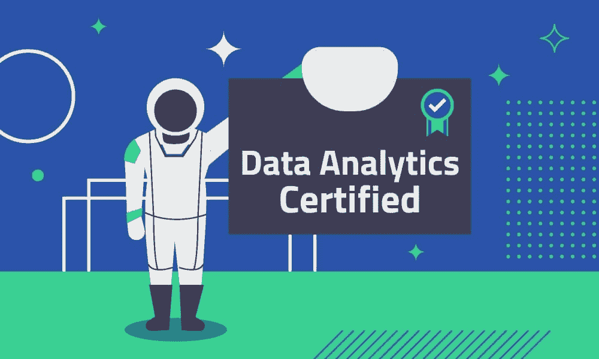
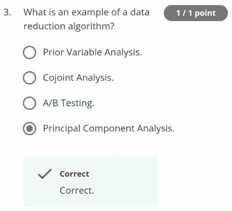

# 数据分析认证:2022 年你真的需要一个吗？

> 原文：<https://www.dataquest.io/blog/data-analytics-certification/>

September 7, 2022

我需要数据分析证书吗？如果你打算成为一名数据分析师，你无疑不止一次地问过自己这个问题。你并不孤单。

即便如此，得到一个关于数据分析师所需认证的直截了当的答案也很棘手。为什么？因为网上有几十家公司提供数据分析证书。你猜怎么着？他们都想说服你，你需要他们特定的证书项目。

见鬼，在 Dataquest，我们不仅有数据分析课程，还有授予证书的完整的[数据分析师职业道路](https://www.dataquest.io/path/data-analyst/)！

但是我们和其他公司的不同之处在于我们处理的是事实。所以，这就是:不，你不需要证书就能得到一份数据分析师的工作。

现在，这并不意味着数据分析认证项目没有价值。但这确实意味着你需要仔细考虑你的投资。这是因为证书*本身*——实际的一张纸和/或数字徽章——可能几乎没有价值。

在本文中，我们将讨论不同的数据分析证书计划以及如何评估它们。但首先，我们来解释一下*为什么*认证本身对你没有帮助。

## **为什么雇主不关心数据分析证书**

当我为 [Dataquest 的数据科学职业指南](https://www.dataquest.io/blog/data-science-career-guide/)做研究时，我花了很多时间与业内人士交谈。我特别问他们，怎样才算是一名优秀的入门级数据分析师候选人。

事实上，我有将近 200 页的高级数据科学家、招聘经理和招聘人员的采访记录。

你知道什么词在那 200 页里从未出现过吗？*认证*。

原因很简单。

### **证书并不能很好地预测工作的成功**

从雇主的角度来看，专业证书意义不大。它当然不能预测一个人在实际工作中的效率。

在数据分析领域尤其如此，因为很少有认证项目需要大量的实际数据工作。

以 MOOC 平台课程为例。它们通常由一系列视频讲座组成，中间穿插着选择题和填空题。他们最后可能会也可能不会有一个“顶点”项目。

最好的情况？简历上的专业证书意味着申请人完成了*一个*数据分析项目。这根本不够。

例如，这里有一个来自一个真实的 IBM/Coursera MOOC 的关于数据技能的样本问题:

*Probably not.*

从雇主的角度想象一下。能够回答这种问题是否证明申请人知道如何实际使用这个算法？肯定不是。

### **专业证书从哪里来很重要吗？**

有些认证项目比其他项目更严格。但这对雇主来说无关紧要。

当招聘经理看你的简历时，你有大约 7 秒钟的时间来引起他们的注意。他们不会浪费时间去判断你选择的特定数据分析证书课程是否有用。

值得一提的是，*品牌*在这里也无关紧要。简历上的 T2 大学学位会给招聘人员留下深刻印象。但是一个大学*认证*？雇主们很清楚这是非常不同的事情。通常，大学品牌的证书课程甚至不是由学校运作的！

## **做什么*****雇主希望在数据分析师的简历上看到什么？***

 *如果一个证书项目不重要，那么什么才重要呢？说到[数据科学和数据分析简历](https://www.dataquest.io/blog/how-data-science-resume-cv/)，要包含的最重要的是你能做实际工作的证明。

有相关工作经验者优先。

如果你正在寻找你在这个领域的第一份工作，你不会得到它。没关系！你可以用另一种方式证明你已经完成了工作:通过专业作品集展示你的数据分析项目。

有了 [Dataquest](https://www.dataquest.io/) ，学生们有机会在每门课程结束时创建有价值的项目组合。这样，你就有相关的工作可以向雇主炫耀。这比一周中任何一天的证书都要好！

例如，在我们的数据分析师路径中，学生将完成以下项目:

*   [为彩票瘾打造手机 app](https://app.dataquest.io/m/382)
*   [用朴素贝叶斯构建垃圾邮件过滤器](https://app.dataquest.io/m/433)
*   [分析一组危险问题并发现获胜策略](https://app.dataquest.io/m/210)
*   [使用可视化技术绘制欧元兑美元汇率的演变图](https://app.dataquest.io/m/529)
*   [用 Jupyter 笔记本分析星战迷](https://app.dataquest.io/m/201)
*   [分析 Fandango 电影评分的准确性](https://app.dataquest.io/m/288)
*   *还有其他 14 个人！*

这里可以免费报名[。您将在几分钟内编写代码。](https://www.dataquest.io/path/data-analyst/)

## **数据分析认证没用吗？**

以上并不意味着认证项目对有抱负的数据分析师毫无用处。这只是意味着你需要评估他们，要知道你选择的证书品牌可能不会帮你找到工作。

对你找工作有帮助的是你在项目过程中学到的技能。所以，确保你选择了一个内容丰富的项目，你可以从中学习！

此外，重要的是要注意，虽然证书可能不会对你的求职有所帮助，但它们也不会对你的机会造成损害。大多数雇主会直接忽略它们。但也有一些招聘人员将证书视为求职者积极学习和进步的标志。

## **如何评估认证项目**

你能从任何认证项目中获得的最重要的东西是你学到的技能。要问的重要问题包括:

*   这个项目是如何教学的？它使用视频讲座吗？互动编码课？面授课程？每个人学习的方式不同，但是[科学表明](https://www.dataquest.io/blog/video-text-learn-data-science-online/)实践越多的教学方法越好。
*   这个节目教什么？它是否足够深入地涵盖了最重要的[数据分析师技能](https://www.dataquest.io/blog/data-analyst-skills/)，比如数据可视化和 SQL？还是把时间浪费在非必需品上，比如机器学习？如果你还没有统计学知识，找一个涵盖基本统计学的程序也很重要。

### **4 选择认证计划时需要考虑的更多因素**

做出决定时需要考虑的其他重要因素包括:

*   **费用**—认证项目的费用从几百美元到数万美元不等！你的投资能有什么样的回报？

*   **时间要求** —有些认证项目，比如 Dataquest，是自助的。这意味着你可以在方便的时候开始学习，想多快就多快，想多慢就多慢。其他的是基于群体的和时间敏感的——例如，你可能只能在一年中的特定时间开始上课。或者，您可能只能在一天中的特定时间参加直播课程。

*   **先决条件** —一些项目要求特定的学位、先前的经验和/或课程。

*   **第三方评论** —任何一个还算过得去的营销团队都可以写满五星评论的登陆页面。但是，真正的学习者对数据分析认证计划有什么看法呢？像 [Switchup](https://www.switchup.org/bootcamps/dataquest) 、 [G2](https://www.g2.com/products/dataquest/reviews) 和[课程报告](https://www.coursereport.com/schools/dataquest)这样的第三方评论网站都是做一些研究的好地方。

如果有疑问，请尝试一下！许多平台提供免费试用和/或免费课程。例如，你可以通过 Dataquest 注册一个免费账户。然后，完成我们 60 多门免费课程中的任何一门，感受不同类型的内容和教学风格。如果一个平台或认证项目不给你任何机会去尝试他们的产品，那就是一个危险信号。在你确定它的教学风格适合*你*之前，花几百或几千美元在一个学习产品上是没有意义的！

*One thing you definitely need to consider before choosing a certification program: what’s your budget? Costs can vary widely.*

## 对比分析认证

有大量的数据分析师证书。下面，我们将比较几个认证计划，以便您更好地了解每个选项的优势。

### [数据请求](https://www.dataquest.io/path/data-analyst/)

*   费用:49 美元/月
*   类型:在线、自助
*   平台:基于浏览器的实用编码界面
*   涵盖的主题:Python、SQL、统计、命令行/shell、Git
*   先决条件:无
*   时间限制:无(大多数学生在不到一年的非全日制学习中达到目标)。

Switchup.org 评论平均分:4.85 分(满分 5 分)

### [谷歌的数据分析证书](https://grow.google/certificates/data-analytics/#)

*   费用:每月 39 美元(可获得经济资助)
*   类型:在线
*   平台:Coursera
*   涵盖的主题:大数据介绍、数据可视化、R 编程
*   先决条件:高中数学
*   时间限制:无(按照自己的进度学习，非全日制或全日制)。

### [总装数据分析](https://generalassemb.ly/education/data-analytics-remote-online)

*   成本:3，950 美元或更高(提供贷款选项)
*   类型:在线或面对面训练营
*   平台:面对面或在线虚拟教室
*   涵盖的主题:SQL，Excel，Tableau
*   先决条件:无
*   时间限制:必须参加特定的课程，在特定的时间参加课程。(但是，新的会话会频繁开始，所以您不必等很久就可以加入)。

Switchup.org 评论平均分:4.28 分(满分 5 分)

### [Thinkful 数据分析沉浸式](https://www.thinkful.com/bootcamp/data-analytics/)

*   成本:12，250 美元或更高(提供贷款选项)
*   类型:在线
*   平台:在线虚拟教室
*   涵盖的主题:Python、SQL、机器学习
*   先决条件:无
*   时间限制:全职四个月，或者兼职(每周 20-30 小时)六个月

Switchup.org 评论平均分:4.65 分(满分 5 分)

### [跳板数据分析追踪](https://www.springboard.com/courses/data-analytics-career-track/)

*   成本:5，500 美元或更高(提供贷款选项)
*   类型:在线
*   平台:在线虚拟教室
*   涵盖的主题:Python、SQL
*   先决条件:没有，虽然你必须申请并被接受。
*   时间限制:必须等待下一批开始，然后计划长度为六个月。

Switchup.org 评论平均分:4.67 分(满分 5 分)

### **比较外卖**

正如你所看到的，这些程序之间有很大的不同。最明显的一个是成本—这里的成本从不到 300 美元到超过 12，000 美元不等！此外，还有其他有意义的差异。

以用户评论为例。尽管 Dataquest 是最实惠的选择，但它也拥有最高的平均评审分数。

时间限制也变化很大。有 Dataquest 或 General Assembly 之类的程序可以立即启动。相反，像跳板这样的项目需要一个申请过程。用户可能还需要等待队列开始。

最重要的是，实际涵盖的主题可能因项目而异。General Assembly 的程序对 SQL、Excel 和 Tableau 的关注有限。因此，它可能专注于技术要求较低的分析师角色。

另一方面，Thinkful 程序致力于机器学习，这通常不是数据分析师角色所需要的。Dataquest 似乎是这些选项中唯一一个对概率和统计有实质性覆盖的选项。

## 基于测试的认证怎么样？

如果你认为数据分析中基于测试的证书好得不像真的，那么 99%的情况下你都是对的。

有许多认证项目，如[认证分析专家(CAP)](https://www.certifiedanalytics.org/) 或 [Cloudera 的 CCA 数据分析师](https://www.cloudera.com/about/training/certification/cca-data-analyst.html)，根本不需要任何教育。这些测试你只需要花几百美元就可以参加。一旦通过，您将立即获得认证。

这些是好的投资吗？通常不会。有一些特定的工作可能会青睐这些证书，但很少有人需要它们。也没有真正的证据表明雇主对他们感兴趣。

定量分析证实了这一理论。在撰写本文时，美国 Indeed.com 上大约有 39，000 个开放数据职位。其中，[不到 100](https://www.indeed.com/jobs?q=title%3Adata+%22CAP%22&l=United+States) 要求 CAP 认证，[不到 20](https://www.indeed.com/jobs?q=title%3Adata+%22CCA%22&l=United+States) 提到 CCA。

换句话说，大约 99.7%的数据工作*不需要这些认证。这还是保守的估计。*

事实上，只有 15%的数据工作包含“认证”这个词。其中许多是与公司特定技术体系相关的特定软件认证。这 15%中的一些还包括了“认证:无”的工作列表。

无论从哪个角度看，对通用数据分析认证的需求都很低。如果你确实需要一份工作的证书，它可能是特定于软件的东西:例如，一家做大量基于云的数据处理的公司的 AWS 证书。

## **选择证书课程(如果您决定获得一个)**

还是那句话，不需要证书。但是如果你决定买一个，那就选一个合适的。

那么，对于*你*来说，最好的数据分析认证选项是什么？这将归结为基于以下因素的个人决定:

*   你的预算是多少？
*   你有多少空闲时间学习？
*   您已经具备哪些数据分析师技能(如果有)？
*   你希望完成的时间表是什么？

既然你知道具体的证书对于找工作来说并不重要，你就可以专注于*重要的事情了:学习正确的技能，建立伟大的项目，向潜在的雇主证明这些技能。别忘了看看 Dataquest 的[数据分析课程](https://www.dataquest.io/path/data-analyst/)。注册是免费的。此外，你将有多个机会建立你的相关投资组合，展示你将学到的所有就业技能！**