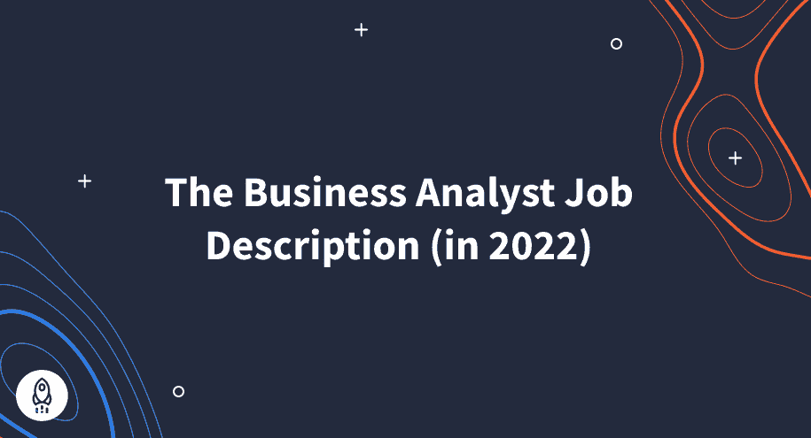

# 业务分析师岗位说明书(2022 年版)

> 原文：<https://www.dataquest.io/blog/business-analyst-job-description-2022/>

July 27, 2022

## 没有深刻的洞察力，企业就无法成功。句号。这就是商业分析的用武之地。

业务分析师帮助组织确定哪些策略可行，哪些不可行。广管局负责评估业务需求，并提出改善业务的建议。尽管这份工作的目的很明确，但要确定这份工作的日常活动、这份工作的必要技能以及这份工作需要的工具可能会很棘手。

在本文中，我们将详细介绍业务分析师的工作，以及他们需要哪些技能和工具来取得成功。

### 什么是商业分析师？

业务分析师既是调查员，又是战略家——同时还是演示者和监工。这份工作的各种要求是其诱人之处的一部分。

业务分析师生活中的每一天都可能与前一天不同，包括新的挑战，考验你的技能和知识。无论是收集数据，向高管演示，还是与利益相关者一起规划，这份工作的日常要求都不会令人厌烦。

如果新奇和挑战的承诺听起来很诱人，你不会失望的。然而，有各种各样的技能需要学习，所以你需要缩小你的兴趣和优势。毕竟，在你开始从事商业分析之前，你需要知道你将会从事什么。

### 业务分析师的主要职责

业务分析师的主要职责包括以下内容:

*   识别操作中的问题区域
*   开发有创意、有数据支持的解决方案
*   向高层决策者提出见解

业务分析师的实际日常经验因工作或部门而异。然而，所有的业务分析师都共享一组特定的技术，例如:

*   精通数据管理软件
*   能够将大型数据集提炼为可操作的策略
*   创建视觉辅助工具以改进演示

这只是高级业务分析师的工作描述。虽然你选择掌握的工具使你在业务分析的某些方面比其他方面更好，但了解从项目管理到沟通技巧的一切也很重要。

### 业务分析师预期

正如我们已经确定的，业务分析师的角色和职责是无限的，但归根结底是三件事:

*   分析数据
*   发现问题
*   推荐解决方案

要做到这一切，您需要从收集和整理大型数据集开始。数据支持的业务分析师职责是这份工作的核心。

无论您是在优化管理流程、揭露浪费行为，还是寻找增加收入的方法，您都需要首先收集所有相关数据。这可能包括以下内容:

*   发送定量调查
*   进行定性访谈
*   会见主要利益相关方
*   收集网站数据
*   收集平台行为数据

收集如此多的数据并不容易，但是精通数据库管理软件使得存储和组织这些数据变得容易得多。

然后你可以分析数据并把这些点联系起来。这是您确定操作是否正常运行的方式。如果你的数据表明在家工作的员工比在办公室工作的员工做得更多，那么你现在就有确凿的数据来支持任何在家工作的建议。这些发现的时刻需要很多艰苦的工作，但是你的发现会给整个公司带来变化。

查找数据和呈现数据是两种不同的技能。当与包括经理和高管在内的一群利益相关者交谈时，你不应该假设他们都和你一样理解相同的数据。你不能简单地扔出一个电子表格，然后说，“这是我发现的，这是我们应该做的。”

相反，你会以一种令人信服的方式展示信息，并寻求认同(或者，至少是强烈的理解)。你需要将你的数据综合成视觉辅助工具，让你的想法一目了然。这意味着你需要选择正确的图表，这样你才能以房间里每个人都能理解的方式传达你的故事。

一旦建议获得批准，业务分析师的职责就转向项目的管理和监控，这可能包括执行如下任务:

*   创建和实施项目计划
*   管理预算
*   管理跨职能团队
*   设置关键绩效指标(KPI)
*   使用数据和关键绩效指标来跟踪项目的有效性
*   向利益相关者报告
*   解决意外问题

### 贸易工具

[Dataquest 的商业分析师职业道路](https://www.dataquest.io/path/business-analyst/)教你如何管理数据库。此外，您将精通流行的业务分析应用程序，并学习如何使用 SQL 和 Python 等编码语言操作数据。你在整个课程中学到的技能是雇主非常想要的。

典型的业务分析师工作描述包括以下技能要求:

*   [微软 Excel](https://www.microsoft.com/en-us/microsoft-365/excel) —精通 Excel 是常事。如果不知道如何使用电子表格，你就无法履行商业分析师的职责。
*   Microsoft Access 由于其许多复杂的用途，可以说是所有 Microsoft Office 应用程序中最不为人所知的。大多数人不太可能在学校学习 Access 或在日常生活中使用它，但它是业务分析师工具箱中最大的工具之一。Access 是一个数据库应用程序，用于创建软件和管理数据库。用户可以在 Access 中输入和排序数据，或者将其用作其他数据库的前端。
*   [微软 Power BI](https://powerbi.microsoft.com/en-us/what-is-power-bi/) — Power BI 是一款将数字和数据转化为图形和图表等视觉效果的应用。Power BI 的最大特性之一是它能够创建带有许多不同小部件的仪表板，这些小部件跟踪各种数据集。这是一个信息的一站式商店，在这里人们可以获得一个项目的高级视图。
*   [Tableau](https://www.tableau.com/) —类似于 Power BI，它是一个非常流行的可视化应用程序，以其易用性而闻名。
*   [SiSense](https://www.sisense.com/) — SiSense 是另一个数据可视化应用。
*   [Qlik Sense](https://help.qlik.com/en-US/) —这是另一个数据可视化应用。
*   SQL —(结构化查询语言)SQL 是一种用于管理数据库的编程语言。熟练掌握 SQL 后，用户可以创建自定义脚本，将多个数据库命令组合起来启动复杂的操作。

### 软技能很重要

除了了解所有必要的应用程序，业务分析师还依赖于各种软技能。业务分析师可能需要的软技能示例包括:

*   细节导向
*   清晰简洁的交流
*   有效倾听
*   敏锐的观察
*   合作

业务分析师必须与许多人交谈，因此他们需要适应社交互动。在某些方面，业务分析师是一个安静的观察者，他研究公司的内部运作，直到他们发现一些可操作的东西。在会议上谈论别人或做糟糕的笔记会让收集数据(和报告数据)变得更加困难。

### 公共演讲技巧会让你与众不同

正如我们之前提到的，演示是工作的一大部分。当你有良好的公开演讲技巧时，让人们认同你的想法就容易多了。带着暗淡的辅助设备站在那里，用几乎察觉不到的音量说话，不会说服任何人。你必须站起来，本质上讲道。你不需要在这方面出类拔萃(没人指望你像电视主持人一样游刃有余)，但你必须相信自己的想法，让它听起来有趣。

### 质疑一切

除了人际交往技巧，商业分析师还需要敏锐的眼光。它有助于发现公司中其他人可能没有注意到的弱点和问题领域。从局外人的角度审视公司的做法，可以让你质疑为什么要以某种方式做某事。你的公司为什么使用某个供应商，或者营销在 swag 上的花费是多少？

光靠观察不能解决问题，但是它们会告诉你应该把注意力集中在哪里，以及如何利用公司资源来隔离问题区域。

在工作中，你会学到更多的硬技能和软技能，但是如果你从这篇文章中学到了什么，那应该是业务分析师的角色和职责是广泛的。这份工作是为喜欢多面手技能的人量身定做的。作为一名业务分析师，数据和分析是你的主要技能，而项目管理和编程等领域的经验将完善你的专业技能。

### 准备在工作中学习

没有任何学位、证书或课程可以教会你需要知道的一切。无论是职场礼仪、新的最佳实践，还是如何使用某个应用程序，总有一些你只能在工作中学习的新技能。

在你得到那份工作并开始学习那些专业技能之前，你需要理解那些能让你扩展技能的基本工具、流程和语言。

[Dataquest 的业务分析师路径](https://www.dataquest.io/path/business-analyst/)完全在线和异步，这意味着您可以按照自己的节奏学习。这个 15 部分的课程分为三个部分:每个部分集中在工作的一个关键方面和它需要的软件。Dataquest 的课程强调业务分析的 IT 方面，引导您了解数据库管理、数据分析和数据可视化等概念。

在此过程中，您将学习行业领先的应用程序和编程语言，例如:

*   微软优越试算表
*   Microsoft Power BI
*   结构化查询语言

完成测试你勇气的项目后，你就可以开始工作了。尽管随着你在新岗位上掌握新技能，你的教育还会继续，但你总会有这些基本的商业分析技能可以依靠。