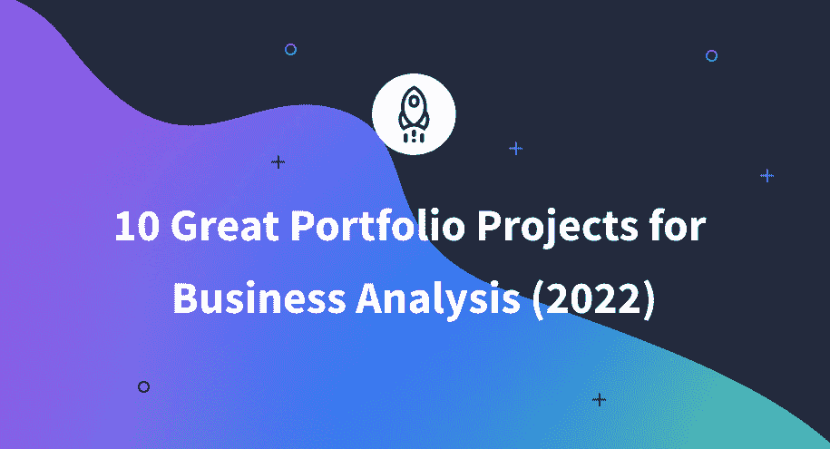

# 商业分析的 10 大投资组合项目(2022)

> 原文：<https://www.dataquest.io/blog/10-great-portfolio-projects-for-business-analysis/>

August 10, 2022

如果你想得到一份商业分析师的工作，你需要一个相关项目的投资组合。为什么？至少有两个合理的理由:

*   创建业务分析师项目是**练习技能**的绝佳方式。做不同的练习是好的，但是构建一个端到端的项目可以让您应用各种技能来解决现实世界的挑战。
*   你的商业分析师项目组合在你找工作的过程中是必不可少的。要获得一个商业分析师职位的面试机会，你需要的不仅仅是一份引人注目的简历和一份列出你所有证书和品质的清单。你真正需要的是展示你的技能——最好的方法是用项目组合。

在这篇文章中，我们将分享 10 个伟大的项目，你可以把它们添加到你的文件夹中，以帮助磨练你的技能和获得下一次面试。

## 1.销售数据分析

作为一名业务分析师，您可能会处理销售数据，因为它对您公司的商业成功起着至关重要的作用。无论这意味着理解当前的销售还是预测未来的销售，这都是雇主寻求的一项关键技能。

销售记录通常包含公司客户、客户销售订单、付款历史、产品类别等信息。这些数据使您可以分析客户的人口统计数据，他们购买哪些产品，何时购买，他们产生了多少收入，他们对促销的反应如何，等等。

### 如何构建您的项目

可以拿一个可用的数据集(比如这个:[销售产品数据](https://www.kaggle.com/datasets/knightbearr/sales-product-data))从各个方面分析销售数据。这里的主要目标是提取关键绩效指标(KPI ),使您能够做出数据驱动的决策，并改善您公司的业务。

以下是您可以在销售数据分析项目中尝试回答的一些问题:

*   销售总数是多少？
*   每月平均销售额是多少？
*   每月收入多少？
*   客户的主要统计数据是什么？
*   哪个市场(国家)的平均销售额最高？
*   按部门划分的利润是多少？
*   销售最好和最差的时期是什么时候？
*   哪些产品卖得最好？
*   公司应该订购或多或少的哪些产品？
*   公司应该如何调整针对 VIP 客户和参与度较低的客户的营销策略？
*   公司应该获得新客户吗？他们应该在这上面花多少钱？

## 2.客户流失率预测

客户流失率也是一个关键的业务指标，可以帮助您改善您的业务。它表示在规定的时间内停止使用贵公司产品或服务的人数百分比。

这一指标尤其适用于基于订阅的业务，在这种业务中，产品的停产很容易被发现:客户已经停止使用您的产品或取消了他们的订阅，因此公司失去了一个客户。

高客户流失率可能表明你的业务存在严重问题:低质量的产品、负面的客户体验、缺乏客户支持等。这就是为什么任何业务的一个关键目标是尽量减少客户流失。

### 如何构建您的项目

你可以建立自己的项目来预测客户流失率。要做到这一点，需要一个可用的数据集(就像这个:[客户流失预测 2020](https://www.kaggle.com/c/customer-churn-prediction-2020/overview) )并分析一家公司的数据，以确定基于各种因素(如呼叫客户服务的次数和呼叫的总费用)可能流失的客户。

## 3.客户评论情感分析

顾客评论情感分析是一个在顾客购买了公司产品后检测顾客感受的过程。该公司可以从产品评论、反馈表、帮助中心的入场券、在线调查等渠道收集这些信息。

每个公司都对进行客户反馈情绪分析感兴趣，因为这是一种确定客户投诉的可能原因的安全方法，并加强让客户满意的产品功能。因此，企业可以采取措施及时解决问题，改善客户体验，降低客户流失率，调整营销活动，并实现利润最大化。

### 如何构建您的项目

要构建一个客户评论情感分析项目，您需要找到一个可用的数据集(例如，[带有酒店评论的情感分析](https://www.kaggle.com/code/jonathanoheix/sentiment-analysis-with-hotel-reviews/data)),其中包含从某个公司的客户评论中提取的文本数据。或者，考虑自己从网上解析这样的数据。你在这个项目中的任务是对文本数据进行预处理，并使用专门的统计和语言工具对其进行探索，以识别积极、消极和中性的体验，以及理想情况下它们的强度和主观性。

注意文本分析技术的一些内在弱点。例如，他们并不总是能够理解俚语或者很少使用的缩写——或者发现讽刺。

## 4.市场篮子分析

购物篮分析探究顾客的购物模式。换句话说，我们必须回答这个问题，*哪些产品通常会一起购买？*举一个简单的日常例子，当有人买鞋时，他们可能也有兴趣买鞋油。然而，在现实世界的市场篮子分析中，例子可能不那么明显。

检测特定的产品关联有助于零售商调整他们的推荐系统，改进营销策略，保持库存平衡，并将相关商品放在商店中彼此靠近的位置。从长远来看，这种方法可以增加公司的销售额，提高客户满意度，并找到新的商机。

### 如何构建您的项目

作为一个业务分析师项目理念，您可以获取一个零售公司的大量数据(例如，[用于购物篮分析(MBA)的杂货数据集](https://www.kaggle.com/datasets/rashikrahmanpritom/groceries-dataset-for-market-basket-analysismba))并调查客户的历史交易。你应该专注于对客户购买行为的描述性分析，揭示经常一起购买的有趣产品组合，并为公司提出有价值的建议。

## **5。价格优化**

对任何现代公司来说，估算产品的最优价格都是最重要的任务之一。这既包括刚刚上市的新公司，也包括试图适应不断变化的经济环境的现有公司，或者计划按地理位置或细分市场扩大业务的公司。

为了成功地解决价格优化问题，商业分析师需要调查历史价格、关键价格因素、公司经营所在的市场(及其经济背景)、潜在客户的概况等。

### 如何构建您的项目

对于这个项目，您可以获取一个零售公司的价格数据数据集(例如， [Retail Price Optimization](https://www.kaggle.com/datasets/suddharshan/retail-price-optimization) )，其中包含产品名称、历史价格、产品类别和特性、销售量以及时间和地理符号等信息。这里的任务是选择和分析相关的价格形成因素及其对价格的影响程度。你的主要目标应该是计算产品的最优售价，从而为公司提供高效的、基于数据的建议。

## **6。股市数据分析**

股票市场数据分析包括对一般股票市场、特定投资领域或特定交易工具的探索。交易员和投资者需要这种分析来了解市场过去和当前的趋势，从而做出更好的买卖决策。

股票市场每天都会产生大量关于公司价格和交易量的数据。

考虑回答以下问题:

*   公司在某一天涨价(或降价)的频率是多少？
*   一年来的月平均收盘价的大致趋势是什么？
*   交易量有季节性规律吗？
*   公司的每日最高价和最低价之间有关系吗？
*   每日最高价和最低价的巨大差异是否与更高或更低的交易量相一致？
*   最近一年的模式是否与前几年一致？

### 如何构建您的项目

为了构建您的项目，您可以选择一个特定的数据集(如[微软股票数据](https://www.kaggle.com/datasets/varpit94/microsoft-stock-data/versions/5)、[亚马逊股票数据](https://www.kaggle.com/datasets/varpit94/amazon-stock-data)，或[英特尔股票数据](https://www.kaggle.com/datasets/varpit94/intel-stock-data)，探索公司的历史股票表现，并找到对未来的见解。

## **7。客户细分**

客户细分包括根据客户的购买行为、财务水平、兴趣、需求和对企业的忠诚度，将公司的客户分成不同的群体。这使得该公司能够将其营销活动和优惠导向正确的目标受众。这种策略有助于企业节省时间，优化工作，最大限度地提高每个客户的利润，并改善客户体验。

### 如何构建您的项目

对于您的客户细分项目，您可以找到一个包含某个组织的客户数据的可用数据集(就像这个:[客户细分分类](https://www.kaggle.com/datasets/kaushiksuresh147/customer-segmentation))。然后，从公司客户的支付能力和购买模式相似性的角度分析数据。最有可能的是，你会发现这种模式取决于广泛的人口统计和地理因素。另一方面，你也可以考虑其他标准，比如零售客户和批发客户。在项目结束时，尝试确定一些建议，说明公司应该向每个细分市场宣传哪些现有产品或正在开发的产品。

请记住，要使您的客户细分模型有效地满足公司的需求，它应该提供合理数量的类别。

## **8。欺诈检测**

欺诈是许多行业普遍存在的问题，如银行、销售和保险。最常见的欺诈活动形式是信用卡欺诈，但还有其他形式，如身份盗窃或网络攻击。这个问题尤其具有挑战性，因为欺诈者的策略在不断变化，变得越来越复杂。这意味着没有一种通用的欺诈检测解决方案。

### 如何构建您的项目

一个关于欺诈检测的项目将是你的业务分析师投资组合的一项资产。您需要做的是获取一个包含在线交易数据的数据集(例如，这个数据集:[信用卡欺诈检测](https://www.kaggle.com/datasets/mishra5001/credit-card))，并使用统计方法对其进行可疑操作分析。欺诈交易有什么共同特征吗？提前了解这些特征(或特征组合)将有助于公司及时识别欺诈行为并采取预防措施。

## **9。预期寿命分析**

预期寿命是某个国家(或地区)健康状况的重要指标。这一指标不仅取决于该国的医学水平，还取决于其环境条件、经济和政治背景以及社会趋势。

分析人均国内生产总值(GDP)和预期寿命之间的相关性是您下一个业务分析项目的好主意。

### 如何构建您的项目

找到一个合适的数据集(例如，[预期寿命(世卫组织)](https://www.kaggle.com/datasets/kumarajarshi/life-expectancy-who))，提供不同国家和地区的预期寿命和人均国内生产总值的信息，使用适当的图表探索和可视化数据，并形成有意义的见解。你可能会注意到每个国家或地区的一些趋势，以及总体趋势。思考以下问题:

*   对于每个地理单元，人均 GDP 和预期寿命之间是否有明显的相关性？
*   预期寿命最高和最低的地理单元是什么？他们的 GDP 呢？
*   在预期寿命较低的地区，还会发生哪些潜在问题？
*   总的来说，现代世界的预期寿命在增长吗？而 GDP 呢？

## 10。构建商务智能应用

在作为业务分析师的日常工作中，您需要使用商业智能(BI)应用程序，如 Microsoft Power BI。因此，在申请业务分析师工作之前熟悉商业智能，并在项目组合中展示您的商业智能技能是非常重要的。自己构建一个商务智能应用程序是一个很好的方法。

### 如何构建您的项目

对于这个项目，考虑获取某个公司的可用数据，为其构建一个数据模型，并对与该公司产品相关的各种指标创建一系列分析和可视化。此类指标可能是产品流行度，它显示了客户对不同产品的参与程度，以及产品评级，它表明了客户满意度。尝试回答以下问题:

*   随着时间的推移，哪些产品有所改进？
*   哪些产品随着时间的推移变质了？
*   就受欢迎程度和客户满意度而言，这两类产品(改善与恶化)是否有一些不同的模式？

根据你的调查结果，你可以向公司建议哪些产品需要改进。你可以找到一个这样的项目，作为我们在 Dataquest 开发的[业务分析师路径](https://www.dataquest.io/path/business-analyst/)的一部分，在不到一年的时间里，带你从初学者到工作就绪。

* * *

## **外卖**

在这个项目总结中，我们考虑了 10 个商业分析师项目的好主意，以添加到您的投资组合中。为您的投资组合构建业务分析师项目是练习您的技能并展示您在业务分析方面的熟练程度的完美方式。

通过学习 Dataquest，您将创建高质量的业务分析项目。我们在本文中讨论的项目想法有一半来自于[业务分析师职业道路](https://www.dataquest.io/path/business-analyst/)。对于这些项目中的每一个，您都将收到要分析的数据和要遵循的指导。不言而喻，我们非常欢迎您在所提供的说明的基础上，更深入地挖掘数据，并提取您自己的见解。

祝你好运！