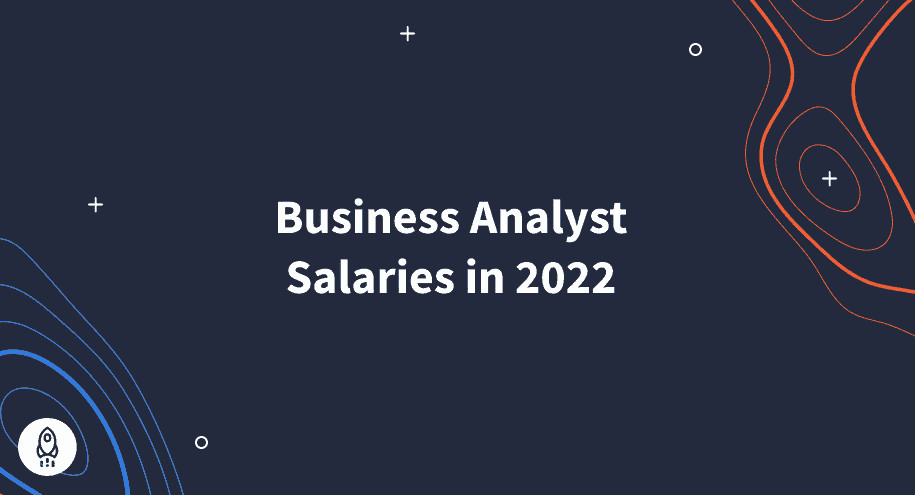

# 美国商业分析师工资(2022 年 7 月)

> 原文：<https://www.dataquest.io/blog/business-analyst-salaries/>

June 24, 2022

### 业务分析师是一个受欢迎的数据科学工作，工资范围极具竞争力。这是 2022 年的数字。

就业市场现在正处于一个关键时刻，许多人都在考虑换工作。输入业务分析师。。。

业务分析师是训练有素的数据专家，拥有数据库和商业智能软件技能，能够以直观的方式操纵、分析和呈现数据。

*商业分析师*是一份受欢迎的工作，位列 Glassdoor 的【2022 年全美 50 份最佳工作中，领先于项目经理、房地产经纪人、风险经理和前端工程师等重要职位。

除了充实的职业生涯，商业分析师还将享受远高于美国全国平均水平的薪水。

*下面列出的美国业务分析师的薪酬以美元为单位，可能会因地区而异。*

## 商业分析师的平均入门级工资是多少？

 **除非你有另一份可以转化为业务分析师的工作经验，否则你可以期望从入门级业务分析师的薪水开始。

商业分析师的入门级工资范围从低端的 55，000 英镑到高端的 78，000 英镑(尽管，离群值可能会超出这个范围)。

初级业务分析师的工资差异如此之大的原因可以归结为地点、雇主和经验。此外，工作范围也会影响薪水。因为商业分析师需要很多技能来有效地完成他们的工作，所以需要更多特定技能经验的公司愿意为训练有素的候选人支付高价。

所以，为了更好地了解商业分析师的工资，最好看一下平均值。

## 商业分析师的平均工资是多少？

 **商业分析师的平均工资更好地反映了你转行后的预期收入。[根据 Glassdoor](https://www.glassdoor.com/Salaries/entry-level-business-analyst-salary-SRCH_KO0,28.htm) 的数据，商业分析师的平均工资为 74513 英镑。那一点也不差，但那只是开始。显然，这个数字接近 95，000。那是因为大约 20，000 英镑的奖金。现在，*那是*的一份薪水。

其他报告发现，商业分析师的平均工资在 8 万到 9 万英镑之间。

事实上，例如，[列出的商业分析师平均工资](https://www.indeed.com/career/business-analyst/salaries)为 79，987 英镑，但我们姑且称之为 80，000 英镑。然而，该网站显示，商业分析师的平均现金奖金为 3600 英镑，平均工资接近 80000 英镑左右。

而在[薪资专家](https://www.salaryexpert.com/salary/job/business-analyst/united-states)上，商业分析师平均薪资列在 9.6 万。这让只有几年经验的商业分析师离六位数俱乐部只有一步之遥。有经验的商业分析师的薪水可以高得多。

## 随着时间的推移，作为一名商业分析师，我能挣多少钱？

 **对于受过良好教育、简历扎实、有几年工作经验的热门商业分析师来说，平均起薪在 10 万英镑左右。

在 Glassdoor 上，商业分析师的高端薪资范围最高为 23.2 万英镑。

类似地，在“的确”网站上，有一些工作在大致相同的地区列出，这意味着在作为一名商业分析师工作的五到十年内，20 万英镑的薪水不是不可能的。

高工资上限足以激励人们投身商业分析领域。当然，对于这样一个技术领域，雇主会寻找具备合适技能的高素质候选人。商业分析或相关领域的学位是最高要求，但不要气馁。

你不需要参加一个四年制的机构来开始你的商业分析师之旅。

## 以我的教育程度，我能期望多少薪水？

 **雇主希望商业分析师候选人了解 SQL、Excel、微软 Power BI 和数据库软件。工作的另一半是经验。从本质上讲，雇主寻找的是不仅了解自己的专业知识，而且能够将这些知识运用到实际工作中的求职者。

诚然，这些技能可以通过参加学士或硕士学位课程来学习。这些传统的面对面的机构是一种选择，但它们可能会占用你太多的时间和金钱。参加三到五年的课程以获得学位是许多人无法负担的，尤其是考虑到高等教育费用的上涨。

此外，还有动手实践的问题，这在课堂上是无法保证的。虽然简历上的学位是加分项，但项目组合或一些现实世界的经验对雇主来说更重要。

新的 [Dataquest 商业分析师路径](https://www.dataquest.io/path/business-analyst/)将教你所有的技能，这些技能将使你成为未来雇主眼中的纸上*和*的顶级候选人。与你至少要花三年时间的现场机构不同，商业分析师之路按照你自己的节奏前进，每周只需要 7-10 个小时。15 门课程分为三个部分，业务分析师路径教授 Excel、SQL 和 Microsoft Power Bi 的熟练程度。

此外，随着课程的进行，你将把你的技能应用到指导项目中，这些项目将挑战你的知识并给你实践经验。最后，你将能够展示你作品集里的项目。最终，你将能够将大型数据集转化为可操作的商业战略，让你稳稳地走上年薪 10 万英镑或以上的道路。********