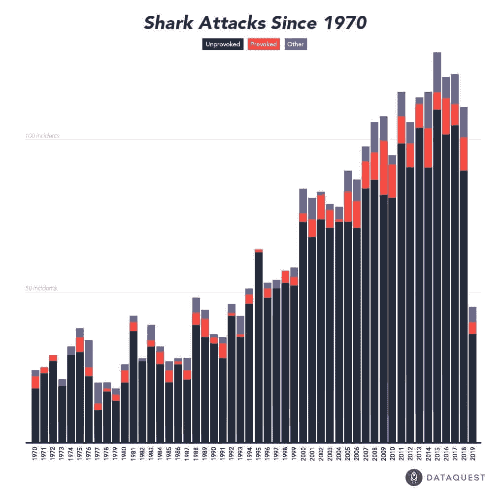
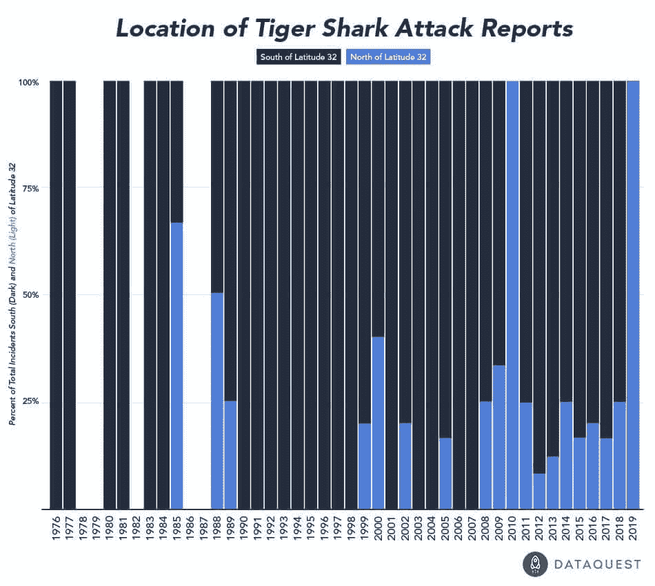
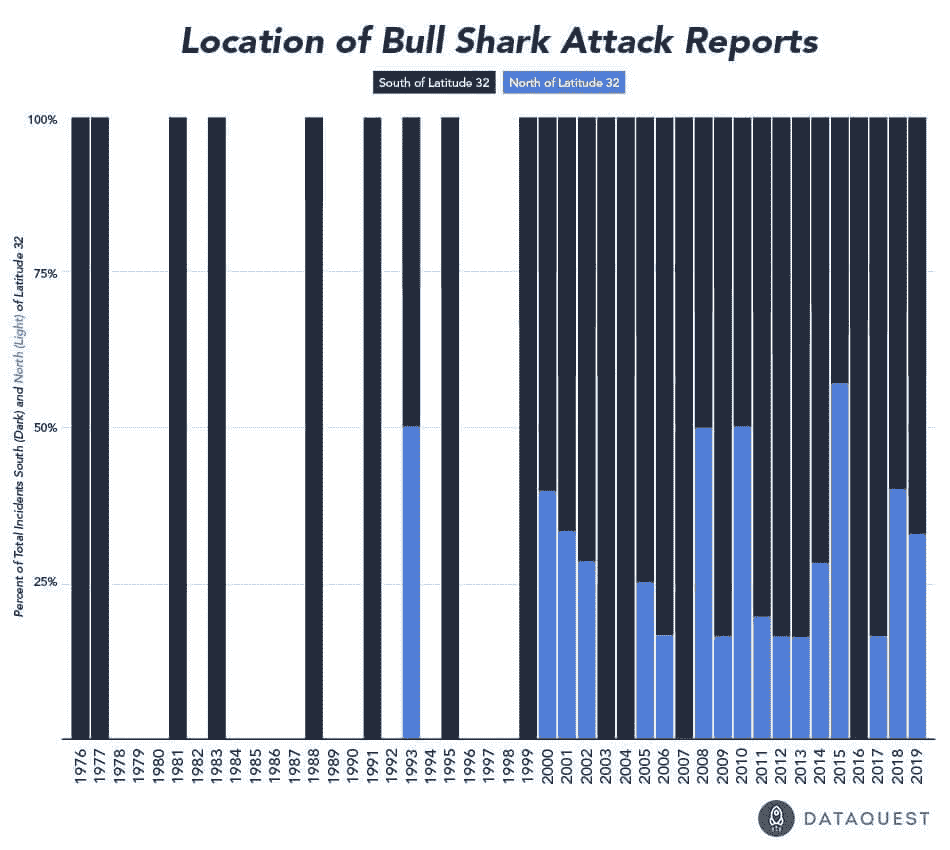
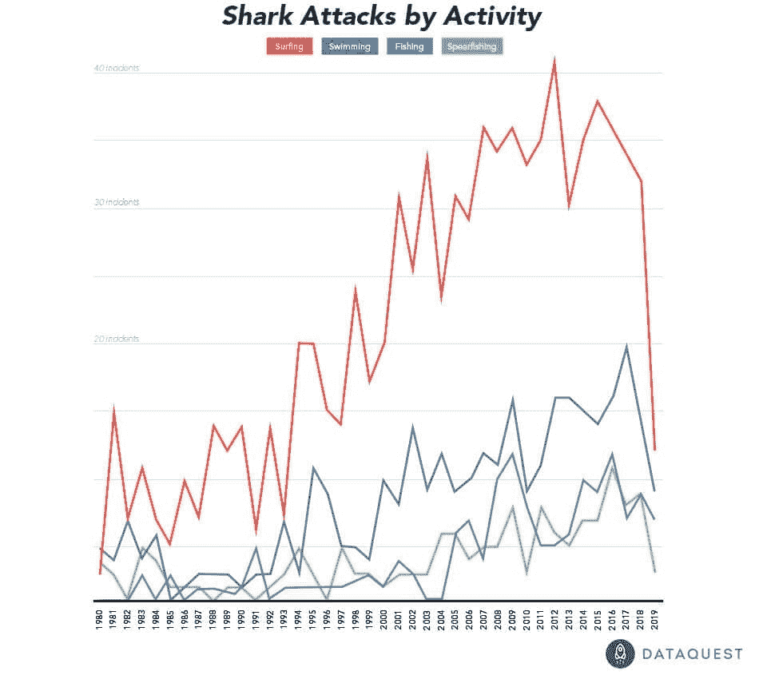

# 数据故事:随着人类越来越多地影响海洋，鲨鱼袭击增加

> 原文：<https://www.dataquest.io/blog/shark-attack-data-rise-humans-impact-oceans/>

July 30, 2019

对一个多世纪以来报道的鲨鱼攻击数据的分析表明，攻击事件在增加。但它也暗示了一些原因:人类对海洋的影响和干涉越来越多。

T2】

自 1970 年以来报道的鲨鱼袭击事件。

鲨鱼袭击事件总体上呈上升趋势，而*引发的*袭击——鲨鱼遭遇某种人类干预的事件——也呈上升趋势。

攻击的模式也在变化。例如，随着气候变化使海水变暖，涉及虎鲨和牛鲨这两种最具攻击性的物种的攻击似乎正在向北移动。下面，我们可以看到发生在北纬 32 度线(蓝色)以北*的年度攻击的百分比似乎在上升。*

   

总的来说，虎鲨和牛鲨约占大多数年份所有报道的鲨鱼袭击事件的一半。这些物种在北方攻击的增加强化了海洋生物学家已经观察到的现象。例如，为了应对海水变暖，牛鲨正在更北的地方交配。许多其他种类的鲨鱼已经显示出[相似的运动模式](https://journals.plos.org/plosone/article?id=10.1371/journal.pone.0150911#sec004)。

我们的分析没有发现涉及白鲨(包括著名的大白鲨)的“北方”鲨鱼袭击数量有任何显著变化。但是有一个有趣的生物学原因，为什么当其他物种明显向北移动时，白鲨可能没有向北移动以应对水温上升。

大多数鲨鱼，包括虎鲨和牛鲨都是冷血动物，这意味着它们的体温与周围的水相匹配。正因为如此，它们可能对水温的变化特别敏感。另一方面，白鲨是温血动物(吸热)，因此不太可能根据周围水温的变化来改变它们的行为。

然而，由于大多数鲨鱼都是冷血动物，数据表明随着海洋温度的上升，游泳者、冲浪者和北方气候的划船者可能会预计他们的海洋中鲨鱼的数量会增加，从而导致鲨鱼袭击的数量增加。

当然，值得记住的是鲨鱼袭击仍然非常罕见。例如，你被闪电击中的可能性远远大于被鲨鱼攻击的可能性。致命事故更加罕见。我们分析的数据集包含 6000 多起人类报告的鲨鱼攻击事件的数据，其中只包括每年报告的几起死亡事件。鉴于[据报道，人类每年杀死大约 1 亿条鲨鱼](https://www.nationalgeographic.com/culture/article/100-million-sharks-killed-every-year-study-shows-on-eve-of-international-conference-on-shark-protection)，很明显，鲨鱼对我们的恐惧超过了我们对它们的恐惧。

尽管如此，如果你想把撞上鲨鱼的几率降到最低，数据建议你应该把冲浪板存放起来。自 1980 年以来，冲浪一直是每年与鲨鱼袭击联系最紧密的单一活动。游泳和钓鱼分别是与报道的鲨鱼袭击相关的第二和第三大常见活动。

T2】

然而，冲浪和钓鱼鲨鱼袭击不太可能致命。游泳、沐浴和各种潜水活动(潜水、水肺潜水、浮潜、鱼叉捕鱼等。)有更高的致命攻击率。

## 学会做这种分析！

深入数据分析，开启一个激动人心的新职业——即使你之前没有编程或统计经验。如果你想自己做一个这样的项目，我们可以帮助你！查看我们的互动数据科学课程。