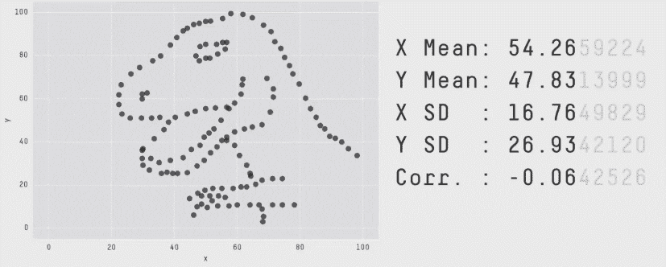

# 2022 年雇主需要看到的 8 项数据分析师技能

> 原文：<https://www.dataquest.io/blog/data-analyst-skills/>

June 27, 2022

## 什么是数据分析师？

数据分析师是使用技术技能来分析数据和报告见解的人。

在典型的一天中，数据分析师可能会使用以下技能:

*   从数据库中提取数据的 SQL 技能
*   分析这些数据的编程技巧
*   报告调查结果的沟通技巧

然而，哪种技能对获得数据分析工作最重要？为了回答这个问题，我们进行了许多小时的研究，包括采访数据分析师、数据科学家和招聘经理。

这是我们学到的。

## 数据分析师需要哪些技能？

因为您将使用的数据科学工具因角色、公司或行业而异，所以我们学会了关注技能而不是工具(如 Python、R、SQL、Excel、Tableau、Power BI 等)。).

以下是作为数据分析师你需要做的事情(不是如何做)。

以下是八项最重要的数据分析师技能:

*   数据清理和准备
*   数据分析和探索
*   统计知识
*   创建数据可视化
*   创建仪表板和报告
*   写作和交流
*   领域知识
*   问题解决

下面是对每一个问题的解释。。。

### 1:数据清理和准备

[研究表明](https://www.forbes.com/sites/gilpress/2016/03/23/data-preparation-most-time-consuming-least-enjoyable-data-science-task-survey-says/#284d94776f63)数据清理和准备将占大多数数据专业人员工作的 80%。这意味着这项技能至关重要。

数据分析师通常需要从一个或多个来源检索数据，并为数字和分类分析做准备。数据清理还包括解决可能影响分析的缺失和不一致的数据。

在数据分析中，数据清理并不总是令人兴奋的，但是当被视为解决问题的练习时，准备数据可能是有趣且具有挑战性的。

**对这个技能感兴趣？查看我们对初学者友好的[数据清理课程](https://www.dataquest.io/path/data-cleaning-python/)。**

### 2:数据分析和探索

在一系列必需的数据分析师技能中提到“数据分析”可能听起来很奇怪，但是分析作为一项特定的技能是必要的。

从根本上来说，数据分析包括获取业务问题或需求，并分析相关数据以得出该问题的答案。

数据分析的另一种形式是探索。数据探索包括在数据中寻找可能给企业带来价值的有趣趋势或关系。

一个业务问题可能会引导探索，但它也可能是相对无指导的。通过寻找数据中的模式，您可能会偶然发现企业降低成本或加快增长的机会。

**对这个技能感兴趣？查看我们的[数据分析师课程列表](https://www.dataquest.io/path/data-analyst/)。**

### 3:统计知识

概率和统计是重要的数据分析师技能。这些知识将指导你的分析和探索，并帮助你破译数据。

此外，理解统计学也将帮助你确保你的分析是有效的，它将帮助你避免常见的谬误和逻辑错误。

所需的统计知识的确切水平将根据您特定角色的需求和您正在处理的数据而有所不同。

例如，如果你的公司依赖于概率分析，你会希望对这些领域有一个比你原本需要的更严格的理解。

**对这种数据分析技能感兴趣？查看我们的[概率和统计课程](https://www.dataquest.io/path/probability-and-statistics-with-python/)。**

### 4:创建数据可视化

数据可视化阐明了数据趋势和模式。人类是视觉动物——这意味着大多数人理解图表或图形的速度要比理解电子表格的速度快。

这意味着创建干净、视觉上引人注目的图表，帮助他人理解你的发现。这也意味着要避免那些难以解释的东西(比如饼图)或者可能误导人的东西(比如操纵轴值)。

可视化也是数据探索的一个重要部分。有时候，当你只看数字时，你可以在数据中直观地看到隐藏的东西。

([图像来源](https://www.autodeskresearch.com/publications/samestats)

很难找到一个不需要数据可视化的数据科学角色，这使它成为一项关键的数据分析师技能。

**对这个技能感兴趣？查看我们的[数据可视化课程](https://www.dataquest.io/path/data-analysis-and-visualization-with-python/)。**

### 5:创建仪表板和报表

作为数据分析师，您需要授权他人使用数据做出关键决策。通过构建仪表板和报告，您可以消除技术障碍，让其他人访问重要数据。

这可能是一个简单的图表和带有日期过滤器的表格，也可能是一个包含数百个交互式数据点的复杂仪表板。

不同职位的工作描述和要求可能会有所不同，但几乎每个数据分析师的工作都将涉及到根据您的发现生成报告或构建仪表板来展示这些报告。

**对这个技能感兴趣？通过我们的 [Power BI 课程](https://www.dataquest.io/course/get-started-with-microsoft-data-analytics/)了解如何创建仪表盘和报告。**

### 6:写作和交流

以多种格式交流的能力是数据分析师的另一项关键技能。写作、说话、解释和倾听都是沟通技巧，有助于你在任何数据分析工作中取得成功。

与同事合作时，沟通是关键。例如，在与业务利益相关者的动员会上，仔细的倾听技巧有助于你理解他们需要的分析。

同样，在你的项目中，你可能需要能够向非技术团队成员解释一个复杂的主题。

书面交流也非常重要——尤其是当你在写分析总结或解释数据探索中的发现时。

清晰而直接的沟通是一项技能，它将推动你在数据领域的职业发展。它可能是一种“软”技能，但不要低估它。

如果你不能解释它们的含义，如果你不能说服你的同事根据你的发现采取行动，那么世界上最好的分析技巧也是毫无价值的。

### 7:领域知识

领域知识是理解你工作的行业和公司的特定主题。

例如，如果你在一家有网上商店的公司工作，你可能需要了解电子商务的细微差别。

相比之下，如果你正在分析关于机械系统的数据，你可能需要理解那些特定的系统是如何工作的。

无论你在哪里工作，如果你不明白你在分析什么，这将使你的工作变得更加困难。

这当然是你可以在工作中学到的东西。然而，如果你知道你想从事的特定行业或领域，那么尽可能多地提前了解会让你成为一个更有吸引力的求职者——一旦你得到工作，也会成为一个更有效率的员工。

### 8:解决问题

作为一名数据分析师，你每天都会遇到问题、错误和障碍。作为一名数据分析师，能够解决问题是另一项很有价值的关键技能。

以下是一些潜在的场景:

*   你可能需要研究你正在使用的软件或编码语言的特点。

*   你的公司可能有资源限制，迫使你创新解决问题的方式。

*   您使用的数据可能不完整。

*   您可能需要执行一些“足够好”的分析来满足迫在眉睫的最后期限。

无论在什么情况下，强大的解决问题的技能对于任何数据分析师来说都是一笔不可思议的财富。

### 其他数据分析师技能

“数据分析师”的确切定义因你询问的对象而异，因此并非所有这些技能对每份数据分析师工作都是必要的。

同样，有些公司要求的技能可能不在这个清单上。我们在这里的重点是找到大多数数据分析师角色所需的一系列技能，以便为学生构建最佳的数据分析师学习路径。

## 被聘为数据分析师

如果你想建立成功获得数据分析师工作所需的技术技能，请查看我们的交互式在线数据分析课程。您将直接在浏览器中编写真实的代码来分析真实世界的数据。

Dataquest 独特的教学法和基于项目的学习方式将帮助您快速学习，保留概念，并增长信心。

具体来说，我们在本文中介绍的数据分析师技能是我们两条“数据分析师”学习路径的基础:

*   [Python 中的数据分析师](https://www.dataquest.io/path/data-analyst/)
*   [R 中的数据分析师](https://www.dataquest.io/path/data-analyst-r/)

完成这些课程将改善您的数据分析师简历(和投资组合)，这将有助于您作为候选人脱颖而出。您可以免费开始这两条道路，并立即开始成为数据分析师的旅程。

### 成为数据分析师！

立即学习成为数据分析师所需的技能。注册一个免费帐户，获得免费的交互式 Python、R 和 SQL 课程内容。

[Sign up now!](https://app.dataquest.io/signup)

*(不需要信用卡！)*