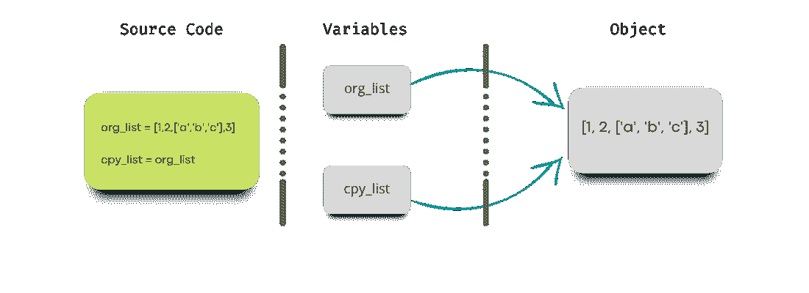

# 如何在 Python 中复制列表(5 种技巧，包括示例)

> 原文：<https://www.dataquest.io/blog/python-copy-list/>

September 14, 2022

列表是 Python 中常用的数据结构。我们经常会遇到需要复制列表的情况，您可能会问自己，“我如何用 Python 复制列表呢？”或者“哪种复制方法最符合我的要求？”

本教程将教你如何使用几种不同的技术来复制或克隆列表:

*   赋值运算符
*   切片语法
*   list.copy()方法
*   函数的作用是
*   copy.deepcopy()函数

我们还将详细讨论它们的用法和技术方面。

## 使用赋值运算符复制列表

假设您使用赋值操作符(=)通过将一个现有的列表变量赋给一个新的列表变量来复制一个列表。在这种情况下，您实际上并没有创建列表的副本；您只是创建了一个别名，它指向内存中原始列表对象所在的完全相同的位置。让我们展开细节，仔细看看。

假设我们有列表变量`org_list`，定义如下:

```
org_list = [1, 2, ['a', 'b', 'c'], 3]
```

然后，我们将它赋给一个新变量`cpy_list`，希望能复制一份供将来使用:

```
cpy_list = org_list
```

然而，您需要知道变量`cpy_list`不是原始列表的真实副本。你可能会问，“为什么它不是原始列表的真实副本？”这是一个很好的问题，因为正如您将在下面看到的，打印这两个变量将返回完全相同的值。

```
print('Original List:', org_list)
print('Copied List:', cpy_list)
```

```
Original List: [1, 2, ['a', 'b', 'c'], 3]
Copied List: [1, 2, ['a', 'b', 'c'], 3]
```

正如所料，这些列表包含相同的值。但是，让我们看看修改原始列表会发生什么。

```
org_list.append('Dataquest')

print('Original List:', org_list)
print('Copied List:', cpy_list)
```

```
Original List: [1, 2, ['a', 'b', 'c'], 3, 'Dataquest']
Copied List: [1, 2, ['a', 'b', 'c'], 3, 'Dataquest']
```

对原始列表的任何修改也会改变复制的列表。

下图显示了执行源代码后会发生什么。



事实上，当你将一个变量赋给另一个变量时，这两个变量引用的是内存中的同一个对象，而不是两个独立的对象。这意味着两个变量通过引用指向同一个对象。当一个以上的变量引用同一个对象时，它被称为共享引用或对象。

通过指向共享可变对象的一个变量对该对象的任何修改都会影响引用同一对象的另一个变量。

所以，使用赋值操作符并不能真正复制一个列表；它只是在内存中为同一个对象创建一个别名。

但是如果我们想制作一个列表的独立副本呢？在下一节中，我们将学习如何制作一个列表的浅层副本。

## 浅层复制技术

我们刚刚了解到，赋值总是存储对对象的引用，并不实际复制这些对象。然而，重要的是要知道改变一个**可变的**对象会影响代码中使用相同引用的其他对象。因此，如果我们想要的不仅仅是对象引用的副本，我们需要让 Python 明确知道要复制对象。一般来说，有两种方法可以制作一个独立的列表副本:浅层副本和深层副本。本节将讨论浅层拷贝以及实现它的不同方式。

简单地说，创建一个复合列表的浅层副本会创建一个新的复合列表，并使用对原始列表所使用的对象的引用。

* * *

**注**:复合对象是包含其他对象的对象，如列表或字典。

* * *

### 使用列表切片的浅层复制

为了理解浅层拷贝的概念，让我们从一个例子开始。假设我们有一个复合列表，如下所示:

```
org_list = [1, 2, ['a', 'b', 'c'], 3]
```

然后，我们可以使用列表切片语法创建它的浅层副本:

```
cpy_list = org_list[:]
```

如果我们运行下面的打印语句，我们可以看到，两者返回完全相同的值。

```
print('Original List:', org_list)
print('Copied List:', cpy_list)
```

```
Original List: [1, 2, ['a', 'b', 'c'], 3]
Copied List: [1, 2, ['a', 'b', 'c'], 3]
```

现在，让我们向原始列表添加一个新项目，并再次运行 print 语句:

```
org_list.append('Dataquest')

print('Original List:', org_list)
print('Copied List:', cpy_list)
```

```
Original List: [1, 2, ['a', 'b', 'c'], 3, 'Dataquest']
Copied List: [1, 2, ['a', 'b', 'c'], 3]
```

修改不会影响复制的列表。但是，这并不是故事的全部。让我们尝试另一个场景，更改嵌套列表中的一项，看看会发生什么:

```
org_list[2][0] = 'X'

print('Original List:', org_list)
print('Copied List:', cpy_list)
```

```
Original List: [1, 2, ['X', 'b', 'c'], 3, 'Dataquest']
Copied List: [1, 2, ['X', 'b', 'c'], 3]
```

虽然对列表进行浅层复制会产生原始列表的真实副本，但是对列表中嵌套元素的任何修改都会反映在两个列表中。原因是复制列表中的嵌套列表使用了与原始列表中相同的共享引用。换句话说，复制列表中的嵌套列表被绑定到原始列表中的嵌套列表。这就是为什么我们称之为*浅*拷贝——因为只有一个新的顶级对象被创建，而任何更深*的对象*使用与原始列表的共享引用。

现在，让我们看看其他一些制作列表浅层副本的方法。

### Python `list.copy()`方法

前面，我们讨论了通过切片语法创建浅层副本。在这一节中，我们将了解 Python 程序员通常用来复制列表的内置方法。Python `copy()`方法返回列表的浅层副本，不带任何参数。让我们试一试:

```
org_list = [1, 2, ['a', 'b', 'c'], 3]

cpy_list = org_list.copy()

print('Original List: ', org_list, ' @', id(org_list))
print('Copied List: ', cpy_list, ' @', id(cpy_list))
```

```
Original List:  [1, 2, ['a', 'b', 'c'], 3]  @ 140532024657920
Copied List:  [1, 2, ['a', 'b', 'c'], 3]  @ 140532024657600
```

尽管`org_list`和`cpy_list`有相同的值，正如`id()`函数的输出所示，它们在内存中的不同位置结束。然而，在原始列表和复制列表中公开内部列表的内存地址会发现它们指向内存中的同一个位置，这意味着我们对原始列表进行了浅层复制。

```
org_list[2][0] = 'X'

print('Inner List in Original: ', org_list[2],' @', id(org_list[2]))
print('Inner List in Shallow Copied: ', cpy_list[2], ' @', id(cpy_list[2]))
```

```
Inner List in Original:  ['X', 'b', 'c']  @ 140532024655936
Inner List in Shallow Copied:  ['X', 'b', 'c']  @ 140532024655936
```

### Python `copy.copy()`函数

另一个制作列表浅层副本的有用方法是`copy.copy()`函数。为了使用它，我们导入`copy`模块，然后将我们想要复制的列表传递给`copy.copy()`函数。让我们试一试:

```
import copy

org_list = [1, 2, ['a' ,'b' ,'c'], 3]

cpy_list = copy.copy(org_list)

print('Original List: ', org_list, ' @', id(org_list))
print('Copied List: ', cpy_list, ' @', id(cpy_list))
```

```
Original List:  [1, 2, ['a', 'b', 'c'], 3]  @ 140532024760320
Copied List:  [1, 2, ['a', 'b', 'c'], 3]  @ 140532024402048
```

现在，让我们向原始列表追加一个新项，再次打印两个列表，并检查输出；然而，我们可以在运行下面的代码之前预测输出。

```
org_list.append('Dataquest')

print('Original List: ', org_list, ' @', id(org_list))
print('Copied List: ', cpy_list, ' @', id(cpy_list))
```

```
Original List:  [1, 2, ['a', 'b', 'c'], 3, 'Dataquest']  @ 140532024760320
Copied List:  [1, 2, ['a', 'b', 'c'], 3]  @ 140532024402048
```

`copy.copy()`方法制作了原始列表的真实副本。然而，它仍然是一个浅层拷贝，嵌套列表指向完全相同的内存位置。换句话说，`copy.copy()`函数只制作顶层副本，不复制嵌套对象。因此，原始列表或复制列表的嵌套对象中的任何修改都会反映在另一个列表的嵌套对象中。

```
org_list[2][0] = 'X'

print('Inner List in Original: ', org_list[2], ' @', id(org_list[2]))
print('Inner List in Shallow Copied: ', cpy_list[2], ' @', id(cpy_list[2]))
```

```
Inner List in Original:  ['X', 'b', 'c']  @ 140532024760128
Inner List in Shallow Copied:  ['X', 'b', 'c']  @ 140532024760128
```

如果我们想要一个深度嵌套列表的完全独立的副本呢？在下一节中，我们将讨论如何在 Python 中执行深度复制。

## Python `copy.deepcopy()`函数

`copy.deepcopy()`函数递归地遍历一个列表来复制它的每个嵌套对象。换句话说，它创建一个列表的顶层副本，然后递归地将原始列表中嵌套对象的副本添加到新副本中。这将从原始列表中产生一个完全独立的副本，对其中任何一个嵌套对象所做的任何更改都不会反映在另一个列表中。

和`copy.copy()`函数一样，`copy.deepcopy()`函数也属于`copy`模块。让我们试一试:

```
import copy

org_list = [1, 2, ['a', 'b', 'c'], 3]

cpy_list = copy.deepcopy(org_list)

print('Original List: ', org_list, ' @', id(org_list))
print('Copied List: ', cpy_list, ' @', id(cpy_list))
```

```
Original List:  [1, 2, ['a', 'b', 'c'], 3]  @ 140532024761408
Copied List:  [1, 2, ['a', 'b', 'c'], 3]  @ 140532024405760
```

上面代码的输出清楚的显示了`copy.deepcopy()`对原列表做了真实的复制，即使我们修改了原列表的内部列表，也不会在深度复制的列表中体现出来。

```
org_list[2][0] = 'X'

print('Inner List in Original: ', org_list[2], ' @', id(org_list[2]))
print('Inner List in Deep Copied: ', cpy_list[2], ' @', id(cpy_list[2]))
```

```
Inner List in Original:  ['X', 'b', 'c']  @ 140532024404736
Inner List in Deep Copied:  ['a', 'b', 'c']  @ 140532024405248
```

上面的代码表明，当我们创建一个列表的深层副本时，它也会创建嵌套对象的真实副本。如前所述，递归深度复制产生了原始列表的真正独立的副本，这就是为什么原始列表和复制列表中的内部列表指向两个不同的内存位置。显然，对其中一个内部列表的任何更改都不会反映在另一个中。

## 结论

本教程讨论了在 Python 中复制列表的几种不同方式，比如赋值操作符、列表切片语法、`list.copy()`、`copy.copy()`和`copy.deepcopy`函数。此外，我们讨论了浅拷贝和深拷贝。我希望这篇教程能帮助你更好地理解 Python 中复制列表的不同方式，因为它们对成为 Python 爱好者至关重要。