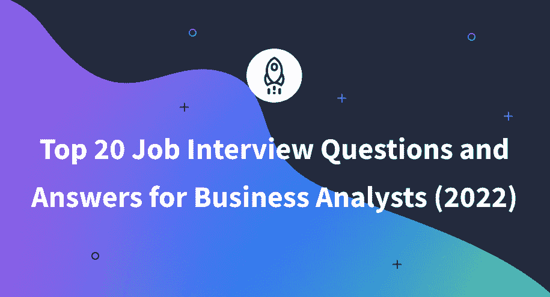

# 商业分析师 20 大面试问答(2022)

> 原文：<https://www.dataquest.io/blog/top-20-job-interview-questions-and-answers-for-business-analysts-2022/>

September 21, 2022

在本文中，我们将分享你在求职面试中可能遇到的 20 个最常见的商业分析师面试问题和答案。为这些问题做好准备不仅可以帮助你为业务分析师职位的面试做好准备并感到更加舒适，还可以确定你在技术技能方面可能存在的差距。

我们从分享一般商业分析师面试问题开始。然后，我们将关注数据分析，探索您将面临的最常见的技术问题。

## **一般商业分析师面试问题**

### 1.商业分析师的主要职责是什么？

业务分析师的主要目标是帮助组织解决问题，或者定义、推荐和实现最佳解决方案。

虽然业务分析师的一些活动可能因行业或组织而异，但以下是所有业务分析师共有的主要职责:

*   确定业务需求和目标
*   评估业务问题和市场机会
*   为企业提供数据驱动的建议
*   通过分析数据，协助制定战略性商业决策
*   定义关键和次要 KPI
*   创建项目计划以改善业务状况
*   提供相关数据报告以监控进度

如果您成为 IT 业务分析师，您的职责将包括 IT 项目的建议、设计、实现和变更管理。

**延伸阅读**

您可以在下面的文章中了解更多关于业务分析师的主要职责:

*   [商业分析师岗位说明书(2022 年版)](https://www.dataquest.io/blog/business-analyst-job-description-2022/)

### 2.业务分析师和数据分析师的区别是什么？

虽然这两个角色有许多相似之处(都处理大量数据，做出数据驱动的决策，需要相同的软技能，等等。)有一些重要的区别:

<figure class="wp-block-table">

|  | **商业分析师** | **数据分析师** |
| **工作重点**: | 通过数字和非数字数据确定业务需求 | 识别数字数据中的模式 |
| **与**一起工作 | 营销、销售和产品团队 | 数据科学家和数据工程师 |
| **背景:** | 商科专业 | 技术专业 |
| **技能**: | 商业智能、项目管理、数据仓库 | 数据清理、数据争论、数据分析、统计 |

</figure>

**延伸阅读:**

您可以在下面的文章中了解更多关于差异的信息:

*   商业分析师与数据分析师:哪个适合你？(2022)

### 3.商业分析师的基本技能是什么？

技术技能:

*   统计分析
*   商业智能软件(微软 Power BI、Tableau、Qlik Sense 等。)
*   数据分析和可视化
*   数据库管理
*   商业智能软件中的数据建模
*   使用数据库
*   领域专业知识
*   业务流程
*   项目管理
*   文件和报告

软技能:

*   分析思维
*   批判性思维
*   解决问题
*   决策
*   沟通和谈判技巧
*   时间管理
*   关注细节
*   协力
*   好奇心

### 4.商业项目的主要阶段是什么？

任何业务项目都包括以下全球阶段:

*   开始
*   分析
*   规划
*   履行
*   监测和控制
*   关闭

### 5.商业分析师使用哪些数字工具？

以下是业务分析师使用的一些工具:

*   商业智能工具:微软 Power BI、Tableau、Qlik Sense、SAP
*   办公工具:微软 Excel、Word、PowerPoint 或谷歌文档、谷歌工作表和谷歌幻灯片
*   项目管理工具:特雷罗，吉拉，汇合，阿萨纳
*   数据库语言(例如 SQL)
*   调查:调查猴子，类型表单，谷歌表单
*   UX 线框:Balsamiq，UXPressia，Figma，Adobe XD
*   图表工具:MS Visio，draw.io

### 6.业务分析师处理哪些文档？

业务分析师使用不同类型的文档，这取决于他们工作的性质(例如 IT 业务分析师、具有领域专业知识的业务分析师等)。).

业务分析师在处理项目时最常用的一些文档包括:

*   商业案例
*   商业分析文件
*   业务需求文档(BRB)
*   用例文档
*   系统需求规格文件
*   功能需求
*   非功能性需求
*   数据映射要求
*   风险分析文件
*   征求建议书(RFP ),包括评估图
*   工程计划
*   线框
*   差距分析
*   用户验收测试(UAT)进度报告
*   测试案例
*   项目进度报告
*   移交文件

### 7.业务分析师使用什么样的图表？

业务分析中最常用的图表包括:

*   用例图——表示参与者与系统的所有可能的交互
*   活动图—显示跨不同业务单位的各种活动的流程
*   协作图—显示系统对象之间的交互
*   流程图—说明解决特定任务的操作工作流程
*   数据流图—显示进出系统的信息流
*   序列图——描述按时间顺序排列的系统各部分之间的相互作用
*   实体关系图(ERD) —描述系统中实体之间的关系
*   类图——展示系统的结构，包括其类、方法、属性和对象

### 8.什么是项目可交付成果？

项目可交付成果是指在项目的每个阶段产生的一系列有形或无形的成果，这些成果可以在内部交付，也可以交付给股东和客户。这些包括各种报告、文件、提案、图纸、战略以及最终产品和服务。

### 9.什么是需求，它和需求有什么不同？

需求是由股东制定的有针对性的陈述，并且代表了他们为了满足特定的业务需求和实现特定的业务目标而需要什么的良好记录的指示。需求代表了项目的核心；股东在项目开始前设定它们，然后业务分析师定义、分析、估计它们，并对它们进行优先级排序。我们可以说，虽然业务需求是期望的最终结果的高级规范，但是业务需求是该业务需求的可应用的、完整记录的表示。

### 10.定义需求获取，并列出其方法。

需求获取是从与股东、客户和最终用户的直接互动中收集与项目相关的需求的过程。需求获取的方法包括以下几种:

*   头脑风暴
*   面谈
*   车间
*   调查和问卷
*   观察
*   文件分析
*   小组讨论
*   界面分析
*   样机研究

### 11.业务分析师如何评估需求的质量？

为此，业务分析师可以使用[智能](https://en.wikipedia.org/wiki/SMART_criteria)规则。一个好的需求应该满足以下标准:

*   特定的:需求的描述应该是特定的、全面的和定义明确的。
*   可度量的:需求成功的标准可以使用提供的度量来度量。
*   可实现的:应该有所有必要的资源(时间、金钱和人员)来实现需求。
*   现实:在给定可用资源的情况下，需求应该是可行的。
*   有时间限制的:需求的满足应该被一个确定的时间间隔所限制。

### 12.什么是 BRD，它的主要组成部分是什么？

BRD 代表业务需求文档。这是一个重要的正式文档，它清楚地陈述了项目的目标并确定了项目的主要股东，包括他们的业务需求和要求、潜在的风险以及项目的预期结果。业务分析师负责在与股东沟通后创建此文档。

BRD 的主要内容包括:

*   行动纲要
*   项目概述、愿景和目标
*   项目范围
*   项目路线图
*   主要股东
*   业务需求陈述
*   业务需求
*   成本效益分析
*   项目风险
*   项目限制
*   基础设施要求

* * *

## **数据分析面试问题**

数据分析是商业分析师最重要的部分之一。为了让你的建议得到关键利益相关者和企业领导的认可，你必须让他们相信你对形势做出了正确的诊断。您需要确定业务需求和问题，并有效地分享有意义的见解。为此，您将使用商业智能(BI)解决方案，如 Power BI 和 Tableau。以下是你在商业分析师面试中会遇到的一些最常见的问题。

### 13.商业分析师可用的顶级商业智能解决方案有哪些？

全球业务分析师最常用的商业智能解决方案包括:

*   微软 Power BI(世界领先的解决方案)
*   （舞台上由人扮的）静态画面
*   Qlik Sense
*   谷歌数据工作室
*   检查员
*   西森斯

**延伸阅读**

你可以在下面的文章中了解更多关于微软商务智能的顶级面试问题:

*   [25 个必知的权力 BI 面试问答(2022)](https://www.dataquest.io/blog/power-bi-interview-questions-and-answers/)

### 14.力量 BI 和 Tableau 有什么区别？

虽然 Power BI 和 Tableau 都是用于业务数据争论、数据分析和数据可视化的商业智能(BI)应用程序，但它们之间存在一些显著差异:

*   Power BI 使用 DAX(数据分析表达式)进行计算，Tableau 使用 MDX(多维表达式)。
*   Power BI 可以处理相对有限的数据量，而 Tableau 可以轻松处理海量数据。
*   Power BI 有一个相对简单易学的界面，专业人士和初学者都可以使用。Tableau 界面更具挑战性；所以，不太适合新手。
*   与 Tableau 相比，Power BI 可连接的数据源范围较小。
*   Power BI 比 Tableau 便宜很多。
*   Power BI 是一个完美的报告工具，而 Tableau 擅长数据可视化。

### 15.商业智能解决方案的最大优势是什么？

作为业务分析师，您将使用业务分析或业务智能工具，如 Microsoft Power BI、Qlik Sense 或 Tableau。

以下是使用 BI 解决方案的主要优势:

*   无需深厚的技术技能即可分析数据
*   以结构化和一致的方式呈现数据和见解
*   使用相关 KPI 支持决策
*   在一个地方整合来自多个来源的数据
*   通过交互式仪表盘分享实时见解
*   提高公司对有意义数据的可见性
*   进行预测分析
*   提高生产力

### 16.商业智能解决方案的数据分析有哪些不同阶段？

商业智能解决方案的数据分析过程有四个主要阶段:

*   数据准备:这个阶段包括从多个数据源加载数据，格式化、清理和合并数据。
*   数据模型:这个阶段包括描述数据的结构，如何存储数据，以及各种数据集之间的关系和约束。
*   数据可视化:这个阶段包括选择正确的视觉效果和颜色来有效地传达你的故事。
*   数据分析:这个阶段包括分析数据、将数据分组、宁滨数据，以及准备表示 KPI 的仪表板

### 17.什么是数据清理，为什么它对您的分析很重要？

数据清理是数据分析过程中必要的准备(通常相当耗时)步骤，在收集数据之后，分析数据之前。该步骤包括以下内容:

*   删除重复数据
*   处理缺失值
*   纠正或删除不准确的数据

为了从输入数据中提取有意义的见解，它应该是可靠的、完整的、一致的和有代表性的-这正是数据清理的目的。

### 18.如果你有丢失的数据，你该怎么办？

处理缺失数据有多种方法:

*   删除任何缺少值的行
*   删除任何缺少值的列
*   用其他值填充缺失值，如该列的平均值、中值或众数；从另一列提取的值；从附加研究中获得的值；等等
*   保留丢失的值不变

### 19.数据建模涉及哪些关键活动？

*   识别用例及需求
*   检索、清理和转换数据
*   设计数据模型
*   定义不同表中数据之间的关系和层次结构
*   处理数据粒度
*   创建度量和扩充数据
*   调整和优化模型性能
*   验证数据模型

### 20.对于您的数据分析来说，什么是好的数据可视化？

良好的数据视觉效果应遵循的主要原则包括:

*   应该是**干净易读**。这意味着选择合适的字体，没有任何干扰元素(如不必要的颜色、线条、网格、多余的注释等)。)、所有必要元素(情节标题、轴名称和单位、关键特征的强调等。)，并用最小的视觉效果传达最大的信息。
*   应该**对目标受众**清晰，有说服力，包括没有任何技术背景的人。
*   它应该**讲述一个隐藏在原始数据中的故事**，**回答商业项目目标**中陈述的主要问题**或任何对回答主要问题很重要的中间问题**。

## **外卖**

现在，您已经看到了最常见的业务分析师面试问题和答案，您可以满怀信心地准备业务分析师技术面试了！

如果你想掌握或更新你的技能(并获得认证！)在申请商业分析师工作之前，在 Dataquest 探索独立的[商业分析师职业道路](https://www.dataquest.io/path/business-analyst/)。它将帮助您学习必要的技术技能，并在现实世界的项目中实践这些技能，您可以将它们包含在您的投资组合中。

有关业务分析的更多信息，请查看以下文章:

*   [如何通过 5 个步骤成为商业分析师(2022 年)](https://www.dataquest.io/blog/how-to-become-a-business-analyst-in-5-steps-in-2022/)
*   [商业分析 10 大投资组合项目(2022)](https://www.dataquest.io/blog/10-great-portfolio-projects-for-business-analysis/)