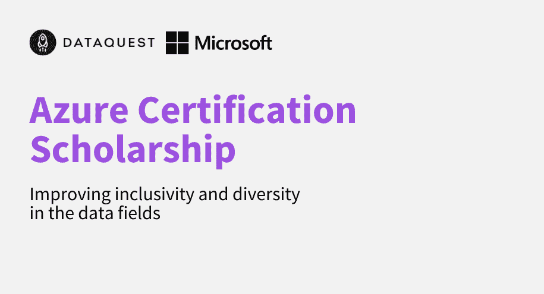

# Dataquest 通过新的 Azure 奖学金计划继续推动数据的多样性

> 原文：<https://www.dataquest.io/blog/azure-certification-scholarship-2/>

October 1, 2022

Dataquest 很高兴宣布一项新的 Azure 奖学金计划。这是我们与微软奖学金计划的继续，旨在提高数据领域的包容性和多样性。该计划将为来自世界各地代表性不足的社区的学习者带来尖端的云技术。

奖学金申请期从 2022 年 10 月 1 日开始，到 2022 年 10 月 31 日结束，对任何在数据领域代表性不足的人开放。性别、种族、教育水平和收入都是将被考虑的多样性的轴心。

在完成 Microsoft Azure 中的 Dataquest 云数据基础知识后，接收者将获得免费参加[考试 DP-900: Microsoft Azure 数据基础知识](https://docs.microsoft.com/en-us/certifications/exams/dp-900)的机会。

## 提高数据领域包容性和多样性的奖学金

数据角色中存在明显的公平差距。

*   2020 年，在数据科学相关职位的所有专业人员中，只有 15%至 22%是女性(BCG)。
*   2021 年，只有 5.2%的数据科学家是拉丁裔，只有 1%是非裔美国人(萨皮亚)。
*   2021 年 94%的数据科学家至少有大专学历(联大)。

“当我开始 Dataquest 时，我的目标是帮助数百万人进入数据领域。作为一名自学成才的数据科学家，我知道迈出这一步有多难。这就是为什么我很高兴与微软合作——Power BI 是帮助人们开始新的分析角色的一项关键技能。我们的奖学金计划帮助我们继续我们的使命，并改善受教育的机会。”—Vik Paruchuri，Dataquest 创始人

## 互动培训倡议

Dataquest 和微软合作提供第一个交互式云数据课程，将于今年 11 月推出*。*本课程将向学员讲授核心数据概念，以及如何使用 Azure 数据服务在云中实现这些概念。该课程还将帮助学习者理解云和 Azure 中的数据工作的基础，并为他们在云中的进一步数据工作做准备。完成该计划后，学员将为通过[考试 DP-900:微软 Azure 数据基础](https://docs.microsoft.com/en-us/certifications/exams/dp-900)做好充分准备，并继续推进他们的数据职业生涯。

微软 Azure 是一个受欢迎的平台，提供从计算到分析到网络和存储的一系列云服务。随着越来越多的公司使用云来管理这些数据，精通云正成为数据职位描述中最常见的要求之一。

“我们很高兴能与 Dataquest 合作获得这些奖学金。这项计划支持我们的使命，即帮助地球上的每个人和每个组织取得更大成就。通过将微软的专业知识与交互式 Dataquest 学习平台相结合，学习者将获得准备 DP-900 考试和为数据科学职业生涯做准备所必需的数字技能。”——微软高级主管杰夫·赫希。

[在这里了解更多关于奖学金以及如何申请的信息。T3】](https://bit.ly/3BXyzyR)

#### 关于 Dataquest

Dataquest 成立于 2015 年，旨在帮助任何人[学习数据科学](https://www.dataquest.io)并推进他们的职业生涯。有了 Dataquest 职业道路，学员可以在 3 到 9 个月内获得开始新工作所需的一切。学员可以随着课程的进展建立作品集，并通过完成顶点项目获得职业道路认证。