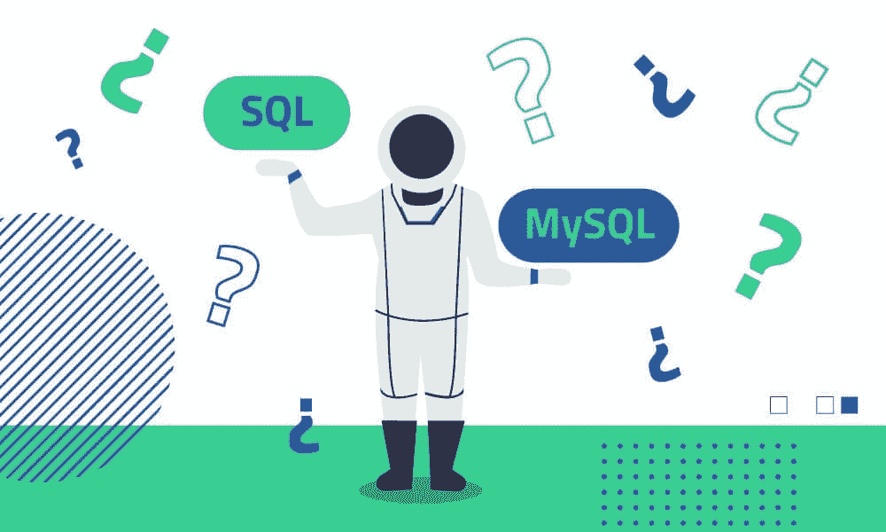

# SQL 与 MySQL:区别的简单指南

> 原文：<https://www.dataquest.io/blog/sql-vs-mysql/>

February 11, 2021

SQL 和 MySQL 是世界上最流行的两种数据管理工具。但是对于一个初学者，或者甚至是更有经验的人来说，这两者之间的区别可能会令人困惑。

在这篇文章中，我们将定义什么是 SQL 和 MySQL，研究它们之间的区别，并深入研究一些可供选择的产品。

## 必备的 SQL 相关关键术语

在我们开始之前，让我们解释一下我们将在整个过程中使用的几个关键术语。如果您想直接进入文章或稍后返回以了解更多信息，请点击此处随意跳过这一部分。

### 数据库ˌ资料库

数据库是存储在计算机中的一组数据，它的结构通常使数据易于访问。

### 关系数据库管理系统

关系数据库是一种允许我们识别和访问与数据库中另一段数据相关的数据的数据库。它将数据存储在一系列表的行和列中，以提高处理和查询的效率。

一个简单的关系数据库示例:假设一家小企业 X 公司接受客户订单。它在其数据库中建立了两个表:

*   **客户信息表**(有`customer_id`、`address`、`phone_number`等字段)
*   **客户订单表**(有`customer_id`、`product`、`quantity`等字段)

这两个表有关系(它们共享`customer_id`字段)。这就是为什么这是一个关系数据库。

在 X 公司的仓库中，他们通过检查客户订单表中的记录来处理订单。但是他们也可以使用 orders 表中的`customer_id`从 Customer information 表中获取关于客户的更多信息。

这不仅是一种更有效的数据存储方式，还意味着如果您需要更新客户信息，您可以在一个地方(客户信息表)完成，而不必使用冗余信息更新多个表。

我们关于 [SQL 基础知识的文章](https://www.dataquest.io/blog/sql-basics/)更详细地介绍了关系数据库。大多数现代数据库都是这样建立的，因为它们更易于管理、灵活且可伸缩。

关系数据库有时被称为 RDBMS，即关系数据库管理系统。

### 存储引擎

存储引擎是数据库管理系统用来从数据库创建、读取和更新数据的一个软件。

### 开放源码

开源仅仅意味着软件的原始源代码对所有人免费开放，并且可以被重新分发和修改。

## 什么是 SQL？

SQL 代表结构化查询语言，发音为“S.Q.L .”或“Sequel”。它是一种特殊的编程语言，用于与数据库通信。

如果您想添加、检索或更新数据库中的数据，您可以使用 SQL 来完成。

这很重要，因为大多数公司都将数据存储在数据库中。数据库有很多种类型，其中大多数都使用 SQL。我们将在本文中讨论其中的两个(MySQL 和 SQL Server)，但还有许多其他的，例如 PostgreSQL、IBM Db2 和 Amazon Aurora，这里仅举几例。

无论您或您的公司使用哪种数据库，学习 SQL 的基础知识都可能对您有所帮助。

有趣的事实:SQL 在 1986 年成为美国国家标准协会(ANSI)的官方标准，在 1987 年成为国际标准化组织(ISO)的官方标准。虽然它已经存在了几十年，但它在今天仍然被广泛使用并且非常受欢迎！

## 什么是 MySQL？

MySQL 是 Oracle 拥有的开源关系数据库管理系统(RDBMS)。

由于几个原因，它是一个非常受欢迎的工具。首先，它的开源状态意味着它可以完全免费使用。如果愿意，有经验的开发人员甚至可以直接进入并修改它的源代码来满足他们的需求。

尽管 MySQL 可以免费使用，但 Oracle 确实提供了卓越支持服务，您可以通过商业许可购买。

MySQL 也得到大力支持，用户可以在各种平台和操作系统上运行该软件，包括 Windows、Linux、UNIX 等。

MySQL 为其表提供了各种存储引擎:MyISAM、InnoDB、Merge、MEMORY (HEAP)、ARCHIVE、CSV 和 FEDERATED。

例如，CSV 引擎将以 CSV 文件格式存储数据。这可用于将数据迁移到替代的非 SQL 应用程序中，如电子表格软件。

这些存储引擎各有优缺点。在创建数据库之前，了解每一种方法并为您的表选择最合适的方法以最大限度地提高数据库的性能是很重要的。

我们仅仅触及了 MySQL 所能提供的皮毛。不过，了解一下 SQL 和 MySQL 的区别应该就够了。

有趣的事实:MySQL 的名字来源于创始人之一——Michael“Monty”wide nius——他以他女儿 My 的名字给它命名。

## SQL 和 MySQL 有什么区别？

简而言之，SQL 是一种查询数据库的语言，MySQL 是一种开源数据库产品。

SQL 用于访问、更新和维护数据库中的数据，而 MySQL 是一种 RDBMS，允许用户对数据库中的数据进行组织。

SQL 变化不大，因为它是一种语言。MySQL 经常更新，因为它是一个软件。

通俗地说，SQL 可以被看作是银行出纳员，MySQL 可以被看作是银行。你需要银行出纳员(SQL)与银行(MySQL)通信，你需要银行管理钱(数据)。他们协同工作，但他们是完全不同的。

## 什么是 SQL Server？

和 MySQL 一样，SQL Server 也是一个关系数据库管理系统。但是，与 MySQL 不同，SQL Server 不是开源的。它归微软所有，根据用户的需求和预算，它有几个版本。

其中一个版本名为 SQL Server Express，可以免费下载和分发。它包括一个专门针对嵌入式和小规模应用的数据库

对于该领域的新手来说，一个常见的问题是“SQL 和 SQL Server 是一回事吗？”。一句话:不会。这两者之间的区别类似于我们在 SQL 和 MySQL 之间的区别。SQL 是一种查询数据库的语言，SQL Server 是一种管理关系数据库的系统。

就 MySQL 和 SQL Server 而言，没有适合每个组织的正确答案。

如果你是一家资金紧张的初创公司，你可能会选择 MySQL。

如果您是一家希望在数据库上运行大量活动的大公司，那么您可能会倾向于 SQL Server。

归根结底，每个系统都有自己的优缺点。

## 我为什么要使用 SQL？

如果你想要一份数据方面的工作，那么你需要[学习 SQL](https://www.dataquest.io/blog/sql-basics/) 。它得到了很好的支持，是数据科学中最常用的语言，并且需求一直很高。

查看我们关于 [SQL 认证](https://www.dataquest.io/blog/sql-certification/)的文章，了解为什么学习 SQL 认证是如此重要的技能。

## 我为什么要使用 MySQL？

如果你想建立一个便宜(或者免费)的数据库，你应该使用 MySQL。)，安全可靠。您可以下载该软件，并在几分钟内开始运行。

然后，您需要学习 SQL 语言，开始有效地使用它。

## 结论

正如我们所见，很难实际比较 SQL 和 MySQL。虽然它们是相关的(并且有相似的名字)，但是它们做完全不同的事情，并且可以单独使用或者串联使用，这取决于你想要实现的目标。

如果你想了解关于这个话题的更多信息，请查看 Dataquest 的交互式[SQL 和数据库介绍](https://www.dataquest.io/course/funds-sql-i/)课程，以及我们的 [SQL 基础知识](https://www.dataquest.io/path/sql-skills/)，它们将帮助你在大约 2 个月内掌握这些技能。

### 用正确的方法学习 SQL！

*   编写真正的查询
*   使用真实数据
*   就在你的浏览器里！

当你可以 ***边做边学*** 的时候，为什么要被动的看视频讲座？

[Sign up & start learning!](https://app.dataquest.io/signup)