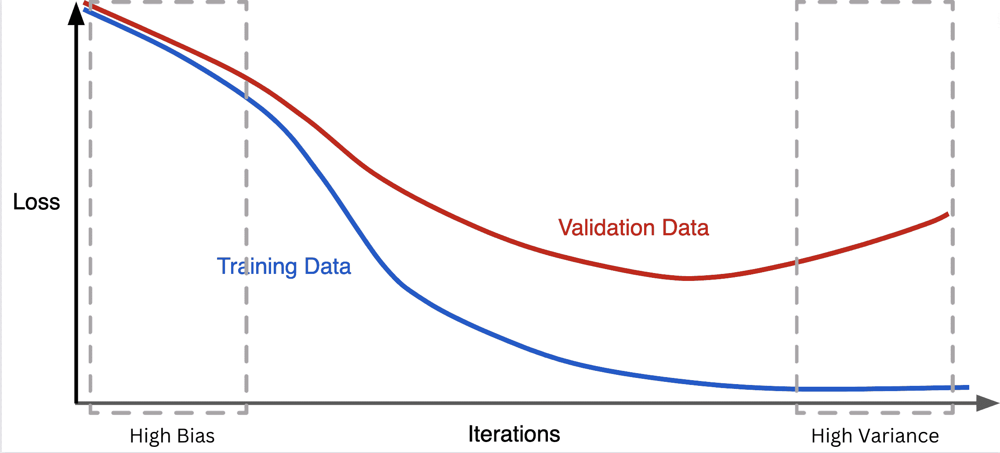

# 机器学习中的正则化(附代码示例)

> 原文：<https://www.dataquest.io/blog/regularization-in-machine-learning/>

October 11, 2022

在本教程中，我们将学习什么是正则化以及我们为什么使用它。我们还将讨论正则化技术以及如何使用它们。

完成本教程后，您将理解以下内容:

*   机器学习中的正则化
*   L1 正则化(套索回归)
*   L2 正则化(岭回归)
*   弹性网
*   如何使用这些正则化技术

在本教程中，我们假设您了解机器学习的基础知识，包括线性回归的基本概念。如果你不熟悉机器学习或渴望更新你的机器学习技能，你可能会喜欢尝试我们的[数据科学家在 Python 职业道路](https://www.dataquest.io/path/data-scientist/)。

## 介绍

基本上，我们使用正则化技术来修复机器学习模型中的过度拟合。在更详细地讨论正则化之前，我们先讨论过拟合。

当机器学习模型与训练数据紧密拟合，并试图学习数据中的所有细节时，就会发生过度拟合；在这种情况下，模型不能很好地推广到看不见的数据。下图称为泛化曲线，显示了训练损失随着训练迭代次数的增加而不断减少:



虽然最小化训练损失是一件好事，但是验证损失在特定的迭代次数之后开始增加。验证损失的增加趋势意味着，当我们试图减少训练损失时，我们增加了模型的复杂性，因此它不能推广到新的数据点。

换句话说，高方差机器学习模型捕捉训练数据的所有细节以及数据中的现有噪声。因此，正如你在泛化曲线中看到的，训练损失和验证损失之间的差异变得越来越明显。相反，高偏差机器学习模型与训练数据松散耦合，这导致训练损失和验证损失之间的差异较小。

到目前为止，我们已经了解到，防止过度拟合对于提高我们的机器学习模型的性能至关重要。在接下来的部分中，我们将学习正则化及其技术。

## 什么是正规化？

正则化意味着通过将系数估计缩小到零来限制模型以避免过度拟合。当一个模型遭受过拟合时，我们应该控制模型的复杂性。从技术上讲，正则化通过向模型的损失函数添加惩罚来避免过度拟合:

$ $ \ text {正则化=损失函数+惩罚}$$

有三种常用的正则化技术来控制机器学习模型的复杂性，如下所示:

*   L2 正则化
*   L1 正则化
*   弹性网

让我们详细讨论这些标准技术。

## L2 正则化

使用 L2 正则化技术的线性回归被称为*岭*回归。换句话说，在岭回归中，正则化项被添加到线性回归的成本函数中，这使得模型的权重(系数)的大小尽可能小。L2 正则化技术试图使模型的权重接近于零，但不是零，这意味着每个要素对输出的影响应该很小，而模型的精度应该尽可能高。

$ $ \ text {岭回归成本函数} = \ text {损失函数}+\ dfrac { 1 } { 2 } \lambda\sum_{j=1}^m w_j^2$$

其中$\lambda$控制正则化的强度，$w_j$是模型的权重(系数)。

通过增加$\lambda$，模型变得受宠若惊且不合适。另一方面，通过减少$\lambda$，模型变得更加过拟合，并且当$\lambda$ = 0 时，正则化项将被消除。

## L1 正则化

最小绝对收缩和选择算子(*套索*)回归是岭的替代方法，用于正则化线性回归。Lasso 回归也在成本函数中增加了一个惩罚项，但略有不同，称为 L1 正则化。L1 正则化使一些系数为零，这意味着模型将忽略这些特征。忽略最不重要的特性有助于强调模型的基本特性。

$$\text{Lasso 回归成本函数} = \text{Loss 函数} + \lambda \sum_{j=1}^m |w_j|$$

其中$\lambda$控制正则化的强度，$w_j$是模型的权重(系数)。

套索回归通过消除最不重要的要素来自动执行要素选择。

## 弹性网

弹性网是一种结合了脊和套索正则项的正则化回归技术。$r$参数控制组合比率。当$r=1$时，L2 项将被消除，当$r=1$时，L1 项将被消除。

$ $ \ text {弹性净成本函数} = \ text {损失函数}+r \ lambda \sum_{j=1}^m | w*j |+\ dfrac {(1-r)} { 2 } \ lambda \ sum*{j=1}^m w_j^2$$

虽然将 lasso 和 ridge 的惩罚结合起来通常比只使用其中一种正则化技术效果更好，但调整两个参数$\lambda$和$r$有点棘手。

## 用 Python 演示正则化技术

在本节中，我们将对 Boston Housing 数据集应用 L2 和 L1 正则化技术，并比较使用这些技术前后的训练集得分和测试集得分。

首先，让我们加载数据集，并将其分为训练集和测试集，如下所示:

```
import mglearn as ml
from sklearn.linear_model import LinearRegression
from sklearn.model_selection import train_test_split
from numpy import genfromtxt

dataset = genfromtxt('https://raw.githubusercontent.com/m-mehdi/tutorials/main/boston_housing.csv', delimiter=',')
X = dataset[:,:-1]
y = dataset[:,-1]
X_train, X_test, y_train, y_test = train_test_split(
    X, y, test_size=0.25, random_state=0) 
```

现在，我们可以训练线性回归模型，然后打印训练集分数和测试集分数:

```
lr = LinearRegression().fit(X_train, y_train)

print(f"Linear Regression-Training set score: {lr.score(X_train, y_train):.2f}")
print(f"Linear Regression-Test set score: {lr.score(X_test, y_test):.2f}")
```

```
 Linear Regression-Training set score: 0.95
    Linear Regression-Test set score: 0.61
```

比较训练集和测试集上的模型性能揭示了该模型遭受过拟合。

为了避免过度拟合并控制模型的复杂性，让我们使用岭回归(L2 正则化)并看看它在数据集上的表现如何:

```
from sklearn.linear_model import Ridge
ridge = Ridge(alpha=0.7).fit(X_train, y_train)
print(f"Ridge Regression-Training set score: {ridge.score(X_train, y_train):.2f}")
print(f"Ridge Regression-Test set score: {ridge.score(X_test, y_test):.2f}")
```

```
 Ridge Regression-Training set score: 0.90
    Ridge Regression-Test set score: 0.76
```

虽然岭回归的训练集得分略低于线性回归的训练集得分，但岭的测试集得分显著高于线性回归的测试集得分。这些分数证实了岭回归降低了模型的复杂性，导致一个不太过度拟合但更通用的模型。

`alpha`参数指定了模型在训练集上的性能与其简单性之间的权衡。因此，增加`alpha`值(其默认值为 1.0)可以通过缩小系数来简化模型。

现在，让我们将套索回归应用于数据集并探究结果。

```
from sklearn.linear_model import Lasso
lasso = Lasso(alpha=1.0).fit(X_train, y_train)
print(f"Lasso Regression-Training set score: {lasso.score(X_train, y_train):.2f}")
print(f"Lasso Regression-Test set score: {lasso.score(X_test, y_test):.2f}")
```

```
 Lasso Regression-Training set score: 0.29
    Lasso Regression-Test set score: 0.21
```

如图所示，拉索的表现相当令人失望，这是一个不适合的迹象。套索模型效果不好，因为大部分系数都变成了精确的零。如果我们想知道模型中已经使用的特性的确切数量，我们可以使用下面的代码:

```
print(f"Number of features: {sum(lasso.coef_ != 0)}")
```

```
 Number of features: 4
```

这意味着训练集中的 104 个特征中只有 4 个用于 lasso 回归模型，而其余的被忽略。

让我们调整`alpha`,通过将其值降低到 0.01 来减少欠拟合:

```
lasso = Lasso(alpha=0.01).fit(X_train, y_train)
print("Lasso Regression-Training set score: {:.2f}".format(lasso.score(X_train, y_train)))
print("Lasso Regression-Test set score: {:.2f}".format(lasso.score(X_test, y_test)))
```

```
 Lasso Regression-Training set score: 0.90
    Lasso Regression-Test set score: 0.77
```

```
 /Users/mohammadmehdi/opt/anaconda3/lib/python3.8/site-packages/sklearn/linear_model/_coordinate_descent.py:647: ConvergenceWarning: Objective did not converge. You might want to increase the number of iterations, check the scale of the features or consider increasing regularisation. Duality gap: 4.690e+01, tolerance: 3.233e+00
      model = cd_fast.enet_coordinate_descent(
```

重新运行下面的代码显示，通过减少`alpha`，套索模型使用了 104 个特征中的 32 个:

```
print(f"Number of features: {sum(lasso.coef_ != 0)}")
```

```
 Number of features: 32
```

虽然我们可以将`alpha`降低更多，但似乎它的最佳值是`0.01`。

我们要使用的最后一种技术是弹性网。让我们看看它做得有多好。

```
from sklearn.linear_model import ElasticNet
elastic_net = ElasticNet(alpha=0.01, l1_ratio=0.01).fit(X_train, y_train)
print(f"Elastic Net-Training set score: {elastic_net.score(X_train, y_train):.2f}")
print(f"Elastic Net-Test set score: {elastic_net.score(X_test, y_test):.2f}")
```

```
 Elastic Net-Training set score: 0.84
    Elastic Net-Test set score: 0.70
```

```
 /Users/mohammadmehdi/opt/anaconda3/lib/python3.8/site-packages/sklearn/linear_model/_coordinate_descent.py:647: ConvergenceWarning: Objective did not converge. You might want to increase the number of iterations, check the scale of the features or consider increasing regularisation. Duality gap: 1.474e+02, tolerance: 3.233e+00
      model = cd_fast.enet_coordinate_descent(
```

* * *

**注**

一般来说，为了避免过度拟合，正则化模型优于简单的线性回归模型。在大多数情况下，ridge 工作得很好。但如果您不确定使用套索还是弹性网，弹性网是更好的选择，因为正如我们所见，套索移除了强相关的要素。

* * *

## 结论

本教程探讨了在线性机器学习模型中避免过拟合的不同方法。我们讨论了为什么会发生过度拟合，以及什么是脊、套索和弹性网回归方法。我们还将这些技术应用于波士顿住房数据集，并比较了结果。一些其他技术，如早期停止和退出，可用于正则化复杂模型，而后者主要用于正则化人工神经网络。

我希望你今天学到了一些新东西。请随时在 LinkedIn 或 Twitter 上与我联系。