# Azure 中 Databricks 的温和介绍(2022 版)

> 原文：<https://www.dataquest.io/blog/introduction-to-databricks-in-azure/>

October 14, 2022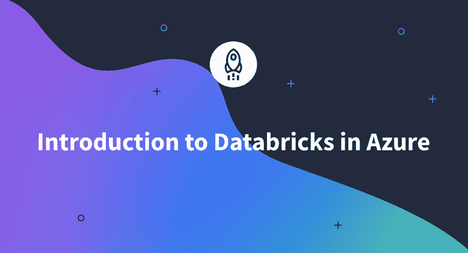

Azure Databricks 是一个强大的数据科学和机器学习平台。它为您提供了快速、轻松地清理、准备和处理数据的能力。此外，它还提供可扩展的计算资源，允许您大规模地训练和部署您的模型。Azure Databricks 不仅限于数据科学和机器学习，它还提供强大的数据工程功能。

其基于云的数据处理平台包括构建和运行数据管道所需的所有组件。它是完全托管的，并提供各种功能，如与 Azure Active Directory 和基于角色的访问控制集成，以帮助您保护您的数据。

Databricks 还提供了一个交互式的工作空间，使得在数据项目上的协作变得容易。此外，它还提供了多种工具来帮助您优化管道和提高性能。总的来说，Azure Databricks 是任何希望在云中构建或运行数据管道的人的绝佳选择。

在这篇文章中，你将学习如何在 Azure Databricks 中构建、训练和评估机器学习模型。

## 登录 Azure Databricks

第一步是用 Azure 创建一个帐户。可以去这个 Azure 门户[链接](https://azure.microsoft.com/en-us/get-started/azure-portal/)。

<figure class="wp-block-image size-large">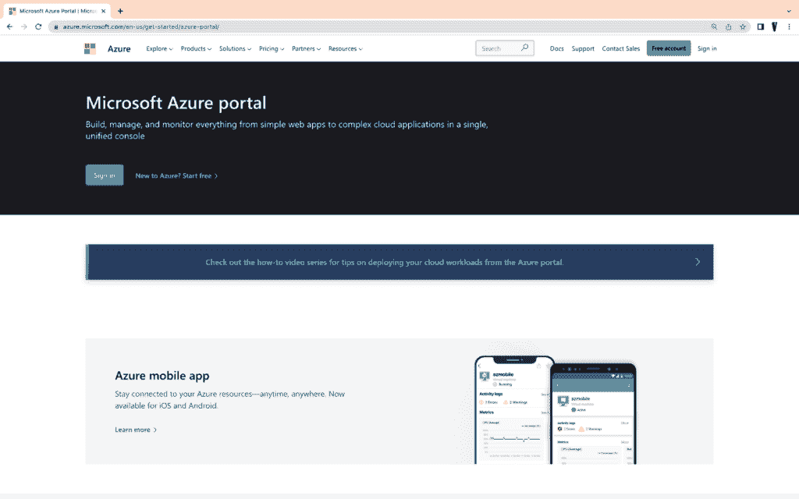</figure>

创建帐户并登录后，您将看到以下页面:

<figure class="wp-block-image size-large is-resized">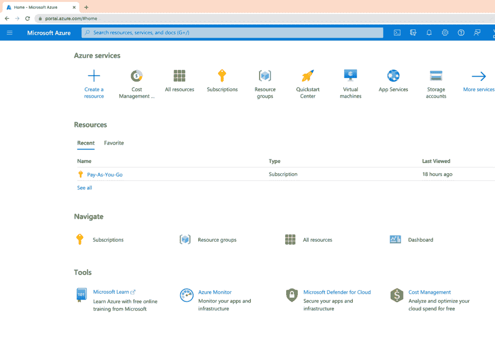</figure>

您可以看到订阅，在本例中是**现收现付**。你还可以看到选项**创建资源，**将在 Azure 中创建数据块资源。点击它，在搜索栏中输入 **Azure Databricks** ，你会看到以下内容:

<figure class="wp-block-image size-large">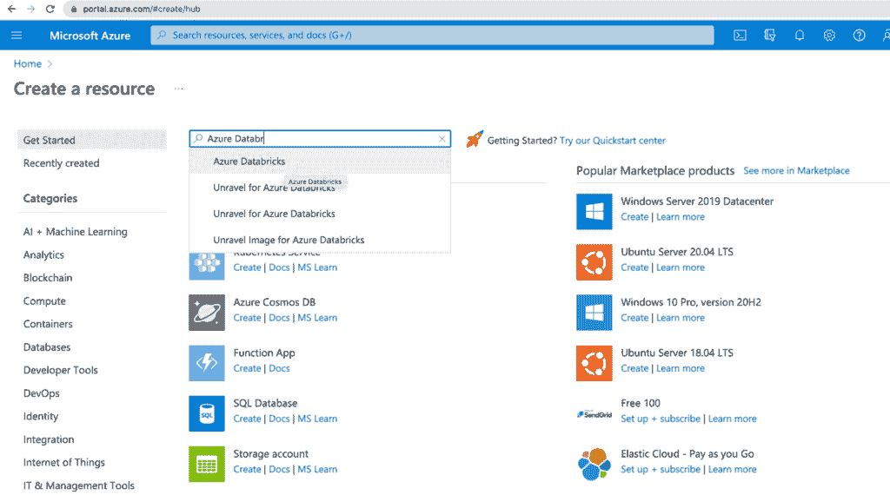</figure>

点击数据块的**创建**按钮。

<figure class="wp-block-image size-large">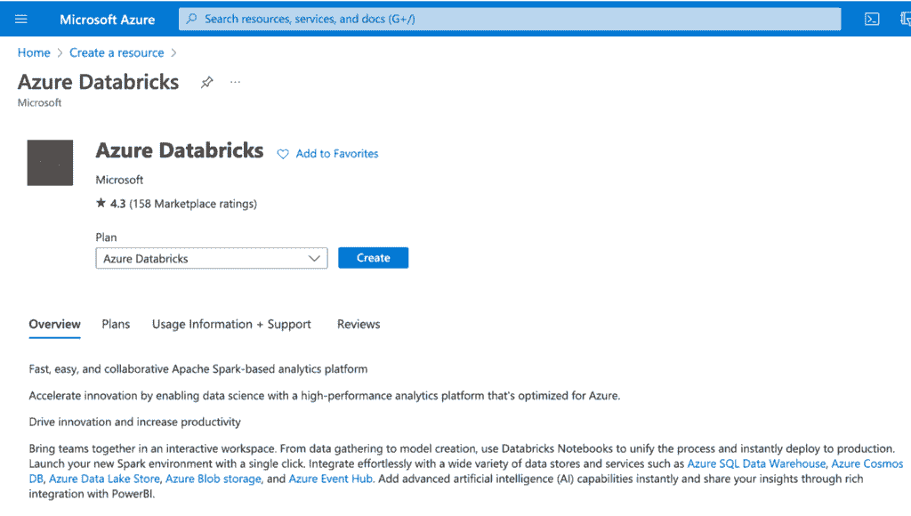</figure>

填写必填字段，如订阅、区域、资源组等。然后，点击**审核+创建**。您必须为资源组和数据块工作区指定一个唯一的名称。

<figure class="wp-block-image size-large">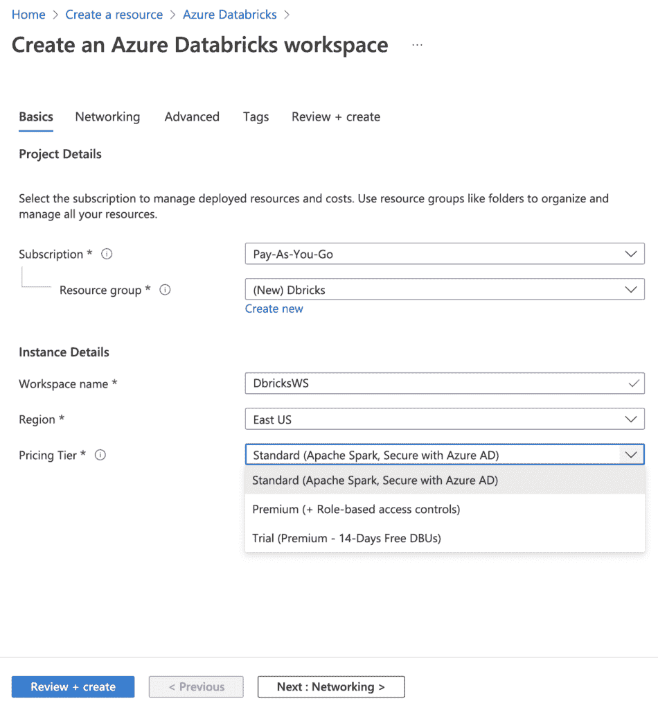</figure>

最后，单击 **Create** 开始创建您的数据块资源！请注意，这可能需要几分钟才能完成。

<figure class="wp-block-image size-large"></figure>

创建资源后，您可以点击**转到资源**以转到该资源。

<figure class="wp-block-image size-large">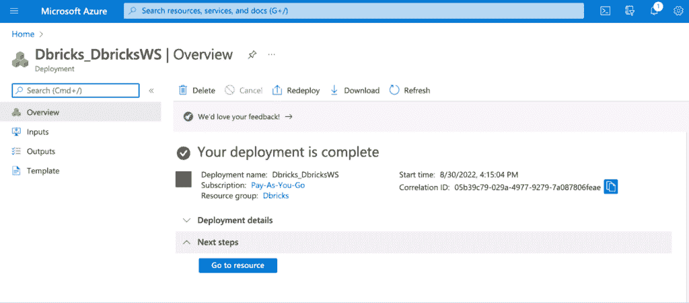</figure>

数据块页面将如下所示:

<figure class="wp-block-image size-large">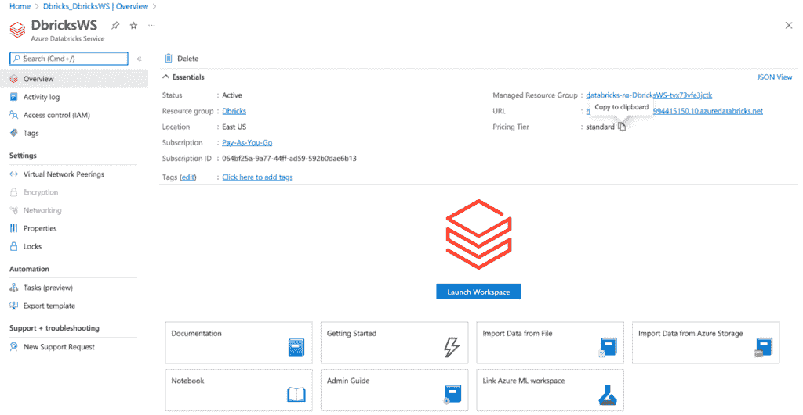</figure>

点击**启动工作区**进入 Azure Databricks 环境。

## 创建集群

下一步是创建一个新的 Databricks 集群。为此，点击 **Create，**，然后选择 Azure Databricks 工作区左侧面板中的**集群**按钮。

<figure class="wp-block-image size-large">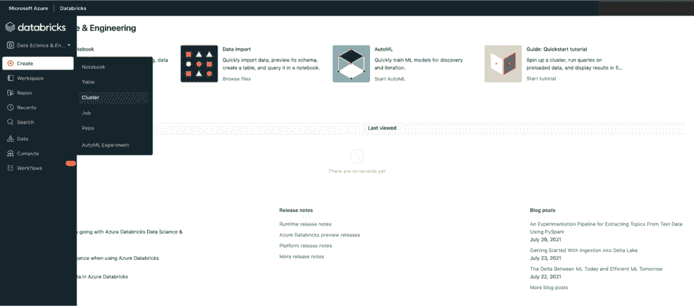</figure>

在下一页上，指定新集群的配置。例如，您可以指定**访问模式**中的用户数量，还可以定义节点类型和运行时版本。注意，在本教程中，我们指定了**单节点，**，但是您也可以自由接受默认设置。

<figure class="wp-block-image size-large">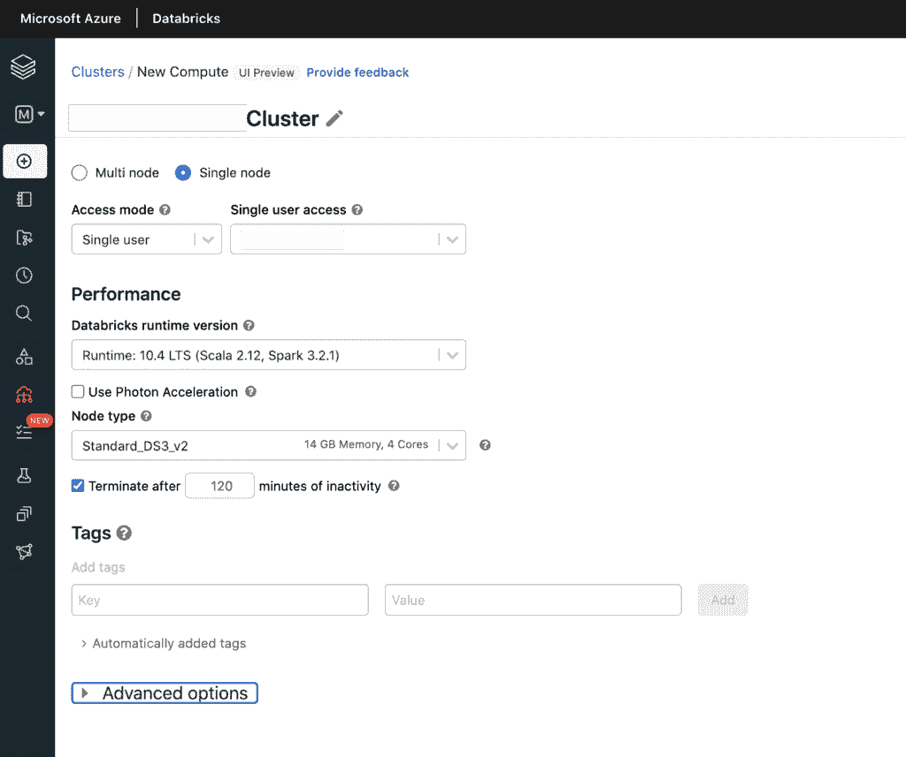</figure>

为新集群指定配置后，单击**创建集群**按钮。这将创建集群，并将显示以下页面。请注意，这可能需要几分钟才能完成。

<figure class="wp-block-image size-large">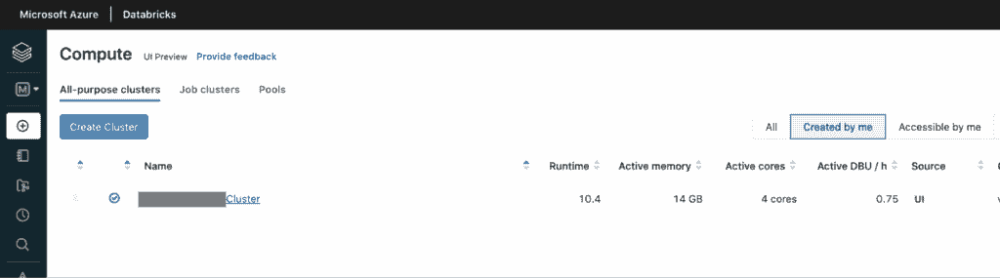</figure>

## 启动笔记本

您将在 Databricks 工作区内的 Python 笔记本中运行您的机器学习代码。要启动笔记本，请点击 **Create，**，然后在您的 Databricks 工作区内选择左侧边栏中的**笔记本**图标。

<figure class="wp-block-image size-large">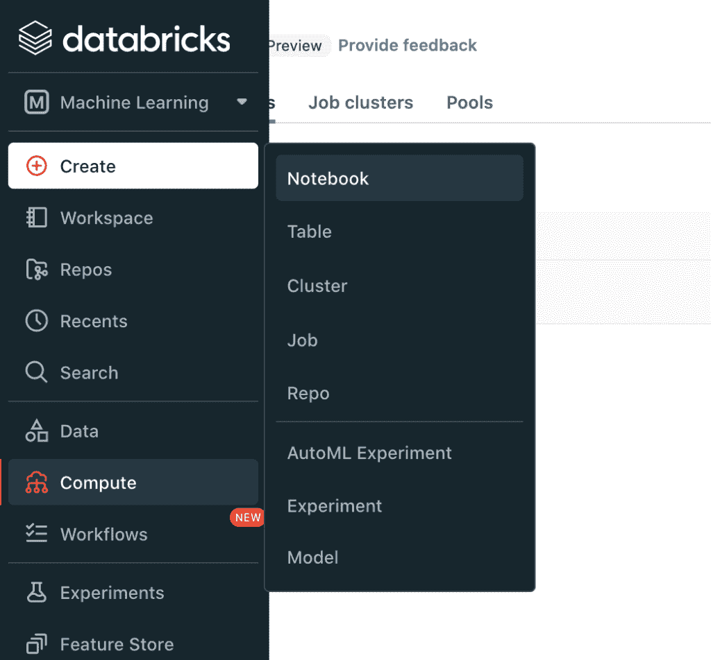</figure>

现在，系统会提示您为新笔记本命名并选择语言。出于我们的目的，为您的笔记本取一个唯一的名称，并选择 Python 作为语言。

<figure class="wp-block-image size-large">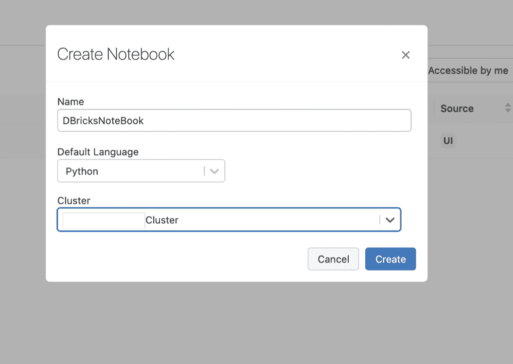</figure>

点击**创建，**，您将能够看到您刚刚创建的笔记本。

<figure class="wp-block-image size-large">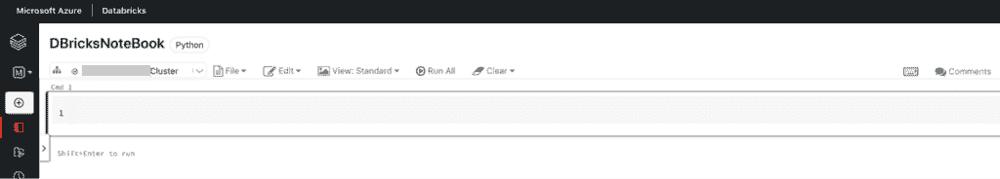</figure>

创建笔记本后，您将进入笔记本的编辑器页面，在这里您可以开始编写和运行代码！现在让我们开始一些机器学习！

## 加载数据

在建立机器学习模型之前，我们需要加载数据。我们将使用由`seaborn`库提供的一个内置数据集。Seaborn 的库中有许多重要的数据集。安装后，这些软件会自动下载并随时可用！以下命令导入库并提供从 **`seaborn`** 库中可用的数据集列表。

```
import pandas as pd
import seaborn as sns
sns.get_dataset_names()
```

这将返回 seaborn 中可用数据集的列表，如下所示:

```
Out[1]: ['anagrams', 'anscombe', 'attention', 'brain_networks', 'car_crashes', 'diamonds', 'dots', 'dowjones', 'exercise', 'flights', 'fmri', 'geyser', 'glue', 'healthexp', 'iris', 'mpg', 'penguins', 'planets', 'seaice', 'taxis', 'tips',...]
```

我们可以用`load_dataset()`函数加载数据集。在本文中，我们将使用`Iris`数据集。这个数据集包含了不同种类的花的信息。您可以根据需要，通过单击向下箭头，然后单击下面的“添加单元”或上面的“添加单元”,轻松创建新的代码块。

<figure class="aligncenter">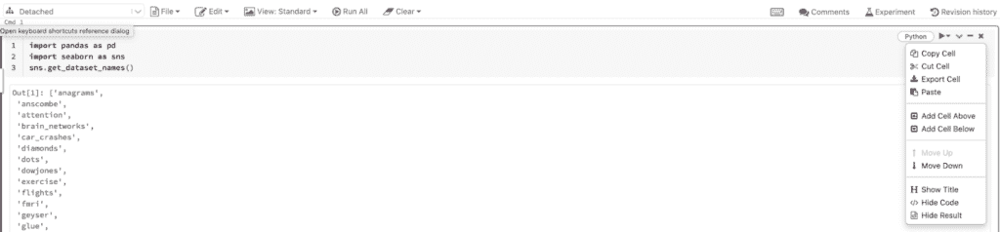</figure>

在新代码块中，加载数据集并使用以下命令查看前五行:

```
df = sns.load_dataset('iris')
df.head()
```

这将产生以下输出:

| |萼片 _ 长度|萼片 _ 宽度|花瓣 _ 长度|花瓣 _ 宽度|种类|
| T1】|–:|——————:|————:|————:|————:|

| 0 | 5.1 | 3.5 | 1.4 | 0.2 | setosa |

| 1 | 4.9 | 3.0 | 1.4 | 0.2 | setosa |
| 2 | 4

<figure class="aligncenter">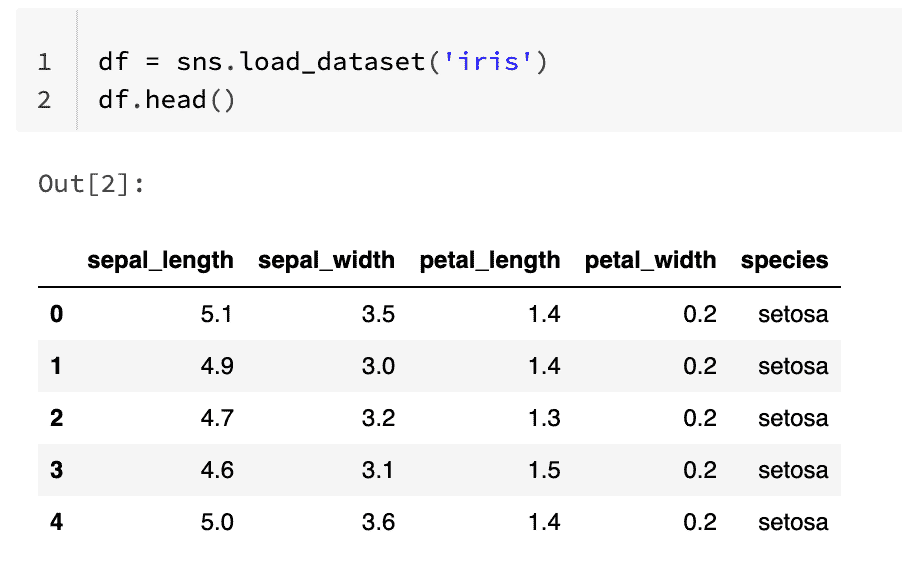</figure>

下载数据集后，我们需要将其分成训练集和测试集。训练集用于训练我们的机器学习模型，而测试集用于评估我们的模型的性能。我们可以使用“scikit-learn”中的“train_test_split()”函数将数据集分成训练集和测试集。这也是导入所有必需库的合适时机。

重现上述结果的代码如下:

```
# Import other required libraries
import sklearn
import numpy as np

# Import necessary modules
from sklearn.linear_model import LogisticRegression
from sklearn.model_selection import train_test_split  
from sklearn.metrics import confusion_matrix, classification_report

# Create arrays for the features and the response variable
y = df['species'].values
X = df.drop('species', axis=1).values 

# Create training and test sets
X_train, X_test, y_train, y_test = train_test_split(X, y, test_size = 0.4, random_state=10) 
X_train.shape, X_test.shape
```

```
Out[3]: ((90, 4), (60, 4))
```

## 建立和评估机器学习模型

现在我们有了训练和测试集，我们可以开始构建我们的机器学习模型了。我们将使用“scikit-learn”中的“LogisticRegression”类来构建我们的模型。

为了训练我们的模型，我们将调用 LogisticRegression 对象上的 fit 函数，并将我们的训练集作为参数传入。在训练我们的模型之后，我们现在可以使用我们的测试集进行预测。为此，我们将调用 LogisticRegression 对象上的 predict 函数，并将测试集作为参数传入。该函数将返回测试集中每个样本的预测列表。

评估你的机器学习模型的性能对于确保你的模型按预期工作很重要。有许多不同的指标可以用来评估机器学习模型的性能。在本文中，我们将使用准确性作为我们的衡量标准。

为了计算我们模型的准确性，我们需要将我们的预测与测试集中的实际标签进行比较。我们可以使用“混淆矩阵”函数来计算我们预测的准确性。

```
logreg = LogisticRegression()
logreg.fit(X_train, y_train)
y_pred = logreg.predict(X_test)
print(confusion_matrix(y_test, y_pred))
print(classification_report(y_test, y_pred))
```

上述命令将产生以下输出:

```
precision recall f1-score support 
setosa 1.00 1.00 1.00 18 
versicolor 1.00 0.96 0.98 24 
virginica 0.95 1.00 0.97 18 

accuracy 0.98 60 
macro avg 0.98 0.99 0.98 60 
weighted avg 0.98 0.98 0.98 60
```

<figure class="aligncenter">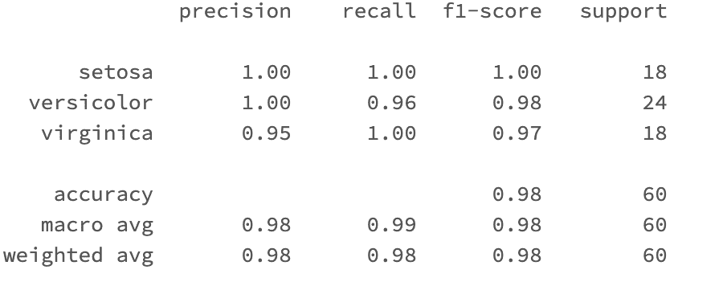</figure>

上面的输出显示，模型准确率为 98%，这是一个很好的结果。

## 结论

在本教程中，您了解了流行的数据科学和机器学习统一分析平台 Azure Databricks。您学习了如何启动 Databricks 工作空间，以及如何使用 Databricks 笔记本构建和评估机器学习模型。您现在已经准备好使用 Azure Databricks 开始您的机器学习之旅了！

最后一步是删除你已经创建的资源，如果你不打算在将来使用它们。这很容易做到。第一步是去 Azure 门户，在那里你可以看到资源组的列表。

<figure class="aligncenter">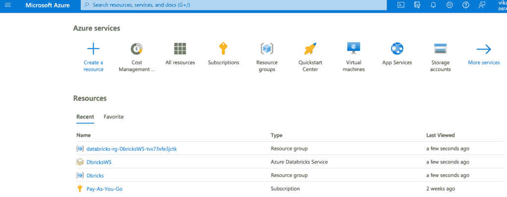</figure>

找到要删除的资源组，然后单击它。

<figure class="aligncenter">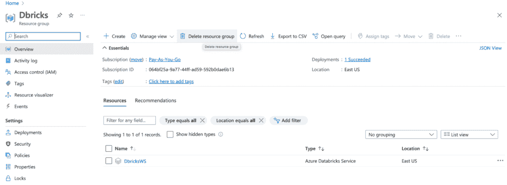</figure>

点击页面顶部的**删除资源组按钮**。

最后，通过键入资源组的名称并点击**删除**按钮来确认删除。