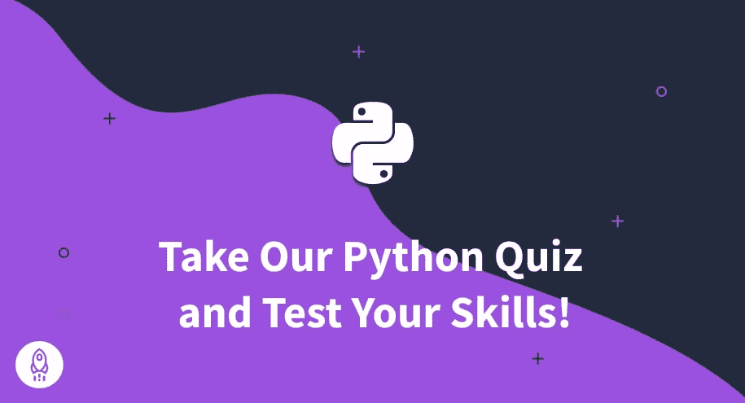

# 免费 Python 测验-测试您的技能(2023)

> 原文：<https://www.dataquest.io/blog/free-python-quiz/>

November 21, 2022

Dataquest 的数据专家为您带来了这个 Python 测验，它将帮助您确定您在数据科学学习之旅中的位置。

这个 Python 测验包括 23 个基础和中级问题，将帮助您确定自己在 Python 中的优势和劣势。在本文的最后，我们将提供 Dataquest 课程和博客的有用链接，您可以使用它们来提高您的 Python 技能。

完成 Python 测试的预计时间大约为 10-15 分钟。我们还提供了每个问题的正确答案和简短解释。