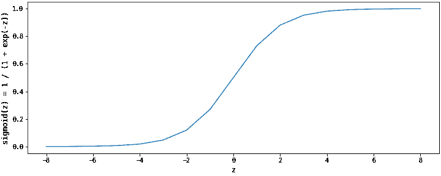
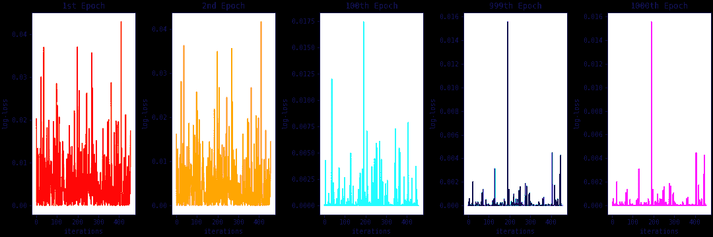
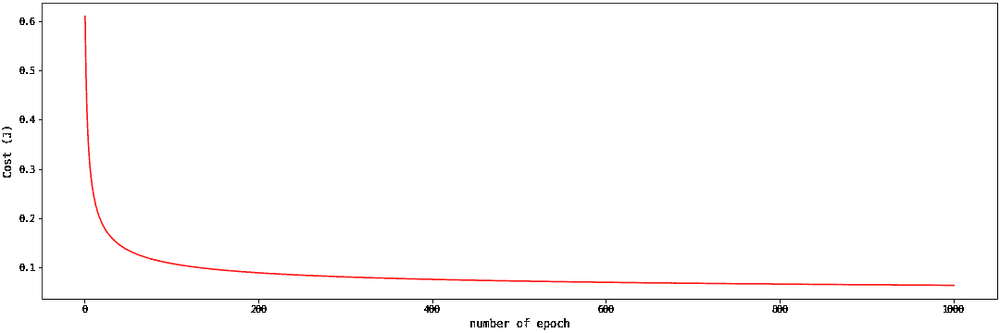
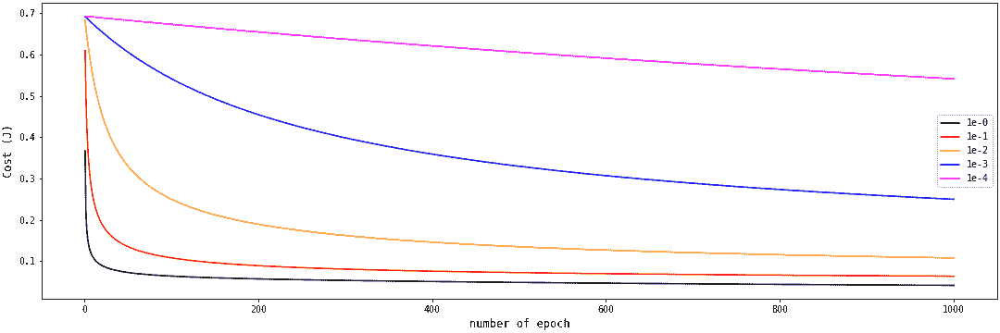
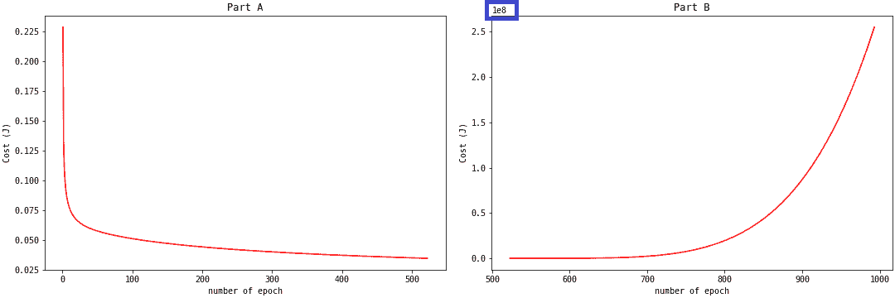

# Python 中的逻辑回归介绍(有 100 多个代码示例)

> 原文：<https://www.dataquest.io/blog/logistic-regression-in-python/>

November 21, 2022

**逻辑回归**算法是一种用于分类任务的概率机器学习算法。这通常是您尝试分类任务的第一个分类算法。与许多似乎是黑箱的机器学习算法不同，logisitc 回归算法很容易理解。

在本教程中，您将了解到关于逻辑回归算法的所有知识。首先，您将创建一个定制的逻辑回归算法。这将有助于你理解幕后发生的一切，以及如何调试你的逻辑回归模型的问题。接下来，您将学习如何训练和优化逻辑回归算法的 Scikit-Learn 实现。最后，您将学习如何使用该算法处理多类分类任务。

本教程涵盖了`L1`和`L2`正则化、使用网格搜索的超参数调整、使用管道的自动化机器学习工作流、one vs rest 分类器、面向对象编程、模块化编程以及使用 docstring 记录 Python 模块。

* * *

## 构建您自己的定制逻辑回归模型

在本节中，您将使用随机梯度下降构建自己的自定义逻辑回归模型。这种逻辑回归算法可以用批量、小批量或随机梯度下降来训练。

在批量梯度下降中，整个训练集用于在一个时期后更新模型参数。对于非常大的训练集，最好用数据的随机子集来更新模型参数，因为用整个集合来训练模型在计算上将是昂贵的。这就是小批量梯度下降背后的想法。在随机梯度下降中，在对训练集中的每个单个数据点进行训练之后，更新模型参数。当列车组很小时，可以使用这种方法。

总而言之，假设我们有一个包含`m`行的训练集。批量大小`n`，用于训练和更新以下模型参数:

*   批量梯度下降:$n = m$
*   小批量梯度下降:$1 < n < m$
*   随机梯度下降:$n = 1$

我们的列车组中的行数`m`很少。在我们的例子中，使用随机梯度下降是可以的。接下来，让我们讨论我们的自定义逻辑回归模型中的方法。

### `__init__`法

要创建一个对象的实例，您需要初始化或分配一些初始值。这些起始值通过`__init__`方法传递。为了创建随机逻辑回归(`SLR`)类的实例，我们必须传递`learning_rate`、`n_epochs`和`cutoff`参数。

此外，我们还初始化了截距、`b`和系数`w`值。这些是我们希望使用梯度下降优化的值。

```
class SLR(object):
    """
    This is the SLR class
    """
def __init__(self, learning_rate=10e-3, n_epochs=10_000, cutoff=0.5):
        """
        The __init__ method
        Params:
            learning_rate
            n_epochs
            cutoff
        """
        self.learning_rate = learning_rate  
        self.n_epochs = n_epochs   
        self.cutoff = cutoff

        self.w = None
        self.b = 0.0
```

### `__repr__`法

方法帮助我们制作自己的对象的可打印表示。为了理解这是如何工作的，让我们打印没有`__repr__`方法的`SLR`类:

#### 创建 SLR 类的一个实例

```
slr0 = SLR()
```

#### 打印 slr0 对象

```
print(slr0)
```

当我们在没有`__repr__`方法的情况下打印`SLR`类的实例时，输出的是对象在内存中的地址。使用`__repr__`方法，我们定义我们想要如何打印对象，如下所示:

```
class SLR(object):
    ...

    def __init__(self, learning_rate=10e-3, n_epochs=10_000, cutoff=0.5):
        ...

        self.learning_rate = learning_rate  
        self.n_epochs = n_epochs   
        self.cutoff = cutoff

        ...

    def __repr__(self):
        params = {
            'learning_rate': self.learning_rate,
            'n_epochs': self.n_epochs,
            'cutoff': self.cutoff
        }
        return "SLR({0}={3}, {1}={4}, {2}={5})".format(*params.keys(), *params.values())
```

#### 创建 SLR 类的一个实例

```
slr1 = SLR()
```

#### 打印 slr1 对象

```
print(slr1)
```

我们的`SLR`类的新实例准确地打印了我们在`__repr__`方法中定义的内容。为了简洁起见，我们从 SLR 类中排除了一些东西。我们将使用省略号`...`来表示项目被排除的部分。

### `sigmoid`法

sigmoid 方法是逻辑回归算法的核心。它将线性函数$z = {w^T}x + b$映射到开区间$(0，1)$。sigmod 方法输出的概率值将与预测的临界值进行比较。它在数学上表示为:$ { \ large { 1 } over { 1+e^{-z}}}}$

sigmoid 函数的形状如下图所示。sigmoid 函数的渐近线在$z$变为$+\infty$时接近值$1$,在$z$变为$-\infty$时接近值$0$。



```
class SLR(object):
    ...

    def __init__(self, learning_rate=10e-3, n_epochs=10_000, cutoff=0.5):

        ...

    def __repr__(self):

         ...    

    def sigmoid(self, z):
        """
        The sigmoid method:
        Param:
            z
        Return:
            1.0 / (1.0 + exp(-z))
        """
        return 1.0 / (1.0 + np.exp(-z))
```

### `predict_proba`法

此方法预测每一行的概率值。使用截距`b`和系数`w`参数计算线性函数值`z`。`z`的值被传递给`sigmoid`方法以获得一个概率值。

```
class SLR(object):
    ...

    def __init__(self, learning_rate=10e-3, n_epochs=10_000, cutoff=0.5):
        ...

    def __repr__(self):
        ...   

    def sigmoid(self, z):
        ...

    def predict_proba(self, row):
        """
        The predict_proba
        Param:
            row
        Return:
            sigmoid(z)
        """
        z = np.dot(row, self.w) + self.b
        return self.sigmoid(z)
```

### `fit`法

该方法采用随机梯度下降来更新`w`和`b`参数。首先要做的事情之一是初始化`w`和`b`的参数。`b`的值被设置为`0.0`，而`w`中的值被设置为`zeros`，如下图所示:

```
class SLR(object):
    ...

    def __init__(self, learning_rate=10e-3, n_epochs=10_000, cutoff=0.5):
        ...
        self.w = None
        self.b = 0.0
    ...

    def fit(self, X, y):
        ...

        self.w = np.zeros(X.shape[1]) 

        ... 
```

接下来的重要步骤是使用`b`和`w`的值来计算概率值，并计算相对于`w`和`b`的梯度。这些用数学方法表示如下:

*   计算一个概率值，`yhat`:$ \ hat { y _ I } $ = $ { \ large { 1 \ over { 1+e^{-z_i}}}}$
*   计算梯度 w.r.t `b`，`grad_b`:$ \ nabla _ b = \ hat { y _ I }–y _ I $
*   计算梯度 w.r.t `w`，`grad_w`:$ \ nab la _ w = x _ I(\ hat { y _ I }–y _ I)$

```
class SLR(object):
    ...

    def fit(self, X, y):
        ...

        for n_epoch in range(1, self.n_epochs + 1):
            losses = []
            for i in range(self.m):
                # Calculate the probability value for a row
                yhat = self.predict_proba(X[i])
                # Calculate the gradient w.r.t b
                grad_b = yhat - y[i]
                # Calculate the gradient w.r.t w
                grad_w =  X[i] * (yhat - y[i]) 
```

最后的步骤是使用学习率$\alpha$更新`b`和`w`的值，并计算损失函数:

*   更新`b`的值:$ b = b –\ alpha \ nab la _ b $
*   更新`w`的值:$ w = w –\ alpha \ nab la _ w $
*   计算对数损失:$-(y _ I \ log(\ hat { y } _ I+(1–y _ I)\ log((1 –\ hat { y } _ I))$

```
class SLR(object):
    ...
    def fit(self, X, y):
        ...

        for n_epoch in range(1, self.n_epochs + 1):
            losses = []
            for i in range(self.m):
                ...        
                # Update the value of w
                self.w -= self.learning_rate * grad_w / self.m
                # Update the value of b
                self.b -= self.learning_rate * grad_b / self.m
                # Calculate the log-loss
                loss = -1/self.m * (y[i] * np.log(yhat) + (1 - y[i]) * np.log(1 - yhat))
                losses.append(loss)
            # Calculate the cost fuction
            self.cost.append(sum(losses)) 
```

在一个时期的训练之后，为该时期计算成本函数。成本函数是损失函数的平均值。如果你想了解更多关于梯度下降和参数是如何得出的，请阅读 DataQuest 上的这篇文章。

将`fit`方法中的所有内容放在一起，我们得到:

```
class SLR(object):
    ...

    def __init__(self, learning_rate=10e-3, n_epochs=10_000, cutoff=0.5):
        ...

    def __repr__(self):
        ...   

    def sigmoid(self, z):
        ...

    def predict_proba(self, row):
        ...

    def fit(self, X, y):
        """
        The fit method implement stochastic gradient descent
        Param
            X, y
        Return
            None
        """
        if not isinstance(X, np.ndarray):
            X = X.to_numpy()

        if not isinstance(y, np.ndarray):
            y = y.to_numpy()

        self.w = np.zeros(X.shape[1])
        self.cost = []

        self.m = X.shape[0]
        self.log_loss = {}
        self.cost = []

        for n_epoch in range(1, self.n_epochs + 1):
            losses = []
            for i in range(self.m):
                yhat = self.predict_proba(X[i])
                grad_b = yhat - y[i]
                grad_w =  X[i] * (yhat - y[i])

                self.w -= self.learning_rate * grad_w / self.m
                self.b -= self.learning_rate * grad_b / self.m
                loss = -1/self.m * (y[i] * np.log(yhat) + (1 - y[i]) * np.log(1 - yhat))
                losses.append(loss)

            self.cost.append(sum(losses)) 
```

### `predict`法

这种方法用于进行离散预测。它使用`predict_proba`方法获得概率值，然后将这些概率值与临界值进行比较。低于临界值的概率值属于一个类，大于或等于临界值的概率值属于另一个类。

```
class SLR(object):
    ...

    def __init__(self, learning_rate=10e-3, n_epochs=10_000, cutoff=0.5):
        ...

    def __repr__(self):
        ...    

    def sigmoid(self, z):
        ...

    def predict_proba(self, row):
        ...

    def fit(self, X, y):
        ...

    def predict(self, X):
        if not isinstance(X, np.ndarray):
            X = X.to_numpy()

        self.predict_probas = []
        for i in range(X.shape[0]):
            ypred = self.predict_proba(X[i])
            self.predict_probas.append(ypred)

        return (np.array(self.predict_probas) >= self.cutoff) * 1.0 
```

### `score`法

该方法用于使用模型的训练参数来计算准确度分数。它使用`predict`方法进行离散预测，并将这些值与实际值进行比较。

```
class SLR(object):
    ...

    def __init__(self, learning_rate=10e-3, n_epochs=10_000, cutoff=0.5):
        ...

    def __repr__(self):
        ...    

    def sigmoid(self, z):
        ...

    def predict_proba(self, row):
        ...

    def fit(self, X, y):
        ...

    def predict(self, X):
        ...

    def score(self, X, y):
        """
        The score method
        Param
            X, y
        Return
            accuracy_score(y, ypred)
        """
        ypred = self.predict(X)
        y = y.to_numpy()
        return accuracy_score(y, ypred)
```

### 逻辑回归模块

将所有内容放入 python 脚本(`.py`文件)并保存(`slr.py`)为我们提供了一个定制的逻辑回归模块。通过导入，您可以在逻辑回归模块中重用代码。您可以在多个 Python 脚本和 Jupyter 笔记本中使用您的自定义逻辑回归模块。

请务必将模块与您将要使用的脚本或笔记本保存在同一个目录中。让我们假设我们的`slr.py`文件保存在`logreg`目录中。在下一节中，我们将使用自定义模块。

#### ../logreg/slr.py

```
"""
    # slr.py 
    This is stochastic logistic regression module
    To use:
        from slr import SLR
        # Import the SLR class from the module and use its methods
        log_reg = SLR()      # Initialization with default params
        log_reg.fit(X, y)    # Fit with train set
        log_reg.predict(X)   # Make predictions with test set
        log_reg.score(X,y)   # Get accuracy score

    Method:
        __init__
        __repr__
        sigmoid
        predict
        predict_proba
        fit
        score   
"""
import numpy as np
from sklearn.metrics import accuracy_score

class SLR(object):
    """
    This is the SLR class
    """

    def __init__(self, learning_rate=10e-3, n_epochs=10_000, cutoff=0.5):
        """
        The __init__ method
        Params:
            learning_rate
            n_epochs
            cutoff
        """
        self.learning_rate = learning_rate  
        self.n_epochs = n_epochs   
        self.cutoff = cutoff

        self.w = None
        self.b = 0.0

    def __repr__(self):
        params = {
            'learning_rate': self.learning_rate,
            'n_epochs': self.n_epochs,
            'cutoff': self.cutoff
        }
        return "SLR({0}={3}, {1}={4}, {2}={5})".format(*params.keys(), *params.values())    

    def sigmoid(self, z):
        """
        The sigmoid method:
        Param:
            z
        Return:
            1.0 / (1.0 + exp(-z))
        """
        return 1.0 / (1.0 + np.exp(-z))

    def predict_proba(self, row):
        """
        The predict_proba
        Param:
            row
        Return:
            sigmoid(z)
        """
        z = np.dot(row, self.w) + self.b
        return self.sigmoid(z)

    def predict(self, X):
        if not isinstance(X, np.ndarray):
            X = X.to_numpy()

        self.predict_probas = []
        for i in range(X.shape[0]):
            ypred = self.predict_proba(X[i])
            self.predict_probas.append(ypred)

        return (np.array(self.predict_probas) >= self.cutoff) * 1.0  

    def score(self, X, y):
        """
        The score method
        Param
            X, y
        Return
            accuracy_score(y, ypred)
        """
        ypred = self.predict(X)
        y = y.to_numpy()
        return accuracy_score(y, ypred)

    def fit(self, X, y):
        """
        The fit method implement stochastic gradient descent
        Param
            X, y
        Return
            None
        """
        if not isinstance(X, np.ndarray):
            X = X.to_numpy()

        if not isinstance(y, np.ndarray):
            y = y.to_numpy()

        self.w = np.zeros(X.shape[1])
        self.cost = []

        self.m = X.shape[0]
        self.log_loss = {}
        self.cost = []

        for n_epoch in range(1, self.n_epochs + 1):
            losses = []
            for i in range(self.m):
                yhat = self.predict_proba(X[i])
                grad_b = yhat - y[i]
                grad_w =  X[i] * (yhat - y[i])

                self.w -= self.learning_rate * grad_w / self.m
                self.b -= self.learning_rate * grad_b / self.m
                loss = -1/self.m * (y[i] * np.log(yhat) + (1 - y[i]) * np.log(1 - yhat))
                losses.append(loss)

            self.cost.append(sum(losses)) 
```

* * *

## 使用`slr`模块

#### ../log reg/random . ipynb

```
import slr
from slr import SLR
```

我们已经在这个模块中导入了`slr`模块和`SLR`类。这一步看着眼熟吗？是啊！您过去一定已经导入了几个 Python 库——numpy、pandas 和 matplotlib 被广泛使用。

您可以从它们的文档中了解 Python 库、模块、类、方法和函数。文档字符串是记录 Python 工作原理的一种极好的方式。要查看不熟悉的模块或函数的文档，可以使用`__doc__`属性。您可以使用`dir()`函数查看 Python 对象的方法和属性。

#### slr 模块的属性和方法

```
dir(slr)
```

#### SLR 类的属性和方法

```
dir(SLR)
```

`slr`模块和`SLR`类都有`__doc__`属性。我们可以查看他们的文档字符串中写了什么:

#### slr.py 模块中的 Docstring

```
print(slr.__doc__)

print(SLR.__doc__)
```

让我们也查看一下`sigmoid`和`fit`方法中的文档字符串:

```
print(SLR.sigmoid.__doc__)

print(SLR.fit.__doc__)
```

或者，您可以使用`help()`功能查看所有文档字符串:

```
help(SLR)
```

* * *

## 用`slr`理解逻辑回归

#### ../log reg/random . ipynb

```
import numpy as np
import pandas as pd
import matplotlib.pyplot as plt
from sklearn.pipeline import Pipeline
from sklearn.datasets import load_breast_cancer
from sklearn.metrics import classification_report
from sklearn.model_selection import train_test_split
from sklearn.preprocessing import StandardScaler

import warnings
warnings.filterwarnings('ignore')
```

## 加载和拆分数据

### ../log reg/random . ipynb

#### 加载数据

```
bin_data = load_breast_cancer()
X = bin_data.data
y = bin_data.target
```

#### 将数据存储为熊猫对象

```
X = pd.DataFrame(X, columns=bin_data.feature_names)
y = pd.Series(y, name='diagnosis', dtype=np.int8)

pd.options.display.max_columns = X.shape[1]
X.head()
```

#### 目标有两类——二元分类任务

```
y.value_counts()
```

#### 将数据分成训练集和测试集

```
X_train, X_test, y_train, y_test = train_test_split(X, y, train_size=0.75, random_state=47)
```

### 逻辑回归的损失和成本函数

**线性回归**算法使用**均方误差**成本函数。对于线性函数$z = {w^T}x + b$来说，这个代价函数总是凸的。换句话说，在训练期间，成本函数总是接近其全局最小值。

逻辑回归算法使用 sigmoid 函数，它是指数函数。对于均方误差成本函数，此函数并不总是凸的。因此，我们的逻辑回归可能陷入局部最小值。我们必须随机初始化我们的模型并训练几个以确保我们得到最好的结果。

我们在构建`SLR`时将权重初始化为零，因为我们使用的成本函数总是与 sigmoid 函数成凸关系。否则，如果我们使用均方误差成本函数，我们应该随机初始化我们的权重。

用于训练逻辑回归算法的损失函数被称为**对数损失**。它在数学上表示为:

*   **log-loss**= $-y _ I \ cdot \ log \ hat { y }–(1–y _ I)\ cdot \ log(1–hat { y })$。

成本函数$J(w，b)$就是一个历元的对数损失函数的平均值:

*   $J(w，b)=-{ 1 \ over m}\sum^m_{i=1}y_i \ cdot \ log \ hat { y }+(1–y _ I)\ cdot \ log(1–hat { y })$

下图显示了第 1 个、第 2 个、第 100 个、第 999 个和第 1000 个时期的训练集中每一行的对数损失图。在第一个历元中有许多对数损失值的尖峰。随着我们继续训练，峰值减少，在第 1000 个纪元中，我们有许多接近于零的对数损失值。



当我们平均每个历元的对数损失值时，我们得到成本函数。我们期望成本函数值随着历元数的增加而减少。当我们对上述示例的对数损失值进行平均时，成本函数图如下所示:



上面的成本函数图是凸的。成本函数值继续接近全局最小值。如果你有兴趣了解更多关于凸性和对数损失函数的知识，这篇[文章](https://www.baeldung.com/cs/cost-function-logistic-regression-logarithmic-expr)解释了为什么对数损失函数适用于逻辑回归，而均方误差却不适用。而这个[交易所](https://math.stackexchange.com/questions/1582452/logistic-regression-prove-that-the-cost-function-is-convex)试图证明对数损失函数总是凸的。

接下来，让我们看看学习率如何影响成本函数的形状。

### 成本函数和学习率

学习率是我们的 SLR 模型中的一个重要参数。这里，我们用不同的学习速率创建了 SLR 类的五个实例。当学习率很小时，成本函数$Cost (J)$是一条水平直线。

随着我们增加从${10^{-4}}$到$10^{-0}$的学习率，我们得到了 u 形曲线的前半部分。学习率越大，代价函数越快接近全局最小值。



你认为我们应该继续提高学习率吗？当学习率大于 1 时，模型会出现问题。当我们创建一个学习率为 4 的`SLR`类的实例时，我们得到了下图中的**部分 A** 的图:



500 个纪元后的代价函数发生了什么变化？`predict_proba`方法开始输出非常接近于零的概率。对数损失(以及延伸的成本函数)值变成正无穷大。对于`np.inf`日志损失值，您将得到`np.nan`。这是 500 个纪元后发生的事情。在这一点之后，我们无法绘制成本函数图。如果你想观察这些`np.inf`值，你可以在你的对数损耗:`np.nan_to_num(log-loss)`上使用`np.nan_to_num`功能。该功能用非常大的值替换`np.inf`。

在学习率非常大的情况下，成本函数会从 A 部分跳到更大的值(如 b 部分),从而错过全局最小值。因此，选择适当的学习率非常重要。

* * *

## `slr`的表现

在本节中，我们将使用自定义逻辑回归模型进行训练和预测。首先，让我们为我们的模型确定一个基线。

### 基线模型

```
y_train.value_counts(normalize='True')

y_test.value_counts(normalize='True')
```

如果我们预测训练集和测试集中的所有条目的`1`，我们将分别获得 63%和 61%的准确率。因此，63%是我们的训练集的基线。对于测试集是 61%。我们希望我们的定制模型能够超越基线。

### 比例特征

```
X_train.describe()

X_train.info()
```

`describe()`和`info()`方法告诉我们，数据中的特征是不同尺度上的连续变量。在训练之前，我们将首先用`StandardScaler()`函数缩放特征。我们不想手动操作，所以我们将使用`Pipeline`连接缩放和配件:

### 训练`SLR`

#### 用管道连接 StandardScaler()和 SLR()

```
pipe0 = Pipeline([
    ('scaler', StandardScaler()),
    ('lr', SLR(learning_rate=1e-2, n_epochs=1000, cutoff=0.5))
])
```

## 训练模型

```
pipe0.fit(X_train, y_train)
```

### 获得训练集和测试集的准确性

#### 检查他们是否击败了基线模型

```
accuracies = {
    'train accuracy': pipe0.score(X_train, y_train), 
    'test accuracy': pipe0.score(X_test, y_test)
}

print(*accuracies.items())
```

#### 检查测试集的其他分类指标

```
print(classification_report(y_test, pipe0.predict(X_test)))
```

#### 检查训练集的其他分类指标

```
print(classification_report(y_train, pipe0.predict(X_train)))
```

我们的定制`slr`模型在训练和测试集上的表现超过了基线。这太酷了。

接下来，让我们研究一下临界值是否会显著影响预测精度。

### 用`slr`预测

我们将在本节中使用`pipe0`进行预测。然后我们将使用 0.5 的临界值来绘制预测概率。截止点以上的点属于一个类，截止点以下的点属于单独的类。

```
import matplotlib
matplotlib.rcParams['font.family'] = 'monospace'
```

#### 使用管道 0 预测

```
predictions = pipe0.predict(X_test)
predict_probas = pipe0['lr'].predict_probas
cutoff = pipe0['lr'].cutoff
```

#### 绘制预测概率

```
fig = plt.figure(figsize=(15, 5), constrained_layout=True)
x = range(1, len(predict_probas) + 1)
plt.scatter(x, predict_probas, c=predictions, label='predicted probabilities')
plt.plot(x, [cutoff] * len(predictions), color='red', label='cutoff=0.5')

plt.ylabel('Predicted probabilites', fontsize=12)
plt.xlabel('test data', fontsize=12)
plt.legend(loc=7);
```

#### 使用 pipe0 调用精度值

```
print(*accuracies.items())
```

我们可以从上面的图中看到，有接近截止点的值。让我们假设这些值属于错误分类。让我们将截止值降低到 0.35，并观察改进情况:

#### 创建新实例 pipe1，截断值为 0.35

```
pipe1 = Pipeline([
    ('scaler', StandardScaler()),
    ('lr', SLR(learning_rate=1e-2, n_epochs=1000, cutoff=0.35))
])
```

#### 拟合管道 1 实例

```
pipe1.fit(X_train, y_train)
```

#### 获取管道 1 的预测概率

```
predictions = pipe1.predict(X_test)
predict_probas = pipe1['lr'].predict_probas
cutoff = pipe1['lr'].cutoff
```

#### 绘制预测的概率

```
fig = plt.figure(figsize=(15, 5), constrained_layout=True)
x = range(1, len(predict_probas) + 1)
plt.scatter(x, predict_probas, c=predictions, label='predicted probabilities')
plt.plot(x, [cutoff] * len(predictions), color='red', label='cutoff=0.35')

plt.ylabel('Predicted probabilites', fontsize=12)
plt.xlabel('test data', fontsize=12)
plt.legend(loc=5);
```

#### 获取管道 1 精度

```
accuracies1 = {
    'train accuracy': pipe1.score(X_train, y_train), 
    'test accuracy': pipe1.score(X_test, y_test)
}

print(*accuracies1.items())
```

虽然我们的精度没有提高，但我们已经知道，根据我们面临的问题类型，我们可以增加或减少默认值的临界值。

我们的定制逻辑回归模型表现不差。但是我们可以用逻辑回归算法的 **Scikit-Learn** 实现做更多的事情。这个机器学习框架有更多的功能，并且经过了严格的测试。我们将继续使用 Scikit-Learn。

* * *

## Scikit-Learn 逻辑回归模型

在本节中，我们将使用 Scikit-Learn 逻辑回归模型的特性。首先，我们将训练一个没有正则化的逻辑回归模型。然后我们将使用`L1`、`L2`和`L1 and L2`正则化来训练模型。

让我们从 Scikit-Learn 导入这个模型:

```
from sklearn.linear_model import LogisticRegression
```

### 没有正规化

没有调整的训练仅仅意味着将`penalty`参数设置为`none`:

#### 不使用正则化训练 sklearn 逻辑回归模型:pipe2

```
pipe2 = Pipeline([
    ('scaler', StandardScaler()),
    ('lr', LogisticRegression(penalty='none'))
])
```

#### 符合模型

```
pipe2.fit(X_train, y_train)
```

#### Fet 模型精度

```
accuracies2 = {
    'train accuracy': pipe2.score(X_train, y_train), 
    'test accuracy': pipe2.score(X_test, y_test)
}

print(*accuracies2.items())
```

我们可以看到模型过度拟合了列车组。训练和测试精度之间的差异为 12%。正则化的目的是防止过度拟合。

接下来，让我们使用`L1`正则化。

### 随着 L1 正规化

正则化是我们对机器学习算法进行的修改，以减少它们的泛化错误。换句话说，正则化有助于我们提高机器学习模型在它以前没有见过/没有训练过的数据上的性能。

逻辑回归中的正则化仅仅意味着将正则化参数添加到我们的成本函数中:

*   $J(w，b)=-{ 1 \ over m}\sum^m_{i=1}y_i \ cdot \ log \ hat { y }+(1–y _ I)\ cdot \ log(1–hat { y })+{ \ lambda \ over m } r(w _ I)$

参数$\lambda$和$R(w_i)$分别是正则化参数和正则化函数。对于逻辑回归，正则化参数$C$给出为:$ C = { 1 \ over \ lambda } $ 1。对于`L1`正则化，$R(w *i)$被给定为$\sum* {j=1}^p|w_i|$.

使用`L1`正则化的逻辑回归成本函数变为:

*   $J(w，b)=-{ 1 \ over m}\sum^m_{i=1}y_i \ cdot \ log \ hat { y }+(1–y*I)\ cdot \ log(1–hat { y })+{ 1 \ over m \ cdot c } \ sum*{j=1}^p|w_i|$

回想一下$w$是我们模型的系数。因此$|w_i|$是系数的绝对值。

接下来，我们将使用`L1`正则化实现 Scikit-Learn 逻辑回归模型。在此之前，我们先讨论一下`L1`正规化的利弊。`L1`正则化的主要优点是它用于特征选择。不重要特征的权重被设置为零。只留下重要特征的系数。`L1`正则化的缺点是不使用统计技术移除共线的要素。它可以从模型中移除两个共线特征中最具预测性的特征。

我们将使用`solver='saga'`，因为`saga`求解器适用于所有类型的惩罚或正则化。

#### 正则化参数 C=1e-1 的 L1 正则化逻辑回归

```
pipe3 = Pipeline([
    ('scaler', StandardScaler()),
    ('lr', LogisticRegression(penalty='l1', C=1e-1, solver='saga'))
])
```

#### 安装管道

```
pipe3.fit(X_train, y_train)
```

#### 获得精确度

```
accuracies3 = {
    'train accuracy': pipe3.score(X_train, y_train), 
    'test accuracy': pipe3.score(X_test, y_test)
}

print(*accuracies3.items())
```

回想一下，逻辑回归将系数设置为零。让我们从下面的模型中检查这些系数:

```
df_coefficients = pd.DataFrame(
    {
        'feature': X_train.columns,
        'coefficient': pipe3['lr'].coef_[0]
    }
)

df_coefficients
```

让我们只检查下面的重要特性:

```
(
    df_coefficients[df_coefficients.coefficient != 0]
    .sort_values(by=['coefficient'])
)
```

在我们数据中的 30 个特征中，只有少数被 L1 正则化认为是重要的。接下来，让我们看看 L2 正则化如何与逻辑回归一起工作。

### 随着 L2 正规化

对于`L2`正则化，$R(w *i)$被给定为$ { 1 \除以 2 } \总和* {j=1}^pw_i^2$.

使用`L2`正则化的逻辑回归成本函数变为:

*   $J(w，b)=-{ 1 \ over m}\sum^m_{i=1}y_i \ cdot \ log \ hat { y }+(1–y*I)\ cdot \ log(1–hat { y })+{ 1 \ over 2 \ cdot m \ cdot c } \ sum*{j=1}^pw_i^2$

其中，$w_i^2$是模型系数的平方。

`L2`正则化不能执行特征选择，但它用于防止过度拟合。使用`L2`正则化的逻辑回归实现如下:

#### 具有正则化参数 C=1e-1 的 L2 正则化的逻辑回归

```
pipe4 = Pipeline([
    ('scaler', StandardScaler()),
    ('lr', LogisticRegression(penalty='l2', C=1e-1, solver='saga'))
])
```

#### 安装管道

```
pipe4.fit(X_train, y_train)
```

#### 获得精确度

```
accuracies4 = {
    'train accuracy': pipe4.score(X_train, y_train), 
    'test accuracy': pipe4.score(X_test, y_test)
}

print(*accuracies4.items())
```

我们可以从下面的数据框架中观察到，没有任何特征的系数为零。如果我们想要一个具有更少特征的更简单的模型，L2 正则化不是很有帮助。

```
pd.DataFrame(
    {
        'feature': X_train.columns,
        'coefficient': pipe4['lr'].coef_[0]
    }
).sort_values(by=['coefficient'])
```

### 随着 L1 和 L2 正规化

使用`L1`和`L2`正则化的逻辑回归使用`L1`和`L2`正则化函数。这种正则化被称为`elasticnet`，数学上给出如下:

*   $J(w，b)=-{ 1 \ over m}\sum^m_{i=1}y_i \ cdot \ log \ hat { y }+(1–y*I)\ cdot \ log(1 –\ hat { y })+{ 1 \ over m \ cdot c } \ sum*{j=1}^p(\beta \ cdot | w _ I |+{ 1 \ over 2 } \ cdot(1 –\ beta)\ cdot w_i^2)$

参数$\beta$被称为 **L1 比率**。这是`L1`和`L2`正则化对模型系数的混合效果。当这个参数设置为零时，它的`L2`正则化。设置为 1 时，为`L1`正则化。

这种正则化实现如下:

#### 使用 L1 和 L2 正则化的逻辑回归，正则化参数 C=1e-1，L1 比率=0.5

```
pipe5 = Pipeline([
    ('scaler', StandardScaler()),
    ('lr', LogisticRegression(penalty='elasticnet', l1_ratio=0.5, C=1e-1, solver='saga'))
])
```

#### 安装管道

```
pipe5.fit(X_train, y_train)
```

#### 获得精确度

```
accuracies5 = {
    'train accuracy': pipe5.score(X_train, y_train), 
    'test accuracy': pipe5.score(X_test, y_test)
}

print(*accuracies5.items())
```

#### 获取特征系数

```
pd.DataFrame(
    {
        'feature': X_train.columns,
        'coefficient': pipe5['lr'].coef_[0]
    }
)
```

#### 系数设置为零和未设置为零的百分比特征

```
(
    pd.DataFrame(
    {
        'feature': X_train.columns,
        'coefficient': pipe5['lr'].coef_[0]
    })
    .coefficient
    .apply(lambda x: x == 0)
    .value_counts(normalize=True)
)
```

我们使用了 50% L1 比率的正则化。L1 和 L2 正则化对模型系数具有相同的影响。有了这个正则化，我们得到了比单独使用 L1 正则化更重要的特性。

我们还没有尝试调整我们模型的超参数。让我们在下一节看看如何优化模型超参数。

### 使用 GridSearch 进行超参数调整

超参数是我们为了控制学习过程而明确做出的假设。如果我们假设学习率和正则化常数取特定的值，我们不太确定这些值是否实际上是最优的。

为了找到我们模型的最佳超参数，我们可以列出它们的一系列值。网格搜索创建这些参数的组合，并将它们绘制到网格中。我们的评估人员在每个网格上进行训练，并记录所选指标的得分。如果精度是所选的度量，网格搜索从给出最高精度的网格中选择参数作为最佳估计值。

让我们假设我们想要优化一个具有`C`和`LR`超参数的模型。列出的`C`值为`[1e-1, 1e-3]`，`LR`值为`[2e-1, 2e-3]`。网格搜索将训练和评估下面显示的每个网格的准确性。具有最高精确度的一个被选为最佳估计器。


您可以对超参数中的两个以上条目以及两个以上的超参数使用网格搜索。如果使用三个超参数，我们会得到一个立方体形状，而不是一个平面。

让我们使用网格搜索来优化我们的逻辑回归模型。

#### import gridsearchcv

```
from sklearn.model_selection import GridSearchCV
```

#### 创建管道评估器

```
pipe6 = Pipeline([
    ('scaler', StandardScaler()),
    ('lr', LogisticRegression(solver='saga'))
])
```

#### 指定超参数及其值

```
params = {
    'lr__C': [1.0, 1e-1, 1e-2, 1e-3],
    'lr__penalty': ['l1', 'l2', 'elasticnet'],
    'lr__l1_ratio': [0.25, 0.5, 0.75]
}
```

#### 将管道作为估计器来拟合网格搜索

```
grid_pipe6 = GridSearchCV(
    pipe6,
    params,
    cv=5
)

grid_pipe6.fit(X_train, y_train)
```

#### 获得最佳超参数值

```
print(grid_pipe6.best_params_)
```

#### 获得最佳评估者/模型

```
print(grid_pipe6.best_estimator_)
```

#### 探索最佳估计参数字典

```
grid_pipe6.best_estimator_.get_params()
```

#### 获得最佳估计精度

```
accuracies6 = {
    'train accuracy': grid_pipe6.score(X_train, y_train), 
    'test accuracy': grid_pipe6.score(X_test, y_test)
}

print(*accuracies6.items())
```

在本教程中，我们调整了超参数以获得训练集和测试集的最高精度。如果我们在当前列出的值之外进行搜索，也许我们可以获得更好的精确度。例如，如果我们列出的最高参数是最好的，我们可能希望列出更多的参数值，最好的参数在列表的中心。通过这样做，我们可以探索更好的参数的优势。

接下来，我们将看到如何用逻辑回归模型处理多类分类。

* * *

## 用逻辑回归进行多类分类

### 加载多类数据

```
from sklearn.datasets import load_wine

mult_data = load_wine()
X = mult_data.data
y = mult_data.target

X = pd.DataFrame(X, columns=mult_data.feature_names)
y = pd.Series(y, name='class', dtype=np.int8)

X_train, X_test, y_train, y_test = train_test_split(X, y, train_size=0.75, random_state=47)

X_train.head()
```

### 基线模型

#### 获取训练集的基线

```
y_train.value_counts(normalize=True)
```

#### 获取测试集的基线

```
y_test.value_counts(normalize=True)
```

### 训练和优化您自己的 OneVsRestClassifier

在这一部分，我们将训练我们自己的多类分类器。我们将使用 One-Vs-Rest 方法，在该方法中，我们将多类分类任务分成多个二进制分类任务。然后，我们将训练分类器，可以将特定的类与其他类区分开来。

让我们通过转换标签将多类任务分成多个二进制分类任务:

#### class_0 与 rest 分类器的目标变量

```
y0_train = (y_train == 0)
```

#### class_1 与 rest 分类器的目标变量

```
y1_train = (y_train == 1) 
```

#### class_2 与 rest 分类器的目标变量

```
y2_train = (y_train == 2) 
```

#### 创建 class_0 vs rest 分类器

```
mult_pipe0 = Pipeline([
    ('scaler', StandardScaler()),
    ('mult_lr', LogisticRegression(solver='saga'))
])
```

#### 要优化的超参数

```
params = {
    'mult_lr__C': [1.0, 1e-1, 1e-2, 1e-3],
    'mult_lr__penalty': ['l1', 'l2', 'elasticnet'],
    'mult_lr__l1_ratio': [0.10, 0.25, 0.5, 0.75]
}
```

#### 使用 gridsearch 执行优化

```
grid_mult_pipe0 = GridSearchCV(
    mult_pipe0,
    params,
    cv=3
)

grid_mult_pipe0.fit(X_train, y0_train)
```

#### 创建 class_1 vs rest 分类器

```
mult_pipe1 = Pipeline([
    ('scaler', StandardScaler()),
    ('mult_lr', LogisticRegression(solver='saga'))
])
```

#### 要优化的超参数

```
params = {
    'mult_lr__C': [1.0, 1e-1, 1e-2, 1e-3],
    'mult_lr__penalty': ['l1', 'l2', 'elasticnet'],
    'mult_lr__l1_ratio': [0.10, 0.25, 0.5, 0.75]
}
```

#### 使用 gridsearch 执行优化

```
grid_mult_pipe1 = GridSearchCV(
    mult_pipe1,
    params,
    cv=3
)

grid_mult_pipe1.fit(X_train, y1_train)
```

#### 创建 class_2 vs rest 分类器

```
mult_pipe2 = Pipeline([
    ('scaler', StandardScaler()),
    ('mult_lr', LogisticRegression(solver='saga'))
])
```

#### 要优化的超参数

```
params = {
    'mult_lr__C': [1.0, 1e-1, 1e-2, 1e-3],
    'mult_lr__penalty': ['l1', 'l2', 'elasticnet'],
    'mult_lr__l1_ratio': [0.10, 0.25, 0.5, 0.75]
}
```

#### 使用 gridsearch 执行优化

```
grid_mult_pipe2 = GridSearchCV(
    mult_pipe2,
    params,
    cv=3
)

grid_mult_pipe2.fit(X_train, y2_train)
```

#### 获取测试集上 class_0 与 rest 分类器的预测概率值

```
predict_proba_pipe0 = grid_mult_pipe0.best_estimator_.predict_proba(X_test)
```

#### 获取测试集上 class_1 与 rest 分类器的预测概率值

```
predict_proba_pipe1 = grid_mult_pipe1.best_estimator_.predict_proba(X_test)
```

#### 获取测试集上 class_2 与 rest 分类器的预测概率值

```
predict_proba_pipe2 = grid_mult_pipe2.best_estimator_.predict_proba(X_test)
```

#### 创建他们结果的数据框架

```
df_result_proba_test = pd.DataFrame(
    {
        'class_0': predict_proba_pipe0[:, 1],
        'class_1': predict_proba_pipe1[:, 1],
        'class_2': predict_proba_pipe2[:, 1]
    }
)

df_result_proba_test.head()
```

#### 使用概率值获得每个测试集的分类结果

#### 一行被赋予具有最高概率值的类

```
df_result_proba_test.idxmax(axis=1).head()
```

#### 将字符串输出转换为整数

```
y_mult_pred_test = (
    df_result_proba_test.idxmax(axis=1)
    .replace({
        'class_0': 0,
        'class_1': 1,
        'class_2': 2
    })
)
y_mult_pred_test.head()
```

#### 获取测试多类分类报告

```
print(classification_report(y_test, y_mult_pred_test))
```

我们的多类分类器工作出色。让我们看看它在火车布景上的表现。我们可以通过用训练集而不是测试集运行前面代码的后半部分来做到这一点。我们也可以通过为三标签多类分类创建一个模块来做到这一点。

让我们复制下面的代码，并将其作为`onevsall3.py`保存在我们的工作目录中。

../logreg/onevsall3.py

```
"""
####onevsall3.py

This is a custom one vs all classifier for making predictions
for multiclass problems with 3 classes
"""
import numpy as np
import pandas as pd
from sklearn.pipeline import Pipeline
from sklearn.model_selection import GridSearchCV
from sklearn.model_selection import train_test_split
from sklearn.preprocessing import StandardScaler
from sklearn.linear_model import LogisticRegression

def onevsall3(X_train, y_train, X_test, y_test):

    y0_train = (y_train == 0)
    y1_train = (y_train == 1) 
    y2_train = (y_train == 2) 

    mult_pipe0 = Pipeline([
    ('scaler', StandardScaler()),
    ('mult_lr', LogisticRegression(solver='saga'))
    ])

    params = {
        'mult_lr__C': [1.0, 1e-1, 1e-2, 1e-3],
        'mult_lr__penalty': ['l1', 'l2', 'elasticnet'],
        'mult_lr__l1_ratio': [0.10, 0.25, 0.5, 0.75]
    }

    grid_mult_pipe0 = GridSearchCV(
        mult_pipe0,
        params,
        cv=3
    )

    mult_pipe1 = Pipeline([
    ('scaler', StandardScaler()),
    ('mult_lr', LogisticRegression(solver='saga'))
    ])

    grid_mult_pipe1 = GridSearchCV(
        mult_pipe1,
        params,
        cv=3
    )

    mult_pipe2 = Pipeline([
    ('scaler', StandardScaler()),
    ('mult_lr', LogisticRegression(solver='saga'))
    ])

    grid_mult_pipe2 = GridSearchCV(
        mult_pipe2,
        params,
        cv=3
    )

    grid_mult_pipe0.fit(X_train, y0_train)
    grid_mult_pipe1.fit(X_train, y1_train)
    grid_mult_pipe2.fit(X_train, y2_train)

    predict_proba_pipe0 = grid_mult_pipe0.best_estimator_.predict_proba(X_test)
    predict_proba_pipe1 = grid_mult_pipe1.best_estimator_.predict_proba(X_test)
    predict_proba_pipe2 = grid_mult_pipe2.best_estimator_.predict_proba(X_test)

    df_result_proba_test = pd.DataFrame(
    {
        'class_0': predict_proba_pipe0[:, 1],
        'class_1': predict_proba_pipe1[:, 1],
        'class_2': predict_proba_pipe2[:, 1]
    })

    return (
            df_result_proba_test.idxmax(axis=1)
            .replace({
                'class_0': 0,
                'class_1': 1,
                'class_2': 2
            }))
```

#### 从 onevsall3.py 模块导入 onevsall3 函数

从 onevsall3 导入 onevsall3

#### 将测试集数据传递给 valid，以确保其正常工作

```
test_predict_onevsall = onevsall3(X_train, y_train, X_test, y_test)
```

#### 获取测试集分类报告

```
print(classification_report(y_test, test_predict_onevsall))
```

一切看起来都很好！我们的`onevsall3`功能工作正常。让我们看看它在火车布景上的表现。

#### 使用 onevsall3 模块的列车组分类报告

```
train_predict_onevsall = onevsall3(X_train, y_train, X_train, y_train)
print(classification_report(y_train, train_predict_onevsall))
```

我们的多类分类器在训练集和测试集上都表现良好。与其从头开始构建我们自己的 One-Vs-Rest 分类器，不如让我们学习如何使用 Scikit-Learn 实现它。

### sci kit-学习 OneVsRestClassifier

在本节中，我们将对多类数据使用 Scikit-Learn 的 OneVsRestClassifier。为了确保我们获得优异的性能，我们将使用网格搜索来优化超参数。

#### 导入 OneVsRestClassifier

```
from sklearn.multiclass import OneVsRestClassifier
```

#### 创建 OneVsRestClassifier 的实例

```
onevsrest = OneVsRestClassifier(LogisticRegression(solver='saga'))
```

#### 创建连接缩放和训练的管道

```
onevsrest_pipe = Pipeline([
    ('scaler', StandardScaler()),
    ('mult_lr', onevsrest)
])
```

#### 指定要优化的超参数

```
params = {
    'mult_lr__estimator__C': [1.0, 1e-1, 1e-2, 1e-3],
    'mult_lr__estimator__penalty': ['l1', 'l2', 'elasticnet'],
    'mult_lr__estimator__l1_ratio': [0.10, 0.25, 0.5, 0.75]
}
```

#### 火车上休息

```
grid_onevsrest = GridSearchCV(
    onevsrest_pipe,
    params,
    cv=3
)

grid_onevsrest.fit(X_train, y_train)
```

#### 获取模型精确度

```
print(*{
    'test accuracy': grid_onevsrest.best_estimator_.score(X_test, y_test), 
    'train accuracy': grid_onevsrest.best_estimator_.score(X_train, y_train)}
    .items()
)
```

这是很好的性能，但不如我们的`onevsrest3`分类器。Scikit 中有一个`multi_class`参数——学习逻辑回归。其默认值设置为`auto`。当解析多类分类任务时，此参数会检测到它。然后，逻辑回归使用默认的多类分类设置来执行多类分类。

让我们在下一节看看它是如何处理我们的多类分类任务的。

### 逻辑回归`multi_class`参数

#### 为 Scikit-Learn 的逻辑回归多类分类器创建一个管道

```
mult_class_pipe = Pipeline([
    ('scaler', StandardScaler()),
    ('mult_lr', LogisticRegression(solver='saga', multi_class='auto'))
])
```

#### 指定要优化的超参数

```
params = {
        'mult_lr__C': [1.0, 1e-1, 1e-2, 1e-3],
        'mult_lr__penalty': ['l1', 'l2', 'elasticnet'],
        'mult_lr__l1_ratio': [0.10, 0.25, 0.5, 0.75]
    }
```

#### 训练管子

```
grid_mult_class = GridSearchCV(
    mult_class_pipe,
    params,
    cv=3
)

grid_mult_class.fit(X_train, y_train)
```

#### 获取模型精确度

```
print(*{
    'test accuracy': grid_mult_class.score(X_test, y_test), 
    'train accuracy': grid_mult_class.score(X_train, y_train)}
      .items())
```

这是对`OneVsRestClassifier`的改进。然而，它的性能达不到我们定制的`onevsall3`分类器。

* * *

### 结论

在本教程中，我们深入探讨了逻辑回归算法的工作原理。我们从零开始构建自己的逻辑回归模型。我们使用我们的自定义回归模型来了解凸性和选择适当学习率的重要性。最后，我们使用逻辑回归算法的 Scikit-Learn 实现来了解正则化、超参数调整和多类分类。

在接下来的步骤中，如果您对使用和调试逻辑回归模型感到满意，您可能希望开始学习其他常用的分类器，如支持向量机和决策树分类器。