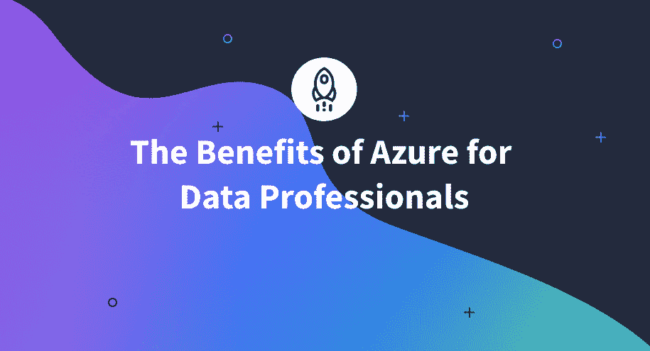

# Azure 给数据专业人员带来的好处(2023 年)

> 原文：<https://www.dataquest.io/blog/benefits-of-azure-for-data-professionals/>

November 28, 2022

如果你是一个有抱负的(或正在工作的)数据专家，那么你应该知道云是数据管理的未来。在云中管理数据的最强大的选择之一是 Microsoft Azure。

Azure 是微软创建的云计算平台和基础设施，用于通过微软管理的数据中心的全球网络来构建、部署和管理应用程序和服务。

在本文中，我们将分享 Microsoft Azure 的主要优势，以及您应该考虑学习如何使用它的原因。

## **微软 Azure 的优势**

有了这么多优势，难怪 [Azure 正成为各种规模的组织的首选平台](https://www.dataquest.io/blog/microsoft-azure-and-cloud-computing/)。Azure 使组织很容易开始使用云计算，它为那些想要迁移到云的人提供了许多选择。

随着基于云的解决方案越来越受欢迎和使用，那些拥有管理这些复杂系统所需技能的人将成为越来越有价值的资产。

下面，你会发现微软 Azure 的主要优势。

### **可扩展性**

Azure 提供了很大的灵活性，可以根据需要快速有效地扩大或缩小规模，这允许组织只为他们使用的资源付费。得益于自动扩展功能，计算、存储、联网和管理数据库等服务可以自动适应组织的需求。

### **灵活性**

Azure 使组织能够从许多不同的部署模型中进行选择，包括公共、私有和混合云部署，并且它提供了管理和监控应用程序的工具，以最大限度地满足他们的需求。例如，一些组织可能希望将 Azure 仅用于开发和测试目的，而其他组织可能希望将其用于生产工作负载。

### **实时处理**

借助 Azure 先进的实时数据处理和物联网(IoT)功能，数据科学家、机器学习工程师和解决方案架构师可以实时处理大量流数据，以前所未有的速度揭示见解。

### **综合分析工具**

凭借 Power BI、Stream Analytics、Data Factory、HDInsight 等一系列内置分析工具，Azure 为数据专业人员提供了一套全面的工具来构建强大的分析应用程序。

### **安全性和合规性**

Azure 提供了一套全面的安全功能，帮助保护静态和传输中的数据:

*   加密、访问控制和审计
*   保护传输中数据的工具，包括 VPN 和 SSL
*   与法规遵从性相关的服务，例如跟踪违规行为和生成报告的能力

## **数据专业人员的优势**

随着许多组织将他们的数据管理转移到云，特别是微软 Azure，精通微软 Azure 的专业人员对他们的雇主来说非常有价值。

无论你是(或想成为)数据科学家、数据分析师、DevOps 工程师、解决方案架构师、数据工程师还是 AI 工程师，Azure 技能都可以帮助你在求职时从其他候选人中脱颖而出。

以下是数据专业人员学习 Azure 的主要好处:

*   **Azure 技能在世界各地的雇主中需求量很大:**雇主越来越重视 Azure 专业知识，他们正在寻找可以帮助他们构建、部署和管理基于云的解决方案的人。随着越来越多的公司过渡到混合或云计算环境，知道如何使用 Azure 可能是获得理想工作的关键因素。一个简单的 [LinkedIn](https://www.linkedin.com/jobs/search/?currentJobId=3358259610&geoId=92000000&keywords=microsoft%20azure&location=Worldwide&refresh=true) 搜索具有 Azure 技能的工作会显示超过 10 万个职位。

*   Azure 技能可以帮助你获得更高的薪水: Azure 专业人员可以期待看到他们的薪水飙升，因为他们帮助企业导航不断变化的云计算世界。美国 Azure 专业人员的[平均年薪为 131，221 美元](https://www.talent.com/salary?job=azure)，入门级职位的起薪估计为每年 110，435 美元。

*   **Azure 技能将使你更加多才多艺，更能适应你工作的组织的环境:**知道如何使用 Azure 提供的服务组合来创建云解决方案会给你信心，并促进你的职业发展。由于您熟悉 Redis 缓存、物联网集线器、HDInsight 集群等概念，您将能够自信地处理涉及多个数据中心和远程位置的混合网络。

*   **Azure 可以帮助你获得其他相关的、受欢迎的技能，这些技能将有助于推动你的职业发展:**在与微软 Azure 合作时，你很可能还会从事当今需求量很大的技能——我们可以假设未来几十年对这些技能的需求将会增加，如开发运维、大数据分析、机器学习、容器和网络。这可以帮助你在一个组织内纵向或横向发展，或者在你的职业生涯中。

*   **Azure 技能将帮助您使您工作的组织更加高效:** Azure 通常可以帮助您改善组织的运营，包括降低基础设施成本、提高敏捷性、提高安全性、改进 IT 流程、推动数字化转型和提高盈利能力。

## **获得 Azure 认证**

如果你想获得云技术给专业人士带来的好处，考虑获得微软 Azure 认证。Azure 的入门级认证“[Microsoft Certified Azure Fundamentals](https://learn.microsoft.com/en-us/certifications/azure-fundamentals/)”将测试你对云概念的基本知识，如 Azure 提供的服务以及价格。

根据皮尔森公司的一项调查，35%的受访者表示在完成认证后薪水有所增加。这个证书可能会让你得到一份工作或者升职。

### **第一步:熟悉微软 Azure**

学习 Microsoft Azure 的第一步是创建一个帐户。

*   [创建一个 Azure 帐户](https://azure.microsoft.com/en-us/free/)(注册后 30 天免费)

创建帐户后，请熟悉界面:

*   [开始使用 Azure 指南](https://azure.microsoft.com/en-us/get-started/)
*   [微软 Azure 简介](https://app.dataquest.io/c/133/m/700)

这里的目标是让自己熟悉这个界面。不要浪费太多时间去阅读所有的东西——你会想要开始用数据练习。

### 第二步:开始学习

您可以使用此参考来了解如何使用 Microsoft Azure:

*   [使用 Microsoft Azure 的云数据](https://www.dataquest.io/path/cloud-data-with-microsoft-azure/)使用 Dataquest 的路径

您将获得如何改进的反馈，Dataquest 提供了确保成功的指导！你不会有任何问题，因为所有的练习都是在 Dataquest 平台上进行的。

您也可以直接从微软学习中心学习:

*   [微软学习平台](https://learn.microsoft.com/en-us/)

### **第三步:用教程练习**

下一步是开始学习微软 Azure 上最流行的服务:

*   [Azure 数据块](https://www.dataquest.io/blog/introduction-to-databricks-in-azure/)
*   [Azure SQL 数据库](https://www.dataquest.io/blog/tutorial-azure-sql-database/)

您还可以按照项目演练在云中创建您的数据解决方案:

*   [在云中创建您的第一个数据解决方案](https://www.youtube.com/watch?v=grNp_ABvk-o&t=660s)

### **第四步:获得认证**

一旦你熟悉了关键的 Azure 服务并完成了几个端到端项目，你就可以准备好参加[微软认证:Azure 数据基础认证](https://learn.microsoft.com/en-us/certifications/azure-data-fundamentals/)。

如果您完成了 Dataquest 的课程，**您将获得 Azure 数据基础认证**的 50%折扣。

* * *

## **结论**

擅长管理 Azure 资源的数据专业人员可以帮助他们的组织节省资金，提高运营效率，并保护关键数据。随着云计算继续彻底改变商业世界，对 Azure 专家的需求肯定会增加，因此这对有抱负的数据专业人士来说是一项伟大的技能。

对于那些想要保持领先并从云技术的巨大潜力中受益的人来说，没有比 Azure 更好的起点了。