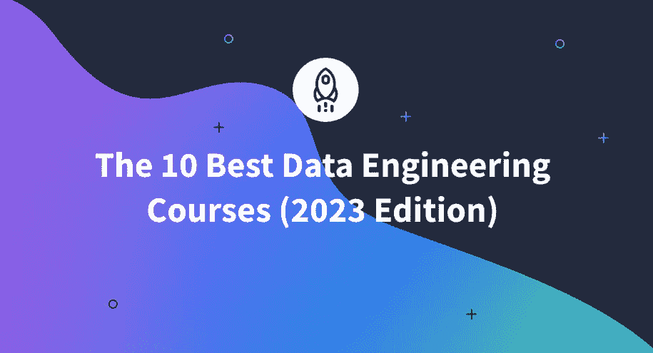

# 10 大最佳数据工程课程(2023 版)

> 原文：<https://www.dataquest.io/blog/best-data-engineering-courses/>

December 14, 2022

我们已经编制了一份数据工程项目和课程的清单，可以让你很快从初学者变成专业人士。根据你现有的知识和对编程的熟悉程度，本指南将帮助你找到最好的数据工程课程。

我们分析了现有的顶级课程，并根据 14 个独特的变量得出了以下列表。

### 以下是 2023 年最佳数据工程课程的总结:

*   **最佳数据工程职业:** [Dataquest 的数据工程师职业道路](https://www.dataquest.io/path/data-engineering/)
*   **最适合谷歌云:** [准备谷歌云认证:云数据工程师职业证书](https://www.coursera.org/professional-certificates/gcp-data-engineering)
*   **Apache Spark 最佳课程:** [用 Apache Spark 和 Python 驯服大数据——动手！](https://www.udemy.com/course/taming-big-data-with-apache-spark-hands-on)
*   【PostgreSQL 最佳课程: [数据工程 PostgreSQL](https://www.dataquest.io/course/postgres-for-data-engineers/)
*   **机器学习最佳课程:** [带 AWS 机器学习的数据工程](https://www.pluralsight.com/courses/data-engineering-aws-machine-learning)
*   **网页抓取最佳课程:** [数据工程— ETL、网页抓取、大数据、SQL、Power BI](https://www.udemy.com/course/data-engineering-etl-web-scraping-big-datasqlpower-bi/)
*   **最佳免费课程:** [数据工程动物园](https://github.com/DataTalksClub/data-engineering-zoomcamp)

 **## **最适合从事数据工程的职业**

### [Dataquest 的数据工程师职业道路](https://www.dataquest.io/path/data-engineering/)

Dataquest 的职业道路包含了您开始从事数据工程职业所需的所有工具和知识。这条路线由 19 门课程和 16 个项目组成，旨在让您立即获得 Python 编程的实践经验。

您将学习如何构建复杂的数据架构、管理数据管道以及使用 pandas、NumPy 和 MapReduce 等工具。您将获得大量的 SQL 编程和数据库经验，这是任何数据工程职业的核心组成部分。

这条道路最好的部分是你将要从事的项目的广度。这些项目将是展示给潜在雇主的很好的作品集。一些项目包括:

*   分析股票价格数据
*   实现键值对数据存储
*   构建黑客新闻数据管道

这门课程为你提供了在数据工程领域开始职业生涯所需的确切知识，而费用只是传统训练营的一小部分。

以下是我们对该课程的详细分析:

<figure class="wp-block-table">

| **价格:**$ 399/年或$ 49/月(提供折扣) | 彻底性:获得工作所需的一切 |
| **前期费用:**无 | **特长:**Python 编程(熊猫、NumPy 等。)SQL 数据库数据管道 |
| **评分:** 4.8 (359 条评论) | **所需先决条件:**
Python 基础知识 |
| 预计持续时间: 5 个月，每周 10 小时 | **定速:**自定速 |
| **认证项目:**是 | 项目数量: 16 |
| 注册学生人数:108，400 人 | **退款选项:**完成后如果不满意可以使用 |
| **计划类型:**职业道路 | **职业服务:**完成认证和强大的社区支持 |

</figure>

学生推荐信

> 你上小课，可以马上练习技能。太方便了。致力于 Dataquest 是一个简单的决定。
> 
> <cite>**—呼延武**</cite>

> 我真的很喜欢在 Dataquest 上学习。我研究了几个其他选项，发现与 Dataquest 的方法相比，它们太容易上手，太容易填空。Dataquest 上的项目是我得到这份工作的关键。我收入翻倍了！
> 
> <cite>**—维多利亚·e·古齐克**</cite>

### [IBM 数据工程专业证书](https://www.coursera.org/professional-certificates/ibm-data-engineer)

Coursera 上提供的 IBM specialization 提供了所有必要的课程和项目，让您为入门级数据工程职位做好准备。该证书是 Coursera 上最受欢迎的专业之一，并带有进入这一职业所需的所有资源。

你将和 16 名不同的教师一起工作，他们有着广泛的背景。你将完成总共 9 个项目，这将有助于建立你的投资组合，展示你的技能。

一些项目包括:

*   设计一个关系数据库来帮助咖啡连锁店改善经营
*   分析道路交通数据以执行 ETL，并使用 Airflow 和 Kafka 创建管道
*   通过创建 Apache Spark 应用程序来训练机器学习模型

总的来说，该课程将向您全面介绍数据工程中最相关的概念，并且在进入就业市场时，它还附带有补充性的职业服务。

以下是我们对该课程的详细分析:

<figure class="wp-block-table">

| **价格:**$ 49/月(EDx 上为$1，076.40) | 彻底性:获得工作所需的一切 |
| **前期费用:** 7 天免费试用 | **特长:** SQL 编程
Hadoop 和 Spark
ETL 数据管道(Kafka、Airflow 等。) |
| **评分:** 4.6 (2，337 条评论) | **所需前提:**基本编程 |
| **预计持续时间:** 15 个月，每周 4 小时 | **定速:**自定速 |
| **认证项目:**是 | **项目数量:** 9 |
| 注册学生人数:28，713 人 | **退款选项:**付款后 14 天内退款 |
| **项目类型:**证书项目 | **职业服务:**完成后获得证书，并获得职业资源以帮助招聘 |

</figure>

<figure class="wp-block-table">

|  | “Coursera 上的课程在我的职业转型中发挥了重要作用。在面试中，我学到了对我帮助很大的技能。”**—乌吉瓦尔 J.** |

</figure>

### [Udacity 数据工程师纳米学位](https://www.udacity.com/course/data-engineer-nanodegree--nd027)

正如 Udacity 所言，“数据工程是大数据新世界的基础”，对此我们深表赞同。数据工程纳米学位是一门为期 5 个月的课程，在这门课程中，你将学习如何管理大规模数据。具体来说，您将设计数据模型、构建数据仓库和湖泊，并实施 ETL，所有这些都是为了让您为使用大数据做好准备。

本课程以一个顶点项目结束，向潜在雇主展示你对数据工程的理解，并增加你的投资组合。该计划的其他好处包括沿途与技术导师合作，获得职业服务为就业市场做准备，以及非常灵活的时间表。

以下是我们对该课程的详细分析:

<figure class="wp-block-table">

| 价格:$ 399/月，$ 1695 5 个月 | 彻底:为就业市场做好一切准备 |
| **前期费用:**前期支付 | **特长:**数据仓库和 LakesData 管道(气流)
Apache Spark |
| **评分:**4.6(1786 条评论) | **所需先决条件:**中级 Python & SQL 编程经验 |
| **预计持续时间:** 5 个月，每周 5-10 小时 | **定速:**自定速 |
| **认证项目:**是 | **项目数量:** 6 |
| **注册学生:**非公立 | **退款选项:**在第一个月的订购日的前两天内退款 |
| **程序类型:**纳米度 | 职业服务:包含在纳米学位项目中 |

</figure>

> 到目前为止，我很惊讶这个项目教会了我这么多。这些练习对我理解和实际编写程序非常有帮助。这个项目的格式与我们通常得到的练习和演示有点不同，所以我对用什么格式写代码有点困惑。但是知识帮我做到了这一点，所以问题不大。
> 
> <cite>**—**戴荣</cite>

### [元数据库工程师职业证书](https://www.coursera.org/professional-certificates/meta-database-engineer)

在脸书拥有超过 20 亿用户的情况下，Meta 当然对大数据略知一二。通过 Coursera 提供的 Meta 数据工程专业证书将为您提供设计、部署和管理大规模结构化和非结构化数据所需的工具。

您将向 Meta 的行业专家学习，并使用专注于 SQL 数据库管理系统、数据建模和使用 Python 的 ETL 框架的工具。证书课程还能帮助你准备技术面试和进入就业市场。

以下是我们对该课程的详细分析:

<figure class="wp-block-table">

| **价格:**$ 49/月 | **周全:**为就业市场做好一切准备 |
| **前期费用:** 7 天免费试用 | **特长:** SQL 编程
Python 编程 |
| **评分:** 4.6 (353 条评论) | **所需先决条件:**
Python 基础知识 |
| **预计持续时间:** 6 个月，每周 6 小时 | **定速:**自定速 |
| **认证项目:**是 | **项目数量:** 5 |
| 注册学生人数:11，786 人 | **退款选项:**付款后 14 天内退款 |
| **项目类型:**证书项目 | 职业服务:帮助准备简历和面试 |

</figure>

> 我在学院是班上的尖子生，我对我所在领域的最新研究非常了解。多亏了 Coursera，这一切才成为可能。
> 
> <cite>**—**悉达多</cite>

## **最适合谷歌云**

### [准备 Google 云认证:云数据工程师职业证书](https://www.coursera.org/professional-certificates/gcp-data-engineering)

如果你曾经想了解谷歌云平台(GCP)，那么你会喜欢谷歌提供的数据工程专业证书。在这个证书课程中，您将学习大数据和机器学习的基础知识，同时使用 GCP 提供的许多服务。

除了完成作业和动手项目，本课程还将为您准备 Google Cloud 认证考试。这项考试是业内公认的，会在你进入就业市场时提升你的简历。

以下是我们对该课程的详细分析:

<figure class="wp-block-table">

| **价格:**$ 49/月 | **彻底性:**关于谷歌云平台的深入课程为谷歌云认证考试做准备 |
| **前期费用:** 7 天免费试用 | **特长:**谷歌云平台谷歌的 BigQueryGCP 机器学习服务 |
| **评分:**4.6(6516 条评论) | **所需先决条件:**中级 SQL 编程知识 Python 基础知识 |
| **预计持续时间:** 5 个月，每周 3 小时 | **定速:**自定速 |
| **认证项目:**是 | **项目数量:**多个 |
| 注册学生人数:71，978 人 | **退款选项:**付款后 14 天内退款 |
| **项目类型:**证书项目 | **职业服务:**准备谷歌云认证考试 |

</figure>

> 能够按照我自己的速度和节奏上课是一种很棒的经历。只要适合我的时间表和心情，我随时都可以学习。
> 
> <cite>**—**—</cite>

## **阿帕奇火花的最佳路线**

### [用 Apache Spark 和 Python 驯服大数据——动手吧！](https://www.udemy.com/course/taming-big-data-with-apache-spark-hands-on)

Apache Spark 是从大型数据集中提取有意义见解的最佳框架之一，被亚马逊、Nasa 和易贝等公司使用。您将向一位前 Amazon 和 IMDB 员工学习，并将涵盖所有 Spark 基础知识，包括弹性分布式数据存储、使用 PySpark 进行 Python 编程，以及扩展您的程序以使用 AWS Elastic MapReduce。

该课程包括 7 个小时的视频和 20 多个真实世界的例子，帮助您入门。您将开发程序来构建和分析社交图，并使用大型数据集来确定 IMDB 等公司如何推荐推荐的电影。

以下是我们对该课程的详细分析:

<figure class="wp-block-table">

| 价格: $24.99 | **彻底性:**侧重于 Apache Spark 和相关框架的深入课程 |
| **前期费用:**前期支付 | **特长:**
Apache spark AWS Elastic MapReduce |
| **评分:** 4.5 (13，959 条评论) | **所需先决条件:**
中级 Python 编程经验
 |
| **预计持续时间:** 7 小时 | **定速:**自定速 |
| **认证项目:**是 | **项目数量:** 2 |
| 注册学生人数:83，761 人 | **退款选项:**符合条件的课程在 30 天内退款 |
| **项目类型:**个人课程 | 职业服务:未提供 |

</figure>

> 让您了解 Apache Spark 和 Python 的绝佳课程！弗兰克的演讲非常透彻，但并不做作；他对自己引入的每个新概念的解释都很实际，也很容易理解。作为 Udacity 数据工程纳米学位项目的一部分，我参加了一个类似的课程，我很高兴我事先参加了 Frank 的课程，因为 Udacity 解释它的方式和他们提供的课程都不清楚，令人困惑。
> 
> <cite>**—阿米里米**</cite>

## 【PostgreSQL 最佳课程

### 用于数据工程的 PostgresSQL】

纯专注 SQL 的最好课程是 Dataquest 的数据工程 PostgreSQL。在本课程中，您将学习 SQL 数据库管理的所有知识，重点是 PostgreSQL，它是当今最流行的数据库平台之一。

您将直接投入到实际例子的工作中，包括建立一个用于分析犯罪报告的数据库。您将进一步提高 Python 编程技能，并学习如何使用 psycopg2 Python 包与 PostgreSQL 进行交互。本课程以一个顶点项目结束，在该项目中，您将分析风暴数据。

以下是我们对该课程的详细分析:

<figure class="wp-block-table">

| **价格:**$ 399/年或$ 49/月(提供折扣) | **彻底性:**专注于 PostgreSQL 的深度课程 |
| **前期费用:**无 | **特长:**PostgreSQL
SQL 编程 Python 编程(重点是 psycopg2) |
| **评分:** 4.8 (359 条评论) | **所需先决条件:**Python 基础知识 |
| **预计持续时间:** 9 小时 | **定速:**自定速 |
| **认证项目:**是 | **项目数量:** 3 |
| 注册学生人数:32200 人 | **退款选项:**完成后如果不满意可以使用 |
| **项目类型:**个人课程 | **职业服务:**完成认证和强大的社区支持 |

</figure>

> 很难找到这种理论和编码示例相结合的资源，这就是为什么当我被介绍给 Dataquest 时我如此兴奋。
> 
> <cite>**—Patrick Nelli**</cite>

## **机器学习的最佳课程**

### [采用 AWS 机器学习的数据工程](https://www.pluralsight.com/courses/data-engineering-aws-machine-learning)

没有对数据的访问，机器学习就无法存在。然而，处理和存储原始数据可能非常具有挑战性。这就是数据工程发挥作用的地方。

理解核心数据工程原理有助于实现成功的机器学习算法。因此，还有什么比将数据工程和机器学习结合到一门课程中更好的学习方法呢！

数据工程和 AWS 机器学习课程将带您了解亚马逊网络服务(AWS)。您将了解通过 AWS 提供的不同数据存储和机器学习服务，以及它们如何协同工作。

在课程结束时，你将知道如何建立完整的机器学习管道，从原始数据开始，到令人惊叹的预测和分类结束。

以下是我们对该课程的详细分析:

<figure class="wp-block-table">

| **价格:**$ 29/月 | **彻底性:**AWS 数据存储和机器学习服务的高级概述 |
| **前期费用:** 10 天免费试用 | **特长:**
AWS 数据存储服务
AWS 机器学习服务 |
| **评分:** 3.5 (26 条评论) | **所需先决条件:**
熟悉 AWS 仪表板 |
| **预计持续时间:** 3 小时 | **定速:**自定速 |
| **认证项目:**否 | **项目数量:**未公开 |
| **注册学生:**非公立 | **退款选项:**不提供退款 |
| **项目类型:**个人课程 | 职业服务:未提供 |

</figure>

## **最佳网页抓取教程**

### [数据工程——ETL、Web 抓取、大数据、SQL、Power BI](https://www.udemy.com/course/data-engineering-etl-web-scraping-big-datasqlpower-bi/)

Web 抓取已经成为数据挖掘和聚合的一个重要组成部分。通过 Udemy 提供的这个课程介绍了在开发 ETL 管道的背景下的 web 抓取。除了 web 抓取之外，您还将学习如何将来自多个来源的数据聚合到一个数据库中。

该课程有 134 堂课，在 12 小时的运行时间里涵盖了大量的材料。但是你将会带走一个关于数据工程和新工具的很好的介绍，向潜在的雇主炫耀。

以下是我们对该课程的详细分析:

<figure class="wp-block-table">

| 价格: $49.99 | **彻底性:**入门级别核心数据工程概念的高级概述 |
| **前期费用:**前期支付 | **特长:**ETL pipelines web scraping
SQL 编程 |
| **评分:** 3.8 (279 条评论) | **所需先决条件:**SQL 基础知识 |
| **预计持续时间:** 12 小时 | **定速:**自定速 |
| **认证项目:**是 | 项目数量: 0 |
| 注册学生人数:25，011 人 | **退款选项:**符合条件的课程在 30 天内退款 |
| **项目类型:**个人课程 | 职业服务:未提供 |

</figure>

## **最佳免费课程**

### [数据工程动物园](https://github.com/DataTalksClub/data-engineering-zoomcamp)

阿列克谢·格里戈里耶夫教授的这门完全免费的课程因其独特的教学方法而榜上有名。该课程为期 9 周，所有材料都通过 [GitHub](https://github.com/DataTalksClub/data-engineering-zoomcamp) 托管。你将成为一个高度参与的社区的一员，在这个社区中，学习者在整个课程期间就各种项目进行合作和[竞争](https://docs.google.com/spreadsheets/d/e/2PACX-1vR9oQiYnAVvzL4dagnhvp0sngqagF0AceD0FGjhS-dnzMTBzNQIal3-hOgkTibVQvfuqbQ69b0fvRnf/pubhtml)。

您将涉及的主题包括数据摄取、数据仓库、批处理和 ETL 管道。为了补充每一课，你将做每周的编程作业来帮助巩固你的知识。总的来说，这是一种有趣且经济的数据工程入门方式。

以下是我们对该课程的详细分析:

<figure class="wp-block-table">

| **价格:**免费 | **彻底性:**入门级别核心数据工程概念的高级概述 |
| **前期费用:**无 | **专业:**数据摄取和 ETL 数据仓库(Google BigQuery)批处理和流式传输 |
| **评级:**不公开 | **必要先决条件:**
熟悉编码和命令行 SQL 基础知识 |
| **预计持续时间:** 9 周，每周 5 小时 | **起搏:**教师起搏 |
| **认证项目:**是 | **项目数量:** 1 |
| **注册学生:**非公立 | **退款选项:**不可用(免费课程) |
| **项目类型:**个人课程 | **职业服务:**不包括 |

</figure>**