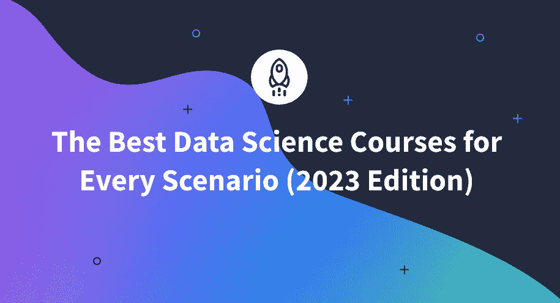

# 适合各种场景的最佳数据科学课程(2023 版)

> 原文：<https://www.dataquest.io/blog/best-data-science-courses/>

December 13, 2022

选择正确的数据科学课程对于实现您的目标至关重要。它可以执行以下操作:

*   为你省钱
*   尽量减少学习时间
*   提供一条通往令人兴奋的新职业的道路
*   让你的发现之旅尽可能愉快

谢天谢地，我们已经做了研究。我们比较了多门课程，并用 14 分制对它们进行了评分。这样，你就可以做出明智的决定，而不会浪费时间或金钱，同时准备开始一个有回报的新职业！

### 以下是 2023 年最佳数据科学课程的总结:

*   **最佳综合数据科学课程:** [Dataquests 的职业道路](https://www.dataquest.io/)
*   **最适合基本面:** [365 职业生涯完整数据科学训练营](https://www.udemy.com/course/the-data-science-course-complete-data-science-bootcamp/)
*   **最适合金融:** [用 Python 火热的数据驱动投资|金融数据科学](https://www.udemy.com/course/data-driven-investing-with-python-financial-data-science)
*   **最适合统计学:** [365 职业统计学适合数据科学和商业分析](https://www.udemy.com/course/statistics-for-data-science-and-business-analysis/)
*   **最佳在线数据科学训练营:** [加州理工学院数据科学训练营](https://pg-p.ctme.caltech.edu/data-science-bootcamp-online-certification-course?utm_source=google&utm_medium=cpc&utm_term=data%20science%20course&utm_content=17201721790-136011410069-634260040751&utm_device=c&utm_campaign=Search-DataCluster-PG-DSBI-CDSB-Caltech-AbsoluteBroadKeywords-US-Main-CaltechDomain-Catchment-adgroup-DS-Course-ABSOLUTE-BROAD&gclid=Cj0KCQiA1ZGcBhCoARIsAGQ0kkocGl8C1owpWKxW3yJSyVXZoRo7NzcCRgL2FPBN3sH-01HwHYrUjqUaArsoEALw_wcB)
*   **最佳现场数据科学训练营:** [纽约数据科学学院](https://nycdatascience.com/)
*   **最佳免费数据科学课程:** [哈佛数据科学:R 基础知识](https://www.edx.org/course/data-science-r-basics?utm_source=aw&utm_medium=787739&utm_content=text-link&utm_term=787739_Best+Choice+Media&awc=6798_1669677925_701ceb160dad8b32a3ff7610c434d3e4&utm_source=aw&utm_medium=787739&utm_content=text-link&utm_term=787739_Best+Choice+Media)

## **最佳整体数据科学课程**

### [Dataquest 的职业道路](https://www.dataquest.io/)

如果你在寻找数据科学职业，那么 Dataquest 课程是你最好的选择。Dataquest 提供全面的职业发展道路，以极低的成本为您提供训练营的一体化结构。

以下是 Dataquest 目前的职业道路:

*   [数据科学家](https://www.dataquest.io/path/data-scientist/)
*   [数据工程师](https://www.dataquest.io/path/data-engineer/)
*   [数据分析师](https://www.dataquest.io/path/data-analyst/)
*   [商业分析师](https://www.dataquest.io/path/business-analyst/)

这些职业道路为你提供了胜任这份工作所需的一切。最棒的是，绝对没有前提条件！

另外，课程会让你从第一天就开始编程。不像其他大多数课程，你不会只是看几个小时的视频讲座。你将完成数百个练习和数十个项目。难怪 97%的学习者推荐 Dataquest 来获得职业发展。

在这篇综述中，我们将关注最受欢迎的职业道路:数据科学家。

<figure class="wp-block-table">

| **价格:**$ 399/年或$ 49/月(提供折扣) | 彻底性:获得工作所需的一切 |
| **前期费用:**免费开始 | **特长:** SQL 和数据库编程机器学习包罗万象的数据科学技能集 |
| **评分:** 4.8 (359 条评论) | **所需先决条件:**无 |
| **预计时长:**全职:2-3 个月；兼职:6-9 个月 | **定速:**自定速 |
| **认证项目:**是 | 项目数量: 26 |
| 注册学生人数:25.9 万人 | **退款选项:**完成后如果不满意可以使用 |
| **学习风格:**编码模块和指导项目 | **职业服务:**社区支持 |

</figure>

#### 学生推荐信

> Dataquest 上的学习路径令人难以置信。你不用猜你接下来该学什么。
> 
> <cite>— **奥塔维奥·西尔维拉**</cite>

> 我真的很喜欢在 Dataquest 上学习。我研究了几个其他选项，发现与 Dataquest 的方法相比，它们太容易上手，太容易填空。Dataquest 上的项目是我得到这份工作的关键。我收入翻倍了！
> 
> <cite>**—维多利亚·e·古齐克**</cite>

## **基本面最佳**

### [365 职业数据科学课程:在 Udemy 上完成数据科学训练营](https://www.udemy.com/course/the-data-science-course-complete-data-science-bootcamp/)

这门数据科学课程在 Udemy 上名列前茅。该课程有超过 100，000 条评论，纳斯达克、大众汽车和 Netapp 等公司向其员工提供了这些评论。

学生喜欢本课程，因为它是理解数据科学基础所需的所有概念的廉价介绍。

<figure class="wp-block-table">

| 价格: $94.99 | 对主要话题的介绍，但是如果你想专攻其中任何一个，你需要更多的教育。 |
| **前期费用:** 100%前期费用 | **专业:**基础 |
| **评分:** 4.6 (115，513 条评论) | **所需先决条件:**无 |
| **预计时长:** 32 小时授课 | **定速:**自定速 |
| **认证项目:**是 | **项目数量:**无 |
| 注册学生人数:548，096 人 | **退款选择:** 30 天全额退款保证。 |
| **学习方式:**带小测验的视频讲座 | 职业服务:无 |

</figure>

#### 学生推荐信

> 这绝对是我迄今为止在数据科学领域所学的最好的课程。老师都很专业，什么都解释的很清楚。
> 
> <cite>—**安东尼诺 n .**</cite>

 **> 这是一堂极好的课，也是对他们所教科目的解释。我会向任何想学这门课的人推荐这门课。如果你上这门课，你会学到新知识。
> 
> <cite>**—阿扎马特 k .**</cite>

## **最适合金融**

### [用 Python 进行狂热的数据驱动投资|金融数据科学](https://www.udemy.com/course/data-driven-investing-with-python-financial-data-science/#reviews)

如果你想利用数据进行财务预测或做出有统计数据支持的投资决策，这个由狂热的定性金融课程是给你的。

您将在本课程中学到的一些内容包括:

*   计算股票回报
*   估计预期收益
*   评估投资组合风险
*   获取财务数据

因为这是一门 Udemy 课程，所以有 30 天无条件退款保证。

<figure class="wp-block-table">

| 价格: $84.99 | **彻底性:**用 Python 实现金融数据科学 |
| **前期费用:** 100%前期费用 | **专业:**金融 |
| **评分:** 4.9 /5 (73 条评论) | **必备条件:**基本编码知识 |
| **预计时长:** 13.5 小时的视频讲座 | **定速:**自定速 |
| **认证项目:**是 | **项目数量:**无 |
| 注册学生人数:1，604 人 | **退款选项:**如果您不满意，可在 30 天内退款 |
| **学习方式:**带练习的视频讲座 | 职业服务:无 |

</figure>

#### 学生推荐信

> 伟大的格式，内容和讲师提供惊人的洞察力。
> 
> <cite>**—**—</cite>

## **最适合统计:**

### [365 数据科学和商业分析职业统计](https://www.udemy.com/course/statistics-for-data-science-and-business-analysis/)

如果你想成为一名数据科学家、商业分析师或数据工程师，如果你理解你所做的事情的基本数学概念，你将拥有优势。我们喜欢这门课程，因为它给了你理解复杂的统计分析的基本技能。

虽然本指南中的其他课程侧重于数据科学的应用，但本课程将让您了解它在数学层面上是如何工作的。不要让这吓到你——好评如潮，说课程材料以简单和吸引人的方式呈现。

即使你现在不是数据科学家，本课程也将帮助你在工作场所做出基于统计的决策。

<figure class="wp-block-table">

| 价格: $84.99 | **彻底性:**你在办公室需要的统计数据 |
| **前期费用:** 100%前期费用 | **专业:**统计 |
| **评分:** 4.6 (159，883 条评论) | **所需先决条件:**无 |
| **预计时长:** 5 个小时的讲座 | **定速:**自定速 |
| **认证项目:**是 | **项目数量:**无 |
| 注册学生: 49 人 | **退款选项:**如果您不满意，可在 30 天内退款 |
| **学习方式:**视频讲座，练习习题 | 职业服务:无 |

</figure>

#### 学生推荐信

> 我在读了一本与 Tensorflow 相关的书后选了这门课，书中使用了很多数学术语，但几乎没有解释，因为它们必须假设读者必须意识到这一点。上过这门课后，我对那些概念理解得更好了。我将把这门课程作为基础课程推荐给任何想进入任何分析领域的人。
> 
> <cite>**—苏米特 c .**</cite>

> 我从未见过任何人以如此简单而有逻辑的方式解释统计学。我相信如果我掌握了这些练习，我会很容易在统计方面出类拔萃。谢谢你创造了这么有趣的课程。
> 
> <cite>**—塞萨尔 b .**</cite>

## **最佳在线数据科学训练营**

### [加州理工数据科学训练营](https://pg-p.ctme.caltech.edu/data-science-bootcamp-online-certification-course?utm_source=google&utm_medium=cpc&utm_term=data%20science%20course&utm_content=17201721790-136011410069-634260040751&utm_device=c&utm_campaign=Search-DataCluster-PG-DSBI-CDSB-Caltech-AbsoluteBroadKeywords-US-Main-CaltechDomain-Catchment-adgroup-DS-Course-ABSOLUTE-BROAD&gclid=Cj0KCQiA1ZGcBhCoARIsAGQ0kkocGl8C1owpWKxW3yJSyVXZoRo7NzcCRgL2FPBN3sH-01HwHYrUjqUaArsoEALw_wcB)

根据《泰晤士报高等教育版》的统计，2022 年，加州理工学院是美国第二好的大学。在本课程中，他们与 IBM 合作建立了一个一流的训练营。这个课程是为职业人士设计的，提供黑客马拉松和社交机会。

与其他一些数据科学训练营不同，它是专门为希望从另一个领域过渡到数据科学的专业人士设计的。

如果你正在寻找一所高排名学校的在线训练营，加州理工学院是一个不错的选择。

<figure class="wp-block-table">

| **价格:**8000 美元 | **彻底:**过渡到数据科学所需的一切 |
| **前期费用:** 100%，但有灵活的支付选项 | **专业:**数据科学 |
| **评分:** 4.6/5 (352 条评论) | **所需先决条件:**高中文凭，18 岁以上，最好有 2 年以上正式工作经验 |
| **预计持续时间:** 5 个月，每周 5-10 小时 | **调步:**周结构 |
| **认证项目:**是 | **项目数量:** 1 个顶石项目 |
| 注册学生人数:2500 人 | **退款选项:**购买七天内退款。 |
| **学习方式:**在线讲座、编码模块、教程、项目、黑客马拉松 | **职业服务:**一对一辅导&招聘合作伙伴 |

</figure>

#### 学生推荐信

> 优秀的课程设计。自学是一个很棒的方法。作为一名学生，我学到了很多以前没有的知识。我参加了一个项目，这个项目保证了我在数据科学领域的职业生涯。此外，该品牌在市场上也很有名。完全物有所值。
> 
> <cite>**—阿克什特·普拉萨德**</cite>

## **最佳现场数据科学训练营**

### [纽约数据科学院](https://nycdatascience.com/)

如果你正在寻找一个亲身的训练营体验，纽约数据科学学院是评价最高的学院之一。他们被认可的训练营和职业发展课程都在纽约市。

昂贵的价格标签对一些人来说可能是值得的——他们吹嘘他们的毕业生的平均年薪是 94280 美元。

与其他一些选择不同，纽约市数据科学院极具竞争力且严谨。你需要完成一次视频面试，讨论你的背景和职业目标。

<figure class="wp-block-table">

| 价格:17600 美元 | 彻底性:获得工作所需的一切 |
| **前期费用:** $5000 接受后的存款，以确保您的位置。 | **专业:**数据科学与机器学习 |
| **评分:** 4.89/5 (356 条评论) | **必要的先决条件:**学士、硕士或博士 40 小时的在线课程，一旦你被录取。 |
| **预计持续时间:** 12 周(全职)，24 周(兼职) | **配速:**每周 40 小时以上。 |
| **认证项目:**是 | **项目数量:**众多小项目贯穿始终；最后一个顶点项目 |
| **注册学生:**非公立 | **退款选项:**如果您在第一周之前或期间取消，将获得全额退款，之后将获得部分退款。 |
| **学习方式:**面授；基于项目的 | 职业服务:职业顾问、简历审核和面试准备。 |

</figure>

#### 学生推荐信

> 你在这里会学到比你自己更有效率的东西。在这么短的时间内要学的东西实在太多了——如果没有知道如何计划和执行课程的知识渊博的教师，你将需要长得多的时间来掌握同样数量的材料。
> 
> <cite>**—大卫·科里甘**</cite>

> 。该课程涵盖了数据科学中的广泛主题，具有足够的深度可应用于现实世界，因此我现在觉得有能力在夏令营结束后进一步学习并解决更困难的数据/技术问题。
> 
> <cite>**–迈克尔·庄**</cite>

## **最佳免费数据分析课程**

### [哈佛数据科学:R 基础知识](https://www.coursera.org/learn/introduction-to-data-analytics?action=enroll&aid=true)

如果你想免费学习数据科学，可以从世界上最负盛名的大学之一哈佛大学的这门课程开始。

HarvardX 提供哈佛课程的免费在线版本，包括数据科学:R 基础。尽管是免费的，但这一基础课程具有巨大价值的三个主要原因是:

*   由合格的哈佛讲师授课。
*   如果你喜欢免费课程，可以选择继续学习更多的数据科学课程，以获得哈佛大学的数据科学专业证书。
*   r 是一种专门为统计计算和数据科学设计的编程语言。

<figure class="wp-block-table">

| **价格:**免费* | **彻底性:** R 基础 |
| **前期费用:** $0 | **特长:**使用 R 编程语言 |
| **等级:**不可用 | **所需的先决条件:**一个最新的浏览器，能够在基于浏览器的界面中直接编程。 |
| **预计持续时间:** 8 周，每周 1-2 小时 | **定速:**自定速 |
| **认证项目:**否 | **项目数量:** 1 |
| 注册学生人数:760，691 人 | **退款选项:**不适用 |
| 学习方式:视频讲座、交互式编码练习和一个期末项目 | 职业服务:无 |

</figure>

#### 学生证明

> 虽然这是一个相对快速的课程，但它足以让你开始学习 r。
> 
> <cite>**—丹尼尔 C** 。</cite>**