# Azure Synapse 分析简单指南(2023 版)

> 原文：<https://www.dataquest.io/blog/tutorial-azure-synapse-analytics/>

December 12, 2022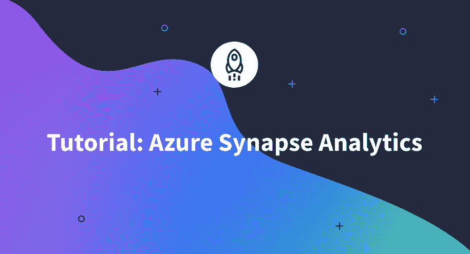

如今，企业收集的数据比以往任何时候都多。挑战变成了管理和理解所有这些数据。这就是 Azure Synapse Analytics 的用武之地。Azure Synapse Analytics 是一个基于云的平台，允许您存储和管理数据，并在其上运行分析。这是一种完全托管的服务，具有可扩展性、高可用性和安全性。Azure Synapse Analytics 与其他 Azure 服务集成，如 HDInsight、Databricks 和 Power BI，以提供完整的数据平台解决方案。

在本教程中，我们将向您介绍 Azure Synapse Analytics，并讨论在 Azure 中创建平台的步骤。

## Azure Synapse 分析的组件

Azure Synapse Analytics 首先从各种数据源获取数据，如社交媒体、物联网设备和 web 应用程序。然后，它使用大规模并行处理(MPP)架构在多个节点上并行处理数据。这使得它能够快速有效地处理非常大的数据集。然后，数据被转换并以优化的格式存储，以供分析。最后，对数据进行分析，以获得可用于改进业务运营的见解。

Azure Synapse 分析工作流的主要组件包括:

1.  Azure Synapse Analytics Studio:这是一个基于网络的界面，允许用户开发和运行分析作业。

2.  Azure Synapse 分析数据库:这些数据库用于存储由 Azure Synapse 分析服务处理的数据。

3.  Azure Synapse 分析作业:这些是提交给 Azure Synapse 分析服务进行处理的作业。可以使用 Azure Synapse Analytics Studio 或 Azure Portal 来创建工作。

4.  Azure Monitor:这是一个监控服务，帮助用户跟踪他们的 Azure Synapse Analytics 作业的性能。

5.  Azure Active Directory:这用于对用户进行身份验证，并授权对 Azure Synapse 分析服务的访问。

## Azure Synapse Analytics 的优势

使用 Azure Synapse Analytics 有很多好处，包括:

*   这是一项完全托管的服务，因此无需担心修补或升级软件。

*   它是可扩展的，因此可以随着您的业务增长而增长。

*   它与其他 Azure 服务集成，提供完整的数据平台解决方案。

*   根据您的需求，它提供两种不同的储物选择。

*   它是安全的，因此您可以放心，您的数据是安全和受保护的。

Azure Synapse Analytics 还支持实时分析，这使得在收集数据时对数据进行分析成为可能，这对于检测模式和趋势非常有用。

## 设置 Azure Snapse 分析

设置 Azure Synapse Analytics 是一个简单的过程，只需几次点击即可完成。第一步是导航到 Azure 门户并使用您的 Azure 帐户凭据登录。登录后，您将看到以下页面:

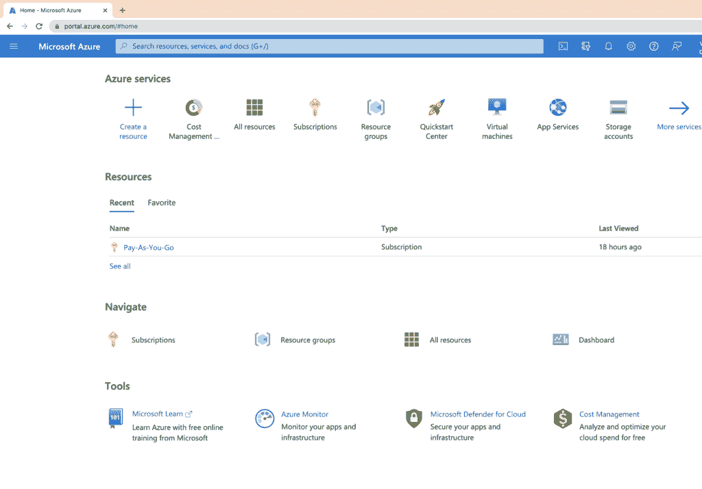

点击位于屏幕左侧的 **+创建新资源**按钮。这将开启**创造资源**刃。在搜索栏下，输入 **synapse** ，从选项中点击 **Azure Synapse Analytics** 。

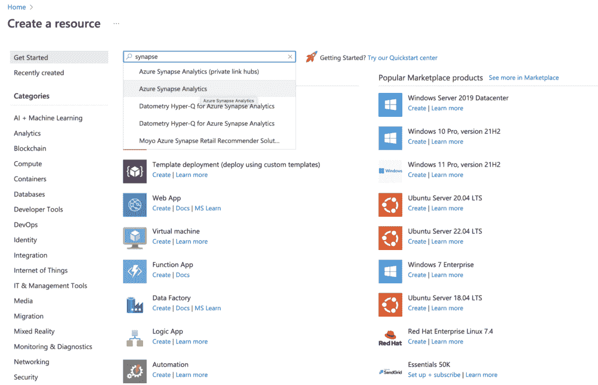

在打开的页面上点击**创建**按钮。

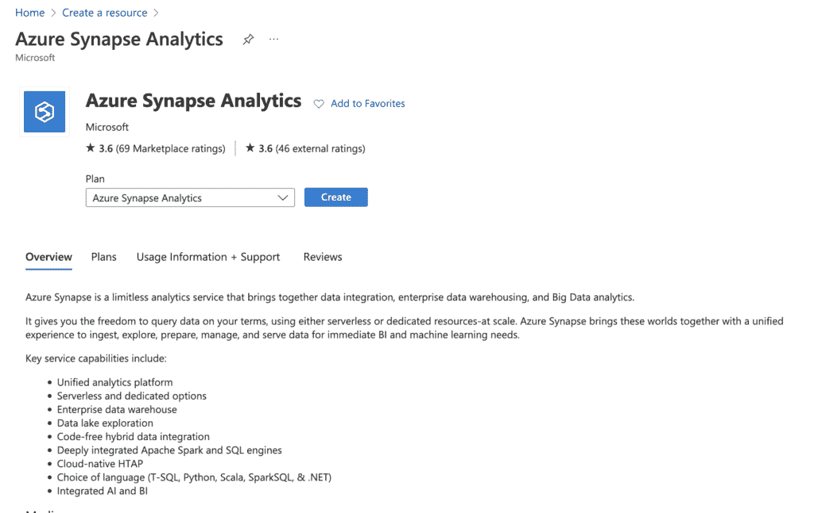

这将打开 blade，您将在其中指定设置 Azure Synapse Analytics 的详细信息。首先，您将选择想要使用的订阅。之后，您需要选择您想要部署服务的资源组。如果您没有资源组，您可以通过点击**创建新的**链接来创建一个。在本教程中，我们已经指定 **dqsynapserg** 作为资源组的名称，但是您必须为它指定一个唯一的名称。

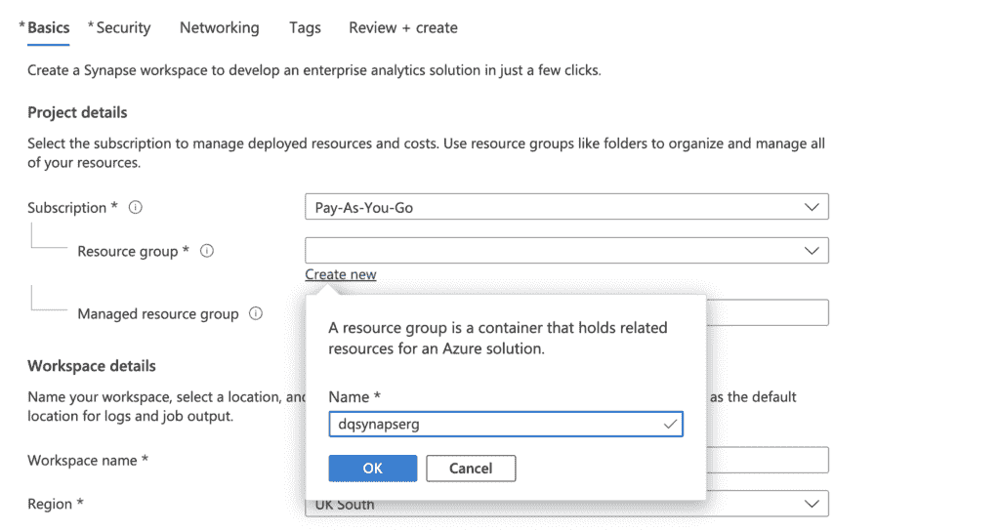

下一步是为您的工作区指定名称。在本教程中，我们已经指定了**dqsyncapsews**作为名称，但是您必须为它指定一个唯一的名称。对于**地区**，在教程中指定为**东美**，但是你可以选择离你最近的地区。在**下选择 Data Lake Storage Gen 2** ，并在**帐户名**内提供一个唯一的名称。在本教程中，我们将其指定为 **dqsynapsedatagen** 。

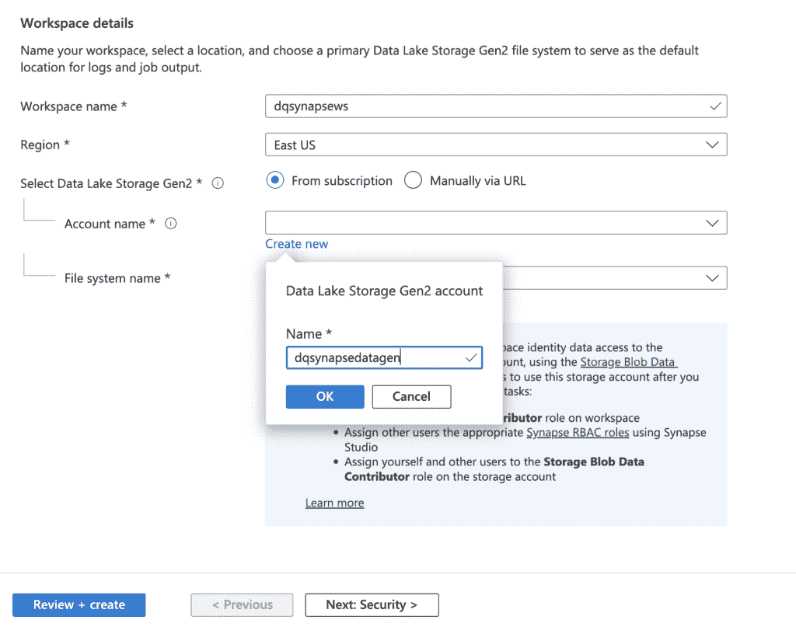

下一步是指定**文件系统名**。在本教程中，我们已经指定了**dqsyncapsefn**作为文件名，但是您必须为它指定一个唯一的名称。

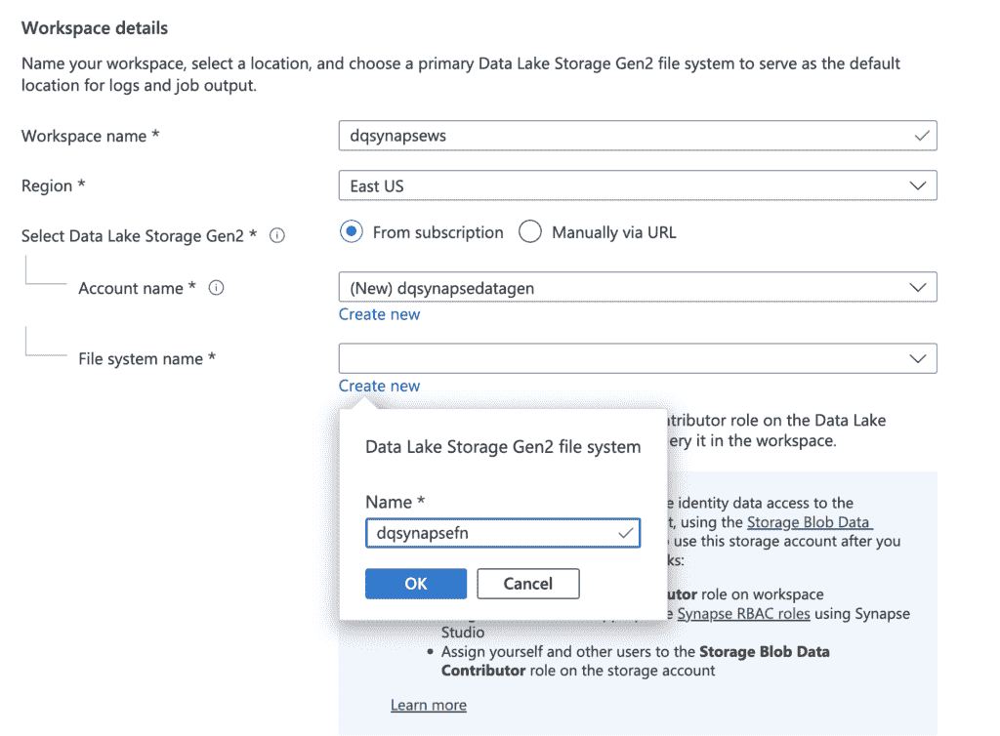

在 Data Lake Storage Gen2 account 框中，保留对**的默认检查选项，将自己指定为 Storage Blob Data Contributor 角色，并单击 **Review + create****

这将打开页面，您将看到消息**验证成功**。如果需要，您可以检查您的配置并返回编辑。您还可以查看以您的货币表示的每月估计费用。

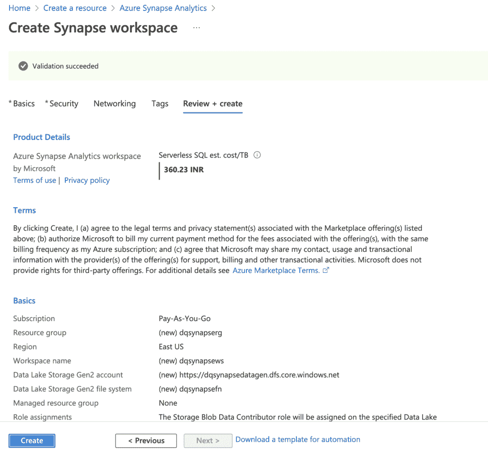

一旦您对上面的配置感到满意，单击 **Create** 按钮来部署您的数据库。完成部署可能需要几分钟时间，部署窗格将显示状态。

点击**转到资源组**打开以下页面，您可以在其中查看关于您刚刚创建的 synapse analytics 资源组的信息，例如 synapse workspace 和关联的存储帐户。

你现在可以通过点击 Synapse 工作区来打开 Synapse Studio，然后在**打开 Synapse Studio** 框中选择**打开**。

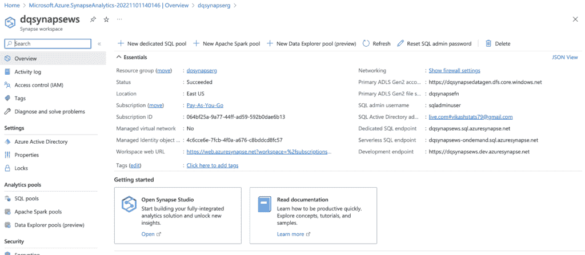

完成上述步骤将打开 Synapse Analytics Studio，如下所示。在左侧，您可以浏览用于**数据**、**开发**、**整合**、**监控**和**管理**的选项卡。

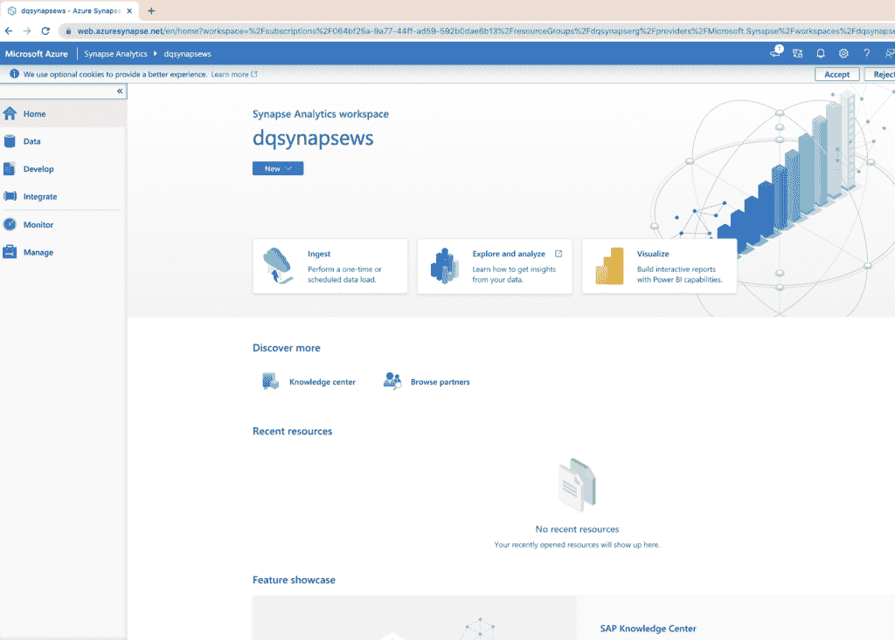

创建 Azure Synapse 分析工作区是一个简单的过程，只需几次点击。按照上面的步骤，你很快就能让它运行起来。

## 删除资源

当你用 Azure Synpase Analytics 完成工作后，删除资源以避免不必要的成本是很重要的。这很容易做到，第一步是去 Azure 门户，在那里你可以看到资源组的列表。

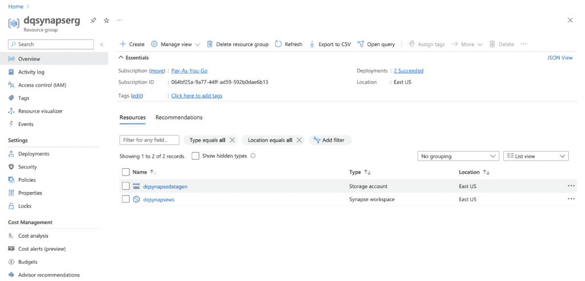

点击页面顶部的**删除资源组**按钮。通过键入资源组的名称并点击**删除**按钮来确认删除。删除资源组可能需要几分钟时间。

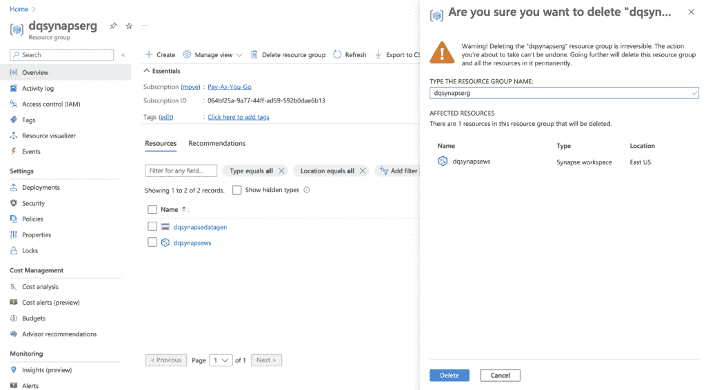

## 结论

在本教程中，您了解了 Azure Synapse Analytics、其组件及其优势。这是一个强大的工具，可以帮助企业将其数据转化为可操作的见解。它是完全托管的、可扩展的，并与其他 Azure 服务集成在一起，以提供一个完整的解决方案。如果你正在寻找一个基于云的数据仓库解决方案，那么 Azure Synapse Analytics 应该在你的考虑范围之内。