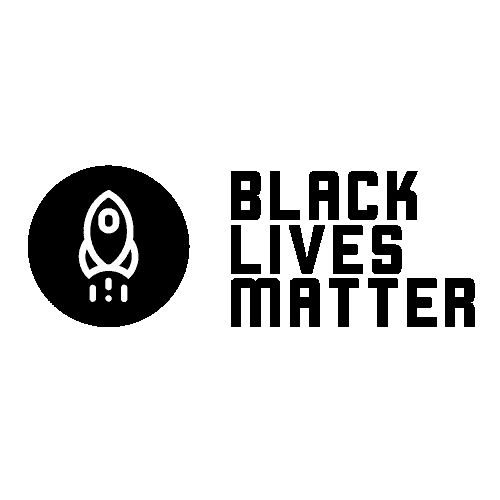

# 我们首席执行官的声明

> 原文：<https://www.dataquest.io/blog/a-statement-from-our-ceo/>

June 5, 2020

对我们美国人来说，这是令人心碎和痛苦的几天。我们已经看到全国超过 75 个城市的抗议活动。这些抗议表达了我们对乔治·弗洛伊德、艾哈迈德·阿贝里和布里奥纳·泰勒惨遭杀害的愤怒。

抗议迫使我们审视美国赤裸裸的种族不平等。去年有 235 名黑人被警察枪杀。黑人被监禁的可能性是白人的五倍(T2)。有色人种失业的可能性是白人的 1.5 到 2 倍(T4)。

我们非常感激为自己的权利挺身而出的前辈们。但是战斗还没有结束。今天的美国没有一个公平的竞争环境。

在 Dataquest，我们有机会为我们的社区和世界做出一点贡献。正义和平等是我们共有的价值观，无论我们生活在哪里。

以下是我们正在做的一些事情:

*   Dataquest 向[平等正义倡议](https://eji.org/)捐赠 5000 美元。
*   Dataquest 将为我们的团队成员向美国或全球反对系统性不平等的组织捐赠的 5000 美元进行匹配。
*   我们让我们团队中的每个人都能在周五休假，专注于社会公正项目。这可能包括参加抗议、分析数据或以其他方式支持他人。

展望未来，我们有机会改善全世界人民接受教育的机会。我们已经开始在奖学金项目上这样做了。我们还可以做更多的事情。我不知道这会是什么样子。但是我们会努力去解决这个问题。