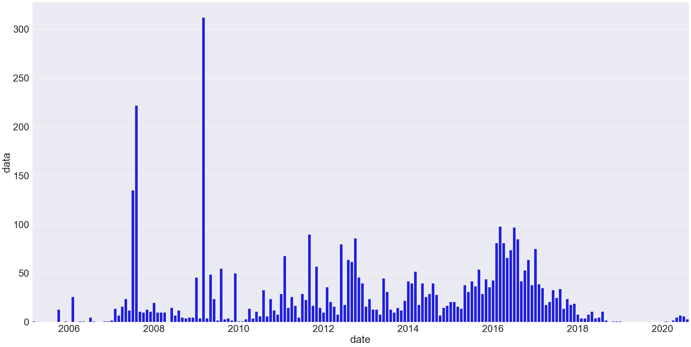
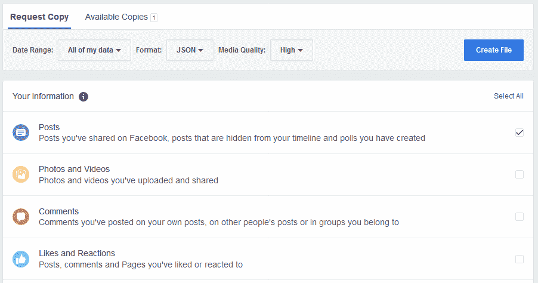

# 你发帖太多了吗？使用 Python 分析您的个人脸书数据

> 原文：<https://www.dataquest.io/blog/analyze-facebook-data-python/>

August 28, 2020

截至 Q2 2020，脸书声称拥有超过 27 亿活跃用户。这意味着，如果你正在阅读这篇文章，你很可能是一个脸书用户。但是你到底有多喜欢脸书呢？你到底发了多少？我们可以使用 Python 来了解一下！

具体来说，我们将使用 Python 来创建这个图表，它显示了随着时间的推移，我们每个月发布的频率:


出于本教程的目的，我们将假设您熟悉 Python 和 Jupyter 笔记本的基础知识——如果不熟悉，请先查看[这篇关于分析您的亚马逊支出](https://www.dataquest.io/blog/how-much-spent-amazon-data-analysis/)的教程。

## 步骤 1:下载你的脸书数据

脸书实际上允许我们在网站上下载几乎所有我们做过的东西。你可以[在这里](https://www.facebook.com/dyi/?referrer=yfi_settings)下载你的数据，但你可能不想下载全部——那个文件可能*很大*，这取决于你使用脸书的频率和你在上面呆了多长时间。

在本教程中，我们将专门查看我们个人的脸书帖子，并尝试回答以下问题:

*   我多久发一次帖子？
*   我使用脸书的次数比以前多了还是少了？

要获得与文章相关的数据，请进入[数据下载页面](https://www.facebook.com/dyi/?referrer=yfi_settings)。将请求的文件格式从 HTML 改为 JSON，然后取消选择下面选项中的所有内容，只勾选*的*帖子，点击创建文件。



当您的文件创建完成并可供下载时，脸书会通知您，这可能需要一段时间，具体取决于您的脸书历史记录和选项。

下载 zip 文件，解压缩，并查找`posts`文件夹和一个名为`your_posts_1.json`的文件。这是我们将在本教程中使用的文件。

## 步骤 2:导入并格式化数据

接下来，我们必须将这些数据放入熊猫数据框架，因此启动 Jupyter 笔记本(如果你需要复习，这里有[Jupyter 笔记本初学者指南](https://www.dataquest.io/blog/jupyter-notebook-tutorial/))。我们将从导入数据并将其读入数据帧开始。

内置的`pd.read_json()`函数将能够自动解释数据帧中的 JSON 数据。(正如您将看到的那样，它并不完美，但它对我们这里的目的是有用的)。

```py
import pandas as pd

# read the json file into a dataframe
df = pd.read_json('your_posts_1.json')

df.head(3)
```

|  | 时间戳 | 附件 | 数据 | 标题 | 标签 |
| --- | --- | --- | --- | --- | --- |
| Zero | 2020-08-12 16:54:03 | [{ ' data ':[{ ' external _ context ':{ ' URL ':' https… | [{'post ':'在 clea 上放一个小视频… | 查理卡斯特张贴在 YT 工业业主… | 圆盘烤饼 |
| one | 2020-08-09 23:41:14 | [{ ' data ':[{ ' external _ context ':{ ' URL ':' https… | [{'post ':'更具挑战性，但不知何故不太 d… | 圆盘烤饼 | 圆盘烤饼 |
| Two | 2020-08-02 20:11:51 | [{ ' data ':[{ ' external _ context ':{ ' URL ':' https… | [{'post ':'频道上的新视频…总计… | 圆盘烤饼 | 圆盘烤饼 |

正如我们所见，这并不完美。我们的一些列在每行中都有嵌套的子列，仍然是 JSON 格式。如果我们想处理这些数据，我们就需要处理这些数据。

但是要回答我们的问题，我们在脸书上发布的内容是比以前多了还是少了？ —我们真的不需要处理实际的帖子内容，或者附加的媒体文件等其他信息。我们只关心*频率*——发布新帖子的频率。

接下来，我们将确保时间戳列的格式正确，方法是使用`to_datetime()`将其转换为 datetime 对象。为了清楚起见，我们还将它重命名为`'date'`,并删除一些不必要的列——这一步并不是绝对必要的，但它有助于让我们看起来更简单。

```py
# rename the timestamp column
df.rename(columns={'timestamp': 'date'}, inplace=True)

#drop some unnecessary columns
df = df.drop(['attachments', 'title', 'tags'], axis=1)

# making sure it's datetime format
pd.to_datetime(df['date'])

df.head(3)
```

|  | 日期 | 数据 |
| --- | --- | --- |
| Zero | 2020-08-12 16:54:03 | [{'post ':'在 clea 上放一个小视频… |
| one | 2020-08-09 23:41:14 | [{'post ':'更具挑战性，但不知何故不太 d… |
| Two | 2020-08-02 20:11:51 | [{'post ':'频道上的新视频…总计… |

现在我们有了更干净的东西来工作了！如果我们想检查我们分析了多少文章，我们可以使用`df.shape`来计算行数。

使用`df.tail()`检查我们的数据帧的结尾也是一个好主意，只是为了确保它确实覆盖了我们整个脸书的使用:

```py
print(df.shape)
df.tail(3)
```

```py
(4407, 2)
```

|  | 日期 | 数据 |
| --- | --- | --- |
| Four thousand four hundred and four | 2005-10-20 03:23:30 | 圆盘烤饼 |
| Four thousand four hundred and five | 2005-10-20 03:23:30 | 圆盘烤饼 |
| Four thousand four hundred and six | 2005-03-07 01:05:54 | [{'post ':'湿热的美国夏季 t 恤自… |

以我的个人脸书数据为例，看起来我总共发布了超过 4000 次。我的数据始于 2005 年初，当时我显然发布了一些关于美国湿热夏季的信息。2005 年我还在上大学，所以时间是对的。

你可能会注意到有些行写着 NaN——这些帖子只包含图片，没有文字。这些图像将在`'attachments`列中链接，但是我们已经删除了它，所以它在这里不可见。

## 第三步:算出每月的帖子数量

现在我们已经得到了我们的数据，我们需要把它转换成一种格式，告诉我们一些关于发布频率的信息。考虑到我们跨越了多年的历史，逐月观察是最有意义的。这意味着我们需要按月份对我们的`'date'`列进行分组，并计算每个月有多少行(即文章)与之相关联。

幸运的是，pandas 的设计使得处理时间序列数据变得相对简单。我们需要做两件事:

1.  将`date`列设置为数据帧的索引。
2.  按月对数据进行重新采样，计算每个月有多少帖子。

对于第一步，我们可以使用`set_index()`。第二步有点复杂，所以让我们把它分成四个独立的步骤来分解我们需要编写的代码:

1.  选择我们想要重新采样的列——在本例中是`data`列。
2.  使用带有参数`'MS'`(表示“月初”)的`.resample()`函数按月对数据进行重新采样。
3.  使用`.size()`指定我们每个月想要测量的内容——在本例中，是发布日期在该月内的行(即帖子)的数量。
4.  将结果序列赋给一个名为`post_counts`的变量。

实际情况是这样的:

```py
date
2005-03-01    1
2005-04-01    0
2005-05-01    0
2005-06-01    0
2005-07-01    0
             ..
2020-04-01    2
2020-05-01    5
2020-06-01    7
2020-07-01    6
2020-08-01    3
Freq: MS, Name: data, Length: 186, dtype: int64
```

看起来棒极了！我们已经按月细分了我们的帖子数量，如果我们检查原始数据集，我们可以很快看到数量是正确的。

请注意，没有帖子的月份被正确地计为`0`，而不是简单地跳过。这就是为什么使用设计用于处理时间序列的`resample()`比使用像`groupby()`这样的东西更适合这种任务的原因之一，如果我们不小心的话，很容易跳过没有数据的几个月。

## 第四步:想象你的脸书用法

无论如何，现在我们已经过了棘手的部分，剩下的就是乐趣:可视化！为此，我们将导入 matplotlib(并使用`%matplotlib inline`魔法使我们的图表出现在 Jupyter 笔记本中。我们还将导入 Seaborn 和 NumPy，这将帮助我们制作一个可读性更好的图表。

一旦我们完成了导入，我们将使用 [`sns.set()`](https://seaborn.pydata.org/generated/seaborn.set.html) 来设置图表的大小和字体大小。由于我们在这里处理大量数据，我们将把图表做得相当大，并确保字体足够大以便于阅读。

然后，我们将 x 标签设置为使用`post_counts`(日期)的索引，并使用`sns.barplot()`创建一个条形图。在`sns.barplot()`的参数中，我们将告诉该函数使用我们定义的 x 标签，在`post_counts`中绘制数据，并将条形颜色设为蓝色。

仅此一点就足以创建一个基本的图表，但在这种情况下，我们希望采取一些额外的步骤来使图表可读。具体来说，我们希望将 x 轴上的刻度位置安排为每 24 个月一次，这样我们就可以在结果图表中每隔一年看到一个刻度。我们还想重新格式化图表中的日期，以便只显示年份。

(由于这不是一个关于 data viz 的教程，我们不会在本教程中深入讨论它是如何工作的，但如果你想了解更多关于如何用 Python 制作出色的数据可视化的信息，我们有[探索性数据可视化](https://www.dataquest.io/course/exploratory-data-visualization/)和[通过数据可视化讲述故事](https://www.dataquest.io/course/storytelling-data-visualization/)课程，你可以免费试用)。

```py
%matplotlib inline
import matplotlib.pyplot as plt
import seaborn as sns
import numpy as np

# set figure size and font size
sns.set(rc={'figure.figsize':(40,20)})
sns.set(font_scale=3)

# set x labels
x_labels = post_counts.index

#create bar plot
sns.barplot(x_labels, post_counts, color="blue")

# only show x-axis labels for Jan 1 of every other year
tick_positions = np.arange(10, len(x_labels), step=24)

#reformat date to display year onlyplt.ylabel("post counts")
plt.xticks(tick_positions, x_labels[tick_positions].strftime("%Y"))

# display the plot
plt.show()
```


这是图表——你可以点击查看全图。

我们仍然有一些方法可以让这个图表更漂亮，但对于我们的目的来说，这足以理解数据并分析我们的脸书发布历史。

就我而言——上面的图表是我在脸书的个人数据——我们可以看到，我在早期很少在脸书上发帖。我收到了大量的邮件——每月数百封！—2007 年夏天，2009 年春天，恰逢旅行。

我的常规使用量在 2011 年左右开始回升，并在 2016 年左右达到峰值。在那之后，它平息了，从 2019 年开始，我在相当长的一段时间内完全停止使用脸书。高峰时，我每个月都要发帖近 100 次！

而且记住，那只是*帖子*，不是*评论*！还有一个完整的 JSON 文件用于注释，但我已经够尴尬的了。如果你想进一步分析，深入你的评论文件将是一个很好的下一步！

让我们在本教程中称之为好，并回顾我们所做的事情:

*   我们从脸书下载了个人使用数据
*   我们将 JSON 文件读入熊猫数据帧
*   我们将数据按月分解，并统计了每个月的帖子数量
*   我们想象了脸书的用法，并了解到一些事情:查理过去在脸书身上花了太多时间。

如果你喜欢做这样的项目，试试 [Dataquest 的交互式浏览器课程](https://www.dataquest.io/data-science-courses-directory/)！它们比我们在这里讲述的更加身临其境，更加深入。事实上，我们有无缝的课程序列，可以带你从完全的初学者到胜任工作的数据分析师、数据科学家或数据工程师。

既然你已经看到你在脸书浪费了多少时间，为什么不登录 Dataquest，花些时间在网上建立有价值的工作技能呢？您可以创建一个帐户并开始免费学习—不需要信用卡！

### 准备好继续学习了吗？

永远不要想接下来我该学什么？又来了！

在我们的 [Python for Data Science 路径](/path/data-scientist/)中，您将了解到:

*   使用 **matplotlib** 和 **pandas** 进行数据清理、分析和可视化
*   假设检验、概率和**统计**
*   机器学习、**深度学习**和决策树
*   ...还有更多！

立即开始学习我们的 **60+免费任务**:

[Try Dataquest (it's free!)](https://app.dataquest.io/signup)