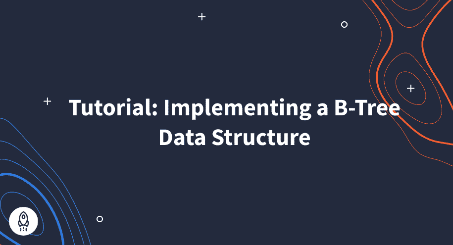
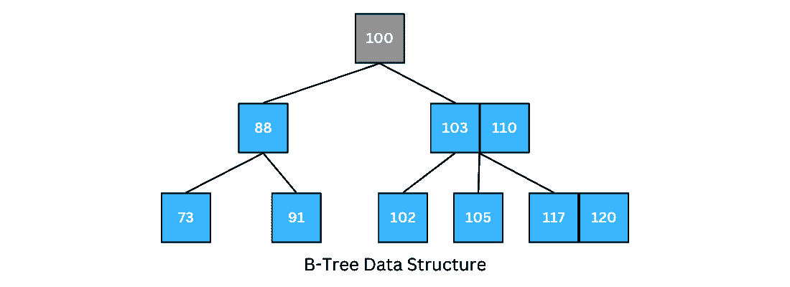
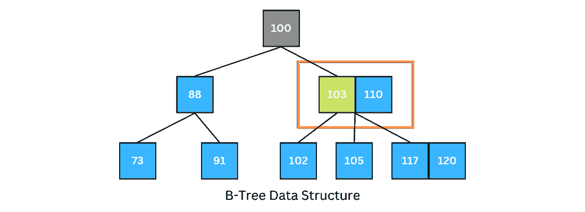
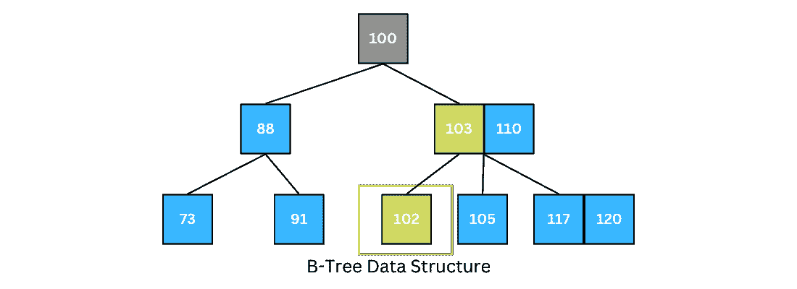

# 如何实现一个 B 树数据结构(2022 版)

> 原文：<https://www.dataquest.io/blog/b-tree-data-structure/>

October 19, 2022

1971 年，鲁道夫·拜尔和爱德华·m·麦克赖特在波音研究实验室创造了 B 树数据结构这个术语。他们发表了一篇题为“大型有序索引的组织和维护”的科学论文，并介绍了一种新的数据结构，用于从磁盘中快速检索数据。尽管 B 树数据结构已经发展了几十年，但是理解它的概念仍然是有价值的。

以下是我们将在本教程中涵盖的内容:

*   B-树数据结构
*   b 树属性
*   遍历 B 树
*   在 B 树中搜索
*   在 B 树中插入一个键
*   删除 B 树中的键

我们开始吧！

## 什么是 B 树数据结构？

B 树是一种自平衡的树数据结构，是二叉查找树(BST)的一般化形式。然而，与二叉树不同，每个节点可以有两个以上的子节点。换句话说，每个节点最多可以有 *m 个*子节点和 *m-1 个*键；此外，每个节点必须至少有$\lceil \frac{m}{2} \rceil$个子节点，以保持树的平衡。这些特征使得树的高度相对较小。

B 树数据结构保持数据有序，并允许在分摊对数时间内执行搜索、插入和删除操作。更具体地说，完成上述操作的时间复杂度是$O(log {n})$，其中 *n* 是存储在树中的键的数量。

让我们假设我们必须在计算机系统中存储大量的数据。在这种常见情况下，我们肯定无法将全部数据存储在主内存(RAM)中，大部分数据应该保存在磁盘上。我们还知道辅助存储(各种类型的磁盘)比 RAM 慢得多。因此，当我们必须从辅助存储中检索数据时，我们需要优化算法来减少磁盘访问次数。

B-tree 数据结构使用先进的技术和优化的算法来搜索、插入和删除，以尽量减少磁盘访问次数，所有这些都允许 B-Tree 保持平衡，从而确保在对数时间内找到数据。

为了揭示 B 树在最小化磁盘访问方面有多强大，让我们参考《算法简介》这本书，它证明了一棵高度为 2 和 1001 个孩子的 B 树能够存储超过 10 亿个键。尽管如此，只需要两个磁盘访问就可以找到任何键(Cormen 等人，2009)。

我们将在接下来的章节中讨论 B 树的属性以及它是如何工作的。

## b 树属性

在 m 阶的 B 树中有三种类型的节点，并且它们中的每一种都具有以下属性:

*   根节点
    *   根节点有$2$到$m$个子节点。
*   内部节点
    *   每个内部节点都有介于$\lceil \frac{m}{2} \rceil$和$m$之间的子节点，包括两端。
    *   每个内部节点可以包含多达$m-1$个键。
*   叶节点
    *   所有叶节点都在同一级别。
    *   每个叶节点存储$\lceil \frac{m-1}{2} \rceil$和$m-1$之间的密钥，包括两端。
*   B 树的高度可以通过以下等式得出:

    $ h \ leq log _ { m } { n+1 } { 2 } } $其中 *m* 是最小度数， *n* 是键的个数。

下图显示了 B 树数据结构。

## 遍历 B 树

为了遍历 B 树，遍历程序从最左边的子树开始，递归地打印它的键。它对剩余的子对象和关键点重复相同的过程，直到最右边的子对象。

## 在 B 树中搜索

在 B 树中搜索特定的关键字是在二叉查找树(BST)中搜索的一种推广形式。唯一的区别是 BST 执行二元决策，但是在 B 树中，每个节点的决策数等于节点的子节点数。

让我们在上面的 B 树中搜索关键字 102:

1.  根的键不等于 102，所以既然 k > 100，就去右边分支最左边的节点。

2.  比较 k 和 103；由于 k < 103，所以转到当前节点的左分支。

3.  将 k 与叶子的键进行比较；k 存在于那里。

如图所示，如果我们要寻找的键不在父节点的范围内，那么这个键很可能在另一个分支中。该算法将继续这样做以到达叶节点。如果没有找到密钥，算法将返回 NULL。

## 在 B 树中插入一个键

到目前为止，我们已经讨论了遍历 B 树和在 B 树数据结构中搜索特定的键。这一节将讨论如何在 B 树中插入一个新的键。

将新节点插入 B 树包括两个步骤:找到正确的节点插入关键字，如果节点已满(节点的关键字数大于 m-1)，则拆分节点。

1.  **如果 B 树为空:**
    1.  分配一个根节点，并插入密钥。
2.  **如果 B 树不为空:**
    1.  找到合适的插入节点。
    2.  **如果节点未满:**
        1.  按升序插入密钥。
    3.  **如果节点已满:**
        1.  在中间分割节点。
        2.  向上按中键，使左键成为左子节点，右键成为右子节点。

## 删除 B 树中的键

删除是我们可以对 B 树执行的操作之一。我们可以在叶或内部节点级别执行删除。要从 B 树中删除一个节点，我们需要遵循下面的算法:

1.  **如果要删除的节点是叶节点:**

    1.  找到包含所需键的叶节点。
    2.  如果该节点至少有$\lfloor \frac{m}{2} \rfloor$个键，请从叶节点中删除该键。
    3.  如果该节点的键少于$\lfloor \frac{m}{2} \rfloor$键，则从其右侧或左侧的直接同级节点中获取一个键。为此，请执行以下操作:
        1.  如果左边的兄弟节点至少有$\lfloor \frac{m}{2} \rfloor$个键，则将有序的前置项(左边子节点上最大的键)向上推至其父节点，并将正确的键从父节点向下移动至包含该键的节点。然后，我们可以从节点中删除键。
        2.  如果右边的兄弟节点至少有$\lfloor \frac{m}{2} \rfloor$个键，则将右边子节点上最小的键按顺序上推到其父节点，并将正确的键从父节点向下移动到包含该键的节点。然后，我们可以从节点中删除键。
        3.  如果直接同级不包含至少$\lfloor \frac{m}{2} \rfloor$项，请通过联接两个叶节点和父节点的项来创建一个新的叶节点。
        4.  如果父树剩下的键少于$\lfloor \frac{m}{2} \rfloor$键，则对父树应用上述过程，直到树成为有效的 B 树。
2.  **如果要删除的节点是内部节点:**

    1.  用它的有序后继者或前任者替换它。由于后继者或前趋者将总是在叶节点上，所以该过程将类似于从叶节点删除该节点。

## 结论

本教程讨论了 B 树和 B 树在磁盘上存储大量数据的应用。我们还讨论了 B 树中的四种主要操作:遍历、搜索、插入和删除。如果您有兴趣了解更多关于 B 树在 Python 中的实际实现，这个 [GitHub repo](https://gist.github.com/teepark/572734) 分享了 B 树数据结构在 Python 中的实现。

我希望你今天学到了一些新东西。请随时在 LinkedIn 或 Twitter 上与我联系。