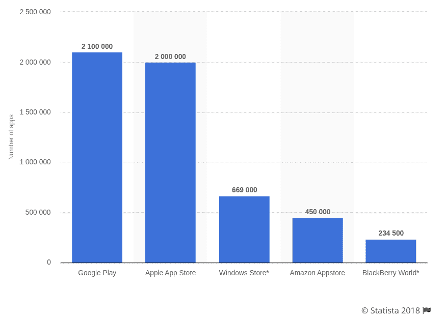

# 数据科学项目:App Store 和 Google Play 的盈利应用简介

> 原文：<https://www.dataquest.io/blog/basic-data-science-portfolio-project-tutorial/>

January 29, 2019

在 Dataquest，我们强烈主张将组合项目作为获得第一份数据科学工作的一种方式。在这篇博文中，我们将带你浏览一个投资组合项目的例子。这是我们*数据科学组合项目*系列的第三个项目:

1.  [Fandango 还在膨胀收视率吗？](https://www.dataquest.io/blog/data-science-project-fandango/)
2.  [在哪里为电子学习产品做广告](https://www.dataquest.io/blog/data-science-project-fandango/)
3.  App Store 和 Google Play 的盈利应用简介

在前两个项目中，我们使用了一些高级的 Python 库，比如`pandas`、`matplotlib`或`seaborn`。在这个项目中，我们限制自己只使用基本的 Python 来证明我们仍然可以执行增加商业价值的分析。这个项目是我们的*Python for Data Science:Fundamentals*课程的一部分，它假设您熟悉:

*   基本的 Python 概念(变量、列表、字典、if 语句、for 循环等。)
*   基本数据分析概念(算术平均值、百分比、频率表等。)

如果你认为你需要在前进之前填补任何空白，我们在[Python for Data Science:Fundamentals](https://www.dataquest.io/course/python-for-data-science-fundamentals)课程中涵盖了上述主题，该课程是免费的。本课程还将向您提供更深入的指导，说明如何构建这个项目，并在您的浏览器中对其进行编码。该项目遵循我们的数据科学项目的[风格指南中提出的指导方针。](https://www.dataquest.io/blog/data-science-project-style-guide/)

## App Store 和 Google Play 市场的盈利应用简介

我们在这个项目中的目标是找到对应用商店和 Google Play 市场有利可图的移动应用简介。我们是一家开发 Android 和 iOS 移动应用的公司的数据分析师，我们的工作是让我们的开发团队能够就他们开发的应用类型做出数据驱动的决策。在我们公司，我们只开发免费下载和安装的应用，我们的主要收入来源包括应用内广告。这意味着任何给定应用的收入主要受使用我们应用的用户数量的影响。我们这个项目的目标是分析数据，以帮助我们的开发者了解什么样的应用程序可能会吸引更多的用户。

## 打开和浏览数据

截至 2018 年 9 月，App Store 上有大约 200 万个 iOS 应用程序，Google Play 上有 210 万个 Android 应用程序。




*Source: [Statista](https://www.statista.com/statistics/276623/number-of-apps-available-in-leading-app-stores/)*


收集超过 400 万个应用程序的数据需要大量的时间和金钱，因此我们将尝试分析数据样本。为了避免自己花费资源收集新数据，我们应该首先尝试看看是否可以免费找到任何相关的现有数据。幸运的是，这两个数据集似乎适合我们的目的:

*   [数据集](https://www.kaggle.com/lava18/google-play-store-apps/home)包含来自 Google Play 的大约一万个 Android 应用程序的数据
*   [一个数据集](https://www.kaggle.com/ramamet4/app-store-apple-data-set-10k-apps/home)包含来自 App Store 的大约 7，000 个 iOS 应用程序的数据，让我们首先打开这两个数据集，然后继续研究这些数据。

```py
from csv import reader

### The Google Play data set ###
opened_file = open('googleplaystore.csv')
read_file = reader(opened_file)
android = list(read_file)
android_header = android[0]
android = android[1:]

### The App Store data set ###
opened_file = open('AppleStore.csv')
read_file = reader(opened_file)
ios = list(read_file)
ios_header = ios[0]
ios = ios[1:]
```

为了更容易地浏览这两个数据集，我们将首先编写一个名为`explore_data()`的函数，我们可以重复使用该函数，以更可读的方式浏览行。我们还将为函数添加一个选项，以显示任何数据集的行数和列数。

```py
### The explore_data() function ###
def explore_data(dataset, start, end, rows_and_columns=False):
    dataset_slice = dataset[start:end]
    for row in dataset_slice:
        print(row)
        print('\n') # adds a new (empty) line between rows

    if rows_and_columns:
        print('Number of rows:', len(dataset))
        print('Number of columns:', len(dataset[0]))

### Exploring the android data set ###
print(android_header)
print('\n')
explore_data(android, 0, 3, True)
```

```py
['App', 'Category', 'Rating', 'Reviews', 'Size', 'Installs', 'Type', 'Price', 'Content Rating', 'Genres', 'Last Updated', 'Current Ver', 'Android Ver']

['Photo Editor & Candy Camera & Grid & ScrapBook', 'ART_AND_DESIGN', '4.1', '159', '19M', '10,000+', 'Free', '0', 'Everyone', 'Art & Design', 'January 7, 2018', '1.0.0', '4.0.3 and up']

['Coloring book moana', 'ART_AND_DESIGN', '3.9', '967', '14M', '500,000+', 'Free', '0', 'Everyone', 'Art & Design;Pretend Play', 'January 15, 2018', '2.0.0', '4.0.3 and up']

['U Launcher Lite – FREE Live Cool Themes, Hide Apps', 'ART_AND_DESIGN', '4.7', '87510', '8.7M', '5,000,000+', 'Free', '0', 'Everyone', 'Art & Design', 'August 1, 2018', '1.2.4', '4.0.3 and up']

Number of rows: 10841
Number of columns: 13
```

我们看到 Google Play 数据集有 10841 个应用和 13 个栏目。快速浏览一下，可能对我们的分析有用的列有`'App'`、`'Category'`、`'Reviews'`、`'Installs'`、`'Type'`、`'Price'`和`'Genres'`。现在我们来看看 App Store 的数据集。

```py
print(ios_header)
print('\n')
explore_data(ios, 0, 3, True)
```

```py
['id', 'track_name', 'size_bytes', 'currency', 'price', 'rating_count_tot', 'rating_count_ver', 'user_rating', 'user_rating_ver', 'ver', 'cont_rating', 'prime_genre', 'sup_devices.num', 'ipadSc_urls.num', 'lang.num', 'vpp_lic']

['284882215', 'Facebook', '389879808', 'USD', '0.0', '2974676', '212', '3.5', '3.5', '95.0', '4+', 'Social Networking', '37', '1', '29', '1']

['389801252', 'Instagram', '113954816', 'USD', '0.0', '2161558', '1289', '4.5', '4.0', '10.23', '12+', 'Photo & Video', '37', '0', '29', '1']

['529479190', 'Clash of Clans', '116476928', 'USD', '0.0', '2130805', '579', '4.5', '4.5', '9.24.12', '9+', 'Games', '38', '5', '18', '1']

Number of rows: 7197
Number of columns: 16
```

在这个数据集中，我们有 7197 个 iOS 应用程序，看起来有趣的列有:`'track_name'`、`'currency'`、`'price'`、`'rating_count_tot'`、`'rating_count_ver'`和`'prime_genre'`。在这种情况下，并不是所有的列名都是不言自明的，但是关于每一列的细节可以在数据集[文档](https://www.kaggle.com/ramamet4/app-store-apple-data-set-10k-apps/home)中找到。

## 清理数据

Google Play 数据集有一个专门的[讨论区](https://www.kaggle.com/lava18/google-play-store-apps/discussion)，我们可以看到[的一个讨论](https://www.kaggle.com/lava18/google-play-store-apps/discussion/66015)为第 10472 行概述了一个错误。让我们打印这一行，并将其与标题和正确的另一行进行比较。

```py
print(android[10472])  # incorrect row
print('\n')
print(android_header)  # header
print('\n')
print(android[0])      # correct row
```

```py
['Life Made WI-Fi Touchscreen Photo Frame', '1.9', '19', '3.0M', '1,000+', 'Free', '0', 'Everyone', '', 'February 11, 2018', '1.0.19', '4.0 and up']

['App', 'Category', 'Rating', 'Reviews', 'Size', 'Installs', 'Type', 'Price', 'Content Rating', 'Genres', 'Last Updated', 'Current Ver', 'Android Ver']

['Photo Editor & Candy Camera & Grid & ScrapBook', 'ART_AND_DESIGN', '4.1', '159', '19M', '10,000+', 'Free', '0', 'Everyone', 'Art & Design', 'January 7, 2018', '1.0.0', '4.0.3 and up']
```

第 10472 行对应 app *Life Made WI-Fi 触屏相框*，我们可以看到评分是 19。这显然是关闭的，因为 Google Play 应用程序的最高评级是 5。因此，我们将删除这一行。

```py
print(len(android))

del android[10472]  # don't run this more than once

print(len(android))
```

```py
10841
10840
```

## 删除重复条目

如果我们探索 Google Play 数据集足够长的时间，我们会发现一些应用程序有不止一个条目。例如，应用程序 Instagram 有四个条目:

```py
for app in android:
    name = app[0]
    if name == 'Instagram':
        print(app)
```

```py
['Instagram', 'SOCIAL', '4.5', '66577313', 'Varies with device', '1,000,000,000+', 'Free', '0', 'Teen', 'Social', 'July 31, 2018', 'Varies with device', 'Varies with device']
['Instagram', 'SOCIAL', '4.5', '66577446', 'Varies with device', '1,000,000,000+', 'Free', '0', 'Teen', 'Social', 'July 31, 2018', 'Varies with device', 'Varies with device']
['Instagram', 'SOCIAL', '4.5', '66577313', 'Varies with device', '1,000,000,000+', 'Free', '0', 'Teen', 'Social', 'July 31, 2018', 'Varies with device', 'Varies with device']
['Instagram', 'SOCIAL', '4.5', '66509917', 'Varies with device', '1,000,000,000+', 'Free', '0', 'Teen', 'Social', 'July 31, 2018', 'Varies with device', 'Varies with device']
```

总的来说，一个应用程序出现不止一次的情况有 1，181 个:

```py
### Counting the duplicate apps ###
duplicate_apps = []
unique_apps = []

for app in android:
    name = app[0]
    if name in unique_apps:
        duplicate_apps.append(name)
    unique_apps.append(name)

print(len(duplicate_apps))
print(duplicate_apps[:15])
```

```py
1181
['Quick PDF Scanner + OCR FREE', 'Box', 'Google My Business', 'ZOOM Cloud Meetings', 'join.me - Simple Meetings', 'Box', 'Zenefits', 'Google Ads', 'Google My Business', 'Slack', 'FreshBooks Classic', 'Insightly CRM', 'QuickBooks Accounting: Invoicing & Expenses', 'HipChat - Chat Built for Teams', 'Xero Accounting Software']
```

我们不希望在分析数据时对某些应用进行多次计数，因此我们需要删除重复的条目，并且每个应用只保留一个条目。我们可以做的一件事是随机删除重复的行，但我们可能会找到更好的方法。如果您检查我们为 Instagram 应用程序打印的行，主要差异发生在每行的第四个位置，这对应于评论的数量。不同的数字表明数据是在不同的时间收集的。我们可以用它来建立一个保存行的标准。我们不会随机删除行；相反，我们将保留评论数量最多的行，假设评论数量越多，评级越可靠。为此，我们将:

*   创建一个字典，其中每个键是一个唯一的应用程序名称，值是该应用程序的最高评论数
*   使用字典创建一个新的数据集，每个应用程序只有一个条目(我们只选择评论数最高的应用程序)。让我们从构建字典开始。

```py
### Building a dictionary {'app_name': max_number_of reviews, ...} ###
reviews_max = {}

for app in android:
    name = app[0]
    n_reviews = float(app[3])

    if name in reviews_max and reviews_max[name] < n_reviews:
        reviews_max[name] = n_reviews

    elif name not in reviews_max: # Don't use else here!
        reviews_max[name] = n_reviews
```

在之前的代码单元中，我们发现有 1，181 种情况下，一个应用程序出现不止一次，因此我们的字典(唯一应用程序)的长度应该等于我们的数据集长度与 1，181 的差。

```py
print('Expected length:', len(android) - 1181)
print('Actual length:', len(reviews_max))
```

```py
Expected length: 9659
Actual length: 9659
```

现在，让我们使用`reviews_max`字典来删除重复的内容。对于重复的案例，我们将只保留评论数最高的条目。在下面的代码单元格中:

*   我们首先初始化两个空列表，`android_clean`和`already_added`。
*   我们遍历`android`数据集，对于每次迭代:
*   我们分离出应用程序的名称和评论数量。*我们将当前行(`app`)添加到`android_clean`列表，将应用名称(`name`)添加到`already_cleaned`列表，如果:*当前应用的评论数与`reviews_max`字典中描述的那个应用的评论数匹配；以及*应用程序的名称不在`already_added`列表中。我们需要添加这个补充条件，以考虑重复应用的最高评论数对于多个条目相同的情况(例如，盒子应用有三个条目，评论数相同)。如果我们只检查`reviews_max[name] == n_reviews`，我们仍然会以一些应用程序的重复条目而告终。

```py
android_clean = []
already_added = []

for app in android:
    name = app[0]
    n_reviews = float(app[3])

    if (reviews_max[name] == n_reviews) and (name not in already_added):
        android_clean.append(app)
        already_added.append(name) # make sure this is inside the if block
```

现在让我们快速浏览新的数据集，并确认行数为 9，659。

```py
explore_data(android_clean, 0, 3, True)
```

```py
['Photo Editor & Candy Camera & Grid & ScrapBook', 'ART_AND_DESIGN', '4.1', '159', '19M', '10,000+', 'Free', '0', 'Everyone', 'Art & Design', 'January 7, 2018', '1.0.0', '4.0.3 and up']

['U Launcher Lite – FREE Live Cool Themes, Hide Apps', 'ART_AND_DESIGN', '4.7', '87510', '8.7M', '5,000,000+', 'Free', '0', 'Everyone', 'Art & Design', 'August 1, 2018', '1.2.4', '4.0.3 and up']

['Sketch - Draw & Paint', 'ART_AND_DESIGN', '4.5', '215644', '25M', '50,000,000+', 'Free', '0', 'Teen', 'Art & Design', 'June 8, 2018', 'Varies with device', '4.2 and up']

Number of rows: 9659
Number of columns: 13
```

正如所料，我们有 9659 行。

## 删除非英语应用

如果你对数据集进行了足够的研究，你会注意到一些应用的名字表明它们并不面向说英语的用户。下面，我们看到两个数据集的几个例子:

```py
print(ios[813][1])
print(ios[6731][1])

print(android_clean[4412][0])
print(android_clean[7940][0])
```

```py
爱奇艺 PPS -《欢乐颂 2》电视剧热播
【脱出ゲーム】絶対に最後までプレイしないで 〜謎解き＆ブロックパズル〜
中国語 AQリスニング
لعبة تقدر تربح DZ
```

我们对保留这类应用不感兴趣，因此我们将删除它们。一种方法是删除其名称包含英语文本中不常用的符号的每个应用程序——英语文本通常包括英语字母表中的字母、由 0 到 9 的数字组成的数字、标点符号(。, !, ?, ;等。)，以及其他符号(+、*、/等。).所有这些特定于英文文本的字符都使用 ASCII 标准进行编码。每个 ASCII 字符都有一个 0 到 127 之间的对应数字与之关联，我们可以利用这一点构建一个函数来检查应用程序名称，并告诉我们它是否包含非 ASCII 字符。下面我们构建了这个函数，我们使用内置的`ord()`函数来找出每个字符对应的编码号。

```py
def is_English(string):

    for character in string:
        if ord(character) > 127:
            return False

    return True

print(is_English('Instagram'))
print(is_English('爱奇艺 PPS -《欢乐颂 2》电视剧热播'))
```

```py
True
False
```

该功能似乎工作正常，但一些英文应用程序名称使用表情符号或其他符号(、—(长破折号)、–(短破折号)等。)不在 ASCII 范围内。因此，如果我们以当前形式使用该功能，我们将删除有用的应用程序。

```py
print(is_English('Docs To Go™ Free Office Suite'))
print(is_English('Instachat " src="https://s.w.oimg/core/emoji/11.2.0/svg/1f61c.svg">" src="https://s.w.oimg/core/emoji/11.2.0/svg/1f61c.svg">" src="https://s.w.oimg/core/emoji/11.2.0/svg/1f61c.svg">'))

print(ord('™'))
print(ord('" src="https://s.w.oimg/core/emoji/11.2.0/svg/1f61c.svg">" src="https://s.w.oimg/core/emoji/11.2.0/svg/1f61c.svg">" src="https://s.w.oimg/core/emoji/11.2.0/svg/1f61c.svg">'))
```

```py
False
False
8482
128540
```

为了最大限度地减少数据丢失的影响，我们将只移除名称中包含三个以上非 ASCII 字符的应用:

```py
def is_English(string):
    non_ascii = 0

    for character in string:
        if ord(character) > 127:
            non_ascii += 1

    if non_ascii > 3:
        return False
    else:
        return True

print(is_English('Docs To Go™ Free Office Suite'))
print(is_English('Instachat " src="https://s.w.oimg/core/emoji/11.2.0/svg/1f61c.svg">" src="https://s.w.oimg/core/emoji/11.2.0/svg/1f61c.svg">" src="https://s.w.oimg/core/emoji/11.2.0/svg/1f61c.svg">'))
```

```py
True
True
```

该功能仍不完善，极少数非英语应用可能会通过我们的过滤，但在我们的分析中，这一点似乎已经足够好了——我们不应该在这一点上花太多时间进行优化。下面，我们使用`is_English()`函数过滤掉两个数据集的非英语应用程序:

```py
### The lists that will store the new data sets ###
android_english = []
ios_english = []

### android ###
for app in android_clean:
    name = app[0]
    if is_English(name):
        android_english.append(app)

### ios ###
for app in ios:
    name = app[1]
    if is_English(name):
        ios_english.append(app)

### Check number of entries left ###
explore_data(android_english, 0, 3, True)
print('\n')
explore_data(ios_english, 0, 3, True)
```

```py
['Photo Editor & Candy Camera & Grid & ScrapBook', 'ART_AND_DESIGN', '4.1', '159', '19M', '10,000+', 'Free', '0', 'Everyone', 'Art & Design', 'January 7, 2018', '1.0.0', '4.0.3 and up']

['U Launcher Lite – FREE Live Cool Themes, Hide Apps', 'ART_AND_DESIGN', '4.7', '87510', '8.7M', '5,000,000+', 'Free', '0', 'Everyone', 'Art & Design', 'August 1, 2018', '1.2.4', '4.0.3 and up']

['Sketch - Draw & Paint', 'ART_AND_DESIGN', '4.5', '215644', '25M', '50,000,000+', 'Free', '0', 'Teen', 'Art & Design', 'June 8, 2018', 'Varies with device', '4.2 and up']

Number of rows: 9614
Number of columns: 13

['284882215', 'Facebook', '389879808', 'USD', '0.0', '2974676', '212', '3.5', '3.5', '95.0', '4+', 'Social Networking', '37', '1', '29', '1']

['389801252', 'Instagram', '113954816', 'USD', '0.0', '2161558', '1289', '4.5', '4.0', '10.23', '12+', 'Photo & Video', '37', '0', '29', '1']

['529479190', 'Clash of Clans', '116476928', 'USD', '0.0', '2130805', '579', '4.5', '4.5', '9.24.12', '9+', 'Games', '38', '5', '18', '1']

Number of rows: 6183
Number of columns: 16
```

我们可以看到，我们剩下 9614 个 Android 应用程序和 6183 个 iOS 应用程序。

## 隔离免费应用

正如我们在简介中提到的，我们只构建免费下载和安装的应用，我们的主要收入来源包括应用内广告。我们的数据集包含免费和非免费应用程序，我们只需要分离出免费应用程序进行分析。下面，我们分离出两个数据集的免费应用。

```py
### These two lists will store the new data sets ###
android_final = []
ios_final = []

### android ###
for app in android_english:
    price = app[7]
    if price == '0':
        android_final.append(app)

### ios ###
for app in ios_english:
    price = app[4]
    if price == '0.0':
        ios_final.append(app)

### Checking number of entries left ###
print(len(android_final))
print(len(ios_final))
```

```py
8864
3222
```

我们剩下 8864 个 Android 应用和 3222 个 iOS 应用，这应该足够我们分析了。

## 按类型分类的最常用应用

正如我们在介绍中提到的，我们的目标是确定可能吸引更多用户的应用类型，因为我们的收入在很大程度上受到使用我们应用的人数的影响。为了最大限度地降低风险和开销，我们的应用创意验证策略包括三个步骤:

1.  构建该应用程序的最小 Android 版本，并将其添加到 Google Play。
2.  如果用户对这个应用有很好的反应，我们就会进一步开发它。
3.  如果应用程序在六个月后盈利，我们也建立一个 iOS 版本的应用程序，并将其添加到应用程序商店。因为我们的最终目标是在 App Store 和 Google Play 上添加应用程序，所以我们需要找到在这两个市场都成功的应用程序档案。例如，一个对两个市场都适用的档案可能是一个利用游戏化的生产力应用程序。让我们从了解每个市场最常见的类型开始分析。为此，我们将为 App Store 数据集的`prime_genre`列以及 Google Play 数据集的`Genres`和`Category`列构建一个频率表。

我们将构建两个函数来分析频率表:

*   一个生成显示百分比的频率表的函数
*   另一个我们可以用来以降序显示百分比的函数

```py
### Frequency tables with percentages ###
def freq_table(dataset, index):
    table = {}
    total = 0

    for row in dataset:
        total += 1
        value = row[index]
        if value in table:
            table[value] += 1
        else:
            table[value] = 1

    table_percentages = {}
    for key in table:
        percentage = (table[key] / total) * 100
        table_percentages[key] = percentage

    return table_percentages

### Display percentages in a descending order ###
def display_table(dataset, index):
    table = freq_table(dataset, index)
    table_display = []
    for key in table:
        key_val_as_tuple = (table[key], key)
        table_display.append(key_val_as_tuple)

    table_sorted = sorted(table_display, reverse = True)
    for entry in table_sorted:
        print(entry[1], ':', entry[0])
```

我们首先检查 App Store 数据集的`prime_genre`列的频率表。

```py
display_table(ios_final, -5)
```

```py
Games : 58.16263190564867
Entertainment : 7.883302296710118
Photo & Video : 4.9658597144630665
Education : 3.662321539416512
Social Networking : 3.2898820608317814
Shopping : 2.60707635009311
Utilities : 2.5139664804469275
Sports : 2.1415270018621975
Music : 2.0484171322160147
Health & Fitness : 2.0173805090006205
Productivity : 1.7380509000620732
Lifestyle : 1.5828677839851024
News : 1.3345747982619491
Travel : 1.2414649286157666
Finance : 1.1173184357541899
Weather : 0.8690254500310366
Food & Drink : 0.8069522036002483
Reference : 0.5586592178770949
Business : 0.5276225946617008
Book : 0.4345127250155183
Navigation : 0.186219739292365
Medical : 0.186219739292365
Catalogs : 0.12414649286157665
```

我们可以看到，在免费的英文 app 中，超过一半(58.16%)是游戏。娱乐应用接近 8%，其次是照片和视频应用，接近 5%。只有 3.66%的应用是为教育设计的，其次是社交网络应用，占我们数据集中应用的 3.29%。总的印象是，App Store(至少是包含免费英文应用的部分)被那些为娱乐而设计的应用(游戏、娱乐、照片和视频、社交网络、体育、音乐等)所主导。)，而具有实用目的(教育、购物、实用、生产力、生活方式等)的 app。)都比较少见。然而，有趣的应用程序数量最多的事实并不意味着它们也拥有最多的用户——需求可能与提供的不一样。让我们继续检查 Google Play 数据集的`Genres`和`Category`列(这两列似乎是相关的)。

```py
display_table(android_final, 1) # Category
```

```py
FAMILY : 18.907942238267147
GAME : 9.724729241877256
TOOLS : 8.461191335740072
BUSINESS : 4.591606498194946
LIFESTYLE : 3.9034296028880866
PRODUCTIVITY : 3.892148014440433
FINANCE : 3.7003610108303246
MEDICAL : 3.531137184115524
SPORTS : 3.395758122743682
PERSONALIZATION : 3.3167870036101084
COMMUNICATION : 3.2378158844765346
HEALTH_AND_FITNESS : 3.0798736462093865
PHOTOGRAPHY : 2.944494584837545
NEWS_AND_MAGAZINES : 2.7978339350180503
SOCIAL : 2.6624548736462095
TRAVEL_AND_LOCAL : 2.33528880866426
SHOPPING : 2.2450361010830324
BOOKS_AND_REFERENCE : 2.1435018050541514
DATING : 1.861462093862816
VIDEO_PLAYERS : 1.7937725631768955
MAPS_AND_NAVIGATION : 1.3989169675090252
FOOD_AND_DRINK : 1.2409747292418771
EDUCATION : 1.1620036101083033
ENTERTAINMENT : 0.9589350180505415
LIBRARIES_AND_DEMO : 0.9363718411552346
AUTO_AND_VEHICLES : 0.9250902527075812
HOUSE_AND_HOME : 0.8235559566787004
WEATHER : 0.8009927797833934
EVENTS : 0.7107400722021661
PARENTING : 0.6543321299638989
ART_AND_DESIGN : 0.6430505415162455
COMICS : 0.6204873646209386
BEAUTY : 0.5979241877256317
```

Google Play 上的情况似乎有很大不同:没有那么多应用程序是为娱乐而设计的，似乎有很多应用程序是为实用目的而设计的(家庭、工具、商业、生活方式、生产力等)。).然而，如果我们进一步调查，我们会发现家庭类别(几乎占应用程序的 19%)主要是指儿童游戏。


*Source: [play.google.com](https://play.google.com/store/apps/category/FAMILY?hl=en)*


即便如此，与 App Store 相比，实用应用似乎在 Google Play 上有更好的表现。我们看到的`Genres`列的频率表也证实了这一点:

```py
display_table(android_final, -4)
```

```py
Tools : 8.449909747292418
Entertainment : 6.069494584837545
Education : 5.347472924187725
Business : 4.591606498194946
Productivity : 3.892148014440433
Lifestyle : 3.892148014440433
Finance : 3.7003610108303246
Medical : 3.531137184115524
Sports : 3.463447653429603
Personalization : 3.3167870036101084
Communication : 3.2378158844765346
Action : 3.1024368231046933
Health & Fitness : 3.0798736462093865
Photography : 2.944494584837545
News & Magazines : 2.7978339350180503
Social : 2.6624548736462095
Travel & Local : 2.3240072202166067
Shopping : 2.2450361010830324
Books & Reference : 2.1435018050541514
Simulation : 2.0419675090252705
Dating : 1.861462093862816
Arcade : 1.8501805054151623
Video Players & Editors : 1.7712093862815883
Casual : 1.7599277978339352
Maps & Navigation : 1.3989169675090252
Food & Drink : 1.2409747292418771
Puzzle : 1.128158844765343
Racing : 0.9927797833935018
Role Playing : 0.9363718411552346
Libraries & Demo : 0.9363718411552346
Auto & Vehicles : 0.9250902527075812
Strategy : 0.9138086642599278
House & Home : 0.8235559566787004
Weather : 0.8009927797833934
Events : 0.7107400722021661
Adventure : 0.6768953068592057
Comics : 0.6092057761732852
Beauty : 0.5979241877256317
Art & Design : 0.5979241877256317
Parenting : 0.4963898916967509
Card : 0.45126353790613716
Casino : 0.42870036101083037
Trivia : 0.41741877256317694
Educational;Education : 0.39485559566787
Board : 0.3835740072202166
Educational : 0.3722924187725632
Education;Education : 0.33844765342960287
Word : 0.2594765342960289
Casual;Pretend Play : 0.236913357400722
Music : 0.2030685920577617
Racing;Action & Adventure : 0.16922382671480143
Puzzle;Brain Games : 0.16922382671480143
Entertainment;Music & Video : 0.16922382671480143
Casual;Brain Games : 0.13537906137184114
Casual;Action & Adventure : 0.13537906137184114
Arcade;Action & Adventure : 0.12409747292418773
Action;Action & Adventure : 0.10153429602888085
Educational;Pretend Play : 0.09025270758122744
Simulation;Action & Adventure : 0.078971119133574
Parenting;Education : 0.078971119133574
Entertainment;Brain Games : 0.078971119133574
Board;Brain Games : 0.078971119133574
Parenting;Music & Video : 0.06768953068592057
Educational;Brain Games : 0.06768953068592057
Casual;Creativity : 0.06768953068592057
Art & Design;Creativity : 0.06768953068592057
Education;Pretend Play : 0.056407942238267145
Role Playing;Pretend Play : 0.04512635379061372
Education;Creativity : 0.04512635379061372
Role Playing;Action & Adventure : 0.033844765342960284
Puzzle;Action & Adventure : 0.033844765342960284
Entertainment;Creativity : 0.033844765342960284
Entertainment;Action & Adventure : 0.033844765342960284
Educational;Creativity : 0.033844765342960284
Educational;Action & Adventure : 0.033844765342960284
Education;Music & Video : 0.033844765342960284
Education;Brain Games : 0.033844765342960284
Education;Action & Adventure : 0.033844765342960284
Adventure;Action & Adventure : 0.033844765342960284
Video Players & Editors;Music & Video : 0.02256317689530686
Sports;Action & Adventure : 0.02256317689530686
Simulation;Pretend Play : 0.02256317689530686
Puzzle;Creativity : 0.02256317689530686
Music;Music & Video : 0.02256317689530686
Entertainment;Pretend Play : 0.02256317689530686
Casual;Education : 0.02256317689530686
Board;Action & Adventure : 0.02256317689530686
Video Players & Editors;Creativity : 0.01128158844765343
Trivia;Education : 0.01128158844765343
Travel & Local;Action & Adventure : 0.01128158844765343
Tools;Education : 0.01128158844765343
Strategy;Education : 0.01128158844765343
Strategy;Creativity : 0.01128158844765343
Strategy;Action & Adventure : 0.01128158844765343
Simulation;Education : 0.01128158844765343
Role Playing;Brain Games : 0.01128158844765343
Racing;Pretend Play : 0.01128158844765343
Puzzle;Education : 0.01128158844765343
Parenting;Brain Games : 0.01128158844765343
Music & Audio;Music & Video : 0.01128158844765343
Lifestyle;Pretend Play : 0.01128158844765343
Lifestyle;Education : 0.01128158844765343
Health & Fitness;Education : 0.01128158844765343
Health & Fitness;Action & Adventure : 0.01128158844765343
Entertainment;Education : 0.01128158844765343
Communication;Creativity : 0.01128158844765343
Comics;Creativity : 0.01128158844765343
Casual;Music & Video : 0.01128158844765343
Card;Action & Adventure : 0.01128158844765343
Books & Reference;Education : 0.01128158844765343
Art & Design;Pretend Play : 0.01128158844765343
Art & Design;Action & Adventure : 0.01128158844765343
Arcade;Pretend Play : 0.01128158844765343
Adventure;Education : 0.01128158844765343
```

`Genres`和`Category`列之间的区别并不明显，但是我们可以注意到的一点是`Genres`列更加细粒度(它有更多的类别)。我们目前只是在寻找更大的画面，所以我们只会随着`Category`栏的前进而工作。到目前为止，我们发现 App Store 由为娱乐而设计的应用程序主导，而 Google Play 显示了实用和娱乐应用程序更加平衡的格局。现在我们想了解一下拥有最多用户的应用类型。

## App Store 上按流派分类的最受欢迎应用

找出哪种类型最受欢迎(拥有最多用户)的一种方法是计算每种应用类型的平均安装次数。对于 Google Play 数据集，我们可以在`Installs`列中找到这些信息，但是对于 App Store 数据集，却缺少这些信息。作为一种变通方法，我们将用户评级的总数作为代理，这可以在`rating_count_tot`应用程序中找到。下面，我们计算了 App Store 上每个应用类型的平均用户评分数:

```py
### Generating a frequency table to get the unique app genres ###
genres_ios = freq_table(ios_final, -5)

### Looping over the unique genres ###
for genre in genres_ios:
    total = 0
    len_genre = 0

    ## Looping over the App Store data set ##
    for app in ios_final:
        genre_app = app[-5]
        if genre_app == genre:
            n_ratings = float(app[5])
            total += n_ratings
            len_genre += 1

    ## Compute and display the average number of user ratings ##
    avg_n_ratings = total / len_genre
    print(genre, ':', avg_n_ratings)
```

```py
Social Networking : 71548.34905660378
Photo & Video : 28441.54375
Games : 22788.6696905016
Music : 57326.530303030304
Reference : 74942.11111111111
Health & Fitness : 23298.015384615384
Weather : 52279.892857142855
Utilities : 18684.456790123455
Travel : 28243.8
Shopping : 26919.690476190477
News : 21248.023255813954
Navigation : 86090.33333333333
Lifestyle : 16485.764705882353
Entertainment : 14029.830708661417
Food & Drink : 33333.92307692308
Sports : 23008.898550724636
Book : 39758.5
Finance : 31467.944444444445
Education : 7003.983050847458
Productivity : 21028.410714285714
Business : 7491.117647058823
Catalogs : 4004.0
Medical : 612.0
```

平均而言，导航应用的用户评论数量最多，但这一数字受到 Waze 和谷歌地图的严重影响，这两家公司的用户评论总数接近 50 万:

```py
for app in ios_final:
    if app[-5] == 'Navigation':
        print(app[1], ':', app[5]) # print name and number of ratings
```

```py
Waze - GPS Navigation, Maps & Real-time Traffic : 345046
Google Maps - Navigation & Transit : 154911
Geocaching® : 12811
CoPilot GPS – Car Navigation & Offline Maps : 3582
ImmobilienScout24: Real Estate Search in Germany : 187
Railway Route Search : 5
```

同样的模式也适用于社交网络应用，其平均数量受到脸书、Pinterest、Skype 等少数巨头的严重影响。这同样适用于音乐应用，潘多拉、Spotify 和 Shazam 等几家大公司严重影响了平均数量。我们的目标是找到流行类型，但导航、社交网络或音乐应用可能看起来比实际更受欢迎。拥有数十万用户评分的极少数应用似乎扭曲了平均评分数，而其他应用可能很难超过 1 万的门槛。我们可以通过删除每个流派的这些非常受欢迎的应用程序来获得更好的图片，然后重新计算平均值，但我们将把这一级别的细节留到以后。参考应用平均有 74，942 个用户评级，但实际上是《圣经》和[Dictionary.com](https://Dictionary.com)扭曲了平均评级:

```py
for app in ios_final:
    if app[-5] == 'Reference':
        print(app[1], ':', app[5])
```

```py
Bible : 985920
Dictionary.com Dictionary & Thesaurus : 200047
Dictionary.com Dictionary & Thesaurus for iPad : 54175
Google Translate : 26786
Muslim Pro: Ramadan 2017 Prayer Times, Azan, Quran : 18418
New Furniture Mods - Pocket Wiki & Game Tools for Minecraft PC Edition : 17588
Merriam-Webster Dictionary : 16849
Night Sky : 12122
City Maps for Minecraft PE - The Best Maps for Minecraft Pocket Edition (MCPE) : 8535
LUCKY BLOCK MOD ™ for Minecraft PC Edition - The Best Pocket Wiki & Mods Installer Tools : 4693
GUNS MODS for Minecraft PC Edition - Mods Tools : 1497
Guides for Pokémon GO - Pokemon GO News and Cheats : 826
WWDC : 762
Horror Maps for Minecraft PE - Download The Scariest Maps for Minecraft Pocket Edition (MCPE) Free : 718
VPN Express : 14
Real Bike Traffic Rider Virtual Reality Glasses : 8
教えて!goo : 0
Jishokun-Japanese English Dictionary & Translator : 0
```

然而，这个利基似乎显示出一些潜力。我们可以做的一件事是把另一本受欢迎的书变成一个应用程序，除了书的原始版本之外，我们还可以添加不同的功能。这可能包括书中的每日引用、书的音频版本、关于书的测验等。最重要的是，我们还可以在应用程序中嵌入字典，这样用户就不需要退出我们的应用程序，在外部应用程序中查找单词。这种想法似乎很符合应用商店由娱乐应用主导的事实。这表明市场可能已经有点饱和，充满了好玩的应用程序，这意味着一个实用的应用程序可能有更多的机会在 App Store 的大量应用程序中脱颖而出。其他似乎受欢迎的类型包括天气、书籍、饮食或金融。书籍类型似乎与我们上面描述的应用程序理念有点重叠，但其他类型对我们来说似乎不太有趣:

*   天气应用——人们通常不会花太多时间在应用上，从应用内附加服务中获利的机会也很低。此外，获得可靠的实时天气数据可能需要我们将应用程序连接到非免费的 API。
*   食物和饮料——这里的例子包括星巴克、邓肯甜甜圈、麦当劳等。因此，制作一个受欢迎的食品和饮料应用程序需要实际的烹饪和送货服务，这不在我们公司的范围内。
*   金融应用——这些应用涉及银行业务、支付账单、转账等。构建一个金融应用程序需要领域知识，我们不想仅仅为了构建一个应用程序而雇佣一个金融专家。现在我们来分析一下 Google Play 市场。

## Google Play 上按流派分类的最受欢迎应用

对于 Google Play 市场，我们实际上有安装数量的数据，所以我们应该能够更清楚地了解流派的受欢迎程度。然而，安装数量似乎不够精确—我们可以看到大多数值是开放式的(100+，1，000+，5，000+等)。):

```py
display_table(android_final, 5) # the Installs columns
```

```py
1,000,000+ : 15.726534296028879
100,000+ : 11.552346570397113
10,000,000+ : 10.548285198555957
10,000+ : 10.198555956678701
1,000+ : 8.393501805054152
100+ : 6.915613718411552
5,000,000+ : 6.825361010830325
500,000+ : 5.561823104693141
50,000+ : 4.7721119133574
5,000+ : 4.512635379061372
10+ : 3.5424187725631766
500+ : 3.2490974729241873
50,000,000+ : 2.3014440433213
100,000,000+ : 2.1322202166064983
50+ : 1.917870036101083
5+ : 0.78971119133574
1+ : 0.5076714801444043
500,000,000+ : 0.2707581227436823
1,000,000,000+ : 0.22563176895306858
0+ : 0.04512635379061372
0 : 0.01128158844765343
```

这个数据的一个问题是不精确。例如，我们不知道一个超过 100，000 次安装的应用程序有 100，000 次安装、200，000 次安装还是 350，000 次安装。然而，我们不需要非常精确的数据——我们只想知道哪些应用类型吸引了最多的用户，我们不需要关于用户数量的精确数据。我们将保持这些数字不变，这意味着我们将认为一个安装数超过 100，000 的应用程序有 100，000 次安装，一个安装数超过 100，000 的应用程序有 1，000，000 次安装，以此类推。然而，为了执行计算，我们需要将每个安装号转换为`float`——这意味着我们需要删除逗号和加号字符，否则转换将失败并引发错误。我们将在下面的循环中直接这样做，在这里我们也计算每个流派(类别)的平均安装数。

```py
### Generating a frequency table to get the unique app genres ###
categories_android = freq_table(android_final, 1)

### Looping over the unique app genres ###
for category in categories_android:
    total = 0
    len_category = 0

    ## Looping over the Google Play data set ##
    for app in android_final:
        category_app = app[1]
        if category_app == category:
            n_installs = app[5]
            n_installs = n_installs.replace(',', '')
            n_installs = n_installs.replace('+', '')
            total += float(n_installs)
            len_category += 1

    ## Compute and display the average number of installs ##
    avg_n_installs = total / len_category
    print(category, ':', avg_n_installs)
```

```py
ART_AND_DESIGN : 1986335.0877192982
AUTO_AND_VEHICLES : 647317.8170731707
BEAUTY : 513151.88679245283
BOOKS_AND_REFERENCE : 8767811.894736841
BUSINESS : 1712290.1474201474
COMICS : 817657.2727272727
COMMUNICATION : 38456119.167247385
DATING : 854028.8303030303
EDUCATION : 1833495.145631068
ENTERTAINMENT : 11640705.88235294
EVENTS : 253542.22222222222
FINANCE : 1387692.475609756
FOOD_AND_DRINK : 1924897.7363636363
HEALTH_AND_FITNESS : 4188821.9853479853
HOUSE_AND_HOME : 1331540.5616438356
LIBRARIES_AND_DEMO : 638503.734939759
LIFESTYLE : 1437816.2687861272
GAME : 15588015.603248259
FAMILY : 3695641.8198090694
MEDICAL : 120550.61980830671
SOCIAL : 23253652.127118643
SHOPPING : 7036877.311557789
PHOTOGRAPHY : 17840110.40229885
SPORTS : 3638640.1428571427
TRAVEL_AND_LOCAL : 13984077.710144928
TOOLS : 10801391.298666667
PERSONALIZATION : 5201482.6122448975
PRODUCTIVITY : 16787331.344927534
PARENTING : 542603.6206896552
WEATHER : 5074486.197183099
VIDEO_PLAYERS : 24727872.452830188
NEWS_AND_MAGAZINES : 9549178.467741935
MAPS_AND_NAVIGATION : 4056941.7741935486
```

平均而言，通信应用程序的安装数量最多:38，456，119。这个数字被几个安装量超过 10 亿的应用程序(WhatsApp、Facebook Messenger、Skype、Google Chrome、Gmail 和 Hangouts)和其他几个安装量超过 1 亿和 5 亿的应用程序严重扭曲:

```py
for app in android_final:
    if app[1] == 'COMMUNICATION' and (app[5] == '1,000,000,000+'
                                      or app[5] == '500,000,000+'
                                      or app[5] == '100,000,000+'):
        print(app[0], ':', app[5])
```

```py
WhatsApp Messenger : 1,000,000,000+
imo beta free calls and text : 100,000,000+
Android Messages : 100,000,000+
Google Duo - High Quality Video Calls : 500,000,000+
Messenger – Text and Video Chat for Free : 1,000,000,000+
imo free video calls and chat : 500,000,000+
Skype - free IM & video calls : 1,000,000,000+
Who : 100,000,000+
GO SMS Pro - Messenger, Free Themes, Emoji : 100,000,000+
LINE: Free Calls & Messages : 500,000,000+
Google Chrome: Fast & Secure : 1,000,000,000+
Firefox Browser fast & private : 100,000,000+
UC Browser - Fast Download Private & Secure : 500,000,000+
Gmail : 1,000,000,000+
Hangouts : 1,000,000,000+
Messenger Lite: Free Calls & Messages : 100,000,000+
Kik : 100,000,000+
KakaoTalk: Free Calls & Text : 100,000,000+
Opera Mini - fast web browser : 100,000,000+
Opera Browser: Fast and Secure : 100,000,000+
Telegram : 100,000,000+
Truecaller: Caller ID, SMS spam blocking & Dialer : 100,000,000+
UC Browser Mini -Tiny Fast Private & Secure : 100,000,000+
Viber Messenger : 500,000,000+
WeChat : 100,000,000+
Yahoo Mail – Stay Organized : 100,000,000+
BBM - Free Calls & Messages : 100,000,000+
```

如果我们删除所有安装量超过 1 亿的通信应用，平均安装量将减少 10 倍以上:

```py
under_100_m = []

for app in android_final:
    n_installs = app[5]
    n_installs = n_installs.replace(',', '')
    n_installs = n_installs.replace('+', '')
    if float(n_installs) < 100000000:
        under_100_m.append(float(n_installs))

sum(under_100_m) / len(under_100_m)
```

```py
2821347.6231027693
```

视频播放器类别也是如此，以 24，727，872 的安装量位居第二。这个市场被 Youtube、Google Play Movies & TV 和 MX Player 等应用程序所主导。社交应用也是如此(我们有脸书、Instagram、Google+等巨头。)、摄影应用(Google Photos 和其他流行的照片编辑器)，或者生产力应用(Microsoft Word、Dropbox、Google Calendar、Evernote 等)。).同样，主要的担忧是这些应用类型可能看起来比它们实际上更受欢迎。此外，这些利基市场似乎被少数几个难以抗衡的巨头所主导。游戏类型似乎很受欢迎，但之前我们发现这部分市场似乎有点饱和，所以如果可能的话，我们希望提供不同的应用推荐。书籍和参考类书籍看起来也很受欢迎，平均安装次数为 8，767，811 次。更深入地探索这一点很有意思，因为我们发现这种类型在 App Store 上有一些潜力，我们的目标是推荐一种在 App Store 和 Google Play 上都有盈利潜力的应用类型。让我们来看看这一类型的一些应用程序及其安装数量:

```py
for app in android_final:
    if app[1] == 'BOOKS_AND_REFERENCE':
        print(app[0], ':', app[5])
```

```py
E-Book Read - Read Book for free : 50,000+
Download free book with green book : 100,000+
Wikipedia : 10,000,000+
Cool Reader : 10,000,000+
Free Panda Radio Music : 100,000+
Book store : 1,000,000+
FBReader: Favorite Book Reader : 10,000,000+
English Grammar Complete Handbook : 500,000+
Free Books - Spirit Fanfiction and Stories : 1,000,000+
Google Play Books : 1,000,000,000+
AlReader -any text book reader : 5,000,000+
Offline English Dictionary : 100,000+
Offline: English to Tagalog Dictionary : 500,000+
FamilySearch Tree : 1,000,000+
Cloud of Books : 1,000,000+
Recipes of Prophetic Medicine for free : 500,000+
ReadEra – free ebook reader : 1,000,000+
Anonymous caller detection : 10,000+
Ebook Reader : 5,000,000+
Litnet - E-books : 100,000+
Read books online : 5,000,000+
English to Urdu Dictionary : 500,000+
eBoox: book reader fb2 epub zip : 1,000,000+
English Persian Dictionary : 500,000+
Flybook : 500,000+
All Maths Formulas : 1,000,000+
Ancestry : 5,000,000+
HTC Help : 10,000,000+
English translation from Bengali : 100,000+
Pdf Book Download - Read Pdf Book : 100,000+
Free Book Reader : 100,000+
eBoox new: Reader for fb2 epub zip books : 50,000+
Only 30 days in English, the guideline is guaranteed : 500,000+
Moon+ Reader : 10,000,000+
SH-02J Owner's Manual (Android 8.0) : 50,000+
English-Myanmar Dictionary : 1,000,000+
Golden Dictionary (EN-AR) : 1,000,000+
All Language Translator Free : 1,000,000+
Azpen eReader : 500,000+
URBANO V 02 instruction manual : 100,000+
Bible : 100,000,000+
C Programs and Reference : 50,000+
C Offline Tutorial : 1,000+
C Programs Handbook : 50,000+
Amazon Kindle : 100,000,000+
Aab e Hayat Full Novel : 100,000+
Aldiko Book Reader : 10,000,000+
Google I/O 2018 : 500,000+
R Language Reference Guide : 10,000+
Learn R Programming Full : 5,000+
R Programing Offline Tutorial : 1,000+
Guide for R Programming : 5+
Learn R Programming : 10+
R Quick Reference Big Data : 1,000+
V Made : 100,000+
Wattpad " src="https://s.w.oimg/core/emoji/11.2.0/svg/1f4d6.svg">" src="https://s.w.oimg/core/emoji/11.2.0/svg/1f4d6.svg">" src="https://s.w.oimg/core/emoji/11.2.0/svg/1f4d6.svg"> Free Books : 100,000,000+
Dictionary - WordWeb : 5,000,000+
Guide (for X-MEN) : 100,000+
AC Air condition Troubleshoot,Repair,Maintenance : 5,000+
AE Bulletins : 1,000+
Ae Allah na Dai (Rasa) : 10,000+
50000 Free eBooks & Free AudioBooks : 5,000,000+
Ag PhD Field Guide : 10,000+
Ag PhD Deficiencies : 10,000+
Ag PhD Planting Population Calculator : 1,000+
Ag PhD Soybean Diseases : 1,000+
Fertilizer Removal By Crop : 50,000+
A-J Media Vault : 50+
Al-Quran (Free) : 10,000,000+
Al Quran (Tafsir & by Word) : 500,000+
Al Quran Indonesia : 10,000,000+
Al'Quran Bahasa Indonesia : 10,000,000+
Al Quran Al karim : 1,000,000+
Al-Muhaffiz : 50,000+
Al Quran : EAlim - Translations & MP3 Offline : 5,000,000+
Al-Quran 30 Juz free copies : 500,000+
Koran Read &MP3 30 Juz Offline : 1,000,000+
Hafizi Quran 15 lines per page : 1,000,000+
Quran for Android : 10,000,000+
Surah Al-Waqiah : 100,000+
Hisnul Al Muslim - Hisn Invocations & Adhkaar : 100,000+
Satellite AR : 1,000,000+
Audiobooks from Audible : 100,000,000+
Kinot & Eichah for Tisha B'Av : 10,000+
AW Tozer Devotionals - Daily : 5,000+
Tozer Devotional -Series 1 : 1,000+
The Pursuit of God : 1,000+
AY Sing : 5,000+
Ay Hasnain k Nana Milad Naat : 10,000+
Ay Mohabbat Teri Khatir Novel : 10,000+
Arizona Statutes, ARS (AZ Law) : 1,000+
Oxford A-Z of English Usage : 1,000,000+
BD Fishpedia : 1,000+
BD All Sim Offer : 10,000+
Youboox - Livres, BD et magazines : 500,000+
B&H Kids AR : 10,000+
B y H Niños ES : 5,000+
Dictionary.com: Find Definitions for English Words : 10,000,000+
English Dictionary - Offline : 10,000,000+
Bible KJV : 5,000,000+
Borneo Bible, BM Bible : 10,000+
MOD Black for BM : 100+
BM Box : 1,000+
Anime Mod for BM : 100+
NOOK: Read eBooks & Magazines : 10,000,000+
NOOK Audiobooks : 500,000+
NOOK App for NOOK Devices : 500,000+
Browsery by Barnes & Noble : 5,000+
bp e-store : 1,000+
Brilliant Quotes: Life, Love, Family & Motivation : 1,000,000+
BR Ambedkar Biography & Quotes : 10,000+
BU Alsace : 100+
Catholic La Bu Zo Kam : 500+
Khrifa Hla Bu (Solfa) : 10+
Kristian Hla Bu : 10,000+
SA HLA BU : 1,000+
Learn SAP BW : 500+
Learn SAP BW on HANA : 500+
CA Laws 2018 (California Laws and Codes) : 5,000+
Bootable Methods(USB-CD-DVD) : 10,000+
cloudLibrary : 100,000+
SDA Collegiate Quarterly : 500+
Sabbath School : 100,000+
Cypress College Library : 100+
Stats Royale for Clash Royale : 1,000,000+
GATE 21 years CS Papers(2011-2018 Solved) : 50+
Learn CT Scan Of Head : 5,000+
Easy Cv maker 2018 : 10,000+
How to Write CV : 100,000+
CW Nuclear : 1,000+
CY Spray nozzle : 10+
BibleRead En Cy Zh Yue : 5+
CZ-Help : 5+
Modlitební knížka CZ : 500+
Guide for DB Xenoverse : 10,000+
Guide for DB Xenoverse 2 : 10,000+
Guide for IMS DB : 10+
DC HSEMA : 5,000+
DC Public Library : 1,000+
Painting Lulu DC Super Friends : 1,000+
Dictionary : 10,000,000+
Fix Error Google Playstore : 1,000+
D. H. Lawrence Poems FREE : 1,000+
Bilingual Dictionary Audio App : 5,000+
DM Screen : 10,000+
wikiHow: how to do anything : 1,000,000+
Dr. Doug's Tips : 1,000+
Bible du Semeur-BDS (French) : 50,000+
La citadelle du musulman : 50,000+
DV 2019 Entry Guide : 10,000+
DV 2019 - EDV Photo & Form : 50,000+
DV 2018 Winners Guide : 1,000+
EB Annual Meetings : 1,000+
EC - AP & Telangana : 5,000+
TN Patta Citta & EC : 10,000+
AP Stamps and Registration : 10,000+
CompactiMa EC pH Calibration : 100+
EGW Writings 2 : 100,000+
EGW Writings : 1,000,000+
Bible with EGW Comments : 100,000+
My Little Pony AR Guide : 1,000,000+
SDA Sabbath School Quarterly : 500,000+
Duaa Ek Ibaadat : 5,000+
Spanish English Translator : 10,000,000+
Dictionary - Merriam-Webster : 10,000,000+
JW Library : 10,000,000+
Oxford Dictionary of English : Free : 10,000,000+
English Hindi Dictionary : 10,000,000+
English to Hindi Dictionary : 5,000,000+
EP Research Service : 1,000+
Hymnes et Louanges : 100,000+
EU Charter : 1,000+
EU Data Protection : 1,000+
EU IP Codes : 100+
EW PDF : 5+
BakaReader EX : 100,000+
EZ Quran : 50,000+
FA Part 1 & 2 Past Papers Solved Free – Offline : 5,000+
La Fe de Jesus : 1,000+
La Fe de Jesús : 500+
Le Fe de Jesus : 500+
Florida - Pocket Brainbook : 1,000+
Florida Statutes (FL Code) : 1,000+
English To Shona Dictionary : 10,000+
Greek Bible FP (Audio) : 1,000+
Golden Dictionary (FR-AR) : 500,000+
Fanfic-FR : 5,000+
Bulgarian French Dictionary Fr : 10,000+
Chemin (fr) : 1,000+
The SCP Foundation DB fr nn5n : 1,000+
```

书籍和参考类包括各种应用程序:处理和阅读电子书的软件、各种图书馆、字典、编程或语言教程等。似乎仍然有少数非常受欢迎的应用扭曲了平均水平:

```py
for app in android_final:
    if app[1] == 'BOOKS_AND_REFERENCE' and (app[5] == '1,000,000,000+'
                                            or app[5] == '500,000,000+'
                                            or app[5] == '100,000,000+'):
        print(app[0], ':', app[5])
```

```py
Google Play Books : 1,000,000,000+
Bible : 100,000,000+
Amazon Kindle : 100,000,000+
Wattpad " src="https://s.w.oimg/core/emoji/11.2.0/svg/1f4d6.svg">" src="https://s.w.oimg/core/emoji/11.2.0/svg/1f4d6.svg">" src="https://s.w.oimg/core/emoji/11.2.0/svg/1f4d6.svg"> Free Books : 100,000,000+
Audiobooks from Audible : 100,000,000+
```

然而，看起来只有几个非常受欢迎的应用程序，所以这个市场仍然显示出潜力。让我们根据受欢迎程度居中(下载量在 1，000，000 到 100，000，000 之间)的应用类型，尝试获得一些应用创意:

```py
for app in android_final:
    if app[1] == 'BOOKS_AND_REFERENCE' and (app[5] == '1,000,000+'
                                            or app[5] == '5,000,000+'
                                            or app[5] == '10,000,000+'
                                            or app[5] == '50,000,000+'):
        print(app[0], ':', app[5])
```

```py
Wikipedia : 10,000,000+
Cool Reader : 10,000,000+
Book store : 1,000,000+
FBReader: Favorite Book Reader : 10,000,000+
Free Books - Spirit Fanfiction and Stories : 1,000,000+
AlReader -any text book reader : 5,000,000+
FamilySearch Tree : 1,000,000+
Cloud of Books : 1,000,000+
ReadEra – free ebook reader : 1,000,000+
Ebook Reader : 5,000,000+
Read books online : 5,000,000+
eBoox: book reader fb2 epub zip : 1,000,000+
All Maths Formulas : 1,000,000+
Ancestry : 5,000,000+
HTC Help : 10,000,000+
Moon+ Reader : 10,000,000+
English-Myanmar Dictionary : 1,000,000+
Golden Dictionary (EN-AR) : 1,000,000+
All Language Translator Free : 1,000,000+
Aldiko Book Reader : 10,000,000+
Dictionary - WordWeb : 5,000,000+
50000 Free eBooks & Free AudioBooks : 5,000,000+
Al-Quran (Free) : 10,000,000+
Al Quran Indonesia : 10,000,000+
Al'Quran Bahasa Indonesia : 10,000,000+
Al Quran Al karim : 1,000,000+
Al Quran : EAlim - Translations & MP3 Offline : 5,000,000+
Koran Read &MP3 30 Juz Offline : 1,000,000+
Hafizi Quran 15 lines per page : 1,000,000+
Quran for Android : 10,000,000+
Satellite AR : 1,000,000+
Oxford A-Z of English Usage : 1,000,000+
Dictionary.com: Find Definitions for English Words : 10,000,000+
English Dictionary - Offline : 10,000,000+
Bible KJV : 5,000,000+
NOOK: Read eBooks & Magazines : 10,000,000+
Brilliant Quotes: Life, Love, Family & Motivation : 1,000,000+
Stats Royale for Clash Royale : 1,000,000+
Dictionary : 10,000,000+
wikiHow: how to do anything : 1,000,000+
EGW Writings : 1,000,000+
My Little Pony AR Guide : 1,000,000+
Spanish English Translator : 10,000,000+
Dictionary - Merriam-Webster : 10,000,000+
JW Library : 10,000,000+
Oxford Dictionary of English : Free : 10,000,000+
English Hindi Dictionary : 10,000,000+
English to Hindi Dictionary : 5,000,000+
```

这个利基市场似乎被处理和阅读电子书的软件以及各种图书馆和字典所主导，所以建立类似的应用程序可能不是一个好主意，因为会有一些激烈的竞争。我们还注意到，有相当多的应用是围绕《古兰经》开发的，这表明围绕一本受欢迎的书开发应用是有利可图的。对于 Google Play 和 App Store 市场来说，将一本受欢迎的书(也许是一本更近的书)转化成一款应用程序似乎是有利可图的。然而，看起来市场上已经充满了图书馆，所以我们需要在书的原始版本之外添加一些特殊功能。这可能包括书的每日引用、书的音频版本、关于书的测验、人们可以讨论书的论坛等等。

## 结论

在这个项目中，我们分析了 App Store 和 Google Play 移动应用程序的数据，目的是推荐一个对这两个市场都有利可图的应用程序配置文件。我们的结论是，把一本流行的书(也许是一本更近的书)转化成一个应用程序，对 Google Play 和应用商店市场都是有利可图的。当然，我们可以对这个数据集做进一步的分析，以收集进一步的见解，但是正如你所看到的，我们可以只使用基本的 Python 和我们免费的 [Python 基础课程](https://www.dataquest.io/course/python-for-data-science-fundamentals)中涵盖的技术来发现一些非常有价值的趋势。(准备好进入下一关了吗？我们的[中级 Python 编程课程](https://www.dataquest.io/course/python-for-data-science-intermediate)也是免费的)。