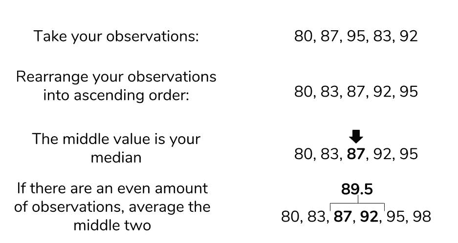
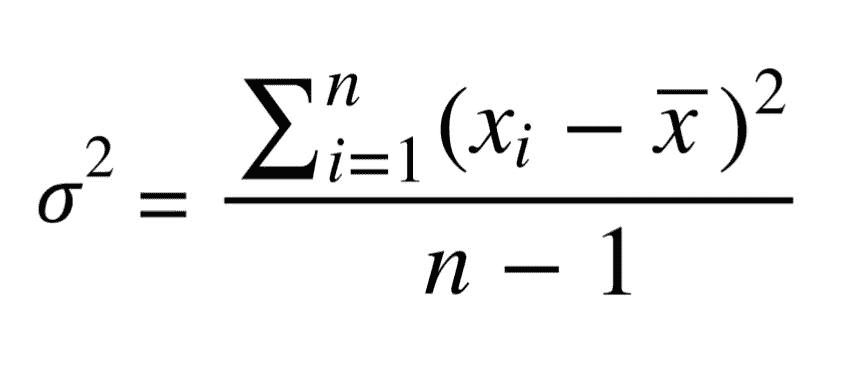

# 教程:Python 中的基本统计-描述性统计

> 原文：<https://www.dataquest.io/blog/basic-statistics-with-python-descriptive-statistics/>

July 3, 2018The field of statistics is often misunderstood, but it plays an essential role in our everyday lives. Statistics, done correctly, allows us to extract knowledge from the vague, complex, and difficult real world. Wielded incorrectly, statistics can be used to harm and mislead. A clear understanding of statistics and the meanings of various statistical measures is important to distinguishing between truth and misdirection. We will cover the following in this article:

*   定义统计数据
*   描述统计学
    *   集中趋势测量
    *   传播的量度

## 先决条件:

本文假设没有统计学的先验知识，但是至少需要 Python 的一般知识。如果你对 for 循环和列表感到不舒服，我建议你在继续学习之前先学习一下 Dataquest 的 Python 基础课程。

## 加载我们的数据

我们将基于真实世界的数据来讨论统计数据，这些数据来自 Kaggle 的[葡萄酒评论](https://www.kaggle.com/zynicide/wine-reviews/data)数据集。数据本身来自一个搜索葡萄酒爱好者网站的刮刀。为了这篇文章，假设你是一个正在培训的品酒师，一个新的品酒师。你发现了这个有趣的葡萄酒数据集，你想比较和对比不同的葡萄酒。您将使用统计数据来描述数据集中的葡萄酒，并从中获得一些见解。也许我们可以从一套便宜的葡萄酒开始我们的训练，或者是评价最高的？下面的代码将数据集`wine-data.csv`作为列表列表加载到变量`wines`中。我们将在整篇文章中对`wines`进行统计。您可以在自己的计算机上使用这些代码。

```
 import csv
with open("wine-data.csv", "r", encoding="latin-1") as f:
    wines = list(csv.reader(f))
```

让我们简要地看一下 table 中的前五行数据，这样我们就可以看到我们正在处理哪种类型的值。

| 指数 | 国家 | 描述 | 指定 | 点 | 价格 | 省 | 区域 _1 | 区域 _2 | 多样化 | 酿酒厂 |
| --- | --- | --- | --- | --- | --- | --- | --- | --- | --- | --- |
| Zero | 美国 | “这个惊人的 100%…” | 马撒葡萄园岛 | Ninety-six | Two hundred and thirty-five | 加利福尼亚 | 纳帕谷 | 英特尔迅驰双核移动计算技术 | 解百纳索维浓 | Heitz |
| one | 西班牙 | “无花果的成熟香气… | 特别储备胡萝卜 | Ninety-six | One hundred and ten | 西班牙北部 | 公牛 |  | 廷塔-德托罗 | 博德加卡门·罗德里格斯 |
| Two | 美国 | “麦克·沃森荣誉…… | 特别精选晚熟收获 | Ninety-six | Ninety | 加利福尼亚 | 骑士谷 | 索诺马 | 白葡萄酒 | 麦考利 |
| three | 美国 | “这花了 20 个月…… | 保留 | Ninety-six | Sixty-five | 俄勒冈州 | 威拉米特山谷 | 威拉米特山谷 | 黑皮诺酒 | 庞氏骗局 |
| four | 法国 | “这是顶级葡萄酒… | 拉布雷拉德 | Ninety-five | Sixty-six | 普罗旺斯 | 班多尔 |  | 普罗旺斯红混合 | 米色区 |

## 统计究竟是什么？

这个问题看起来很难。统计是非常非常多的事情，所以试图将其归类为一个简短的总结无疑会掩盖一些细节，但我们必须从某个地方开始。作为一个完整的领域，统计学可以被认为是处理数据的科学的 T2 框架。这个定义包括了所有与收集、分析和解释数据相关的任务。统计数据也可以指代表数据本身的**摘要或方面的单个度量。**在整篇文章中，我们将尽力区分现场测量和实际测量。

这自然让我们不禁要问:但数据是什么？幸运的是，数据更容易定义。数据是对世界观察的总体收集，其性质可能大不相同，从定性到定量都有。研究人员从实验中收集数据，企业家从他们的用户中收集数据，游戏公司从他们的玩家行为中收集数据。这些例子指出了数据的另一个重要方面:观察通常与感兴趣的**人群**有关。回到前面的例子，一个研究人员可能正在观察一组有特殊情况的病人。

对于我们的数据，有问题的人群是一组葡萄酒评论。人口这个术语非常模糊。通过清楚地定义我们的人口，我们能够对我们的数据进行统计，并从中提取知识。但是我们为什么要对人口感兴趣呢？能够**比较和对比**人群来测试我们对世界的想法是很有用的。我们想知道接受新疗法的患者实际上比接受安慰剂的患者更好，但我们也想从数量上证明这一点。这就是统计学的用武之地:给我们一种严谨的方法来处理数据，并根据世界上的真实事件而不是抽象的猜测做出决策。

## 关键要点:

*   统计学是数据的科学。
*   数据是对感兴趣的人群的观察的任何集合。
*   统计学给了我们一个具体的方法，用数字而不是模糊的描述来比较人口。

## 描述统计学

当我们有一组观察值时，将我们数据的特征总结成一个名为**的描述性统计量**是很有用的。顾名思义，描述性统计描述了他们总结的数据的特定质量。这些统计分为两大类:集中趋势的**指标**和扩散的**指标**。

## 集中趋势测量

集中趋势的测量是代表以下问题的答案的度量:“我们的数据的中间看起来像什么？”单词*中间*是模糊的，因为我们可以用多种定义来表示中间。我们将讨论每个新的测量方法如何改变我们对中间值的定义。

### 平均

**平均值**是一个描述性的统计数据，它着眼于一个数据集的平均值。虽然*的意思是*是一个专业术语，但大多数人会把它理解为仅仅是*的平均值*。这个平均数是怎么算出来的？下图采用了实际的等式，并将计算组件分解为更简单的术语。在平均值的情况下，数据集的“中间”指的是这个典型值。平均值代表了我们数据集中典型的观察值。如果我们随机选择一个观察值，那么我们可能会得到一个接近平均值的值。在 Python 中，计算平均值是一项简单的任务。我们来算算数据集中的平均酒分是多少。

```
 # Extract all of the scores from the data set 
scores = [float(w[4]) for w in wines]

# Sum up all of the scores 
sum_score = sum(scores)

# Get the number of observations
num_score = len(scores)

# Now calculate the average
avg_score = sum_score / num_score

avg_score
>>> 87.8884184721394
```

葡萄酒数据集中的平均分数告诉我们，数据集中的“典型”分数在 87.8 左右。这告诉我们，数据集中的大多数葡萄酒都有很高的评级，假设从 0 到 100。然而，我们必须注意，葡萄酒爱好者网站选择不发布分数低于 80 的评论。有多种类型的手段，但这种形式是最常见的使用。这个平均值被称为*算术平均值*，因为我们对感兴趣的值求和。

### 中位数

我们将讨论的下一个集中趋势的度量是**中位数**。中位数也试图定义数据集中的典型值，但与平均值不同，它不需要计算。为了找到中间值，我们首先需要按升序重组我们的数据集。则中值是与数据集的中间相一致的值。如果有偶数个项目，那么我们取中间的两个值的平均值。

虽然 Python 的标准库不支持中位数函数，但我们仍然可以使用我们描述的过程找到中位数。让我们试着找出葡萄酒价格的中间值。

```
 # Isolate prices from the data set
prices = [float(w[5]) for w in wines if w[5] != ""]

# Find the number of wine prices 
num_wines = len(prices)

# We'll sort the wine prices into ascending order
sorted_prices = sorted(prices)

# We'll calculate the middle index 
middle = (num_wines / 2) + 0.5

# Now we can return the median
sorted_prices[middle]

>>> 24
```

数据集中一瓶葡萄酒的中值价格是 24 美元。这一发现表明，数据集中至少有一半的葡萄酒售价为 24 美元或更低。那挺好的！如果我们试着找出平均值呢？鉴于它们都代表一个典型值，我们预计它们会大致相同。

```
sum(prices)/len(prices)

>>> 33.13
```

33.13 美元的平均价格肯定与我们的中值相差甚远，那么这里发生了什么呢？平均值和中值之间的差异是由于**稳健性**造成的。

#### 离群值问题

请记住，平均值是通过将我们想要的所有值相加并除以项目数来计算的，而中位数是通过简单地重新排列项目来找到的。如果我们的数据中有**异常值**，比其他值高得多或低得多的项目，它会对平均值产生不利影响。也就是说，均值不是**稳健**地离群值。中位数，不必看离群值，对它们是稳健的。让我们看看我们在数据中看到的最高和最低价格。

```
 min_price = min(prices)
max_price = max(prices)

print(min_price, max_price)

4.0, 2300.0
```

我们现在知道异常值存在于我们的数据中。离群值可以代表我们数据收集中有趣的事件或错误，因此能够识别它们何时出现在数据中非常重要。中位数和众数的比较只是检测异常值的许多方法之一，尽管可视化通常是检测它们的更快方法。

### 方式

我们将讨论的最后一个集中趋势的度量是**模式**。众数被定义为在我们的数据中出现最频繁的值。作为“中间”的模式的直觉不像 mean 或 median 那样直接，但是有一个清楚的基本原理。如果一个值在整个数据中重复出现，我们也知道它会影响平均值。一个值出现的越多，对均值的影响就越大。因此，一个模式代表了我们的均值的最高加权贡献因子。像 median 一样，Python 中没有内置的 mode 函数，但是我们可以通过统计我们的价格的外观并寻找最大值来找出它。

```
 # Initialize an empty dictionary to count our price appearances
price_counts = {}
for p in prices:
    if p not in price_counts:
        counts[p] = 1
    else:
        counts[p] += 1

# Run through our new price_counts dictionary and log the highest value
maxp = 0
mode_price = None

for k, v in counts.items():
    if maxp < v:
        maxp = v
        mode_price = kprint(mode_price, maxp)

>>> 20.0, 7860
```

众数相当接近中位数，所以我们可以有一定的信心，我们的中位数和众数都代表我们的葡萄酒价格的中间值。集中趋势的测量对于总结我们的数据中的平均观察是什么样的是有用的。然而，它们没有告诉我们**如何分布**数据。这些传播的概要就是**传播测量**帮助描述的。

## 传播的量度

传播的度量(也称为离差)回答了“我的数据变化有多大？”每当我们观察这个世界时，很少有事情是一成不变的。我们都知道有人曾感叹体重的轻微变化是由于自然波动而不是直接的体重增加。这种可变性使世界变得模糊和不确定，因此有一个度量标准来概括这种“模糊性”是很有用的。

### 极差和四分位差

我们将涉及的第一个传播度量是**范围**。Range 是我们将看到的最简单的计算方法:从数据的最大值中减去数据集的最小值。在调查中值时，我们发现了葡萄酒价格的最小值和最大值，因此我们将使用它们来找出范围。

```
 price_range = max_price - min_price
print(price_range)

>>> 2296.0
```

我们发现了一个 2296 的范围，但是这到底意味着什么呢？当我们审视我们的各种衡量标准时，将所有这些信息*放在您的数据*的上下文中是很重要的。我们的中间价格是 24 美元，我们的范围是 2296 美元。这个范围比我们的中位数高两个数量级，所以这表明我们的数据非常分散。也许如果我们有另一个葡萄酒数据集，我们可以比较这两个数据集的范围，以了解它们之间的差异。否则，范围本身并不是超级有用的。更常见的是，我们希望看到我们的数据与典型值相差多少。该汇总由**标准差**和**方差**管辖。

### 标准偏差

标准差也是对观察值分布的度量，但它是对你的数据偏离典型数据点的*多少*的陈述。也就是说，标准差概括了你的数据与均值相差多少。这种与平均值的关系在标准差的计算中是显而易见的。方程的结构值得讨论。回想一下，平均值的计算方法是将所有观察值相加，然后除以观察次数。标准偏差方程与此类似，但除了额外的平方根运算之外，它还试图计算平均值*偏差*。你可能在别处看到`n`是分母而不是`n-1`。这个细节的细节超出了本文的范围，但是知道使用`n-1`通常被认为是更正确的。本文末尾有一个解释链接。

我们想要计算标准差，以更好地描述我们的葡萄酒价格和分数，因此我们将为此创建一个专用函数。手工计算数字的累积和很麻烦，但是 Python 的`for`循环让这变得很简单。我们正在制作自己的函数来演示 Python 使得执行这些统计变得容易，但是知道`numpy`库也在`std`下实现标准差也是很好的。

```
 def stdev(nums):
    diffs = 0
    avg = sum(nums)/len(nums)
    for n in nums:
        diffs += (n - avg)**(2)
    return (diffs/(len(nums)-1))**(0.5)

print(stdev(scores))
>>> 3.2223917589832167

print(stdev(prices))
>>> 36.32240385925089
```

这些结果是意料之中的。分数只在 80 到 100 之间，所以我们知道标准差会很小。相比之下，带有异常值的价格会产生更高的价值。标准差越大，*越多，*展开的数据越接近平均值，反之亦然。我们会看到方差与标准差密切相关。

### 差异

通常，标准偏差和方差被归为一类是有原因的。下面是方差的方程，看着眼熟吗？

方差和标准差几乎是一模一样的东西！方差就是标准差的平方。同样，方差和标准差代表相同的东西，即分布的度量，但值得注意的是，单位是不同的。无论你的数据用什么单位，标准偏差都是一样的，变异也是这个单位的平方。许多统计学初学者问的一个问题是，*“但是我们为什么要平方偏差呢？绝对值不会在和中去掉讨厌的负数吗？”*虽然避免总和中的负值是平方运算的一个原因，但它不是唯一的原因。

像平均值一样，方差和标准差也会受到异常值的影响。很多时候，异常值也是我们数据集中感兴趣的点，所以对平均值的差值求平方可以让我们指出这种重要性。如果你熟悉微积分，你会发现有一个指数项可以让我们找到最小偏差点在哪里。通常情况下，你做的任何统计分析都只需要均值和标准差，但方差在其他学术领域仍然有重要意义。集中趋势和扩散的度量允许我们总结数据集的关键方面，我们可以在这些总结的基础上从我们的数据中收集更多的见解。

## 关键要点

*   描述性统计为我们的数据提供了简单的总结。
*   (算术)平均值计算数据集的典型值。它并不健壮。
*   中位数是我们数据集的精确中间值。它很健壮。
*   众数是出现最多的值。
*   该范围是数据集中最大值和最小值之间的差值。
*   方差和标准差是距平均值的平均距离。

## 结论

很容易陷入统计方程的方程和细节中，但理解这些概念代表什么很重要。在本文中，我们探讨了一些基本描述性统计数据背后的一些细节，同时查看了一些葡萄酒数据来为我们的概念奠定基础。在下一部分，我们将讨论统计和概率之间的关系。我们在这里学到的描述性统计在理解这种联系中起着关键作用，所以在继续之前记住这些概念代表什么是很重要的。

## 延伸阅读:

在本文的前面，我们解释了为什么标准差有一个`n-1`项而不是`n`。`n-1`术语的使用被称为*贝塞尔校正。"

*   [贝塞尔的修正:为什么标准差的分母是 n-1](https://math.stackexchange.com/questions/61251/intuitive-explanation-of-bessels-correction)