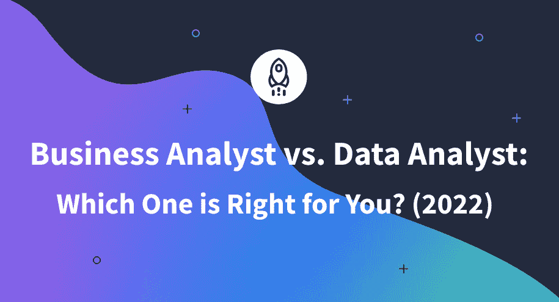

# 业务分析师与数据分析师:哪个适合你？(2022)

> 原文：<https://www.dataquest.io/blog/business-analyst-vs-data-analyst/>

July 1, 2022

*商业分析师*和*数据分析师*是两个非常时髦的数据职业。他们有许多共同点:都是最近才出现在劳动力市场上，都享受有竞争力的薪水，都处理大量数据，都在数据中寻找隐藏的见解和模式，以做出数据驱动的决策。

那么，这两个数据科学专业有什么区别，应该选择哪个呢？

很棒的问题！

为了回答这个问题，让我们看看业务分析师和数据分析师之间的异同，以便更好地理解每个角色的范围，并确定哪个角色最适合你。

### **他们做什么**

直奔主题:业务分析师做*业务分析*，数据分析师做*数据分析*。我们知道:帮助不大。让我们看看我们在维基百科的朋友对[商业分析](https://en.wikipedia.org/wiki/Business_analysis)和[数据分析](https://en.wikipedia.org/wiki/Data_analysis)有什么看法:

> 商业分析是一门识别商业需求和确定商业问题解决方案的专业学科。解决方案通常包括软件系统开发组件，但也可能包括过程改进、组织变更或战略规划和策略开发。
> 
> 数据分析是对数据进行检查、清理、转换和建模的过程，其目标是发现有用的信息、提供结论和支持决策。数据分析有多个方面和方法，包括各种名称下的不同技术，用于不同的商业、科学和社会科学领域。

### **比较责任和义务**

商业分析师的职责如下:

*   使用各种数字和非数字数据来识别当前的业务问题和机会
*   决定关键的行业趋势
*   理解和分析业务需求
*   评估主要业务功能、IT 结构和流程的效率
*   构建财务模型
*   衡量业务绩效的关键指标
*   就最佳行动方案提出建议
*   提供战略性、数据驱动的解决方案来支持业务决策

相反，数据分析师的角色意味着主要关注数字数据本身。

数据分析师的职责如下:

*   从不同来源收集数据
*   数据清理
*   数据操作
*   数据可视化
*   统计分析
*   提出和验证假设
*   数据库管理
*   揭示数据中的模式和趋势
*   寻找初始业务问题的答案
*   以令人信服的形式向相应的部门、经理或股东传达可行的见解。

### **他们与谁一起工作**

到目前为止，你可能已经知道你对这些数据科学工作中的哪一个更感兴趣。然而，让我们继续我们的比较——我们仍然有许多事情要讨论。例如，在每个角色中，你应该与哪些团队和专业人士一起工作？

业务分析师大多与销售、营销或产品团队以及客户服务密切互动。另一方面，数据分析师与数据科学家、数据工程师和数据管理团队合作。

业务分析师和数据分析师都与 IT 服务部门、经理、第三方股东沟通，当然也相互沟通。

一般来说，数据分析师的工作更加独立，而业务分析师通常与其他团队有更多的联系。

### **背景**

另一件可以帮助你决定最适合你的选择的事情是你的教育(如果你想转行的话)。

虽然业务分析师和数据分析师可以来自不同的技术或业务背景，但业务分析师往往拥有与业务相关的专业学位，如工商管理、企业管理、金融、商业、项目管理等。

数据分析师通常是更多的技术专家，他们毕业于 STEM(科学、技术、工程和数学)学科，如数学、编程、计算机科学、IT、统计、医疗保健、自然科学、工程等。

然而，对于数据分析师来说，掌握所在行业的领域知识也很重要。例如，如果你有数学背景，并希望在医疗保健领域担任数据分析师，那么成为一名杰出的数学家是不够的:你还需要在医疗保健领域积累足够的知识，以便理解和分析医疗数据。

### **技能和工具**

现在，让我们回顾一下你在业务分析师或数据分析师角色中取得成功所需的技能。虽然这些专家的一些技术数据科学技能和工具有所重叠，但他们的活动重点却有所不同。

对于业务分析师来说，关键能力如下:

*   强大的领域专业知识
*   数据分析
*   用 Excel 实现数据可视化
*   用 Power BI 和 Tableau 进行数据分析和数据建模
*   在 SQL 中使用数据库
*   熟练使用 SAP、SAS 或 Microsoft Visio 等工具
*   对项目管理流程有扎实的理解

此外，如果您正在考虑业务分析师的角色，您还需要 Python 及其数据分析库的基础知识。

至于数据分析师的角色，最基本的技能如下:

*   数据清理
*   数据争论
*   数据可视化
*   数据建模
*   数据库管理
*   概率与统计
*   假设检验

数据分析师在日常工作中使用的数据科学工具包括 Excel、Python 或 R(及其数据分析库)、SQL、Azure、命令行等等。如果你想了解更多数据分析的必要技巧，可以查看[这篇文章](https://www.dataquest.io/blog/data-analyst-skills/)。

两个角色的重要软技能是相似的。这里有一个方便的清单:

*   分析和数学思维
*   批判性思维
*   通讯技能
*   准确(性)
*   解决问题
*   积极主动性
*   对数据的好奇心
*   时间管理
*   能够独立和作为团队的一员高效工作

### **他们挣多少钱**

最后但同样重要的是，关于业务分析师和数据分析师的工资的紧迫问题。

一般来说，业务分析师的工资往往高于数据分析师的工资。例如，根据[实际上是](https://www.indeed.com/)，美国的[商业分析师的当前(平均)基本工资是每年 82，327 美元(截至 2022 年 6 月 25 日)，而](https://www.indeed.com/career/business-analyst/salaries)[数据分析师](https://www.indeed.com/career/data-analyst/salaries)的基本工资是每年 65，520 美元。你可以在这篇文章中阅读更多关于商业分析师薪水的最新趋势。

然而，有许多因素决定了这两种工作的实际工资价值:公司简介、规模、地理位置、职位的确切要求、你的资历、合同类型等。

### 摘要

在本文中，我们分析了业务分析师和数据分析师之间的差异，以帮助您选择最适合您的分析师。

如果你选择商业分析师的职位，那么在 [Dataquest](https://www.dataquest.io/) 的[商业分析师](https://www.dataquest.io/path/business-analyst/)职业道路可以是一个完美的起点。要学习数据分析并成为数据分析师，您可以探索我们的[Python 数据分析师](https://www.dataquest.io/path/data-analyst/)或[R](https://www.dataquest.io/path/data-analyst-r/)职业道路数据分析师。

无论你选择哪种职业，我都祝你学习愉快，顺利过渡到新的领域。