# 使用 Matplotlib 在 Python 中实现有趣的数据可视化

> 原文：<https://www.dataquest.io/blog/comical-data-visualization-in-python-using-matplotlib/>

July 15, 2021

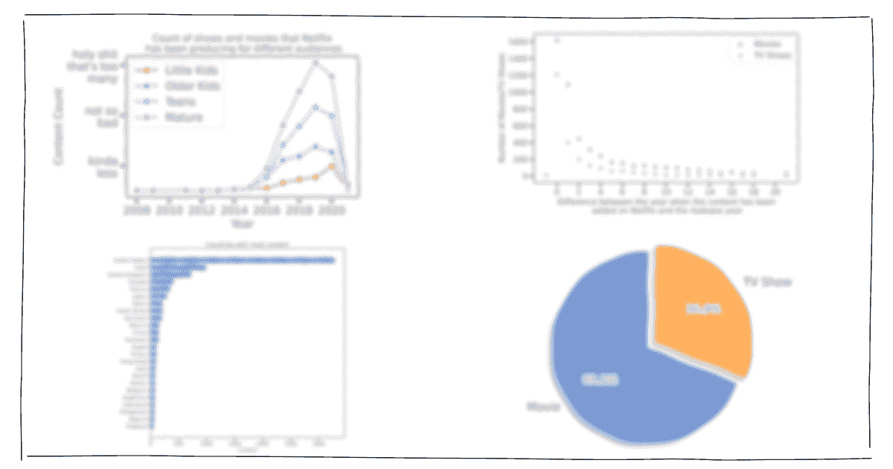

## 如何在 Matplotlib 中制作滑稽的可视化效果？使用网飞电影和电视节目数据集进行解释。

数据可视化是讲述一个故事的好方法。你可以很容易地吸收信息并识别数据中的模式。我们的一名学生决定使用 Matplotlib 创建 Python 中的数据可视化，以了解网飞上可用的不同类型的内容。

本文将重点介绍如何以有趣的方式使用 Matplotlib 进行数据可视化。阅读 Paridhi 整理的分步指南。尽情享受吧！

当你在网飞看完一场精彩的表演或 T2 的电影后，你有没有想过网飞是多么的棒，让你可以接触到如此丰富的内容？当然，我并不孤单，是吗？

一个想法引发另一个想法，在你知道之前，你已经下定决心做一个探索性的数据分析，以了解更多关于谁是最受欢迎的演员以及哪个国家更喜欢哪个流派的信息。

现在，我已经花了相当多的时间使用 Python 制作了常规的条形图和饼图，虽然它们在传达结果方面做得很好，但我想给这个项目添加一点有趣的元素。

我最近了解到，可以在 Python 最流行的数据可视化库 Matplotlib 中创建类似 xkcd 的图,并决定我应该在这个项目中合成我所有的 Matplotlib 可视化，只是为了让事情变得更有趣一些。

来看看数据都有什么说的吧！

### 数据

我用的是[这个数据集](https://www.kaggle.com/shivamb/netflix-shows)，在 Kaggle 上有。截至 2020 年，它包含网飞上可用的 7，787 部电影和电视节目。

首先，我安装了所需的库并阅读了 CSV 文件。

```
import pandas as pd
pan class="token keyword">import matplotlib.pyplot as plt
t.rcParams['figure.dpi'] = 200

 = pd.read_csv("../input/netflix-shows/netflix_titles.csv")
.head()
```

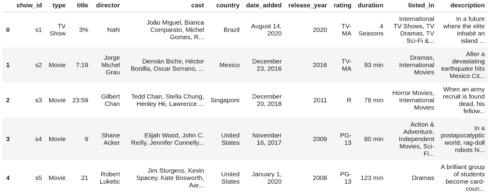

我还向数据集添加了新的特性，我将在项目的后面使用这些特性。

```
df["date_added"] = pd.to_datetime(df['date_added'])
['year_added'] = df['date_added'].dt.year.astype('Int64')
['month_added'] = df['date_added'].dt.month

['season_count'] = df.apply(lambda x : x['duration'].split(" ")[0] if "Season" in x['duration'] else "", axis = 1)
['duration'] = df.apply(lambda x : x['duration'].split(" ")[0] if "Season" not in x['duration'] else "", axis = 1)
.head()
```

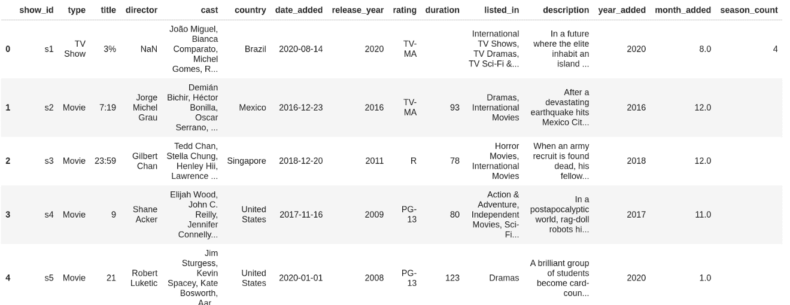

现在我们可以开始有趣的东西了！

我还要补充一点，对于 matplotlib 中的 XKCDify 可视化，您只需将所有绘图代码放入以下块中，就万事俱备了:

```
with plt.xkcd():
pan class="token comment" spellcheck="true"># all your regular visualization code goes in here
```

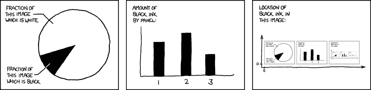

### 1.这些年来的网飞

首先，我认为有必要看一下描绘网飞这些年发展的时间表。

```
from datetime import datetime

n class="token comment" spellcheck="true"># these go on the numbers below
ates = [
"1997\nFounded",
"1998\nMail Service",
"2003\nGoes Public",
"2007\nStreaming service",
"2016\nGoes Global",
"2021\nNetflix & Chill"
n class="token punctuation">]
 = [1, 2, 4, 5.3, 8,9]

n class="token comment" spellcheck="true"># the numbers go on these
ub_x = [1.5,3,5,6.5,7]

ub_times = [
"1998","2000","2006","2010","2012"
n class="token punctuation">]

ext = [
"Netflix.com launched",
"Starts\nPersonal\nRecommendations","Billionth DVD Delivery","Canadian\nLaunch","UK Launch"]

n class="token keyword">with plt.xkcd():
n class="token comment" spellcheck="true"># Set figure & Axes
fig, ax = plt.subplots(figsize=(15, 4), constrained_layout=True)
ax.set_ylim(-2, 1.75)
ax.set_xlim(0, 10)

# Timeline : line
ax.axhline(0, xmin=0.1, xmax=0.9, c='deeppink', zorder=1)

# Timeline : Date Points
ax.scatter(tl_x, np.zeros(len(tl_x)), s=120, c='palevioletred', zorder=2)
ax.scatter(tl_x, np.zeros(len(tl_x)), s=30, c='darkmagenta', zorder=3)
# Timeline : Time Points
ax.scatter(tl_sub_x, np.zeros(len(tl_sub_x)), s=50, c='darkmagenta',zorder=4)

# Date Text
for x, date in zip(tl_x, tl_dates):
    ax.text(x, -0.55, date, ha='center',
            fontfamily='serif', fontweight='bold',
            color='royalblue',fontsize=12)

# Stemplot : vertical line
levels = np.zeros(len(tl_sub_x))
levels[::2] = 0.3
levels[1::2] = -0.3
markerline, stemline, baseline = ax.stem(tl_sub_x, levels, use_line_collection=True)
plt.setp(baseline, zorder=0)
plt.setp(markerline, marker=',', color='darkmagenta')
plt.setp(stemline, color='darkmagenta')

# Text
for idx, x, time, txt in zip(range(1, len(tl_sub_x)+1), tl_sub_x, tl_sub_times, tl_text):
    ax.text(x, 1.3*(idx%2)-0.5, time, ha='center',
            fontfamily='serif', fontweight='bold',
            color='royalblue', fontsize=11)

    ax.text(x, 1.3*(idx%2)-0.6, txt, va='top', ha='center',
        fontfamily='serif',color='royalblue')

# Spine
for spine in ["left", "top", "right", "bottom"]:
    ax.spines[spine].set_visible(False)

# Ticks
ax.set_xticks([])
ax.set_yticks([])

# Title
ax.set_title("Netflix through the years", fontweight="bold", fontfamily='serif', fontsize=16, color='royalblue')
ax.text(2.4,1.57,"From DVD rentals to a global audience of over 150m people - is it time for Netflix to Chill?", fontfamily='serif', fontsize=12, color='mediumblue')

plt.show()
```

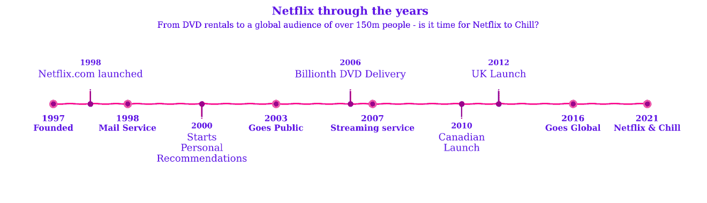

这个情节很好地描绘了网飞的旅程。此外，由于 plt.xkcd()函数，该图看起来像是手绘的。邪恶的东西。

### 2.电影与电视节目

接下来，我决定看看电影和电视剧的比例。

```
col = "type"
ped = df[col].value_counts().reset_index()
ped = grouped.rename(columns = {col : "count", "index" : col})

n class="token keyword">with plt.xkcd():
explode = (0, 0.1)  # only "explode" the 2nd slice (i.e. 'TV Show')
fig1, ax1 = plt.subplots(figsize=(5, 5), dpi=100)
ax1.pie(grouped["count"], explode=explode, labels=grouped["type"], autopct='%1.1f%%',
    shadow=True, startangle=90)
ax1.axis('equal')  # Equal aspect ratio ensures that pie is drawn as a circle.

plt.show()
```

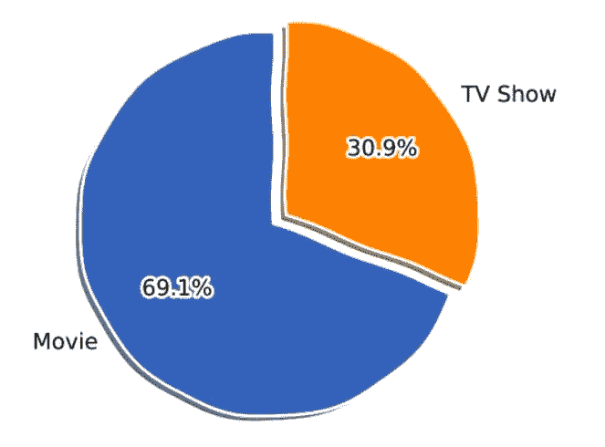

该平台上的电视节目数量不到总内容的三分之一。所以很可能，你和我都有更好的机会找到一部相对好的电影，而不是一部关于网飞的电视剧。叹气。

### 3.内容最多的国家

对于我使用 Matplotlib 的第三个可视化，我想制作一个水平条形图，代表内容最多的前 25 个国家。数据帧中的国家列有几行包含不止一个国家(用逗号分隔)。


为了处理这个问题，我用“，”作为分隔符将国家列中的数据分开，然后将所有国家放入一个名为 categories 的列表中:

```
from collections import Counter
= "country"

gories = ", ".join(df[col].fillna("")).split(", ")
ter_list = Counter(categories).most_common(25)
ter_list = [_ for _ in counter_list if _[0] != ""]
ls = [_[0] for _ in counter_list]
es = [_[1] for _ in counter_list]

n class="token keyword">with plt.xkcd():
fig, ax = plt.subplots(figsize=(10, 10), dpi=100)
y_pos = np.arange(len(labels))
ax.barh(y_pos, values, align='center')
ax.set_yticks(y_pos)
ax.set_yticklabels(labels)
ax.invert_yaxis()  # labels read top-to-bottom
ax.set_xlabel('Content')
ax.set_title('Countries with most content')

plt.show()
```

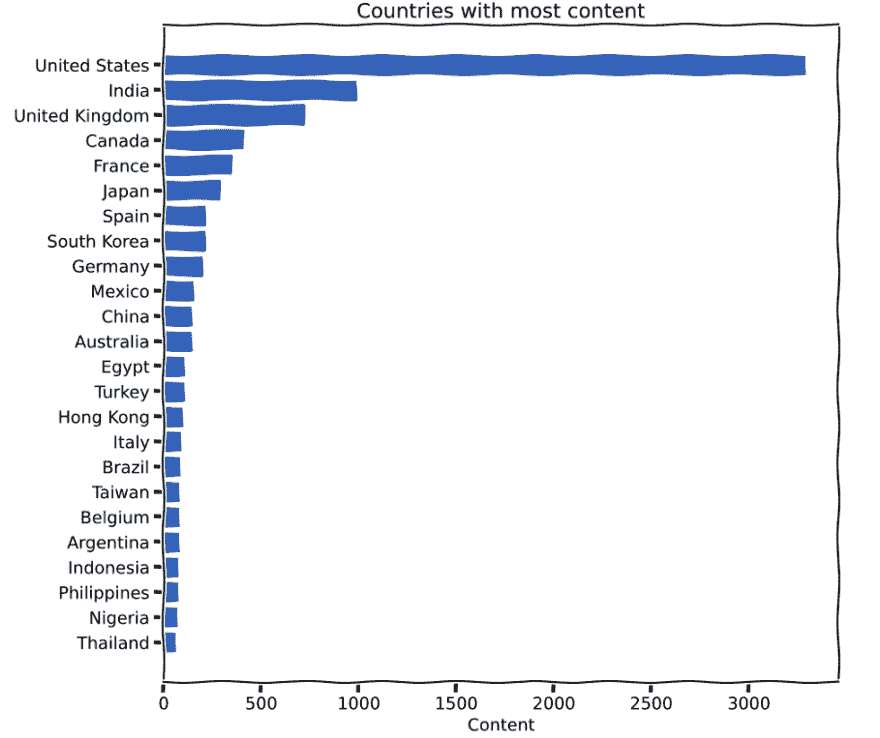

看了上面的情节后的一些总体想法:

*   网飞上的绝大多数内容来自美国(相当明显)。

*   尽管网飞在印度起步较晚(2016 年)，但它已经位居第二，仅次于美国。因此，印度是网飞的一个大市场。

*   我将在网飞上寻找来自泰国的内容，现在我知道它在平台上，brb。

### 4.受欢迎的导演和演员

为了看看受欢迎的导演和演员，我决定用来自内容最多的前六个国家的六个次要情节绘制一个图形(每个)，并为每个次要情节制作水平条形图。看看下面的图，再读一遍第一行。

### a.热门导演:

从集合导入计数器

```
from collections import Counter
n class="token keyword">from matplotlib.pyplot import figure
n class="token keyword">import math

urs = ["orangered", "mediumseagreen", "darkturquoise", "mediumpurple", "deeppink", "indianred"]
tries_list = ["United States", "India", "United Kingdom", "Japan", "France", "Canada"]
= "director"

n class="token keyword">with plt.xkcd():
figure(num=None, figsize=(20, 8))
x=1
for country in countries_list:
    country_df = df[df["country"]==country]
    categories = ", ".join(country_df[col].fillna("")).split(", ")
    counter_list = Counter(categories).most_common(6)
    counter_list = [_ for _ in counter_list if _[0] != ""]
    labels = [_[0] for _ in counter_list][::-1]
    values = [_[1] for _ in counter_list][::-1]
    if max(values)<10:
        values_int = range(0, math.ceil(max(values))+1)
    else:
        values_int = range(0, math.ceil(max(values))+1, 2)
    plt.subplot(2, 3, x)
    plt.barh(labels,values, color = colours[x-1])
    plt.xticks(values_int)
    plt.title(country)
    x+=1
plt.suptitle('Popular Directors with the most content')
plt.tight_layout()
plt.show()
```

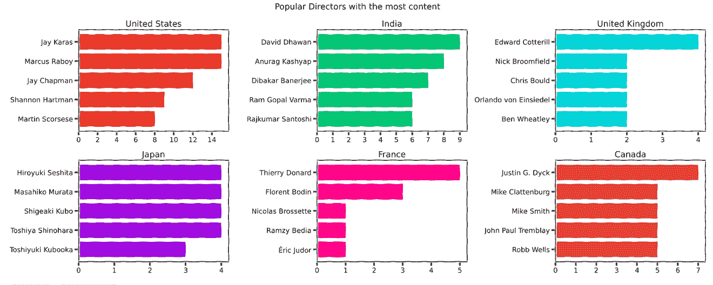

### b.热门演员:

```
col = "cast"

n class="token keyword">with plt.xkcd():
figure(num=None, figsize=(20, 8))
x=1
for country in countries_list:
    df["from_country"] = df['country'].fillna("").apply(lambda x : 1 if country.lower() in x.lower() else 0)
    small = df[df["from_country"] == 1]
    cast = ", ".join(small['cast'].fillna("")).split(", ")
    tags = Counter(cast).most_common(11)
    tags = [_ for _ in tags if "" != _[0]]
    labels, values = [_[0]+"  " for _ in tags][::-1], [_[1] for _ in tags][::-1]
    if max(values)<10:
        values_int = range(0, math.ceil(max(values))+1)
    elif max(values)>=10 and max(values)<=20:
        values_int = range(0, math.ceil(max(values))+1, 2)
    else:
        values_int = range(0, math.ceil(max(values))+1, 5)
    plt.subplot(2, 3, x)
    plt.barh(labels,values, color = colours[x-1])
    plt.xticks(values_int)
    plt.title(country)
    x+=1
plt.suptitle('Popular Actors with the most content')
plt.tight_layout()
plt.show()
```


### 5.一些最古老的电影和电视节目

我觉得看看网飞最古老的电影和电视节目以及它们的历史会很有趣。

### a.最老的电影:

```
small = df.sort_values("release_year", ascending = True)
all = small[small['duration'] != ""].reset_index()
all[['title', "release_year"]][:15]
```

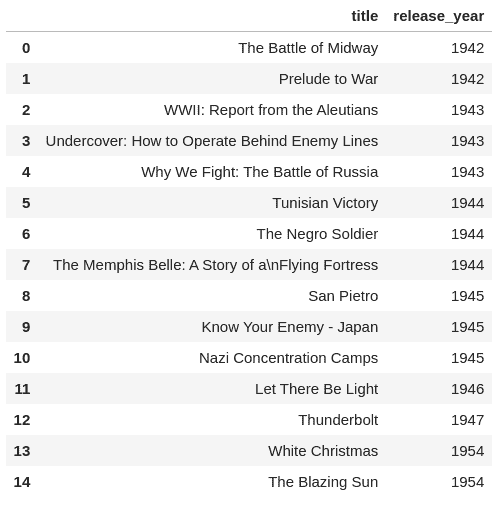

### b.最旧的电视节目:

```
small = df.sort_values("release_year", ascending = True)
all = small[small['season_count'] != ""].reset_index()
all = small[['title', "release_year"]][:15]
all
```

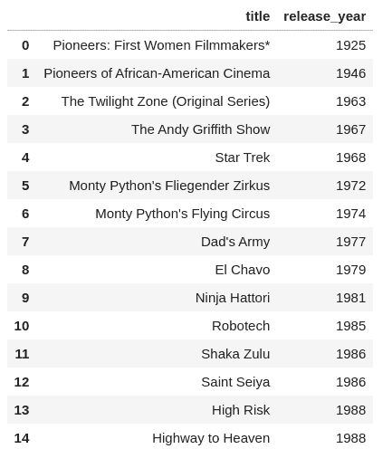

哦，网飞有一些非常老的电影和电视节目——有些甚至是 80 多年前发行的。你看过这些吗？

(有趣的事实:当他开始实施 Python 时，吉多·范·罗苏姆也在阅读来自 20 世纪 70 年代 BBC 喜剧系列[《蒙蒂·Python 的飞行马戏团》(Monty Python ' s Flying Circus)](https://en.wikipedia.org/wiki/Monty_Python)(该系列于 2018 年在网飞播出)的已发布脚本。Van Rossum 认为他需要一个简短、独特且略带神秘的名字，所以他决定将这种语言称为 Python。)

### 6.网飞有最新的内容吗？

是的，网飞很酷，因为它有一个世纪以前的内容，但是它也有最新的电影和电视节目吗？为了找到答案，首先我计算了内容被添加到网飞的日期和内容发布年份之间的差异。

```
df["year_diff"] = df["year_added"]-df["release_year"]
```

然后，我创建了一个散点图，x 轴为年份差异，y 轴为电影/电视节目的数量:

```
col = "year_diff"
_movies = df[df["duration"]!=""]
_shows = df[df["season_count"]!=""]
ped1 = only_movies[col].value_counts().reset_index()
ped1 = grouped1.rename(columns = {col : "count", "index" : col})
ped1 = grouped1.dropna()
ped1 = grouped1.head(20)
ped2 = only_shows[col].value_counts().reset_index()
ped2 = grouped2.rename(columns = {col : "count", "index" : col})
ped2 = grouped2.dropna()
ped2 = grouped2.head(20)

n class="token keyword">with plt.xkcd():
figure(num=None, figsize=(8, 5))
plt.scatter(grouped1[col], grouped1["count"], color = "hotpink")
plt.scatter(grouped2[col], grouped2["count"], color = '#88c999')
values_int = range(0, math.ceil(max(grouped1[col]))+1, 2)
plt.xticks(values_int)
plt.xlabel("Difference between the year when the content has been\n added on Netflix and the realease year")
plt.ylabel("Number of Movies/TV Shows")
plt.legend(["Movies", "TV Shows"])
plt.tight_layout()
plt.show()
```

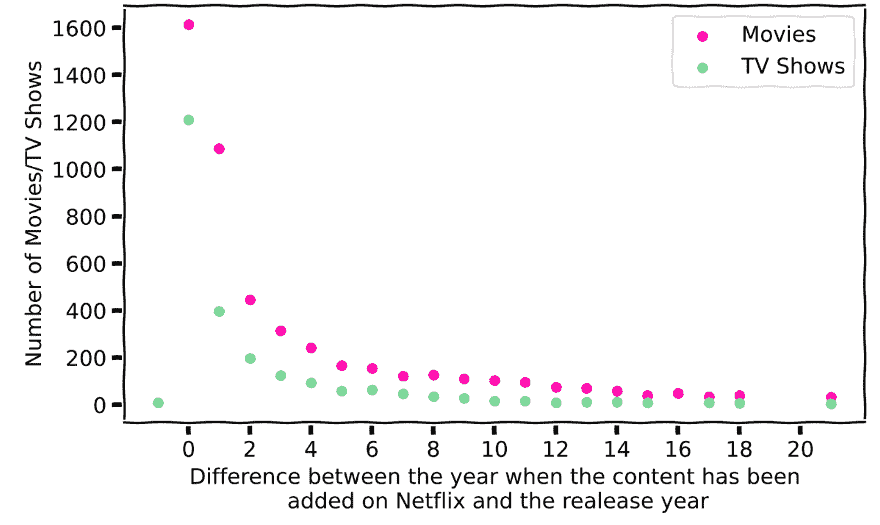

正如你在上面的图像中看到的，网飞上的大部分内容都是在发布后一年内添加的。所以，网飞大部分时间都有最新的内容！

如果你还在这里，这里有一个 xkcd 漫画给你。不客气


### 7.网飞关注什么样的内容？

我还想探索评级栏，比较网飞为儿童、青少年和成人制作的内容数量，以及这些年来他们的关注点是否从一个群体转移到了另一个群体。

为了做到这一点，我首先查看了数据框架中的独特评级:

```
print(df['rating'].unique())
```

输出:

```
['TV-MA' 'R' 'PG-13' 'TV-14' 'TV-PG' 'NR' 'TV-G' 'TV-Y' nan 'TV-Y7' 'PG' 'G' 'NC-17' 'TV-Y7-FV' 'UR']
```

然后，我根据他们所属的组(即小孩、大孩子、青少年和成年人)对评级进行分类，并将评级栏中的值更改为他们的组名。

```
ratings_list = ['TV-MA', 'R', 'PG-13', 'TV-14', 'TV-PG', 'TV-G', 'TV-Y', 'TV-Y7', 'PG', 'G', 'NC-17', 'TV-Y7-FV']
ngs_group_list = ['Little Kids', 'Older Kids', 'Teens', 'Mature']
ngs_dict={
'TV-G': 'Little Kids',
'TV-Y': 'Little Kids',
'G': 'Little Kids',
'TV-PG': 'Older Kids',
'TV-Y7': 'Older Kids',
'PG': 'Older Kids',
'TV-Y7-FV': 'Older Kids',
'PG-13': 'Teens',
'TV-14': 'Teens',
'TV-MA': 'Mature',
'R': 'Mature',
'NC-17': 'Mature'
n class="token punctuation">}
n class="token keyword">for rating_val, rating_group in ratings_dict.items():
df.loc[df.rating == rating_val, "rating"] = rating_group
```

最后，我用 x 轴上的年份和 y 轴上的内容计数做了线图。

```
df['rating_val']=1
an class="token operator">=0
ls=['kinda\nless', 'not so\nbad', 'holyshit\nthat\'s too\nmany']

n class="token keyword">with plt.xkcd():
for r in ratings_group_list:
    grouped = df[df['rating']==r]
    year_df = grouped.groupby(['year_added']).sum()
    year_df.reset_index(level=0, inplace=True)
    plt.plot(year_df['year_added'], year_df['rating_val'], color=colours[x], marker='o')
    values_int = range(2008, math.ceil(max(year_df['year_added']))+1, 2)
    plt.yticks([200, 600, 1000], labels)
    plt.xticks(values_int)
    plt.title('Count of shows and movies that Netflix\n has been producing for different audiences', fontsize=12)
    plt.xlabel('Year', fontsize=14)
    plt.ylabel('Content Count', fontsize=14)
    x+=1
plt.legend(ratings_group_list)
plt.tight_layout()
plt.show()
```

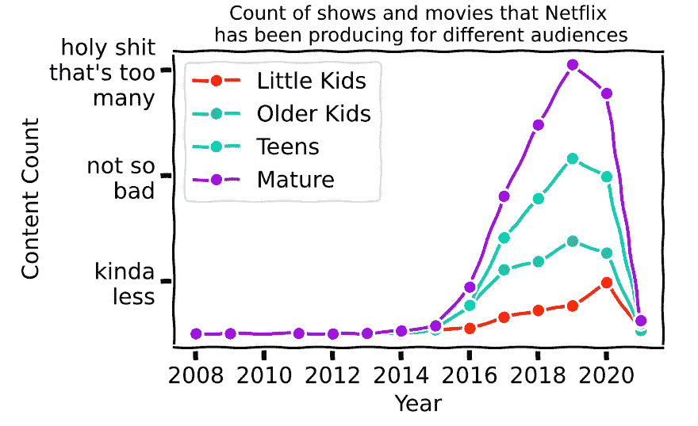

好的，这个可视化的数据向我们展示了网飞成熟观众的内容数量远远高于其他群体。另一个有趣的观察结果是，从 2019 年到 2020 年，为小孩子制作的内容数量激增，而在此期间，为较大的孩子、青少年和成年观众制作的内容减少了。

### 8.热门流派(全国)

```
col = "listed_in"
urs = ["violet", "cornflowerblue", "darkseagreen", "mediumvioletred", "blue", "mediumseagreen", "darkmagenta", "darkslateblue", "seagreen"]
tries_list = ["United States", "India", "United Kingdom", "Japan", "France", "Canada", "Spain", "South Korea", "Germany"]

n class="token keyword">with plt.xkcd():
figure(num=None, figsize=(20, 8))
x=1
for country in countries_list:
    df["from_country"] = df['country'].fillna("").apply(lambda x : 1 if country.lower() in x.lower() else 0)
    small = df[df["from_country"] == 1]
    genre = ", ".join(small['listed_in'].fillna("")).split(", ")
    tags = Counter(genre).most_common(3)
    tags = [_ for _ in tags if "" != _[0]]
    labels, values = [_[0]+"  " for _ in tags][::-1], [_[1] for _ in tags][::-1]
    if max(values)>200:
        values_int = range(0, math.ceil(max(values)), 100)
    elif max(values)>100 and max(values)<=200:
        values_int = range(0, math.ceil(max(values))+50, 50)
    else:
        values_int = range(0, math.ceil(max(values))+25, 25)
    plt.subplot(3, 3, x)
    plt.barh(labels,values, color = colours[x-1])
    plt.xticks(values_int)
    plt.title(country)
    x+=1
plt.suptitle('Top Genres')
plt.tight_layout()
plt.show()
```

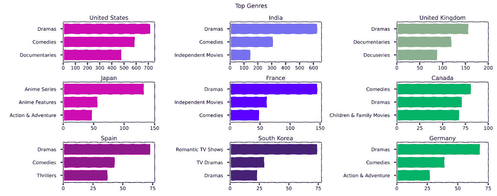

该地块的主要收获:

*   戏剧和喜剧几乎在每个国家都是最受欢迎的类型。

*   日本看很多动漫！

*   浪漫的电视节目和电视剧在韩国很受欢迎。(顺便说一句，我也迷上了 k 剧)

*   儿童和家庭电影是加拿大第三大流行类型。

### 9.单词云

我最终用两个单词云结束了这个项目——首先，一个单词云用于描述列，另一个用于标题列。

### a.文字云描述:

```
from wordcloud import WordCloud
pan class="token keyword">import random
pan class="token keyword">from PIL import Image
pan class="token keyword">import matplotlib

pan class="token comment" spellcheck="true"># Custom colour map based on Netflix palette
ap = matplotlib.colors.LinearSegmentedColormap.from_list("", ['#221f1f', '#b20710'])
xt = str(list(df['description'])).replace(',', '').replace('[', '').replace("'", '').replace(']', '').replace('.', '')
sk = np.array(Image.open('../input/finallogo/New Note.png'))
rdcloud = WordCloud(background_color = 'white', width = 500, height = 200,colormap=cmap, max_words = 150, mask = mask).generate(text)

t.figure( figsize=(5,5))
t.imshow(wordcloud, interpolation = 'bilinear')
t.axis('off')
t.tight_layout(pad=0)
t.show()
```


生活、爱情、生活、朋友、家庭、世界和寻找是电影和电视剧描述中出现频率最高的几个词。另一个有趣的事情是，一、二、三、四这些词都出现在单词 cloud 中。

### b.标题的文字云

```
cmap = matplotlib.colors.LinearSegmentedColormap.from_list("", ['#221f1f', '#b20710'])
xt = str(list(df['title'])).replace(',', '').replace('[', '').replace("'", '').replace(']', '').replace('.', '')
sk = np.array(Image.open('../input/finallogo/New Note.png'))
rdcloud = WordCloud(background_color = 'white', width = 500, height = 200,colormap=cmap, max_words = 150, mask = mask).generate(text)

t.figure( figsize=(5,5))
t.imshow(wordcloud, interpolation = 'bilinear')
t.axis('off')
t.tight_layout(pad=0)
t.show()
```


你看到圣诞节就在这个词的中心吗？看起来网飞有很多圣诞电影。其他受欢迎的词有爱情、世界、男人、生活、故事、生活、秘密、女孩、男孩、美国人、游戏、夜晚、最后、时间和白天。

### 就是这样！

我只花了几个小时就完成了这个项目，现在我能以一种新的方式看到网飞的一切。我认为这是我迄今为止做过的最有趣的项目，接下来我肯定会通过建立一个推荐系统来扩展这个项目。从事这样的项目让我想到数据科学真的很酷。

我希望这个项目和所有使用 Matplotlib 的滑稽的数据可视化例子也能给你的项目带来灵感。

如果您有任何问题/反馈或只是想聊天，您可以通过 [Twitter](https://twitter.com/paridhitweets) 或 [LinkedIn](https://www.linkedin.com/in/paridhi-agarwal-23789b165/) 联系我。

## 如何学习使用 Matplotlib 进行数据可视化？

*   通过我们的[数据可视化基础课程](https://www.dataquest.io/course/exploratory-data-visualization/)了解如何使用 Matplotlib
*   通过我们的[讲故事、数据可视化和信息设计课程](https://www.dataquest.io/course/storytelling-data-visualization/)了解如何交流见解

您也可以查看以下课程:

*   了解如何使用 matplotlib 创建线图来分析数据。
*   了解如何使用 Matplotlib 生成散点图
*   了解如何使用 Matplotlib 生成条形图和直方图

本文由 Dataquest 社区的 Paridhi Agarwal 提供。你可以在 LinkedIn 和 Twitter 上找到帕里迪。