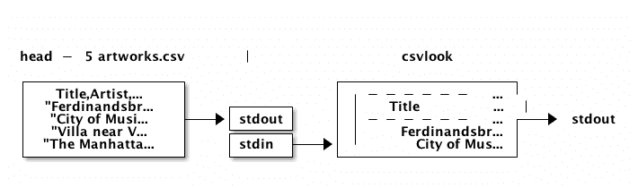

# 教程:使用命令行和 csvkit 清理 CSV 数据

> 原文：<https://www.dataquest.io/blog/data-cleaning-command-line/>

December 10, 2015The Museum of Modern Art is one of the most influential museums in the world and they have released a dataset on the artworks in their collection. The dataset has some data quality issues, however, and requires cleanup.

在[之前的帖子](https://www.dataquest.io/blog/data-cleaning-with-python/)中，我们讨论了如何使用 Python 和 Pandas 来清理数据集。在这篇文章中，我们将了解如何使用`csvkit`库来获取和探索表格数据。

## 为什么是命令行？

很棒的问题！当在[云数据科学环境](https://www.dataquest.io/blog/digitalocean-docker-data-science/)中工作时，您有时只能访问服务器的外壳。在这种情况下，精通命令行数据科学是真正的超能力。随着您越来越熟练，使用命令行完成一些数据科学任务比编写 Python 脚本或 Hadoop 作业要快得多。

最后，命令行拥有丰富的工具生态系统，并集成到文件系统中。这使得某些类型的任务，尤其是涉及多个文件的任务变得异常简单。这个职位需要一些在命令行工作的经验。如果你是命令行新手，我推荐你去看看我们的[交互式命令行课程](https://www.dataquest.io/course/python-for-data-science-fundamentals)

## csvkit

[`csvkit`](https://csvkit.readthedocs.org/en/0.9.1/) 是一个优化处理 CSV 文件的库。它是用 Python 写的，但是主要接口是命令行。您可以使用`pip`安装`csvkit`:

```py
pip install csvkit
```

你需要这个库来跟进这篇文章。

## 数据采集

MOMA 艺术品数据集可以在[博物馆的 Github repo](https://github.com/MuseumofModernArt/collection) 上找到。我们用 [`curl`](https://curl.haxx.se) 从 Github 下载`Artworks.csv`吧。`curl`是一个内置于大多数 shell 环境中的工具，允许您在服务器之间传输数据。Github 为每个文件提供了直接的 URL，你可以通过点击`Raw`按钮找到它。

最后，我们将使用`>`操作符将来自`curl`的输出重定向到一个名为`artworks.csv`的文件。

```py
curl https://raw.githubusercontent.com/MuseumofModernArt/collection/master/Artworks.csv > artworks.csv
```

## 数据探索

我们可以使用`head`命令显示文件的前`n`行(默认为 10 行)。要显示前 3 行，这两个命令都可以:

```py
 head -n 3 artworks.csv
head -3 artworks.csv 
```

```py
 Title,Artist,ArtistBio,Date,Medium,Dimensions,CreditLine,MoMANumber,Classification,Department,DateAcquired,CuratorApproved,ObjectID,URL
"Ferdinandsbrücke Project, Vienna, Austria , Elevation, preliminary version",Otto Wagner,"(Austrian, 1841–1918)",1896,Ink and cut-and-pasted painted pages on paper,"19 1/8 x 66 1/2"" (48.6 x 168.9 cm)",Fractional and promised gift of Jo Carole and Ronald S. Lauder,885.1996,A&D Architectural Drawing,Architecture & Design,1996-04-09,Y,2,https://www.moma.org/collection/works/2
"City of Music, National Superior Conservatory of Music and Dance, Paris, France, View from interior courtyard",Christian de Portzamparc,"(French, born 1944)",1987,Paint and colored pencil on print,"16 x 11 3/4"" (40.6 x 29.8 cm)",Gift of the architect in honor of Lily Auchincloss,1.1995,A&D Architectural Drawing,Architecture & Design,1995-01-17,Y,3,https://www.moma.org/collection/works/3 
```

与大多数数据集一样，看起来第一行包含列标题。除此之外，输出是混乱的，很难从默认输出中收集到任何其他信息。我们需要一个工具，知道如何以可读的方式显示 CSV 文件。

## 我的天啊！我的天啊！我的天啊！我的天啊！我的天啊！我的天啊！我的天啊！我的天啊！我的天啊！我的天啊！我的天啊！我的天啊

`csvlook`是`csvkit`中的一个工具，允许你以表格的形式显示和预览 CSV 文件。`csvlook artworks.csv`将显示整个数据集，这是繁琐的探索。让我们用管道将`head -5 artworks.csv`的`stdout`连接到`csvlook`来探索前 5 行:

```py
head -5 artworks.csv | csvlook
```

```py
 | Title                                                                                                        | Artist                   | ArtistBio                                 | Date | Medium                                                         | Dimensions                         | CreditLine                                                              | MoMANumber | Classification            | Department            | DateAcquired | CuratorApproved | ObjectID | URL                                     
| Ferdinandsbrücke Project, Vienna, Austria , Elevation, preliminary version                                    | Otto Wagner              | (Austrian, 1841–1918)                     | 1896 | Ink and cut-and-pasted painted pages on paper                  | 19 1/8 x 66 1/2" (48.6 x 168.9 cm) | Fractional and promised gift of Jo Carole and Ronald S. Lauder          | 885.1996   | A&D Architectural Drawing | Architecture & Design | 1996-04-09   | Y               | 2        | https://www.moma.org/collection/works/2  |
| City of Music, National Superior Conservatory of Music and Dance, Paris, France, View from interior courtyard | Christian de Portzamparc | (French, born 1944)                       | 1987 | Paint and colored pencil on print                              | 16 x 11 3/4" (40.6 x 29.8 cm)      | Gift of the architect in honor of Lily Auchincloss                      | 1.1995     | A&D Architectural Drawing | Architecture & Design | 1995-01-17   | Y               | 3        | https://www.moma.org/collection/works/3  |
| Villa near Vienna Project, Outside Vienna, Austria, Elevation                                                 | Emil Hoppe               | (Austrian, 1876–1957)                     | 1903 | Graphite, pen, color pencil, ink, and gouache on tracing paper | 13 1/2 x 12 1/2" (34.3 x 31.8 cm)  | Gift of Jo Carole and Ronald S. Lauder                                  | 1.1997     | A&D Architectural Drawing | Architecture & Design | 1997-01-15   | Y               | 4        | https://www.moma.org/collection/works/4  |
| The Manhattan Transcripts Project, New York, New York , Introductory panel to Episode 1: The Park             | Bernard Tschumi          | (French and Swiss, born Switzerland 1944) | 1980 | Photographic reproduction with colored synthetic laminate      | 20 x 20" (50.8 x 50.8 cm)          | Purchase and partial gift of the architect in honor of Lily Auchincloss | 2.1995     | A&D Architectural Drawing | Architecture & Design | 1995-01-17   | Y               | 5        | https://www.moma.org/collection/works/5 
```

以下是管道示意图:

虽然输出现在更容易阅读，但探索起来还是有点困难。现在让我们学习如何使用`csvcut`来选择几列并显示它们。

## csvcut〔t0〕

[`csvcut`](https://csvkit.readthedocs.org/en/0.9.1/tutorial/1_getting_started.html#csvcut-data-scalpel) 是`csvkit`中的一个工具，被称为数据手术刀，因为它允许你分割和修改 CSV 中的列。让我们首先列出所有使用`-n`标志的列:

```py
csvcut -n artworks.csv
```

```py
 1: Title
2: Artist
3: ArtistBio
4: Date
5: Medium
6: Dimensions
7: CreditLine
8: MoMANumber
9: Classification
10: Department
11: DateAcquired
12: CuratorApproved
13: ObjectID
14: URL 
```

然后我们可以使用`-c`标志来指定我们想要的列。`csvcut -c 1,2,3 artworks.csv | csvlook`将返回前 3 列。您也可以使用列名本身:`csvcut -c Artist,ArtistBio,Date`。运行任一命令都将显示整个数据集的 3 列，因此我们需要利用管道来查看几行。

我们可以参考`csvkit` [文档](https://csvkit.readthedocs.org/en/0.9.1/tutorial/1_getting_started.html#putting-it-together-with-pipes)来阅读`csvkit`公用设施之间的管道:

> 除了作为文件名之外，所有 csvkit 实用程序都接受输入文件作为“标准输入”。这意味着我们可以让一个 csvkit 实用程序的输出成为下一个的输入。

这意味着我们可以将`csvcut`的`stdout`通过管道传输到`csvlook`的`stdin`！我们可以构建以下管道:

*   使用`head`仅提取前`10`行
*   使用`csvcut`仅过滤前`3`列
*   使用`csvlook`以简洁的方式显示

```py
head -10 artworks.csv | csvcut -c 1,2,3 | csvlook
```

```py
|  Title                                                                                                        | Artist                   | ArtistBio                                  |
|  Ferdinandsbrücke Project, Vienna, Austria , Elevation, preliminary version                                    | Otto Wagner              | (Austrian, 1841–1918)                      |
|  City of Music, National Superior Conservatory of Music and Dance, Paris, France, View from interior courtyard | Christian de Portzamparc | (French, born 1944)                        |
|  Villa near Vienna Project, Outside Vienna, Austria, Elevation                                                 | Emil Hoppe               | (Austrian, 1876–1957)                      |
|  The Manhattan Transcripts Project, New York, New York , Introductory panel to Episode 1: The Park             | Bernard Tschumi          | (French and Swiss, born Switzerland 1944)  |
|  Villa, project, outside Vienna, Austria, Exterior perspective                                                 | Emil Hoppe               | (Austrian, 1876–1957)                      |
|  The Manhattan Transcripts Project, New York, New York , Episode 1: The Park                                   | Bernard Tschumi          | (French and Swiss, born Switzerland 1944)  |
|  The Manhattan Transcripts Project, New York, New York , Episode 1: The Park                                   | Bernard Tschumi          | (French and Swiss, born Switzerland 1944)  |
|  The Manhattan Transcripts Project, New York, New York , Episode 1: The Park                                   | Bernard Tschumi          | (French and Swiss, born Switzerland 1944)  |
|  The Manhattan Transcripts Project, New York, New York, Episode 1: The Park                                    | Bernard Tschumi          | (French and Swiss, born Switzerland 1944) 
```

## csvgrep

在处理历史数据集时，我们需要确保日期和时间列的格式正确(否则即使是基本的时间序列图也无法工作)。让我们探索一下`Date`和`DateAcquired`列:

```py
head -20 artworks.csv | csvcut -c Date,DateAcquired | csvlook
```

```py
 |----------+---------------|
|  Date    | DateAcquired  |
|----------+---------------|
|  1896    | 1996-04-09    |
|  1987    | 1995-01-17    |
|  1903    | 1997-01-15    |
|  1980    | 1995-01-17    |
|  1903    | 1997-01-15    |
|  1976-77 | 1995-01-17    |
|  1976-77 | 1995-01-17    |
|  1976-77 | 1995-01-17    |
|  1976-77 | 1995-01-17    |
|  1976-77 | 1995-01-17    |
|  1976-77 | 1995-01-17    |
|  1976-77 | 1995-01-17    |
|  1976-77 | 1995-01-17    |
|  1976-77 | 1995-01-17    |
|  1976-77 | 1995-01-17    |
|  1976-77 | 1995-01-17    |
|  1976-77 | 1995-01-17    |
|  1976-77 | 1995-01-17    |
|  1976-77 | 1995-01-17    |
|----------+---------------| 
```

虽然`DateAcquired`中的前 20 个值看起来不错，但是`Date`列中的一些值与大多数数据可视化工具如`1976-77`不太匹配。我们可以通过选择范围中的第一年(例如从范围`1976-77`中选择`1976`)来轻松处理这个问题。在我们这样做之前，让我们算出有多少行符合这个模式。

我们可以使用`csvgrep`工具提取一列(或多列)中匹配正则表达式的所有值。我们使用`-c`标志指定希望`csvgrep`匹配的列。我们使用`-regex`标志指定希望`csvgrep`使用的正则表达式。正则表达式`^([0-9]*-[0-9]*)`匹配由连字符(`-`)分隔的数值对。

因为我们正在搜索`Date`列上的模式实例，所以我们编写了以下代码:

```py
csvgrep --c Date --regex "^([0-9]*-[0-9]*)"
```

让我们修改并运行我们构建的管道来合并`csvgrep`:

```py
head -10 artworks.csv | csvcut -c Date | csvgrep --c Date --regex "^([0-9]*-[0-9]*)" | csvlook
```

```py
 |-----------|
|  Date     |
|-----------|
|  1976-77  |
|  1976-77  |
|  1976-77  |
|  1976-77  |
|-----------| 
```

## csvstart

精彩！既然我们知道它可以工作，让我们将正则表达式应用于整个`Date`列(而不仅仅是前 10 行),并确定有多少行匹配这个模式。`csvstat`工具将 CSV 作为输入(`stdin`)并计算汇总统计数据。我们可以使用`--count`标志来指定我们只需要行数。

我们也可以删除`csvcut`、`head`和`csvlook`，因为我们不需要显示输出。

```py
 csvgrep --c Date --regex "^([0-9]*-[0-9]*)" artworks.csv | csvstat --count 
```

```py
 Row count: 18073
```

看起来有 18073 行符合这个模式。现在让我们来计算一下:

*   有多少行符合 4 位数的年份模式
*   数据集总共包含多少行

我们可以使用 regex ( `^[0-9]{4}$`)来查找所有 4 位数的年份值，并将结果传送到`csvstat`:

```py
 csvgrep --c Date --regex "[0-9]{4} 
```

```py
 Row count: 76263 
```

最后，为了获得数据集的总行数，我们可以使用带有`-l`标志的 [`wc`](https://ss64.com/bash/wc.html) 命令(只显示行数):

```py
 wc -l artworks.csv 
```

```py
 137382 artworks.csv 
```

如果我们将匹配 4 位数年份正则表达式(76263)的行数与匹配年份范围正则表达式(18073)的行数相结合，我们得到(94336)行。考虑到总共有 137，382 行，这是我们分析的一个很好的起点！

## 接下来的步骤

如果您有兴趣了解更多关于使用 csvkit 的信息，您可以查看我们的[交互式 csvkit 课程](https://app.dataquest.io/m/126)。