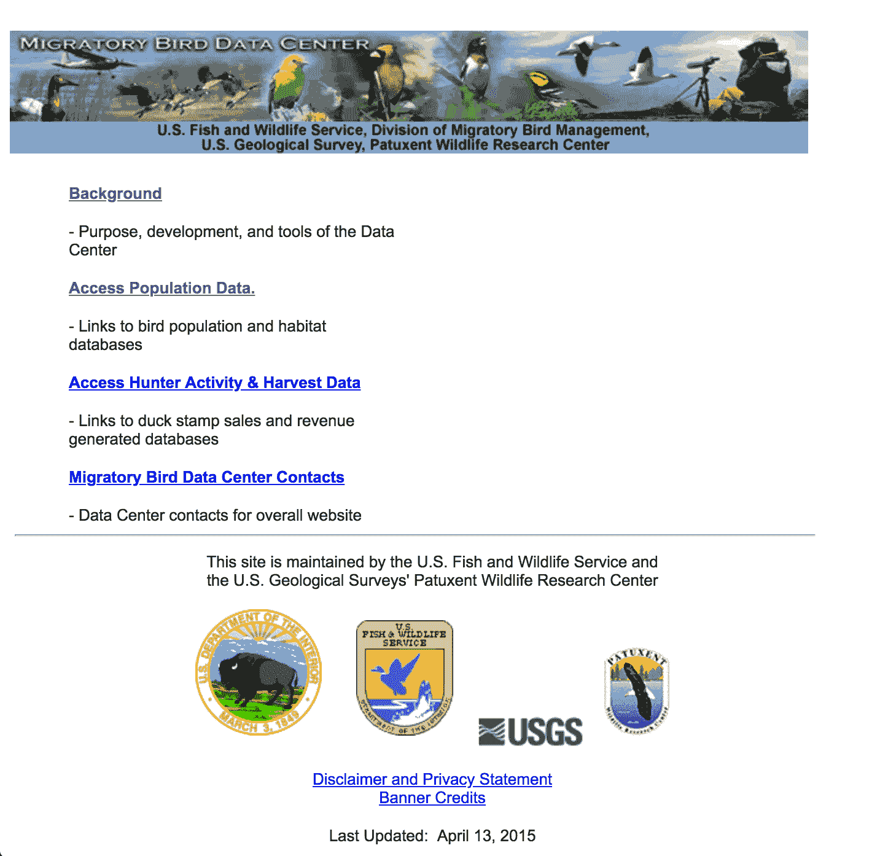
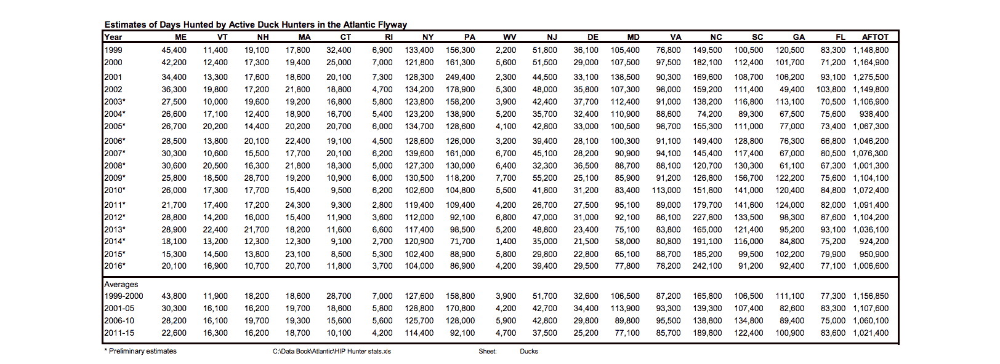
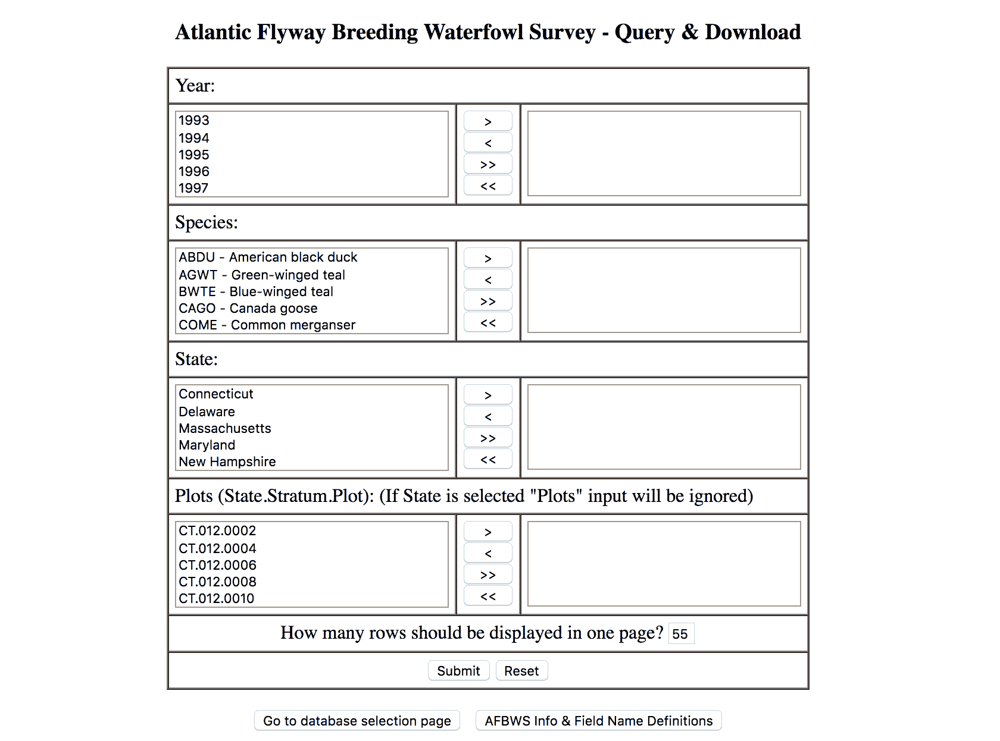
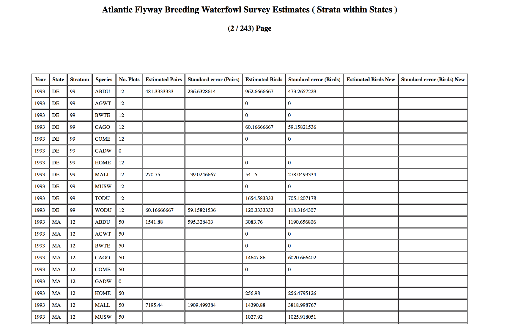
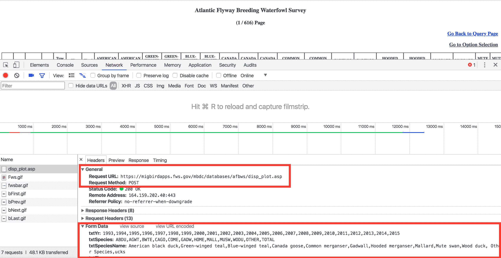

# 数据检索和清理:跟踪迁移模式

> 原文：<https://www.dataquest.io/blog/data-retrieval-and-cleaning/>

May 23, 2018

提升你的技能是成为数据科学家的重要组成部分。刚开始时，你主要集中在学习一门编程语言、正确使用第三方工具、显示可视化以及对统计算法的理论理解。下一步是在更难的数据集上测试你的技能。

有时，这些数据集需要大量清理，或者格式不良，或者很难找到。有很多关于理解我们周围数据的重要性的内容，但很少发现关于你如何实际获得数据的内容。

随着数据科学家的成长，最初的数据调查、探索和检索是最重要的学习步骤。不可否认，从各种来源中寻找和清理一个数据集会产生前期成本，但是一旦有了这个干净的、格式良好的、可理解的数据集，回答关于数据的多个问题的可能性就会大大增加。

在本帖中，我们将研究、检索和清理真实世界的数据集。为了纪念世界候鸟日，我们将使用候鸟数据。我们还将描述构建您自己的数据集所涉及的成本优势和必要工具。有了这些基础知识，你将能够到野外去找到你自己的数据集来使用。

### 研究现有的候鸟数据集

你应该从一个关键问题开始每项调查:*我们想要了解什么？*有了这个问题，就更容易找到合适的数据集。在我们的例子中，我们想了解北美鸟类的迁徙模式。为了理解这些模式，我们需要找到几年来准确的迁移数据。

像这样晦涩难懂的数据很难找到。可能会有业余爱好者在个人网站、论坛或其他渠道上存放自己的数据，但业余爱好者的数据集通常容易出错，并包含缺失的数据。相反，我们应该在政府或大学网站上寻找更专业的数据集。

用谷歌搜索关键词“鸟类迁徙”、“数据库”和“美国”，我们找到了几个有鸟类迁徙信息的网站。第一个名为 [eBird](https://eBird.org/home) ，包含康奈尔实验室托管的鸟类迁徙数据。第二个来自[美国鱼类和野生动物服务](https://migbirdapps.fws.gov/) (USFWS)网站，该网站使用合作伙伴关系和公民研究数据来创建他们的报告。我们希望使用来自两个服务的数据集，这样我们就可以交叉检查数据并确定不一致的地方。

让我们从 eBirds 数据集开始。

导航到下载页面，您将被要求在康奈尔研究实验室创建一个帐户。登录后，您可以进入下载页面。但是在访问完整的数据集之前，您需要填写一张表格，描述您打算如何使用这些数据。我们成功地填写了表格，等了几天，才获得对数据集的完全访问权。需要时间，但不太难。


接下来，我们来看看 USFWS。乍一看，这个网站似乎比 eBirds 门户网站更容易使用。有一个清晰的链接，引导我们找到不同鸟类、地理数据点和迁徙路线的完整数据库列表。如果有有效的链接，这些有序分类的数据集将会非常有帮助并且易于分析。



不幸的是，从 USFWS 门户检索数据并不容易。有多个死链接，格式不良的数据集，HTML 按钮并不像宣传的那样工作。虽然这些问题大多是糟糕的接口设计，但所有 HTTP 端点似乎都工作正常，并且使用一点 Python 代码，我们会发现我们能够获得我们需要的数据。

### 寻找数据

由于 USFWS 网站提供了大量的链接，很难找到可能的数据集端点。当我们深入研究时，我们发现的第一个成功的数据集是通过链接到 USFWS 出版的水禽飞行路线模式的[*数据手册*。这本数据手册应该包含了我们调查所需的所有信息，但有一个重大缺陷:它是以 PDF 格式存储的。由于 pdf 的结构不一致，很难对其进行解析，所以这应该是最后的手段。](https://www.fws.gov/migratorybirds/pdf/surveys-and-data/DataBooks/AtlanticFlywayDatabook.pdf)



致力于水禽飞行路线模式的数据集，我们决定遵循另一个链接路径到 USFWS 报告。这些报告被描述为 1995 年以来北美水禽飞行路线模式的调查数据；正是我们要找的。一旦我们点击报告的链接，就会看到一个服务条款和免责声明拦截器。接受它后，有一个报告生成表单，使研究人员能够限制水禽类型、状态或发现家禽的“地块”的数据。



我们没有限制数据，而是选择表单中的每一个值，然后点击 submit。最后，我们看到一个分页的表，其中包含完整数据集的样本。



滚动到页面底部还有一个下载整个数据集的按钮！不幸的是，按下按钮会将我们重定向到一个`403 Unauthorized`页面。

有点沮丧，但不是没有希望，我们寻找解决办法。首先，我们回顾检索数据的步骤。步骤是导航到下载页面，提交一个简单的表单 sublesson，解析一个 HTML 格式的表，并在每一页数据上运行解析器。想想这些步骤，我们意识到使用 Python web 抓取脚本可以很容易地实现自动化！

### 下载数据

我们将使用两个主要的包来收集数据。

*   [请求](https://2.python-requests.org/en/latest/)(用于发出 HTTP 请求)
*   [beautifulsoup](https://www.crummy.com/software/BeautifulSoup/) (用于解析 HTML)

我们从`requests`开始执行 HTTP 请求、表单提交和下载 HTML 表格文件。使用 [Chrome 开发工具](https://developer.chrome.com/devtools)，我们将导航到调查表格页面，填写表格中的所有值，按下提交按钮，并检查请求的[标题。](https://developer.mozilla.org/en-US/docs/Glossary/Request_header)



我们已经分别突出显示了请求类型、URL 和表单数据的字段。从屏幕截图来看，要生成报告，我们需要使用给定的表单数据向 URL 发送 POST 请求。为了使事情变得简单，我们将使用 URL 编码的表单数据源代码。然后，我们将使用下面的代码片段发出我们的 [POST 请求](https://developer.mozilla.org/en-US/docs/Web/HTTP/Methods/POST)，使用 [`requests.post()`](https://2.python-requests.org/en/master/api/#requests.post) 和`x-www-form-urlencoded`内容类型头。

```
 import requests

form_data = (    
"txtYr=1993%2C1994%2C1995%2C1996%2C1997%2C1998%2C1999%2C2000%2C2001%2C2002%2C2003%2C2004%2C2005%2C2006%2C2007%2C2008%2C2009%2C2010%2C2011%2C2012%2C2013%2C2014%2C2015"    "&txtSpecies=ABDU%2CAGWT%2CBWTE%2CCAGO%2CCOME%2CGADW%2CHOME%2CMALL%2CMUSW%2CWODU%2COTHER%2CTOTAL"
    "&txtSpeciesName=American+black+duck%2CGreen-winged+teal%2CBlue-winged+teal%2CCanada+goose%2CCommon+merganser%2CGadwall%2CHooded+merganser%2CMallard%2CMute+swan%2CWood+duck%2C+Other+Species%2Cucks"
    "&txtFlyway="
    "&txtState=CT%2CDE%2CMA%2CMD%2CNH%2CNJ%2CNY%2CPA%2CRI%2CVA%2CVT"
    "&txtPlots="
    "&db=request%28%22db%22%29"
    "&txtCurrPage=1"
    "&LoadPage=query"
    "&txtRows=55"
    "&submit1=Submit"
)
re = requests.post('https://migbirdapps.fws.gov/mbdc/databases/afbws/disp_plot.asp', data=form_data, headers={'Content-Type': 'application/x-www-form-urlencoded'}) 
```

这个*感觉*是正确的，但是在我们发出请求之前，我们遗漏了一个关键部分。如果我们要运行这个代码片段，我们的请求将被 required terms and conditions 页面阻止，而不是返回报告。回想一下，USFWS 要求您在使用数据之前接受他们的免责声明。

要解决这个问题，请注意，当接受条款和条件时，您的浏览会话可以完全访问其余的报告。为了在 Python 脚本中重新创建这种行为，我们需要实例化一个持久的`requests.Session`对象。使用`requests.Session`对象，我们将通过导航到“accept”页面来接受免责声明，通过认证会话，我们将提交表单数据。

总的来说，它看起来像:

```
 import requests

se = requests.Session()
se.get("https://migbirdapps.fws.gov/mbdc/databases/afbws/afbws.asp?opt=1")

form_data = (
    "txtYr=1993%2C1994%2C1995%2C1996%2C1997%2C1998%2C1999%2C2000%2C2001%2C2002%2C2003%2C2004%2C2005%2C2006%2C2007%2C2008%2C2009%2C2010%2C2011%2C2012%2C2013%2C2014%2C2015"
    "&txtSpecies=ABDU%2CAGWT%2CBWTE%2CCAGO%2CCOME%2CGADW%2CHOME%2CMALL%2CMUSW%2CWODU%2COTHER%2CTOTAL"
    "&txtSpeciesName=American+black+duck%2CGreen-winged+teal%2CBlue-winged+teal%2CCanada+goose%2CCommon+merganser%2CGadwall%2CHooded+merganser%2CMallard%2CMute+swan%2CWood+duck%2C+Other+Species%2Cucks"
    "&txtFlyway="
    "&txtState=CT%2CDE%2CMA%2CMD%2CNH%2CNJ%2CNY%2CPA%2CRI%2CVA%2CVT"
    "&txtPlots="
    "&db=request%28%22db%22%29"
    "&txtCurrPage=1"
    "&LoadPage=query"
    "&txtRows=55"
    "&submit1=Submit"
)
re = se.post('https://migbirdapps.fws.gov/mbdc/databases/afbws/disp_plot.asp', data=form_data, headers={'Content-Type': 'application/x-www-form-urlencoded'}) 
```

成功！我们得到了所需的报告表，但是注意有 616 页的数据需要解析。我们可以减少数量的一种方法是选择更大数量的`textRows`表单值。让我们将其更改为最大值，即每个表 99 行。

```
 import requests

se = requests.Session()
se.get("https://migbirdapps.fws.gov/mbdc/databases/afbws/afbws.asp?opt=1")

form_data = (
    "txtYr=1993%2C1994%2C1995%2C1996%2C1997%2C1998%2C1999%2C2000%2C2001%2C2002%2C2003%2C2004%2C2005%2C2006%2C2007%2C2008%2C2009%2C2010%2C2011%2C2012%2C2013%2C2014%2C2015"
    "&txtSpecies=ABDU%2CAGWT%2CBWTE%2CCAGO%2CCOME%2CGADW%2CHOME%2CMALL%2CMUSW%2CWODU%2COTHER%2CTOTAL"
    "&txtSpeciesName=American+black+duck%2CGreen-winged+teal%2CBlue-winged+teal%2CCanada+goose%2CCommon+merganser%2CGadwall%2CHooded+merganser%2CMallard%2CMute+swan%2CWood+duck%2C+Other+Species%2Cucks"
    "&txtFlyway="
    "&txtState=CT%2CDE%2CMA%2CMD%2CNH%2CNJ%2CNY%2CPA%2CRI%2CVA%2CVT"
    "&txtPlots="
    "&db=request%28%22db%22%29"
    "&txtCurrPage=1"
    "&LoadPage=query"
    "&txtRows=99" # Change from 55 to 99.
    "&submit1=Submit"
)
re = se.post('https://migbirdapps.fws.gov/mbdc/databases/afbws/disp_plot.asp', data=form_data, headers={'Content-Type': 'application/x-www-form-urlencoded'}) 
```

现在我们已经有了每页的最大行数，我们可以进入 HTML 解析步骤了。

### 解析数据

为了解析数据，我们需要用报告响应 HTML 字符串创建一个`BeautifulSoup`对象。在底层，`BeautifulSoup`对象将 HTML 字符串转换成树状数据结构。这使得查询标签变得容易，比如包含报告数据的`<table>`标签。

```
 import requests
from bs4 import BeautifulSoup

se = requests.Session()
se.get("https://migbirdapps.fws.gov/mbdc/databases/afbws/afbws.asp?opt=1")

form_data = (
    "txtYr=1993%2C1994%2C1995%2C1996%2C1997%2C1998%2C1999%2C2000%2C2001%2C2002%2C2003%2C2004%2C2005%2C2006%2C2007%2C2008%2C2009%2C2010%2C2011%2C2012%2C2013%2C2014%2C2015"
    "&txtSpecies=ABDU%2CAGWT%2CBWTE%2CCAGO%2CCOME%2CGADW%2CHOME%2CMALL%2CMUSW%2CWODU%2COTHER%2CTOTAL"
    "&txtSpeciesName=American+black+duck%2CGreen-winged+teal%2CBlue-winged+teal%2CCanada+goose%2CCommon+merganser%2CGadwall%2CHooded+merganser%2CMallard%2CMute+swan%2CWood+duck%2C+Other+Species%2Cucks"
    "&txtFlyway="
    "&txtState=CT%2CDE%2CMA%2CMD%2CNH%2CNJ%2CNY%2CPA%2CRI%2CVA%2CVT"
    "&txtPlots="
    "&db=request%28%22db%22%29"
    "&txtCurrPage=1"
    "&LoadPage=query"
    "&txtRows=99"
    "&submit1=Submit"
)
re = se.post('https://migbirdapps.fws.gov/mbdc/databases/afbws/disp_plot.asp', data=form_data, headers={'Content-Type': 'application/x-www-form-urlencoded'})

soup = BeautifulSoup(re.text, "lxml") 
```

使用我们的可解析对象，我们现在可以在 HTML 文档中搜索`<table>`标签。在文档中，报表数据在第二个`<table>`中，所以我们将使用`.findAll()`方法并选择列表中的第二项。然后，我们将过滤表中的所有行，`<tr>`，并将它们设置为一个`rows`变量。

```
 soup = BeautifulSoup(re.text, "lxml")
data_table = soup.findAll('table')[1]
rows = data_table.findAll('tr')
```

接下来，我们希望提取标题行并清理值。作为参考，HTML 表格的标题行使用`<th>`标签格式化，数据行使用`<td>`格式化。为了获得标签值，我们需要调用一个`BeautifulSoup`标签的`.string`属性。我们将从表的第一行获取标题值。

```
 soup = BeautifulSoup(re.text, "lxml")
data_table = soup.findAll('table')[1]
rows = data_table.findAll('tr')
header = [col.string for col in rows[0].findAll('th') if col.string]
```

提取了标题后，就该从行中获取数据了。我们将遍历表中剩余的行，找到所有的`<td>`标记，并将其分配给一个新行。此外，我们将合并标题和行，然后清除值周围的一些空白，使其更容易解析。

```
 soup = BeautifulSoup(re.text, "lxml")
data_table = soup.findAll('table')[1]
rows = data_table.findAll('tr')
header = [col.string.strip() for col in rows[0].findAll('th') if col.string]
modified_rows = []
for row in rows[1:]:
    modified_row = [col.string.strip() for col in row.findAll('td')]
    modified_rows.append(modified_row)
table = [header] + modified_rows
```

使用`unicodedata.normalize()`进行更多的 unicode 清理，我们应该得到以下输出:

```
import unicodedata

soup = BeautifulSoup(re.text, "lxml")
data_table = soup.findAll('table')[1]
rows = data_table.findAll('tr')
header = [col.string.strip() for col in rows[0].findAll('th') if col.string]
modified_rows = []
for row in rows[1:]:
    modified_row = [unicodedata.normalize('NFKD', col.string).strip() for col in row.findAll('td')]
    modified_rows.append(modified_row)
table = [header] + modified_rows
print(table[:3]) 
```

```
>> [['Year', 'State', 'Stratum', 'Plot', 'Type of check', 'Wet Habitat', 'AMERICAN BLACK DUCK TIP', 'AMERICAN BLACK DUCK TIB', 'GREEN-WINGED TEAL TIP', 'GREEN-WINGED TEAL TIB', 'BLUE-WINGED TEAL TIP', 'BLUE-WINGED TEAL TIB', 'CANADA GOOSE TIP', 'CANADA GOOSE TIB OLD', 'CANADA GOOSE TIB NEW', 'COMMON MERGANSER TIP', 'COMMON MERGANSER TIB', 'GADWALL TIP', 'GADWALL TIB', 'HOODED MERGANSER TIP', 'HOODED MERGANSER TIB', 'MALLARD TIP', 'MALLARD TIB', 'MUTE SWAN TIP', 'MUTE SWAN TIB', 'WOOD DUCK TIP', 'WOOD DUCK TIB', 'OTHER SPECIES TOTAL', 'TOTDUCKS'], ['1993', 'CT', '012', '0002', '2', 'Y', 'N', '0', '0', '', '0', '', '0', '', '0', '', '', '0', '', '', '', '0', '0', '0', '', '0', '1', '2', '', '2'], ['1993', 'CT', '012', '0004', '1', 'Y', 'Y', '0', '0', '', '0', '', '0', '', '2', '', '', '0', '', '', '', '0', '0', '0', '', '0', '0', '0', '', '0']]
```

通过解析我们的表，我们可以遍历数据集的每一页，并将值组合在一起。

### 把所有的放在一起

在构建完整的数据集之前，还有三个部分需要实现:

*   查找要分页的数据的总页数。
*   创建一个`form_data`模板来动态修改表单数据。
*   遍历页面，合并所有行。

我们从第一点开始。查看报告页面的 HTML，我们看到总页数在标题中。从标题中提取总数的一种方法是从标题中分离出数字，然后将其转换为整数。这是可行的，但是依赖标题字符串的解决方案太脆弱了。

相反，如果我们仔细查看表单数据，会发现有一个*隐藏的*输入字段为我们工作。在标记的底部，有一个带有`name=txtLastPage`的输入值。使用`BeautifulSoup`，我们只需要搜索一个输入标签和匹配的名称，并将值转换成一个整数。这里有一个潜在的实现。

```
 from bs4 import BeautifulSoup
import requests
import unicodedata

se = requests.Session()
se.get("https://migbirdapps.fws.gov/mbdc/databases/afbws/afbws.asp?opt=1")

form_data = (
    "txtYr=1993%2C1994%2C1995%2C1996%2C1997%2C1998%2C1999%2C2000%2C2001%2C2002%2C2003%2C2004%2C2005%2C2006%2C2007%2C2008%2C2009%2C2010%2C2011%2C2012%2C2013%2C2014%2C2015"
    "&txtSpecies=ABDU%2CAGWT%2CBWTE%2CCAGO%2CCOME%2CGADW%2CHOME%2CMALL%2CMUSW%2CWODU%2COTHER%2CTOTAL"
    "&txtSpeciesName=American+black+duck%2CGreen-winged+teal%2CBlue-winged+teal%2CCanada+goose%2CCommon+merganser%2CGadwall%2CHooded+merganser%2CMallard%2CMute+swan%2CWood+duck%2C+Other+Species%2Cucks"
    "&txtFlyway="
    "&txtState=CT%2CDE%2CMA%2CMD%2CNH%2CNJ%2CNY%2CPA%2CRI%2CVA%2CVT"
    "&txtPlots="
    "&db=request%28%22db%22%29"
    "&txtCurrPage=1"
    "&LoadPage=query"
    "&txtRows=99"
    "&submit1=Submit"
)
re = se.post('https://migbirdapps.fws.gov/mbdc/databases/afbws/disp_plot.asp', data=form_data, headers={'Content-Type': 'application/x-www-form-urlencoded'})

soup = BeautifulSoup(re.text, "lxml")
# Find the last page value.
total_pages = soup.find('input', {'name': 'txtLastPage'}).get('value')
data_table = soup.findAll('table')[1]
rows = data_table.findAll('tr')
header = [col.string.strip() for col in rows[0].findAll('th') if col.string]
modified_rows = []
for row in rows[1:]:
    modified_row = [unicodedata.normalize('NFKD', col.string).strip() for col in row.findAll('td')]
    modified_rows.append(modified_row)
table = [header] + modified_rows
```

现在，我们要将模板和分页一起添加进去。首先，我们将创建一个`form_data`的字符串模板，它使用字符串格式提交动态表单数据。在我们的例子中，我们希望动态修改当前页面值。接下来，我们将使用总页数值并继续循环，直到用完数据集。经过一点清理，我们得到了下面的最终实现:

```
 from bs4 import BeautifulSoup
import requests
import unicodedata

# Set a url constant.
REPORT_URL = "https://migbirdapps.fws.gov/mbdc/databases/afbws/disp_plot.asp"

se = requests.Session()
se.get("https://migbirdapps.fws.gov/mbdc/databases/afbws/afbws.asp?opt=1")

form_data_template = (
    "txtYr=1993%2C1994%2C1995%2C1996%2C1997%2C1998%2C1999%2C2000%2C2001%2C2002%2C2003%2C2004%2C2005%2C2006%2C2007%2C2008%2C2009%2C2010%2C2011%2C2012%2C2013%2C2014%2C2015"
    "&txtSpecies=ABDU%2CAGWT%2CBWTE%2CCAGO%2CCOME%2CGADW%2CHOME%2CMALL%2CMUSW%2CWODU%2COTHER%2CTOTAL"
    "&txtSpeciesName=American+black+duck%2CGreen-winged+teal%2CBlue-winged+teal%2CCanada+goose%2CCommon+merganser%2CGadwall%2CHooded+merganser%2CMallard%2CMute+swan%2CWood+duck%2C+Other+Species%2Cucks"
    "&txtFlyway="
    "&txtState=CT%2CDE%2CMA%2CMD%2CNH%2CNJ%2CNY%2CPA%2CRI%2CVA%2CVT"
    "&txtPlots="
    "&db=request%28%22db%22%29"
    "&txtCurrPage={}"  # Add format template.
    "&LoadPage=query"
    "&txtRows=99"
    "&submit1=Submit"
)

# Find total pages.
re = se.post(REPORT_URL, data=form_data_template.format(1), headers={'Content-Type': 'application/x-www-form-urlencoded'})
soup = BeautifulSoup(re.text, "lxml")
total_pages = int(soup.find('input', {'name': 'txtLastPage'}).get('value', 1))

# Take out the header and modified rows out of the loop. 
header = []
modified_rows = []
for current_page in range(1, total_pages + 1):
    re = se.post(REPORT_URL, data=form_data_template.format(current_page), headers={'Content-Type': 'application/x-www-form-urlencoded'})
    data_table = soup.findAll('table')[1]
    rows = data_table.findAll('tr')
    header = header or [col.string.strip() for col in rows[0].findAll('th') if col.string]
    for row in rows[1:]:
        modified_row = [unicodedata.normalize('NFKD', col.string).strip() for col in row.findAll('td')]
        modified_rows.append(modified_row)

table = [header] + modified_rows 
```

厉害！我们已经提取了完整的数据集，它也处于 Python 可读状态。从这里，我们可以添加更多的数据清理，将表保存到文件中，并对数据执行一些分析。

### 结论

使用一些基本的 Python web 抓取，我们能够:

*   使用会话访问仅经过身份验证的内容。
*   解析 HTML 表格数据并将数据映射到 Python 列表中。
*   跨多个 HTML 页面自动抓取数据集。

从这个例子中，我们能够展示 Python 对于数据调查、清理和检索的 web 抓取能力。正如本文开头所提到的，当问数据科学中更困难的问题时，你需要寻找你自己的数据集。网络上有大量的可用数据。一旦你有了工具和经验去寻找和收集这些数据，你将会在你的分析中得到很高的回报。

如果您想更新示例，可以添加以下内容:

*   用表格数据创建一个 CSV 文件。
*   使用协程或线程来加速网络调用的阻塞。
*   循环浏览页面，而不必两次请求第一页。
*   添加错误处理以提高代码的健壮性。

*更新:自发布之日起，现在可以下载包含美国渔业署水禽飞行路线所有数据的 ASCII CSV 文件。尽管如此，这个例子很好地介绍了 web 抓取、数据检索以及长期维护这些类型的脚本的困难。*