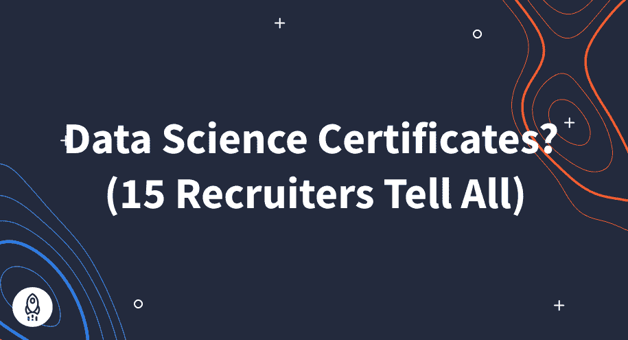
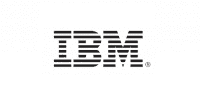
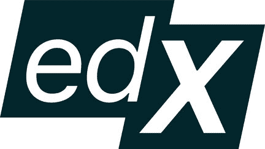

# 2023 年数据科学证书？(15 个招聘人员告诉所有人)

> 原文：<https://www.dataquest.io/blog/data-science-certificate/>

December 20, 2022

想尽快得到一份数据科学的工作吗？那么你可能想知道你需要什么认证。事实上，Quora 上最常见的数据科学[问题之一是:](https://www.quora.com/What-are-the-best-certifications-courses-for-Data-Science/answer/Charlie-Custer-1)

**“应该拿什么数据科学证书？”**

但这是个不该问的问题。

我们与该领域的 15 名招聘经理进行了交谈，他们都淡化了数据科学领域对专业证书的需求。

你应该问的问题是:

**“什么样的证书能为我提供数据科学招聘人员最看重的技能？”**

没错——招聘人员对你的技能比对你的证书更感兴趣。在本文中，我们将解释证书对招聘经理的真正意义，并比较一些目前最好的行业证书。

额外收获:我们会让你知道一些招聘人员保守得最好的秘密，包括他们在筛选简历时最关注的是什么。

## **数据科学证书如何影响你的求职**

当然，数据科学证书并非毫无价值，对吗？为了找到答案，我们[采访了十几位数据科学领域的招聘经理和招聘人员](https://www.dataquest.io/blog/data-science-career-guide/),询问他们希望在申请人的简历上看到什么。

他们都没有提到证书。一个都没有。

以下是我们学到的:只要正确出示，证书肯定不会影响你的求职。但是他们也不太可能帮上什么忙，至少他们自己不会。

### **为什么数据科学证书达不到要求**

你可能想知道为什么这些证书比不上印刷它们的纸张。

问题是没有普遍的标准，也没有普遍认可的认证机构。不同的网站，学校，在线学习平台都是自己出证。这意味着这些文件可能有任何意义，也可能毫无意义！

这就是为什么雇主在对候选人进行资格审查时，往往不会给他们一瞥。

## 那么认证有什么意义呢？

如果证书不能帮助你在数据科学领域找到工作，那么获得证书又有什么意义呢？

归根结底，**数据科学家证书并不是完全无用的**。在 Dataquest，当用户完成任何一门[我们的数据科学课程](https://www.dataquest.io/data-science-courses/)时，我们会颁发证书。为什么？因为这是学生展示他们积极参与学习新技能的好方法。

招聘人员确实喜欢看到求职者不断努力提升自己。列出数据科学证书可以在那方面帮助你的工作申请。

### **有什么比数据科学证书更好？作品集！**

对招聘人员来说，最重要的是你是否真的能胜任这份工作。证书不是真实技能的证明。

那么你能做些什么来证明你在数据科学领域的能力呢？完成一个项目组合！

投资组合就像数据科学技能的圣杯。这就是为什么招聘经理会先看他们。根据他们在你的投资组合中看到的，他们要么放弃你的申请，要么将它发送到下一轮招聘过程。

Dataquest 的大多数课程都包含互动项目，你可以完成这些项目来帮助你建立自己的投资组合。以下是其中的几个例子:

*   [越狱](https://www.dataquest.io/course/for-loops-and-conditional-statements-in-python/)——使用 Python 和 Jupyter Notebook 分析直升机越狱的数据集，享受其中的乐趣。
*   [探索黑客新闻帖子](https://www.dataquest.io/course/python-for-data-science-intermediate/)——使用热门技术网站 Hacker News 的提交数据集。
*   [探索易贝汽车销售数据](https://www.dataquest.io/course/pandas-fundamentals/)——使用 Python 处理从德国易贝网站分类广告栏目易贝·克莱纳泽根收集的二手车数据集。

可以免费报名！点击查看[我们的课程。](https://www.dataquest.io/data-science-courses/)

在考虑拿哪个认证的时候，不要把重点放在“哪个数据科学证书最好。”相反，找到最有助于您学习基本数据科学技能的平台。这将有助于你在这个领域找到一份工作。

## **如何通过 5 个步骤选择数据科学证书课程**

找到一个提供证书的数据科学项目很容易。在谷歌上快速搜索会找到几十个。难的是决定证书是否值得你花费时间和金钱。

让我们简化这个过程。在考虑数据科学认证时，需要考虑以下五个关键因素:

*   节目内容
*   项目成本
*   所需的先决条件或资格
*   需要时间承诺
*   往届学生的评论

请记住，除非数据科学证书能教会你雇主所需要的技能，否则它们一文不值。所以第一点是最重要的。想内容，想内容，想内容！

现在，我们来看一些现实生活中的例子进行比较。

## **顶级数据科学认证**

### **数据请求**

**你将学到什么:** Dataquest 为[提供了四种不同的职业道路](https://www.dataquest.io/data-science-courses-directory/)，涵盖了成为数据分析师、数据科学家和/或数据工程师所需的技能。涵盖的具体技能因您选择的道路而异。

**主题包括:**

*   Python 和 R 编程
*   SQL 和 PostgreSQL
*   概率与统计
*   机器学习
*   工作流技能，如 Git、命令行(bash/shell)
*   更多

**费用:**每年 399 美元的高级订阅费。也可以按月订阅。

**先决条件:**无。没有申请流程(任何人都可以[报名，今天就开始学习](https://app.dataquest.io/signup))。不需要预先了解应用统计学或编程。

**时间承诺:**各不相同。Dataquest 是一个自助式互动学习平台。大多数学习者发现，如果每周学习少于十小时，他们可以在六个月内达到学习目标。更多的时间投入可以加速学习目标的实现。

**点评:**

*   在[转换](https://www.switchup.org/bootcamps/dataquest)上的平均分为 4.85/5(301 条评论)
*   关于[课程报告](https://www.coursereport.com/schools/dataquest)的 4.76/5(19 条评论)
*   4.7/5 于 [G2](https://www.g2.com/products/dataquest/reviews) (46 条评论)

### **Cloudera 大学数据分析师课程/考试**

**你将学到什么:** [本课程](https://www.cloudera.com/about/training/certification/cca-data-analyst.html)关注使用 Apache 产品的数据分析:Hadoop、Hive 和 Impala。它涵盖了一些 SQL，但没有涉及 Python 或 R 编程。

**费用:**点播版费用 2235 美元(180 天访问)。认证考试需要额外的费用。

**先决条件:**需要有一些 SQL 和 Linux 命令行的前期知识。

**时间承诺:**各不相同。因为这是一门自定进度的课程，用户可以在 180 天内完成 15 个部分。每个部分预计需要 5-9 个小时。时间承诺在 75 到 135 小时之间。如果你每天承诺的时间少于一个小时，那么你可能会花掉整整 180 天。如果你每天能投入 9 个小时或更多的时间，你可能需要几个星期才能完成。

**评论:**很难找到该程序的第三方评论。

### **IBM 数据科学专业证书**

**你将学到什么:**这个基于 [Coursera 的项目](https://www.coursera.org/professional-certificates/ibm-data-science)涵盖了 Python 和 SQL。这包括一些使用 Python 的机器学习技巧。

**费用:**Coursera 订阅，需要。根据 Coursera 对 10 个月完成时间的估计，项目总成本约为 390 美元。一个[类似的程序](https://www.edx.org/professional-certificate/ibm-data-science)也可以在 EdX 上获得。

**先决条件:**无。

**时间承诺:**各不相同。Coursera 建议完成这个证书的平均时间是十个月。

**点评:**量化的第三方点评很难找到。

*   Coursera 自己的网站平均得分为 4.6/5(57501 分)

### **哈佛/EdX 数据科学专业证书**

**你将学到什么:**这个基于 [EdX 的程序](https://www.edx.org/professional-certificate/harvardx-data-science)涵盖了 R，一些机器学习技能，以及一些统计和工作流技能。它似乎不包括 SQL。

费用:792.80 美元

**先决条件:**无。

**时间承诺:**一年零五个月。课程进度不会从一节课延续到另一节课，因此如果您无法在课程运行期间完成课程，可能需要更多时间。

**点评:**量化的第三方点评很难找到。

*   在[级中央](https://www.classcentral.com/course/edx-data-science-r-basics-9253)上的平均分为 4.6/5(11 次点评)

### **认证分析专家**

**你将学到什么:**可能什么都没有——这只是[一个认证考试](https://www.certifiedanalytics.org/for_professionals.php)。但是，备考课程是有的。

**费用:**认证考试费用为 695 美元，包括有限的准备材料。专门的[预备课程](https://info.informs.org/cap-prep-class?__hstc=268633774.0c56a6591bfff14959f15f035db16099.1595945843118.1595945843118.1595945843118.1&__hssc=268633774.1.1595945843118&__hsfp=2448812667&hsCtaTracking=a0c84ba6-a21a-4a7d-8d58-0acd84ac74f1%7Cf99e2192-6448-4780-abc2-b5b65913031a)需要额外付费。

**先决条件:**参加认证考试需要申请。因为没有包含任何课程，你需要自己学习所需的信息或单独注册一门课程。

**时间承诺:**考试本身比较短。专门的预备课程需要 1-2 个月，具体取决于选项。他们不需要参加考试。

**点评:**量化的第三方点评很难找到。以下是一些关于认证的独立意见:

*   [Reddit 关于 CAP 的帖子](https://www.reddit.com/r/datascience/comments/e73uvu/is_certified_analytics_professional_cap_bs/)
*   [关于盖子的 Quora 螺纹](https://www.quora.com/What-is-your-opinion-about-the-Certified-Analytics-Professional-accreditation)

### **通过谷歌云从数据到洞察**

**你将学到什么:** [本课程](https://www.coursera.org/specializations/from-data-to-insights-google-cloud-platform)涵盖 SQL 数据分析技能，重点是使用 BigQuery 和谷歌云的数据分析工具。

费用:Coursera 订阅费是必需的，每月 39 美元。Coursera 估计大多数学生需要两个月的时间来完成这个项目。

先决条件:课程页面上写着:“我们建议参与者熟练掌握 ANSI SQL。”不清楚需要什么水平的 SQL 熟练程度。

**时间承诺:** Coursera 估计大部分学生需要两个月的时间来完成这个项目，但是学生可以按照自己的进度工作。然而，课程确实在规定的日期开始。

**评论:**量化的第三方评论很难找到，但是:

*   Coursera 本身的评分为 4.7/5(3712 分)

## **内幕提示:当心先决条件和资格！**

在你开始寻找数据科学课程和证书之前，你需要知道一些事情。

虽然像 Dataquest、Coursera 和 Udemy 这样的一些项目不需要任何特定的背景或行业知识，但许多其他项目*有具体的先决条件。*

例如，DASCA 的高级数据科学家认证课程至少需要学士学位(有些课程需要硕士学位)。这还不包括至少 3-5 年的专业数据相关经验！

一些项目，特别是[离线训练营](https://www.dataquest.io/blog/data-science-bootcamp/)，也需要特定的资格或者有广泛的申请过程。翻译？你不能马上投入并开始学习。当你做出选择时，你需要考虑这些项目的时间成本和申请费。

## **绝密:数据科学领域大学证书的神话**

如果你正在考虑大学的数据科学证书，请三思。

名牌学校(甚至常春藤盟校)在网上提供的许多昂贵的认证项目对潜在雇主来说没有太大意义。

许多这样的项目甚至不是由学校自己管理的。相反，它们是由名为“在线项目经理”的第三方盈利公司运营的。

更糟糕的是，数据科学招聘人员知道这一点。是的，雇主们敏锐地意识到 EdX 的哈佛附属证书和哈佛大学学位是两回事。

此外，大多数数据科学招聘经理没有时间研究他们在简历上看到的每一项数据科学认证。大多数简历只有大约 30 秒的审阅时间。因此，即使你的大学文凭真的有价值，招聘人员也不会注意到它。

### **大学证书的贴纸冲击**

大学证书往往很贵。考虑一下一些最受欢迎的选择的成本:

*   康奈尔大学为期三周的数据分析证书——3600 美元
*   [杜克大学的大数据和数据科学证书](https://learnmore.duke.edu/certificates/data-science)——3195 美元
*   [乔治敦大学数据科学专业证书](https://scs.georgetown.edu/programs/375/certificate-in-data-science/)——7496 美元
*   加州大学伯克利分校的数据科学家认证项目——5100 美元
*   哈佛的数据科学证书——11600 美元

## **如何获得雇主渴望的数据科学技能**

我们已经确定，数据科学领域的招聘人员和招聘经理寻找的是现实世界的技能，而不一定是证书。那么获得所需技能的最佳途径是什么呢？

毫无疑问，获得令人信服的数据科学技能的最佳方式是深入研究并接触*实际数据*。

选择一门能让你边学边完成项目的数据科学课程。然后，展示你的数字作品集。这样，雇主在考虑你的申请时可以看到你掌握了什么技能。

在 Dataquest，我们的课程是互动的，并且是基于项目的。它们旨在让学生能够立即应用他们所学的知识，并记录他们的新技能，以引起招聘人员的注意。[今天就免费注册](https://app.dataquest.io/signup)，开始您在不断发展的数据科学领域的职业生涯！