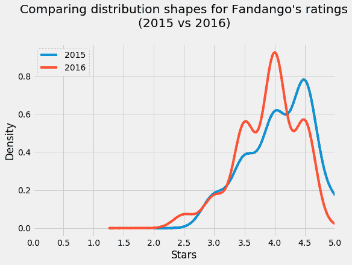
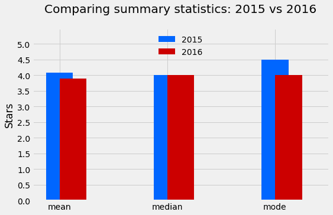

# 数据科学组合项目:Fandango 还在膨胀收视率吗？

> 原文：<https://www.dataquest.io/blog/data-science-project-fandango/>

August 15, 2018

在 Dataquest，我们强烈提倡将组合项目作为获得第一份数据科学工作的一种方式。在这篇博文中，我们将带你浏览一个投资组合项目的例子。

该项目是我们的*统计基础*课程的一部分，它假设您对以下内容有所了解:

*   抽样(简单随机抽样、总体、样本、参数、统计)
*   变量
*   频率分布
*   `pandas`和`matplotlib`

如果您认为在继续前进之前需要填补任何空白，我们将在[统计基础](https://www.dataquest.io/course/statistics-fundamentals/)课程中深入探讨上述主题。本课程还将向您提供更深入的指导，说明如何构建这个项目，并在您的浏览器中对其进行编码。

要了解更多关于`pandas`和`matplotlib`的信息，请查看我们的[数据科学家之路](https://www.dataquest.io/path/data-scientist)。

## Fandango 还在膨胀收视率吗？

2015 年 10 月，来自 FiveThirtyEight 的 Walt Hickey 发表了[一篇受欢迎的文章](https://fivethirtyeight.com/features/fandango-movies-ratings/)，其中他提出了强有力的证据，表明 Fandango 的电影评级系统是有偏见和不诚实的。在这个项目中，我们将分析更多最近的电影评级数据，以确定在 Hickey 的分析之后，Fandango 的评级系统是否有任何变化。

我们将使用两个电影评级样本:一个样本中的数据是在 Hickey 分析的之前*收集的，另一个样本是在*之后*收集的。这将有助于我们比较分析前后的系统特性。幸运的是，我们有这两个时间段的现成数据:*

*   Walt Hickey 在 GitHub 上公开了他分析的数据[。在他分析之前，我们将使用他收集的数据来分析 Fandango 评级系统的特征。](https://github.com/fivethirtyeight/data/tree/master/fandango)
*   Dataquest 的一名团队成员收集了 2016 年和 2017 年上映的电影的电影评分数据。这些数据在 GitHub 上是公开的[，在 Hickey 的分析之后，我们将用它来分析评级系统的特征。](https://github.com/mircealex/Movie_ratings_2016_17)

让我们从读入两个样本(分别存储为 CSV 文件:`fandango_score_comparison.csv`和`movie_ratings_16_17.csv`)开始，熟悉它们的结构。

```py
 import pandas as pd
pd.options.display.max_columns = 100  # Avoid having displayed truncated output
previous = pd.read_csv('fandango_score_comparison.csv')
after = pd.read_csv('movie_ratings_16_17.csv')
previous.head(3)
```

|  | 电影 | 腐烂的西红柿 | RottenTomatoes _ 用户 | 亚枝晶 | 元证书 _ 用户 | IMDB 中 | Fandango_Stars | Fandango_Ratingvalue | RT_norm | RT _ 用户 _ 定额 | Metacritic_norm | meta critic _ user _ name | IMDB_norm | RT_norm_round | RT _ 用户 _ 定额 _ 回合 | Metacritic_norm_round | Metacritic_user_norm_round | IMDB_norm_round | 元批评 _ 用户 _ 投票 _ 计数 | IMDB _ 用户 _ 投票 _ 计数 | Fandango_votes | Fandango_Difference |
| --- | --- | --- | --- | --- | --- | --- | --- | --- | --- | --- | --- | --- | --- | --- | --- | --- | --- | --- | --- | --- | --- | --- |
| Zero | 《复仇者联盟:奥创时代》(2015) | Seventy-four | Eighty-six | Sixty-six | Seven point one | Seven point eight | Five | Four point five | Three point seven | Four point three | Three point three | Three point five five | Three point nine | Three point five | Four point five | Three point five | Three point five | Four | One thousand three hundred and thirty | Two hundred and seventy-one thousand one hundred and seven | Fourteen thousand eight hundred and forty-six | Zero point five |
| one | 灰姑娘(2015) | eighty-five | Eighty | Sixty-seven | Seven point five | Seven point one | Five | Four point five | Four point two five | Four | Three point three five | Three point seven five | Three point five five | Four point five | Four | Three point five | Four | Three point five | Two hundred and forty-nine | Sixty-five thousand seven hundred and nine | Twelve thousand six hundred and forty | Zero point five |
| Two | Ant-Man (2015) | Eighty | Ninety | Sixty-four | Eight point one | Seven point eight | Five | Four point five | Four | Four point five | Three point two | Four point zero five | Three point nine | Four | Four point five | Three | Four | Four | Six hundred and twenty-seven | One hundred and three thousand six hundred and sixty | Twelve thousand and fifty-five | Zero point five |

```py
after.head(3)
```

|  | 电影 | 年 | 金属芯 | imdb 中 | jmeter | 观众 | 方丹戈舞 | metascore | n_imdb | 电表 | n _ 观众 | nr_metascore | nr_imdb | netmeter | nr _ 观众 |
| --- | --- | --- | --- | --- | --- | --- | --- | --- | --- | --- | --- | --- | --- | --- | --- |
| Zero | 克洛弗菲尔德巷 10 号 | Two thousand and sixteen | Seventy-six | Seven point two | Ninety | Seventy-nine | Three point five | Three point eight | Three point six | Four point five | Three point nine five | Four | Three point five | Four point five | Four |
| one | 13 个小时 | Two thousand and sixteen | Forty-eight | Seven point three | Fifty | Eighty-three | Four point five | Two point four | Three point six five | Two point five | Four point one five | Two point five | Three point five | Two point five | Four |
| Two | 健康的良方 | Two thousand and sixteen | Forty-seven | Six point six | Forty | Forty-seven | Three | Two point three five | Three point three | Two | Two point three five | Two point five | Three point five | Two | Two point five |

下面，我们只分离出提供关于 Fandango 信息的列，以使相关数据更容易供以后使用。我们将复制[以避免以后出现任何`SettingWithCopyWarning`](https://www.dataquest.io/blog/settingwithcopywarning/) 。

```py
fandango_previous = previous[['FILM', 'Fandango_Stars', 'Fandango_Ratingvalue', 'Fandango_votes',                             'Fandango_Difference']].copy()
fandango_after = after[['movie', 'year', 'fandango']].copy()
fandango_previous.head(3)
```

|  | 电影 | Fandango_Stars | Fandango_Ratingvalue | Fandango_votes | Fandango_Difference |
| --- | --- | --- | --- | --- | --- |
| Zero | 《复仇者联盟:奥创时代》(2015) | Five | Four point five | Fourteen thousand eight hundred and forty-six | Zero point five |
| one | 灰姑娘(2015) | Five | Four point five | Twelve thousand six hundred and forty | Zero point five |
| Two | Ant-Man (2015) | Five | Four point five | Twelve thousand and fifty-five | Zero point five |

```py
fandango_after.head(3)
```

|  | 电影 | 年 | 方丹戈舞 |
| --- | --- | --- | --- |
| Zero | 克洛弗菲尔德巷 10 号 | Two thousand and sixteen | Three point five |
| one | 13 个小时 | Two thousand and sixteen | Four point five |
| Two | 健康的良方 | Two thousand and sixteen | Three |

我们的目标是确定在 Hickey 的分析之后，Fandango 的评级系统是否有任何变化。我们分析的感兴趣人群是由 Fandango 网站上存储的所有电影评级组成的，与上映年份无关。

因为我们想要找出在 Hickey 分析之后该群体的参数是否改变，我们感兴趣的是在 Hickey 分析之前和之后的两个不同时期对该群体进行采样，以便我们可以比较这两个状态。

我们正在处理的数据是在我们需要的时候采样的:一个样本是在分析之前采集的，另一个是在分析之后采集的。我们要描述总体，所以需要确保样本具有代表性。否则，我们将会有很大的抽样误差，最终得出错误的结论。

从 Hickey 的文章和数据集存储库的`README.md`中，我们可以看到他使用了以下采样标准:

*   在取样时(2015 年 8 月 24 日)，这部电影在 Fandango 的网站上必须有至少 30 个粉丝评级。
*   这部电影 2015 年肯定有票卖。

这种抽样显然不是随机的，因为并非每部电影都有相同的机会被纳入样本——有些电影根本没有机会(比如那些粉丝评分低于 30 的电影或 2015 年没有售票的电影)。这个样本是否能代表我们感兴趣描述的整个人口是有疑问的。似乎更有可能不是这样，主要是因为这个样本受*时间趋势*的影响——例如，与其他年份相比，2015 年的电影可能非常好或非常差。

我们的另一个样本的采样条件是(可以在数据集的存储库的`README.md`中读取):

*   电影肯定是 2016 年或者更晚上映的。
*   这部电影一定有相当多的投票和评论(不清楚有多少来自`README.md`或数据)。

第二个样本也受时间趋势的影响，它不太可能代表我们感兴趣的人群。

这两位作者在对数据进行采样时都有特定的研究问题，他们使用一套标准来获得符合他们问题的样本。他们的抽样方法被称为[](https://youtu.be/CdK7N_kTzHI)**(或判断/选择/主观抽样)。虽然这些样本对他们的研究来说足够好，但对我们来说似乎不太有用。**

 **## 改变我们分析的目标

在这一点上，我们可以收集新的数据或改变我们的分析目标。让我们选择后者，并对我们最初的目标进行一些限制。

我们的新目标不是试图在 Hickey 的分析之后确定 Fandango 的评级系统是否有任何变化，而是确定 Fandango 在 2015 年对流行电影的评级和 Fandango 在 2016 年对流行电影的评级之间是否有任何差异。这个新目标也应该是我们最初目标的一个相当好的代理。

## 分离出我们需要的样本

有了这个新的研究目标，我们有了两个感兴趣的群体:

1.  2015 年上映的热门电影的所有 Fandango 评分。
2.  2016 年上映的热门电影的所有 Fandango 评分。

我们需要清楚什么是流行电影。我们将使用 Hickey 的 30 个粉丝评分的基准，只有当一部电影在 Fandango 的网站上有 30 个或更多的粉丝评分时，它才被视为受欢迎。

尽管我们的第二个示例中的一个采样标准是电影流行度，但是该示例并没有提供关于影迷评级数量的信息。我们应该再次持怀疑态度，并询问这个样本是否真正具有代表性，是否包含受欢迎的电影(粉丝评分超过 30 的电影)。

检查这个样本的代表性的一个快速方法是从中随机抽取 10 部电影，然后在 Fandango 的网站上自己检查粉丝评级的数量。理想情况下，10 部电影中至少有 8 部有 30 以上的粉丝评分。

```py
fandango_after.sample(10, random_state = 1)
```

|  | 电影 | 年 | 方丹戈舞 |
| --- | --- | --- | --- |
| One hundred and eight | 机械师:复活 | Two thousand and sixteen | Four |
| Two hundred and six | 军用飞机 | Two thousand and sixteen | Four |
| One hundred and six | 马克斯钢铁公司 | Two thousand and sixteen | Three point five |
| One hundred and seven | 我在你之前 | Two thousand and sixteen | Four point five |
| Fifty-one | 神奇的动物和在哪里可以找到它们 | Two thousand and sixteen | Four point five |
| Thirty-three | 细胞 | Two thousand and sixteen | Three |
| Fifty-nine | 天才捕手 | Two thousand and sixteen | Three point five |
| One hundred and fifty-two | 玷污 | Two thousand and sixteen | Four point five |
| four | 国王的全息图 | Two thousand and sixteen | Three |
| Thirty-one | 美国队长:内战 | Two thousand and sixteen | Four point five |

上面我们使用值 1 作为随机种子。这是一个很好的实践，因为它表明我们不是仅仅为了得到一个有利的样本而尝试各种随机的种子。

截至 2018 年 4 月，这些是我们发现的粉丝评分:

| 电影 | 粉丝评分 |
| --- | --- |
| 机械师:复活 | Two thousand two hundred and forty-seven |
| 军用飞机 | Seven thousand two hundred and seventy-one |
| 马克斯钢铁公司 | Four hundred and ninety-three |
| 我在你之前 | Five thousand two hundred and sixty-three |
| 神奇的动物和在哪里可以找到它们 | Thirteen thousand four hundred |
| 细胞 | Seventeen |
| 天才捕手 | One hundred and twenty-seven |
| 玷污 | Eleven thousand eight hundred and seventy-seven |
| 国王的全息图 | Five hundred |
| 美国队长:内战 | Thirty-five thousand and fifty-seven |

我们样本中 90%的电影都很受欢迎。这就足够了，我们带着更多的信心前进。

让我们也仔细检查一下流行电影的其他数据集。文档清楚地说明了只有至少 30 个粉丝的电影，但是在这里应该只需要几秒钟的时间来复查。

```py
sum(fandango_previous['Fandango_votes'] < 30)
```

```py
0
```

如果你探究这两组数据，你会注意到有些电影的上映年份不同于 2015 年或 2016 年。出于我们的目的，我们只需要分离出 2015 年和 2016 年上映的电影。

先从 Hickey 的数据集开始，只隔离出 2015 年上映的电影。没有发布年份的特殊列，但是我们应该能够从`FILM`列的字符串中提取出来。

```py
fandango_previous.head(2)
```

|  | 电影 | Fandango_Stars | Fandango_Ratingvalue | Fandango_votes | Fandango_Difference |
| --- | --- | --- | --- | --- | --- |
| Zero | 《复仇者联盟:奥创时代》(2015) | Five | Four point five | Fourteen thousand eight hundred and forty-six | Zero point five |
| one | 灰姑娘(2015) | Five | Four point five | Twelve thousand six hundred and forty | Zero point five |

```py
fandango_previous['Year'] = fandango_previous['FILM'].str[-5:-1]
fandango_previous.head(2)
```

|  | 电影 | Fandango_Stars | Fandango_Ratingvalue | Fandango_votes | Fandango_Difference | 年 |
| --- | --- | --- | --- | --- | --- | --- |
| Zero | 《复仇者联盟:奥创时代》(2015) | Five | Four point five | Fourteen thousand eight hundred and forty-six | Zero point five | Two thousand and fifteen |
| one | 灰姑娘(2015) | Five | Four point five | Twelve thousand six hundred and forty | Zero point five | Two thousand and fifteen |

```py
fandango_previous['Year'].value_counts()
```

```py
 2015    129
2014     17
Name: Year, dtype: int64
```

```py
 fandango_2015 = fandango_previous[fandango_previous['Year'] == '2015'].copy()
fandango_2015['Year'].value_counts()
```

```py
 2015    129
Name: Year, dtype: int64
```

很好，现在让我们把电影从另一个数据集中分离出来。

```py
fandango_after.head(2)
```

|  | 电影 | 年 | 方丹戈舞 |
| --- | --- | --- | --- |
| Zero | 克洛弗菲尔德巷 10 号 | Two thousand and sixteen | Three point five |
| one | 13 个小时 | Two thousand and sixteen | Four point five |

```py
fandango_after['year'].value_counts()
```

```py
 2016    191
2017     23
Name: year, dtype: int64 
```

```py
 fandango_2016 = fandango_after[fandango_after['year'] == 2016].copy()
fandango_2016['year'].value_counts() 
```

```py
 2016    191
Name: year, dtype: int64
```

## 比较 2015 年和 2016 年的分布形状

我们的目的是找出 Fandango 在 2015 年和 2016 年的流行电影评分之间是否有任何差异。一种方法是分析和比较两个样本的电影评级分布。

我们将从使用核密度图比较两种分布的形状开始。我们将使用[538 风格](https://www.dataquest.io/blog/making-538-plots/)的情节。

```py
 import matplotlib.pyplot as plt
from numpy import arange

plt.style.use('fivethirtyeight')fandango_2015['Fandango_Stars'].plot.kde(label = '2015', legend = True, figsize = (8,5.5))
fandango_2016['fandango'].plot.kde(label = '2016', legend = True)
plt.title("Comparing distribution shapes for Fandango's ratings\n(2015 vs 2016)", y = 1.07) 
# the `y` parameter pads the title upward
plt.xlabel('Stars')plt.xlim(0,5) 
# because ratings start at 0 and end at 5
plt.xticks(arange(0,5.1,.5))
plt.show()
```



上图的两个方面引人注目:

*   两种分布都是强烈的左偏。
*   2016 年的分布相对于 2015 年的分布略微向左偏移。

左倾表明 Fandango 上的电影大多被给予很高和非常高的粉丝评级。再加上 Fandango 卖票，收视率高的有点半信半疑。进一步研究这一点真的很有趣——最好是在一个单独的项目中，因为这与我们当前的分析目标无关。

2016 年分布的轻微左移对我们的分析来说非常有趣。它显示，与 2015 年相比，2016 年的收视率略有下降。这表明，Fandango 在 2015 年对流行电影的评级和 Fandango 在 2016 年对流行电影的评级确实存在差异。我们也可以看到差异的方向:2016 年的收视率比 2015 年略有下降。

## 比较相对频率

目前看来，我们的思路不错，但我们需要分析更精细的信息。让我们检查两个分布的频率表来分析一些数字。因为数据集有不同数量的电影，所以我们对表格进行标准化，显示百分比。

```py
print('2015' + '\n' + '-' * 16) 
# To help us distinguish between the two tables immediately and avoid silly mistakes as we read to and from
fandango_2015['Fandango_Stars'].value_counts(normalize = True).sort_index() * 100
```

```py
2015
----------------
3.0     8.527132
3.5    17.829457
4.0    28.682171
4.5    37.984496
5.0     6.976744
Name: Fandango_Stars, dtype: float64
```

```py
print('2016' + '\n' + '-' * 16)
fandango_2016['fandango'].value_counts(normalize = True).sort_index() * 100
```

```py
2016
----------------
2.5     3.141361
3.0     7.329843
3.5    24.083770
4.0    40.314136
4.5    24.607330
5.0     0.523560Name: fandango, dtype: float64
```

与 2015 年相比，2016 年非常高的评级(4.5 和 5 星)的百分比明显降低。2016 年，不到 1%的电影获得了 5 颗星的完美评级，而 2015 年这一比例接近 7%。4.5 的评分在 2015 年也更受欢迎——与 2016 年相比，2015 年评分为 4.5 的电影增加了约 13%。

2016 年的最低评级也更低——2.5 而不是 3 星，2015 年的最低。这两种频率分布之间显然存在差异。

对于其他一些评级，该百分比在 2016 年有所上升。与 2015 年相比，2016 年获得 3.5 星和 4 星的电影比例更高。3.5 和 4.0 是高评级，这挑战了我们在内核密度图上看到的变化方向。

## 确定变化的方向

让我们通过几个汇总指标来更准确地了解变化的方向。在接下来的内容中，我们将计算两个分布的平均值、中值和众数，然后使用条形图来绘制这些值。

```py
 mean_2015 = fandango_2015['Fandango_Stars'].mean()
mean_2016 = fandango_2016['fandango'].mean()

median_2015 = fandango_2015['Fandango_Stars'].median()
median_2016 = fandango_2016['fandango'].median()

mode_2015 = fandango_2015['Fandango_Stars'].mode()[0] # the output of Series.mode() is a bit uncommon
mode_2016 = fandango_2016['fandango'].mode()[0]

summary = pd.DataFrame()
summary['2015'] = [mean_2015, median_2015, mode_2015]
summary['2016'] = [mean_2016, median_2016, mode_2016]
summary.index = ['mean', 'median', 'mode']
summary 
```

|  | Two thousand and fifteen | Two thousand and sixteen |
| --- | --- | --- |
| 意思是 | 4.085271 | 3.887435 |
| 中位数 | 4.000000 | 4.000000 |
| 方式 | 4.500000 | 4.000000 |

```py
 plt.style.use('fivethirtyeight')
summary['2015'].plot.bar(color = '#0066FF', align = 'center', label = '2015', width = .25)
summary['2016'].plot.bar(color = '#CC0000', align = 'edge', label = '2016', width = .25,
                         rot = 0, figsize = (8,5))
plt.title('Comparing summary statistics: 2015 vs 2016', y = 1.07)
plt.ylim(0,5.5)plt.yticks(arange(0,5.1,.5))
plt.ylabel('Stars')
plt.legend(framealpha = 0, loc = 'upper center')
plt.show()
```



2016 年的平均评分较低，约为 0.2。这意味着相对于 2015 年的平均评级下降了近 5%。

```py
(summary.loc['mean'][0] - summary.loc['mean'][1]) / summary.loc['mean'][0]
```

```py
0.048426835689519929
```

虽然两种分布的中值相同，但众数在 2016 年降低了 0.5。再加上我们看到的平均值，我们在内核密度图上看到的变化方向得到了证实:平均而言，2016 年上映的热门电影的评分略低于 2015 年上映的热门电影。

## 结论

我们的分析显示，Fandango 在 2015 年和 2016 年的热门电影评分之间确实存在轻微差异。我们还确定，平均而言，2016 年上映的热门电影在 Fandango 上的评分低于 2015 年上映的热门电影。

我们不能完全确定是什么导致了这种变化，但很有可能是由 Fandango 在 Hickey 的分析后修复了有偏见的评级系统引起的。

**照片由 [Jeepersmedia](https://www.flickr.com/photos/jeepersmedia/15977658447/) 提供**