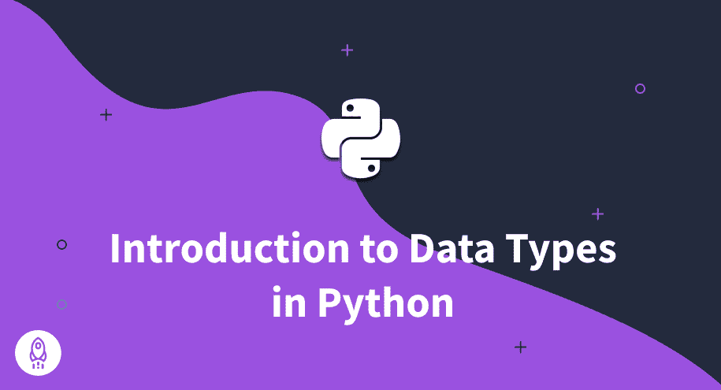

# Python 中的数据类型(简单的初学者指南)

> 原文：<https://www.dataquest.io/blog/data-types-in-python/>

August 8, 2022

### Python 实现了内置的数据类型，所以程序员需要知道他们的选项——以及何时使用每种类型

Python 是面向对象的语言，里面的一切都是对象。每个对象都是一个特定的类型，一个类定义了每个类型——这是 Python 中数据类型的定义。当实例化一个属于类的对象时，我们创建了一个新的变量——类就是这个变量的类型。

Python 有多种不同的数据类型。因此，在使用 Python 编程时，了解可用的数据类型和您正在使用的数据类型是非常重要的，因为每种类型的对象都代表不同的事物，并且有自己的方法、属性和功能。

在本文中，我们将介绍 Python 中最常用的内置数据类型，以及它们的一些方法和用例。

## 数据类型

Python 是一种动态类型语言。这意味着用户在创建变量时不需要指定变量类型，因为 Python 会自己解决这个问题。

这也意味着有可能将一个变量转换成不同于其原始类型的类型，因为，当然，这种转换是可能的(正如我们将在本文后面看到的)。

### Python 整数

在处理 Python 数字时，有两种主要选择:整数和浮点数。

顾名思义，integer 类型用于处理整数，比如年龄、年份、计数等等。

```py
>>> age = 37
>>> print(age)
```

```py
37
```

```py
>>> print(type(age))
```

```py
37
<class 'int'>
```

注意`type()`函数是如何用来显示数据类型的。此外，该函数的输出明确显示了变量`age`是`int`类的一个实例。

### Python 浮动

float 类型用于十进制数字，如体重、身高和平均值。

```py
>>> average_age = 25.5
>>> print(average_age)
```

```py
25.5
```

```py
>>> print(type(average_age))
```

```py
<class 'float'>
```

使用浮点数时，`round()`函数对于舍入小数非常有用:

```py
>>> average_age = 25.539273
>>> print(round(average_age, ndigits=1))
```

```py
25.5
```

`n_digits`参数设置小数位数。

您可以轻松地将 float 转换为 int，反之亦然，但是我们可以看到它的局限性。例如，如果将浮点数转换为整数，得到的数字将只是整数部分:

```py
>>> print(int(average_age))
```

```py
25
```

当转换进行到另一个方向时，变量的值没有变化，只是类型有变化:

```py
>>> print(float(age))
```

```py
37.0
```

### python 字符串

string 类型通常用于字符串(但更常用于文本)。字符需要放在引号中。在 Python 中，您可以使用单引号或双引号，只要您使用相同的开始和结束序列。此外，在整个代码中保持引号的选择一致也是一个好习惯。

```py
>>> name = 'Matt'
>>> email = '[[email protected]](/cdn-cgi/l/email-protection)'
>>> website = 'www.matt.com'
>>> print(name)
```

```py
Matt
```

```py
>>> print(email)
```

```py
[[email protected]](/cdn-cgi/l/email-protection)
```

```py
>>> print(website)
```

```py
www.matt.com
```

```py
>>> print(type(name))
```

```py
<class 'str'>
```

Python 中的`str`类带有多个内置方法来执行字符串操作。

例如，`replace()`方法将一个字符串中的任何字符或字符序列替换为另一个:

```py
>>> print(email.replace('dataquest.io', 'gmail.com'))
```

```py
[[email protected]](/cdn-cgi/l/email-protection)
```

`split()`方法将分割给定字符上的字符串:

```py
>>> print(website.split('.'))
```

```py
['www', 'matt', 'com']
```

以下是其他一些常用的方法:

| `upper()` | 将字符串转换为大写 |
| `lower()` | 将字符串转换为小写 |
| `title()` | 将每个单词的首字母转换为大写 |
| `find()` | 在字符串中查找指定的字符或字符序列 |
| `startswith()` | 检查字符串是否以特定字符或字符序列开头 |
| `strip()` | 删除指定的前导和尾随字符 |

### python 布尔型

布尔数据类型是一个表示两个值之一的变量:true 或 false。在 Python 中，它们由关键字`True`和`False`表示。它们有助于跟踪条件或比较值。

比较两个值时，比较的结果总是布尔值:

```py
>>> print(name == email)
```

```py
False
```

输出显示存储在`name`和`email`变量中的值不相同。但是，如果我们使用一些字符串方法，我们可以改变这个结果:

```py
>>> print(name.lower() == email.split('@')[0])
```

```py
True
```

布尔值也可以为代码设置条件。例如，我们可以将上述操作的结果赋给一个变量，并在 if 语句中使用它:

```py
>>> my_boolean = name.lower() == email.split('@')[0]
>>> if my_boolean == True:
...     print("My boolean is true")
```

```py
My boolean is true
```

```py
>>> print(type(my_boolean))
```

```py
<class 'bool'>
```

或者您可以使用较短的版本:

```py
>>> if my_boolean:
...     print('My boolean is true.')
```

```py
My Boolean is true.
```

布尔也可以作为操作符。Python 中的`and`和`or`运算符实际上是布尔运算符。它们接受两个布尔值，并根据给定的值返回一个新的布尔值。

### Python 非类型

在 Python 中，`None`关键字是 NoneType 类的一个对象，代表值的缺失(而且是 Python 的 *Null* 来自其他编程语言)。它不是零，不是假的——它一点价值都没有。

例如，当一个函数的参数没有返回值，那么它的值就是`None`。此外，当您将不返回任何内容的函数的结果赋给变量时，该变量中的值也将为 None，如下例所示:

```py
>>> def example(text):
...     print(text)
...
>>> variable = example('test')
>>> print(variable)
```

```py
test
None
```

如果你检查`variable`的类型。。。

```py
>>> print(type(variable))
```

```py
<class 'NoneType'>
```

尽管我们可以将`None`赋给一个变量，但是我们不能创建 NoneType 类的新实例。这很好:

```py
>>> a = None
>>> print(a)
```

```py
None
```

但这引发了一个错误:

```py
a = NoneType()
```

```py
NameError: name 'NoneType' is not defined
```

### Python 列表

在 Python 中，列表是存储项目集合的内置对象。它们类似于其他编程语言中的数组，但是它们在存储内容方面没有那么大的限制。列表可以包含任何数据类型的组合，包括其他列表。

例如，列表可以包含整数、浮点数、字符串、布尔值、包含其他数据类型组合的列表等等。

这里有一个例子:

```py
>>> matts_list = ['Matt', '[[email protected]](/cdn-cgi/l/email-protection)', 'www.matt.com', 37, True]
>>> print(matts_list)
```

```py
['Matt', '[[email protected]](/cdn-cgi/l/email-protection)', 'www.matt.com, 37, True]
```

您可以创建一个如上所示的已填充列表，也可以创建一个空列表并填充它。要向列表中添加值，`append()`方法很有用。下面的代码与上面的代码产生相同的输出:

```py
>>> matts_list = []
>>> matts_list.append('Matt')
>>> matts_list.append('[[email protected]](/cdn-cgi/l/email-protection)')
>>> matts_list.append('www.matt.com')
>>> matts_list.append(37)
>>> matts_list.append(True)
>>> print(matts_list)
```

```py
['Matt', '[[email protected]](/cdn-cgi/l/email-protection)', 'www.matt.com', 37, True]
```

要访问一个元素，你可以使用括号并告知元素的索引。与 Python 中的所有内容一样，第一个元素的索引为零。例如，下面是访问 Matt 电子邮件的代码:

```py
>>> matts_email = matts_list[1]
>>> print(matts_email)
```

```py
[[email protected]](/cdn-cgi/l/email-protection)
```

访问多个有序元素叫做切片，语法是`my_list[index_of_first_element: index_of_last_element + 1]`。因此，要同时访问电子邮件和网站，我们需要做的是:

```py
>>> email_website = matts_list[1:3]
>>> print(email_website)
```

```py
['[[email protected]](/cdn-cgi/l/email-protection)', 'www.matt.com']
```

注意，切片的输出也是一个列表。

以下是其他有用的方法:

| `pop()` | 移除给定索引处的项目 |
| --- | --- |
| `lower()` | 移除给定元素 |
| `clear()` | 从列表中移除所有元素 |
| `sort()` | 按字母顺序排列列表
 |

### python 元组

在 Python 中，元组是一种非常类似于列表的数据结构，但有一些重要的区别。元组是不可变的，这意味着我们在创建它们之后不能改变它们，这在您需要存储不应该被修改的数据时会很有用。

元组通常还用于存储相关的信息片段，例如点的坐标或对象的尺寸。与列表不同，元组是通过将值括在括号中创建的。这里有一个例子:

```py
>>> matts_tuple = ('Matt', '[[email protected]](/cdn-cgi/l/email-protection)', 'www.matt.com', 37, True)
>>> print(matts_tuple)
```

```py
('Matt', '[[email protected]](/cdn-cgi/l/email-protection)', 'www.matt.com', 37, True)
```

就像列表一样，元组可以存储任何类型的数据，但是因为它们不能被修改，所以只有几个方法:

1.  `count()`:统计给定值的个数
2.  `index()`:根据索引查找元素

您可以轻松地将列表存储在元组中，或者将元组存储在列表中:

```py
>>> matts_list = ['Matt', '[[email protected]](/cdn-cgi/l/email-protection)', 'www.matt.com', 37, True, (39.759991, -86.163712)]
>>> print(matts_list)
```

```py
['Matt', '[[email protected]](/cdn-cgi/l/email-protection)', 'www.matt.com', 37, True, (39.759991, -86.163712)]
```

### Python 词典

字典是一种 Python 数据结构，它以键值对的形式存储数据。这意味着每个元素都与一个键相关联，您可以使用该键来检索相应的值。

像列表一样，字典是可变的，这意味着您可以添加、删除和更新它们的条目。它们通常用于以结构化的方式存储数据。例如，您可以使用字典来存储关于一个人的信息，比如他们的姓名、年龄、地址、电话号码等等。

看看上面的`matts_list`:你不会马上知道每件事意味着什么。你知道这是关于一个人的信息——你可以看到名字、电子邮件和网站——但很难说出其他条目的意思，你只能通过索引来访问它们。

但是在字典中，您可以将每个变量与一个键配对存储，这个键使您能够知道那个变量是什么，并通过它的名称检索它。这里有一个字典的例子:

```py
>>> matts_dict = {'first_name': 'Matt', 'email':    
...              '[[email protected]](/cdn-cgi/l/email-protection)','website': 'www.matt.com', 'age': 37, 
...              'married': True,'house_coordinates': (39.759991, -86.163712)}
>>> print(matts_dict)
```

```py
{'first_name': 'Matt', 'email': '[[email protected]](/cdn-cgi/l/email-protection)', 'website': 'www.matt.com', 'age': 37, 'married': True, 'house_coordinates': (39.759991, -86.163712)}
```

好了，现在你知道 37 实际上是马特的年龄，布尔变量表示马特已婚，元组中的那些数字是他房子的坐标。

如果您想要访问任何数据，您可以通过其键的名称来调用它:

```py
>>> matts_age = matts_dict['age']
>>> print(matts_age)
```

```py
37
```

改变变量值的过程是相似的:

```py
>>> matts_dict['first_name'] = 'Matthew'
>>> print(matts_dict['first_name'])
```

```py
Matthew
```

还可以添加更多的变量:

```py
>>> matts_dict['nickname'] = 'Matt'
>>> print(matts_dict)
```

```py
{'first_name': 'Matt', 'email': '[[email protected]](/cdn-cgi/l/email-protection)', 'website': 'www.matt.com', 'age': 37, 'married': True, 'house_coordinates': (39.759991, -86.163712), 'nickname': 'Matt'}
```

字典有几个内置的方法，比如`keys(`和`values()`，它们允许你像这样访问字典中的数据:

```py
>>> print(matts_dict.keys())
```

```py
dict_keys(['first_name', 'email', 'website', 'age', 'married', 'house_coordinates', 'nickname'])
```

```py
>>> print(matts_dict.values())
```

```py
dict_values(['Matthew', '[[email protected]](/cdn-cgi/l/email-protection)', 'www.matt.com', 37, True, (39.759991, -86.163712), 'Matt'])
```

### Python 集合

在 Python 中，集合是一个集合，与列表和元组不同，它是无序和无索引的，这意味着不可能通过索引访问任何项目。我们使用集合来存储唯一值，因为它们不能有重复。

我们可以使用集合来执行数学集合运算，如并、交和差。我们把它们写在大括号里:

```py
>>> matts_set = {'Matt', '[[email protected]](/cdn-cgi/l/email-protection)', 'www.matt.com', 37, True, (39.759991, -86.163712)}
>>> print(matts_set)
```

```py
{True, 37, 'www.matt.com', '[[email protected]](/cdn-cgi/l/email-protection)', 'Matt', (39.759991, -86.163712)}
```

请注意，输出中集合的顺序与代码中的顺序不同。这是因为，如前所述，集合根本不存储任何顺序。

我们还使用集合来删除列表中的重复项。一旦您将一个有重复项的列表转换成一个集合，它将丢失重复项，然后您可以将它转换回一个列表，得到一个没有重复项的列表:

```py
>>> duplicates_list = ['Matt', 'Matt', 37]
>>> set_from_list = set(duplicates_list)
>>> new_list = list(set_from_list)
>>> print(new_list)
```

```py
[37, 'Matt']
```

当然，它将是无序的。

## 结论

在本文中，我们介绍了最重要和最常用的 Python 数据类型的主要特征和方法:

*   `Int`
*   `Float`
*   `Str`
*   `Bool`
*   `List`
*   `Tuple`
*   `Dict`
*   `Set`